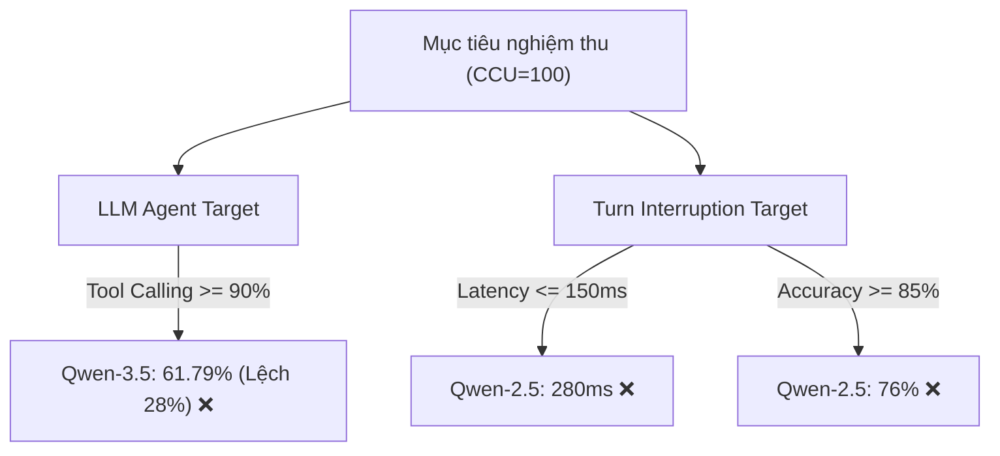

# 01 — Khảo Sát Hiện Trạng, Đề Bài và Phạm Vi Dự Án Voice AI Agent

> [!NOTE]
> Tài liệu này tổng hợp hiện trạng năng lực vận hành, đặc tả đề bài kỹ thuật từ FCI, phân tích các chỉ số nghiệm thu thực tế, và xác định rõ phạm vi (scope) triển khai cho dự án trợ lý thoại thông minh.

---

## 1. Dẫn dắt bối cảnh

- **Năng lực hạ tầng và định hướng của FCI**:
  - FPT Smart Cloud (FCI) sở hữu hạ tầng tính toán mạnh mẽ với quy mô hàng ngàn GPU phục vụ tối ưu hóa các giải pháp trí tuệ nhân tạo.
  - Định hướng phát triển cốt lõi của đơn vị tập trung vào việc cung cấp các dịch vụ Agent thông minh như tổng đài tự động (voice-bot) và hệ thống phân tích hình ảnh giám sát (video-bot).

- **Nghịch lý trong triển khai thực tế**:
  - Tại sao mặc dù sở hữu các dòng mô hình ngôn ngữ lớn đạt tỷ lệ tuân thủ prompt xuất sắc (~95%) trên phòng lab, voice-bot vẫn gặp thất bại nghiêm trọng khi vận hành thực tế ở các chỉ số gọi hàm (chỉ đạt ~61% so với mục tiêu 90%) và trễ phản xạ ngắt lời (280ms so với mục tiêu 150ms)?
  - Làm thế nào để đội ngũ nghiên cứu định vị chính xác khoảng trống công nghệ và phân tách các bài toán con trước khi cam kết triển khai sản phẩm?

- **Mục tiêu của tài liệu**:
  
  Tài liệu này sẽ khung hóa lại đề bài tổng đài tự động của FCI, chỉ ra khoảng cách chi tiết giữa chỉ số benchmark hiện tại so với mục tiêu nghiệm thu dưới tải trọng cao, và khoanh vùng phạm vi thực hiện tối ưu.

---

## 2. Glossary

Bảng Glossary dưới đây định nghĩa toàn bộ ký hiệu và thuật ngữ viết tắt xuất hiện trong bài:

| Ký hiệu / Thuật ngữ | Tên đầy đủ tiếng Anh | Giải nghĩa tiếng Việt |
| :--- | :--- | :--- |
| `ASR` | **Automatic Speech Recognition** | Hệ thống tự động nhận dạng giọng nói. |
| `TTS` | **Text-to-Speech** | Hệ thống tổng hợp văn bản thành giọng nói. |
| `VAD` | **Voice Activity Detection** | Bộ phát hiện hoạt động giọng nói (phân biệt âm thanh và khoảng lặng). |
| `CCU` | **Concurrent Users** | Số lượng cuộc gọi đồng thời chạy trong hệ thống. |
| `TTFT` | **Time to First Token** | Thời gian phản hồi ra token văn bản đầu tiên của LLM. |
| `TTFS` | **Time to First Sound / Speech** | Thời gian từ lúc user dứt câu đến khi nghe tiếng bot phản hồi đầu tiên. |
| `WER` | **Word Error Rate** | Tỷ lệ lỗi từ trong nhận dạng giọng nói. |
| `LLM` | **Large Language Model** | Mô hình ngôn ngữ lớn. |
| `FCI` | **FPT Smart Cloud** | Đơn vị cung cấp hạ tầng đám mây và giải pháp AI thuộc FPT. |

---

## 3. Hiện Trạng Tổ Chức và Định Hướng Nghiên Cứu

Đội ngũ triển khai dự án đối diện với các cơ hội hạ tầng lớn song hành cùng các hạn chế về mặt kinh nghiệm thực chiến:

- **Thế mạnh và năng lực cốt lõi**:
  - Đội ngũ định hướng nghiên cứu và phát triển (Research & Development oriented).
  - Có tư duy tốt trong việc khảo sát mô hình học sâu, thực nghiệm thuật toán, viết bài báo khoa học và đóng gói các bản thử nghiệm (PoC/Demo).
  - Được hậu thuẫn bởi hạ tầng tính toán lớn (~3000 GPU NVIDIA từ AI Factory).

- **Hạn chế trong triển khai sản phẩm**:
  - Chưa tích lũy nhiều kinh nghiệm thực tiễn về triển khai hệ thống thương mại quy mô lớn.
  - Thiếu cảm quan thị trường thực tế để nhận diện đâu là tính năng mang lại giá trị cốt lõi cho doanh nghiệp.

- **Chiến lược hành động**:
  - Giai đoạn này tập trung khảo sát thị trường sâu rộng, nghiên cứu các công bố khoa học mới nhất kết hợp với các mã nguồn mở SOTA.
  - Sử dụng 2 tài liệu thiết kế nội bộ của FCI làm cột mốc định hướng để thống nhất ngôn ngữ kỹ thuật với đội ngũ phát triển sản phẩm (Product Team).

---

## 4. Đặc Tả Đề Bài Kỹ Thuật (FCI Voice-Bot)

Mục tiêu tối thượng là xây dựng thế hệ voice-bot **giao tiếp tự nhiên, thân thiện và có tính hướng đích cao**:

- **Tính chất môi trường viễn thông**:
  - Vận hành trực tiếp trên kênh tổng đài điện thoại truyền thống với tần số lấy mẫu băng hẹp (narrowband 8kHz) đi kèm nhiều nhiễu nền phức tạp.

- **Khả năng nghe hiểu có chọn lọc (Selective Attention)**:
  - Có khả năng duy trì nội dung và mục tiêu hội thoại ngay cả khi môi trường truyền dẫn bị ồn ào hoặc ngắt quãng tín hiệu.

- **Phản hồi tự nhiên và thông minh**:
  - **Lập tức dừng phát**: Khi khách hàng nói chen ngang (barge-in) để đính chính hoặc cung cấp thông tin mới.
  - **Chủ động hỏi lại**: Kích hoạt kịch bản fallback khi điểm tin cậy nhận dạng ASR rơi xuống dưới ngưỡng an toàn.
  - **Bám sát luồng nghiệp vụ**: Ngăn ngừa hiện tượng bot bị dẫn dắt lan man theo các câu hỏi ngoài lề của khách hàng, gây lãng phí tài nguyên và kéo dài cuộc gọi.

---

## 5. Vai Trò Của Hai Tài Liệu Thiết Kế Nội Bộ

Dự án được định hướng bởi hai góc nhìn bổ trợ nhau trong cùng một luồng xử lý tín hiệu:

| Tên tài liệu | Câu hỏi cốt lõi cần giải quyết | Đầu ra kỹ thuật chính |
| :--- | :--- | :--- |
| **01 — Kiến trúc hệ thống** | Hệ thống gồm những lớp chức năng nào và ghép nối tuần tự ra sao? | Đặc tả 4 lớp xử lý (Tiếp nhận tín hiệu $\rightarrow$ Agent lõi $\rightarrow$ Bổ trợ công cụ $\rightarrow$ Kiểm soát an toàn đầu ra). |
| **02 — Xây dựng mô hình LLM** | Cần huấn luyện và đo lường mô hình LLM cho các tác vụ nào để đạt chỉ số nghiệm thu? | Định nghĩa 2 tác vụ LLM (Agent và Turn Interruption), kèm bộ chỉ số benchmark và ngưỡng nghiệm thu. |

---

## 6. Tiêu Chí Nghiệm Thu và Khoảng Cách Hiện Tại

Toàn bộ các chỉ số benchmark hiện tại của hệ thống mới chỉ được đo đạc ở tải tĩnh cực thấp (**CCU = 5**), trong khi mục tiêu nghiệm thu thực tế yêu cầu giữ vững hiệu năng dưới tải cao (**CCU = 100**).

### 6.1 Tầng LLM Agent (Hội thoại và Gọi hàm)

| Chỉ số đánh giá | Ngưỡng mục tiêu (CCU=100) | gemma-3-27b-it | gpt-oss-120b | Qwen-3.5-35B-A3B | Trạng thái hiện tại |
| :--- | :--- | :---: | :---: | :---: | :---: |
| **Mean TTFT** | $\le$ 800ms | ~700ms | ~1400ms | **~500ms** | Đạt yêu cầu. |
| **P95 TTFT** | $\le$ 1200ms | ~1800ms | ~5000ms | **~1200ms** | Đạt yêu cầu. |
| **Mean TTFS** | $\le$ 1200ms | ~900ms | ~6000ms | **~1000ms** | Đạt yêu cầu. |
| **P95 TTFS** | $\le$ 2400ms | ~2300ms | ~10000ms | **~2100ms** | Đạt yêu cầu. |
| **Prompt Compliance** | $\ge$ 90% | 81.17% | 83.96% | **94.91%** | **Đạt yêu cầu ✅** |
| **Tool Calling Accuracy** | $\ge$ 90% | 53.09% | 52.14% | **61.79%** | **Thất bại ❌ (Lệch ~28%)** |

### 6.2 Tầng Turn Interruption (Quản lý lượt lời - Qwen-2.5-7B-Instruct)

| Chỉ số đánh giá | Ngưỡng mục tiêu (CCU=100) | Kết quả đo hiện tại | Trạng thái hiện tại |
| :--- | :--- | :---: | :---: |
| **Latency (Độ trễ ngắt)** | $\le$ 150ms | ~280ms | **Thất bại ❌** |
| **Accuracy (Độ chính xác)** | $\ge$ 85% | 76% | **Thất bại ❌** |

- **Kết luận chẩn đoán**:
  - Trục trễ TTFT và khả năng tuân thủ prompt của dòng Qwen-3.5-35B **đã đạt yêu cầu**. Do đó, chúng ta không cần xây dựng lại từ đầu kiến trúc tác nhân lõi.
  - Điểm nghẽn nghiêm trọng nhất nằm ở **độ chính xác gọi hàm (tool-calling)** và **hiệu năng của bộ quản lý lượt lời (Turn Interruption)**.

---

### 6.3 Sơ đồ khoảng cách hiệu năng hiện tại so với mục tiêu

#### Khung đọc sơ đồ khoảng cách hiệu năng:
- **Đề bài cần giải**: Định vị các khoảng lệch hiệu năng của hệ thống so với tiêu chuẩn nghiệm thu CCU = 100.
- **Giả định nền**: Các chỉ số được đo đạc đồng bộ trên cùng một kịch bản kiểm thử nghiệp vụ.
- **Ý nghĩa các khối**:
  - `Goal` / `LLMGoal` / `TIGoal`: Các tiêu chuẩn nghiệm thu đích.
  - Các khối màu đỏ có dấu `❌`: Kết quả đo thực tế của các mô hình hiện tại kèm khoảng cách cần san lấp.
- **Cách đọc và ứng dụng**: Giúp đội ngũ nghiên cứu tập trung 100% nguồn lực vào hai chốt chặn đang thất bại là nâng độ chính xác gọi hàm của LLM và tối ưu thời gian phản xạ ngắt lời của Turn Interruption, tránh refactor các phần đã đạt như prompt compliance.

---

## 7. Xác Định Phạm Vi Triển Khai (Scope)

Phạm vi công việc của dự án được phân định rõ ràng để bảo đảm tính thực thi:

- **Nội dung nằm TRONG phạm vi (In-Scope)**:
  - Khảo sát sâu và định nghĩa chi tiết các bài toán con thành phần.
  - Đối chiếu và đánh giá năng lực của các giải pháp SOTA/open-source.
  - Thiết kế kiến trúc phễu xử lý đa tầng (multi-solution-stack) tối ưu hóa chi phí và tốc độ.
  - Thực hiện các thí nghiệm đo đạc và đánh giá độc lập khi được bàn giao hạ tầng tính toán.

- **Nội dung nằm NGOÀI phạm vi (Out-of-Scope)**:
  - Triển khai toàn diện hệ thống production thương mại, đấu nối trực tiếp với hạ tầng viễn thông tổng đài thật.
  - Huấn luyện lại các mô hình nền tảng ở quy mô lớn (nhiệm vụ này đòi hỏi hạ tầng GPU và quyền truy cập sâu vào hệ thống FCI).

- **Nội dung ủy thác sang dự án bổ trợ**:
  - Việc nghiên cứu và huấn luyện mô hình nhận dạng giọng nói tiếng Việt chuyên biệt được thực hiện độc lập tại dự án [nvidia_asr_nemo](file:///home/kyle/work/startup/_0_iruka/_1_backend/nvidia_asr_nemo).

---

## 8. ✅ Tự Kiểm Nhanh

<b>Câu hỏi 1: Chức năng "Nghe hiểu có chọn lọc" (Selective Attention) của đề bài được phân rã giải quyết ở những thành phần kỹ thuật nào trong hệ thống?</b>

- **Phân rã kỹ thuật**:
  - **Tầng Quản lý lượt lời (Turn-Taking)**: Nhận biết chính xác khi nào người dùng kết thúc câu nói thông qua phân tích ngữ âm và ngữ điệu (prosody), tránh việc bot phản hồi quá sớm khi người dùng chỉ ngưng nghỉ ngắn để lấy hơi.
  - **Tầng Nhận diện ngắt lời (Interruption Detection)**: Khi bot đang phát âm thanh, hệ thống phải phân biệt được âm thanh chen ngang là tiếng đệm (backchannel - bot tiếp tục nói) hay ý định ngắt lời thực sự (barge-in - bot dừng phát TTS ngay lập tức).
  - **Tầng Điều phối (Orchestrator)**: Giữ vững hướng kịch bản nghiệp vụ, loại bỏ các câu hỏi ngoài lề hoặc các nhiễu thông tin do ASR giải mã sai để dẫn dắt cuộc gọi về đúng mục tiêu giao dịch.

<b>Câu hỏi 2: Tại sao chúng ta không gộp toàn bộ mã nguồn của dự án này vào kho lưu trữ (repo) của `nvidia_asr_nemo`?</b>

- **Nguyên lý phân cấp hệ thống**:
  - Mô hình nhận dạng giọng nói (ASR/STT) chỉ đóng vai trò là một lớp chức năng tiếp nhận tín hiệu đầu vào của toàn bộ hệ thống voice-bot.
  - Dự án Voice AI Agent có quy mô kiến trúc rộng hơn rất nhiều, bao gồm các lớp quản lý lượt lời, điều phối LLM, hệ thống công cụ bổ trợ, bộ lọc an toàn guardrail, và tổng hợp giọng nói TTS.
  - Việc phân tách thành hai repo độc lập giúp cô lập phạm vi kiểm thử; repo `nvidia_asr_nemo` tập trung tối ưu hóa độ chính xác ASR tiếng Việt sạch và trả về thư viện liên kết, trong khi dự án hiện tại tập trung hoàn toàn vào logic điều phối và trải nghiệm đàm thoại thời gian thực.

