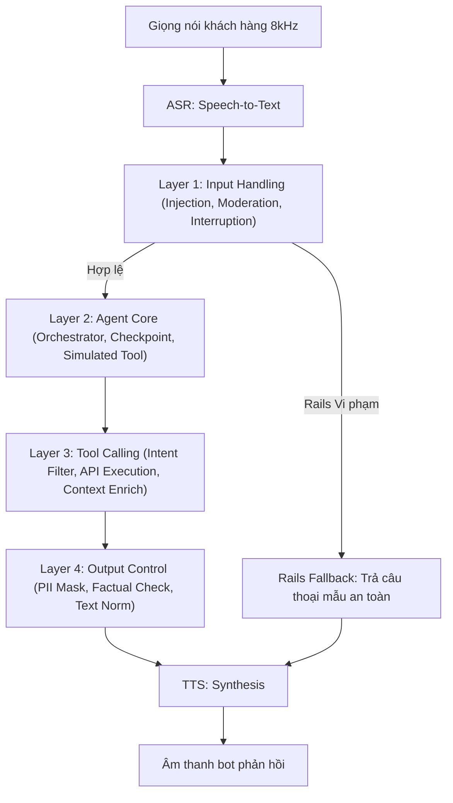
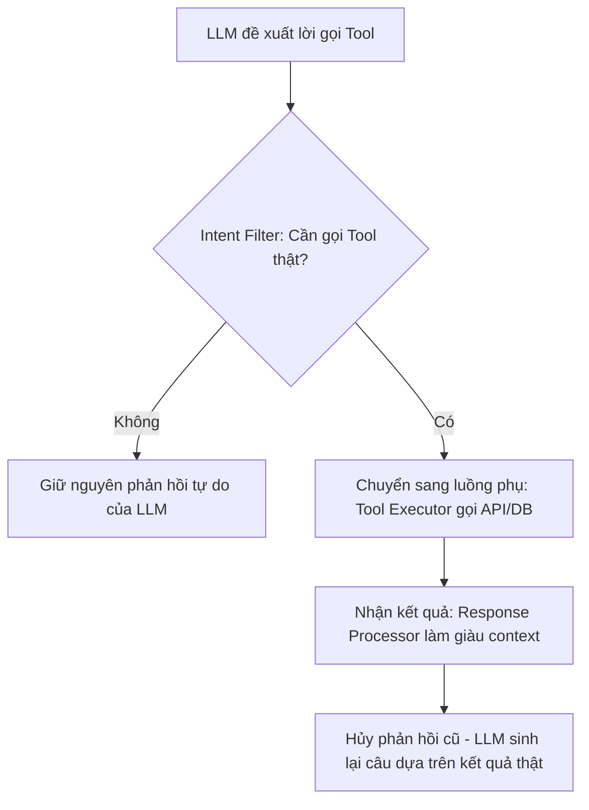

# 02 — Kiến Trúc Hệ Thống Voice AI Agent: Thiết Kế Phân Lớp và Bộ Chỉ Số Thành Phần

> [!NOTE]
> Tài liệu này mô tả chi tiết kiến trúc tổng thể 4 lớp xử lý tín hiệu của Voice AI Agent, đối chiếu với các giải pháp SOTA trên thị trường, và thiết lập bản đồ giải pháp phân tầng (multi-solution-stack) tối ưu hóa độ trễ phản hồi.

---

## 1. Dẫn dắt bối cảnh

- **Yêu cầu phối hợp hệ thống phức tạp**:
  - Khi thiết kế kiến trúc hệ thống Voice AI Agent phục vụ tổng đài viễn thông, việc phân cấp và điều phối tín hiệu giữa các tầng xử lý (ASR, Orchestrator, LLM, TTS) là yếu tố quyết định độ tin cậy và hiệu năng của bot.
  - Hệ thống cần giải quyết đồng thời bài toán kiểm soát luồng nghiệp vụ chặt chẽ, bảo vệ thông tin khách hàng, và duy trì phản xạ thời gian thực.

- **Nghịch lý của mô hình tích hợp**:
  - Làm thế nào để ghép nối các thành phần riêng lẻ thành một pipeline đàm thoại thống nhất, vừa kiểm soát chặt chẽ quy trình nghiệp vụ tài chính, vừa đảm bảo tính bảo mật PII, mà vẫn không làm tích lũy độ trễ phản hồi (latency) quá ngưỡng chịu đựng?
  - Tại sao kiến trúc cascade có guardrail phân lớp tách biệt lại đang là lựa chọn chính thống và an toàn hơn so với các mô hình Speech-to-Speech (S2S) tích hợp của Big Tech cho domain tổng đài doanh nghiệp?

- **Mục tiêu của tài liệu**:
  
  Tài liệu này sẽ đặc tả dòng chảy tín hiệu qua 4 lớp xử lý của FCI, phân tích cơ chế simulated tool-calling, và định hình giải pháp qua bản đồ multi-solution-stack.

---

## 2. Glossary

Bảng Glossary dưới đây định nghĩa toàn bộ ký hiệu và thuật ngữ viết tắt xuất hiện trong bài:

| Ký hiệu / Thuật ngữ | Tên đầy đủ tiếng Anh | Giải nghĩa tiếng Việt |
| :--- | :--- | :--- |
| `ASR` | **Automatic Speech Recognition** | Nhận dạng giọng nói (Speech-to-Text). |
| `TTS` | **Text-to-Speech** | Tổng hợp giọng nói (Text-to-Speech). |
| `PII` | **Personally Identifiable Information** | Thông tin nhận dạng cá nhân nhạy cảm (CCCD, SĐT, OTP, PIN). |
| `VAD` | **Voice Activity Detection** | Bộ phát hiện hoạt động giọng nói dựa trên năng lượng hoặc mô hình. |
| `S2S` | **Speech-to-Speech** | Mô hình tích hợp xử lý trực tiếp từ âm thanh đầu vào sang âm thanh đầu ra. |
| `CCU` | **Concurrent Users** | Số lượng cuộc gọi đồng thời trong hệ thống. |
| `TTFS` | **Time to First Sound / Speech** | Thời gian từ lúc user dứt câu đến khi nghe tiếng bot phản hồi đầu tiên. |
| `DSP` | **Digital Signal Processing** | Xử lý tín hiệu số. |
| `DL` / `ML` | **Deep Learning / Machine Learning** | Học sâu / Học máy. |

---

## 3. Bốn Lớp Xử Lý Tín Hiệu (Kiến Trúc Nội Bộ)

Kiến trúc hệ thống được thiết kế theo mô hình cascade 4 lớp xử lý độc lập tuần tự:

### 3.1 Layer 1 — Tiếp Nhận và Xử Lý Đầu Vào (Input Handling)
- **Nhận dạng ngắt lời bằng ngữ nghĩa (Semantic Interruption)**:
  - Phân tích văn bản giải mã từ ASR để phân biệt chính xác ý định chen ngang thật (ví dụ: "Từ từ đã em", "Không đúng") với các phản hồi đệm backchannel (ví dụ: "Ừ", "Dạ", "Ờ").
  - Nếu xác nhận ý định ngắt thật: Phát lệnh dừng luồng sinh LLM (LLM streaming) và ngắt tín hiệu TTS đầu ra ngay lập tức.
- **Bộ lọc an toàn đầu vào (Input Guardrails)**:
  - *Prompt Injection*: Chặn các nỗ lực thao túng chỉ thị hệ thống hoặc tiêm thông tin sai lệch từ phía khách hàng.
  - *Content Moderation*: Lọc bỏ ngôn từ thô tục, bạo lực, thù địch hoặc chính trị nhạy cảm.
- **Cơ chế Rails Fallback**:
  - Khi phát hiện vi phạm bảo mật ở Input Rails: Hệ thống bỏ qua toàn bộ luồng xử lý chính của Orchestrator, kích hoạt sinh câu trả lời an toàn mẫu để trả thẳng ra TTS.

---

### 3.2 Layer 2 — Tác Nhân Lõi Điều Phối (Agent Core / Orchestrator)
- **Bộ điều phối trung tâm (Orchestrator)**:
  - Dựa trên cấu hình sơ đồ kịch bản (Bot Builder) để thực hiện handoff (chuyển giao giữa các agent con), điều hướng path nghiệp vụ và cập nhật trạng thái hội thoại.
- **Cơ chế ASR Fallback**:
  - Khi độ tin cậy giải mã ASR quá thấp hoặc không khớp với bất kỳ path nào: Kích hoạt kịch bản hỏi lại lịch sự ("Dạ, em nghe chưa rõ lắm, anh/chị nói lại được không ạ?").
- **Simulated Tool-Calling (Gọi hàm giả lập)**:
  - *Cơ chế*: Chèn một lời gọi hàm ảo (fake tool) mang tên `what_should_I_do_next` kèm theo các lập luận giả (fake reasoning) và kết quả giả (fake tool result) trực tiếp vào luồng xử lý của LLM để định hướng mô hình bám sát bước kịch bản hiện tại.
  - *Cách nhận diện*: Log Prompt của hệ thống chứa các cấu trúc hướng dẫn chi tiết của duy nhất bước hiện hành thay vì toàn bộ sơ đồ kịch bản.
  - *Ý nghĩa*: Triệt tiêu hiện tượng mô hình bỏ sót bước nghiệp vụ hoặc tự ý đi chệch khỏi quy trình đàm thoại chuẩn hóa (conversation flow).
  - *Bẫy*: Quá trình tiêm context giả lập có thể làm nhiễu khả năng tự suy luận của mô hình nếu thiết kế schema các bước không đồng bộ.

---

### 3.3 Layer 3 — Quản Lý Gọi Công Cụ (Tool Calling)
- **Tách biệt luồng xử lý**:
  - Phân tách nhiệm vụ của Agent chính (lo suy luận ngữ cảnh và diễn đạt tự nhiên) với luồng phụ (đảm bảo tính chính xác của các lời gọi API/Database).
- **Ngăn chặn ảo giác số liệu (Two-pass Response Loop)**:
  - *Cơ chế*: Phân tách quy trình hồi đáp của bot thành hai lượt xử lý: Lượt 1 chỉ tập trung định dạng hành động nghiệp vụ và gọi API lấy dữ liệu xác thực; Lượt 2 sử dụng dữ liệu thực tế đó để viết lại hoàn toàn câu trả lời tự nhiên của bot, loại bỏ các dự đoán suy đoán trước đó của LLM.
  - *Cách nhận diện*: Trạng thái session chat lưu trữ một luồng xử lý trung gian trích xuất API trước khi sinh văn bản cho TTS.
  - *Ý nghĩa*: Giảm thiểu tỷ lệ ảo giác của LLM về mặt số liệu tài chính đến mức tối đa.
  - *Bẫy*: Làm tăng đáng kể độ trễ phản hồi (TTFS) do phải gọi mô hình ngôn ngữ hai lượt liên tiếp.

---

### 3.4 Layer 4 — Kiểm Soát Đầu Ra (Output Control)
- **PII Guardrails (Bảo vệ thông tin nhạy cảm)**:
  - *Cơ chế*: Sử dụng các bộ phát hiện NER kết hợp biểu thức chính quy (Regex) và máy trạng thái để giám sát đầu ra văn bản sinh từ LLM, tự động bọc thẻ bảo mật `<forbidden>` quanh các dữ liệu nhạy cảm hoặc triệt tiêu phản hồi và yêu cầu tái tạo lại.
  - *Cách nhận diện*: Các chuỗi ký tự dạng OTP, số PIN hoặc password bị che hoặc chuyển thành thông báo cảnh báo lỗi an toàn.
  - *Ý nghĩa*: Bảo vệ tuyệt đối bí mật của khách hàng trước các lỗi ảo giác (hallucination) của LLM vốn có thể tự ý bịa hoặc tiết lộ thông tin mật của người dùng khác.
  - *Bẫy*: Bộ lọc quá nhạy có thể che nhầm các số hiệu hợp đồng hoặc con số nghiệp vụ lành tính (over-blocking).
- **Output Rail (Factual Rail)**:
  - Đối chiếu con số trong câu trả lời của LLM với kết quả trả về thực tế từ Tool ở Layer 3, tự động sửa đổi hoặc chặn phát nếu phát hiện mô hình bịa số liệu.
- **Text Normalization (TN)**:
  - Chuẩn hóa viết tắt, số tiền, ngày tháng thành âm tiết chữ đọc để TTS phát âm chính xác và tự nhiên.

---

### 3.5 Sơ đồ quy trình hoạt động của các lớp xử lý

#### Khung đọc sơ đồ quy trình xử lý:
- **Đề bài cần giải**: Điều phối dòng chảy tín hiệu qua 4 lớp chức năng để bảo đảm an toàn dữ liệu và tính chính xác nghiệp vụ.
- **Giả định nền**: Tất cả các lớp được thiết kế dưới dạng module hóa, cho phép thay thế hoặc nâng cấp độc lập từng cấu phần.
- **Ý nghĩa các khối**:
  - `L1` đến `L4`: Các lớp xử lý logic trung gian.
  - `Fallback`: Luồng xử lý tắt bỏ qua agent core khi phát hiện nguy cơ an ninh.
- **Cách đọc và ứng dụng**: Quy trình chạy tuần tự; nhấn mạnh việc phân tách rõ ràng trách nhiệm giữa Agent Core (suy luận) và các lớp Guardrail (bảo mật, kiểm duyệt) để giữ tính an toàn cho hệ thống tổng đài tài chính.

---

### 3.6 Sơ đồ luồng phụ gọi công cụ (Layer 3)

#### Khung đọc sơ đồ luồng phụ gọi công cụ:
- **Đề bài cần giải**: Ngăn chặn hiện tượng mô hình tự bịa số liệu giao dịch bằng cách ép lấy dữ liệu thực tế từ hệ thống.
- **Giả định nền**: Các API/Database trả về phản hồi trong thời gian ngắn (<100ms).
- **Ý nghĩa các khối**:
  - `Intent Filter`: Chốt kiểm tra xác định hành động của bot.
  - `Step6`: Bước sinh lại phản hồi (feedback loop) để bảo đảm tính chính xác factual.
- **Cách đọc và ứng dụng**: Luồng xử lý rẽ nhánh rõ ràng; giúp kỹ sư hiểu rõ cơ chế Two-pass hoạt động để kiểm soát lỗi ảo giác số liệu trước khi đẩy xuống các lớp kiểm duyệt đầu ra.

---

## 4. Bản Đồ Giải Pháp Phân Tầng (Multi-Solution-Stack)

Để đáp ứng các ràng buộc khắt khe về mặt độ trễ trong tổng đài thoại, hệ thống áp dụng triết lý **phễu lọc giảm tải**: Sử dụng giải pháp Heuristic/Rule-based giá rẻ ở tầng ngoài, chỉ chuyển tiếp các ca phức tạp vào mô hình học sâu hoặc mô hình lớn.

| Tác vụ thành phần | Tầng 1: Rule-based / Regex (<1ms) | Tầng 2: Deep Learning cỡ nhỏ (Chục ms) | Tầng 3: Large Model (Trăm ms) | Layer liên kết |
| :--- | :--- | :--- | :--- | :---: |
| **VAD / Phân đoạn** | Ngưỡng năng lượng âm thanh, im lặng cứng. | Mô hình VAD học sâu chuyên dụng (Silero). | — | 03 |
| **Lọc nhiễu / Đánh giá** | Bộ lọc Wiener, trừ phổ truyền thống. | Mô hình lọc nhiễu học sâu (DNS-style). | — | 03 |
| **Nhận dạng giọng nói (ASR)** | — | Fine-tune Conformer/Whisper ở dải tần 8kHz. | ASR kết hợp LLM giải mã ngữ nghĩa. | 04 |
| **Ngắt lời (Turn Interruption)** | Từ điển từ đệm (backchannel) + VAD. | Mô hình phân loại prosody nhỏ (Smart Turn). | LLM phân loại nhị phân (Qwen 7B). | 05 |
| **Bảo mật đầu vào** | Blocklist các cụm từ cấm, jailbreak. | Mô hình BERT-style (Prompt Guard 2). | LLM đánh giá độ an toàn ngữ cảnh. | 07 |
| **Chọn công cụ (Selection)** | Bộ luật định tuyến ý định (intent rules). | Mô hình phân loại ý định cỡ nhỏ (Intent Classifier). | LLM sinh lời gọi hàm tự động. | 06 |
| **Lọc PII đầu ra** | Regex CCCD, SĐT, số thẻ kèm thuật toán Luhn. | Presidio + PhoBERT-NER phát hiện thực thể. | LLM Judge đối chiếu ngữ cảnh. | 07 |

---

## 5. ✅ Tự Kiểm Nhanh

<b>Câu hỏi 1: Tại sao cơ chế Simulated Tool-Calling lại giúp nâng cao tính nhất quán của hội thoại và giảm thiểu hiện tượng bot nói lan man?</b>

- **Cơ chế hoạt động**:
  - Trong các hệ thống đàm thoại thông thường, việc nạp toàn bộ kịch bản và hướng dẫn nghiệp vụ đồ sộ vào System Prompt dễ khiến mô hình bị quá tải thông tin, dẫn đến việc bỏ sót bước hoặc bị khách hàng dẫn dắt đi chệch luồng.
  - Simulated Tool-Calling giải quyết vấn đề này bằng cách cô lập chỉ chỉ dẫn của **duy nhất bước hiện tại** (checkpoint) dưới dạng kết quả của một hàm giả lập `what_should_I_do_next`.
  - Mô hình LLM lúc này bị bắt buộc phải hoạt động giống như một máy trạng thái: Nó chỉ nhìn thấy và thực thi hướng dẫn của bước hiện hành, triệt tiêu khả năng nhảy cóc kịch bản hoặc suy đoán tự do các bước tiếp theo.

<b>Câu hỏi 2: Sự đánh đổi lớn nhất khi áp dụng cơ chế Two-pass Response Loop ở Layer 3 để chống ảo giác số liệu là gì?</b>

- **Sự đánh đổi về Latency**:
  - Cơ chế Two-pass yêu cầu gọi mô hình ngôn ngữ lớn hai lần liên tiếp: Lần 1 để trích xuất ý định gọi API và Lần 2 để tổng hợp câu trả lời sau khi nhận dữ liệu thật.
  - Việc này làm **tăng gấp đôi độ trễ phản hồi ra token đầu tiên (TTFT)** của hệ thống.
  - Do đó, kỹ sư chỉ nên kích hoạt luồng phụ Two-pass khi bộ lọc nhận diện ý định (Intent Filter) xác nhận câu thoại của khách hàng thực sự yêu cầu truy vấn dữ liệu động từ hệ thống, các lượt thoại thông thường không chứa thực thể số liệu cần được đi thẳng qua luồng đơn (One-pass) để giữ latency thấp.

