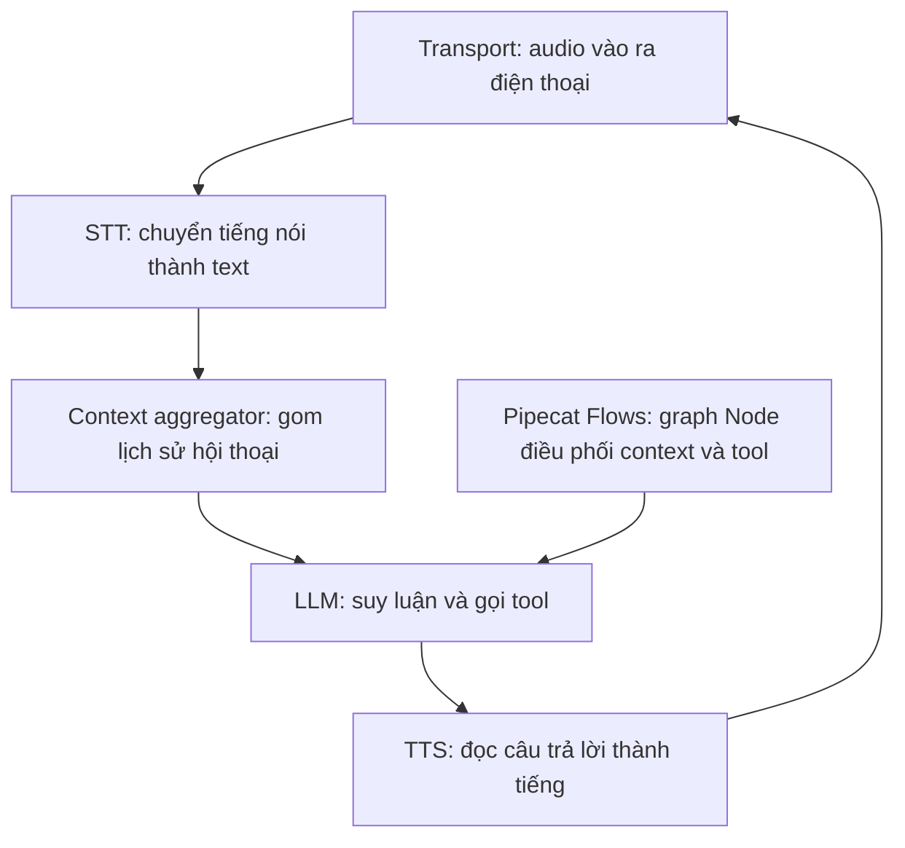

# 02.02 — Pipecat làm Kiến Trúc Tham Chiếu: Chuẩn Hóa Bài Toán Architecture và Model cho Voice Agent FCI

> [!NOTE]
> Tài liệu này bóc tách kiến trúc của **Pipecat** (framework open-source xây voice-agent realtime) thành các capability axis có hệ thống, rồi đối chiếu 1-1 với kiến trúc 4-layer nội bộ của FCI để **chuẩn hóa từ vựng và phân loại bài toán**. Mục tiêu: có một bộ khái niệm thống nhất để cả team cùng nói chung một ngôn ngữ khi thiết kế, và tách bạch đâu là _architecture problem_ (cách ghép module) với _model problem_ (mỗi điểm cần model gì).
>
> Nguồn tham chiếu: bản clone `pipecat-ai/docs` (cụm `pipecat/learn`, `pipecat/fundamentals`, `pipecat-flows/`). Các đường dẫn cụ thể liệt kê ở §9. Số liệu hiệu năng dẫn lại từ doc Pipecat **chưa được đo lại độc lập**, đánh dấu _(chưa xác minh)_.
>
> **Tài liệu liên quan:** `00_README.md` (kiến trúc 4-layer FCI), `01_fpt_vs_sota.md` (Cascade vs S2S), `05_turn_interruption/` (bài turn-detection chi tiết), `06_llm_agent/` (orchestration + tool-calling).

---

## 1. Dẫn dắt bối cảnh

- **Vì sao lấy Pipecat làm tham chiếu**:
  - FCI đã có khung kiến trúc 4-layer và một số ý tưởng riêng (simulated tool-calling, layered rails), nhưng phần code và experiment hiện còn là black-box với team Multimodal.
  - Pipecat tổ chức bài toán voice-agent rất mạch lạc theo hai layer tách biệt:
    - **pipeline mechanics** (data flow)
    - **conversation logic** (Finite-State-Machine có mục tiêu).

- **Bốn đặc điểm của Pipecat đáng để chuẩn hóa theo**:
  - **Chia hội thoại thành Node + Flow**: mỗi Node lo đúng một sub-goal, với bộ prompt gọn và chỉ những tool Node đó cần; chuyển Node qua function. Biến hội thoại có mục tiêu thành một **Finite-State-Machine (FSM)** chặt chẽ.
  - **Quản lý tool-calling và shared state** giữa các Node để ghi nhớ dữ liệu trích xuất được trong suốt cuộc thoại.
  - **Cơ chế hook (pre/post action)** của mỗi Node để chèn linh hoạt các bước xử lý trung gian mà không làm rối các module.
  - **Modular pipeline**: mỗi khâu (voice → llm → tts) là một FrameProcessor thay thế được độc lập.

- **Nghịch lý cần làm rõ**:
  - FCI mô tả cơ chế của mình là _simulated tool-calling_ kèm _orchestrator + bot builder_ — về bản chất là một **FSM dựng tay**.
  - Ba câu hỏi cần làm rõ:
    - simulated tool-calling tương ứng với khái niệm nào trong Pipecat,
    - phần nào FCI đang dựng lại thứ Pipecat đã chuẩn hóa,
    - phần nào trong cách làm của FCI là riêng và hợp lý, cần giữ.

- **Mục tiêu của tài liệu**:

  Bóc tách Pipecat thành 5 capability axis, lập bảng đối chiếu FCI ↔ Pipecat, và chuẩn hóa bài toán theo hai trục _architecture_ và _model_.

  > Đây là **tài liệu tham chiếu chi tiết** để team hiểu sâu, rõ ràng cơ chế Pipecat — không phải slide. Bản slide trình bày cho team sẽ làm riêng sau (format khác, ưu tiên hình vẽ/sơ đồ), dựa trên hiểu biết tích lũy từ tài liệu này.

---

## 2. Glossary

Bảng dưới định nghĩa các thuật ngữ Pipecat dùng xuyên suốt tài liệu:

| Thuật ngữ          | Tên đầy đủ / nguồn             | Giải nghĩa tiếng Việt                                                                                |
| :----------------- | :----------------------------- | :--------------------------------------------------------------------------------------------------- |
| `Frame`            | Frame                          | Gói dữ liệu chạy trong pipeline (audio, text, transcription, control signal).                        |
| `FrameProcessor`   | Frame Processor                | Khối xử lý chuyên một việc (STT, LLM, TTS...); nhận frame, sinh frame mới, đẩy tiếp.                 |
| `Pipeline`         | Pipeline                       | Chuỗi các FrameProcessor nối tiếp tạo đường đi cho frame.                                            |
| `Worker`           | PipelineWorker                 | Tiến trình chạy một pipeline; một worker sở hữu pipeline là một**agent**.                            |
| `Transport`        | Transport                      | Cổng I/O audio (WebRTC, telephony Twilio/Plivo/Exotel...).                                           |
| `SystemFrame`      | System Frame                   | Frame ưu tiên cao, không bị xóa khi interruption (interruption, error, input audio).                 |
| `VAD`              | Voice Activity Detection       | Phát hiện có speech hay silence; Pipecat dùng Silero (local CPU).                                    |
| `Turn strategy`    | User Turn Strategy             | Luật quyết định khi nào một turn**bắt đầu** và **kết thúc**.                                         |
| `Smart Turn`       | Smart Turn model               | Model AI mặc định của Pipecat phán đoán user đã nói trọn ý chưa (end-of-turn).                       |
| `EOU`/`EOT`        | End-of-Utterance / End-of-Turn | Điểm kết thúc turn của user.                                                                         |
| `Node`             | NodeConfig                     | Một bước trong conversation graph; chứa prompt riêng + tool riêng của bước đó.                       |
| `FlowManager`      | Flow Manager                   | Orchestrator của Flows: giữ state, chuyển Node, viết lại context và bộ tool của LLM ngay giữa phiên. |
| `role_message`     | Role Message                   | String mô tả role/personality bot; gửi như system instruction, giữ qua các Node.                     |
| `task_messages`    | Task Messages                  | Goal cụ thể của Node hiện tại (bắt buộc có).                                                         |
| `pre/post action`  | Pre/Post Actions               | Hook chạy trước inference (pre) hoặc sau khi TTS nói xong (post).                                    |
| `context strategy` | Context Strategy               | Cách cập nhật context khi chuyển Node: APPEND / RESET / RESET_WITH_SUMMARY.                          |
| `direct function`  | Direct Function                | Một async function vừa là handler vừa tự sinh schema cho LLM (cách định nghĩa tool ưu tiên).         |
| `tool_options`     | @tool_options                  | Decorator chỉnh hành vi từng tool: cancel-on-interruption, timeout, sync/async.                      |
| `app_resources`    | App Resources                  | Shared resource (DB, API client) truyền vào mọi tool handler.                                        |
| `S2S`              | Speech-to-Speech               | Model nghe-nói trực tiếp (Gemini Live, OpenAI Realtime); Flows**không** hỗ trợ.                      |

---

## 3. Hai layer kiến trúc của Pipecat (mental model cốt lõi)

Điểm mạnh lớn nhất về mặt tổ chức của Pipecat là tách bạch hai mối quan tâm vốn hay bị trộn lẫn:

- **Layer A — Pipeline mechanics**:
  - xử lý việc _frame chảy thế nào_.
  - các thành phần thuộc Pipecat core:
    - nhận audio,
    - STT,
    - gom context,
    - LLM,
    - TTS,
    - phát audio.
  - Mỗi khâu là một FrameProcessor;
    - Cho phép linh hoạt thay đổi provider (đổi STT, đổi LLM) mà không ảnh hưởng đến các thành phần khác
- **Layer B — Conversation logic**:
  - xử lý _cuộc thoại đi qua những bước logic nào_.
  - các thành phần **Pipecat Flows**:
    - một graph các Node,
    - mỗi Node tập trung LLM vào đúng một việc với đúng bộ tool cần thiết.
    - Flows chuyển Node bằng cách **viết lại context và bộ tool của LLM ngay giữa phiên**.

> ⚙️ **Cơ chế tách layer**: Flows nằm tách khỏi Pipecat core. Nhờ vậy conversation logic (FSM) không dính vào cơ chế đẩy frame qua pipeline. Đổi business flow không đụng tới phần audio/STT/TTS, và ngược lại.

> ⚠️ **Ràng buộc quan trọng**: Flows **chỉ chạy với cascade pipeline STT → LLM → TTS có function-calling**. Nó **không hỗ trợ S2S model realtime** (Gemini Live, OpenAI Realtime, Nova Sonic), vì các realtime API đó chưa cho phép viết lại context + bộ tool ngay giữa phiên. Đây là một luận điểm trùng khớp với lựa chọn cascade của FCI: muốn kiểm soát business chặt theo từng bước thì cascade là con đường.

### 3.1 Sơ đồ hai layer



#### Khung đọc sơ đồ:

- **Đề bài cần giải**: tách data flow (cơ chế vận hành) khỏi conversation logic (FSM) để hai phần tiến hóa độc lập.
- **Ý nghĩa các khối**:
  - Chuỗi `Transport → STT → Context → LLM → TTS → Transport` là Layer A (cơ chế vận hành), chạy song song theo kiểu streaming.
  - `Flows` đứng ngoài, tác động vào `LLM` bằng cách quyết định mỗi lúc LLM thấy prompt nào và tool nào.
- **Cách đọc và ứng dụng**: khi thiết kế, hỏi rõ một thay đổi thuộc layer nào — đổi TTS provider là Layer A; thêm một business step là Layer B.

---

## 4. Bóc tách 5 capability axis của Pipecat

Tài liệu chia năng lực Pipecat thành 5 axis trực giao. Mỗi axis kèm mechanism (⚙️), điểm cần lưu ý (🔍), value (💡) và trap (⚠️).

| Axis   | Tên                        | Câu hỏi cốt lõi                                          | Layer |
| :----- | :------------------------- | :------------------------------------------------------- | :---: |
| **T1** | Pipeline & Frame           | Dữ liệu chảy qua các module thế nào?                     |   A   |
| **T2** | Turn-taking & Interruption | Khi nào user bắt đầu/kết thúc nói, khi nào ngắt bot?     |   A   |
| **T3** | Node-FSM                   | Hội thoại đi qua những business step nào?                |   B   |
| **T4** | Tool-calling               | LLM gọi function/lấy dữ liệu thật và chuyển bước ra sao? |   B   |
| **T5** | State, Actions, Context    | Ghi nhớ dữ liệu, chèn hook, quản lý context thế nào?     |   B   |

### 4.1 T1 — Pipeline & Frame (modular data flow)

- ⚙️ **Mechanism**:
  - **Pipeline** là một list FrameProcessor nối tiếp.
  - **Frame** là gói dữ liệu chạy qua;
  - **FrameProcessor**
    - Xử lý loại frame được quan tâm, rồi **đẩy frame xuống processor kế tiếp** (kể cả frame mà FrameProcessor đó không xử lý) — chứ không gỡ frame ra khỏi luồng.
    - Vì frame vẫn chảy tiếp, **cùng một frame được nhiều processor dùng** mà không cản nhau
    - Ví dụ frame audio được STT nhận dạng xong vẫn chảy tiếp xuống một processor khác để ghi âm.
- 🔍 **Phân loại frame quyết định cách xử lý**:
  - **SystemFrame**:
    - ưu tiên cao, _không bị xóa khi interruption_ (interruption, error, input audio, user-started-speaking event).
  - **DataFrame / ControlFrame**:
    - xếp hàng xử lý đúng thứ tự (audio ra, text, ranh giới TTS/LLM).
- 💡 **Giá trị**:
  - Đổi provider (STT, LLM, TTS) hay thêm feature mà không viết lại phần còn lại.
  - `ParallelPipeline` cho phép rẽ nhánh (ví dụ hai nhánh TTS hai ngôn ngữ) có filter/gate điều khiển.
- ⚠️ **Issue dễ gặp**:
  - Thứ tự FrameProcessor quan trọng — mỗi processor phải nhận đúng loại frame cần xử lý.
  - Sắp sai thứ tự thì FrameProcessor sau không có dữ liệu để xử lý.

### 4.2 T2 — Turn-taking & Interruption (pain point #2 của FCI)

- ⚙️ **Mechanism ba lớp**:
  - **VAD**
    - (Silero, chạy local CPU, xử lý chunk 30ms trong dưới 1ms — _chưa xác minh_) chỉ phân biệt _speech / silence_,
    - **không hiểu ngữ cảnh ngôn ngữ**.
  - **Turn strategy**
    - diễn giải tín hiệu VAD + transcription để quyết định turn
    - xác định turn = _bắt đầu_ (`UserStartedSpeakingFrame`) và _kết thúc_ (`UserStoppedSpeakingFrame`).
  - **Smart Turn**
    - (model AI mặc định) phán đoán user đã _nói trọn ý_ chưa — thay vì chỉ đếm silence (khoảng im lặng).
    - Có lựa chọn đơn giản hơn là `SpeechTimeoutUserTurnStopStrategy` (chờ silence theo timeout).
- 🔍 **Tham số chính**:
  - `stop_secs` (mặc định 0.2s) quyết định silence bao lâu thì coi là interruption
  - Tradeoff giữa đơn giản/nhanh và cắt nhầm giữa câu (FP - khi có noise hoặc user nói ngập ngừng)
- 💡 **Value**:
  - Interruption bật mặc định — user vừa nói là bot dừng ngay, xóa audio/text đang chờ.
  - Phân biệt rõ _raw VAD frame_ với _turn decision cuối cùng_.
- ⚠️ **Cảnh báo**:
  - VAD chỉ là energy detector, dễ kích hoạt bởi background noise.
  - Pipecat khuyến nghị
    - sử dụng _input audio filter_ (Krisp/RNNoise) trước khi audio tới VAD,
    - thay vì chỉ sử dụng threshold VAD.
  - Đây chính là vấn đề `05_turn_interruption/01_interrupt_taxonomy.md` đã mổ kỹ phía text.

### 4.3 T3 — Node-FSM (chia hội thoại thành các business step)

- ⚙️ **Mechanism**: mỗi bước là một Node - với thông tin định nghĩa bằng `NodeConfig`.
- Các field chính của `NodeConfig`:
  - `task_messages` (bắt buộc): goal của _riêng_ Node này.
  - `role_message`: role/personality bot, gửi như system instruction, _giữ qua các Node_ tới khi đổi.
  - `functions`: chỉ những tool Node này được dùng.
  - `pre_actions` / `post_actions`: hook trước/sau inference.
  - `context_strategy`: cách cập nhật context khi vào Node.
  - `respond_immediately`: Node tự nói trước hay chờ user nói trước.
- 🔍 **Vấn đề được giải quyết**:
  - Thông thường LLM được gọi với monolithic prompt kèm nhiều tool → LLM hallucinate, accuracy giảm.
  - Cơ chế **Node** dạng **FSM**
    - Chia nhỏ **Conversation** thành các focused step
    - Mỗi step chỉ thấy đúng việc và đúng tool
- 💡 **Value**:
  - Biến hội thoại có mục tiêu (Targeted Conversation) thành FSM (Finite-State-Machine) tường minh
  - Kiểm soát chính xác sequence, dễ debug, dễ thêm guardrail từng step.
- ⚠️ **Cảnh báo** (về cơ chế của biến `respond_immediately`): quy định **user** hay **bot** là bên bắt đầu nói
  - Mặc định (`True`): khi vào Node, bot **nói trước ngay**. Nếu đặt `False`: bot **im, chờ user mở lời trước** rồi mới đáp — hữu ích cho Node đầu tiên (vd cuộc gọi outbound: user nhấc máy "Alo?" thì hội thoại mới khởi động).
  - Bẫy của `False`: vì bot chưa nói gì, **user không biết Node này định làm gì** nên dễ nói lạc đề. Do đó `task_messages` của Node phải ghi rõ ràng buộc chủ đề để kéo hội thoại về đúng mục tiêu.

### 4.4 T4 — Tool-calling (pain point #1 của FCI)

#### a) Tool-calling là gì, dùng khi nào

- Conext:
  - Bản thân LLM chỉ sinh **text**.
  - Khi cần **lấy dữ liệu thật** (tra số dư, tra trạng thái đơn hàng) hoặc **thực hiện hành động** (đặt lịch, khóa thẻ),
  - LLM không tự làm được — phải "gọi tool".
- "Gọi tool" = LLM sinh ra một yêu cầu dạng cấu trúc:
  - **tên hàm + tham số** (vd `get_balance(account_id="123")`).
  - Và **code** để chạy hàm đó, trả kết quả về, LLM dùng kết quả để viết câu trả lời.
- Một tool cần **2 phần**:
  - **schema**: bản mô tả cho LLM biết tool _tên gì, làm gì, có tham số nào_ — để LLM biết khi nào nên gọi và gọi với tham số gì.
  - **handler**: code thật chạy khi LLM gọi tool.

#### b) Luồng logic cụ thể (ví dụ CSKH tra số dư)

1. User hỏi: _"Số dư tài khoản của tôi còn bao nhiêu?"_
2. LLM (đã được đưa schema của tool `get_balance`) nhận ra cần gọi tool → sinh `get_balance(account_id=...)`.
3. Handler chạy: query database → trả kết quả về qua `result_callback({"balance": 1500000})`.
4. Kết quả được đưa vào context; LLM chạy lại → viết câu tự nhiên _"Số dư của anh hiện là 1.500.000 đồng ạ."_
5. Câu trả lời đẩy xuống TTS → trả lời cho user.

#### c) Hai cách định nghĩa tool

- **Direct function** (cách ưu tiên, gọn):
  - viết **một async function**;
  - Pipecat **tự đọc signature (tên + kiểu tham số) và docstring để sinh schema**
  - chỉ cần viết code, không khai báo schema bằng tay.
  - Ví dụ (tool CSKH tra số dư):

    ```python
    async def get_balance(params, account_id: str):
        """Tra số dư tài khoản khách hàng.
        Args:
            account_id: Số tài khoản cần tra.
        """
        bal = await db.get_balance(account_id)         # query DB
        await params.result_callback({"balance": bal}) # trả kết quả về cho LLM
    ```

  - Pipecat đọc tên `get_balance` + tham số `account_id: str` + docstring → tự dựng schema gửi LLM (ta không phải khai schema bằng tay).

- **FunctionSchema** (khi cần kiểm soát chặt):
  - khai báo schema manual (name, description, properties, required) rồi gắn handler.
  - Dùng khi direct function chưa diễn đạt được ràng buộc
    - điển hình là `enum` (tham số chỉ được nhận một trong vài giá trị cố định, vd loại thẻ chỉ `"debit"` / `"credit"`),
    - hoặc giới hạn khoảng giá trị `minimum`/`maximum`.

#### d) Trong Flows: một function có thể vừa lấy dữ liệu vừa chuyển bước

- Function trả về **tuple** `(result, next_node)`:
  - `result` → đưa cho LLM dùng (như luồng trên); để `None` nếu bước này không cần trả dữ liệu.
  - `next_node` → Node mà Flows sẽ chuyển sang; để `None` nếu chưa cần đổi bước.
- Nhờ đó "gọi hàm" và "chuyển trạng thái FSM" gộp làm một:
  - vd: tool `record_account()` vừa lưu số tài khoản vừa trả về Node "xác nhận giao dịch".

#### e) Per-tool option (`@tool_options`) — cơ chế chạy tool

- Các cơ chế chạy tool được gọi:
  - **`cancel_on_interruption=True`** (mặc định) → tool chạy **đồng bộ (sync)**:
    - LLM **chờ** kết quả rồi mới nói tiếp; user ngắt giữa chừng thì hủy tool. Hợp với tool nhanh.
  - **`cancel_on_interruption=False`** → tool chạy **bất đồng bộ (async)**:
    - LLM **không chờ**, nói tiếp luôn;
    - Khi tool xong, kết quả được đưa vào context như một developer message và kích hoạt LLM chạy lại.
    - Hợp với **tool chậm** (query vài giây) để không treo hội thoại
    - Có thể bắn cập nhật giữa chừng (`is_final=False`, vd "đang tra giúp anh...").
  - **`timeout_secs`**: thời gian tối đa cho tool đó.

#### f) Hai cơ chế chạy nền

- **Đổi tool-set giữa phiên** (`LLMSetToolsFrame`):
  - Thay đổi ngay giữa cuộc thoại tập tool mà LLM được phép gọi.
  - Đây chính là cơ chế Flows dùng để **mỗi Node chỉ mở ra đúng tool của bước đó**.
- **Shared resource** (`app_resources`):
  - DB connection, API client... truyền **một lần** vào `PipelineWorker`,
  - Mọi handler dùng chung qua `params.app_resources` (không tạo lại mỗi lần gọi).

#### g) ⚠️ Trap khi LLM gọi nhiều tool trong một lượt

- `group_parallel_tools=True` (mặc định):
  - gom tất cả kết quả rồi kích hoạt LLM **một lần** → bot trả lời gọn một câu.
- Nếu để `False`:
  - **mỗi kết quả kích hoạt LLM riêng** → bot trả lời lặp (mỗi tool một câu). Đây là lỗi hay gặp, cần để mặc định `True`.

### 4.5 T5 — State, Actions, Context (trí nhớ + hook + ngữ cảnh)

#### a) Ba thành phần T5 quản lý

- **State** — _trí nhớ_ của cuộc thoại:
  - dữ liệu đã trích xuất được (VD: tên, số tài khoản, đã xác minh hay chưa) lưu lại để các bước sau dùng.
- **Context strategy** — _LLM được thấy gì_ ở mỗi bước:
  - giữ toàn bộ lịch sử, hay xóa bớt, hay tóm tắt.
- **Actions (hook)** — _cắm thêm logic gì, đúng lúc nào_:
  - gắn logic bổ sung (nói câu chờ, gọi API ngoài, kết thúc cuộc gọi) tại thời điểm chính xác trong vòng đời một bước.

#### b) Shared state — `flow_manager.state`

- Là một **dictionary dùng chung, tồn tại suốt cuộc thoại** (xuyên qua mọi Node).
- Handler ghi vào đó dữ liệu trích xuất được; Node sau đọc ra dùng.
  - Ví dụ CSKH:

```python
# Node "xác minh" lưu lại, Node "tra cứu" và "giao dịch" dùng tiếp
flow_manager.state["account_id"] = args["account_id"]
flow_manager.state["verified"] = True
```

- `global_functions`:
  - tool khai báo **một lần lúc khởi tạo FlowManager**,
  - dùng được ở **mọi Node** (vd "gặp tổng đài viên", "kết thúc cuộc gọi")
  - không phải khai lại trong từng Node.

#### c) Context strategy — kiểm soát LLM thấy gì khi chuyển Node

Khi chuyển sang Node mới, ngữ cảnh (context) được cập nhật theo một trong ba cách (đặt chung ở FlowManager hoặc riêng từng Node):

- **APPEND** (mặc định):
  - cộng dồn message mới vào toàn bộ lịch sử — context lớn dần.
  - Dùng khi cả lịch sử đều cần cho bước hiện tại.
- **RESET**:
  - xóa sạch, chỉ giữ message của Node mới.
  - Dùng khi **sang chủ đề mới** mà lịch sử cũ chỉ gây nhiễu (vd từ "chào hỏi" sang "tra cứu giao dịch")
  - Giảm cả nhiễu lẫn kích thước context.
- **RESET_WITH_SUMMARY** _(đang deprecate)_:
  - xóa nhưng kèm một bản tóm tắt AI của đoạn trước
  - UPDATE: Pipecat khuyến nghị dùng `LLMSummarizeContextFrame` thay cho cách này.

#### d) Actions (hook) — logic bổ sung dạng hook trong Node

- **Ý tưởng**:
  - **Action** là các **logic bổ sung** mà có thể gắn vào Node thông qua các vị trí **hook**.
  - **hook** (khái niệm lập trình):
    - là một **điểm định sẵn trong luồng chạy** cho phép "cắm" thêm code vào,
    - chạy đúng tại thời điểm đó **mà không phải sửa phần lõi** (ở đây: không đụng prompt/tool của Node).
  - Mỗi Node có **hai hook**:
    - một hook **trước khi LLM suy luận**,
    - một hook **sau khi bot đã nói xong**.
  - Logic bổ sung gắn vào đó thường là: đọc một câu chờ, gọi API ngoài, ghi log, kết thúc cuộc gọi...

- ⚙️ **Cơ chế** — hai hook theo vòng đời Node:
  - **`pre_actions`**:
    - chạy **ngay khi vừa vào Node**,
    - **trước khi** LLM inference bắt đầu.
  - **`post_actions`**:
    - chạy **sau khi** LLM sinh xong câu trả lời
    - **và** TTS đã đọc hết câu đó.
  - **Thứ tự trong một Node luôn cố định** (đây là điểm cốt lõi):
    - `pre_actions` (theo đúng thứ tự khai báo)
    - → LLM inference (xử lý `task_messages` + `functions`)
    - → TTS đọc câu trả lời
    - → `post_actions` (theo đúng thứ tự khai báo).

- 🔍 **Nhận diện** — các loại action dùng được:
  - **Action built-in (có sẵn)**:
    - **`tts_say`**:
      - đọc ngay một câu cố định, không cần qua LLM,
      - điển hình: câu chờ _"Anh/chị vui lòng giữ máy, em tra giúp ngay..."_
      - đặt ở `pre_action`, ngay trước một bước query chậm → user không bị "khoảng lặng chết".
    - **`end_conversation`**:
      - kết thúc cuộc gọi gọn gàng,
      - đặt ở `post_action` → đảm bảo bot **nói hết câu tạm biệt rồi mới ngắt máy**.
    - **`function`**:
      - chạy một hàm tùy ý tại đúng thời điểm pre/post,
      - là cách khuyến nghị để cắm logic riêng (vì timing chắc chắn).
  - **Custom action (tự định nghĩa)**:
    - đăng ký qua `register_action(name, handler)`,
    - handler nhận `(action, flow_manager)`,
    - dùng cho nghiệp vụ riêng (vd bắn cảnh báo sang Slack khi phát hiện giao dịch bất thường).

- 💡 **Ý nghĩa** — vì sao đây là một thiết kế rất hay:
  - **Tách logic bổ sung ra khỏi logic hội thoại chính**:
    - logic nghiệp vụ (prompt + tool của Node) nằm một chỗ,
    - logic bổ sung gắn vào hook, **không trộn vào** prompt hay pipeline.
  - **Inject logic linh hoạt mà không break logic cũ**:
    - thêm một hành vi mới = gắn thêm một action vào hook của Node,
    - **không phải sửa** `task_messages`, `functions`, hay đụng tới các Node khác,
    - nên ít rủi ro phá vỡ luồng đang chạy.
  - **Hành vi dự đoán được**:
    - nhờ thứ tự `pre → inference → TTS → post` cố định,
    - chắc chắn được trình tự (vd bot nói hết câu tạm biệt **rồi** `end_conversation` mới ngắt).

- ⚠️ **Bẫy**:
  - **Custom action có thể không chạy đúng thời điểm dự đoán** (khác built-in vốn bám đúng thứ tự vòng đời).
  - Khi có thể, **ưu tiên `function` action** thay cho custom action để giữ timing chắc chắn.

#### e) Vì sao T5 "advanced" hơn RAG truyền thống

- RAG cổ điển là một vòng lặp **không trạng thái (stateless)**:
  - mỗi câu hỏi lại embed → retrieve các đoạn liên quan → nhồi hết vào prompt → trả lời.
  - không có khái niệm trạng thái cuộc thoại, không nhớ dữ liệu có cấu trúc, không kiểm soát được mỗi bước LLM thấy gì.

| Khía cạnh       | RAG truyền thống                                                   | Pipecat Flows (T5)                                                                                          |
| :-------------- | :----------------------------------------------------------------- | :---------------------------------------------------------------------------------------------------------- |
| **Trí nhớ**     | Mỗi query retrieve lại từ đầu; không giữ slot có cấu trúc          | `flow_manager.state` giữ dữ liệu đã trích xuất (account, đã xác minh) xuyên suốt — không tra lại, không mất |
| **Ngữ cảnh**    | Thường cộng dồn hoặc cắt cụt thô → context phình, lẫn thông tin cũ | Chọn APPEND / RESET / SUMMARY**theo từng bước** → mỗi Node chỉ thấy đúng thứ cần                            |
| **Side-effect** | Không có hook vòng đời                                             | `pre/post action` chèn hành động (câu chờ, gọi API, kết thúc) tại điểm chính xác                            |
| **Bản chất**    | Truy hồi-rồi-nhồi theo từng câu                                    | Cuộc thoại là**tiến trình có trạng thái, điều khiển được**                                                  |

- RAG trả lời từng câu rời rạc,
- Flows **dẫn dắt cả cuộc thoại như một quy trình**
  - nhớ được dữ kiện, định hình ngữ cảnh, và can thiệp đúng lúc.
- Đây là phần phù hợp áp dụng cho FCI
  - Loại conversation hướng mục tiêu
  - Cần bám quy trình nghiệp vụ chặt
  - Không phải loại hội thoại mở (open-ended conversation)

#### f) ⚠️ Trap

- **Custom action** có thể **không chạy đúng thời điểm dự đoán** (khác với pre/post built-in vốn có thứ tự đảm bảo).
- Khi có thể, ưu tiên dùng **`function` action** thay cho custom action để giữ timing chắc chắn.

---

## 5. Bảng đối chiếu FCI ↔ Pipecat (phần quan trọng nhất cho team)

- Bảng này map từng concept của FCI sang concept tương ứng trong Pipecat, và đánh giá so sánh cơ bản.

> ⚠️ **Lưu ý mức tin cậy**: cột "Concept FCI" và "Đánh giá" dựng từ **sơ đồ kiến trúc chung** FCI cung cấp (mức `00_README`), **chưa phải** từ code/implementation thật của FCI (xem §7). Do đó các nhận định ở đây là **đối chiếu sơ bộ ở mức khái niệm**, cần xác minh lại khi có thêm thông tin nội bộ — chưa nên coi là kết luận chắc chắn.

| Concept FCI (nội bộ)                                                                 | Tương ứng trong Pipecat                                                              | Đánh giá                                                                                                                                                                  |
| :----------------------------------------------------------------------------------- | :----------------------------------------------------------------------------------- | :------------------------------------------------------------------------------------------------------------------------------------------------------------------------ |
| Orchestrator + Bot Builder (business graph)                                          | Flows: graph**Node** + FlowManager                                                   | Cùng ý tưởng FSM. Pipecat đã chuẩn hóa thành graph tường minh; FCI dựng tay.                                                                                              |
| **Simulated tool-calling** `what_should_I_do_next` (tiêm chỉ dẫn step hiện tại)t.... | `NodeConfig.task_messages` (prompt riêng từng step) + `functions` giới hạn theo Node | Cùng mục tiêu "chỉ cho LLM thấy đúng step hiện hành". Pipecat đạt điều này bằng*thu hẹp prompt + bộ tool theo Node* (qua `LLMSetToolsFrame`), không cần fake tool result. |
| Handoff giữa sub-agent                                                               | Function trả`(result, next_node)` chuyển Node                                        | Pipecat hợp nhất "function call" và "state transition" thành một return duy nhất.                                                                                         |
| Session state (lưu dữ liệu trích xuất)                                               | `flow_manager.state` dict                                                            | Tương đương trực tiếp.                                                                                                                                                    |
| **Two-pass response loop** (gọi API rồi viết lại câu)                                | Function call → result_callback → LLM inference lại                                  | Pipecat có sẵn loop này; còn có async tool + intermediate update để giảm blocking.                                                                                        |
| Layer 1 — semantic interruption                                                      | VAD + turn strategy + Smart Turn + interruptions                                     | Pipecat có dedicated turn-detection model (Smart Turn); FCI mới ở mức lexicon + rule (xem`05/`).                                                                          |
| Input rails (prompt-injection, moderation)                                           | _Không có sẵn_ — phải tự viết FrameProcessor / dùng NeMo Guardrails ngoài            | Đây là phần FCI**làm thêm**, hợp lý cho domain PII.                                                                                                                       |
| Output rails (PII, factual, text-norm)                                               | _Không có sẵn_ — tự viết FrameProcessor; text-norm có thể đặt giữa LLM và TTS        | Tương tự: phần riêng của FCI, đáng giữ.                                                                                                                                   |
| Insertion point xử lý trung gian (ad-hoc)                                            | `pre_actions` / `post_actions` + custom FrameProcessor                               | Pipecat chuẩn hóa được "chèn ở đâu, khi nào"; FCI nên mượn khung này.                                                                                                     |
| Context management (chưa hình thức hóa)                                              | Context strategy APPEND / RESET / SUMMARY                                            | Pipecat đã có lựa chọn rõ ràng; FCI chưa đặt thành policy.                                                                                                                |
| Multi-solution-stack (funnel rule → DL nhỏ → LLM)                                    | _Không phải concept Pipecat_ (là triết lý tối ưu chi phí của FCI)                    | Phần tư duy độc lập của FCI, bổ trợ cho mọi axis.                                                                                                                         |

**Ba kết luận rút ra cho team**:

1. **Phần FCI đang dựng mà Pipecat đã chuẩn hóa**:

- conversation FSM (Node),
- giới hạn tool theo step,
- chuyển step qua tool,
- hook chèn xử lý,
- context policy.
  → Nên áp dụng các _khái niệm và cấu trúc_ này dù có dùng Pipecat hay không.

2. **Phần riêng của Pipecat tốt hơn**:

- turn-detection (dedicated Smart Turn model)
- cơ chế tool-calling/async
  -> 2 pain points của FCI.

3. **Phần riêng của FCI hợp lý**:

- bộ safety rails (injection/PII/factual) và
- triết lý multi-solution-stack
  -> Pipecat không có sẵn, nên đây là giá trị nội bộ cần giữ.

---

## 6. Chuẩn hóa bài toán: tách trục _architecture_ và trục _model_

- **Vấn đề đặt ra**:
  - Một thiết kế voice-agent thường **trộn lẫn hai loại bài toán có bản chất khác nhau** vào cùng một chỗ.
  - Nếu không tách rõ, dễ "chữa sai thuốc":
    - ví dụ lấy **model to hơn** để vá một lỗi thuộc về **cách ghép module** — tốn kém mà không hiệu quả.

- **Vì vậy**, tài liệu này phân mọi bài toán của 5 trục thành **hai trục độc lập** dưới đây, để giao việc rõ và đo đúng chỗ.

#### a) Hai loại bài toán

- **Architecture problem** — _ghép module với nhau thế nào_:
  - **Phạm vi**: ranh giới trách nhiệm giữa các module, frame flow (luồng frame đi đâu), transition policy (luật chuyển Node), vị trí cắm hook.
  - **Dấu hiệu nhận biết**: lỗi về _thứ tự, trách nhiệm, kết nối_ — module A nhận sai loại frame, hai module dẫm chân nhau, chuyển bước sai lúc.
  - **Hậu quả khi sai**: hệ thống rối, khó bảo trì, khó mở rộng.
  - **Cách sửa**: thiết kế lại cách ghép — **không** sửa được bằng cách thay model to hơn.

- **Model problem** — _mỗi điểm cần năng lực (capability) gì_:
  - **Phạm vi**: tại một điểm quyết định, dùng tầng nào — rule/regex, hay DL nhỏ, hay LLM lớn.
  - **Dấu hiệu nhận biết**: lỗi về _độ chính xác hoặc độ trễ_ — quyết định sai (đoán nhầm ý), hoặc đúng nhưng quá chậm.
  - **Hậu quả khi sai**: bot trả lời sai / chậm.
  - **Cách sửa**: chọn **đúng model ở đúng tầng** — đây chính là chỗ triết lý multi-solution-stack của FCI (`00_README` §4) phát huy: tầng rẻ lọc trước, chỉ ca khó mới đẩy lên model lớn.

#### b) Bảng phân loại theo từng trục

> Cách đọc: với mỗi axis, cột _Architecture_ liệt kê phần "ghép nối" cần thiết kế đúng; cột _Model_ liệt kê phần "cần năng lực" (dấu `—` nghĩa là trục đó hầu như **chỉ là** bài toán architecture, không cần model riêng); cột _Solution tier_ ánh xạ sang ba tầng của multi-solution-stack.

| Axis                    | Architecture problem                                   | Model problem                                    | Solution tier (`00_README` §4)     |
| :---------------------- | :----------------------------------------------------- | :----------------------------------------------- | :--------------------------------- |
| T1 Pipeline             | Sắp xếp FrameProcessor, phân loại frame, rẽ nhánh      | —                                                | —                                  |
| T2 Turn-taking          | Khung turn strategy (start/stop), bật/tắt interruption | VAD (Silero) → Smart Turn nhỏ → LLM classifier   | Rule+VAD / DL nhỏ / LLM            |
| T3 Node-FSM             | Vẽ Node graph, ranh giới mỗi step, respond_immediately | — (chủ yếu prompt-engineering)                   | —                                  |
| T4 Tool-calling         | Tuple`(result, next_node)`, sync/async, group tool     | Intent classification → function-call generation | Intent rule / classifier nhỏ / LLM |
| T5 State/Action/Context | flow_manager.state, hook pre/post, context policy      | —                                                | —                                  |
| (rails) Safety          | Vị trí input/output rail trong pipeline                | Blocklist → BERT (Prompt Guard, NER) → LLM judge | Regex / DL nhỏ / LLM               |

- **Quan sát rút ra từ bảng**:
  - **T1, T3, T5 gần như thuần architecture** (cột Model = `—`): giải quyết bằng _thiết kế tốt_, không phải bằng model mạnh hơn.
  - **T2, T4 và Safety là bài toán kép**: cần _cả_ thiết kế ghép nối _lẫn_ chọn đúng model ở từng tầng.

#### c) Ánh xạ hai pain point của FCI vào hai trục

- **Tool-calling ~62%, cần ≥90%** _(chưa xác minh)_ — **bài toán kép**:
  - **Phần architecture**: chia Node sao cho chỉ cung cấp đúng tool mà bước đó cần → thu hẹp lựa chọn → giảm gọi nhầm tool.
  - **Phần model**: chọn function-calling model tốt hơn, kèm constrained decoding (ép output bám đúng schema).

- **Turn-interruption ~76%/280ms, cần ≥85%/≤150ms** _(chưa xác minh)_ — **nghiêng về model**:
  - **Phần model** (chính): thay tầng lexicon (từ điển từ khóa) bằng một dedicated turn-detection model nhỏ kiểu Smart Turn.
  - **Phần architecture** (kèm theo): dựng khung turn strategy rõ ràng và đặt input audio filter (lọc nhiễu) trước VAD.

- **Hệ quả thực hành**: trước khi "đưa model lớn hơn + tuning prompt" vào một pain point, cần check — _đây là bài toán ghép module hay bài toán năng lực model?_

---

## 7. Hiện trạng thông tin về FCI

- **Thông tin đã có từ team FCI** (tới thời điểm này):
  - một sơ đồ kiến trúc chung (mức 4-layer + simulated tool-calling, theo `00_README`),
  - một phần data mẫu,
  - một số kết quả test (gồm hai con số pain point).

- **Code trong repo này**:
  - là code experiment cá nhân (gym-env/sim harness, `turn_decider.py`...),
  - không phải hệ thống của FCI,
  - mục đích: khảo sát bài toán và thử ý tưởng.

- **Các điểm chưa xác định về hệ thống FCI** (từ tài liệu hiện có):
  - cách hiện thực simulated tool-calling: có phải Node-FSM tường minh, cách chia bước, prompt từng bước.
  - mức turn-detection hiện tại: rule/lexicon hay đã có model riêng.
  - cách đo hai con số pain point (~62% tool-calling, ~76% turn-interruption): tập đánh giá, định nghĩa metric, điều kiện đo. Chưa đủ cơ sở để dùng làm mốc cố định.

- **Thông tin cần bổ sung từ FCI**:
  - sơ đồ chi tiết từng layer, kèm ví dụ prompt/flow.
  - bộ scenario và data test đầy đủ.
  - phương pháp đo hai con số pain point.

- **Vai trò của Pipecat**:
  - mốc tham chiếu bên ngoài,
  - cung cấp bộ thuật ngữ và khái niệm chuẩn để đối chiếu khi có thêm thông tin nội bộ FCI.

---

## 8. Hướng tiếp theo (chưa chốt, phụ thuộc thông tin nội bộ)

> Các hướng dưới đây ở mức đề xuất, phụ thuộc thông tin bổ sung ở §7. Con số là target, chưa đo.

- **Mở rộng khảo sát bên ngoài**:
  - rà soát các trục còn lại của Pipecat,
  - đối chiếu thêm framework khác (vd LiveKit Agents) để có nhiều mốc tham chiếu.

- **Bổ sung thông tin nội bộ FCI** (theo §7) trước khi đối chiếu chi tiết.
- **Các hướng cần kiểm chứng khi đủ thông tin**:
  - mượn thuật ngữ Node-FSM của Pipecat để mô tả lại flow nghiệp vụ FCI; cần xác nhận khớp với cách FCI đang làm.
  - controlled experiment trên sân cá nhân: dựng một CSKH flow bằng Pipecat Flows, so với cơ chế tự xây trên cùng bộ scenario, để có số liệu so sánh.
  - thử dedicated turn-detection model (Smart Turn-style) trong harness; cần đo lại trên tiếng Việt + telephony 8kHz.

- **Câu hỏi chưa quyết**: dùng Pipecat trực tiếp hay mượn concept rồi tự xây — quyết định sau khi có thông tin nội bộ FCI và số liệu experiment.

---

## 9. Danh mục nguồn

Bản clone tham chiếu: `pipecat-ai/docs` (lấy về làm tham chiếu nội bộ; không commit vào repo này).

**Doc chính thức Pipecat — mechanics (Layer A)**:

- `pipecat/learn/overview.mdx` — bốn concept lõi: Frame, FrameProcessor, Pipeline, Worker.
- `pipecat/learn/pipeline.mdx` — cấu trúc pipeline, phân loại frame (System/Data/Control), ParallelPipeline.
- `pipecat/learn/speech-input.mdx` — VAD (Silero), turn strategy start/stop, Smart Turn, interruptions.
- `pipecat/learn/function-calling.mdx` — direct function, FunctionSchema, tool_options, async, app_resources, LLMSetToolsFrame.

**Doc chính thức Pipecat — Flows (Layer B)**:

- `pipecat-flows/introduction.mdx` — vì sao tách hội thoại thành Node; ràng buộc không hỗ trợ S2S.
- `pipecat-flows/guides/nodes-and-messages.mdx` — NodeConfig, role/task message, respond_immediately.
- `pipecat-flows/guides/functions.mdx` — function vừa xử lý data vừa chuyển Node (tuple return).
- `pipecat-flows/guides/state-management.mdx` — flow_manager.state, global_functions.
- `pipecat-flows/guides/actions.mdx` — pre/post action, built-in + custom action, timing.
- `pipecat-flows/guides/context-strategies.mdx` — APPEND / RESET / RESET_WITH_SUMMARY.

**Tài liệu nội bộ liên quan**: `00_README.md`, `01_fpt_vs_sota.md`, `05_turn_interruption/`, `06_llm_agent/`.

---

## 10. ✅ Tự Kiểm Nhanh

<details>
<summary><b>Câu 1: Cơ chế simulated tool-calling của FCI tương ứng với concept nào trong Pipecat, và Pipecat đạt cùng mục tiêu đó bằng cách nào khác?</b></summary>

- **Tương ứng**: simulated tool-calling là một cách dựng tay của **Node-FSM** trong Pipecat Flows. Cả hai cùng đuổi theo một mục tiêu: _mỗi lúc chỉ cho LLM thấy đúng chỉ dẫn và đúng tool của step hiện hành_, để LLM không nhảy cóc hay đi chệch business flow.
- **Cách Pipecat làm khác**: thay vì tiêm một fake tool result `what_should_I_do_next`, Pipecat _thu hẹp prompt theo Node_ (`task_messages`) và _giới hạn tool set theo Node_ (đẩy `LLMSetToolsFrame`). Việc chuyển step được hợp nhất vào return value của function: `(result, next_node)`.

</details>

<details>
<summary><b>Câu 2: Vì sao Pipecat Flows không hỗ trợ S2S model, và điều đó nói gì về lựa chọn cascade của FCI?</b></summary>

- **Lý do kỹ thuật**: Flows chuyển Node bằng cách _viết lại context và bộ tool ngay giữa phiên_. Các S2S realtime API (Gemini Live, OpenAI Realtime, Nova Sonic) hiện chưa mở ra các control để làm việc đó giữa phiên.
- **Ý nghĩa**: muốn kiểm soát business chặt theo từng step (đúng nhu cầu tổng đài tài chính), cascade STT→LLM→TTS là con đường khả thi — trùng với lựa chọn của FCI. Đổi lại là phải tự lo latency và barge-in, vốn là hai pain point ta đang giải.

</details>

<details>
<summary><b>Câu 3: Khi tách bài toán thành trục "architecture" và trục "model", hai pain point của FCI rơi vào đâu?</b></summary>

- **Tool-calling (~62%)**: _cả hai trục_. Architecture — chia Node để mỗi lúc chỉ phơi ra đúng tool cần (giảm nhầm). Model — chọn function-calling model tốt hơn kèm constrained decoding.
- **Turn-interruption (~76%/280ms)**: _chủ yếu trục model_ — thay tầng lexicon bằng dedicated turn-detection model nhỏ kiểu Smart Turn; kèm phần architecture là turn strategy framework và input audio filter trước VAD.
- **Bài học**: không phải mọi pain point đều giải bằng model to hơn; phải hỏi trước "đây là architecture problem hay model capability problem?".

</details>
