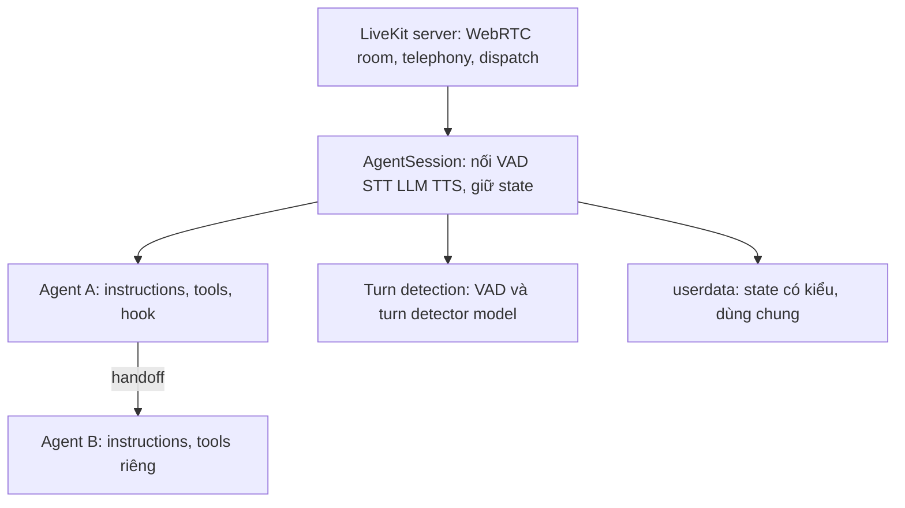

# 02.03 — LiveKit Agents: Khảo Sát Kiến Trúc Làm Mốc Tham Chiếu Thứ Hai

> [!NOTE]
>
> - Tài liệu đơn vị tự đứng vững khảo sát kiến trúc **LiveKit Agents** (framework xây dựng voice-agent thời gian thực của LiveKit),
> - **thiết lập mốc tham chiếu thứ hai** phục vụ quá trình đối chiếu hiệu năng và mô hình vận hành với Pipecat,
> - đồng thời cung cấp các dữ kiện so sánh cho kiến trúc tổng thể FCI.
> - Tham chiếu chi tiết về mốc tham chiếu Pipecat xem tại [02_pipecat_reference_architecture.md](02_pipecat_reference_architecture.md),
> - so sánh mô hình Cascade và S2S xem tại [01_fpt_vs_sota.md](01_fpt_vs_sota.md),
> - và kiến trúc 4 lớp của FCI xem tại [00_README.md](00_README.md).

---

## 1. Dẫn dắt bối cảnh

- **Bối cảnh thực tế**:
  - Trong quá trình thiết kế và phát triển hệ thống voice-agent thời gian thực hiệu năng cao,
  - một mốc là các engine điều phối luồng pipeline thuần túy như Pipecat,
  - một mốc tham chiếu khác xuất phát từ thế giới hạ tầng truyền thông WebRTC là LiveKit Agents.
- **Nghịch lý đo lường**:
  - Mặc dù LiveKit Agents giải quyết tốt các bài toán tương tự về quản lý lượt thoại hay gọi hàm,
  - nhưng việc framework này xuất phát từ tư duy hạ tầng WebRTC (infra-first) thay vì pipeline (pipeline-first) khiến các lập trình viên dễ áp dụng sai mô hình vận hành và gặp khó khăn trong việc đối chiếu, lựa chọn đòn bẩy kỹ thuật phù hợp.

> Tài liệu này sẽ khảo sát chi tiết kiến trúc LiveKit Agents trên các trục tính năng chính,
> **thiết lập mốc so sánh với Pipecat**,
> cung cấp thêm dữ kiện kỹ thuật phục vụ quá trình ra quyết định cho hệ thống FCI.

---

## 2. Glossary

- `LiveKit server` -> **LiveKit SFU Server** ->
  - Máy chủ truyền thông WebRTC (Selective Forwarding Unit),
  - đóng vai trò trung chuyển dữ liệu âm thanh và hình ảnh thời gian thực giữa các client.
- `Room` -> **Room** ->
  - Không gian phòng ảo thời gian thực,
  - nơi các bên tham gia (participants) kết nối để trao đổi dữ liệu media trực tiếp.
- `Participant` -> **Participant** ->
  - Một thực thể tham gia vào Room,
  - có thể là người dùng thật hoặc các tác nhân lập trình được (agents).
- `Agent` -> **Agent** ->
  - Một bên tham gia có khả năng lập trình,
  - sở hữu tập lệnh hướng dẫn (instructions), danh sách công cụ (tools) và các mô hình xử lý riêng.
- `AgentSession` -> **AgentSession** ->
  - Trình quản lý phiên chạy thời gian thực (runtime container),
  - chịu trách nhiệm kết nối các module VAD, STT, LLM, TTS, quản lý ngắt lời và vòng lặp hội thoại.
- `AgentServer` -> **AgentServer** ->
  - Tiến trình dịch vụ chính (process),
  - tiếp nhận yêu cầu phân phối (dispatching), quản lý vòng đời worker và khởi chạy các phiên agent.
- `entrypoint` -> **Entrypoint** ->
  - Điểm khởi đầu của một phiên agent,
  - hoạt động tương tự như một bộ xử lý yêu cầu (request handler) trong kiến trúc web.
- `JobContext` -> **JobContext** ->
  - Ngữ cảnh thực thi của một job được phân phối,
  - chứa các thông tin kết nối và dữ liệu của Room đích.
- `dispatch` -> **Dispatch** ->
  - Cơ chế phân phối công việc của hệ thống,
  - tự động gán một phiên kết nối của người dùng cho một worker agent phù hợp.
- `function_tool` -> **@function_tool decorator** ->
  - Bộ trang trí (decorator) dùng để khai báo một công cụ cho LLM,
  - tiếp nhận tham số đầu tiên bắt buộc là ngữ cảnh chạy `RunContext`.
- `RunContext` -> **RunContext** ->
  - Ngữ cảnh truyền vào hàm xử lý công cụ (tool handler),
  - chứa dữ liệu trạng thái của người dùng (userdata) và thông tin phiên hiện tại.
- `userdata` -> **Userdata** ->
  - Dữ liệu trạng thái dùng chung của phiên hội thoại,
  - được định nghĩa rõ ràng kiểu dữ liệu (`AgentSession[T]`) để chia sẻ an toàn giữa các agent.
- `turn detector` -> **Turn Detector Model** ->
  - Mô hình học máy dạng transformer nhỏ,
  - thực hiện phân tích cú pháp hội thoại để phát hiện điểm kết thúc lượt nói theo ngữ nghĩa.
- `endpointing` -> **Endpointing** ->
  - Quá trình xác định điểm kết thúc lượt thoại của người dùng,
  - kết hợp đồng thời giữa tín hiệu VAD, dự đoán của turn detector và khoảng lặng timeout.
- `RealtimeModel` -> **Realtime Model** ->
  - Lớp mô hình nghe-nói trực tiếp đầu cuối (Speech-to-Speech),
  - cho phép tích hợp trực tiếp các API như OpenAI Realtime vào luồng xử lý của agent.
- `MCP` -> **Model Context Protocol** ->
  - Giao thức chuẩn hóa để nạp và chia sẻ công cụ,
  - giúp agent kết nối và sử dụng trực tiếp các công cụ từ các máy chủ ngoài.
- `plugin` -> **Plugin** ->
  - Các gói tích hợp sẵn dùng để kết nối nhanh với các nhà cung cấp dịch vụ bên ngoài (như Deepgram, Silero, OpenAI).
- `node` -> **Pipeline Node** ->
  - Các phương thức xử lý chính trong Agent (`stt_node`, `llm_node`, `tts_node`),
  - hỗ trợ ghi đè (override) để can thiệp sâu vào luồng dữ liệu.

---

## 3. Kiến trúc LiveKit Agents: Phân lớp ba tầng

- **Tầng Hạ tầng (Infra Layer - LiveKit Server)**:
  - Quản lý các kết nối WebRTC SFU, thiết lập phòng ảo (room), quản lý danh sách bên tham gia (participants).
  - Tích hợp cổng kết nối điện thoại (SIP/Telephony) và cơ chế phân phối tải (dispatching/scaling).
  - Điểm khác biệt cốt lõi: Pipecat không sở hữu hạ tầng này mà phải mượn các nhà cung cấp bên ngoài (như Daily).
- **Tầng Runtime (Runtime Layer - AgentSession)**:
  - Container quản lý việc kết nối các mô hình (VAD, STT, LLM, TTS hoặc Realtime Model).
  - Duy trì dữ liệu trạng thái hội thoại có kiểu (`userdata`).
  - Điều phối vòng lặp hội thoại thời gian thực, quản lý ngắt lời (interruption) và phát hiện lượt lời (turn-detection).
- **Tầng Nghiệp vụ (Logic Layer - Agent & Handoff)**:
  - Định nghĩa các thực thể `Agent` độc lập sở hữu tập lệnh chỉ dẫn, danh sách công cụ và các mô hình xử lý riêng biệt.
  - Hỗ trợ chuyển đổi trạng thái nghiệp vụ giữa nhiều agent trong cùng một phiên bằng cơ chế bàn giao (handoff).

### 3.1 Sơ đồ phân lớp kiến trúc

- **Khung đọc sơ đồ**:
  - **Đề bài cần giải**:
    - Mô tả sự phân cấp và quan hệ phụ thuộc giữa các tầng kiến trúc trong hệ thống LiveKit Agents.
  - **Giả định nền**:
    - Hệ thống vận hành trên hạ tầng WebRTC của LiveKit server,
    - hỗ trợ nhiều agent chuyển giao quyền xử lý hội thoại trong một phiên.
  - **Ý nghĩa các khối**:
    - `Infra`: Tầng hạ tầng WebRTC và điều phối tải (LiveKit server).
    - `Session`: Trình quản lý runtime kết nối các mô hình và giữ trạng thái (`AgentSession`).
    - `AgentA`/`AgentB`: Các agent nghiệp vụ đại diện cho từng bước hội thoại.
    - `Turn`: Module phát hiện lượt lời kết hợp VAD và mô hình Turn Detector.
    - `State`: Đối tượng lưu trữ trạng thái có kiểu dữ liệu tường minh (`userdata`).
  - **Cách đọc sơ đồ**:
    - Dữ liệu chảy từ hạ tầng `Infra` xuống quản lý runtime `Session`.
    - `Session` điều phối và duy trì thông tin cho module `Turn`, đối tượng `State` và kích hoạt các `Agent` xử lý nghiệp vụ.
    - Khi kết thúc một bước, agent thực hiện chuyển giao (`handoff`) sang agent kế tiếp.

---

## 4. Phân tích chi tiết các Trục Tính Năng chính (Capability Axes)

### 4.1 Trục A1 — Hạ tầng & Truyền tải (Infra & Transport)

- **⚙️ Cơ chế**:
  - **Mô hình WebRTC**:
    - Agent được xem như một bên tham gia ảo (participant) kết nối trực tiếp vào Room.
    - Hệ thống thu nhận luồng âm thanh từ Room, đưa qua pipeline xử lý, và phát ngược luồng âm thanh phản hồi vào Room.
  - **Bộ phân phối tải (AgentServer & Dispatching)**:
    - Khi có người dùng kết nối, LiveKit server phát sinh một Job.
    - `AgentServer` tiếp nhận Job và tự động chuyển giao (dispatch) cho một tiến trình worker agent còn trống.
    - Hỗ trợ một tiến trình host đồng thời nhiều phiên chạy để tối ưu hóa tài nguyên phần cứng.
  - **Điểm kết nối (Entrypoint)**:
    - Hàm khởi động phiên được đăng ký thông qua decorator `@server.rtc_session()`, tiếp nhận đối tượng `JobContext` chứa thông tin kết nối Room.
- **🔍 Cách thức vận hành**:
  - Hỗ trợ ba chế độ chạy thử nghiệm và triển khai:
    - Chế độ `console`: chạy thử nghiệm trực tiếp trên dòng lệnh, sử dụng âm thanh máy tính, không cần máy chủ ngoài.
    - Chế độ `dev`: chạy máy chủ thử nghiệm đi kèm cơ chế tự động tải lại mã nguồn khi chỉnh sửa (hot reload).
    - Chế độ `start`: chạy tiến trình phục vụ chính thức trong môi trường production.
  - **Tích hợp Telephony**: Kết nối trực tiếp với SIP stack của LiveKit để xử lý các cuộc gọi điện thoại truyền thống.
- **💡 Ý nghĩa**:
  - Giải quyết toàn bộ bài toán hạ tầng kết nối và tự động mở rộng quy mô (scaling) ở mức hạ tầng.
  - Khác biệt lớn với Pipecat (Pipecat tách biệt và đẩy trách nhiệm quản lý transport cho các dịch vụ ngoài như Daily).

### 4.2 Trục A2 — Quản lý Phiên & Trạng thái (AgentSession & State)

- **⚙️ Cơ chế**:
  - `AgentSession` đóng vai trò là bộ khung runtime:
    - Tiếp nhận các dịch vụ `vad`, `stt`, `llm`, `tts` (hoặc một mô hình Speech-to-Speech `RealtimeModel`).
    - Điều phối vòng lặp: tiếp nhận âm thanh -> dịch chữ (STT) -> xác định lượt thoại -> LLM xử lý -> tổng hợp tiếng (TTS) -> phát ra.
- **🔍 Quản lý trạng thái có kiểu (Userdata)**:
  - Khai báo kiểu dữ liệu của bộ nhớ phiên ngay khi khởi tạo session: `AgentSession[DataType](...)`.
  - Các công cụ đọc và ghi dữ liệu trạng thái một cách an toàn thông qua biến `context.userdata`.
  - Khác biệt với Pipecat:
    - Sử dụng kiểu dữ liệu tường minh (dataclass),
    - loại bỏ các lỗi sai tên trường dữ liệu (typo field name) ngay từ bước biên dịch code thay vì dùng kiểu dictionary tự do.
- **💡 Ý nghĩa**:
  - Cung cấp một bộ nhớ an toàn, nhất quán xuyên suốt cuộc hội thoại,
  - cho phép các agent nghiệp vụ khác nhau truy cập và kế thừa thông tin đã thu thập.

### 4.3 Trục A3 — Điều phối Agent & Chuyển giao Nghiệp vụ (Handoff)

- **⚙️ Cơ chế**:
  - Phân rã nghiệp vụ hội thoại phức tạp thành các thực thể `Agent` độc lập:
    - Mỗi Agent sở hữu tập lệnh chỉ dẫn riêng, danh sách công cụ riêng,
    - và có thể cấu hình các mô hình STT/LLM/TTS riêng biệt.
  - Cơ chế chuyển giao nghiệp vụ (`handoff`) được kích hoạt thông qua việc trả về đối tượng agent mới từ một công cụ của LLM.
- **🔍 Hiện thực hóa chuyển giao**:
  - Một phương thức `@function_tool` có thể trả về một cặp dữ liệu gồm: `(Agent_mới, Thông_điệp_chào)`.
  - Hệ thống tự động chuyển giao quyền kiểm soát phiên cho Agent mới và phát âm thanh thông điệp chào.
- **💡 So sánh với Pipecat**:
  - Tương tự như cơ chế quản lý Flows của Pipecat.
  - Điểm khác biệt: đơn vị nghiệp vụ của LiveKit là một đối tượng `Agent` hoàn chỉnh (cho phép thay đổi cả mô hình xử lý, ví dụ: chuyển từ mô hình LLM thông thường sang mô hình S2S),
  - trong khi Pipecat Flows chỉ là các cấu hình tĩnh `NodeConfig` chạy trên cùng một đường ống pipeline.

### 4.4 Trục A4 — Công cụ gọi hàm & Model Context Protocol (MCP)

- **⚙️ Khai báo công cụ**:
  - Sử dụng decorator `@function_tool` đính kèm trên các hàm xử lý bất đồng bộ.
  - Tham số đầu tiên bắt buộc phải là `RunContext`, các tham số tiếp theo định nghĩa tham số đầu vào của công cụ.
  - Schema định nghĩa công cụ được tự động sinh ra dựa trên kiểu dữ liệu (signature) và docstring của hàm.
- **🔍 Quản lý công cụ động**:
  - Công cụ được gắn trực tiếp vào agent qua thuộc tính `tools` khi khởi tạo.
  - Hỗ trợ thay đổi tập hợp công cụ động trong quá trình chạy bằng phương thức `agent.update_tools([...])`.
- **🔍 Tích hợp giao thức MCP**:
  - Cho phép agent kết nối và nạp trực tiếp các công cụ từ xa thông qua cấu hình `mcp_servers=[mcp.MCPServerHTTP(url=...)]`,
  - giảm thiểu công sức viết code bọc API thủ công.
- **💡 Ý nghĩa**:
  - Đồng nhất cơ chế gọi công cụ nghiệp vụ thông thường và cơ chế chuyển giao agent (handoff) qua cùng một decorator `@function_tool`.

### 4.5 Trục A5 — Phát hiện Lượt lời & Ngắt lời (Turn Detection)

- **⚙️ Cơ chế**:
  - Mặc định tích hợp bộ phát hiện `TurnDetector` dựa trên mô hình transformer nhỏ để phân tích ngữ nghĩa của văn bản nhận diện,
  - xác định xem người dùng đã thực sự nói xong hay chưa thay vì chỉ dựa vào khoảng lặng im lặng.
  - Kết hợp đồng thời ba yếu tố (VAD + TurnDetector + Timeout) để tối ưu hóa quyết định kết thúc lượt nói (endpointing).
  - Quản lý cơ chế ngắt lời thông qua các thiết lập trong `TurnHandlingOptions`.
  - Hỗ trợ chế độ kích hoạt thủ công (push-to-talk) bên cạnh chế độ tự động.
- **💡 Ý nghĩa**:
  - Tương tự như giải pháp Smart Turn của Pipecat, giải quyết điểm đau về quản lý lượt thoại trên môi trường thoại thời gian thực.
- **⚠️ Bẫy pháp lý (License)**:
  - Mô hình `TurnDetector` đi kèm của LiveKit sử dụng giấy phép nguồn đóng **LiveKit Model License**,
  - cần đánh giá kỹ lưỡng trước khi đưa vào sản phẩm thương mại.

### 4.6 Trục A6 — Vòng đời Tác vụ & Can thiệp luồng dữ liệu

- **⚙️ Các sự kiện vòng đời (Lifecycle Hooks)**:
  - `on_enter()` -> Chạy khi agent bắt đầu nhận quyền xử lý (thường dùng để chào người dùng).
  - `on_exit()` -> Chạy khi bàn giao quyền xử lý sang agent khác.
  - `on_user_turn_completed(turn_ctx, new_message)` ->
    - Chạy ngay khi người dùng nói xong và trước khi LLM bắt đầu sinh phản hồi.
    - Điểm cắm lý tưởng để thực hiện truy hồi tri thức (RAG), cập nhật ngữ cảnh, hoặc sửa đổi nội dung tin nhắn.
    - Hỗ trợ cơ chế phát âm thanh đệm nhanh (pre-response) để giảm trễ cảm nhận bằng cách chạy một mô hình nhỏ song song.
    - Hỗ trợ từ chối phản hồi nếu tin nhắn rỗng bằng cách raise ngoại lệ `StopResponse`.
  - `on_user_turn_exceeded()` -> Chạy khi người dùng nói quá thời gian cấu hình tối đa.
- **⚙️ Can thiệp luồng dữ liệu (Pipeline Nodes)**:
  - Cho phép override các phương thức xử lý chính như `stt_node`, `llm_node`, `tts_node` để thay đổi logic xử lý thô của từng module mà không cần viết lại bộ khung điều phối.

---

## 5. Bảng So Sánh Đối Chiếu: LiveKit ↔ Pipecat

- **Triết lý định vị**:
  - Pipecat: Tập trung quản lý luồng dữ liệu (Pipeline-first) qua chuỗi các FrameProcessor.
  - LiveKit: Tập trung quản lý hạ tầng WebRTC và mở rộng phiên (Infra-first) kết hợp framework ở trên.
- **Cơ chế chia bước hội thoại**:
  - Pipecat: Sử dụng `NodeConfig` cấu hình tĩnh trong module Flows.
  - LiveKit: Sử dụng các đối tượng `Agent` hoàn chỉnh, cho phép thay đổi cấu hình mô hình riêng cho từng bước.
- **Cơ chế chuyển giao bước**:
  - Pipecat: Hàm xử lý trả về `(kết_quả, node_kế_tiếp)`.
  - LiveKit: Công cụ `@function_tool` trả về cặp đối tượng `(agent_mới, thông_điệp)`.
- **Quản lý trạng thái hội thoại**:
  - Pipecat: Lưu trữ tự do trong dictionary `flow_manager.state`.
  - LiveKit: Lưu trữ có kiểu dữ liệu an toàn trong dataclass `userdata` của `AgentSession`.
- **Hỗ trợ hội thoại Speech-to-Speech (S2S)**:
  - Pipecat: Module Flows hiện chưa hỗ trợ chuyển đổi sang S2S giữa các bước (chỉ chạy cascade).
  - LiveKit: Hỗ trợ linh hoạt, cho phép chuyển đổi sang `RealtimeModel` (S2S) theo từng agent.
- **Phát hiện lượt thoại thông minh**:
  - Pipecat: Tích hợp mô hình Smart Turn.
  - LiveKit: Tích hợp mô hình TurnDetector.
- **Mở rộng công cụ bên ngoài (MCP)**:
  - Pipecat: Phải tự tích hợp qua các lớp bọc ngoài.
  - LiveKit: Tích hợp sẵn trong cấu hình khởi tạo của Agent.
- **Hạ tầng phục vụ và scale**:
  - Pipecat: Đẩy trách nhiệm quản lý kết nối và scale cho bên thứ ba.
  - LiveKit: Quản lý tập trung qua máy chủ LiveKit Server (Room, Dispatch, SIP).
- **Giấy phép mã nguồn (License)**:
  - Pipecat: BSD-2-Clause hoàn toàn mở.
  - LiveKit: Framework sử dụng Apache-2.0, tuy nhiên mô hình TurnDetector đi kèm sử dụng giấy phép Model License riêng.

---

## 6. Các bài học và gợi ý thiết kế cho FCI

- **Ứng dụng mô hình Turn-detection**:
  - Việc cả hai framework lớn đều tích hợp mô hình phát hiện lượt lời chuyên dụng củng cố định hướng loại bỏ cơ chế xác định khoảng im lặng truyền thống của FCI.
  - Cần tiến hành huấn luyện và đo lường mô hình turn-detection chuyên biệt cho tiếng Việt và môi trường thoại telephony 8kHz.
- **Cơ chế cắm logic trước hội thoại (`on_user_turn_completed`)**:
  - Cung cấp một giải pháp thiết kế sạch để chèn tri thức RAG hoặc xử lý bộ nhớ hội thoại ngay trước khi LLM bắt đầu suy luận,
  - FCI nên tham khảo cấu trúc này để tách biệt logic nghiệp vụ và logic điều phối.
- **Hỗ trợ trộn mô hình Cascade và S2S**:
  - Mở ra khả năng kết hợp linh hoạt: các bước hội thoại thông thường sử dụng cascade giá rẻ, các bước hội thoại nhạy cảm yêu cầu trễ thấp chuyển sang Speech-to-Speech.
  - Cần đánh giá mức độ kiểm soát kịch bản và chi phí tài nguyên trước khi áp dụng.

---

## ✅ Tự kiểm nhanh

1. Sự khác biệt cốt lõi về mặt thiết kế giữa LiveKit và Pipecat trong việc quản lý hạ tầng kết nối là gì?

- **Infra-first và Pipeline-first**:
  - LiveKit sở hữu hạ tầng kết nối WebRTC SFU (LiveKit server), tự quản lý việc chia phòng (Room), kết nối điện thoại (SIP) và phân phối job.
  - Pipecat chỉ tập trung vào việc quản lý luồng dữ liệu (Pipeline) và đẩy trách nhiệm quản lý kết nối truyền dẫn cho các dịch vụ bên ngoài (như Daily).

2. Làm thế nào để thực hiện chuyển giao quyền xử lý hội thoại (handoff) giữa hai agent trong LiveKit?

- **Cơ chế handoff**:
  - Định nghĩa một công cụ sử dụng decorator `@function_tool`.
  - Khi điều kiện chuyển giao thỏa mãn, hàm xử lý trả về một cặp đối tượng gồm: đối tượng agent mới cần chuyển đến và thông điệp chào người dùng.
  - Hệ thống tự động cập nhật runtime để agent mới tiếp quản phiên hội thoại.

3. Điểm cần lưu ý về mặt giấy phép (license) khi sử dụng mô hình TurnDetector mặc định của LiveKit là gì?

- **Giới hạn giấy phép**:
  - Framework LiveKit Agents sử dụng giấy phép mở Apache-2.0.
  - Tuy nhiên, mô hình TurnDetector đi kèm sử dụng giấy phép Model License nguồn đóng của LiveKit,
  - đòi hỏi phải đánh giá và xin quyền sử dụng nếu tích hợp vào sản phẩm thương mại.

