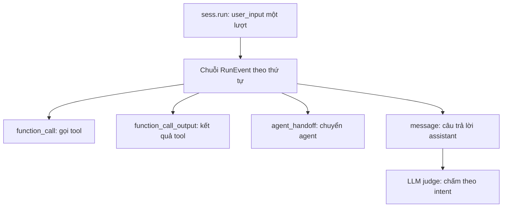

# 02.04 — Testing Framework & LLM Judge Của LiveKit Agents

> [!NOTE]
> - Tài liệu đơn vị tự đứng vững phân tích chi tiết bộ khung kiểm thử (Testing Framework) tích hợp sẵn của LiveKit Agents,
> - **tập trung mổ xẻ cơ chế kiểm soát chuỗi sự kiện** và quy trình chấm điểm câu thoại phi xác định sử dụng LLM Judge,
> - làm mốc tham chiếu thực tế để thiết kế hệ thống giả lập hội thoại (sim/test system) của FCI.
> - Tham chiếu chi tiết về kiến trúc tổng quan LiveKit Agents xem tại [03_livekit_reference_architecture.md](03_livekit_reference_architecture.md),
> - báo cáo thông luồng end-to-end xem tại [docs/10_implementation/02_e2e_report.md](../10_implementation/02_e2e_report.md),
> - và thiết kế hệ thống giả lập FCI xem tại [docs/11_sim_test_system/01_design.md](../11_sim_test_system/01_design.md).

---

## 1. Dẫn dắt bối cảnh

- **Bối cảnh thực tế**:
  - Trong quy trình kỹ nghệ chất lượng mô hình đối với các trợ lý giọng nói thời gian thực,
  - việc xây dựng hệ thống kiểm thử tự động luôn là thách thức lớn nhất do tính chất phi xác định của mô hình ngôn ngữ lớn (LLM).
- **Nghịch lý đo lường**:
  - Việc sử dụng các bộ so khớp chuỗi ký tự cứng (assertions) thường thất bại do mô hình diễn đạt câu trả lời mỗi lần một khác nhau,
  - trong khi nếu để LLM tự do đánh giá câu trả lời mà không có một khung kiểm soát chuỗi sự kiện chặt chẽ và định dạng verdict có cấu trúc thì kết quả kiểm thử sẽ trở nên ba phải, không ổn định và không thể tích hợp vào luồng CI/CD tự động.

> Tài liệu này sẽ phân tích chi tiết cơ chế vận hành của framework kiểm thử built-in và bộ lọc đánh giá LLM Judge trong LiveKit Agents,
> **rút ra các nguyên lý thiết kế hệ thống kiểm thử**,
> hỗ trợ xây dựng harness đánh giá chất lượng các phiên bản mô hình hội thoại FCI một cách khoa học.

---

## 2. Glossary

- `AgentSession.run()` -> **sess.run()** ->
  - Phương thức kích hoạt chạy mô phỏng một lượt thoại với đầu vào của người dùng,
  - trả về một đối tượng chứa kết quả lượt chạy `RunResult`.
- `RunResult` -> **RunResult** ->
  - Đối tượng chứa kết quả thực thi của một lượt chạy,
  - lưu trữ danh sách các sự kiện phát sinh theo dòng thời gian và cung cấp cổng kiểm thử `.expect`.
- `RunEvent` -> **RunEvent** ->
  - Một sự kiện phát sinh trong lượt chạy,
  - được phân thành 4 loại cơ bản: tin nhắn (message), lời gọi hàm (function_call), kết quả hàm (function_call_output), và bàn giao agent (agent_handoff).
- `.expect` -> **Cổng kiểm thử RunAssert** ->
  - Cổng giao tiếp dùng để duyệt và kiểm tra tính hợp lệ của chuỗi sự kiện được sinh ra,
  - cung cấp các phương thức xác thực sự kiện đơn hoặc sự kiện xuất hiện tự do.
- `EventAssert` -> **EventAssert** ->
  - Thực thể đại diện cho một sự kiện đơn lẻ trong cổng kiểm thử,
  - cung cấp các phương thức so khớp kiểu dữ liệu (`is_*`).
- `judge` -> **LLM Judge** ->
  - Cơ chế sử dụng mô hình ngôn ngữ lớn để chấm điểm câu phản hồi dựa trên mô tả ý định (intent) của kịch bản,
  - hoạt động theo phương thức đánh giá ngữ nghĩa thay vì so khớp chữ cứng.
- `JudgmentResult` -> **JudgmentResult** ->
  - Kết quả trả về của bộ chấm điểm,
  - bao gồm verdict cuối cùng (pass, fail, hoặc maybe) đi kèm lập luận giải thích (reasoning).
- `input_modality` -> **Phương thức đầu vào** ->
  - Cấu hình mô phỏng kiểu dữ liệu đầu vào của lượt chạy,
  - hỗ trợ chế độ văn bản (text) hoặc âm thanh thoại (audio).
- `intent` -> **Ý định kịch bản** ->
  - Đoạn văn bản mô tả mục tiêu nghiệp vụ bắt buộc phải có trong câu trả lời của agent,
  - đóng vai trò là prompt đầu vào cho mô hình LLM Judge.

---

## 3. Mô hình kiểm thử: Chuỗi sự kiện có thứ tự thời gian

- **Nguyên lý cốt lõi**:
  - Khi thực hiện một lượt chạy hội thoại, hệ thống ghi nhận toàn bộ các hoạt động của agent thành một chuỗi sự kiện có thứ tự thời gian liên tục.
  - Quá trình kiểm thử được chia thành hai phần độc lập:
    - **Phần xác định (Deterministic)**: duyệt chuỗi sự kiện và kiểm tra chính xác cấu trúc lời gọi hàm, kết quả trả về, hoặc chuyển giao agent.
    - **Phần phi xác định (Non-deterministic)**: đưa tin nhắn phản hồi của agent sang bộ LLM Judge để chấm điểm chất lượng ngữ nghĩa.

### 3.1 Sơ đồ tuần tự của một lượt kiểm thử



- **Khung đọc sơ đồ**:
  - **Đề bài cần giải**:
    - Mô tả luồng phân tách và đánh giá dữ liệu đầu ra của một lượt chạy hội thoại.
  - **Giả định nền**:
    - Agent xử lý một lượt nói phức tạp có thể bao gồm cả gọi công cụ, chuyển giao trạng thái nghiệp vụ và phản hồi người dùng.
  - **Ý nghĩa các khối**:
    - `Run`: Thao tác gửi câu thoại đầu vào của người dùng vào phiên chạy.
    - `Ev`: Chuỗi sự kiện thô phát sinh theo dòng thời gian.
    - `FC`/`FO`/`HO`: Các sự kiện cấu trúc thuộc phần xác định (lời gọi hàm, kết quả hàm, bàn giao agent).
    - `MSG`: Sự kiện văn bản thoại thuộc phần phi xác định.
    - `Judge`: Bộ chấm điểm LLM Judge thực hiện đánh giá chất lượng ngữ nghĩa của câu thoại.
  - **Cách đọc sơ đồ**:
    - Luồng chạy đi từ `Run` sinh ra `Ev`.
    - `Ev` được phân rã thành các sự kiện con. Lập trình viên sử dụng các hàm assert cứng cho các khối `FC`, `FO`, `HO`.
    - Đối với khối `MSG`, dữ liệu được chuyển tiếp qua khối `Judge` để lấy kết quả chấm điểm tự động.

---

## 4. Đặc tả kỹ thuật các API Kiểm thử

### 4.1 Khởi động và Thực thi lượt chạy

- **⚙️ Cơ chế**:
  - Phiên kiểm thử sử dụng `AgentSession` như một async context manager để quản lý tài nguyên.
  - Phương thức `sess.start()` nhận đối tượng agent nghiệp vụ khởi đầu để kích hoạt phiên.
  - Phương thức `sess.run()` gửi tin nhắn của người dùng vào hệ thống, chấp nhận cấu hình chế độ đầu vào qua tham số `input_modality`.

### 4.2 Bộ điều hướng chuỗi sự kiện (`RunAssert`)

- **⚙️ Cơ chế**:
  - Lấy sự kiện tiếp theo trong chuỗi bằng phương thức `next_event(type=...)`. Nếu không khớp kiểu sự kiện khai báo, bài test lập tức thất bại.
  - Cho phép bỏ qua sự kiện tùy chọn bằng phương thức `skip_next_event_if(type=..., role=...)` (thường dùng để bỏ qua các câu chào mở đầu ngẫu nhiên).
  - Bỏ qua một số lượng sự kiện xác định bằng `skip_next(count)`.
  - Khẳng định chuỗi sự kiện đã kết thúc hoàn toàn bằng phương thức `no_more_events()`.

### 4.3 Bộ so khớp sự kiện đơn (`EventAssert`)

- **⚙️ Cơ chế**:
  - Xác thực lời gọi hàm bằng `is_function_call(name=..., arguments=...)` (hỗ trợ kiểm tra chính xác tên hàm và các giá trị tham số đi kèm).
  - Xác thực kết quả hàm trả về bằng `is_function_call_output()`.
  - Xác thực đối tượng nói bằng `is_message(role=...)` (chỉ chấp nhận vai trò `assistant` hoặc `user`).
  - Xác thực chuyển giao agent bằng `is_agent_handoff(new_agent_type=...)`.

### 4.4 Bộ so khớp tự do (Agnostic Order)

- **⚙️ Cơ chế**:
  - Hỗ trợ các phương thức kiểm tra sự xuất hiện tự do: `contains_function_call()`, `contains_message()`, `contains_agent_handoff()`.
  - Giúp kiểm tra xem sự kiện có tồn tại trong một đoạn chuỗi hay không mà không bắt buộc phải khớp chính xác thứ tự tuần tự.

### 4.5 Bộ chấm điểm tự động (LLM Judge)

- **⚙️ Cơ chế**:
  - Được kích hoạt bằng phương thức `.judge(llm, intent="...")` sau khi xác định sự kiện là một message.
  - Mô hình LLM Judge nhận nội dung câu thoại và mô tả ý định nghiệp vụ để phân tích chất lượng.
  - **Cơ chế chống phán quyết ba phải**:
    - Kết quả chấm điểm (JudgmentResult) được giới hạn cứng qua ba giá trị: `pass` (đạt), `fail` (lỗi), hoặc `maybe` (không chắc chắn).
    - Hệ thống xử lý giá trị `maybe` tương đương với nhãn **không đạt** để ngăn chặn việc LLM Judge đưa ra các phán quyết mơ hồ làm test case luôn vượt qua.
  - **Tối ưu cấu trúc đầu ra**:
    - Bộ chấm điểm sử dụng chính cơ chế gọi hàm (function-calling) của LLM qua hàm `submit_verdict(verdict, reasoning)` để ép mô hình trả về cấu trúc JSON chứa verdict và lập luận giải thích,
    - tránh lỗi phân tích cú pháp từ văn bản tự do.
  - **Khả năng mở rộng**: Cho phép kế thừa lớp `Judge` để tự viết các bộ xác thực nghiệp vụ cứng kết hợp với LLM Judge.

---

## 5. Kịch bản Kiểm thử Thực tế mẫu

- **Mô phỏng quy trình**:
  - Người dùng yêu cầu xem slot trống -> agent gọi hàm liệt kê slot -> người dùng lựa chọn -> agent thực hiện đặt lịch -> bàn giao sang agent lấy thông tin liên lạc.

```python
async with AgentSession(llm=llm, userdata=userdata) as sess:
    await sess.start(FrontDeskAgent(timezone="UTC"))

    # Lượt 1: Yêu cầu xem slot đặt lịch ngày mai
    result = await sess.run(user_input="Can I get an appointment tomorrow?")
    
    # Bỏ qua câu chào mở đầu ngẫu nhiên nếu có
    result.expect.skip_next_event_if(type="message", role="assistant")
    
    # Xác thực agent kích hoạt chính xác hàm liệt kê slot
    result.expect.next_event().is_function_call(name="list_available_slots")
    
    # Xác thực hệ thống tiếp nhận kết quả hàm trả về
    result.expect.next_event().is_function_call_output()
    
    # Sử dụng LLM Judge chấm điểm chất lượng câu trả lời gợi ý slot của agent
    await (
        result.expect.next_event()
        .is_message(role="assistant")
        .judge(llm, intent="phải gợi ý các slot trống của ngày mai, chỉ trong các slot thật")
    )

    # Lượt 2: Người dùng xác nhận chọn khung giờ
    result = await sess.run(user_input="2 in the afternoon sounds good")
    result.expect.skip_next_event_if(type="message", role="assistant")
    
    # Xác thực agent gọi hàm đặt lịch kèm tham số slot_id chính xác
    result.expect.next_event().is_function_call(
        name="schedule_appointment", arguments={"slot_id": slot_id})
    
    # Ghi nhận sự kiện bàn giao quyền xử lý sang GetEmailTask
    result.expect.next_event().is_agent_handoff(new_agent_type=GetEmailTask)
    
    # Sử dụng LLM Judge đánh giá câu thoại tiếp theo có hỏi email người dùng hay không
    await (
        result.expect.next_event()
        .is_message(role="assistant")
        .judge(llm, intent="phải hỏi địa chỉ email")
    )
```

---

## 6. Bài học thiết kế áp dụng cho Hệ thống Giả lập FCI

- **Phân tách kiểm thử hai trục**:
  - FCI nên áp dụng mô hình phân tách này cho harness của mình:
    - trục xác định (gọi hàm nghiệp vụ đúng key, đúng tham số) sử dụng assert cứng trên chuỗi sự kiện.
    - trục phi xác định (diễn đạt của bot có hướng dẫn đúng ý định hay không) chuyển tiếp qua LLM Judge.
- **Mô hình chuỗi sự kiện có thứ tự (Event Sequence)**:
  - Sử dụng chuỗi sự kiện có thứ tự làm đơn vị đánh giá giúp việc debug và khoanh vùng lỗi trở nên trực quan hơn rất nhiều so với việc chỉ đánh giá trên câu thoại cuối cùng của cuộc gọi.
- **Đóng gói phán quyết có cấu trúc**:
  - Thiết kế prompt cho LLM Judge của FCI bắt buộc phải sử dụng cơ chế gọi hàm (function-calling hoặc constrained decoding) để thu thập kết quả chấm điểm pass/fail/maybe.
  - Thực hiện loại bỏ nhãn `maybe` khỏi các ca kiểm thử đạt để nâng cao độ tin cậy của bộ đánh giá chất lượng.
- **Giới hạn tích hợp**:
  - Chúng ta chỉ học hỏi mô hình thiết kế và cách cấu trúc các hàm assert/judge của LiveKit,
  - không thực hiện sao chép hay tích hợp hạ tầng runtime của LiveKit để giữ cho hệ thống giả lập FCI luôn độc lập và tương thích với Pipecat.

---

## ✅ Tự kiểm nhanh

<details>
<summary>1. Tại sao assertions so khớp chuỗi ký tự thông thường (string matching) không hiệu quả khi kiểm thử voice-agent?</summary>

- **Tính phi xác định của ngôn ngữ**:
  - Cùng một ý định phản hồi, mô hình ngôn ngữ lớn có thể sử dụng nhiều từ ngữ và cấu trúc câu hoàn toàn khác nhau qua mỗi lần sinh.
  - Việc so khớp chuỗi ký tự cứng sẽ dẫn đến lỗi kiểm thử thất bại giả (False Failures),
  - đòi hỏi phải chuyển sang sử dụng LLM Judge để đánh giá dựa trên ngữ nghĩa.
</details>

<details>
<summary>2. Cơ chế nào giúp bảo đảm kết quả trả về của LLM Judge không bị lỗi phân tích cú pháp (parse error)?</summary>

- **Sử dụng Function-calling**:
  - Thay vì để LLM sinh văn bản tự do rồi tự viết regex để parse nhãn pass/fail,
  - bộ chấm điểm ép mô hình LLM Judge phản hồi thông qua một hàm có cấu trúc `submit_verdict(verdict, reasoning)`.
  - Cơ chế này đảm bảo dữ liệu trả về luôn tuân thủ đúng JSON Schema đã định nghĩa.
</details>

<details>
<summary>3. Hệ thống xử lý verdict "maybe" (chưa chắc chắn) của LLM Judge như thế nào và tại sao?</summary>

- **Quy đổi về không đạt**:
  - Nhãn `maybe` (uncertain) được hệ thống tự động quy đổi thành kết quả **không đạt (failed)**.
  - Thiết kế này ngăn chặn sự lỏng lẻo trong kiểm thử,
  - tránh trường hợp LLM Judge đưa ra các phán quyết không rõ ràng làm sai lệch chỉ số chất lượng của phiên bản bot.
</details>
