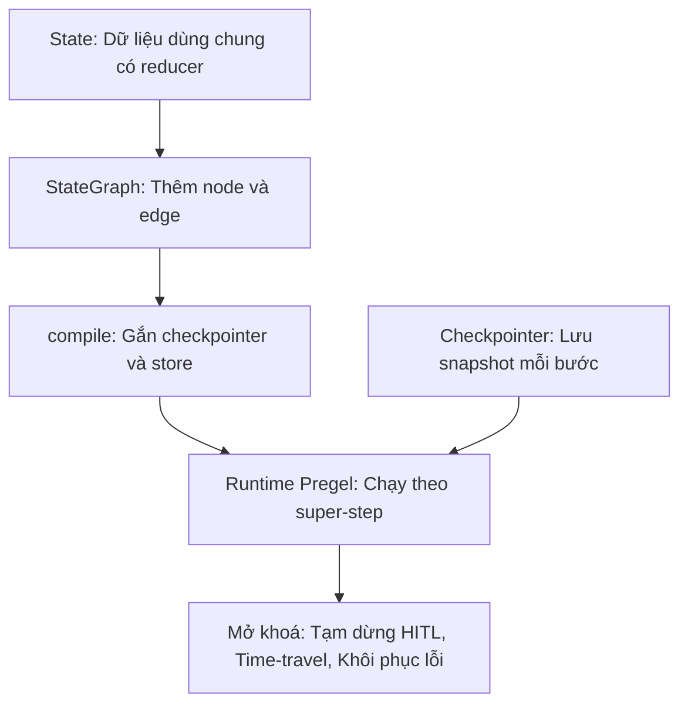
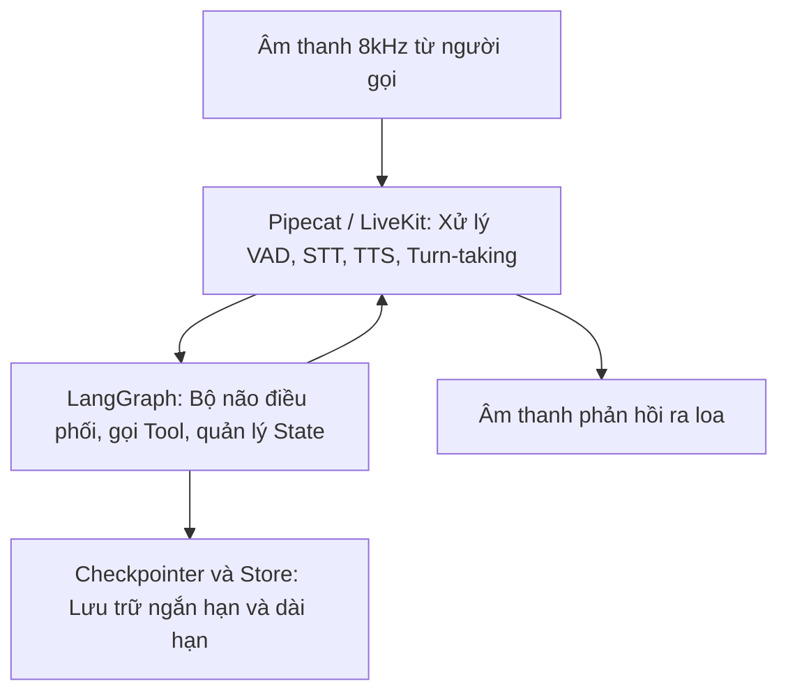
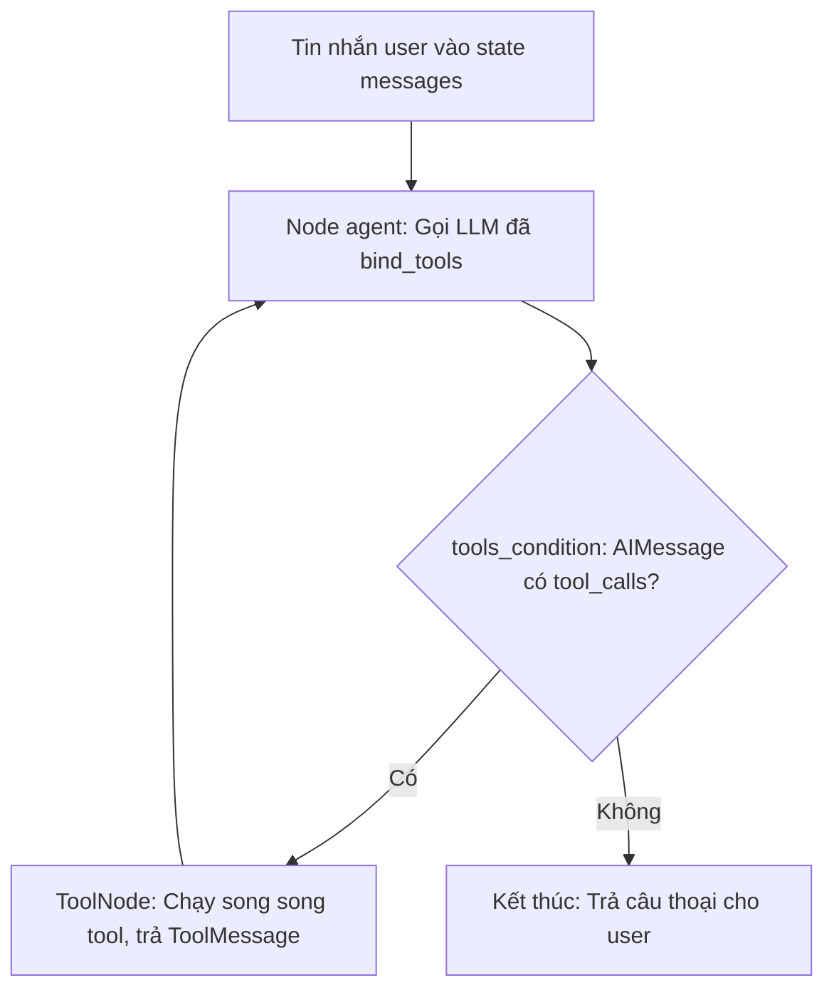
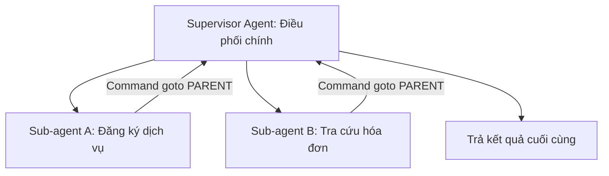

📚 Knowledge-explain: dẫn dắt bối cảnh · ba lớp khái niệm · cấu trúc đơn vị ôn · trình bày trực quan

# 02.05 — LangGraph làm Kiến Trúc Tham Chiếu: Bộ Não Agent (Orchestrator + Tool-Calling) cho Voice Agent FCI

> [!NOTE]
> 
> Tài liệu này bóc tách kiến trúc của **LangGraph** thành các trục năng lực có hệ thống.
> 
> > Nội dung đối chiếu 1-1 với kiến trúc 4 layer nội bộ của FCI.
> > 
> > Tập trung chủ yếu vào Layer 2 (Agent Core) và Layer 3 (Tool Calling).
> 
> > Khác biệt cốt lõi so với Pipecat:
> > 
> > * Pipecat hoặc LiveKit chịu trách nhiệm về pipeline thoại (gồm audio, STT, TTS).
> > 
> > * LangGraph chịu trách nhiệm về phần bộ não của Agent (gồm state, tool-calling, memory).
> > 
> > * Agent LangGraph nằm bên trong pipeline thoại và thay thế khối LLM của Pipecat.

---

## 1. Dẫn dắt bối cảnh

* **Bối cảnh thực tế**:
  * Khi xây dựng hệ thống Voice Agent cho tổng đài tự động:
    * Việc quản lý luồng hội thoại theo kịch bản có trạng thái,
    * xử lý các cuộc gọi ngắt quãng từ phía người dùng,
    * và gọi các API nghiệp vụ chính xác luôn là thách thức lớn.
  * Các kỹ sư thường phải tự xây dựng:
    * các máy trạng thái (FSM) thủ công,
    * và cơ chế tiêm chỉ dẫn để điều phối LLM theo từng bước của cuộc gọi.

* **Nghịch lý và câu hỏi đặt ra**:
  * Hệ thống FCI hiện tại đang sử dụng cơ chế *simulated tool-calling*:
    * bằng cách tiêm fake tool result `what_should_I_do_next` để dẫn hướng LLM.
  * Điều này đặt ra các câu hỏi cốt lõi:
    * Liệu đây là một giải pháp tình thế (workaround) hay là thiết kế tối ưu so với các framework chuẩn hóa như LangGraph?
    * Làm thế nào để giải quyết triệt để hai nỗi đau lớn:
      * nâng cao độ chính xác gọi tool (hiện tại ~62% cần đạt ≥90%),
      * và tối ưu hóa thời gian phản hồi ngắt lời (turn-interruption)?

Dưới đây là tài liệu bóc tách kiến trúc LangGraph và đối chiếu với hệ thống FCI nhằm định hình giải pháp nâng cấp tối ưu.

---

## 2. Glossary (Thuật ngữ cốt lõi)

* `StateGraph` → **State Graph**:
  * Đối tượng trung tâm để định nghĩa cấu trúc đồ thị hội thoại.
  * Hỗ trợ các phương thức:
    * `add_node` để thêm các điểm xử lý logic,
    * `add_edge` để kết nối tĩnh các bước đi,
    * và `compile()` để biên dịch đồ thị thành runtime chạy được.
* `State` → **Graph State**:
  * Đối tượng dữ liệu dùng chung chảy qua tất cả các node.
  * Được định nghĩa qua TypedDict, Pydantic, hoặc dataclass.
  * Các node trả về bản cập nhật một phần (partial update) để hệ thống tự động merge vào State.
* `reducer` → **Reducer Function**:
  * Hàm xác định cách tích hợp dữ liệu mới vào State.
  * Mặc định là ghi đè hoàn toàn dữ liệu cũ.
  * Có thể tùy biến (ví dụ: dùng `operator.add` để cộng dồn danh sách).
* `add_messages` → **Add Messages Reducer**:
  * Hàm reducer chuyên dụng cho danh sách tin nhắn hội thoại.
  * Giúp nối thêm tin nhắn mới,
  * và cập nhật tin nhắn cũ dựa trên định danh duy nhất (Message ID).
* `MessagesState` → **Messages State**:
  * Cấu trúc State dựng sẵn của LangGraph.
  * Chứa sẵn kênh tin nhắn `messages` sử dụng reducer `add_messages`.
* `node` → **Graph Node**:
  * Một hàm Python nhận State hiện tại (và tùy chọn nhận cấu hình `config`, `runtime`).
  * Thực thi logic nghiệp vụ và trả về bản cập nhật dạng dict cho State.
* `edge` → **Graph Edge**:
  * Đường nối điều hướng giữa các node.
  * Gồm edge tĩnh (nối cứng A sang B) và edge điều kiện (conditional edge) dựa trên logic định tuyến của hàm router.
* `Command` → **Command Object**:
  * Đối tượng điều khiển trả về từ node.
  * Cho phép gộp chung hai hành động trong một kết quả:
    * cập nhật dữ liệu State (`update`),
    * và chỉ định node tiếp theo sẽ chạy (`goto`).
* `Send` → **Send API**:
  * Cơ chế phân nhánh song song (fan-out) kiểu map-reduce.
  * Cho phép chạy nhiều bản sao của một node với các State riêng biệt được tạo động.
* `super-step` → **Super-step**:
  * Một chu kỳ chạy của đồ thị theo mô hình Pregel.
  * Các node trong cùng một bước được thực thi song song hoàn toàn.
  * Cả bước hoạt động như một giao dịch (transaction) - nếu một node lỗi, toàn bộ cập nhật State của bước đó sẽ bị rollback.
* `START` / `END` → **Start / End Nodes**:
  * Các node đặc biệt của hệ thống để đánh dấu điểm bắt đầu vào đồ thị và điểm kết thúc luồng chạy.
* `checkpointer` → **Checkpointer**:
  * Cơ chế tự động lưu lại snapshot của State sau mỗi super-step.
  * Đóng vai trò là bộ nhớ ngắn hạn (short-term memory) hoạt động theo từng `thread_id`.
* `thread_id` → **Thread ID**:
  * Khóa định danh duy nhất cho một phiên hội thoại.
  * Dùng làm khóa chính để lưu trữ và khôi phục State từ checkpointer.
* `StateSnapshot` → **State Snapshot**:
  * Dữ liệu trạng thái được lưu lại tại một checkpoint, bao gồm:
    * giá trị State hiện tại (`values`),
    * các node kế tiếp sẽ chạy (`next`),
    * và metadata cùng cấu hình chạy.
* `Store` → **Long-term Store**:
  * Bộ nhớ dài hạn dùng để lưu trữ thông tin xuyên suốt các thread khác nhau.
  * Lưu trữ dạng JSON theo namespace và key.
  * Hỗ trợ lập chỉ mục vector để thực hiện tìm kiếm ngữ nghĩa (semantic search).
* `durability` → **Durable Execution**:
  * Chế độ cấu hình ghi checkpoint để bảo đảm tính bền vững của luồng chạy (gồm các mức: `exit`, `async`, `sync`).
* `interrupt()` → **Interrupt Function**:
  * Hàm tạm dừng đồ thị ngay giữa node.
  * Xuất dữ liệu payload ra ngoài client và chờ phản hồi để tiếp tục chạy.
* `Command(resume=)` → **Resume Command**:
  * Lệnh gọi lại đồ thị kèm theo dữ liệu phản hồi từ client để tiếp tục luồng chạy sau khi bị interrupt.
* `create_agent` → **Create Agent**:
  * Hàm dựng agent thế hệ mới của LangChain, hỗ trợ tùy biến sâu thông qua hệ thống Middleware thay cho các hook cũ.
* `ToolNode` → **Tool Node**:
  * Node chuyên dụng để tự động chạy song song các công cụ được LLM yêu cầu và định dạng kết quả thành `ToolMessage`.
* `tools_condition` → **Tools Condition**:
  * Nhánh điều kiện dựng sẵn:
    * chuyển đến node tools nếu tin nhắn cuối của LLM yêu cầu gọi công cụ (`tool_calls`),
    * ngược lại chuyển đến node kết thúc (`END`).
* `@tool` → **Tool Decorator**:
  * Decorator biến một hàm Python thành một công cụ có mô tả và tham số được chuẩn hóa thành JSON schema cho LLM sử dụng.
* middleware → **Agent Middleware**:
  * Các lớp trung gian can thiệp vào vòng lặp agent (như che PII, tự động thử lại, tóm tắt ngữ cảnh).
* `subgraph` → **Subgraph**:
  * Một đồ thị con được nhúng vào đồ thị cha như một node để phân rã module nghiệp vụ.
* handoff → **Agent Handoff**:
  * Cơ chế chuyển giao quyền điều phối giữa các agent khác nhau bằng cách cập nhật node hoạt động tiếp theo.

---

## 3. Mental model cốt lõi của LangGraph

* **Nguyên lý hoạt động chính**:
  * Tách biệt hoàn toàn:
    * **Dữ liệu hội thoại (State)** dùng chung,
    * và **Luồng điều khiển (Graph)** định nghĩa đường đi qua các node.
  * Đồ thị được biên dịch thành:
    * một runtime chạy theo các chu kỳ song song (super-step) kiểu Pregel.
  * Bộ lưu trữ trạng thái (checkpointer) hoạt động liên tục:
    * làm xương sống để hỗ trợ việc dừng luồng,
    * quay ngược thời gian (time-travel),
    * và tự khôi phục sau lỗi.

### 3.1 Sơ đồ Mental Model tổng quan

#### Khung đọc sơ đồ:
* **Đề bài cần giải**: Làm sao để quản lý các agent chạy dài phức tạp, dễ xảy ra lỗi và cần tương tác với con người một cách tin cậy.
* **Giả định nền**: Hệ thống có kết nối với một cơ sở dữ liệu bền vững để lưu checkpoint.
* **Ý nghĩa các khối**:
  * `STATE` đại diện cho bộ nhớ trong của đồ thị.
  * `BUILD` định nghĩa cấu trúc luồng chạy nghiệp vụ.
  * `COMPILE` đóng gói đồ thị cùng các cấu hình lưu trữ.
  * `CKPT` tự động lưu lại các điểm khôi phục sau mỗi bước.
  * `RUN` thực thi luồng chạy theo cơ chế Pregel giao dịch.
* **Cách đọc luồng**:
  * Mọi tính năng nâng cao như dừng chờ duyệt, tua lại lịch sử hay tự khôi phục sau crash đều phụ thuộc trực tiếp vào `Checkpointer`.
  * Nếu không có checkpointer, đồ thị chỉ hoạt động như một script chạy một mạch từ đầu đến cuối và mất sạch State khi kết thúc.

### 3.2 Vị trí của LangGraph trong kiến trúc Voice Agent

#### Khung đọc sơ đồ:
* **Đề bài cần giải**: Định vị vai trò của bộ não xử lý logic trong luồng thoại thời gian thực.
* **Ánh xạ vào 4 layer FCI**:
  * Khối `PIPE` đảm nhận Layer 1 (Xử lý âm thanh đầu vào, nhận diện giọng nói STT) và Layer 4 (Chuyển văn bản thành giọng nói TTS).
  * Khối `BRAIN` gánh Layer 2 (Điều phối hội thoại) và Layer 3 (Gọi tool nghiệp vụ).
* **Quy tắc phối hợp**:
  * LangGraph bổ trợ cho Pipecat/LiveKit chứ không thay thế chúng.
  * Pipecat chịu trách nhiệm về thời gian thực của luồng thoại, còn LangGraph chịu trách nhiệm về logic suy nghĩ và ghi nhớ của Agent.

---

## 4. Hai thế hệ API (Nhận diện trước khi soi code)

> [!IMPORTANT]
> 
> Tài liệu chính thức của LangGraph đã được tái cấu trúc hoàn toàn. Có sự khác biệt rõ rệt giữa hai thế hệ API cần phải phân biệt khi đọc code của FCI.

* **Thế hệ cũ (LangGraph prebuilt - Khuyến nghị chuyển đổi)**:
  * **Cơ chế**:
    * Sử dụng hàm `create_react_agent` từ thư viện `langgraph.prebuilt`.
    * Tùy biến luồng chạy thông qua các tham số hook cứng như `pre_model_hook` và `post_model_hook`.
  * **Trạng thái**:
    * Đã bị đánh dấu deprecated (ngưng hỗ trợ).
    * Trang tài liệu cũ dời sang reference và trả về lỗi 404.
* **Thế hệ mới (LangChain Agent)**:
  * **Cơ chế**:
    * Sử dụng hàm `create_agent` từ thư viện `langchain.agents`.
    * Quản lý tùy biến thông qua hệ thống **Middleware** độc lập.
  * **Taxonomy multi-agent**:
    * Sử dụng các khái niệm rõ ràng gồm **Subagents**, **Handoffs**, **Skills**, và **Router** thay cho các mô hình phân cấp (Supervisor/Network) cũ.
    * Các thư viện phụ trợ như `langgraph-supervisor` được khuyên dùng thay thế bằng các công cụ gọi trực tiếp để dễ bảo trì.

---

## 5. Bóc tách 7 capability axis của LangGraph

### 5.1 G1 — Graph & State runtime (Layer 2 orchestrator)

* **⚙️ Cơ chế**:
  * **Khởi tạo**:
    * Đồ thị được định nghĩa qua `StateGraph(StateSchema)`,
    * thêm node qua `add_node` và edge qua `add_edge`,
    * sau đó biên dịch bằng `compile()`.
  * **Cập nhật State**:
    * Các node nhận State dạng đọc và trả về một dict mô tả các thay đổi.
    * Runtime tự động merge các thay đổi này dựa trên hàm `reducer`.
    * Mặc định là ghi đè hoàn toàn dữ liệu cũ.
  * **Điều phối luồng**:
    * Lệnh `Command` cho phép node trả về cập nhật và chỉ định node chạy tiếp (`goto`).
    * Lệnh `Send` hỗ trợ chạy song song nhiều node với State phân mảnh riêng biệt.
  * **Giao dịch super-step**:
    * Luồng chạy thực thi theo từng super-step.
    * Nếu một node trong bước bị lỗi, toàn bộ cập nhật State của bước đó sẽ bị rollback.
* **🔍 Cách nhận diện**:
  * Có sự xuất hiện của `StateGraph`, `add_conditional_edges`, `Annotated[..., add_messages]`, hoặc các node trả về đối tượng `Command(goto=...)`.
* **💡 Ý nghĩa**:
  * Giúp định hình luồng hội thoại dưới dạng một máy trạng thái (FSM) tường minh, rõ ràng, dễ vẽ sơ đồ và dễ debug.
* **⚠️ Bẫy**:
  * Tránh nối đồng thời edge tĩnh và dùng lệnh `Command` điều hướng động từ cùng một node.
  * Lệnh `Command` bắt buộc phải viết type hint đầy đủ dạng `-> Command[Literal["node_name"]]`.

### 5.2 G2 — Tool-calling & agent loop (Layer 3, pain point #2)

* **⚙️ Cơ chế**:
  * **Quy trình chạy**:
    * Node agent gọi LLM và nhận về tin nhắn có yêu cầu gọi công cụ (`tool_calls`).
    * Đồ thị chuyển hướng sang `ToolNode` để thực thi công cụ.
    * Kết quả trả về dưới dạng `ToolMessage` và được đưa lại vào node agent để LLM phân tích tiếp.
  * **Định nghĩa công cụ**:
    * Dùng decorator `@tool` để chuyển hàm Python thành công cụ.
    * Docstring của hàm được dùng làm mô tả công cụ (`description`).
    * Type hint của các tham số được dùng để sinh JSON schema cho LLM.
  * **Xử lý lỗi**:
    * Cấu hình `handle_tool_errors` trong `ToolNode` giúp bắt các ngoại lệ từ API và định dạng thành tin nhắn cho LLM sửa sai.
* **🔍 Cách nhận diện**:
  * Có sử dụng `ToolNode`, `tools_condition`, `@tool`, hoặc gọi `bind_tools` trên đối tượng model.

#### Khung đọc sơ đồ:
* **Đề bài cần giải**: Làm sao để LLM tự động gọi các công cụ nghiệp vụ và tự sửa sai khi công cụ lỗi.
* **Ý nghĩa các khối**:
  * `MODEL` là node giao tiếp với LLM.
  * `COND` là bộ kiểm tra điều kiện rẽ nhánh.
  * `TOOLS` là node thực thi các hàm Python của hệ thống.
* **Cách đọc luồng**: Luồng lặp (loop) sẽ chạy liên tục giữa `MODEL` và `TOOLS` cho đến khi LLM không còn yêu cầu gọi thêm công cụ nào nữa (`tool_calls` trống), lúc đó đồ thị mới kết thúc và trả câu thoại cho khách hàng.
* **💡 Ý nghĩa**:
  * Chuẩn hóa toàn bộ vòng lặp gọi công cụ của LLM.
  * Hỗ trợ thực thi song song các công cụ độc lập để giảm thiểu thời gian chờ (latency).
* **⚠️ Bẫy**:
  * Nếu LLM bị lặp vô hạn trong việc gọi tool, hệ thống sẽ chạm ngưỡng `recursion_limit` và ném ra lỗi `GraphRecursionError`.
  * Tuyệt đối không đặt tên tham số của công cụ là `config` hoặc `runtime` vì đây là các từ khóa đã được hệ thống LangGraph sử dụng nội bộ.

### 5.3 G3 — Persistence, Memory, Durable execution (session state)

* **⚙️ Cơ chế**:
  * **Bộ lưu trữ Checkpointer**:
    * Lưu trữ toàn bộ StateSnapshot của hệ thống sau mỗi super-step vào cơ sở dữ liệu bền vững.
  * **Quản lý phiên (Thread)**:
    * Mọi thao tác truy vấn và lưu trữ đều đi kèm với một cấu hình `thread_id`.
    * Khi gọi lại đồ thị với cùng một `thread_id`, State cũ sẽ tự động được tải lên.
  * **Bộ nhớ dài hạn (Store)**:
    * Lưu trữ dữ liệu dạng JSON theo namespace và key xuyên suốt các thread.
    * Hỗ trợ lập chỉ mục vector để thực hiện tìm kiếm ngữ nghĩa (semantic search).
  * **Quay ngược thời gian (Time-travel)**:
    * Lấy lịch sử trạng thái qua `get_state_history` và chỉnh sửa bằng `update_state` để tạo ra một nhánh chạy mới (fork).
  * **Độ bền chạy (Durable Execution)**:
    * Hỗ trợ 3 mức độ ghi checkpoint thông qua tùy chọn `durability` gồm `"exit"`, `"async"`, và `"sync"`.
* **🔍 Cách nhận diện**:
  * Xuất hiện cấu hình `checkpointer=`, truyền biến `thread_id` trong cấu hình chạy, hoặc dùng các hàm `get_state_history` và `update_state`.
* **💡 Ý nghĩa**:
  * Lưu giữ ngữ cảnh hội thoại của khách hàng xuyên suốt cuộc gọi một cách tin cậy.
  * Tự động khôi phục cuộc gọi từ điểm dừng gần nhất nếu dịch vụ bị gián đoạn.
* **⚠️ Bẫy**:
  * Khi thực hiện tua lại thời gian (time-travel), tất cả các node chứa lệnh dừng `interrupt()` sẽ luôn bị kích hoạt chạy lại.
  * Cột lưu trữ khóa ngoại `thread_id` trong cơ sở dữ liệu của LangGraph có giới hạn độ dài mặc định là 255 ký tự.

### 5.4 G4 — Human-in-the-loop & Interrupts (rails + human handoff)

* **⚙️ Cơ chế**:
  * **Tạm dừng luồng**:
    * Khi gặp hàm `interrupt(payload)` bên trong một node, đồ thị sẽ dừng chạy ngay lập tức.
    * Ghi lại trạng thái hiện tại và trả payload ra ngoài client.
  * **Tiếp tục luồng**:
    * Client gửi lại yêu cầu chạy tiếp bằng cách truyền `Command(resume=value)` với cùng một `thread_id`.
    * Giá trị `value` này sẽ được trả về trực tiếp làm kết quả của hàm `interrupt()` ban đầu để node chạy tiếp.
  * **Middleware hỗ trợ**:
    * `HumanInTheLoopMiddleware` cung cấp sẵn các cơ chế phản hồi gồm `approve`, `edit`, `reject`, và `respond`.
* **🔍 Cách nhận diện**:
  * Có các từ khóa `interrupt(`, `Command(resume=`, hoặc khai báo `HumanInTheLoopMiddleware` trong cấu hình Agent.
* **💡 Ý nghĩa**:
  * Cho phép tích hợp các quy trình kiểm duyệt của con người một cách an toàn và tự nhiên vào luồng chạy tự động.
* **⚠️ Bẫy**:
  * **Lỗi chạy lại từ đầu node**: Khi nhận lệnh chạy tiếp, LangGraph thực thi lại toàn bộ node từ dòng đầu tiên. Mọi logic có tác động ghi dữ liệu (side-effect) phải đặt sau lệnh `interrupt()`, hoặc thiết kế theo cơ chế idempotent.
  * Không bao giờ bọc lệnh `interrupt()` trong khối `try/except`.
  * Mọi dữ liệu truyền qua hàm `interrupt()` và `resume` bắt buộc phải ở định dạng JSON.

### 5.5 G5 — Middleware & Guardrails (Layer 1/4 rails)

* **⚙️ Cơ chế**:
  * **Kiến trúc Middleware**:
    * Đóng vai trò là các lớp bọc ngoài vòng lặp chính của Agent.
    * Cho phép can thiệp vào dữ liệu trước khi đưa vào LLM hoặc sau khi LLM phản hồi.
  * **Các Middleware có sẵn**:
    * `PIIMiddleware`: Tự động tìm kiếm và che giấu các thông tin cá nhân nhạy cảm.
    * `SummarizationMiddleware`: Tự động tóm tắt lịch sử tin nhắn khi độ dài hội thoại vượt quá giới hạn ngữ cảnh.
    * `ToolRetryMiddleware`: Tự động thử lại cuộc gọi công cụ khi gặp lỗi mạng.
* **🔍 Cách nhận diện**:
  * Khai báo danh sách `middleware=[...]` khi tạo Agent bằng hàm `create_agent`.
* **💡 Ý nghĩa**:
  * Tách biệt các logic mang tính chất kiểm soát an toàn và tối ưu hóa hệ thống ra khỏi code nghiệp vụ chính của Agent.
* **⚠️ Bẫy**:
  * Middleware chỉ hoạt động trên thế hệ API mới (`create_agent`).
  * Nếu dùng ReAct agent thế hệ cũ, phải thay thế bằng các hook `pre_model_hook` / `post_model_hook`.

### 5.6 G6 — Multi-agent & Subgraphs (handoff sub-agent)

* **⚙️ Cơ chế**:
  * **Nhúng Subgraph**:
    * Nhúng một đồ thị con vào đồ thị cha như một node để phân rã module nghiệp vụ.
  * **Chuyển đổi Handoff**:
    * Agent gọi công cụ trả về lệnh `Command(goto="agent_node_name", graph=Command.PARENT)` để chuyển quyền kiểm soát.
  * **Thiết lập luồng tin nhắn**:
    * Bắt buộc trả về bộ đôi tin nhắn: `AIMessage` yêu cầu chuyển giao và `ToolMessage` xác nhận thành công.
* **🔍 Cách nhận diện**:
  * Có tham chiếu đồ thị con trong `add_node`, hoặc dùng lệnh chuyển đổi ngữ cảnh `Command.PARENT`.

#### Khung đọc sơ đồ:
* **Đề bài cần giải**: Làm sao để chia nhỏ một hệ thống Voice Agent có quá nhiều kịch bản phức tạp thành các phần nhỏ dễ quản lý.
* **Ý nghĩa các khối**: `SUP` đóng vai trò là lễ tân phân loại ý định khách hàng. `A1` và `A2` là các chuyên viên nghiệp vụ cụ thể chỉ sở hữu các công cụ phục vụ đúng nghiệp vụ đó.
* **Quy tắc chuyển giao**: Khi `A1` hoàn thành nhiệm vụ hoặc khách hàng muốn hỏi sang việc của `A2`, sub-agent sẽ gửi lệnh `Command` nhảy về đồ thị cha (`PARENT`) để điều phối lại luồng chạy.
* **💡 Ý nghĩa**:
  * Chia nhỏ nghiệp vụ thành các sub-agent riêng biệt để giảm thiểu tối đa tỷ lệ LLM chọn sai công cụ nghiệp vụ.
* **⚠️ Bẫy**:
  * Không nên chuyển toàn bộ lịch sử tin nhắn chi tiết của sub-agent này sang sub-agent khác vì sẽ gây loãng ngữ cảnh. Nên tóm tắt thông tin quan trọng trong `ToolMessage` chuyển giao.

### 5.7 G7 — Streaming (TTFT/TTFS cho thoại)

* **⚙️ Cơ chế**:
  * **Gọi API stream**:
    * Dùng hàm `stream()` hoặc `astream()` để nhận về một iterator trả dữ liệu theo thời gian thực.
  * **Các chế độ stream (stream_mode)**:
    * `updates`: Trả về dữ liệu State thay đổi sau mỗi node.
    * `messages`: Trả về trực tiếp từng token văn bản được LLM sinh ra.
    * `tools`: Trả về trạng thái thực thi của từng công cụ.
  * **Tạo luồng tùy biến**:
    * Dùng hàm `get_stream_writer()` bên trong các node để tự đẩy các sự kiện tùy biến ra ngoài client.
* **🔍 Cách nhận diện**:
  * Sử dụng cấu hình `stream_mode="messages"` hoặc gọi hàm `get_stream_writer`.
* **💡 Ý nghĩa**:
  * Chế độ stream token (`messages`) giúp lấy văn bản phản hồi ngay khi LLM bắt đầu sinh để chuyển sang bộ TTS, tối ưu hóa tối đa thời gian phản hồi đầu tiên (TTFT/TTFS).
* **⚠️ Bẫy**:
  * Trên các phiên bản Python < 3.11, việc chạy async yêu cầu phải truyền tham số `RunnableConfig` một cách thủ công vào các lời gọi node.

---

## 6. Bảng đối chiếu FCI ↔ LangGraph

> ⚠️ **Mức độ tin cậy**: Bảng đối chiếu này được xây dựng dựa trên tài liệu kiến trúc tổng quan của FCI ở mức khái niệm. Cần phải đối chiếu lại với mã nguồn thực tế của FCI khi kéo code về để xác minh tính chính xác.

| Khái niệm nghiệp vụ FCI | Giải pháp tương đương trong LangGraph | Nhận định & Đánh giá kỹ thuật |
| :--- | :--- | :--- |
| **Orchestrator & Bot Builder** (Luồng kịch bản hội thoại) | Dùng `StateGraph` định nghĩa node/edge kết hợp điều hướng qua `Command(goto=...)`. | Bản chất đều là xây dựng máy trạng thái (FSM). LangGraph cung cấp runtime Pregel chuẩn hóa, giúp loại bỏ việc tự viết code điều hướng ad-hoc. |
| **Simulated Tool-calling** (Tiêm fake tool result `what_should_I_do_next`) | Chia nhỏ Agent thành các `subgraph` hoặc `subagent` độc lập; giới hạn danh sách tool cụ thể cho từng node. | LangGraph giải quyết bài toán "phơi đúng tool cho đúng bước" bằng cấu trúc đồ thị thực tế, giúp loại bỏ hoàn toàn việc tiêm dữ liệu giả vào lịch sử tin nhắn. |
| **Handoff giữa các Agent** | Sử dụng Subgraph phối hợp với lệnh chuyển giao `Command(goto=..., graph=Command.PARENT)`. | LangGraph tích hợp việc gọi tool và chuyển đổi Agent làm một hành vi tự nhiên của đồ thị, giúp lịch sử hội thoại sạch và chuẩn hóa. |
| **Session State** (Lưu trữ thông tin khách hàng) | Khai báo cấu trúc `State` dùng chung, tích hợp `reducer` và lưu snapshot qua `Checkpointer` theo `thread_id`. | Tương đương trực tiếp. LangGraph tối ưu hơn nhờ khả năng tự động khôi phục và hỗ trợ tua lại trạng thái (time-travel). |
| **Two-pass Response** (Gọi API xong viết lại câu thoại) | Vòng lặp ReAct mặc định: Node Agent gọi LLM -> `ToolNode` chạy tool -> LLM phân tích kết quả và trả về câu thoại cuối cùng. | LangGraph hỗ trợ sẵn vòng lặp này một cách tự động và cung cấp cơ chế bắt lỗi tool rất tốt. |
| **Layer 1 — Input Rails** (Chống prompt-injection, kiểm duyệt đầu vào) | Sử dụng hệ thống Middleware mới hoặc viết các Node kiểm duyệt chạy ngay sau node START. | LangGraph chỉ cung cấp sẵn các khung cơ bản (như lọc thông tin cá nhân PII). Các phần kiểm duyệt nâng cao của FCI vẫn cần được tự viết và cắm vào đồ thị. |
| **Layer 4 — Output Rails** (Chuẩn hóa câu thoại, che thông tin nhạy cảm) | Sử dụng `PIIMiddleware` kết hợp với các Node xử lý hậu kỳ (post-processing) trước khi xuất kết quả. | Các logic chuyên dụng của FCI như chuẩn hóa định dạng số/ngày tháng cho TTS phát âm vẫn rất cần thiết và nên được giữ lại dưới dạng Node hoặc Middleware tùy biến. |
| **Human Handoff** (Chuyển cuộc gọi sang tổng đài viên) | Dùng hàm `interrupt()` để dừng đồ thị và tiếp tục bằng `Command(resume=...)` khi điện thoại viên xử lý xong. | LangGraph cung cấp giải pháp lưu giữ trạng thái cực kỳ mạnh mẽ cho các phiên tạm dừng lâu, điều mà các hệ thống tự viết rất khó làm tốt. |
| **Durable Execution** (Tự khôi phục cuộc gọi khi sập dịch vụ) | Cấu hình tham số `durability` với checkpointer kết nối PostgreSQL. | Đây là điểm mạnh vượt trội của LangGraph giúp đảm bảo Agent không bị mất trí nhớ ngay cả khi server bị crash giữa cuộc gọi. |

---

## 7. Chuẩn hóa bài toán: Tách trục Architecture và Model

* **Nhận định thực tế**:
  * Rất nhiều lỗi vận hành của Agent thực chất xuất phát từ việc **thiết kế đồ thị sai** (lỗi kiến trúc), nhưng thường bị chẩn đoán nhầm là do LLM kém thông minh và cố gắng vá bằng cách đổi sang model to hơn, đắt tiền hơn.
  * Việc phân định rõ ràng lỗi thuộc về trục nào sẽ giúp tối ưu hóa chi phí vận hành và tăng độ chính xác của hệ thống.

* **Bảng phân loại các trục lỗi và giải pháp**:

| Trục năng lực | Bài toán Kiến trúc (Architecture) | Bài toán Mô hình (Model) | Phân tầng giải pháp đề xuất |
| :--- | :--- | :--- | :--- |
| **G1 — Graph & State** | * Thiết kế ranh giới các node. * Định nghĩa hàm merger reducer. * Điều hướng bằng edge tĩnh hay động. | * Không yêu cầu mô hình đặc biệt. | * Giải quyết thuần túy bằng thiết kế đồ thị tốt. |
| **G2 — Tool-calling** | * Chia nhỏ danh sách công cụ theo từng node để giảm tải. * Xử lý các ngoại lệ khi gọi công cụ thất bại. | * Khả năng hiểu ý định và trích xuất đúng tham số của LLM. | * Dùng Rule-base / LLM nhỏ phân loại trước. * Dùng LLM lớn chuyên dụng cho các ca phức tạp. |
| **G3 — Persistence** | * Lựa chọn loại Checkpointer phù hợp. * Thiết kế cấu trúc lưu trữ Store. | * Không yêu cầu mô hình đặc biệt. | * Giải quyết bằng cấu hình hạ tầng dữ liệu. |
| **G4 — HITL & Interrupt** | * Đảm bảo các node chạy sau khi resume phải có tính idempotent. | * Không yêu cầu mô hình đặc biệt. | * Giải quyết bằng thiết kế code nghiệp vụ an toàn. |
| **G5 — Middleware** | * Vị trí cắm các bộ lọc trong luồng chạy để tối ưu hiệu năng. | * Nhận diện thực thể nhạy cảm (PII). * Kiểm duyệt nội dung độc hại. | * Dùng Regex / Mô hình NER nhỏ (như BERT) để tối ưu chi phí. |
| **G6 — Multi-agent** | * Quy định cách chia sẻ dữ liệu và tóm tắt lịch sử khi chuyển Agent. | * Khả năng định tuyến và phân loại ý định của Agent điều phối. | * Dùng các mô hình Classifier nhỏ và nhanh để định tuyến luồng. |
| **G7 — Streaming** | * Tích hợp luồng stream token với bộ phát âm thanh TTS. | * Không yêu cầu mô hình đặc biệt. | * Giải quyết bằng tối ưu hóa lập trình bất đồng bộ. |

* **Định vị hai nỗi đau (pain points) lớn nhất của FCI**:
  * **Nỗi đau gọi tool chính xác (~62% cần đạt ≥90%)**: Đây là một **bài toán kép**.
    * *Về kiến trúc*: Phải dùng LangGraph để chia nhỏ kịch bản, mỗi bước chỉ phơi ra tối đa 3-5 tool phù hợp thay vì phơi tất cả tool cùng lúc (giảm tỷ lệ LLM bị loạn).
    * *Về mô hình*: Phải dùng các model được tinh chỉnh chuyên cho function calling, kết hợp constrained decoding (ép schema đầu ra) và đo đạc liên tục bằng tập eval chuyên dụng (như BFCL).
  * **Nỗi đau ngắt lời nhanh (~76%/280ms cần đạt ≥85%/≤150ms)**: Đây là bài toán **nằm hoàn toàn ngoài LangGraph**.
    * Việc nhận diện người dùng bắt đầu nói chen ngang và dừng phát âm thanh thuộc trách nhiệm của front-end thoại (VAD chất lượng cao, các giải pháp Smart Turn-detection của Pipecat/LiveKit).
    * LangGraph chỉ hỗ trợ gián tiếp ở đầu ra bằng cách stream token nhanh nhất có thể để giảm thời gian chuẩn bị câu thoại.

---

## 8. Hiện trạng thông tin về FCI và khoảng trống cần lấp đầy

* **Những gì chúng ta đã biết**:
  * Sơ đồ phân tầng 4 layer tổng quát của hệ thống FCI.
  * Nguyên lý hoạt động sử dụng cơ chế simulated tool-calling.
  * Các số liệu đo đạc hiệu năng ban đầu:
    * tỷ lệ gọi tool chính xác hiện đạt khoảng ~62%,
    * và độ trễ ngắt lời trung bình ở mức ~280ms.
* **Những gì chưa rõ ràng (cần làm rõ khi kéo code về)**:
  * Trạng thái mã nguồn của Layer 2 và Layer 3:
    * đang tự viết hoàn toàn,
    * hay đã sử dụng một phiên bản sơ khai của LangGraph.
  * Cơ chế thực thi của simulated tool-calling:
    * đang được định nghĩa ở mức prompt,
    * hay có cấu trúc mã nguồn điều khiển riêng biệt.
  * Phương pháp đo đạc chi tiết cho hai chỉ số hiệu năng:
    * tập dữ liệu thử nghiệm (eval set) được thiết kế thế nào,
    * và công thức tính toán độ trễ cụ thể ra sao.

---

## 9. Hướng hành động tiếp theo

* **Bước 1: Soi mã nguồn FCI dựa trên 7 trục năng lực**:
  * Ngay khi kéo code lõi về, cần kiểm tra xem hệ thống có sử dụng các khái niệm tương tự:
    * `StateGraph` và `Command` để điều hướng (G1),
    * `checkpointer` để lưu trữ dữ liệu (G3),
    * hay `interrupt` để dừng luồng (G4).
  * Xác định rõ thế hệ API đang được sử dụng trong dự án:
    * thế hệ cũ (LangGraph prebuilt),
    * hay thế hệ mới (`create_agent` + middleware).
* **Bước 2: Thử nghiệm chuyển đổi Simulated Tool-calling**:
  * Thực hiện một thử nghiệm nhỏ (POC):
    * chuyển đổi cách tiêm fake tool của FCI sang thiết kế các node chuyên biệt,
    * và sử dụng lệnh điều hướng `Command(goto=...)` trong LangGraph,
    * nhằm so sánh độ sạch và khả năng bảo trì của mã nguồn.
* **Bước 3: Tách bạch và giải quyết các nỗi đau độc lập**:
  * Tách biệt nhiệm vụ xử lý:
    * tuyệt đối không cố gắng dùng LangGraph để giải quyết bài toán ngắt lời (interruption) vì đây là nhiệm vụ của tầng xử lý âm thanh,
    * tập trung dùng LangGraph để tái cấu trúc đồ thị gọi công cụ (G2),
    * sau đó đánh giá hiệu năng để quyết định có cần nâng cấp mô hình LLM hay không.

---

## 10. Danh mục nguồn tham chiếu

Toàn bộ thông tin được tổng hợp trực tiếp từ tài liệu chính thức của LangChain và LangGraph phiên bản cập nhật mới nhất:

* **Trục G1 — Đồ thị và Runtime**:
  * [Tài liệu Graph API](https://docs.langchain.com/oss/python/langgraph/graph-api) — Chi tiết về reducer, đối tượng Command, Send, và mô hình Pregel.
  * [Hướng dẫn sử dụng Graph API](https://docs.langchain.com/oss/python/langgraph/use-graph-api) — Các kỹ thuật chạy song song, ghi đè State, và quản lý private state channel.
* **Trục G3 — Khả năng ghi nhớ và Bền vững**:
  * [Tài liệu Persistence](https://docs.langchain.com/oss/python/langgraph/persistence) — So sánh checkpointer và store, lưu ý về độ dài thread_id trong Postgres.
  * [Tài liệu Time-travel](https://docs.langchain.com/oss/python/langgraph/use-time-travel) — Các cơ chế tạo nhánh chạy (fork) và quay lui trạng thái.
  * [Tài liệu Durable Execution](https://docs.langchain.com/oss/python/langgraph/durable-execution) — Phân tích chi tiết 3 chế độ lưu trữ: exit, async, và sync.
* **Trục G4 & G7 — Dừng luồng và Stream dữ liệu**:
  * [Tài liệu Interrupts](https://docs.langchain.com/oss/python/langgraph/interrupts) — Hướng dẫn sử dụng hàm `interrupt()` và các lưu ý về tính idempotent của node.
  * [Tài liệu Event Streaming](https://docs.langchain.com/oss/python/langgraph/streaming) — Các chế độ stream updates, messages, tools và tích hợp bất đồng bộ.
* **Trục G5 & G6 — Agent thế hệ mới và Multi-agent**:
  * [Tài liệu LangChain Agents](https://docs.langchain.com/oss/python/langchain/agents) — Cấu trúc hàm `create_agent` thế hệ mới và hệ thống Middleware.
  * [Tài liệu Multi-agent Patterns](https://docs.langchain.com/oss/python/langchain/multi-agent) — Phân tích các mô hình Subagents, Handoffs và Router mới.

---

## 11. ✅ Tự Kiểm Nhanh

* **Câu hỏi 1**: LangGraph nằm ở vị trí nào trong một Voice Agent, và nó có thay thế Pipecat hay LiveKit không?
  * *Đáp án ẩn*: 
    * LangGraph đóng vai trò là **bộ não điều phối (orchestrator)**, quản lý State và thực hiện gọi công cụ (Layer 2 & Layer 3).
    * LangGraph **không** xử lý âm thanh, do đó không thay thế Pipecat hay LiveKit.
    * Hai hệ thống bổ trợ nhau: Pipecat lo phần streaming thoại thời gian thực, còn LangGraph lo phần logic suy nghĩ bên trong.

* **Câu hỏi 2**: Nỗi sợ lớn nhất khi sử dụng hàm dừng luồng `interrupt()` trong các nghiệp vụ liên quan đến tài chính, ngân hàng là gì?
  * *Đáp án ẩn*:
    * Khi nhận lệnh chạy tiếp (`Command(resume=)`), LangGraph sẽ **chạy lại toàn bộ node chứa interrupt từ dòng đầu tiên** chứ không phải chạy tiếp từ dòng lệnh dừng.
    * Nếu các logic nghiệp vụ trước lệnh `interrupt()` (như gọi API trừ tiền, ghi nhận giao dịch) không được thiết kế theo cơ chế idempotent, chúng sẽ bị thực thi lần thứ hai, gây ra lỗi trùng lặp giao dịch cực kỳ nghiêm trọng.

* **Câu hỏi 3**: Làm sao để giải quyết bài toán LLM gọi nhầm tool hoặc bị loạn khi danh sách API nghiệp vụ quá dài bằng cấu trúc đồ thị?
  * *Đáp án ẩn*:
    * Thay vì phơi tất cả tool ra cho một Agent lớn, ta chia hệ thống thành các Sub-agent (Agent con) chuyên biệt bằng cấu trúc Subgraph.
    * Mỗi Sub-agent chỉ sở hữu 3-5 tool phục vụ đúng nhiệm vụ của nó.
    * Dùng cơ chế Handoff (`Command.PARENT`) để chuyển quyền điều khiển giữa các Agent con khi khách hàng thay đổi ý định, giúp giữ cho ngữ cảnh của LLM luôn tinh gọn và chính xác.
