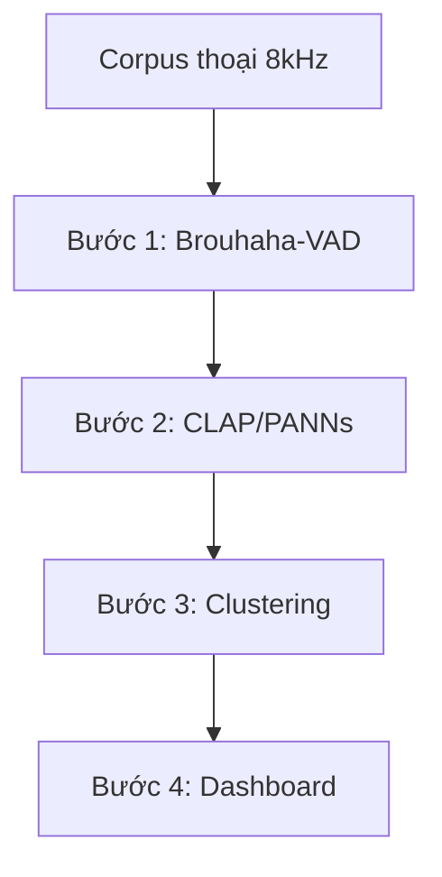

# 03 — Audio Frontend: Phân Loại Nhiễu và Quy Trình Khảo Sát Tín Hiệu Thô

> [!NOTE]
> Tài liệu này thiết lập hệ thống phân loại (taxonomy) nhiễu chi tiết cho layer tín hiệu âm thanh thô.
> Mục tiêu nhằm hỗ trợ quá trình gắn nhãn dữ liệu, phân tích bao quát corpus thoại (EDA), và lựa chọn phương pháp xử lý tối ưu cho từng loại nhiễu.

---

## 1. Dẫn dắt bối cảnh

- **Môi trường vận hành thực tế phức tạp**:
  - Khi xây dựng các hệ thống nhận dạng giọng nói tự động (ASR) phục vụ tổng đài cuộc gọi thực tế, chúng ta thường đối mặt với môi trường âm thanh vô cùng phức tạp và không đồng nhất.
  - Các cuộc gọi đến hệ thống tổng đài chứa đựng nhiều dạng tạp âm khác nhau, từ tiếng ồn môi trường xung quanh người nói cho đến các hao hao đường truyền và phương ngữ đặc trưng vùng miền.

- **Nghịch lý giữa môi trường huấn luyện và thực tế**:
  - Tại sao một mô hình ASR đạt độ chính xác cực cao trên tập dữ liệu thử nghiệm sạch lại gặp thất bại nghiêm trọng khi triển khai thực tế?
  - Tại sao việc áp dụng các mô hình lọc nhiễu (Speech Enhancement) độc lập đôi khi lại khiến tỷ lệ lỗi nhận diện của hệ thống ASR hạ nguồn tăng cao hơn?

- **Mục tiêu của tài liệu**:
  
  Tài liệu này sẽ phân tích chi tiết cơ chế của từng nhóm nhiễu, làm rõ nguyên nhân của sự suy giảm hiệu năng nhận diện, và đề xuất một quy trình khảo sát dữ liệu (EDA) chuẩn hóa dựa trên các bằng chứng khoa học thực nghiệm.

---

## 2. Glossary

Bảng Glossary dưới đây định nghĩa toàn bộ ký hiệu và thuật ngữ viết tắt xuất hiện trong tài liệu:

| Ký hiệu / Thuật ngữ | Tên đầy đủ tiếng Anh | Giải nghĩa tiếng Việt |
| :--- | :--- | :--- |
| `S` | **Stationary** | Tĩnh (đặc trưng phổ nhiễu không đổi theo thời gian). |
| `NS` | **Non-stationary** | Phi tĩnh (đặc trưng phổ nhiễu biến đổi liên tục). |
| `SNR` | **Signal-to-Noise Ratio** | Tỷ lệ tín hiệu trên nhiễu (thước đo độ sạch của âm thanh). |
| `PLC` | **Packet Loss Concealment** | Kỹ thuật che lấp gói thoại bị mất trên VoIP. |
| `DRED` | **Deep Redundancy** | Kỹ thuật truyền gói thoại dự phòng sâu trong codec Opus 1.5. |
| `AGC` | **Automatic Gain Control** | Bộ tự động điều chỉnh mức âm lượng (gain). |
| `VAD` | **Voice Activity Detection** | Bộ phát hiện hoạt động giọng nói. |
| `SED` | **Sound Event Detection** | Bộ phát hiện sự kiện âm thanh. |
| `ASC` | **Acoustic Scene Classification** | Bộ phân loại môi trường âm thanh. |
| `WER` | **Word Error Rate** | Tỷ lệ lỗi từ (chỉ số đánh giá độ sai lệch của hệ thống ASR). |
| `CER` | **Character Error Rate** | Tỷ lệ lỗi ký tự (chỉ số đánh giá độ sai lệch của hệ thống ASR). |
| `ASR` | **Automatic Speech Recognition** | Hệ thống tự động nhận dạng giọng nói. |
| `SE` | **Speech Enhancement** | Tăng cường chất lượng tiếng nói (lọc nhiễu/khử vang). |
| `EDA` | **Exploratory Data Analysis** | Phân tích khám phá dữ liệu. |
| `DSP` | **Digital Signal Processing** | Xử lý tín hiệu số. |
| `OM-LSA` | **Optimally Modified Log-Spectral Amplitude** | Thuật toán biên độ phổ log tối ưu hóa (DSP cổ điển). |
| `MCRA` | **Minima Controlled Recursive Averaging** | Thuật toán trung bình đệ quy kiểm soát bởi giá trị cực tiểu. |
| `VoIP` | **Voice over Internet Protocol** | Truyền giọng nói qua giao thức Internet. |
| `RIR` | **Room Impulse Response** | Đáp ứng xung phòng (dùng để mô phỏng độ vang). |
| `SOTA` | **State-of-the-Art** | Công nghệ tiên tiến nhất hiện nay. |
| `ROI` | **Return on Investment** | Tỷ suất hoàn vốn đầu tư. |

- **Định lượng tỷ lệ tín hiệu trên nhiễu ($SNR$)**:
  - $SNR$ được tính toán trên thang đo Decibel (dB) theo công thức toán học dưới đây:
    $$SNR_{dB} = 10 \log_{10} \left( \frac{P_{signal}}{P_{noise}} \right)$$
  - Trong đó:
    - **$SNR_{dB}$**: Tỷ lệ tín hiệu trên nhiễu tính bằng Decibel (dB).
    - **$P_{signal}$**: Công suất trung bình của tín hiệu hữu ích (**Signal Power**).
    - **$P_{noise}$**: Công suất trung bình của tín hiệu nhiễu nền (**Noise Power**).

---

## 3. Taxonomy Nhiễu Phân Tầng (Dùng Làm Nhãn)

Hệ thống phân loại nhiễu được chia làm 3 nhánh lớn dựa theo nguồn gốc phát sinh tín hiệu:

### 3.1 Nhóm A: Nhiễu ACOUSTIC / Môi trường (Ngoài kênh truyền)

| Nhãn | Loại nhiễu | Tính chất (Tĩnh?) | Dataset tham chiếu |
| :--- | :--- | :--- | :--- |
| `acu.babble` | Tiếng người nói nền / đám đông | NS | MUSAN ✅, NOISEX-92 |
| `acu.street` | Đường phố / giao thông | NS | CHiME (STR) ✅, DEMAND |
| `acu.transport` | Trên xe (bus/ô tô) | NS $\rightarrow$ S | CHiME (BUS) ✅ |
| `acu.cafe` | Quán ăn / nhà hàng ồn | NS | CHiME (CAF) ✅ |
| `acu.music` | Nhạc nền / nhạc chờ (hold music) | NS | MUSAN (music) ✅ |
| `acu.impulse` | Gõ, va đập, đóng cửa (transient) | NS | MUSAN (noise - non-technical) |
| `acu.wind` | Gió thổi vào microphone | NS | DEMAND |
| `acu.device` | Thiết bị điện, quạt, máy lạnh | **S** | MUSAN (noise - technical) |
| `acu.reverb` | Vang phòng / far-field / loa ngoài | Kênh phòng | RIR datasets |

- **Định nghĩa nguồn tham chiếu**:
  - **Dữ liệu MUSAN**:
    - chứa 3 nhãn chính thức bao gồm **music (âm nhạc), speech (giọng nói 12 ngôn ngữ), và noise (nhiễu)** ✅.
    - Trong tập noise có mô tả chi tiết các loại âm thanh kỹ thuật (technical: dialtone/fax) và phi kỹ thuật (non-technical: sấm/gió/bước chân).
    - ⛔ **Cảnh báo**: Nhãn phân tách technical/non-technical **không phải nhãn chính thức** của MUSAN. Tránh ánh xạ cứng nhắc `acu.device` hay `acu.impulse` vào hai nhãn này, chỉ mượn ý niệm mô tả để phân loại.
  - **Dữ liệu CHiME-3/4**:
    - chứa các bản ghi âm thực tế trong 4 môi trường bao gồm bus, cafe, pedestrian (người đi bộ), và street (đường phố).
    - Đây là **ghi âm môi trường thật, không phải mô phỏng** $\rightarrow$ nguồn nhiễu phi tĩnh (non-stationary) thực tế cao ✅.

---

### 3.2 Nhóm B: Nhiễu KÊNH / CODEC Telephony (Đặc thù 8kHz)

| Nhãn | Loại nhiễu | Tính chất (Tĩnh?) | Nguồn tài liệu |
| :--- | :--- | :--- | :--- |
| `ch.narrowband` | Giới hạn băng tần ~3.4kHz (8kHz sampling) | S (méo cố định) | arXiv:2211.01669, arXiv:2603.25727 |
| `ch.codec` | Méo do thuật toán nén G.711/G.729/AMR-NB | S | telcobridges, arXiv:2603.25727 |
| `ch.packetloss` | Mất gói tin VoIP (gây ngắt quãng/dropout) | NS (dạng bursty) | arXiv:2204.05222, arXiv:2401.03687 |
| `ch.jitter` | Trễ / giật gói tin truyền dẫn | NS | Nhóm VoIP chung |
| `ch.clipping` | Bão hòa biên độ tín hiệu (cắt ngọn sóng) | NS | Thực tế đo đạc |
| `ch.agc` | Sự bơm/nén mức âm lượng do AGC | NS | Thực tế thiết bị |
| `ch.echo` | Vọng tín hiệu trên đường truyền | NS | Thực tế tổng đài |

- **Bằng chứng tác động lên hiệu năng ASR (chưa kiểm chứng)**:
  - **Ảnh hưởng của Codec G.711**:
    - Làm tăng tỷ lệ lỗi từ +0.6% WER đối với tiếng Anh và tăng tỷ lệ lỗi ký tự +6.3% CER đối với tiếng Trung trên tập dữ liệu WildASR (arXiv:2603.25727).
  - **Ảnh hưởng của Packet Loss**:
    - Xảy ra trong các đoạn âm hữu thanh (voiced segment) sẽ **phá hủy cấu trúc hài âm và làm hỏng gần như toàn bộ đoạn từ** (Sun et al. dẫn trong arXiv:2204.05222).
  - **Hao hụt do Resampling**:
    - Các mô hình được huấn luyện trên băng rộng wideband (16kHz) sẽ hoạt động kém hiệu quả trên băng hẹp narrowband (8kHz).
    - Việc **gộp chung dữ liệu narrowband và wideband một cách đơn giản là suboptimal** (arXiv:2211.01669).
  - **Kỹ thuật bù gói Opus 1.5**:
    - Tích hợp công nghệ Deep PLC để xử lý các điểm mất gói rải rác.
    - Tích hợp DRED để xử lý tình trạng mất gói liên tục trên các chuỗi dài (couthit).

---

### 3.3 Nhóm C: Biến Thiên NGƯỜI NÓI / HỘI THOẠI (Mô hình coi như nhiễu)

| Nhãn | Loại biến thiên | Nguồn tài liệu |
| :--- | :--- | :--- |
| `spk.dialect` | Giọng địa phương / phương ngữ | ViMD arXiv:2410.03458 (Dữ liệu VN ✅) |
| `spk.codeswitch` | Hiện tượng trộn lẫn Việt - Anh trong câu nói | arXiv:2509.05983, arXiv:2509.24310 (VN) |
| `spk.disfluency` | Ngắt quãng, ậm ừ, lặp từ, sửa lời thoại | Thực tế hội thoại |
| `spk.overlap` | Chồng chéo tiếng nói (crosstalk) | Liên kết layer barge-in |
| `spk.lombard` | Đổi giọng (nói to hơn/cao hơn) trong môi trường ồn | Lombard Effect |
| `spk.farfield` | Nói xa microphone / sử dụng loa ngoài | Tương đương méo vang `acu.reverb` |

- **Bằng chứng thực nghiệm trên tiếng Việt (chưa kiểm chứng)**:
  - **Khó khăn của phương ngữ**:
    - Giọng Trung bộ có tỷ lệ lỗi cao nhất (17.15% WER so với giọng Bắc 12.17% và giọng Nam 13.54%).
    - Việc gộp chung dữ liệu đa phương ngữ lớn gấp 2-3 lần chỉ cải thiện rất ít hiệu năng $\rightarrow$ mang tính chất phi tĩnh đặc thù, **không thể giải quyết triệt để chỉ bằng cách bổ sung thêm data thô** (arXiv:2410.03458).
  - **Ảnh hưởng của Code-switching**:
    - Việc pha trộn từ vựng Việt - Anh làm suy giảm nghiêm trọng độ chính xác của ASR do sự dịch chuyển ngữ âm tinh vi giữa hai hệ thống ngôn ngữ (arXiv:2509.05983).

---

## 4. Cơ Chế Tác Động và Những Hiểu Lầm Phổ Biến

### 4.1 Khái niệm Nhiễu Phi Tĩnh (Non-Stationary Noise)
- ⚙️ **Cơ chế**: Đặc trưng phổ âm thanh và các thuộc tính thống kê biến đổi động liên tục và không thể đoán trước theo thời gian.
- 🔍 **Cách nhận diện**: Tiếng người nói chuyện ồn ào xung quanh (`acu.babble`), tiếng còi xe và động cơ trên đường phố (`acu.street`), nhạc nền có giai điệu biến đổi (`acu.music`).
- 💡 **Ý nghĩa**: Phân loại nhiễu phi tĩnh giúp thiết lập các mô hình lọc nhiễu động dạng học sâu (Deep Denoising) thay vì dùng thuật toán trừ phổ tĩnh.
- ⚠️ **Bẫy**: Sử dụng các phương pháp trừ phổ truyền thống (Spectral Subtraction) hoặc bộ lọc Wiener sẽ không hiệu quả và tạo ra các hiện tượng méo tiếng nghiêm trọng.

### 4.2 Khái niệm Mất Gói Thoại (Packet Loss)
- ⚙️ **Cơ chế**: Các gói tin dữ liệu âm thanh truyền qua môi trường internet (VoIP) bị trễ hoặc thất lạc, dẫn đến sự đứt gãy hoặc mất mát một phần tín hiệu thoại tại các khung thời gian cụ thể.
- 🔍 **Cách nhận diện**: Âm thanh bị giật cục, xuất hiện các khoảng lặng đột ngột (dropout) hoặc tiếng click cơ học trong chuỗi âm thanh nói.
- 💡 **Ý nghĩa**: Nhận biết mất gói để áp dụng các giải pháp bù gói (PLC, DRED) tại tầng giao thức hoặc kênh truyền, bảo vệ tính toàn vẹn của tín hiệu âm học trước khi đưa vào mô hình nhận dạng.
- ⚠️ **Bẫy**: Nhầm lẫn mất gói với khoảng lặng tự nhiên của người nói, dẫn đến việc cắt phân đoạn âm thanh (VAD) bị sai lệch hoặc mô hình ASR giải mã nhầm ký tự.

### 4.3 Khái niệm Hiện Tượng Méo Do Lọc Nhiễu (Denoising Artifacts / Distortion)
- ⚙️ **Cơ chế**: Mô hình lọc nhiễu (SE) khi triệt tiêu âm thanh nền vô tình cắt xén các tần số cao hoặc cấu trúc hài âm của giọng nói thật, tạo ra các tần số giả tạo hoặc làm biến dạng sóng âm.
- 🔍 **Cách nhận diện**: Giọng nói sau lọc nghe có vẻ "nhân tạo", có tiếng vang kim loại (musical noise), hoặc bị mất nguyên âm/phụ âm nhẹ.
- 💡 **Ý nghĩa**: Hiểu rõ hiện tượng này để tránh việc kết hợp độc lập mô hình lọc nhiễu mạnh trước ASR, hướng tới việc huấn luyện chung (joint-train) hoặc train ASR trực tiếp với đa điều kiện (Multi-condition training).
- ⚠️ **Bẫy**: Chỉ đánh giá hiệu năng lọc nhiễu bằng tai người nghe hoặc số đo SNR mà quên đo trực tiếp chỉ số WER/CER trên hệ thống ASR hạ nguồn.

---

## 5. Phương Pháp Xử Lý Tương Ứng Với Loại Nhiễu

Nguyên tắc cốt lõi là **áp dụng cơ chế phễu**: Phân loại nhiễu trước, sau đó chọn phương pháp xử lý chuyên biệt cho từng nhánh thay vì dùng một bộ lọc chung cho toàn bộ dữ liệu.

| Nhóm nhiễu | Phương pháp đề xuất | Giới hạn kỹ thuật |
| :--- | :--- | :--- |
| **Stationary** (`acu.device`) | Spectral Subtraction, Wiener Filter | Hoàn toàn thất bại trước các loại nhiễu phi tĩnh. |
| **Non-Stationary** (`acu.*`) | Deep Denoiser (DNS-style), Multi-condition training (trộn nhiễu MUSAN/RIR khi train) | Dễ tạo ra artifact làm hại mô hình ASR; cần huấn luyện chung SE+ASR. |
| **Kênh / Codec** (`ch.*`) | Channel-aware pretraining, huấn luyện trực tiếp ở tần số 8kHz, PLC (Deep PLC/DRED) | Đòi hỏi thông tin kênh truyền; không tự ý resample lên 16kHz một cách ngây thơ. |
| **Người nói** (`spk.*`) | Đa dạng hóa dữ liệu huấn luyện, fine-tune theo phương ngữ, tone-aware đối với tiếng Việt | Việc thêm dữ liệu có tỷ lệ cải thiện biên giảm dần (khả năng chuyển đổi chéo phương ngữ yếu). |

---

## 6. Quy Trình Khảo Sát (EDA) và Gắn Nhãn Nhiễu

Mục tiêu chính là phân tích một corpus thoại thực tế để phác thảo bản đồ phân bố các loại nhiễu và gắn nhãn tự động theo taxonomy đã thiết lập.

### 6.1 Sơ đồ quy trình 4 bước

#### Khung đọc sơ đồ quy trình:
- **Đề bài cần giải**: Xây dựng quy trình tự động phân tích và phân loại các loại nhiễu từ một tập dữ liệu thoại telephony thô để tối ưu hóa chiến lược tiền xử lý cho mô hình ASR.
- **Giả định nền**: Tập dữ liệu đầu vào là các file âm thanh cuộc gọi tổng đài dạng narrowband (sampling rate 8kHz).
- **Ý nghĩa các khối**:
  - `Corpus`: Dữ liệu thoại đầu vào chưa qua xử lý.
  - `B1`: Đo lường chất lượng vật lý (SNR, độ vang C50, khoảng thoại VAD).
  - `B2`: Nhận diện các sự kiện âm thanh môi trường cụ thể.
  - `B3`: Gom cụm không giám sát để phát hiện các mẫu nhiễu lạ hoặc chưa được định nghĩa.
  - `B4`: Tổng hợp thông tin để đưa ra báo cáo trực quan.
- **Cách đọc và ứng dụng**: Quy trình chạy tuần tự từ trái qua phải; kết quả thu được ở bước cuối cùng (`B4`) sẽ giúp kỹ sư quyết định mô hình lọc nhiễu nào cần áp dụng cho phân khúc cuộc gọi nào.

---

### 6.2 Chi tiết các bước thực hiện

- **Bước 1 — Đo lường chất lượng vật lý từng file**:
  - Sử dụng thư viện `Brouhaha-VAD` chạy trực tiếp trên Python.
  - Trích xuất 3 chỉ số theo từng khung thời gian bao gồm: **SNR, C50 (độ vang), và khoảng hoạt động giọng nói (VAD)**.
  - Xây dựng biểu đồ phân bố SNR của toàn bộ tập dữ liệu để nhanh chóng định vị và lọc bỏ các file âm thanh quá bẩn. Đây là phương án kiểm tra có chi phí thấp nhất.

- **Bước 2 — Phân loại sự kiện âm thanh tự động**:
  - Sử dụng mô hình học sâu `PANNs` (nhận diện 527 lớp âm học của AudioSet) hoặc mô hình CLAP (truy vấn không nhãn zero-shot bằng văn bản, ví dụ: "background music", "street traffic").
  - Ánh xạ các nhãn sự kiện này về nhóm nhãn môi trường `acu.*`.

- **Bước 3 — Gom cụm không giám sát (Clustering)**:
  - Trích xuất đặc trưng nhúng (embedding) của file âm thanh bằng các mô hình wav2vec hoặc CLAP.
  - Tiến hành gom cụm để **phát hiện ra các nhóm nhiễu đặc thù chưa được đặt tên** xuất hiện trong tập dữ liệu.

- **Bước 4 — Hợp nhất và trực quan hóa dữ liệu**:
  - Đồng bộ hóa các nhãn chất lượng vật lý (Bước 1), nhãn sự kiện âm thanh (Bước 2), và nhóm cụm nhiễu (Bước 3) vào hệ thống nhãn taxonomy.
  - Dựng dashboard thống kê chi tiết sự phân bố chéo giữa: Loại nhiễu $\times$ Ngưỡng SNR $\times$ Đặc trưng phương ngữ vùng miền.

> ⚠️ **Cảnh báo giới hạn kỹ thuật**:
> - Các mô hình phân loại âm thanh PANNs, AST, BEATs, CLAP được huấn luyện chủ yếu trên tập dữ liệu AudioSet băng rộng (16kHz).
> - **Hiệu năng của các mô hình này trên tín hiệu điện thoại băng hẹp (8kHz narrowband) chưa được kiểm chứng thực tế**.
> - Do đó, VAD và SNR đo từ `Brouhaha-VAD` là chỉ số an toàn nhất để bắt đầu; đối với các nhãn phân loại từ PANNs/CLAP, cần tiến hành **đo đạc và đánh giá độ chính xác độc lập trên tập dữ liệu 8kHz** trước khi đưa vào sản xuất.

---

## 7. Bằng Chứng Thực Nghiệm Riêng Cho Tiếng Việt

Các bằng chứng khoa học được ghi nhận riêng trên các tập dữ liệu tiếng Việt bao gồm:

- **Dữ liệu phương ngữ ViMD (arXiv:2410.03458 - EMNLP, đã xác minh ✅)**:
  - Bộ dữ liệu đa phương ngữ bao trùm 63 tỉnh thành Việt Nam với tổng lượng dữ liệu 102.56 giờ thoại (~19k câu nói, 12,955 người nói).
  - **Kết luận thực nghiệm**: Việc gộp chung dữ liệu đa phương ngữ với quy mô lớn hơn từ 2 đến 3 lần chỉ giúp cải thiện rất ít hiệu năng nhận diện (giọng Bắc tăng +1.86%, giọng Trung tăng +3.07%, giọng Nam tăng +2.34% WER).
  - Điều này chứng minh phương ngữ mang tính chất phi tĩnh đặc thù và không thể giải quyết đơn thuần bằng việc tăng quy mô dữ liệu huấn luyện thô, đòi hỏi các cấu trúc kiến trúc nhận diện chuyên biệt (accent-aware).

- **ASR 8kHz lĩnh vực Y tế (arXiv:2309.15869, chưa kiểm chứng ⚠️)**:
  - Hệ thống được tối ưu hóa trực tiếp trên luồng tín hiệu cuộc gọi điện thoại 8kHz mà không qua bước resample lên 16kHz.
  - Thử thách thực tế nằm ở sự mất cân bằng dữ liệu nghiêm trọng: Dữ liệu huấn luyện nội bộ chủ yếu gồm giọng Bắc và giọng Trung, **rất thiếu dữ liệu giọng Nam**.

- **Trộn lẫn ngôn ngữ Việt - Anh (arXiv:2509.05983, arXiv:2509.24310 - chưa kiểm chứng ⚠️)**:
  - Thử nghiệm trên mô hình TSPC (phoneme-centric tone-aware) cho kết quả đạt **19.06% WER**, vượt trội so với PhoWhisper-base (27.9% WER).
  - Đây là báo cáo tự đánh giá trong bản thảo preprint (tháng 9/2025), chưa có kết quả kiểm chứng độc lập.
  - Lưu ý kết luận "lệch văn bản (text mismatch) có tác động tiêu cực lớn hơn lệch giọng nói (accent mismatch)" được chứng minh trên cặp ngôn ngữ Mandarin - English với dữ liệu giả lập TTS, **không tự động suy rộng ra cho cặp ngôn ngữ Việt - Anh**.

---

## 8. Đánh Giá Luận Điểm và Câu Hỏi Mở

### 8.1 Luận điểm "Khó nhưng mang lại ROI thấp"
- **Đặc trưng độ khó có cơ sở vững chắc**:
  - Nhiều bằng chứng thực nghiệm cho thấy các yếu tố nhiễu môi trường, codec kênh truyền, và phương ngữ làm sụt giảm nghiêm trọng hiệu năng của mô hình ASR hạ nguồn.
  - Việc đơn thuần gia tăng dung lượng dữ liệu huấn luyện thô không giải quyết triệt để vấn đề do khả năng chuyển đổi chéo phương ngữ (cross-dialect transfer) rất yếu.
- **Tính chính xác của luận điểm "ROI thấp" chưa được xác minh**:
  - Chưa có bất kỳ nghiên cứu khoa học hoặc báo cáo thực tế nào xác nhận việc tối ưu hóa layer Audio Frontend mang lại tỷ suất hoàn vốn thấp.
  - Ngược lại, việc giải quyết triệt để các thách thức đặc thù của tiếng Việt và phương ngữ vùng miền có thể trở thành **lợi thế phòng thủ cốt lõi (defensible moat)** cho sản phẩm, giúp cạnh tranh trực tiếp với các giải pháp tổng quát của Big Tech vốn bỏ ngỏ thị trường ngách này.

### 8.2 Các câu hỏi mở cần thực nghiệm làm rõ
1. **Khả năng hoạt động của tooling trên tín hiệu 8kHz**:
   - Các mô hình trích xuất đặc trưng và phân loại sự kiện âm học (PANNs/CLAP) khi chạy trên tín hiệu narrowband 8kHz có bị suy giảm độ chính xác không? Cần tự thực hiện đo đạc thực tế.
2. **Bản đồ phân bố nhiễu thực tế tại Việt Nam**:
   - Ngưỡng SNR trung bình và tỷ lệ mất gói tin (packet loss) thực tế trên hệ thống tổng đài cuộc gọi tại Việt Nam là bao nhiêu?
3. **Sự thiếu hụt nguồn dữ liệu nhiễu telephony nội địa**:
   - Hiện tại chưa có bộ dữ liệu chuẩn nào cho tiếng Việt tích hợp các đặc trưng hold-music, tiếng ồn babble, phương ngữ, kết hợp với các hao hao kênh truyền (codec) cùng một lúc.
4. **Đo lường giá trị kinh doanh (ROI)**:
   - Cần khảo sát và thiết lập các chỉ số đo lường hiệu quả kinh doanh cụ thể khi cải thiện độ chính xác của mô hình ASR đối với các cuộc gọi lỗi/nhiễu.

---

## 9. Danh Mục Nguồn Tham Chiếu

### 9.1 Bài báo khoa học (arXiv / Hội nghị)

| Link tài liệu | Nội dung chứng minh | Trạng thái xác minh |
| :--- | :--- | :--- |
| [arXiv:1510.08484](https://arxiv.org/abs/1510.08484) | Thiết lập tập dữ liệu MUSAN gồm 3 nhãn music/speech/noise. | ✅ Đã xác minh (⛔ loại bỏ claim chia nhãn cứng technical/non-technical). |
| [arXiv:2211.01669](https://arxiv.org/pdf/2211.01669) | Băng hẹp 8kHz cần xử lý riêng biệt; ghép nối ngây thơ là suboptimal. | ✅ Đã xác minh (⛔ loại bỏ claim giải thích mô hình tự bịa dải tần >4kHz). |
| [arXiv:1803.00396](https://arxiv.org/pdf/1803.00396) | Phương pháp trừ phổ truyền thống chạy tốt ở nhiễu tĩnh, hỏng ở nhiễu phi tĩnh. | ✅ Đã xác minh. |
| [Cohen (2001)](https://israelcohen.com/wp-content/uploads/2018/05/sp_Nov2001.pdf) | Thiết lập thuật toán OM-LSA + MCRA để ước lượng phổ nhiễu phi tĩnh. | ✅ Đã xác minh. |
| [arXiv:2008.09175](https://arxiv.org/pdf/2008.09175) | Đánh giá hiệu năng nhận dạng dưới ảnh hưởng của nhiễu phi tĩnh và 6 mức SNR. | ✅ Đã xác minh. |
| [arXiv:2410.03458](https://arxiv.org/html/2410.03458v1) | Dataset ViMD chứng minh thêm dữ liệu phương ngữ mang lại hiệu quả biên giảm dần. | ✅ Đã xác minh (Peer-reviewed). |
| [arXiv:2509.05983](https://arxiv.org/pdf/2509.05983) | Mô hình TSPC xử lý hiện tượng trộn Việt - Anh đạt 19.06% WER. | ⚠️ Chưa kiểm chứng độc lập (Bản thảo tự báo cáo). |
| [arXiv:2509.24310](https://arxiv.org/pdf/2509.24310) | Sai lệch ký tự (text mismatch) tác động tiêu cực mạnh hơn sai lệch giọng nói. | ⚠️ Phạm vi nghiên cứu giới hạn trên Mandarin-English. |
| [arXiv:2104.10747](https://arxiv.org/pdf/2104.10747) | Mô hình ASR suy giảm khả năng tổng quát hóa trên các giọng nói địa phương. | ✅ Đã xác minh. |
| [arXiv:2311.11599](https://arxiv.org/abs/2311.11599) | Bộ tiền xử lý lọc nhiễu làm giảm artifact-error nhưng lại tăng noise-error đối với ASR. | ✅ Đã xác minh. |
| [arXiv:2205.13293](https://arxiv.org/pdf/2205.13293) | Các méo dạng âm học do lọc nhiễu đòi hỏi phải huấn luyện chung SE+ASR. | ✅ Đã xác minh. |
| [arXiv:2204.05222](https://arxiv.org/pdf/2204.05222) | Packet loss phá hủy cấu trúc các đoạn hữu thanh; Deep PLC cải thiện chỉ số WER. | ⚠️ Tài liệu tham chiếu thứ cấp, chưa qua kiểm chứng độc lập. |
| [arXiv:2401.03687](https://arxiv.org/pdf/2401.03687) | Tình trạng mất gói tin phổ biến trên VoIP và vai trò của các giải pháp PLC. | Chưa qua xác minh đối nghịch. |
| [arXiv:2603.25727](https://arxiv.org/html/2603.25727) | Đo lường mức độ suy giảm WER/CER dưới ảnh hưởng của codec G.711 và nhiễu nền. | Chưa qua xác minh đối nghịch. |
| [arXiv:2309.15869](https://arxiv.org/pdf/2309.15869) | Mô hình ASR tiếng Việt 8kHz phục vụ y tế gặp thách thức thiếu giọng miền Nam. | Chưa qua xác minh đối nghịch. |

---

### 9.2 Dữ liệu và Tài liệu kỹ thuật chính thức

- **Dữ liệu CHiME-3/4 Challenge**:
  - Link: [CHiME-3 Data Specification](https://www.chimechallenge.org/challenges/chime3/data)
  - Chứng minh: Thu thập dữ liệu thực tế tại 4 môi trường giao thông, quán cafe, đường phố và xe bus ✅.
- **Tài liệu Codec của Telcobridges**:
  - Link: [VoIP Codec Guide](https://telcobridges.com/learning/sip-trunking/voip-codec-guide/)
  - Chứng minh: Phân loại dải tần narrowband (G.711/G.729) và wideband (Opus/AMR-WB).

---

### 9.3 Mã nguồn mở phục vụ khảo sát (EDA)

- **Brouhaha-VAD**:
  - Link: [marianne-m/brouhaha-vad](https://github.com/marianne-m/brouhaha-vad)
  - Ứng dụng: Dự đoán đồng thời SNR, C50 (độ vang) và VAD trên từng file âm thanh thô.
- **PANNs Inference**:
  - Link: [qiuqiangkong/panns_inference](https://github.com/qiuqiangkong/panns_inference)
  - Ứng dụng: Nhận diện và gắn nhãn 527 sự kiện âm thanh môi trường.

---

### 9.4 Các tài liệu kỹ thuật khác

- **Công nghệ bù gói của Opus 1.5**:
  - Link: [Opus Deep PLC & DRED Blog](https://www.couthit.com/opus-deep-plc/)
  - Chứng minh: Sử dụng mạng học sâu phục vụ bù gói mất rải rác và dự phòng chuỗi dài.
- **Mô hình trích xuất đặc trưng CLAP**:
  - Link: [CLAP Feature Extraction Guide](https://medium.com/axinc-ai/clap-feature-extraction-model-for-searching-audio-from-text-dcfd4c93756e)
  - Ứng dụng: Tìm kiếm và phân loại âm thanh bằng truy vấn văn bản.

---

## 10. ✅ Tự Kiểm Nhanh

<b>Câu hỏi 1: Tại sao việc cắm nối tiếp một mô hình lọc nhiễu mạnh (Standalone Speech Enhancement) trước mô hình ASR đôi khi lại làm tăng tỷ lệ lỗi nhận diện (WER)?</b>

- **Cơ chế suy giảm**:
  - Các mô hình lọc nhiễu mạnh thường tập trung vào việc triệt tiêu tối đa tiếng ồn nền để âm thanh nghe dễ chịu hơn với tai người.
  - Tuy nhiên, quá trình này vô tình tạo ra các **méo dạng âm học (artifacts/distortion)** do cắt lẹm vào tần số của giọng nói thật hoặc tạo ra các sóng âm nhân tạo.
  - Các mô hình nhận dạng giọng nói ASR rất nhạy cảm với các biến đổi phổ nhỏ này. Sự xuất hiện của các méo dạng (artifacts) gây ra sai số nhận dạng lớn hơn cả khi để nguyên nhiễu nền chưa lọc.
- **Giải pháp khắc phục**:
  - Tránh thiết kế hệ thống dạng cascade độc lập.
  - Nên sử dụng phương pháp huấn luyện đa điều kiện (Multi-condition training - trộn lẫn nhiễu vào dữ liệu huấn luyện ASR) hoặc huấn luyện chung cả hai mô hình lọc nhiễu và nhận dạng giọng nói (Joint SE-ASR training).

<b>Câu hỏi 2: Sự khác biệt bản chất giữa nhiễu tĩnh (Stationary Noise) và nhiễu phi tĩnh (Non-stationary Noise) tác động như thế nào đến việc lựa chọn thuật toán xử lý?</b>

- **Nhiễu tĩnh (Stationary Noise)**:
  - *Cơ chế*: Có đặc tính thống kê phổ ổn định và hầu như không thay đổi theo thời gian (ví dụ: tiếng quạt máy, tiếng điều hòa nhiệt độ).
  - *Phương pháp xử lý*: Dễ dàng giải quyết bằng các thuật toán xử lý tín hiệu số (DSP) truyền thống như trừ phổ (Spectral Subtraction) hoặc bộ lọc Wiener bằng cách ước lượng phổ nhiễu trong các khoảng lặng và trừ trực tiếp vào tín hiệu.
- **Nhiễu phi tĩnh (Non-stationary Noise)**:
  - *Cơ chế*: Phổ nhiễu biến đổi liên tục và chồng lấn trực tiếp vào băng tần giọng nói (ví dụ: tiếng người nói chuyện ồn ào xung quanh, tiếng còi xe giao thông).
  - *Phương pháp xử lý*: Các thuật toán tĩnh truyền thống hoàn toàn thất bại. Đòi hỏi phải sử dụng các mô hình học sâu (Deep Denoiser) có khả năng theo dõi biến động động của phổ nhiễu theo thời gian thực.

<b>Câu hỏi 3: Quy trình khảo sát dữ liệu (EDA) rẻ nhất để nhanh chóng đánh giá phân bố chất lượng của một tập dữ liệu thoại thô gồm những bước nào?</b>

- **Bước 1**: Chạy công cụ `Brouhaha-VAD` trực tiếp trên tập dữ liệu thoại narrowband 8kHz để trích xuất 3 chỉ số vật lý cơ bản: SNR (tỷ lệ tín hiệu/nhiễu), C50 (độ vang) và VAD (khoảng hoạt động giọng nói).
- **Bước 2**: Vẽ biểu đồ phân bố SNR của toàn bộ corpus để nhận diện nhanh tỷ lệ phần trăm các file âm thanh dưới ngưỡng chất lượng chấp nhận được (ví dụ: < 10dB).
- **Bước 3**: Lọc bỏ các file âm thanh quá bẩn hoặc quá vang trước khi đưa vào huấn luyện mô hình, giúp tiết kiệm thời gian và tài nguyên tính toán.

