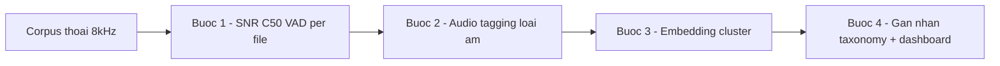

# 03 — Audio Frontend: TAXONOMY NHIỄU + EDA/gắn nhãn

Layer tín hiệu thô — trọng tâm là **bóc tách các loại nhiễu** (điểm đau số 1 của team) thành một taxonomy đủ tỉ mỉ để (a) gắn nhãn, (b) EDA nhìn bao quát một corpus, (c) chọn cách xử lý theo từng loại.

Nguồn: deep-research (24 nguồn primary, 112 claim → **25 claim đưa vào kiểm chứng đối nghịch 3 vòng: 23 confirmed, 2 bị bác**). ✅ = đã xác minh; ⛔ = bị bác; còn lại là suy luận tổng hợp hoặc chưa có claim trực tiếp (ghi rõ tại chỗ). Số liệu cụ thể vẫn nên đọc lại nguồn ở [§7](#7-nguồn-tổ-chức-theo-loại) trước khi trích cho leader.

> **2 claim BỊ BÁC (⛔) — đừng dùng:** (1) MUSAN **không** có nhãn chính thức "technical/non-technical" (chỉ là mô tả nội bộ tập noise — dùng làm tham chiếu định nghĩa thì OK, làm schema nhãn cứng thì KHÔNG); (2) diễn giải "narrowband làm model bịa prediction cho dải >4kHz" là overreach (suy giảm có thật, cách giải thích sai).

---

## Glossary

- **Stationary noise** — nhiễu có thống kê (phổ) gần như không đổi theo thời gian (vd quạt, hum điện). Dễ ước lượng & trừ.
- **Non-stationary noise** — nhiễu đổi liên tục (vd babble, đường phố, nhạc). **Khó** — giống dữ liệu non-stationary của quant-trading.
- **SNR** (Signal-to-Noise Ratio) — tỉ lệ tín hiệu/nhiễu; thước đo "mức bẩn" của một đoạn audio.
- **Narrowband** — băng hẹp ~300-3400Hz (điện thoại 8kHz sampling); **wideband** = 16kHz+.
- **PLC** (Packet Loss Concealment) — kỹ thuật che lấp gói thoại bị mất trên VoIP.
- **AGC** (Automatic Gain Control) — tự động chỉnh mức to/nhỏ; **Lombard effect** — người nói tự đổi giọng (to/cao hơn) khi ở môi trường ồn.
- **SED / ASC** — Sound Event Detection / Acoustic Scene Classification (gắn nhãn loại âm/cảnh).

---

## 1. TAXONOMY NHIỄU PHÂN TẦNG (deliverable chính — dùng làm nhãn)

Ba nhánh lớn theo **nguồn gốc** nhiễu. Cột "tĩnh?" = stationary (S) / non-stationary (NS). Cột "dataset/nguồn tham chiếu" để gắn định nghĩa.

### A. Nhiễu ACOUSTIC / môi trường (ngoài kênh)

| Nhãn | Loại | Tĩnh? | Dataset tham chiếu |
|------|------|-------|--------------------|
| `acu.babble` | Tiếng người nói nền/đám đông | NS | MUSAN ✅, NOISEX-92 |
| `acu.street` | Đường phố / giao thông | NS | CHiME (STR) ✅, DEMAND |
| `acu.transport` | Trên xe (bus/ô tô) | NS→S | CHiME (BUS) ✅ |
| `acu.cafe` | Quán/nhà hàng ồn | NS | CHiME (CAF) ✅ |
| `acu.music` | Nhạc nền / hold music | NS | MUSAN (music, nhiều genre) ✅ |
| `acu.impulse` | Gõ, va đập, đóng cửa (transient) | NS | MUSAN (mô tả non-technical) |
| `acu.wind` | Gió | NS | DEMAND |
| `acu.device` | Hum điện, quạt, máy lạnh | **S** | MUSAN (mô tả technical) |
| `acu.reverb` | Vang phòng / far-field / loa ngoài | (kênh phòng) | RIR datasets |

> Neo định nghĩa: **MUSAN** = 3 nhãn chính thức **music + speech(12 ngôn ngữ) + noise** ✅. Trong tập noise có *mô tả* technical (dialtone/fax) vs non-technical (sấm/gió/bước chân) nhưng ⛔ **đây KHÔNG phải nhãn split chính thức** — đừng map cứng `acu.device`/`acu.impulse` vào "technical/non-technical" của MUSAN, chỉ mượn ý niệm. **CHiME-3/4** = 4 môi trường thật bus/cafe/pedestrian/street, **ghi âm thật không phải mô phỏng** → nguồn non-stationary thật ✅.

### B. Nhiễu KÊNH / CODEC telephony (đặc thù 8kHz) — thường bị bỏ quên

| Nhãn | Loại | Tĩnh? | Nguồn |
|------|------|-------|-------|
| `ch.narrowband` | Cắt băng ~3.4kHz (8kHz sampling) | S (méo cố định) | 2211.01669, 2603.25727 |
| `ch.codec` | Méo nén G.711/G.729/AMR-NB (8kHz) vs Opus/AMR-WB | S | telcobridges, 2603.25727 |
| `ch.packetloss` | Mất gói VoIP (dropout) | NS (bursty) | 2204.05222, 2401.03687 |
| `ch.jitter` | Trễ/giật gói | NS | (cùng nhóm VoIP) |
| `ch.clipping` | Bão hòa biên độ | NS | — |
| `ch.agc` | AGC bơm/nén mức | NS | — |
| `ch.echo` | Vọng đường truyền | NS | — |

> Bằng chứng tác động lên ASR **(chưa kiểm chứng)**: G.711 codec làm WER tiếng Anh +0.6, CER tiếng Trung +6.3 trên WildASR (2603.25727); packet loss trong đoạn voiced "làm hỏng gần như toàn bộ đoạn" (Sun et al. dẫn trong 2204.05222); model wideband 16kHz chạy kém trên 8kHz, **gộp dữ liệu narrowband + wideband một cách ngây thơ là suboptimal** (2211.01669). Opus 1.5 có Deep PLC (mất rải rác) + DRED (mất chuỗi dài) (couthit).

### C. Biến thiên NGƯỜI NÓI / HỘI THOẠI (model coi như "nhiễu")

| Nhãn | Loại | Nguồn |
|------|------|-------|
| `spk.dialect` | Giọng địa phương / phương ngữ | ViMD 2410.03458 (VN ✅data) |
| `spk.codeswitch` | Trộn Việt-Anh trong câu | 2509.05983, 2509.24310 (VN) |
| `spk.disfluency` | Ậm ừ, lặp, sửa lời | — |
| `spk.overlap` | Chồng tiếng / crosstalk | (nối layer 05 barge-in) |
| `spk.lombard` | Đổi giọng khi nói trong ồn | — |
| `spk.farfield` | Nói xa mic / loa ngoài | (≈ `acu.reverb`) |

> **Tiếng Việt — bằng chứng trực tiếp (chưa kiểm chứng):** phương ngữ **Trung bộ khó nhất** (WER 17.15% vs Bắc 12.17% / Nam 13.54%), và **gộp đa phương ngữ 2-3× dữ liệu chỉ cải thiện ít** → đúng tính non-stationary, "không giải được bằng cách thêm data" (2410.03458). Code-switching Việt-Anh suy giảm ASR do dịch chuyển ngữ âm tinh vi (2509.05983).

---

## 2. Vì sao khó: NON-STATIONARY + denoising có thể PHẢN TÁC DỤNG

- Phép so sánh với **non-stationary data của quant-trading là chính xác**: các nhãn NS ở trên (babble, street, packet-loss, dialect) đổi liên tục → mô hình/ước lượng tĩnh luôn lệch. Đây là lý do "denoise chung chung" thất bại.
- ✅ **Đã xác minh (3-0):** spectral subtraction chạy tốt với nhiễu **stationary** nhưng suy giảm với **non-stationary** vì không ước lượng được phổ nhiễu biến thiên; noise estimator cổ điển (VAD-based) giả định phổ nhiễu đứng yên khi có tiếng nói nên không track kịp (1803.00396, Cohen 2001). Hướng DSP cổ điển cho non-stationary là **OM-LSA + MCRA** (recursive-averaging theo speech-presence-probability) — hiểu bản chất + giới hạn, **không phải SOTA deep-learning**, đừng dùng làm baseline triển khai.
- ✅ **Cảnh báo đã xác minh MẠNH (3-0, 3 nguồn):** denoising/SE front-end có thể **làm HẠI ASR** — train SE theo mục tiêu ASR giảm *artifact-error* nhưng **tăng *noise-error***; speech đã enhance chứa distortion không tối ưu cho recognizer (2311.11599 NTT, 2205.13293 USTC, 2404.14860). → **không cắm denoiser mạnh trước ASR rồi tưởng xong**; hướng đúng là joint pre-training SE+ASR / channel-aware.

## 3. Phương pháp xử lý — map theo loại nhiễu

| Nhóm nhiễu | Phương pháp hợp | Giới hạn |
|------------|-----------------|----------|
| Stationary (`acu.device`) | Spectral subtraction, Wiener | Hỏng với non-stationary |
| NS môi trường (`acu.*`) | DNS-style deep denoiser, **multi-condition training** (trộn MUSAN/RIR khi train) | Artifact hại ASR; cần joint-train SE+ASR |
| Kênh/codec (`ch.*`) | **Channel-aware pretraining**, train thẳng ở 8kHz, PLC (Deep PLC/DRED) | Phải biết channel; không resample lên 16kHz một cách ngây thơ |
| Người nói (`spk.*`) | Đa dạng data + fine-tune theo phương ngữ; tone-aware cho VN | Thêm data lợi ít (cross-dialect transfer yếu) |

> Nguyên tắc "phễu": phân loại nhiễu **trước** → chọn xử lý theo loại, thay vì một denoiser cho tất cả.

## 4. QUY TRÌNH EDA + GẮN NHÃN NHIỄU (phần Kỳ thấy khó nhất — đề xuất khả thi, rẻ)

Mục tiêu: từ một corpus thoại thật → **nhìn bao quát phân bố các loại nhiễu** + gắn nhãn theo taxonomy §1. Pipeline 4 bước, dùng tool chạy được ngay:

- **Bước 1 — Chấm điểm chất lượng từng file:** [`Brouhaha-VAD`](https://github.com/marianne-m/brouhaha-vad) cho ra **SNR + C50 (độ vang) + VAD** theo frame, cài `pip`, chạy ngay → dựng **phân bố SNR** và lọc file "bẩn". Đây là cách rẻ nhất để có cái nhìn đầu tiên.
- **Bước 2 — Gắn nhãn loại âm tự động:** [`PANNs`](https://github.com/qiuqiangkong/panns_inference) (audio tagging 527 lớp AudioSet) hoặc **CLAP** (zero-shot: tra audio bằng mô tả text như "background music", "street traffic") → ánh xạ sang nhãn `acu.*`.
- **Bước 3 — Embedding + clustering:** nhúng audio (wav2vec/CLAP) → cluster để **lộ ra các nhóm nhiễu chưa đặt tên** (đúng nhu cầu "nhìn bao quát").
- **Bước 4 — Gắn nhãn taxonomy + dashboard:** hợp nhãn từ bước 1-3 vào schema §1, dựng bảng phân bố (loại nhiễu × SNR × phương ngữ).

> ⚠️ **Cảnh báo độ tin (từ kiểm chứng):** PHẦN tooling EDA là chỗ **chưa có claim nào xác minh trực tiếp**. Cụ thể: **PANNs/AST/BEATs/CLAP train trên AudioSet 16kHz — hiệu năng trên audio telephony 8kHz narrowband CHƯA được kiểm chứng** (open question). Brouhaha-VAD (SNR/C50/VAD) là phần an toàn nhất để bắt đầu; với PANNs/CLAP cần **tự đo trên 8kHz** trước khi tin. Khung NHÃN (stationary↔non-stationary + 4-môi-trường CHiME + SNR×mức + channel-tag) thì đã tựa trên claim xác minh.

> Đây là **module add-on rẻ, chạy sớm** — không cần GPU lớn, ra được "bản đồ nhiễu" của corpus trong vài ngày. Là điểm khởi đầu hợp lý cho layer 03.

## 5. Bằng chứng riêng cho TIẾNG VIỆT (tách bạch, chưa kiểm chứng)

- ✅ **ViMD** (2410.03458, EMNLP — peer-reviewed): dataset đa phương ngữ, 63 tỉnh, 102.56h, ~19k câu, 12.955 speaker. **Đã xác minh 3-0:** gộp data đa-phương-ngữ lớn gấp 2-3× chỉ cho lợi NHỎ (Bắc +1.86% / Trung +3.07% / Nam +2.34% WER) → phương ngữ **không đập tan được bằng cách thêm data**, cần xử lý accent-aware có cấu trúc.
- **ASR 8kHz y tế tiếng Việt** (2309.15869): làm thẳng trên tín hiệu điện thoại 8kHz (không resample), in-house chủ yếu giọng Bắc/Trung, **rất ít giọng Nam** → đúng `ch.narrowband` + `spk.dialect` cho VN. *(claim chưa nằm trong tập verify, đọc nguồn)*.
- **Code-switching Việt-Anh** (2509.05983 TSPC, 2509.24310): TSPC phoneme-centric tone-aware đạt **19.06% WER** vượt PhoWhisper-base (27.9%) — ⚠️ **vote 2-1 (medium)**: preprint 9/2025 tự báo cáo, chưa replicate độc lập. Claim "đặc tính TEXT ảnh hưởng > accent" có scope **Mandarin-English** (accent giả lập TTS), **không suy thẳng sang tiếng Việt**.

> ✅ Bằng chứng VN **mạnh ở phương ngữ/accent** (ViMD peer-reviewed). ⚠️ Mảng **codec/packet-loss/SE là general ASR — KHÔNG có số riêng cho tiếng Việt**, phải đánh dấu "chưa xác minh cho VN" khi áp dụng.

## 6. Luận điểm "khó × ROI thấp" của Kỳ — đánh giá ngắn

- **Phần "khó" có cơ sở:** nhiều bằng chứng cho thấy nhiễu/giọng/codec làm giảm ASR rõ rệt và **thêm data không giải được** (cross-dialect transfer yếu) → đúng bản chất non-stationary.
- **Phần "ROI thấp" CHƯA có nguồn xác nhận** (góc contrarian/industry bị cắt). Đây mới là **giả thuyết của Kỳ**, chưa kiểm chứng — đừng trình như sự thật. Ngược lại, chính cái "khó" này có thể là **lợi thế phòng thủ** (defensible moat) nếu giải được phần tiếng Việt/giọng địa phương mà big-tech bỏ ngỏ.

## 6b. Câu hỏi mở (cần đo trên data thật của team)

1. **Tooling EDA trên 8kHz:** PANNs/AST/BEATs/CLAP train AudioSet 16kHz — chạy tốt trên telephony 8kHz narrowband không? Chưa nguồn nào xác minh → phải tự đo.
2. **Phân bố nhiễu thật của tổng đài VN:** ngưỡng SNR + mức packet-loss thực tế là bao nhiêu? (số 0-20% loss, 0-20dB SNR là từ study nước ngoài).
3. **Dataset nhiễu telephony tiếng Việt:** có corpus hold-music/babble/accent×codec riêng cho VN để augment không? ViMD là audio phương ngữ, không phải corpus nhiễu telephony.
4. **"ROI thấp":** chưa có nguồn — cần khảo sát riêng góc business nếu muốn dùng luận điểm này với leader.

---

## 7. Nguồn (tổ chức theo loại)

### (a) Paper arXiv / hội nghị
| Link | Chứng minh | Trạng thái |
|------|-----------|-----------|
| https://arxiv.org/abs/1510.08484 | MUSAN: 3 nhãn music/speech(12 lang)/noise | ✅ 3-0 (⛔ technical/non-technical KHÔNG phải nhãn chính thức) |
| https://arxiv.org/pdf/2211.01669 | Narrowband 8kHz là điều kiện riêng; gộp với wideband ngây thơ = suboptimal | ✅ (⛔ phần "model bịa >4kHz" bị bác) |
| https://arxiv.org/pdf/1803.00396 | Spectral subtraction tốt cho stationary, suy giảm với non-stationary | ✅ 3-0 |
| https://israelcohen.com/.../sp_Nov2001.pdf | OM-LSA + MCRA: noise estimate cho non-stationary (DSP cổ điển) | ✅ 3-0 |
| https://arxiv.org/pdf/2008.09175 | Đánh giá trên non-stationary noise × 6 mức SNR (trục SNR cho EDA) | ✅ 3-0 |
| https://arxiv.org/html/2410.03458v1 | ViMD: đa phương ngữ VN; gộp data lợi nhỏ (Bắc/Trung/Nam +1.86/3.07/2.34%) | ✅ 3-0 (peer-reviewed) |
| https://arxiv.org/pdf/2509.05983 | Code-switching Việt-Anh TSPC 19.06% WER | ⚠️ 2-1 (preprint tự báo) |
| https://arxiv.org/pdf/2509.24310 | CS-ASR: text mismatch hại > accent | ⚠️ scope Mandarin-EN, không suy thẳng sang VN |
| https://arxiv.org/pdf/2104.10747 | ASR generalize kém trên accent; 2 nhánh xử lý (invariant / accent-feature) | ✅ 3-0 |
| https://arxiv.org/abs/2311.11599 | SE front-end giảm artifact-error nhưng tăng noise-error | ✅ 3-0 |
| https://arxiv.org/pdf/2205.13293 | SE standalone méo tiếng → joint pre-train SE+ASR | ✅ 3-0 |
| https://arxiv.org/pdf/2204.05222 | Packet loss phá đoạn voiced; Deep PLC cải thiện WER | ⚠️ nguồn yếu, chưa qua verify |
| https://arxiv.org/pdf/2401.03687 | Packet loss phổ biến VoIP, PLC giảm hại | chưa qua verify |
| https://arxiv.org/html/2603.25727 | Số liệu codec G.711 + noise tăng WER/CER (WildASR) | chưa qua verify |
| https://arxiv.org/pdf/2309.15869 | ASR VN 8kHz y tế; thiếu giọng Nam | chưa qua verify |

### (b) Doc / dataset chính thức
| Link | Chứng minh | Trạng thái |
|------|-----------|-----------|
| https://www.chimechallenge.org/challenges/chime3/data | CHiME-3/4: 4 môi trường thật (BUS/CAF/PED/STR), ghi âm thật | ✅ 3-0 |
| https://telcobridges.com/learning/sip-trunking/voip-codec-guide/ | G.711/G.729/AMR-NB = 8kHz narrowband; G.722/AMR-WB/Opus = wideband | chưa kiểm chứng (secondary) |

### (c) Repo GitHub (tooling EDA — chạy được ngay)
| Link | Chứng minh |
|------|-----------|
| https://github.com/marianne-m/brouhaha-vad | SNR + C50 reverb + VAD per-file → phân bố chất lượng audio (an toàn nhất) |
| https://github.com/qiuqiangkong/panns_inference | Audio tagging 527 lớp AudioSet ⚠️ train 16kHz, **chưa kiểm chứng trên 8kHz narrowband** |

### (d) Blog / khác
| Link | Chứng minh |
|------|-----------|
| https://www.couthit.com/opus-deep-plc/ | Opus 1.5: Deep PLC (mất rải rác) + DRED (mất chuỗi dài) |
| https://medium.com/axinc-ai/clap-feature-extraction-model-for-searching-audio-from-text-dcfd4c93756e | CLAP: tra audio bằng text → zero-shot tagging nhiễu |

> Còn vài nguồn EDA chưa chắt (arXiv 2001.08662, 2110.04934, 2412.00591) — để vòng sau. **NOISEX-92, DEMAND, WHAM!** là dataset nhiễu chuẩn (well-known) nhưng **chưa fetch nguồn trực tiếp vòng này** → cần bổ sung citation.

---

## ✅ Tự kiểm nhanh

1. Vì sao không nên cắm một denoiser mạnh trước ASR?

Vì speech enhancement đưa thêm **artifact (méo do xử lý)** mà ASR nhạy cảm — denoising mạnh có thể làm tăng lỗi ASR (khung artifact-vs-noise). Nên xử lý theo loại nhiễu + cân nhắc joint-train SE+ASR thay vì cascade ngây thơ. (chưa kiểm chứng — đọc 2311.11599)

2. Loại nhiễu nào của telephony hay bị bỏ quên, và bằng chứng tác động?

Nhóm `ch.*`: narrowband 8kHz + codec (G.711/AMR-NB) + packet loss. Bằng chứng (chưa kiểm chứng): G.711 +0.6 WER EN/+6.3 CER ZH; packet loss phá gần hết đoạn voiced; model 16kHz chạy kém ở 8kHz.

3. Bước đầu tiên rẻ nhất để "nhìn bao quát nhiễu" một corpus?

Chạy **Brouhaha-VAD** (pip) để ra SNR + C50 + VAD per-file → dựng phân bố SNR, lọc file bẩn. Rồi PANNs/CLAP gắn nhãn loại âm, embedding-cluster để lộ nhóm nhiễu chưa đặt tên.

4. Luận điểm "ROI thấp" đã được kiểm chứng chưa?

CHƯA. Góc contrarian/industry bị cắt do hết hạn mức phiên. "Khó" thì có nhiều bằng chứng; "ROI thấp" mới là giả thuyết — và cái khó đó có thể thành moat phòng thủ nếu giải được phần tiếng Việt/giọng địa phương.

