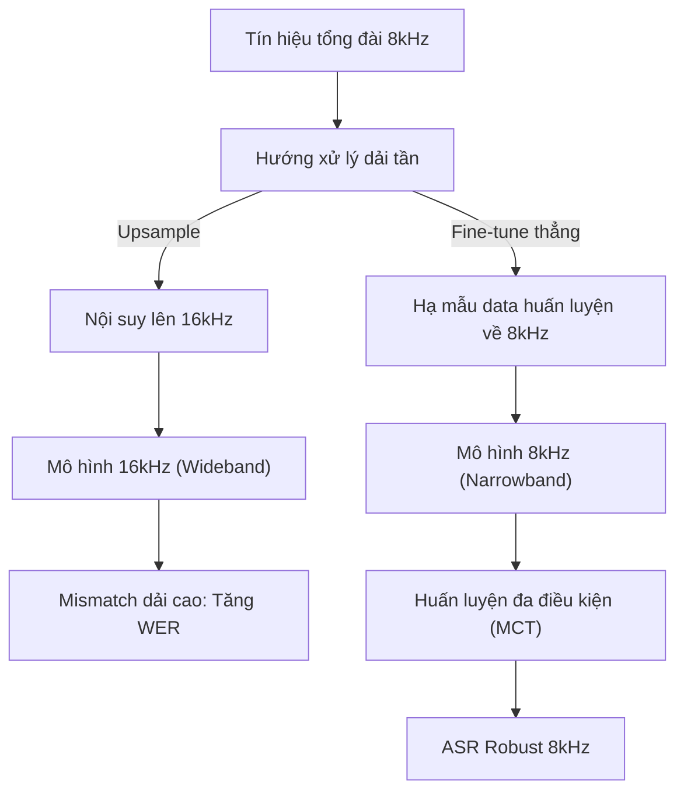
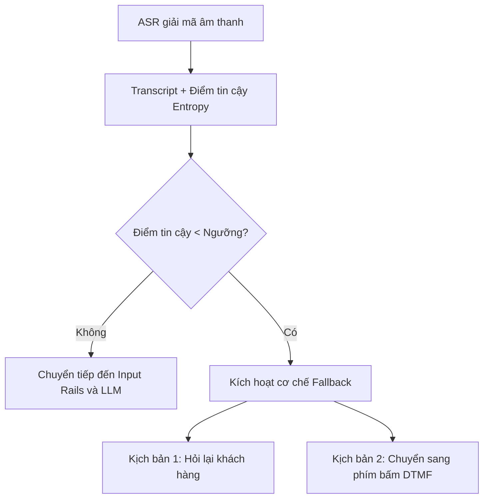

# 04 — ASR cho Môi Trường Tổng Đài: Telephony 8kHz và Kháng Nhiễu

> [!NOTE]
> Tài liệu này thuộc chặng đầu tiên trong mô hình cascade 4 lớp (ASR $\rightarrow$ Input Guardrails $\rightarrow$ Orchestrator/LLM $\rightarrow$ Output Guardrails $\rightarrow$ TTS).
> Trọng tâm chính là tối ưu hóa chất lượng nhận dạng giọng nói (ASR) trong các điều kiện thực tế của mạng lưới viễn thông viễn thông (narrowband 8kHz, nhiễu nền, chồng tiếng, realtime) và thiết lập tín hiệu độ tin cậy (confidence score) phục vụ cơ chế fallback.

---

## 1. Dẫn dắt bối cảnh

- **Thực tế khai thác hệ thống thoại**:
  - Khi triển khai các hệ thống đàm thoại tự động (voice-bot) hoặc tổng đài thông minh trên hạ tầng viễn thông telephony truyền thống, chúng ta buộc phải xử lý luồng tín hiệu thoại chất lượng thấp.
  - Các cuộc gọi đến hệ thống tổng đài đa số sử dụng băng hẹp (narrowband 8kHz) đi kèm các nén méo do codec và nhiễu môi trường động.

- **Nghịch lý giữa môi trường lab và môi trường thực tế**:
  - Tại sao một mô hình ASR đạt độ chính xác xuất sắc trên phòng lab (16kHz sạch) lại lập tức đổ vỡ khi đưa vào đường truyền điện thoại 8kHz bị nén méo?
  - Làm thế nào để hệ thống biết "nghe không chắc" để chủ động yêu cầu khách hàng nhắc lại thay vì chuyển tiếp thông tin giải mã sai xuống các lớp xử lý ngôn ngữ hạ nguồn?

- **Mục tiêu của tài liệu**:
  
  Tài liệu này sẽ trình bày giải pháp kỹ thuật để tối ưu hóa mô hình nhận dạng giọng nói chịu ảnh hưởng của băng thông hẹp và nhiễu, đồng thời thiết kế cơ chế fallback runtime tối ưu dựa trên điểm tin cậy entropy.

---

## 2. Glossary

Bảng Glossary dưới đây định nghĩa toàn bộ ký hiệu và thuật ngữ viết tắt xuất hiện trong bài:

| Ký hiệu / Thuật ngữ | Tên đầy đủ tiếng Anh | Giải nghĩa tiếng Việt |
| :--- | :--- | :--- |
| `ASR` | **Automatic Speech Recognition** | Hệ thống tự động nhận dạng giọng nói. |
| `WER` | **Word Error Rate** | Tỷ lệ lỗi từ (thước đo lỗi giải mã của ASR). |
| `CER` | **Character Error Rate** | Tỷ lệ lỗi ký tự (thường đo trên tiếng Việt do ranh giới từ mờ). |
| `RTF` | **Real-Time Factor** | Chỉ số đo tốc độ xử lý âm thanh (RTF < 1.0 nghĩa là nhanh hơn thời gian thực). |
| `RTFx` | **Real-Time Factor multiplier** | Chỉ số thể hiện tốc độ xử lý nhanh gấp N lần thời gian thực. |
| `CCU` | **Concurrent Users** | Số lượng cuộc gọi đồng thời chạy trong hệ thống. |
| `MCT` | **Multi-condition Training** | Huấn luyện mô hình với nhiều điều kiện âm thanh giả lập và thực tế. |
| `ABE` / `BWE` | **Artificial Bandwidth Expansion / Extension** | Thuật toán mở rộng dải tần nhân tạo từ 8kHz lên 16kHz. |
| `RNN-T` | **Recurrent Neural Network Transducer** | Kiến trúc decoder giải mã tăng dần theo thời gian, phù hợp streaming. |
| `TDT` | **Transducer with Dynamic Time Warping** | Một dạng biến thể kiến trúc Transducer tối ưu hóa tốc độ của NVIDIA. |
| `EOU` / `EOT` | **End-of-Utterance / End-of-Turn** | Tín hiệu phát hiện điểm kết thúc lượt nói của người dùng. |
| `VAD` | **Voice Activity Detection** | Bộ phát hiện hoạt động giọng nói dựa trên năng lượng hoặc mô hình. |
| `SE` | **Speech Enhancement** | Tăng cường chất lượng tiếng nói (lọc nhiễu/khử vang). |
| `SSL` | **Self-Supervised Learning** | Huấn luyện tự giám sát (phương pháp trích xuất đặc trưng không nhãn). |

---

## 3. Bản Đồ Phân Rã Các Bài Toán Con

Hệ thống ASR tổng đài được cấu thành từ 5 bài toán con độc lập về mặt nghiệp vụ và kỹ thuật:

| Ký hiệu | Tên bài toán con | Định nghĩa nghiệp vụ | Chỉ số đo lường | Vị trí chi tiết |
| :--- | :--- | :--- | :--- | :--- |
| **B1** | **Robust ASR @ 8kHz narrowband** | Đảm bảo tỷ lệ lỗi WER thấp khi mất dải tần >4kHz và bị méo codec đường truyền. | WER/CER trên dữ liệu telephony 8kHz. | [Mục 4](#4-giai-phap-cho-bang-hep-narrowband-8khz) |
| **B2** | **Noise-robust / Overlap ASR** | Giữ vững hiệu năng nhận diện khi gặp nhiễu nền phức tạp hoặc chồng tiếng. | WER theo các dải tỷ lệ SNR. | [Mục 5](#5-denoise-vs-robust-asr-channel-aware) |
| **B3** | **Streaming ASR Realtime** | Trả kết quả giải mã tăng dần theo chunk âm thanh với latency thấp và CCU cao. | First-token latency, RTFx, số stream/GPU. | [Mục 7](#7-multi-solution-stack-de-xuat) |
| **B4** | **Confidence / EOU Estimation** | Xác định điểm tin cậy giải mã để làm tín hiệu phát hiện lỗi hoặc chuyển fallback. | Chỉ số AUC phát hiện lỗi giải mã từ. | [Mục 6](#6-entropy-based-confidence-lam-tin-hieu-fallback) |
| **B5** | **Domain Adaptation Tiếng Việt** | Fine-tune mô hình theo giọng địa phương, từ vựng chuyên ngành và kênh thoại. | WER trên tập test-set tiếng Việt thực tế. | [Mục 8](#8-bang-chung-thuc-nghiem-tieng-viet) |

---

## 4. Giải Pháp Cho Băng Hẹp (Narrowband 8kHz)

Narrowband 8kHz là đặc trưng mặc định của kênh thoại tổng đài. Có hai hướng giải quyết chính với các ưu nhược điểm riêng biệt:

### 4.1 Cơ chế và Mismatch của Hướng Upsample 8kHz $\rightarrow$ 16kHz
- ⚙️ **Cơ chế**: Sử dụng thuật toán nội suy tần số (resampling) để kéo giãn số mẫu của tín hiệu từ 8kHz lên 16kHz, sau đó đưa vào mô hình được huấn luyện ở băng thông rộng (wideband).
- 🔍 **Cách nhận diện**: Áp dụng ffmpeg hoặc các module resample trong pipeline trước khi đưa vào các mô hình như Whisper.
- 💡 **Ý nghĩa**: Cho phép tận dụng trực tiếp các mô hình mạnh sẵn có huấn luyện trên 16kHz mà không cần xây dựng lại kiến trúc.
- ⚠️ **Bẫy**: Thuật toán resample đơn thuần **không thể tự tái tạo** được các dải thông tin >4kHz đã mất. Mô hình 16kHz vẫn gặp hiện tượng **mismatch phân bố dải tần**, làm tăng tỷ lệ lỗi giải mã (WER). Việc dùng thuật toán mở rộng dải tần nhân tạo (ABE/BWE) bằng GAN có thể cải thiện cảm âm nhưng có nguy cơ đưa thêm các tín hiệu giả (artifacts) gây hại cho ASR.

### 4.2 Cơ chế của Hướng Huấn Luyện / Fine-tune Trực Tiếp trên 8kHz
- ⚙️ **Cơ chế**: Downsample toàn bộ dữ liệu huấn luyện wideband (16kHz) về narrowband (8kHz) để mô phỏng chính xác sự hao hụt dải tần cao, sau đó huấn luyện mô hình trực tiếp ở tần số lấy mẫu 8kHz kết hợp với kiến trúc nhận biết kênh truyền (channel-aware pretraining).
- 🔍 **Cách nhận diện**: Mô hình ASR nhận đầu vào là các file âm thanh 8kHz thực tế và học trực tiếp các đặc trưng phổ băng hẹp.
- 💡 **Ý nghĩa**: Triệt tiêu hoàn toàn sự mismatch về phân bố phổ giữa huấn luyện và chạy thực tế.
- ⚠️ **Bẫy**: Đòi hỏi chi phí huấn luyện lại mô hình lớn và nguồn dữ liệu thoại 8kHz đa dạng. Việc trộn lẫn dữ liệu 8kHz và 16kHz một cách ngây thơ trong cùng một mô hình mà không có cơ chế channel-aware sẽ đem lại kết quả suboptimal.

---

### 4.3 Sơ đồ so sánh hai hướng xử lý dải tần



#### Khung đọc sơ đồ xử lý dải tần:
- **Đề bài cần giải**: So sánh tính bền vững và rủi ro của hai hướng xử lý tín hiệu thoại tổng đài 8kHz đầu vào.
- **Giả định nền**: Luồng âm thanh đầu vào có sampling rate gốc là 8kHz (narrowband).
- **Ý nghĩa các khối**:
  - `Decision`: Điểm rẽ nhánh kỹ thuật.
  - `US` / `FT`: Các bước tiền xử lý tín hiệu (nội suy lên hoặc hạ mẫu dữ liệu huấn luyện).
  - `M16` / `M8`: Các mô hình ASR tương ứng.
  - `Mismatch` / `Robust`: Kết quả hiệu năng tương ứng.
- **Cách đọc và ứng dụng**: Nhánh bên trái (Upsample) có chi phí triển khai cực thấp nhưng rủi ro mismatch cao; nhánh bên phải (Fine-tune thẳng) đòi hỏi năng lực tính toán và dữ liệu nhưng đem lại mô hình robust bền vững.

---

## 5. Denoise vs Robust ASR: Tránh Cascade Ngây Thơ

Dựa trên các bằng chứng khoa học tại Layer 03, việc ghép nối tiếp một mô hình khử nhiễu độc lập (Speech Enhancement - SE) trước mô hình ASR thường mang lại hiệu quả ngược do sinh ra các artifacts. Do đó, thiết kế hệ thống cần tuân thủ các nguyên tắc:

- **Làm mô hình ASR bền bỉ tự thân (Robust ASR)**:
  - Thay vì cố gắng làm sạch âm thanh, hãy huấn luyện mô hình ASR thích nghi trực tiếp với nhiễu thông qua kỹ thuật **Multi-condition Training (MCT)**.
  - Trộn lẫn các tập dữ liệu nhiễu môi trường (MUSAN), đáp ứng xung phòng (RIR) và giả lập méo codec viễn thông trực tiếp vào quá trình train mô hình ASR.
- **Áp dụng huấn luyện đồng thời (Joint Training)**:
  - Nếu bắt buộc phải sử dụng module lọc nhiễu (SE), mô hình SE và ASR cần được huấn luyện chung (Joint SE-ASR pretraining).
  - Tối ưu hóa trọng số của module SE theo hàm mất mát (loss function) của mô hình nhận dạng ASR hạ nguồn, không tối ưu theo cảm âm của tai người.
- **Phân tách theo loại nhiễu**:
  - Đối với nhiễu tĩnh nhẹ (`acu.device`): Có thể sử dụng bộ lọc Wiener hoặc trừ phổ DSP cổ điển.
  - Đối với nhiễu phi tĩnh phức tạp (`acu.babble`, `acu.street`): Tuyệt đối không dùng bộ lọc tĩnh cascade; ưu tiên robust ASR và huấn luyện đa điều kiện.

---

## 6. Entropy-Based Confidence: Tín Hiệu Fallback Cốt Lõi

Để tránh việc bot phản hồi sai lệch do nhận diện nhầm transcript từ khách hàng, mô hình ASR cần trả về điểm tin cậy chất lượng cao cho mỗi từ giải mã.

- **Cơ chế đo độ bất định dựa trên Entropy (Entropy-based Confidence)**:
  - Thay vì sử dụng xác suất cực đại đơn thuần (Maximum Probability - dễ bị overconfidence), NeMo áp dụng entropy thông tin (Gibbs, Tsallis, hoặc Rényi entropy) trên phân phối xác suất của từng khung thời gian.
  - Các phép tính toán tích hợp (min, mean hoặc product) được áp dụng để đưa ra điểm tin cậy cụ thể cho từng từ hoặc cả câu nói.
  - **Hiệu quả thực nghiệm**: Tín hiệu entropy-based cho độ chính xác cao gấp **2 đến 4 lần** so với xác suất cực đại trong việc phát hiện các từ bị nhận dạng sai (arXiv:2212.08703).
- **Thiết lập cổng Fallback Runtime**:
  - Đặt một ngưỡng giá trị động (threshold) cho điểm tin cậy trung bình của câu thoại hoặc điểm tối thiểu của từ.
  - Khi điểm tin cậy rơi xuống dưới ngưỡng: Kích hoạt kịch bản fallback (ví dụ: Bot chủ động hỏi lại lịch sự "Xin lỗi, tôi nghe chưa rõ, xin quý khách nhắc lại").
  - Đối với các dịch vụ tài chính/xác thực: Fallback trực tiếp về hệ thống phím bấm DTMF để nhập liệu an toàn.

---

### 6.1 Sơ đồ cổng fallback runtime



#### Khung đọc sơ đồ cổng fallback:
- **Đề bài cần giải**: Ngăn ngừa transcript sai lệch đi sâu vào các lớp nghiệp vụ của LLM bằng cơ chế kiểm soát chất lượng đầu ra ASR.
- **Giả định nền**: Mô hình ASR hỗ trợ tính toán điểm tin cậy dựa trên entropy của từng từ hoặc câu.
- **Ý nghĩa các khối**:
  - `Check`: Bộ lọc logic so sánh điểm tin cậy với ngưỡng động đã được tối ưu hóa.
  - `LLM` / `Fallback`: Hai kịch bản xử lý tiếp theo dựa trên chất lượng tín hiệu nhận dạng.
- **Cách đọc và ứng dụng**: Luồng xử lý phân tách rõ ràng; đảm bảo chỉ các văn bản có độ chính xác cao mới được đưa vào LLM xử lý, giảm thiểu tối đa hành vi ảo giác của bot.

---

## 7. Landscape Các Họ Model Phục Vụ Tổng Đài

Bảng so sánh dưới đây đánh giá các họ mô hình ASR dựa trên các tiêu chí quan trọng cho môi trường tổng đài (Thử nghiệm trên LibriSpeech đọc sạch, 16kHz):

| Họ mô hình | Kiến trúc giải mã | Native Streaming | WER tham khảo (16kHz sạch) | Tốc độ xử lý (RTFx) | Khả năng hỗ trợ tiếng Việt |
| :--- | :--- | :---: | :---: | :---: | :--- |
| **Whisper / Faster-Whisper** | Attention Encoder-Decoder | ⚠️ Không (phải chia chunk thủ công) | ~7.4% WER | ~41x - 68x | Rất tốt (nhờ dữ liệu web đa dạng, chịu được accent tốt). |
| **NVIDIA Parakeet** | CTC / RNN-T / TDT | ⚠️ Một số biến thể | ~6.3% WER | **~3000x+** | ❌ Không hỗ trợ tiếng Việt. |
| **NVIDIA Canary** | Attention Decoder | ❌ Không (Offline) | Rất mạnh | Trung bình | ❌ Không hỗ trợ tiếng Việt. |
| **Nemotron Speech Streaming** | Cache-aware FastConformer + RNN-T | ✅ Có | ~10.3% WER | ~259x | ⚠️ Nhánh vi-VN có trong bản 3.5 nhưng chất lượng chưa hội tụ tốt. |
| **Zipformer / Conformer (NeMo/k2)** | CTC / Transducer | ✅ Có | Tùy biến | RTF < 1.0 | ✅ Có (đường lối chính để fine-tune dữ liệu tiếng Việt 8kHz). |

---

## 8. Bằng Chứng Thực Nghiệm Tiếng Việt

Phân tách rõ ràng các kết quả nghiên cứu đã có số liệu thực tế so với các khoảng trống dữ liệu trong môi trường tổng đài viễn thông:

- **Kết quả trên dữ liệu Wideband (16kHz) sạch / đọc**:
  - **PhoWhisper (arXiv:2406.02555 - ICLR 2024 Tiny Paper)**:
    - Fine-tune mô hình Whisper trên 844 giờ dữ liệu tiếng Việt đa giọng nói.
    - Đạt tỷ lệ lỗi: 4.67% WER trên VIVOS, 8.14% WER trên CMV-Vi, 13.75% WER trên VLSP-T1. Đây là baseline mạnh cho tiếng Việt wideband sạch.
  - **VietASR (arXiv:2505.21527 - Interspeech 2025)**:
    - Sử dụng kiến trúc Zipformer kết hợp SSL với ~70k giờ pre-train không nhãn và chỉ 50 giờ fine-tune có nhãn.
    - Đạt kết quả vượt trội hơn Whisper-large-v3 trên các dữ liệu tiếng Việt thực tế.
  - **Lab nvidia_asr_nemo (Dữ liệu nội bộ)**:
    - Mô hình FastConformer-Transducer fine-tune trên VIVOS và CommonVoice đạt **~11% WER** trên tập test-set sạch 16kHz.

- **Kết quả trên dữ liệu Narrowband (8kHz) tổng đài**:
  - **Mô hình HYKIST (arXiv:2309.15869 - preprint)**:
    - Thực hiện nhận diện trực tiếp trên tín hiệu thoại y tế 8kHz thực tế (không qua resampling).
    - Tập dữ liệu in-house mất cân bằng nghiêm trọng: Chủ yếu là giọng miền Bắc và miền Trung, **thiếu hụt trầm trọng dữ liệu giọng miền Nam**.
  - **Tập dữ liệu VietSuperSpeech (arXiv:2603.01894 - preprint)**:
    - Gồm 267 giờ hội thoại đời thường thu thập từ mạng xã hội nhằm phục vụ customer-support. Tuy nhiên, dữ liệu đã được **chuẩn hóa về định dạng 16kHz mono**, không phải dữ liệu telephony 8kHz nguyên bản.
  - **Khoảng trống dữ liệu tiếng Việt**:
    - Hiện tại **chưa có bộ dữ liệu telephony 8kHz tiếng Việt kèm chỉ số benchmark WER công khai**. Các doanh nghiệp bắt buộc phải tự xây dựng tập dữ liệu đánh giá (evaluation set) riêng từ luồng ghi âm cuộc gọi của mình.

---

## 9. Đề Xuất Stack Giải Pháp Phân Tầng (Phễu Lọc Chi Phí)

Đề xuất xây dựng stack giải pháp theo 4 bước tăng dần về chi phí và tài nguyên, ưu tiên tận dụng các tài sản kỹ thuật sẵn có từ lab NeMo:

```
T0: Dựng tập Eval 8kHz (Đo lường điểm mù)
  │
  ├──► T1: Khởi động nhanh (Upsample + Cổng tin cậy)
  │      │
  │      └──► T2: Tối ưu hóa dải tần (Fine-tune thẳng 8kHz + MCT)
  │            │
  │            └──► T3: Realtime toàn diện (Streaming Transducer + Data Telephony VN)
```

- **Tầng T0 — Đo lường chất lượng nền tảng (Bắt buộc làm trước)**:
  - *Giải pháp*: Thu thập mẫu ghi âm cuộc gọi thật của tổng đài tiếng Việt làm tập test-set 8kHz thực tế. Đồng thời downsample các tập test-set sạch (VIVOS/CommonVoice) xuống 8kHz.
  - *Mục tiêu*: Đo lường chính xác mức độ suy giảm (degradation) WER của mô hình lab hiện tại khi chuyển từ 16kHz sạch xuống 8kHz nhiễu.

- **Tầng T1 — Tận dụng tối thiểu (Chi phí cực thấp)**:
  - *Giải pháp*: Áp dụng bộ lọc upsample từ 8kHz lên 16kHz trước khi đưa vào mô hình ASR lab hiện có. Kích hoạt tính năng **Entropy-based Word Confidence** sẵn có trong thư viện NeMo để chuyển hướng fallback.
  - *Mục tiêu*: Thiết lập baseline hoạt động nhanh chóng mà không cần tốn chi phí huấn luyện lại mô hình.

- **Tầng T2 — Cải tiến hiệu năng (Chi phí trung bình)**:
  - *Giải pháp*: Tiến hành hạ mẫu (downsample) tập dữ liệu huấn luyện wideband hiện tại về 8kHz. Huấn luyện lại mô hình FastConformer-Transducer trên NeMo với kỹ thuật MCT (trộn nhiễu môi trường và mô phỏng méo codec).
  - *Mục tiêu*: Triệt tiêu hiện tượng mismatch dải tần, hạ thấp tối đa WER trên kênh thoại tổng đài.

- **Tầng T3 — Streaming và Realtime toàn diện (Chi phí cao)**:
  - *Giải pháp*: Chuyển dịch toàn bộ pipeline sang kiến trúc cache-aware streaming (Nemotron-Streaming hoặc FastConformer-Streaming). Xây dựng hoặc mua các bộ dữ liệu thoại tổng đài tiếng Việt thực tế phục vụ domain adaptation.
  - *Mục tiêu*: Đáp ứng cam kết chất lượng thời gian thực (CCU = 100, latency < 200ms).

---

## 10. Danh Mục Nguồn Tham Chiếu Chi Tiết

### 10.1 Bài báo khoa học (arXiv / Hội nghị)

| Link tài liệu | Chứng minh nội dung | Trạng thái |
| :--- | :--- | :--- |
| [arXiv:2211.01669](https://arxiv.org/pdf/2211.01669) | Băng hẹp 8kHz là điều kiện đặc thù; gộp chung dữ liệu 8k và 16k ngây thơ là suboptimal $\rightarrow$ cần pre-train nhận biết kênh truyền. | ✅ Nguồn mạnh (Đã xác minh). |
| [arXiv:2406.02555](https://arxiv.org/abs/2406.02555) | PhoWhisper đạt hiệu năng xuất sắc trên tiếng Việt sạch 16kHz (VIVOS, CMV-Vi). | ✅ Nguồn mạnh (ICLR 2024). |
| [arXiv:2505.21527](https://arxiv.org/abs/2505.21527) | VietASR Zipformer SSL vượt trội hơn Whisper trên dữ liệu Việt thực tế. | ✅ Nguồn mạnh (Interspeech 2025). |
| [arXiv:2309.15869](https://arxiv.org/abs/2309.15869) | HYKIST thực hiện ASR trực tiếp ở tần số 8kHz, thiếu hụt giọng nói miền Nam. | ⚠️ Preprint. |
| [arXiv:2212.08703](https://arxiv.org/pdf/2212.08703) | Phương pháp đo độ tin cậy dựa trên entropy của NeMo tốt hơn 2-4 lần max-probability. | ✅ Nguồn mạnh (NVIDIA). |
| [arXiv:2502.13446](https://arxiv.org/pdf/2502.13446) | Giải pháp ước lượng điểm tin cậy (confidence estimation) trên Whisper. | ⚠️ Preprint. |
| [arXiv:2202.07219](https://arxiv.org/pdf/2202.07219) | Huấn luyện đa điều kiện phục vụ nhận dạng tổng đài thoại tại Nam Phi. | ⚠️ Preprint. |
| [arXiv:2508.08967](https://arxiv.org/pdf/2508.08967) | Hiện tượng sai lệch kênh (mic channel mismatch) làm tăng tỷ lệ lỗi ký tự. | ⚠️ Preprint. |
| [arXiv:2205.13293](https://arxiv.org/pdf/2205.13293) | Các méo dạng do SE đơn lẻ đòi hỏi phải huấn luyện chung SE+ASR. | ✅ Nguồn mạnh (Đã xác minh). |
| [arXiv:2311.11599](https://arxiv.org/abs/2311.11599) | Lọc nhiễu đơn thuần làm tăng tỷ lệ lỗi ASR do artifacts. | ✅ Nguồn mạnh (Đã xác minh). |
| [arXiv:1907.04927](https://arxiv.org/pdf/1907.04927) | Thuật toán WaveNet khôi phục dải tần cao từ tín hiệu 8kHz. | ⚠️ Preprint. |
| [Sivaraman (2020)](https://www.isca-archive.org/odyssey_2020/sivaraman20_odyssey.pdf) | Ứng dụng mở rộng dải tần nhân tạo cho nhận diện người nói 8kHz. | ✅ Nguồn mạnh (Odyssey). |

---

### 10.2 Tài liệu kỹ thuật và Mã nguồn mở

- **Entropy-Based Method for Word-Level Confidence (NVIDIA)**:
  - Link: [NVIDIA Developer Blog](https://developer.nvidia.com/blog/entropy-based-methods-for-word-level-asr-confidence-estimation/)
  - Nội dung: Tài liệu hướng dẫn sử dụng Gibbs/Tsallis/Rényi entropy để tính điểm tin cậy mà không cần huấn luyện thêm.
- **ASR Confidence Utilities (NeMo GitHub)**:
  - Link: [nemo/collections/asr/parts/utils/asr_confidence_utils.py](https://github.com/NVIDIA-NeMo/NeMo/blob/main/nemo/collections/asr/parts/utils/asr_confidence_utils.py)
  - Ứng dụng: Chứa mã nguồn thực thi thuật toán entropy-confidence phục vụ fallback.
- **Kiến trúc Voice Agent (LiveKit)**:
  - Link: [LiveKit Blog](https://livekit.com/blog/voice-agent-architecture-stt-llm-tts-pipelines-explained)
  - Nội dung: Giải thích sự kết hợp giữa VAD, semantic endpointer và điểm tin cậy giải mã.

---

## 11. ✅ Tự Kiểm Nhanh

<details>
<summary><b>Câu hỏi 1: Tại sao việc upsample tín hiệu từ 8kHz lên 16kHz để đưa vào mô hình ASR 16kHz (wideband) không phải là giải pháp triệt để?</b></summary>

- **Bản chất kỹ thuật**:
  - Việc upsample đơn thuần chỉ bổ sung thêm các mẫu dữ liệu trùng lặp hoặc nội suy toán học để khớp với tần số lấy mẫu 16kHz.
  - Quá trình này **không thể tự sinh ra** hoặc tái tạo được các thông tin âm học ở dải tần cao >4kHz vốn đã bị cắt bỏ hoàn toàn bởi phần cứng tổng đài.
  - Mô hình ASR wideband khi nhận tín hiệu này vẫn gặp hiện tượng **mismatch phân bố dải tần** (thiếu hụt năng lượng dải cao nghiêm trọng) dẫn đến suy giảm độ chính xác và tăng WER.
  - Do đó, hướng đi bền vững là huấn luyện hoặc fine-tune mô hình trực tiếp ở dải tần 8kHz (narrowband) kết hợp kỹ thuật channel-aware pretraining.

</details>

<details>
<summary><b>Câu hỏi 2: Sự khác biệt trong việc ứng dụng điểm tin cậy dựa trên Entropy (Entropy-based) so với điểm xác suất cực đại (Max Probability) trên mô hình ASR?</b></summary>

- **Xác suất cực đại (Max Probability)**:
  - Chỉ quan tâm đến giá trị xác suất cao nhất của token được chọn tại một frame thời gian. Thường bị hiện tượng **overconfidence** (mô hình dự đoán sai nhưng vẫn trả về điểm tin cậy rất cao).
- **Điểm tin cậy dựa trên Entropy**:
  - Xem xét toàn bộ phân phối xác suất của tất cả các token có khả năng tại frame thời gian đó.
  - Nếu mô hình phân vân giữa nhiều lựa chọn tương đồng, giá trị entropy sẽ tăng vọt (thể hiện độ bất định cao).
  - Thuật toán trích xuất entropy của NeMo giúp phát hiện các lỗi nhận dạng từ chính xác gấp **2 đến 4 lần** so với việc chỉ lọc theo xác suất cực đại, làm cơ sở vững chắc cho cổng fallback.

</details>

<details>
<summary><b>Câu hỏi 3: Khoảng trống lớn nhất khi tối ưu hóa mô hình ASR cho các cuộc gọi tổng đài tại thị trường Việt Nam là gì?</b></summary>

- **Sự thiếu hụt dữ liệu benchmark**:
  - Cộng đồng mã nguồn mở hiện tại chỉ cung cấp các tập dữ liệu tiếng Việt dạng wideband 16kHz sạch (VIVOS, CommonVoice) hoặc hội thoại YouTube đã chuẩn hóa 16kHz (VietSuperSpeech).
  - Hoàn toàn **chưa có một tập dữ liệu chuẩn viễn thông 8kHz kèm chỉ số WER benchmark công khai** cho tiếng Việt.
  - Giải pháp bắt buộc là doanh nghiệp phải tự xây dựng quy trình (T0) thu thập, làm sạch và gắn nhãn một tập dữ liệu thoại 8kHz đại diện cho chính tệp khách hàng của mình để làm cột mốc đánh giá hiệu năng.

</details>
