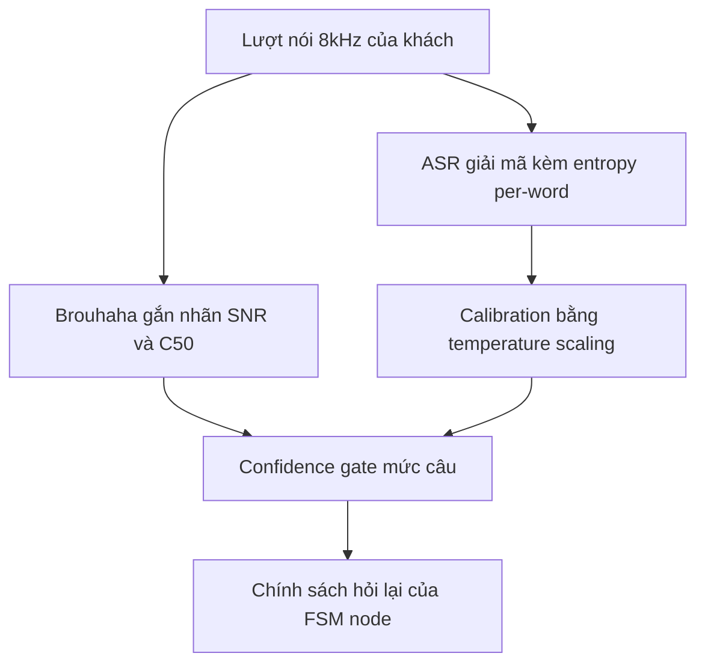
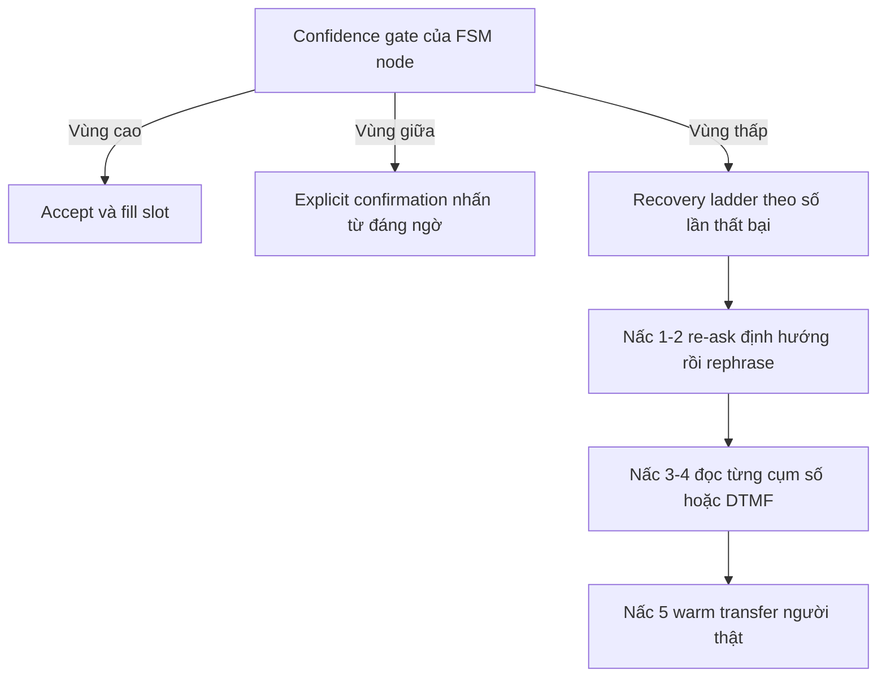

# 04.01 — Từ Mức Nhiễu Runtime đến Confidence Transcript và Chính Sách Hỏi Lại / Xác Minh Thông Tin

> [!NOTE]
> - Tài liệu này đào sâu chuỗi bài toán ba khâu: gắn nhãn chất lượng audio per-utterance → ước lượng confidence transcript → chính sách hỏi lại / xác minh thông tin.
> - Cơ chế entropy-based confidence đã trình bày tại [00_README.md](00_README.md) mục 6; tài liệu này là phần **mở rộng** về giới hạn tín hiệu, calibration và tầng chính sách phía trên, không lặp lại phần cơ chế.
> - Taxonomy nhiễu và quy trình EDA offline (Brouhaha) xem tại [../03_audio_frontend/00_README.md](../03_audio_frontend/00_README.md);
> - ba domain nghiệp vụ CSKH và node VERIFY xem tại [../06_llm_agent/05_cskh_domains.md](../06_llm_agent/05_cskh_domains.md); tầng rail an toàn xem tại [../07_guardrails/00_README.md](../07_guardrails/00_README.md).

---

## 1. Dẫn dắt bối cảnh

- **Bối cảnh thực tế**:
  - Voice-bot tổng đài tiếng Việt trên kênh 8kHz phải thu các slot tài chính (số tiền, ngày hẹn trả, danh tính) từ transcript ASR thường xuyên bị nhiễu làm sai.
  - Khi transcript sai mà bot vẫn tự tin fill slot và hành động, lỗi đi thẳng vào nghiệp vụ: ghi nhầm cam kết trả nợ, xác minh nhầm người, chạm vào ràng buộc pháp lý của domain thu hồi nợ.
- **Nghịch lý vận hành**:
  - Hỏi lại quá ít thì misunderstanding (hiểu sai mà không biết) lọt xuống hạ nguồn — số liệu SDS kinh điển đo được loại lỗi này đắt hơn non-understanding khoảng **2.24×**;
  - hỏi lại quá nhiều thì false rejection (hiểu đúng nhưng bị từ chối oan) tăng — trong corpus tham chiếu có tới **~40%** số rejection là oan — user bực và bỏ cuộc gọi;
  - trong khi "xin anh nhắc lại", phản xạ mặc định của đa số bot, lại là chiến lược recovery gần tệ nhất theo đo đạc (33.7% so với 64.4% của chiến lược đổi hướng câu hỏi).

> Mức nhiễu runtime, confidence transcript và chính sách hỏi lại không phải ba bài toán rời,
>
> mà là MỘT đường ống quyết định: nhãn nhiễu điều kiện hoá ngưỡng confidence, confidence điều khiển máy trạng thái hỏi lại,
>
> và criticality của slot nghiệp vụ quyết định mức xác minh cuối cùng — tài liệu này lắp ba khâu thành đường ống hoàn chỉnh.

---

## 2. Glossary

- `confidence` -> **Confidence score** ->
  - Điểm tin cậy hệ thống tự gán cho output của mình, tính được ở ba mức: từ, câu, slot.
- `calibration` / `ECE` / `NCE` -> **Calibration / Expected Calibration Error / Normalized Cross Entropy** ->
  - Mức khớp giữa confidence và xác suất đúng thật; đo bằng hai chỉ số ECE và NCE.
- `temperature scaling` -> **Temperature scaling** ->
  - Kỹ thuật hậu xử lý chia logits cho hằng số T để sửa calibration, không đổi kết quả argmax.
- `misunderstanding` / `non-understanding` -> **Misunderstanding / Non-understanding** ->
  - Hiểu sai mà không biết (cần confidence để phát hiện) / biết là không hiểu (cần chiến lược recovery).
- `explicit / implicit confirmation` -> **Explicit / Implicit confirmation** ->
  - Hỏi xác nhận tường minh ("Anh nói năm triệu, đúng không ạ?") / nhắc lại thông tin trong câu kế tiếp mà không hỏi trực tiếp.
- `T_hi / T_lo` -> **3-tier threshold** ->
  - Hai ngưỡng chia confidence thành ba vùng: accept (trên T_hi) / confirm (giữa) / reject và hỏi lại (dưới T_lo).
- `n-best` / `GER` -> **N-best list / Generative Error Correction** ->
  - Danh sách N giả thuyết transcript tốt nhất của decoder / kỹ thuật dùng LLM sửa transcript từ n-best.
- `RPC` / `PTP` -> **Right-Party Contact / Promise-to-Pay** ->
  - Xác minh đúng người nợ trước khi nói chi tiết khoản nợ / cam kết trả gồm số tiền và ngày hẹn — slot có chi phí sai cao nhất.
- `SNR` / `C50` -> **Signal-to-Noise Ratio / Clarity 50ms** ->
  - Tỷ lệ tín hiệu trên nhiễu / chỉ số độ vang phòng, hai nhãn chất lượng chính do Brouhaha ước lượng.
- `ITN` -> **Inverse Text Normalization** ->
  - Chuẩn hoá tất định từ dạng chữ nói ("năm triệu") về dạng viết (5.000.000) trước khi so khớp slot.
- `DTMF` -> **Dual-Tone Multi-Frequency** ->
  - Nhập liệu bằng phím bấm điện thoại — kênh miễn nhiễm nhiễu acoustic, dùng làm fallback cho chuỗi số.

---

## 3. Nhãn chất lượng audio runtime (per-utterance)

### 3.1 Vị trí và mục đích trong pipeline

- **Khác biệt với EDA offline**:
  - Quy trình EDA ở [03_audio_frontend mục 6](../03_audio_frontend/00_README.md) gắn nhãn nhiễu cho kho ghi âm để khảo sát;
  - tầng này gắn nhãn cho TỪNG lượt nói ngay trong cuộc gọi đang diễn ra, cùng bộ công cụ nhưng khác chế độ vận hành.
- **Hai đầu ra nuôi hạ nguồn**:
  - Điều kiện hoá ngưỡng confidence phía sau: SNR thấp thì đòi confidence cao hơn mới accept;
  - noise-conditioned adaptation: đổi ngưỡng VAD / EOU / barge-in theo mức nhiễu (xem §3.3).
- **Bằng chứng phải điều kiện hoá theo nhiễu**:
  - ASR overconfidence nặng hơn hẳn khi SNR thấp — 10-20% token SAI vẫn được gán confidence > 0.7 ở điều kiện nhiễu ([arXiv:2509.07195](https://arxiv.org/abs/2509.07195) ⚠️ preprint);
  - nghĩa là một ngưỡng confidence tĩnh sẽ accept nhầm nhiều nhất đúng ở những cuộc gọi xấu nhất.

### 3.2 Bộ công cụ ước lượng và vai trò đề xuất

| Công cụ | Tín hiệu trả về | Chi phí runtime | Hợp kênh 8kHz? | Vai trò đề xuất |
| :--- | :--- | :--- | :--- | :--- |
| **Brouhaha** ([arXiv:2210.13248](https://arxiv.org/abs/2210.13248) ✅ ASRU 2023) | VAD + SNR + C50 per-frame | Model nhỏ họ pyannote; RTF ❓ cần tự đo | Train synthetic đa điều kiện | **Nguồn nhãn nhiễu runtime chính** — thống nhất với EDA offline, tách được nhiễu nền suốt cuộc gọi và nhiễu bùng phát trong 1 lượt |
| **WADA-SNR** ([Kim & Stern 2008](https://www.isca-archive.org/interspeech_2008/kim08e_interspeech.html) ✅ Interspeech) | 1 số SNR / utterance | Rất rẻ (DSP thuần, không cần DNN) | ❓ chưa kiểm chứng trên codec G.711 | Sanity check rẻ nhất, chạy mọi lượt nói để đối chiếu Brouhaha |
| **NISQA** ([arXiv:2104.09494](https://arxiv.org/abs/2104.09494) ✅) | MOS + 4 chiều, có Discontinuity | ~50MB; nhanh hơn realtime ~10× trên GPU ⚠️; số CPU ❓ | Train trên điều kiện viễn thông ✅ | Phát hiện packet-loss / méo kênh (chiều Discontinuity) |
| **DNSMOS P.835** (⚠️ vendor Microsoft) | SIG / BAK / OVRL | ONNX CPU nhẹ; số đo ❓ | Thiên 16kHz denoising ❓ | Proxy nhiễu nền thô, phụ trợ |
| **SQUIM** ([arXiv:2304.01448](https://arxiv.org/abs/2304.01448) ✅ ICASSP 2023) | PESQ / STOI / SI-SDR / MOS không reference | Nặng, paper tự nhận "computationally complex" ⚠️ | ❓ | Offline / định kỳ, không dùng per-utterance |

- **Điểm chưa có số liệu**: RTF thật của Brouhaha / DNSMOS / NISQA trên CPU cho utterance 2-10s ở 8kHz chưa có công bố đáng tin ❓ — con số này quyết định chạy per-utterance hay per-call, phải tự đo trước khi chốt kiến trúc.

### 3.3 Noise-conditioned adaptation

- ⚙️ **Cơ chế**: nhãn chất lượng per-utterance được dùng làm BIẾN ĐIỀU KHIỂN cho các ngưỡng runtime của bot, không chỉ để log.
- 🔍 **Nhận diện**: tiền lệ chủ yếu là patent và engineering — barge-in detector nâng ngưỡng năng lượng khi noise level cao, thậm chí tắt barge-in khi nhiễu vượt ngưỡng ([US20030158732A1](https://patents.google.com/patent/US20030158732A1/en) ⚠️ patent); endpointer so sánh signal level với ngưỡng thích nghi liên tục ([US6574601](https://image-ppubs.uspto.gov/dirsearch-public/print/downloadPdf/6574601) ⚠️ patent).
- 💡 **Ý nghĩa**: bot "biết mình đang nghe trong điều kiện xấu" và tự thắt chặt hành vi, thay vì áp một bộ ngưỡng tĩnh cho mọi cuộc gọi.
- ⚠️ **Bẫy**: bảng quy tắc dưới đây là thiết kế suy ra từ tiền lệ, chưa có thực nghiệm trên data FCI ❓ — chỉ dùng làm điểm xuất phát để A/B:
  - SNR cao (> 20dB): ngưỡng mặc định; barge-in bật; EOU pause ngắn.
  - SNR trung (10-20dB): nâng ngưỡng VAD onset; kéo dài EOU pause nhẹ; nâng ngưỡng confidence accept.
  - SNR thấp (< 10dB) hoặc Discontinuity cao: barge-in chỉ nhận khi có transcript partial; mọi slot quan trọng ép explicit confirmation; bot chủ động báo "sóng hơi kém".

---

## 4. Confidence Transcript: Tín Hiệu, Giới Hạn, Calibration

### 4.1 Entropy so với max-prob (nhắc lại tối thiểu)

- **Cơ chế**: đã trình bày đầy đủ ở [00_README mục 6](00_README.md) — điểm cần giữ lại cho tầng chính sách:
  - entropy-based confidence (Gibbs / Tsallis / Rényi) phát hiện từ sai tốt hơn max-prob tới **2× trên Conformer-CTC và 4× trên Conformer-RNN-T**, với chi phí tính TƯƠNG ĐƯƠNG max-prob — gần như miễn phí khi decode ([arXiv:2212.08703](https://arxiv.org/abs/2212.08703) ✅ NVIDIA);
  - code sẵn trong [NeMo asr_confidence_utils.py](https://github.com/NVIDIA-NeMo/NeMo/blob/main/nemo/collections/asr/parts/utils/asr_confidence_utils.py) ✅ — khớp stack FastConformer của lab.
- **Tín hiệu bổ sung khi cần mạnh hơn** (chi phí tăng dần):
  - CEM (Confidence Estimation Module — mô hình học riêng dự đoán từ nào của ASR sai), biến thể fine-tune Whisper thành bộ chấm confidence thắng CEM baseline trên mọi dataset thử ([arXiv:2502.13446](https://arxiv.org/abs/2502.13446) ✅ ICASSP 2025);
  - cross-engine disagreement: vùng hai hệ ASR bất đồng gần như chắc là vùng lỗi (nguyên lý [ROVER](https://github.com/usnistgov/SCTK/blob/master/doc/rover/rover.htm) ✅ NIST) — nhưng tốn gấp đôi compute, chỉ đáng cho utterance chứa slot quan trọng.

### 4.2 Giới hạn của confidence per-word — bài học mức áp dụng

- **Số đo trên 9 engine ASR thương mại + Whisper** (394k cặp từ, [arXiv:2503.15124](https://arxiv.org/html/2503.15124v1) ⚠️ preprint):
  - AUC phát hiện từ sai chỉ đạt **0.68–0.87** tuỳ engine; precision 0.41–0.55; recall 0.36–0.64 — mức "poor to moderate" ở TỪNG TỪ;
  - mức TRANSCRIPT (cả câu): tương quan confidence với WER đạt moderate-to-strong, p < 0.001 trên mọi model.
- **Bài học thiết kế** (trục xương sống của tài liệu này):
  - confidence mức câu đủ tốt để làm CỔNG chính sách accept / confirm / re-ask;
  - confidence từng từ KHÔNG đủ tin để tự động sửa từng từ — nhưng đủ để chọn TỪ NÀO cần nhấn khi bot hỏi lại ("anh nói *năm triệu* hay *tám triệu* ạ?").

### 4.3 Calibration — confidence thô chưa tin được ngay

- **Vấn đề gốc**: ASR end-to-end overconfidence — gán điểm cao cho dự đoán sai, tệ hơn khi nhiễu ([arXiv:2509.07195](https://arxiv.org/abs/2509.07195) ⚠️ preprint).
- **Giải pháp baseline**: temperature scaling — 1 tham số, không đổi argmax; trên benchmark nhiễu nặng R-SPIN, calibration giảm **ECE 58%** và tăng **NCE gấp 3** ([arXiv:2509.07195](https://arxiv.org/abs/2509.07195) ⚠️ preprint); nền tảng kinh điển là calibration bằng maximum-entropy / piecewise-linear mapping trên ASR truyền thống (Yu, Deng et al., IEEE TASLP 2011 ✅).
- ⚠️ **Bẫy**: tham số calibration phụ thuộc phân phối data — model lab calibrate trên tiếng Anh 16kHz sạch KHÔNG chuyển sang tiếng Việt 8kHz nhiễu; ECE của model lab trên kênh này chưa từng được đo ❓ → phải calibrate lại trên data 8kHz Việt Nam riêng (bước 0 ở §8.2).

### 4.4 Sơ đồ đường ống tín hiệu

- **Khung đọc sơ đồ**:
  - **Đề bài cần giải**: cho thấy nhãn nhiễu và confidence đã calibrate hợp lưu tại một cổng duy nhất trước khi ra quyết định hội thoại.
  - **Giả định nền**: ASR trả được phân phối per-frame để tính entropy; Brouhaha chạy kịp per-utterance (RTF ❓ chưa đo).
  - **Ý nghĩa các khối**: `Q` sinh nhãn chất lượng làm biến điều kiện; `A` → `C` sinh confidence đã sửa calibration; `G` là cổng tất định hai ngưỡng; `P` là tầng chính sách mô tả ở mục 5.
  - **Cách đọc**: hai nhánh từ `U` chạy song song trên cùng một lượt nói; `G` chỉ đáng tin khi CẢ HAI nhánh cùng vào — thiếu nhánh `Q` thì gate accept nhầm nhiều nhất đúng ở cuộc gọi nhiễu (§3.1).

---

## 5. Chính Sách Hỏi Lại: Nền SDS Kinh Điển và Máy Trạng Thái 3 Vùng

### 5.1 Nền tảng Bohus & Rudnicky — chi phí lỗi có số đo

- **Kiến trúc error handling đáng học** ([errorh.pdf CMU](http://www.cs.cmu.edu/~dbohus/docs/errorh.pdf) ✅ HLT-EMNLP 2005):
  - error handling là decision process gắn PER-CONCEPT (per-slot) + gating mechanism, TÁCH KHỎI dialog task — tác giả hệ thống không phải viết logic hỏi lại trong từng node;
  - ánh xạ thẳng sang FCI: mỗi slot trong FSM node có một error handling process riêng đọc (confidence, criticality) và tự chèn node confirm — đúng mô hình `VERIFY → GATE` đã có ở [06.05](../06_llm_agent/05_cskh_domains.md).
- **Chi phí lỗi bất đối xứng** (corpus RoomLine 449 sessions / 8278 turns, [Bohus SIGDial 2005](https://aclanthology.org/2005.sigdial-1.14.pdf) ✅):
  - misunderstanding đắt ≈ **2.24×** non-understanding (hệ số hồi quy trên task success: −16.62 so với −7.41) — khi phân vân giữa "accept liều" và "hỏi lại", hỏi lại rẻ hơn khoảng 2 lần;
  - bật rejection làm non-understanding tăng 10.1% → 17.2% turns, và **~40% số rejection là false rejection** — từ chối oan cũng có giá, không nên nâng T_lo chỉ để giảm misunderstanding;
  - recovery rate ảnh hưởng task success mạnh nhất khi còn dưới 60-70%; qua ngưỡng đó lợi ích biên giảm.
- **Mười chiến lược recovery — số liệu chọn lọc** (điều kiện engage ngẫu nhiên, [SIGDial 2005](https://aclanthology.org/2005.sigdial-1.14.pdf) ✅):
  - MoveOn (đổi kế hoạch hội thoại, hỏi cách khác): **64.4%** — tốt nhất; FullHelp 58.5%; TerseYouCanSay 56.5%;
  - Reprompt 49.2%; AskRephrase 48.6%;
  - **AskRepeat ("xin nhắc lại"): 33.7% — gần chót**; Yield (im lặng) 31.2%;
  - diễn giải: user lặp nguyên văn với cùng acoustic mismatch, thường to hơn (hiệu ứng Lombard) → càng sai; chiến lược thắng là ĐỔI CÁCH TIẾP CẬN, nhất quán với quan sát wizard-of-oz (wizard người thật hầu như không báo lỗi mà hỏi tiếp câu task khác);
  - policy học online cải thiện recovery rate thêm 12.5% relative so với heuristic ([CMU SLT 2006](https://www.cs.cmu.edu/~dbohus/docs/SLTPaper.pdf) ✅) — hướng nâng cấp về sau, không phải bước đầu.

### 5.2 Máy trạng thái 3 vùng với hai ngưỡng T_hi / T_lo

- ⚙️ **Cơ chế**: confidence câu (đã calibrate) so với hai ngưỡng — trên T_hi: accept (slot thường có thể kèm implicit confirmation); giữa T_hi và T_lo: explicit confirmation, nhấn vào từ low-confidence; dưới T_lo: reject và vào thang recovery.
- 🔍 **Nhận diện**: đây là mẫu chuẩn ngành — Dialogflow CX đặt threshold per-flow và tách event no-match riêng ([docs](https://docs.cloud.google.com/dialogflow/cx/docs/concept/agent-settings) ✅); Rasa dùng 2 ngưỡng `nlu_threshold` + `ambiguity_threshold` (chính là n-best margin) ([docs](https://legacy-docs-oss.rasa.com/docs/rasa/fallback-handoff/) ✅); Lex trả confidence kèm 4 alternative intents ([docs](https://docs.aws.amazon.com/lexv2/latest/dg/using-intent-confidence-scores.html) ✅).
- 💡 **Ý nghĩa**: framework voice OSS (LiveKit / Pipecat) mới chỉ EXPOSE confidence, chưa có tầng policy 3 vùng chuẩn — tầng quyết định hỏi lại là phần FCI tự dựng và tự làm chủ được.
- ⚠️ **Bẫy**: ngưỡng cố định toàn hệ thống là tradeoff không tối ưu — Bohus đề xuất học chi phí từng loại lỗi rồi tối ưu ngưỡng THEO TỪNG TRẠNG THÁI hội thoại ([SIGDial 2005](https://aclanthology.org/2005.sigdial-1.14.pdf) ✅); tối thiểu phải cho T_hi biến thiên theo (loại slot, nhãn SNR, số lần thất bại).

### 5.3 Thang leo thang (escalation ladder)

- **Năm nấc ghép từ SDS kinh điển + thực hành contact-center**:
  - Nấc 1: re-ask có định hướng — không AskRepeat trần, kèm gợi ý format ("anh đọc chậm từng số giúp em");
  - Nấc 2: rephrase / thu hẹp câu hỏi — tách một câu hỏi to thành hai câu nhỏ (MoveOn cục bộ);
  - Nấc 3: đổi modality trong thoại — đánh vần, đọc từng cụm 3-4 số, yes/no từng phần;
  - Nấc 4: đổi kênh sang DTMF — nhập số bằng phím an toàn hơn ASR ở SNR thấp, chuẩn ngành tài chính;
  - Nấc 5: warm transfer sang người thật kèm context ([06.05 §5.1](../06_llm_agent/05_cskh_domains.md)).
- **Quy tắc chuyển nấc**: đếm `consecutive_failures` per-slot; không lặp cùng chiến lược quá 2 lần (mẫu 2 nấc của [Rasa TwoStageFallback](https://rasa.com/docs/rasa/reference/rasa/core/policies/two_stage_fallback/) ✅); ưu tiên chiến lược "đổi cách" (64.4%) hơn "lặp lại" (33.7%).

### 5.4 Sơ đồ máy trạng thái 3 vùng

- **Khung đọc sơ đồ**:
  - **Đề bài cần giải**: chuẩn hoá phản ứng của một FSM node khi confidence rơi vào từng vùng, thay cho if-else viết tay rải rác trong từng node.
  - **Giả định nền**: gate nhận confidence câu đã calibrate + nhãn SNR (mục 4); T_hi / T_lo đã điều kiện hoá theo slot và nhiễu.
  - **Ý nghĩa các khối**: `ACC` / `CONF` / `REC` là ba vùng chính sách; chuỗi `L1 → L2 → L3` là thang leo thang, mỗi nấc tối đa 2 lần thử.
  - **Cách đọc**: slot nhóm A (số tiền, ngày hẹn, danh tính — xem §7.2) đi vào `ACC` vẫn PHẢI qua explicit confirmation — với nhóm này confidence chỉ quyết định số vòng hỏi trước confirm, không quyết định có confirm hay không.

---

## 6. Twist Hiện Đại Với LLM: N-best Trong Prompt và Rủi Ro GER

- **Đưa n-best + confidence vào prompt (hướng dùng được)**:
  - Apple prompt LLM bằng n-best list thay vì 1-best cho intent classification, cải thiện rõ so với 1-best ([arXiv:2309.04842](https://arxiv.org/abs/2309.04842) ✅ ICASSP 2024);
  - pipeline hai bước: stage 1 ước uncertainty từ n-best để CHỌN transcript nào đáng sửa, stage 2 mới sửa — tránh sửa khi confidence cao ([arXiv:2310.11532](https://arxiv.org/html/2310.11532v2) ⚠️ preprint);
  - ứng dụng FCI: LLM nhận (transcript + confidence per-word + n-best + nhãn SNR) để chọn CÁCH DIỄN ĐẠT câu hỏi lại và phát hiện user phủ nhận implicit confirmation — nhưng LLM KHÔNG quyết định vùng, vùng do gate tất định quyết.
- **GER — sức mạnh có số đo**:
  - HyPoradise: LLM correction từ n-best vượt upper bound của rerank truyền thống vì sinh được từ không có trong n-best ([NeurIPS 2023](https://proceedings.neurips.cc//paper_files/paper/2023/hash/6492267465a7ac507be1f9fd1174e78d-Abstract-Datasets_and_Benchmarks.html) ✅);
  - RobustGER thêm noise embedding ngôn ngữ, cải thiện WER tới 53.9% trên benchmark nhiễu RobustHP ([ICLR 2024](https://openreview.net/pdf?id=ceATjGPTUD) ✅).
- ⚠️ **Bẫy overcorrection — lý do phải cấm GER có chọn lọc**:
  - GER hay "sửa nhầm cho hợp ngữ cảnh": user nói "I like algorithms", contact list có "Al Gore" → model viết lại thành "I like Al Gore" vì giống ngữ âm ([arXiv:2601.15397](https://arxiv.org/pdf/2601.15397) ⚠️ preprint); LLM thiên về từ tần suất cao nên entity hiếm càng dễ bị thay ([arXiv:2506.07510](https://arxiv.org/pdf/2506.07510) ⚠️ preprint);
  - thí nghiệm độc lập xác nhận GER giúp câu phổ thông nhưng phá tên riêng hiếm ([alphacephei blog](https://alphacephei.com/nsh/2025/03/15/generative-error-correction.html) ⚠️ blog có thí nghiệm);
  - DST trên transcript nhiễu rớt mạnh vì lỗi named-entity; augmentation lỗi ngữ âm có kiểm soát kéo accuracy 45.76% → 51.12% ([arXiv:2409.06263](https://arxiv.org/abs/2409.06263) ⚠️ preprint).
- **Hệ quả thiết kế cho FCI**:
  - LLM KHÔNG được im lặng tự sửa giá trị slot (số tiền, tên, số giấy tờ) từ phonetic similarity — mọi giá trị slot nhạy cảm đi qua verify tool / explicit confirmation, nhất quán nguyên tắc "số liệu nhạy cảm do tool deterministic cung cấp" ở [06.05](../06_llm_agent/05_cskh_domains.md);
  - GER chỉ bật cho text tự do (lý do, phản đối) — **cấm với chuỗi số**; với số thì ITN tất định + confirm (§7.3);
  - LLM self-confidence cũng miscalibrated → chỉ làm tín hiệu phụ; cổng chính vẫn là ASR confidence + business rule (❓ chưa có paper chuẩn cho slot-level verification trên voice — khoảng trống nghiên cứu).

---

## 7. Đặc Thù Nghiệp Vụ FCI: VERIFY, Criticality Slot, ITN Tiếng Việt

### 7.1 Node VERIFY danh tính — chi phí sai bất đối xứng nhất

- **Ràng buộc pháp lý** (đã xác lập ở [06.05 §6.3](../06_llm_agent/05_cskh_domains.md), nhắc để nối mạch): chưa verify đúng người thì KHÔNG tiết lộ chi tiết nợ — Reg F cấm third-party disclosure ([eCFR 12 CFR 1006](https://www.ecfr.gov/current/title-12/chapter-X/part-1006) ✅ luật); Việt Nam có [Thông tư 18/2019/TT-NHNN](https://thuvienphapluat.vn/van-ban/Tien-te-Ngan-hang/Thong-tu-18-2019-TT-NHNN-sua-doi-Thong-tu-43-2016-TT-NHNN-cho-vay-tieu-dung-409941.aspx) ✅ và Nghị định 13/2023/NĐ-CP về PII ✅.
- **Hàm ý cho ngưỡng**: false accept (nhận nhầm người) = vi phạm pháp lý; false reject (nghi oan chính chủ) = chỉ tốn thêm một câu hỏi →
  - ngưỡng accept ở node VERIFY đặt CAO hơn hẳn node thường;
  - match danh tính là exact-match trên trường chuẩn hoá (ngày sinh, 4 số cuối giấy tờ), KHÔNG fuzzy-match tên qua ASR;
  - hỏi chuỗi số NGẮN (4 số cuối) thay vì cả số giấy tờ — vừa bảo mật vừa giảm bề mặt lỗi ASR, khớp thực hành banking IVR ([HSBC phone banking](https://www.hsbc.com.tr/en/direct-banking/telephone-banking/voice-response-system) ✅ doc ngân hàng).

### 7.2 Ba nhóm criticality của slot

- **Nhóm A** (số tiền, ngày hẹn PTP, danh tính): explicit confirmation LUÔN, bất kể confidence — sai số tiền chạm false representation, cam kết mất hiệu lực; bot đọc lại theo dạng chuẩn hoá + yes/no; số nên render bằng chữ ("năm triệu") trong TTS để tránh TTS đọc sai chính con số đang xác nhận (kinh nghiệm ngành ❓ chưa có paper); số điện thoại / giấy tờ đọc lại TỪNG CỤM 3-4 số ([Vonage](https://www.vonage.com/resources/articles/ai-ivr/) ⚠️ vendor; cần A/B trên data FCI ❓).
- **Nhóm B** (lý do, phản đối, hoàn cảnh): theo máy trạng thái 3 vùng chuẩn; là vùng duy nhất cân nhắc implicit confirmation.
- **Nhóm C** (chit-chat đệm): accept rộng, không tốn turn xác minh.

### 7.3 ITN tiếng Việt — biến thể phương ngữ không phải lỗi ASR

- **Biến thể đọc số hợp lệ**: "năm / lăm / nhăm" đều là digit 5 tuỳ vị trí và phương ngữ; tương tự "bảy/bẩy", "một/mốt" (21, 31...), "mười/mươi", "linh/lẻ" (105) ([howtovietnamese](https://howtovietnamese.com/numbers-in-vietnamese/) ⚠️ tài liệu ngôn ngữ, không phải paper ASR) — ITN thiếu các map này sẽ tính oan WER và làm sai slot số.
- **Lỗi ASR tiếng Việt đặc trưng**: nhầm nguyên âm gần nhau + nhầm THANH ĐIỆU — reference và hypothesis chỉ khác dấu ([MultiMed arXiv:2409.14074](https://arxiv.org/pdf/2409.14074) ⚠️ preprint có phân loại lỗi).
- **Chuẩn transcript**: VLSP yêu cầu số viết dạng CHỮ như phát âm ([VLSP 2022 ASR](https://vlsp.org.vn/vlsp2022/eval/asr) ✅) → pipeline eval FCI phải có tầng ITN riêng trước khi so slot; tầng chuẩn hoá văn bản chung xem [07_guardrails](../07_guardrails/00_README.md).
- **Khoảng trống**: chưa có nghiên cứu công khai về tỷ lệ lỗi chuỗi số / tên riêng tiếng Việt trên telephony 8kHz ❓ — nhất quán khoảng trống benchmark đã nêu ở [00_README mục 8](00_README.md); FCI phải tự đo bằng test-set số/tên tự thu.

---

## 8. Khuyến Nghị Cho FCI

### 8.1 Gắn máy trạng thái 3 vùng vào từng FSM node

- **Nguyên tắc tổng**: mỗi FSM node thu slot có một confidence gate cục bộ; tham số gate = f(loại slot, nhãn nhiễu utterance, số lần thất bại liên tiếp) — kế thừa per-concept error handling của RavenClaw + per-flow threshold của Dialogflow CX.
- **T_hi động theo SNR**: utterance có SNR thấp (Brouhaha) → nâng T_hi (đòi chắc hơn mới accept) nhưng GIỮ T_lo — tránh reject oan hàng loạt, vì false rejection cũng đắt (~40% rejection là oan trong corpus Bohus).
- **Phân vai LLM / gate**: gate tất định quyết vùng; LLM chỉ lo diễn đạt câu hỏi lại tự nhiên, nhấn đúng từ hỏng, và phát hiện phủ nhận implicit confirmation.

### 8.2 Gói việc theo tầng chi phí (khớp phễu T0-T3 của [00_README mục 9](00_README.md))

- **Bước 0 — đo trước**: dựng test-set ~500 utterance số/tên/tiền tiếng Việt tự thu qua kênh 8kHz; đo đồng thời WER-slot + confidence → vẽ reliability diagram, tính ECE — chưa có số này thì mọi ngưỡng đều là đoán.
- **Bước 1 — rẻ, làm ngay**: bật entropy confidence NeMo (miễn phí khi decode) + WADA-SNR/Brouhaha per-utterance + gate 3 vùng tĩnh + explicit confirmation cứng cho slot nhóm A + thang recovery 4 nấc.
- **Bước 2**: temperature scaling trên data bước 0; ngưỡng per-node theo chi phí (misunderstanding ≈ 2× non-understanding làm mồi, slot tài chính nhân thêm hệ số); nối nhãn SNR vào T_hi động.
- **Bước 3 — đắt, chỉ khi số liệu bước 1-2 chứng minh cần**: engine ASR thứ hai chạy async trên utterance chứa slot nhóm A để lấy disagreement; CEM học riêng nếu entropy không đủ AUC; GER cho text tự do (vẫn cấm với chuỗi số).

### 8.3 Chỉ số nghiệm thu đề xuất

- **AUC** phát hiện utterance có lỗi slot bằng confidence ≥ 0.80 (tham chiếu dải 0.68-0.87 của các engine thương mại ⚠️).
- **Tỷ lệ false rejection** ≤ 1/2 tỷ lệ misunderstanding-accept (theo tỷ lệ chi phí 2.24× ✅).
- **Recovery rate** sau thang leo thang ≥ 60% (dưới mức đó task success còn tăng mạnh theo số liệu Bohus ✅).
- **Slot nhóm A**: 100% có explicit confirmation trước khi ghi PTP; 0 trường hợp tiết lộ nợ trước khi `verified == true`.

---

## 9. Danh Mục Nguồn Tham Chiếu

| Nguồn | Nội dung dùng trong bài | Trạng thái |
| :--- | :--- | :--- |
| [arXiv:2212.08703](https://arxiv.org/abs/2212.08703) | Entropy confidence tốt hơn max-prob 2-4×, cùng chi phí decode | ✅ NVIDIA / ICASSP |
| [arXiv:2503.15124](https://arxiv.org/html/2503.15124v1) | AUC per-word 0.68-0.87; mức câu moderate-strong | ⚠️ Preprint |
| [arXiv:2509.07195](https://arxiv.org/abs/2509.07195) | Overconfidence khi nhiễu; ECE −58%, NCE ×3 sau calibration | ⚠️ Preprint |
| [arXiv:2502.13446](https://arxiv.org/abs/2502.13446) | Whisper fine-tune thành CEM, thắng CEM baseline | ✅ ICASSP 2025 |
| [arXiv:2210.13248](https://arxiv.org/abs/2210.13248) | Brouhaha VAD + SNR + C50 per-frame | ✅ ASRU 2023 |
| [Kim & Stern 2008](https://www.isca-archive.org/interspeech_2008/kim08e_interspeech.html) | WADA-SNR rẻ, ít bias hơn NIST STNR | ✅ Interspeech |
| [arXiv:2104.09494](https://arxiv.org/abs/2104.09494) | NISQA — chiều Discontinuity làm proxy packet-loss | ✅ |
| [Bohus errorh.pdf](http://www.cs.cmu.edu/~dbohus/docs/errorh.pdf) | Error handling per-concept, tách khỏi dialog task | ✅ HLT-EMNLP 2005 |
| [Bohus SIGDial 2005](https://aclanthology.org/2005.sigdial-1.14.pdf) | Chi phí 2.24×; 40% false rejection; 10 chiến lược recovery | ✅ SIGDial 2005 |
| [CMU SLTPaper](https://www.cs.cmu.edu/~dbohus/docs/SLTPaper.pdf) | Policy học online +12.5% recovery | ✅ SLT 2006 |
| [arXiv:2309.04842](https://arxiv.org/abs/2309.04842) | N-best list trong prompt LLM cho SLU | ✅ Apple / ICASSP 2024 |
| [HyPoradise NeurIPS 2023](https://proceedings.neurips.cc//paper_files/paper/2023/hash/6492267465a7ac507be1f9fd1174e78d-Abstract-Datasets_and_Benchmarks.html) | GER vượt upper bound của rerank | ✅ |
| [RobustGER ICLR 2024](https://openreview.net/pdf?id=ceATjGPTUD) | Noise embedding ngôn ngữ, WER −53.9% tối đa | ✅ |
| [arXiv:2601.15397](https://arxiv.org/pdf/2601.15397) / [arXiv:2506.07510](https://arxiv.org/pdf/2506.07510) | Overcorrection named entity | ⚠️ Preprint |
| [arXiv:2409.06263](https://arxiv.org/abs/2409.06263) | DST rớt vì lỗi entity ASR; augment 45.76 → 51.12% | ⚠️ Preprint |
| [Dialogflow CX](https://docs.cloud.google.com/dialogflow/cx/docs/concept/agent-settings) / [Lex V2](https://docs.aws.amazon.com/lexv2/latest/dg/using-intent-confidence-scores.html) / [Rasa](https://legacy-docs-oss.rasa.com/docs/rasa/fallback-handoff/) | Threshold per-flow, alternative intents, 2 ngưỡng fallback | ✅ Docs |
| [eCFR Reg F](https://www.ecfr.gov/current/title-12/chapter-X/part-1006) / [TT 18/2019](https://thuvienphapluat.vn/van-ban/Tien-te-Ngan-hang/Thong-tu-18-2019-TT-NHNN-sua-doi-Thong-tu-43-2016-TT-NHNN-cho-vay-tieu-dung-409941.aspx) | Ràng buộc RPC, cấm tiết lộ bên thứ ba | ✅ Luật |
| [VLSP 2022 ASR](https://vlsp.org.vn/vlsp2022/eval/asr) | Chuẩn transcript số dạng chữ tiếng Việt | ✅ |
| RTF Brouhaha/NISQA trên CPU 8kHz; ECE model lab; tỷ lệ lỗi chuỗi số tiếng Việt telephony | Các con số quyết định kiến trúc nhưng chưa có công bố | ❓ Tự đo |

---

## 10. ✅ Tự Kiểm Nhanh

<b>Câu hỏi 1: Vì sao không thể dùng một ngưỡng confidence tĩnh cho mọi cuộc gọi, và nhãn nhiễu runtime giải quyết việc này thế nào?</b>

- **Overconfidence phụ thuộc nhiễu**:
  - ASR end-to-end gán confidence cao cho dự đoán sai nhiều nhất đúng ở điều kiện SNR thấp (10-20% token sai vẫn được > 0.7),
  - nên ngưỡng tĩnh sẽ accept nhầm nhiều nhất ở chính những cuộc gọi xấu nhất.
- **Cách sửa**:
  - Brouhaha gắn nhãn SNR/C50 per-utterance làm biến điều kiện: SNR thấp thì nâng T_hi (đòi chắc hơn mới accept) nhưng giữ T_lo để không reject oan hàng loạt,
  - kết hợp calibration (temperature scaling) trên chính data 8kHz tiếng Việt vì tham số calibration không chuyển từ domain khác sang.

<b>Câu hỏi 2: Confidence per-word có AUC 0.68-0.87 — vậy dùng được vào việc gì và KHÔNG được dùng vào việc gì?</b>

- **Không được dùng**: tự động sửa từng từ của transcript — độ tin per-word chỉ ở mức "poor to moderate", sửa tự động sẽ tạo lỗi mới không kiểm soát.
- **Được dùng**:
  - mức câu (tương quan WER moderate-to-strong) làm CỔNG chính sách accept / confirm / re-ask,
  - mức từ chỉ để chọn TỪ NÀO cần nhấn khi bot hỏi xác nhận, giúp câu hỏi lại có định hướng thay vì "xin nhắc lại" trần (chiến lược gần tệ nhất, 33.7% recovery).

<b>Câu hỏi 3: Vì sao slot nhóm A (số tiền, ngày hẹn PTP, danh tính) phải explicit confirmation bất kể confidence cao đến đâu?</b>

- **Chi phí sai bất đối xứng**:
  - sai số tiền / ngày hẹn làm cam kết PTP mất hiệu lực và chạm rủi ro pháp lý (false representation); nhận nhầm người ở node VERIFY là vi phạm quy định cấm tiết lộ nợ cho bên thứ ba,
  - trong khi chi phí của một câu confirm chỉ là +1 turn.
- **Vai trò còn lại của confidence**: với nhóm A, confidence không quyết định CÓ confirm hay không, chỉ quyết định số vòng hỏi lại trước khi confirm và thời điểm leo thang sang DTMF / người thật.

