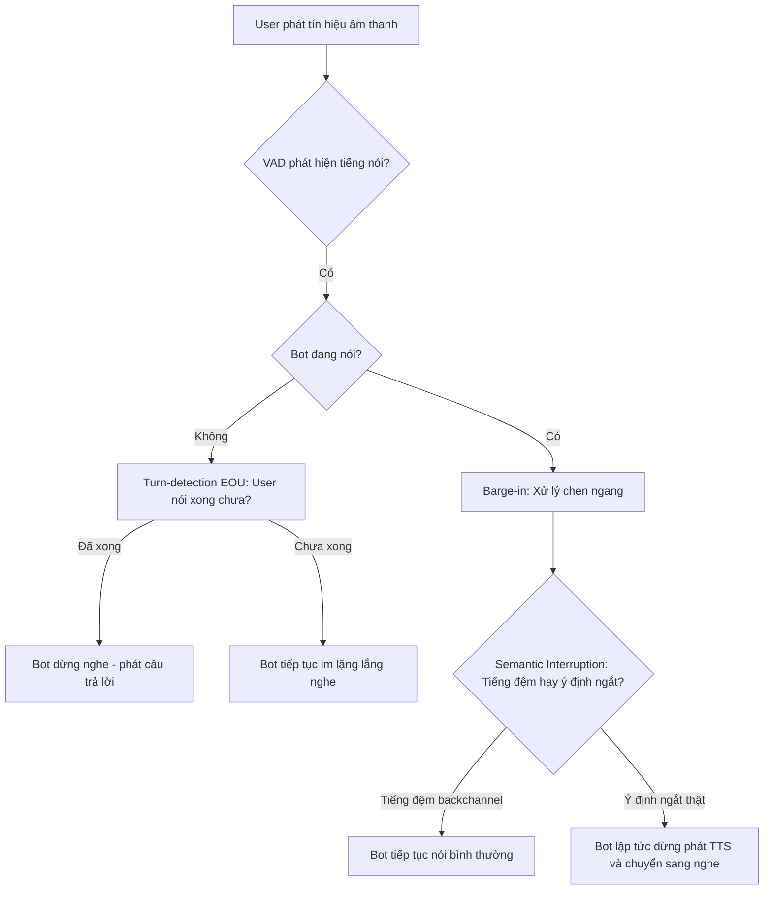
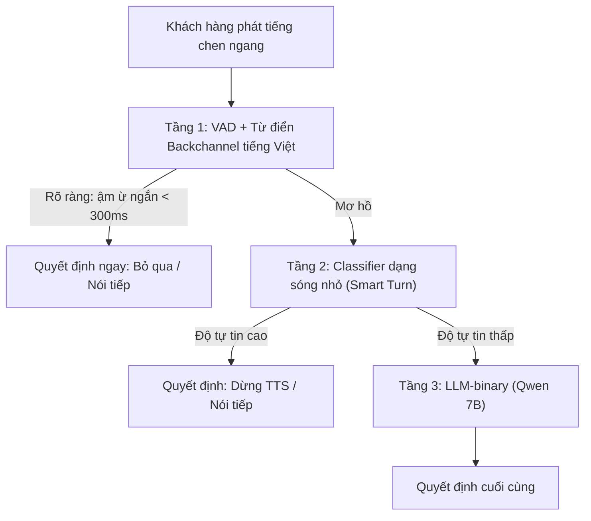

# 05 — Quản Lý Lượt Lời (Turn-Taking) Trong Đàm Thoại Qua Môi Trường Telephony

> [!NOTE]
> - Tài liệu này khảo sát toàn diện bài toán quản lý lượt lời (Turn-Taking) cho voice-bot tổng đài,
> - **tập trung giải quyết tình trạng ngắt lời (barge-in)** và phân biệt phản hồi đệm (backchannel) dưới ngân sách latency nghiêm ngặt.
> - Tham chiếu chi tiết về phân rã kịch bản ngắt lời và lỗi word-check xem tại [01_interrupt_taxonomy.md](01_interrupt_taxonomy.md),
> - và phân tích các mô hình turn-detection cùng xử lý tiền xử lý âm thanh xem tại [02_turn_models_and_voice_frontend.md](02_turn_models_and_voice_frontend.md).

---

## 1. Dẫn dắt bối cảnh

- **Bối cảnh thực tế**:
  - Khi xây dựng các chatbot đàm thoại trực tiếp qua điện thoại (telephony),
  - việc duy trì một luồng giao tiếp trôi chảy và tự nhiên như giữa người với người là yếu tố quyết định trải nghiệm khách hàng.
- **Nghịch lý đo lường**:
  - Tại sao các mô hình bot thoại hiện tại thường ngắt lời một cách thô bạo mỗi khi khách hàng chỉ vô tình phát ra tiếng đệm nhỏ ("dạ", "ừ"),
  - nhưng lại tiếp tục luyên thuyên khi khách hàng đang cố gắng nói chen vào để sửa thông tin?
  - Làm thế nào để phân biệt chính xác giữa một tiếng đệm duy trì lượt lời với một ý định ngắt lời thực sự trong quỹ thời gian phản xạ dưới 150 miligiây?

> Tài liệu này sẽ phân rã chi tiết 3 bài toán con của turn-taking,
> **so sánh các giải pháp SOTA dựa trên văn bản và dạng sóng âm**,
> đồng thời đề xuất kiến trúc phễu đa tầng để giảm thiểu tối đa độ trễ phản xạ của bot.

---

## 2. Glossary

- **⚙️ Bảng định nghĩa toàn bộ ký hiệu và thuật ngữ viết tắt trong tài liệu**:

| Ký hiệu / Thuật ngữ | Tên đầy đủ tiếng Anh | Giải nghĩa tiếng Việt |
| :--- | :--- | :--- |
| `EOU` / `EOT` | **End-of-Utterance / End-of-Turn** | Điểm kết thúc phát ngôn / kết thúc lượt nói của người dùng. |
| `VAD` | **Voice Activity Detection** | Bộ phát hiện hoạt động giọng nói (phân biệt khoảng lặng và tiếng nói). |
| `RTF` | **Real-Time Factor** | Chỉ số đo tốc độ xử lý âm thanh (RTF < 1.0 nghĩa là chạy kịp thời gian thực). |
| `TPR` | **True Positive Rate** | Tỷ lệ nhận diện đúng (độ nhạy của mô hình). |
| `FPR` | **False Positive Rate** | Tỷ lệ báo còi giả (tỷ lệ nhận diện nhầm). |
| `F1` | **F1-Score** | Điểm trung bình điều hòa giữa Precision và Recall. |
| `GMM` | **Gaussian Mixture Model** | Mô hình hỗn hợp Gauss (thuật toán phân loại truyền thống). |
| `DNN` | **Deep Neural Network** | Mạng nơ-ron học sâu. |
| `OSS` | **Open Source Software** | Phần mềm mã nguồn mở. |
| `TTS` | **Text-to-Speech** | Hệ thống chuyển đổi văn bản thành giọng nói. |
| `LLM` | **Large Language Model** | Mô hình ngôn ngữ lớn. |
| `DTMF` | **Dual-Tone Multi-Frequency** | Tín hiệu bấm phím điện thoại viễn thông (0-9, \*, #). |

---

## 3. Phân Rã Ba Bài Tác Vụ Con Của Turn-Taking

- **⚙️ Bảng phân rã các bài toán con độc lập về mặt nghiệp vụ**:

| STT | Bài toán con | Câu hỏi cốt lõi | Thời điểm kích hoạt | Cách đo lường |
| :--- | :--- | :--- | :--- | :--- |
| **1** | **Turn-detection / Endpointing (EOU)** | Khách hàng đã nói xong chưa? Bot đã đến lúc phải trả lời chưa? | Khi khách hàng vừa ngừng phát âm. | Latency phản xạ tổng thể của bot. |
| **2** | **Barge-in / Interruption Handling** | Khách hàng chen ngang lúc bot đang nói $\rightarrow$ Bot có nên dừng phát TTS? | Khi bot đang phát âm thanh và micro ghi nhận có tiếng người dùng. | Tỷ lệ chính xác quyết định ngắt (%), Latency từ lúc nói $\rightarrow$ dừng phát. |
| **2b** | **Semantic Interruption** | Tiếng người dùng chen vào là tiếng đệm (backchannel) hay ý định ngắt thật? | Xảy ra đồng thời trong quá trình xử lý bài toán **2**. | Tỷ lệ chính xác nhận diện backchannel (%). |
| **3** | **Backchannel (Bot phát)** | Bot có nên chủ động phát âm thanh ngắn ("dạ", "ừ") để biểu hiện sự lắng nghe? | Khi khách hàng đang trình bày một câu thoại dài liên tục. | Độ tự nhiên của hội thoại (đánh giá MOS). |

### 3.1 Sơ đồ luồng logic điều phối lượt lời

- **Khung đọc sơ đồ**:
  - **Đề bài cần giải**:
    - Điều phối trạng thái lắng nghe và phát âm thanh của bot dựa trên hoạt động giọng nói của người dùng.
  - **Giả định nền**:
    - Hệ thống hỗ trợ truyền âm thanh hai chiều (full-duplex) thời gian thực.
  - **Ý nghĩa các khối**:
    - `VAD` / `Status`: Các bộ lọc kiểm tra trạng thái vật lý của tín hiệu âm thanh đầu vào và trạng thái hoạt động hiện tại của bot.
    - `TD` / `BI` / `SEM`: Các khối quyết định logic ở tầng cao (chứa các mô hình học sâu hoặc luật nghiệp vụ).
    - `REPLY` / `WAIT` / `CONT` / `STOP`: Các hành động điều phối đầu ra tương ứng của bot.
  - **Cách đọc sơ đồ**:
    - Tín hiệu âm thanh đi từ `U` qua bộ lọc `VAD`.
    - Nếu có tiếng nói, hệ thống kiểm tra trạng thái phát `Status`.
    - Nếu bot đang im lặng, luồng rẽ sang `TD` để quyết định phản hồi (`REPLY` hoặc `WAIT`).
    - Nếu bot đang nói, luồng rẽ sang `BI` và `SEM` để quyết định ngắt âm thanh (`STOP` hoặc `CONT`).

---

## 4. Tổng quan các giải pháp Turn-Detection hiện nay

- **⚙️ Bảng so sánh hai trường phái: text-based (chờ ASR) và waveform-based (âm thanh thô)**:

| Tên giải pháp | Đầu vào tín hiệu | Bản chất thuật toán | Kích thước tham số | Latency (Inference) | Môi trường chạy | Bản quyền sử dụng |
| :--- | :--- | :--- | :--- | :--- | :--- | :--- |
| **LiveKit Turn-Detector** | Văn bản (Transcript) | Phân loại EOU ngữ nghĩa | ~0.5B (Distilled Qwen2.5) | ⚠️ Chưa công bố | CPU / GPU | **LiveKit Model License** (Hạn chế thương mại). |
| **Pipecat Smart Turn v3** | Sóng âm thô (Waveform 8s gần nhất) | Phân tích ngữ điệu (prosody) | ~8M (Whisper-tiny encoder) | **12.6ms - 94.8ms** | CPU (Không cần GPU) | **BSD-2-Clause** (Mở hoàn toàn). |
| **VAP (Voice Activity Projection)** | Sóng âm thô (Waveform 2 kênh) | Dự đoán hoạt động âm thanh tương lai | Transformer cross-attention | ~14.6ms per frame | CPU | **MIT License** (Mở hoàn toàn). |
| **TEN Turn Detection** | Văn bản (Transcript) | Phân loại 3 trạng thái (Finished/Wait/Unfinished) | **7B** (Qwen2.5-7B) | ⚠️ Chưa công bố (Cao) | GPU bắt buộc | Apache-2.0 + Hạn chế bổ sung. |
| **EOT Classifier nhỏ** | Văn bản (Transcript) | Phân loại EOU ngữ nghĩa | ~0.6B - 1B | ~90ms - 110ms | CPU | Tùy thuộc base model. |

- **Đặc trưng ngôn ngữ tiếng Việt (⚠️ TỐI QUAN TRỌNG)**:
  - **Smart Turn v3/v3.1**:
    - Là mô hình nhận dạng dạng sóng duy nhất có bằng chứng thực nghiệm hỗ trợ tiếng Việt (`✅ vi`).
    - Blog Daily.co công bố độ chính xác trên tiếng Việt đạt **81.27%** (tuy nhiên tỷ lệ báo còi giả FP khá cao: 14.84%).
  - **LiveKit Turn-Detector & TEN**:
    - Chỉ hỗ trợ nhóm ngôn ngữ mặc định (14 ngôn ngữ cho LiveKit, tiếng Anh và tiếng Trung cho TEN), **hoàn toàn không hỗ trợ tiếng Việt** (`⛔ no-vi`).
    - Muốn áp dụng bắt buộc phải tự thực hiện quy trình fine-tune/distill riêng cho tiếng Việt.

> [!NOTE]
> - Phiên bản LiveKit Turn-Detector dạng text-based ~0.5B hiện đã bị thay thế (deprecated).
> - Phiên bản khuyến nghị hiện tại `inference.TurnDetector` là **bộ phát hiện end-of-turn hợp nhất trên sóng âm** (chạy CPU, tốn <500MB RAM, dùng được cả với S2S).
> - Để phân tích sâu hơn về 3 lớp mô hình (VAD, Turn-detection, Voice-isolation) hãy tham khảo [02_turn_models_and_voice_frontend.md](02_turn_models_and_voice_frontend.md).

---

## 5. Đánh Giá Các Mô hình VAD nền ở Tầng Dưới

- **Mô hình Silero VAD**:
  - **Cơ chế**: Sử dụng mạng nơ-ron học sâu DNN, hoạt động ổn định trên cả dải tần 8kHz và 16kHz.
  - **Độ chính xác**: Đạt tỷ lệ đúng 87.7% TPR trong môi trường có tiếng ồn.
  - **Hạn chế**: Gặp hiện tượng **trễ đuôi (delay vài trăm miligiây)** trước khi xác nhận khoảng im lặng kết thúc câu, dễ gây lãng phí ngân sách latency phản xạ.
- **Mô hình WebRTC VAD**:
  - **Cơ chế**: Dựa trên mô hình hỗn hợp Gauss (GMM) truyền thống.
  - **Tốc độ**: Cực nhanh, xử lý trên các frame siêu ngắn (10ms/20ms/30ms).
  - **Hạn chế**: **Độ chính xác cực thấp trong môi trường nhiễu** (chỉ đạt ~50% TPR), dễ bị kích hoạt sai bởi tiếng ồn động của tổng đài viễn thông gây ra hiện tượng ngắt lời nhầm.

---

## 6. Cơ Chế Xử Lý Chen Ngang (Barge-In) Trong Các Framework

- **⚙️ Bảng đối chiếu năng lực chống ngắt lời sai và khả năng tự chủ**:

| Framework | Cơ chế ngắt lời | Loại thuật toán | Khả năng chống ngắt lời sai | Triển khai tự chủ |
| :--- | :--- | :--- | :--- | :--- |
| **Pipecat** | Cấu hình chiến lược `InterruptionStrategy`: Kiểm soát cường độ âm lượng kết hợp đếm số từ tối thiểu (`min-words`). | Chủ yếu dựa vào luật/năng lượng (Energy-based). | Thấp (Không phân biệt được từ ậm ừ với từ có nghĩa). | ✅ Có (Mã nguồn mở hoàn toàn). |
| **LiveKit Adaptive** | Trích xuất đặc trưng âm học bằng mô hình CNN chạy trên waveform thô. | Dựa vào âm học và ngữ nghĩa (Semantic/Acoustic). | **Rất tốt** (Nhận diện chính xác onset và prosody của backchannel). | ⚠️ Giới hạn (Bản thương mại khóa vào cloud, self-host miễn phí bị giới hạn tải). |
| **Vocode** | Dựa trên ngưỡng im lặng của VAD nền. | Dựa vào năng lượng (Energy-based). | Rất kém. | ✅ Có (Mã nguồn mở). |

---

## 7. Phân Tích Ngân Sách Latency $\le$ 150ms Cho Quyết Định Ngắt Lời

- **Bóc tách các thành phần trễ vật lý**:
  - Trễ phát hiện âm thanh (VAD trigger): ~10ms - 30ms.
  - Trễ tích lũy buffer âm thanh (chờ đủ thời lượng để phân tích): ~50ms - 200ms.
  - Trễ xử lý của mô hình phân loại (Inference): ~12ms (Smart Turn) hoặc lên tới ~280ms (Mô hình LLM 7B nội bộ).
  - Trễ dừng phát tín hiệu vật lý (TTS-stop): ~10ms - 50ms.
- **Nút thắt hiệu năng**:
  - Việc sử dụng mô hình LLM-7B để kiểm tra ngữ nghĩa chen ngang tiêu tốn ~280ms riêng cho bước inference, **chắc chắn làm vỡ ngân sách $\le$ 150ms**.
  - Giải pháp bắt buộc: Thiết kế kiến trúc phễu đa tầng để xử lý nhanh các ca rõ ràng ở tầng thấp và chỉ đẩy các ca khó lên LLM.

### 7.1 Sơ đồ kiến trúc phễu 3 tầng giảm trễ phản xạ

- **Khung đọc sơ đồ**:
  - **Đề bài cần giải**:
    - Giảm độ trễ phản xạ trung bình khi xử lý ngắt lời mà vẫn đảm bảo tính chính xác về ngữ nghĩa.
  - **Giả định nền**:
    - Phần lớn các ca chen ngang thực tế là các tiếng ậm ừ ngắn hoặc khoảng im lặng rõ ràng.
  - **Ý nghĩa các khối**:
    - `L1` (Tầng 1): Bộ luật từ điển siêu nhẹ chạy trên CPU (<30ms).
    - `L2` (Tầng 2): Mô hình phân tích âm học nhỏ dạng sóng (~12ms - 60ms).
    - `L3` (Tầng 3): Mô hình ngôn ngữ lớn xử lý ngữ cảnh sâu (~280ms).
    - `D1`/`D2`/`D3`: Các quyết định đầu ra tương ứng của từng tầng.
  - **Cách đọc sơ đồ**:
    - Tín hiệu âm thanh đi từ `In` vào `L1`.
    - Nếu là tiếng đệm ngắn rõ ràng, hệ thống quyết định ngay tại `D1`.
    - Nếu mơ hồ, tín hiệu được chuyển tiếp xuống `L2`. Nếu `L2` đạt độ tự tin cao, quyết định tại `D2`.
    - Nếu `L2` có độ tự tin thấp, yêu cầu mới được đẩy xuống `L3` để đưa ra quyết định cuối cùng `D3`.
    - Thiết kế này giúp giải quyết đến 80% số cuộc gọi ở Tầng 1 và Tầng 2 với độ trễ cực thấp.

---

## 8. Tài liệu tham khảo

> Các chỉ số benchmark được trích dẫn trực tiếp từ các nghiên cứu gốc, cần thực nghiệm kiểm chứng chéo trên hạ tầng thực tế để xác minh độ tin cậy.

### 8.1 Bài báo nghiên cứu khoa học

- **⚙️ Bảng đối chiếu các bài báo khoa học và hội nghị chuyên ngành**:

| Link tài liệu | Nội dung chứng minh | Trạng thái |
| :--- | :--- | :--- |
| [arXiv:2401.04868](https://arxiv.org/html/2401.04868) | Mô hình VAP dự đoán liên tục trạng thái lượt lời trên 2 kênh, chạy kịp realtime trên CPU. | ✅ Nguồn mạnh (MIT). |
| [arXiv:2403.06487](https://arxiv.org/abs/2403.06487) | VAP multilingual hỗ trợ tốt EN/ZH/JA, chứng minh tính khả thi khi fine-tune ngôn ngữ mới. | ✅ Nguồn mạnh. |
| [arXiv:2510.04016](https://arxiv.org/pdf/2510.04016) | Mô hình EOT ngữ nghĩa nhỏ chạy trên CPU đạt F1 0.866 dưới 110ms (tiếng Thái). | ⚠️ Preprint. |
| [arXiv:2410.15929](https://arxiv.org/pdf/2410.15929) | Giải pháp dự đoán backchannel liên tục dựa trên mô hình VAP fine-tune. | ✅ Nguồn mạnh (NAACL 2025). |
| [arXiv:2401.14717](https://arxiv.org/pdf/2401.14717) | Kết hợp thông tin âm học thô và LLM phục vụ quyết định ngắt lời. | ⚠️ Preprint. |
| [arXiv:2601.17270](https://arxiv.org/pdf/2601.17270) | Đánh giá sự ảnh hưởng của kích thước cửa sổ phân tích (window-size) lên độ chính xác VAD. | ⚠️ Preprint. |
| [Fukunaga (2025)](https://www.isca-archive.org/interspeech_2025/fukunaga25_interspeech.pdf) | Nghiên cứu thời điểm chủ động phát tín hiệu backchannel cho robot đàm thoại. | ✅ Nguồn mạnh (Interspeech). |
| [Paierl (2025)](https://www.isca-archive.org/interspeech_2025/paierl25_interspeech.pdf) | Mô hình xác định thời gian phản hồi liên tục cho robot tương tác với người. | ✅ Nguồn mạnh (Interspeech). |

### 8.2 Tài liệu hướng dẫn kỹ thuật của các Framework

- **Smart Turn v3 Release (Daily.co)**:
  - Công bố phiên bản v3 hỗ trợ 23 ngôn ngữ gồm tiếng Việt (`vi`) với độ chính xác 81.27% trên CPU.
  - URL tham chiếu: [Daily.co Product Blog](https://www.daily.co/blog/announcing-smart-turn-v3-with-cpu-inference-in-just-12ms/)
- **LiveKit End-of-Turn Blog**:
  - Giới thiệu mô hình turn-detector v1.0 chưng cất từ Qwen 7B về 0.5B, hỗ trợ 14 ngôn ngữ.
  - URL tham chiếu: [LiveKit Tech Blog](https://livekit.com/blog/solving-end-of-turn-detection)
- **Adaptive Interruption Blog (LiveKit)**:
  - Phân tích hiệu năng mô hình CNN âm học đạt precision 86% và recall 100% ở cửa sổ âm thanh 500ms.
  - URL tham chiếu: [LiveKit Tech Blog](https://livekit.com/blog/adaptive-interruption-handling)

---

## ✅ Tự kiểm nhanh

1. Tại sao việc chỉ tăng cấu hình ngưỡng im lặng cứng (Endpointing Timeout) của VAD nền không thể giải quyết triệt để bài toán nhận diện hết lượt lời (EOU)?

- **Hạn chế của VAD-timeout**:
  - VAD nền chỉ đo năng lượng âm thanh thô để phân loại "có tiếng nói/im lặng", hoàn toàn không hiểu ngữ nghĩa của câu thoại hay ngữ điệu của người nói.
  - Nếu đặt ngưỡng timeout quá ngắn (ví dụ: 300ms): Bot sẽ ngắt lời người dùng ngay khi họ hơi ngập ngừng giữa câu để suy nghĩ.
  - Nếu đặt ngưỡng timeout quá dài (ví dụ: > 800ms): Trải nghiệm người dùng sẽ bị ảnh hưởng nghiêm trọng do bot phản xạ quá chậm chạp, tạo ra các khoảng lặng chết.
  - Do đó, cần kết hợp thêm mô hình **semantic turn-detector** ở phía sau để quyết định dựa trên cấu trúc ngữ pháp câu và ngữ điệu kết thúc câu của người nói.

2. Smart Turn v3 hỗ trợ tiếng Việt theo cơ chế nào và đâu là rủi ro cần lưu ý khi đưa vào tổng đài thực tế?

- **Cơ chế hoạt động**:
  - Smart Turn v3 sử dụng encoder của mô hình Whisper-tiny (~8 triệu tham số) làm bộ trích xuất đặc trưng âm học trực tiếp từ waveform đầu vào, sau đó phân tích ngữ điệu (prosody) để nhận diện ý định kết thúc câu.
- **Rủi ro vận hành**:
  - Độ chính xác công bố cho tiếng Việt là **81.27%** với tỷ lệ báo còi giả (False Positive - hiểu lầm tiếng nói là kết thúc câu) lên tới **14.84%**.
  - Mô hình được huấn luyện chủ yếu trên nguồn dữ liệu băng rộng (16kHz sạch). Khi hoạt động trên kênh thoại tổng đài 8kHz bị nén méo và ồn, tỷ lệ lỗi báo còi giả (FP) có khả năng tăng cao hơn nhiều, dẫn đến việc bot cướp lời khách hàng liên tục. Cần tiến hành downsample và fine-tune độc lập trên tập dữ liệu tổng đài của team trước khi chạy chính thức.

3. Làm thế nào để phân biệt giữa phản hồi đệm (Backchannel) và ý định ngắt lời thật sự (Barge-in) bằng giải pháp chi phí thấp?

- **Tầng 1: Sử dụng bộ luật từ vựng và thời gian**:
  - Xây dựng một từ điển nhỏ chứa các từ đệm phổ biến trong tiếng Việt (ví dụ: "dạ", "vâng", "ừ", "ờ", "rồi").
  - Nếu ASR trả về transcript chứa các từ này và thời lượng của đoạn âm thanh chen ngang ngắn hơn một ngưỡng xác định (ví dụ: < 400ms), hệ thống sẽ phân loại đó là backchannel và ra lệnh cho bot tiếp tục phát TTS bình thường.
- **Tầng 2**:
  - Chỉ khi đoạn âm thanh chen ngang kéo dài hơn hoặc chứa các từ vựng mang tính phủ định/yêu cầu đính chính, hệ thống mới chuyển đổi trạng thái để dừng phát TTS và chuyển sang lắng nghe.

