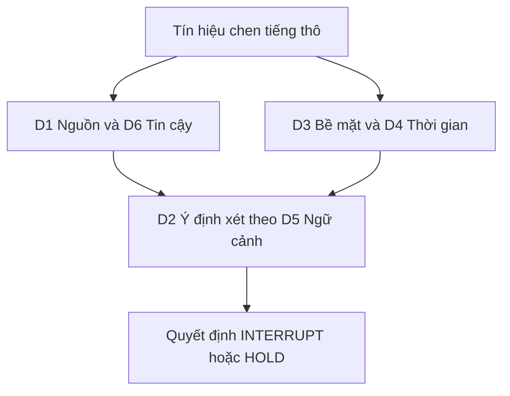

# 01 — Taxonomy Ngắt Lời (Barge-in) Theo Chiều, Bảng Tình Huống và Bản Đồ Giải Pháp

> [!NOTE]
> - Tài liệu này phân rã không gian các tình huống ngắt lời thành các chiều đặc trưng trực giao,
> - **lập bảng chi tiết các tình huống cụ thể** và chỉ rõ nguyên nhân thất bại của phương pháp so khớp từ vựng (simple word-check).
> - Mục tiêu là cung cấp nền tảng khoa học để thiết kế kịch bản đối kháng cho harness kiểm thử và lựa chọn đòn bẩy kỹ thuật phù hợp.
> - Tham chiếu chi tiết về kiến trúc luồng logic turn-taking xem tại [00_README.md](00_README.md),
> - và phân tích sâu về các mô hình turn-detection xem tại [02_turn_models_and_voice_frontend.md](02_turn_models_and_voice_frontend.md).

---

## 1. Dẫn dắt bối cảnh

- **Bối cảnh thực tế**:
  - Khi đánh giá chất lượng của bộ phát hiện ngắt lời (barge-in) trên trợ lý giọng nói tổng đài,
  - các kỹ sư thường ghi nhận tỷ lệ chính xác tuyệt đối trên một tập kịch bản thử nghiệm nhỏ trong môi trường phòng lab.
- **Nghịch lý đo lường**:
  - Trong môi trường cuộc gọi điện thoại thực tế viễn thông, bộ kiểm tra từ khóa bề mặt (simple word-check) nhanh chóng sụp đổ do tiếng ồn xé nát từ vựng và khách hàng ngắt lời không cần từ khóa,
  - khiến việc đo lường bị sai lệch nặng nề và làm bot hoạt động thất thường (cướp lời hoặc phớt lờ khách hàng).

> Tài liệu này phân rã không gian các tình huống ngắt lời thành sáu chiều đặc trưng trực giao,
> **lập bảng các ca kiểm thử điển hình**,
> chỉ rõ cơ chế thất bại của phương pháp so khớp từ vựng và vẽ bản đồ giải pháp tương ứng.

---

## 2. Glossary

- `barge-in` -> **Barge-in** ->
  - Hành động người dùng phát tiếng chen ngang vào thời điểm bot đang nói (phát TTS).
- `take-turn` -> **Turn-taking Claim** ->
  - Ý định giành quyền nói thực sự của người dùng,
  - ví dụ: đưa ra câu trả lời sớm, sửa đổi thông tin, hỏi ngược lại hoặc ra lệnh dừng.
- `backchannel` -> **Backchannel** ->
  - Âm đệm phản hồi thụ động của người dùng (như "dạ", "vâng", "ừ"),
  - không mang ý định cướp lượt nói mà nhằm khuyến khích bot tiếp tục trình bày.
- `self-talk` -> **Self-talk / Disfluency** ->
  - Tiếng nói ngập ngừng, nói vấp, nghĩ thành tiếng hoặc chuẩn bị nói của người dùng (như "ờ để tôi xem").
- `target-speaker` -> **Target Speaker** ->
  - Giọng nói của chính khách hàng mục tiêu được định danh trong cuộc gọi,
  - phân biệt với giọng nói của người bên cạnh hoặc âm thanh TV.
- `diarization` -> **Speaker Diarization** ->
  - Thuật toán phân tách người nói,
  - xác định "ai đang nói vào thời điểm nào" trong luồng âm thanh.
- `AEC` -> **Acoustic Echo Cancellation** ->
  - Bộ khử tiếng vọng âm học,
  - ngăn chặn âm thanh phát ra từ loa của bot dội ngược lại micro ghi âm.
- `EOT` / `EOU` -> **End-of-Turn / End-of-Utterance** ->
  - Điểm mốc đánh dấu sự kết thúc lượt thoại hoặc kết thúc phát ngôn của người dùng.
- `prosody` -> **Prosody** ->
  - Đặc trưng ngữ điệu của giọng nói (bao gồm cao độ, nhịp điệu, cường độ và trường độ).
- `slot` -> **Slot** ->
  - Một trường thông tin nghiệp vụ cần thu thập (ví dụ: số thẻ, năm sinh, tên ngân hàng).
- `dialog-state` -> **Dialog State** ->
  - Trạng thái hiện tại của cuộc hội thoại (ví dụ: bot đang ở bước chờ nhập thông tin hay đang đọc đoạn văn dài).
- `confidence` -> **ASR / Diarization Confidence** ->
  - Độ tin cậy (xác suất) của kết quả dịch chữ hoặc kết quả phân tách người nói.
- `Confusion Cells` -> **Confusion matrix (TP/FP/FN/TN)** ->
  - Ma trận nhầm lẫn với quy ước positive là sự kiện ngắt lời (INTERRUPT):
    - TP (True Positive) -> ngắt đúng.
    - FP (False Positive) -> ngắt nhầm (báo còi giả).
    - FN (False Negative) -> bỏ sót ngắt lời.
    - TN (True Negative) -> giữ lượt nói đúng.

---

## 3. Sáu Chiều Đặc Trưng của Một Sự Kiện Ngắt Lời

- **⚙️ Nguyên lý phân tích**:
  - Một sự kiện chen tiếng không thể được đánh giá nhị phân phẳng.
  - Nó là một tọa độ trong không gian 6 chiều đặc trưng trực giao.
  - Nhãn chuẩn xác định ngắt (INTERRUPT) hay giữ (HOLD) được sinh ra từ sự hội tụ của các chiều này.
  - Chi tiết phân cấp 6 chiều trực giao:

| Chiều | Câu hỏi cốt lõi | Các giá trị | Quan sát được từ text thuần? |
| :--- | :--- | :--- | :--- |
| **D1 — Nguồn phát** | Âm này từ đâu ra? | target-user · người-bên-cạnh · nhiễu-phi-giọng · echo-TTS · giọng-từ-TV | Một phần (cần diarization) |
| **D2 — Ý định** | Người dùng muốn gì? | giành-lượt · âm-đệm · nói-vấp · xác-nhận-thụ-động | **Không** (cần ngữ cảnh) |
| **D3 — Đánh dấu bề mặt** | Ý định lộ ra trên text thế nào? | có-từ-khóa · nội-dung-nghiệp-vụ · slot-1-token · mở-đầu-âm-đệm · chỉ-có-ngữ-điệu | Có (nhưng thiếu) |
| **D4 — Quan hệ thời gian** | Chen vào lúc nào so với lời bot? | đè-toàn-phần · chen-giữa · ở-ranh-giới-lượt · sau-khoảng-lặng | Có (timing) |
| **D5 — Ngữ cảnh hội thoại** | Bot đang ở đâu trong kịch bản? | đang-hỏi-slot · đang-đọc-đoạn-dài · vừa-hỏi-yes/no · đang-xác-nhận | **Không** (cần dialog-state) |
| **D6 — Độ tin cậy** | Tín hiệu/nhãn có đáng tin? | sạch-rõ · méo-do-nhiễu · diar-không-chắc · SNR-thấp-cụt | **Không** (cần confidence) |

> **Đọc bảng:** ba chiều D2, D5, D6 — chính là ba chiều quyết định nhãn — đều **không** quan sát được từ text thuần. Word-check chỉ thấy D3 và một phần D4. Đây là lý do cấu trúc khiến nó không thể đúng ở ca khó, chứ không phải "chưa đủ từ khóa".

### 3.1 Chi tiết hóa sáu chiều đặc trưng

- **D1 — Nguồn phát (Source Attribution)**:
  - Cơ chế: Chỉ giọng của target-user mới được ngắt bot. Nhạc nền, TV, người bên cạnh, tiếng vọng đều không tính.
  - Nhận diện: Cần diarization + target-speaker verification + AEC.
  - Ý nghĩa: Sai nguồn phát thì mọi phân tích phía sau vô nghĩa.
  - Bẫy: Tin tuyệt đối nhãn `speaker` của ASR mà bỏ qua sai số phân tách người nói.
- **D2 — Ý định (Intent)**:
  - Cơ chế: Cùng chuỗi từ nhưng ý định khác nhau (giành lượt -> INTERRUPT; âm đệm -> HOLD).
  - Nhận diện: Suy từ ngữ cảnh hội thoại, nội dung câu thoại và ngữ điệu.
  - Bẫy: Đánh đồng độ dài số từ với ý định giành lượt (ví dụ: backchannel dài).
- **D3 — Đánh dấu bề mặt (Lexical Marking)**:
  - Cơ chế: Mức độ hiển thị ý định qua từ vựng thô.
  - Nhận diện: Nhánh duy nhất word-check nhìn thấy đầy đủ.
  - Bẫy: Khách đáp ngắn (slot 1-token) không chứa từ khóa dừng vẫn bị bỏ sót.
- **D4 — Quan hệ thời gian (Timing & Overlap)**:
  - Cơ chế: Điểm chen âm thanh so với lời bot.
  - Nhận diện: Đo lường qua năng lượng VAD và thời gian chồng lấn.
  - Bẫy: Tự ngắt vì tiếng ồn cơ học kéo dài.
- **D5 — Ngữ cảnh hội thoại (Dialog State)**:
  - Cơ chế: Trạng thái bot trong kịch bản nghiệp vụ.
  - Nhận diện: Truy vấn trạng thái bot đang hỏi Yes/No hay đọc đoạn dài để đảo nghĩa của từ đệm (ví dụ: từ "vâng").
  - Bẫy: Xử lý sự kiện độc lập mà không liên kết với câu thoại của bot.
- **D6 — Độ tin cậy tín hiệu (Confidence)**:
  - Cơ chế: Độ tin cậy của ASR và diarization trong môi trường bẩn.
  - Nhận diện: Sử dụng chỉ số confidence của ASR/diarization để ghìm quyết định ngắt.
  - Bẫy: Bỏ qua confidence dẫn đến phản ứng sai trước token ảo sinh ra từ nhiễu.

### 3.7 Sơ đồ tích hợp các chiều quyết định

- **Khung đọc sơ đồ**:
  - **Đề bài cần giải**:
    - Mô tả luồng xử lý và kết hợp các chiều đặc trưng để đưa ra phán quyết ngắt/giữ.
  - **Giả định nền**:
    - Hệ thống tiếp nhận luồng dữ liệu âm thanh và thông tin ngữ cảnh hội thoại đồng thời.
  - **Ý nghĩa các khối**:
    - `RAW`: Tín hiệu âm thanh thô ghi nhận sự chen tiếng.
    - `SRC`: Nhánh phân tích vật lý (D1 nguồn phát và D6 độ tin cậy).
    - `SURF`: Nhánh phân tích bề mặt (D3 văn bản và D4 thời gian).
    - `INTENT`: Trạng thái ý định (D2) được lọc và hiệu chỉnh bởi trạng thái ngữ cảnh hội thoại (D5).
    - `DEC`: Quyết định cuối cùng (INTERRUPT hoặc HOLD).
  - **Cách đọc sơ đồ**:
    - Tín hiệu `RAW` được phân bổ song song qua hai nhánh `SRC` và `SURF`.
    - Kết quả phân tích của hai nhánh này hội tụ tại `INTENT` để đánh giá ý định thực tế trong ngữ cảnh hội thoại.
    - Phán quyết cuối cùng `DEC` được đưa ra dựa trên kết quả của khối `INTENT`.
    - Phương pháp word-check truyền thống chỉ đi qua nhánh `SURF`, dẫn đến việc bỏ sót toàn bộ thông tin ngữ cảnh và nguồn phát.

---

## 4. Bảng phân tích các Tình Huống thực tế (Situation Table)

- **Quy ước ký hiệu**:
  - **I** -> INTERRUPT (nhãn chuẩn đúng phải ngắt).
  - **H** -> HOLD (nhãn chuẩn đúng phải giữ).
  - Kết quả bộ decider baseline: **E** (Energy VAD), **S** (Semantic Word-check).
  - Ký hiệu: ✅ (đúng), ❌ (sai).

### 4.1 Nhóm A — Các ca cơ bản (So khớp từ vựng xử lý tốt)

| #   | Tình huống | Chiều nổi bật | Đúng | E | S |
| :-- | :--- | :--- | :--- | :--- | :--- |
| A1  | Khách nói "dừng lại đã" | D2 giành-lượt · D3 từ-khóa | I | ✅ | ✅ |
| A2  | Trả lời sớm đủ ý: "thẻ Vietcombank của tôi" | D2 giành-lượt · D3 nội-dung | I | ✅ | ✅ |
| A3  | Khách phát âm đệm ngắn: "dạ" | D2 âm-đệm · D3 âm-đệm | H | ✅ | ✅ |
| A4  | Người bên cạnh: [other] "lấy mẹ cốc nước" | D1 người-bên-cạnh | H | ❌ | ✅ |
| A5  | Nhạc chờ nền | D1 nhiễu-phi-giọng | H | ❌ | ✅ |

### 4.2 Nhóm B — Lỗi Bỏ Sót Ngắt Lời (False Negative - FN)

| #   | Tình huống | Chiều nổi bật | Đúng | E | S | Vì sao S sai |
| :-- | :--- | :--- | :--- | :--- | :--- | :--- |
| B1  | Bot hỏi ngân hàng, khách đáp gọn "Vietcombank" | D3 slot-1-token · D5 đang-hỏi-slot | I | ✅/❌ | ❌ | 1 token, không số → rơi HOLD |
| B2  | Bot vừa hỏi "anh đồng ý chứ?", khách "vâng" | **D5 đảo-nghĩa** · D2 giành-lượt | I | ❌ | ❌ | "vâng" ∈ hold-words → HOLD, dù đây là CÂU TRẢ LỜI |
| B3  | Khách hiểu ý, nhảy thẳng: "thôi khỏi cần đọc nữa" | D2 giành-lượt · D3 từ-khóa-lẫn | I | ✅ | ✅ | (đúng — nhưng nhờ có "thôi", ăn may) |
| B4  | Hỏi ngược cụt: "bao nhiêu phí" | D2 giành-lượt · D3 nội-dung-ngắn | I | ✅/❌ | ✅ | đúng nhưng VÌ LÝ DO SAI (đếm token, không biết là câu hỏi) |
| B5  | Slot số nói chữ: bot hỏi năm sinh, khách "tám chín" | D3 slot-ngắn · D6 không-số | I | ❌ | ❌ | không digits-run, ≤2 token → HOLD |

### 4.3 Nhóm C — Lỗi Ngắt Lời Nhầm (False Positive - FP)

| #   | Tình huống | Chiều nổi bật | Đúng | E | S | Vì sao S sai |
| :-- | :--- | :--- | :--- | :--- | :--- | :--- |
| C1  | Backchannel dài: "vâng vâng em hiểu rồi ạ" | D2 âm-đệm · D4 dài | H | ❌ | ❌ | có token ngoài hold-set → ≥2 → INTERRUPT |
| C2  | Nghĩ-thành-tiếng: "ờ để em xem nào" | D2 nói-vấp | H | ❌ | ❌ | ≥2 token thực chất → INTERRUPT |
| C3  | Echo TTS của bot dội vào mic, gán nhầm user | D1 echo-TTS | H | ❌ | ❌ | text giống câu bot, ≥2 token → INTERRUPT (thiếu AEC) |
| C4  | Xác nhận thụ động kéo dài: "à thế à vâng vâng" | D2 xác-nhận-thụ-động | H | ❌ | ❌/✅ | tùy token; ranh giới mờ với hold-set |

### 4.4 Nhóm D — Lỗi do Kênh truyền nhiễu (D6)

| #   | Tình huống | Chiều nổi bật | Đúng | E | S | Vì sao S sai |
| :-- | :--- | :--- | :--- | :--- | :--- | :--- |
| D1  | TV nói "...thôi thì..." bị diar gán = user | D1 giọng-TV · D6 diar-sai | H | ❌ | ❌ | speaker gán nhầm + có "thôi" → INTERRUPT |
| D2  | Khách đáp "Vietcombank" dưới SNR thấp, ASR ra "...com..." | D6 SNR-thấp-cụt · D3 slot | I | ❌ | ❌ | transcript cụt 1 frag → HOLD (sót) |
| D3  | Giọng phát thanh TV nền, diar gán = other | D1 giọng-TV | H | ❌ | ✅ | đúng KHI diar đúng; sụp NẾU diar gán nhầm user |

---

## 5. Truy nguyên cơ chế hỏng trong mã nguồn hiện tại

- **Mã nguồn phân tích**: Hàm `SemanticRuleDecider._is_interrupt_event` tại tệp `src/fci_voice/sim/turn_decider.py`.
- **Bảng đối chiếu cơ chế hỏng**:

| Dòng | Logic | Giả định ngầm | Sụp ở nhóm |
| :--- | :--- | :--- | :--- |
| 93 | `if ev.speaker != SPK_USER: return False` | diarization luôn đúng | A4 ổn, nhưng **D1/D3** (nhiễu gán nhầm speaker) |
| 99 | `if any(k in t for k in _STOP_KEYWORD)` | từ khóa = ý định, match substring an toàn | **C/D1** (keyword ảo trong nhiễu, match nhầm) |
| 103 | `all(w in _HOLD_WORDS ...) -> False` | âm-đệm = một tập từ đóng | **B2/C1** (âm-đệm dài lẫn từ khác; "vâng" đảo nghĩa) |
| 106 | `len(toks) >= 2 or has_digits` | đủ từ = có ý định | **B1/B5** (slot ngắn = FN) và **C1/C2** (đủ từ nhưng không giành lượt = FP) |

---

## 6. Bản đồ Giải pháp Kỹ thuật theo chiều Đặc trưng

- **⚙️ Bảng phân phối giải pháp và mức ưu tiên**:

| Chiều | Vì sao lexicon không đủ | Hướng giải pháp | Tầng phễu | Chi phí |
| :--- | :--- | :--- | :--- | :--- |
| **D1 Nguồn** | từ vựng không nói "ai nói" | diarization + target-speaker VAD; **AEC** khử echo TTS | Tầng 1-2 | Trung bình |
| **D2 Ý định** | ý định ≠ từ | classifier ngữ nghĩa / LLM phán đoán giành-lượt | Tầng 2-3 | Cao |
| **D3 Bề mặt** | text thiếu/ảo | semantic embedding thay match-chuỗi; bỏ substring keyword | Tầng 1-2 | Thấp |
| **D4 Thời gian** | một mình mù nghĩa | energy-VAD + endpointing + prosody (Smart Turn) | Tầng 1-2 | Thấp |
| **D5 Ngữ cảnh** | từng-event độc lập không đủ | **bơm dialog-state vào decider** (đang hỏi slot gì) | mọi tầng | **Thấp — đòn bẩy cao** |
| **D6 Tin cậy** | không có confidence | confidence-gating; multimodal audio+text | mọi tầng | Thấp |

---

## 7. Định hướng cải tiến bộ kịch bản kiểm thử (Harness Spec)

- **Các bước triển khai**:
  - **Làm giàu cấu trúc `SpeechEvent`**:
    - Tích hợp thêm trường `asr_confidence` để mô phỏng độ méo của kênh truyền (D6).
    - Tích hợp trường xác suất `speaker_prob` thay cho nhãn người nói nhị phân cứng để mô phỏng sai số diarization (D1).
  - **Bơm dialog-state vào scenario**:
    - Khai báo rõ bước kịch bản nghiệp vụ hiện tại của bot để phục vụ việc xử lý ca đảo nghĩa (D5).
  - **Bổ sung kịch bản đối kháng**:
    - Thêm 10 kịch bản phức tạp thuộc nhóm B/C/D ở mục §4 (bao gồm "vâng"-đảo-nghĩa, slot-1-token, backchannel-dài, tiếng vọng echo, và nhiễu SNR thấp).

---

## 8. Tài liệu tham khảo

- **⚙️ Bảng đối chiếu nguồn tài liệu tham chiếu**:

| Nguồn | Liên quan tới chiều | Trạng thái |
| :--- | :--- | :--- |
| LiveKit Adaptive Interruption (CNN âm học, precision 86% / recall 100% ở cửa sổ 500ms) | D2 + D4 (onset/prosody của backchannel) | ⚠️ Số do hãng tự công bố, chưa kiểm chứng độc lập |
| Smart Turn v3 (prosody, vi 81.27% / FP 14.84%) | D4 + một phần D2 | ⚠️ Băng rộng 16kHz; FP có thể tăng trên 8kHz |
| TEN Turn Detection (3 trạng thái Finished/Wait/Unfinished) | D2 + D5 (ngữ cảnh kết thúc lượt) | ⚠️ 7B, GPU bắt buộc, không có vi |
| Pipecat `InterruptionStrategy` (min-words + năng lượng) | minh họa chính D3+D4 thuần — đúng baseline word-check ta đang phê | ✅ Mã nguồn mở |

---

## ✅ Tự kiểm nhanh

1. Tại sao từ "vâng" lại được coi là ca kinh điển chứng minh sự thất bại của phương pháp so khớp từ vựng?

- **Sự đảo nghĩa theo trạng thái kịch bản**:
  - Từ "vâng" có hai nhãn hoàn toàn trái ngược nhau tùy thuộc vào trạng thái của bot (D5):
    - Khi bot đang trình bày một đoạn thông tin dài, khách phát ra âm "vâng" -> đây là tiếng đệm duy trì lượt thoại (HOLD).
    - Ngay sau khi bot hỏi "anh đồng ý khóa thẻ chứ?", khách phát ra âm "vâng" -> đây là câu trả lời giành lượt nói để xác nhận nghiệp vụ (INTERRUPT).
  - Bộ lọc từ vựng thuần túy xử lý event độc lập không thể phân biệt được hai ca này.

2. Trong môi trường thực tế, tại sao rule speaker-check `ev.speaker != SPK_USER` lại dễ bị hỏng?

- **Sai số của tầng xử lý thô**:
  - Rule này dựa trên giả định ngầm là thuật toán phân tách người nói (diarization) hoạt động chính xác tuyệt đối.
  - Trong môi trường thực tế có tiếng ồn, tiếng TV hoặc tiếng người xung quanh, bộ diarization rất dễ gán nhầm các nguồn âm thanh này thành giọng của người dùng mục tiêu,
  - dẫn đến việc bot thực hiện các quyết định ngắt lời sai lệch.

3. Chiều đặc trưng nào mang lại đòn bẩy tối ưu hóa cao nhất với chi phí phát triển thấp nhất?

- **Chiều Ngữ cảnh hội thoại (D5)**:
  - Chỉ cần cải tiến cấu trúc dữ liệu để decider đọc được câu thoại bot đang phát (`agent_utterance`) và trạng thái nghiệp vụ hiện tại.
  - Thay đổi này cực kỳ rẻ (không cần GPU, không cần đổi mô hình) nhưng giải quyết được toàn bộ nhóm lỗi đảo nghĩa của từ đệm và lỗi bỏ sót ở các câu trả lời ngắn (slot 1-token).

