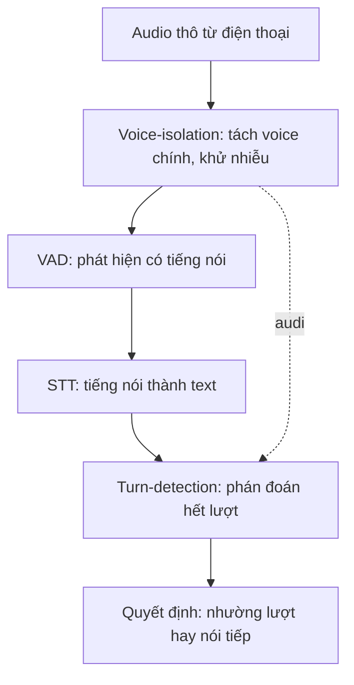

# 05.02 — Turn-detection Model vs VAD vs Voice-isolation: Kiến Trúc, Chất Lượng, Tốc Độ, và Quan Hệ với Noise Front-end

> [!NOTE]
> - Tài liệu này đào sâu phân tích nhóm mô hình phục vụ phát hiện lượt lời (Turn-detection),
> - **làm rõ ranh giới trách nhiệm** với hai nhóm mô hình dễ bị nhầm lẫn: mô hình phát hiện hoạt động âm thanh (VAD) và mô hình lọc giọng nói chính (Voice-isolation).
> - Tham chiếu chi tiết về bảng so sánh landscape các giải pháp xem tại [00_README.md](00_README.md),
> - và sơ đồ taxonomy phân loại kịch bản nhiễu xem tại [../03_audio_frontend/00_README.md](../03_audio_frontend/00_README.md).

---

## 1. Dẫn dắt bối cảnh

- **Bối cảnh thực tế**:
  - Trong kiến trúc front-end xử lý âm thanh thoại của các trợ lý giọng nói thời gian thực,
  - việc tối ưu hóa độ nhạy lượt lời và khả năng ngắt lời đòi hỏi sự phối hợp nhịp nhàng giữa nhiều lớp mô hình xử lý tín hiệu khác nhau.
- **Nghịch lý đo lường**:
  - Các kỹ sư thường kỳ vọng một mô hình phát hiện lượt lời (turn-detection) có thể tự xử lý và vượt qua mọi loại nhiễu môi trường,
  - trong khi trong thực tế nếu không phân tách và chặn nhiễu từ tầng lọc giọng nói (voice-isolation) phía trước thì tín hiệu rác sẽ làm hỏng kết quả nhận diện của turn-detector ở hạ nguồn.

> Tài liệu này sẽ phân tách ba lớp mô hình VAD, Turn-detection và Voice-isolation,
> **phân tích chi tiết cấu trúc thuật toán và khả năng chịu nhiễu**,
> giúp xác định chính xác vị trí tích hợp mô hình trong pipeline để tối ưu hóa hiệu năng tổng thể.

---

## 2. Glossary

- `EOU` / `EOT` -> **End-of-Utterance / End-of-Turn** ->
  - Điểm kết thúc phát ngôn / kết thúc lượt nói của người dùng.
- `prosody` -> **Prosody** ->
  - Đặc trưng ngữ điệu của giọng nói (bao gồm cao độ, nhịp điệu, cường độ và trường độ),
  - đây là đặc trưng âm học được sử dụng để nhận diện ý định dừng câu thay thế cho văn bản.
- `voice isolation` -> **Voice Isolation** ->
  - Thuật toán tách giọng nói chính (target speaker),
  - thực hiện loại bỏ nhiễu nền và các giọng nói xung quanh ra khỏi luồng âm thanh.
- `denoise / SE` -> **Speech Enhancement** ->
  - Thuật toán tăng cường tiếng nói,
  - làm sạch tín hiệu âm thanh thô và khử vang để cải thiện độ chính xác cho bộ nhận diện giọng nói (STT).
- `SNR` -> **Signal-to-Noise Ratio** ->
  - Tỷ lệ tín hiệu trên nhiễu âm học.
- `acu.babble` -> **Background voices / crowd noise** ->
  - Nhiễu tiếng người nói nền hoặc tiếng đám đông xung quanh,
  - đây là loại nhiễu phức tạp nhất đối với quá trình xử lý lượt lời.
- `barge-in` -> **Barge-in / Interruption** ->
  - Việc user nói chen vào lúc bot đang nói,
  - hệ thống phải quyết định dừng phát TTS để nhường lượt hay nói tiếp.
- `target speaker` -> **Target Speaker** ->
  - Giọng của người dùng chính trong cuộc gọi,
  - cần tách khỏi các giọng nền và nhiễu để xác định tín hiệu nào mới đáng xử lý.

---

## 3. Phân biệt chức năng ba lớp mô hình

- **⚙️ Bảng so sánh ranh giới trách nhiệm và đặc trưng kỹ thuật**:

| Lớp model | Mục tiêu | Input | Output | Vị trí trong pipeline | Có khử nhiễu? |
| :--- | :--- | :--- | :--- | :--- | :--- |
| **Voice-isolation / denoise** | Làm sạch tín hiệu, tách voice chính | Waveform thô | Waveform sạch | **Trước** VAD/STT | **Có** (đây là nhiệm vụ chính) |
| **VAD** | Phân biệt speech / silence | Waveform | Cờ có-tiếng | Trước/đồng thời STT | Không |
| **Turn-detection (EOU + barge-in)** | Phán đoán lượt lời — gồm EOU (user đã nói xong lượt chưa) và barge-in (tiếng chen vào có phải ý định ngắt lời không) | Text hoặc waveform | Cờ hết-turn | **Sau** STT (text) hoặc song song (audio) | **Không** |

### 3.1 Sơ đồ phân phối dữ liệu trong Pipeline âm thanh

- **Khung đọc sơ đồ**:
  - **Đề bài cần giải**:
    - Minh họa thứ tự xử lý tín hiệu âm thanh thô qua các lớp mô hình trước khi đưa ra quyết định nhường lượt lời.
  - **Giả định nền**:
    - Hệ thống tiếp nhận luồng âm thanh thoại thô từ kênh micro của thiết bị đầu cuối.
  - **Ý nghĩa các khối**:
    - `Mic`: Điểm tiếp nhận âm thanh thô ban đầu.
    - `Iso`: Bộ lọc làm sạch âm học đầu vào.
    - `Vad`/`Stt`: Các module nhận dạng tín hiệu và chuyển dịch văn bản.
    - `Turn`: Bộ phát hiện EOU (hỗ trợ cả đường nhận văn bản từ `Stt` và đường nhận âm thanh trực tiếp từ `Iso`).
    - `Dec`: Bộ quyết định logic đầu ra.
  - **Cách đọc sơ đồ**:
    - Luồng âm thanh đi tuần tự từ trái qua phải.
    - Khối `Iso` đóng vai trò là chốt chặn làm sạch tín hiệu duy nhất.
    - Nếu `Iso` hoạt động kém, nhiễu âm học sẽ đi xuyên qua `Vad`, làm sai lệch kết quả của `Stt` và gián tiếp gây hỏng phán đoán của khối `Turn`.

---

## 4. Đặc tả kỹ thuật nhóm Turn-detection Model

- **Phạm vi "turn-detection" trong tài liệu này**:
  - hiểu theo nghĩa rộng, gồm **hai tác vụ** (xem phân rã đầy đủ ở `00_README` §3):
    - **End-of-turn (EOU)**: bot đang nghe, phán đoán user đã nói xong lượt chưa để tới lượt bot.
    - **Barge-in**: bot đang nói, phán đoán tiếng chen vào có phải ý định ngắt lời thật không để dừng TTS.
  - hai tác vụ dùng chung họ model (text-based / audio-based) nhưng khác thời điểm kích hoạt và khác chỉ số đo.
- **⚙️ Cơ chế phân loại theo Modality**:
  - **Nhóm dựa trên văn bản (Text-based)**:
    - Cơ chế: Phân tích ngữ nghĩa từ chuỗi văn bản do module STT cung cấp để xác định EOU.
    - Điển hình: TEN, EOT classifier nhỏ, LiveKit Turn-Detector bản cũ.
    - Hạn chế với nhiễu: Bị ảnh hưởng trực tiếp bởi sai số của mô hình STT. Nếu nhiễu làm STT dịch sai hoặc dịch nhầm tiếng ồn nền, turn-detection sẽ phán đoán sai lệch.
  - **Nhóm dựa trên sóng âm (Audio / Prosody-based)**:
    - Cơ chế: Phân tích các đặc trưng âm học và ngữ điệu (prosody) trực tiếp trên waveform thô.
    - Điển hình: Pipecat Smart Turn, VAP.
    - Ưu điểm: Không phụ thuộc vào tốc độ và sai số của STT.
    - Hạn chế với nhiễu: Hiệu năng giảm mạnh khi gặp nhiễu tiếng người nói chuyện xung quanh (babble noise) do tín hiệu này có đặc trưng âm học tương tự giọng nói chính.
- **🔍 Phân tích mô hình khuyến nghị của LiveKit (`inference.TurnDetector`)**:
  - Đóng vai trò là bộ phát hiện EOU hợp nhất trên sóng âm (thay thế cho hai plugin text-based cũ).
  - Yêu cầu tài nguyên: Vận hành trực tiếp trên CPU, tiêu tốn <500MB bộ nhớ RAM.
  - Hỗ trợ tích hợp đồng thời cho cả mô hình Cascade thông thường và mô hình Speech-to-Speech (S2S).
  - Bản quyền: Đi kèm Model License riêng của LiveKit.

---

## 5. Đặc tả kỹ thuật nhóm mô hình lọc giọng nền (Voice-isolation)

- **⚙️ Cơ chế hoạt động**:
  - Tách giọng nói của người dùng chính (primary speaker) ra khỏi nhiễu môi trường và giọng nói xung quanh (cross-talk), đặt trước VAD/STT.
- **🔍 Giải pháp thương mại (Krisp VIVA)**:
  - Tích hợp qua tiến trình xử lý `KrispVivaFilterFrameProcessor`.
  - Cung cấp hai tính năng song song:Noise cancellation (khử nhiễu nền) và Voice isolation (tách giọng chính).
  - Yêu cầu SDK đóng và tốn phí bản quyền sử dụng.
- **🔍 Giải pháp mã nguồn mở**:
  - Sử dụng các thư viện như RNNoise hoặc các bộ Deep Denoiser dựa trên kiến trúc DNS-style.
- **⚠️ Cạm bẫy khi lạm dụng bộ lọc nhiễu**:
  - Việc cấu hình bộ lọc nhiễu nền quá mạnh có thể tạo ra các biến dạng âm thanh (musical noise) hoặc làm cắt cụt các tần số hài âm của giọng nói.
  - Biến dạng này làm giảm nghiêm trọng độ chính xác của bộ nhận diện giọng nói (STT), làm tăng tỷ lệ WER/CER và gián tiếp phá hỏng module turn-detection ở hạ nguồn.
  - Khuyến nghị: Phải đo lường hiệu quả của bộ denoise bằng chỉ số WER của STT ở hạ nguồn, không đánh giá cảm tính bằng tai nghe.

---

## 6. Phân tích khả năng chịu Nhiễu của Hệ thống

- **⚙️ Bảng so sánh ảnh hưởng của các nhóm nhiễu**:

| Loại nhiễu (`03_audio_frontend`) | Thành phần xử lý chính | Ảnh hưởng turn-detection (EOU + barge-in) |
| :--- | :--- | :--- |
| `acu.device` (quạt, máy lạnh — stationary) | denoise truyền thống (Wiener/spectral) hoặc VAD | Thấp |
| `acu.street`, `acu.music` (non-stationary) | Deep denoiser (DNS-style) | Trung bình (mô hình audio-based có độ bền tốt hơn text-based) |
| `acu.babble` (voice nền / đám đông) | **voice-isolation** (Krisp) — denoise thường **không** tách được | **Cao nhất** — giống speech thật; text-based bị STT phiên âm nhầm; audio-based cũng dễ lẫn |
| `acu.reverb` / `spk.farfield` (vang, nói xa mic) | denoise khử vang + train đa điều kiện | Cao (làm giảm hiệu năng của cả VAD và turn-detection) |
| Nhiễu kênh/codec 8kHz (telephony) | ASR train cho 8kHz; turn-detection audio cần train 8kHz | Nghiêm trọng nếu sử dụng mô hình huấn luyện trên dữ liệu 16kHz sạch mà không qua hiệu chuẩn |

---

## 7. Đề bài khó nhất của FCI: barge-in trong điều kiện nhiễu

- **Phát biểu chính xác đề bài**:
  - bot đang nói, micro ghi nhận có tiếng chen vào → phải quyết định đây là **barge-in thật từ target-user** hay chỉ là **nhiễu nền / voice nền**.
  - trong điều kiện nhiễu, STT bị méo/sai → **không tin được text** để phán đoán → mất tín hiệu ngữ nghĩa thường dùng.
- **Vì sao khó — ba yếu tố chồng nhau**:
  - **barge-in cần quyết định nhanh**: ngân sách ≤150ms (xem `00_README` §7) → không kịp chờ STT ổn định mới phân tích.
  - **STT degraded dưới nhiễu**: tín hiệu text không đáng tin; semantic interruption (text-based) sụp đúng tại đây.
  - **target-user vs background là bài toán speaker, không phải EOU**: phân biệt "ai đang nói" (người dùng chính hay tiếng nền) là việc của voice-isolation/target-speaker, không phải của turn-detection.
- **Ánh xạ sang ba lớp model**:
  - **không giải được bằng turn-detection đơn thuần**: cả EOU lẫn barge-in detection đều giả định tín hiệu vào đã là của target-user.
  - **chốt chặn thật nằm ở voice-isolation/target-speaker** (§5): nếu tách được voice của target khỏi nền thì câu hỏi "thật hay nhiễu" gần như được trả lời **trước** khi tới barge-in.
  - **barge-in nên dựa audio cue** (năng lượng/prosody trên tín hiệu đã isolate), hạn chế phụ thuộc text STT vốn hỏng dưới nhiễu.
- **Liên hệ taxonomy nhiễu**: loại nhiễu đúng tâm đề bài là `acu.babble` (voice nền) và `spk.farfield` — chính các loại §6 đánh dấu nghiêm trọng nhất, và là loại denoise thường bất lực, cần voice-isolation.
- **Hệ quả đo lường (chưa kết luận)**: con số barge-in (~76%) nên đo trong điều kiện có nhiễu voice nền thật, tách rõ hai chỉ số:
  - tỉ lệ tách đúng target-user khỏi nền (tầng front-end),
  - tỉ lệ quyết định barge-in đúng khi đã có tín hiệu sạch.
  - hai con số tách bạch này hiện chưa có _(chưa xác minh)_.

---

## 8. Khuyến nghị thiết kế cho FCI

- **Tách biệt bài toán đo lường chất lượng**:
  - Không gộp chung hiệu năng; cần thiết lập hai chỉ số đo độc lập:
    - Chất lượng tầng front-end (VAD + Voice-isolation) xử lý nhiễu âm học.
    - Chất lượng tầng turn-detection (EOU + barge-in) quyết định hết lượt lời.
- **Lựa chọn mô hình turn-detection**:
  - Ưu tiên sử dụng mô hình dựa trên sóng âm (audio-based) để có độ bền cao hơn trước tiếng ồn so với mô hình dựa trên văn bản.
  - Bắt buộc phải đo lường và hiệu chuẩn mô hình trên tập dữ liệu tiếng Việt thực tế ở dải tần 8kHz.
- **Đồng thiết kế hệ thống**:
  - Turn-detection không phải là bộ lọc nhiễu.
  - Phải phối hợp đồng thời với tầng lọc front-end và kiểm thử độ méo tín hiệu (WER) sau khi đi qua bộ denoise để tránh lỗi hệ thống.

---

## ✅ Tự kiểm nhanh

1. Tại sao nói turn-detection model không có khả năng tự khử nhiễu nền?

- **Phân tách trách nhiệm trong pipeline**:
  - Nhiệm vụ của mô hình turn-detection là phân tích đặc trưng (ngữ nghĩa hoặc ngữ điệu) để phán đoán điểm dừng câu, không có cơ chế lọc hay tái tạo tín hiệu.
  - Khả năng chịu nhiễu của hệ thống thực tế phụ thuộc hoàn toàn vào chất lượng của các bộ lọc **Voice-isolation** và **VAD** được đặt ở phía trước trong pipeline.

2. Tại sao nhiễu tiếng người nói nền (acu.babble) lại là loại nhiễu nguy hiểm nhất đối với turn-detection?

- **Sự tương đồng về đặc trưng**:
  - Tiếng người nói chuyện xung quanh có các đặc trưng âm học, prosody và tần số giống hệt giọng nói của người dùng chính.
  - STT dễ dịch nhầm giọng nền thành văn bản, còn turn-detector audio dễ bị lẫn lộn ngữ điệu,
  - gây ra các quyết định ngắt lời sai lệch (FP/FN) nếu front-end không có bộ voice-isolation chuyên dụng để tách target speaker.

3. Cạm bẫy lớn nhất khi cấu hình các bộ khử nhiễu (denoise) hoạt động quá mạnh trước module STT là gì?

- **Lỗi méo hài âm (Artifacts)**:
  - Cấu hình khử nhiễu quá mức sẽ vô tình cắt bỏ các tần số hài âm của giọng nói và tạo ra tiếng ồn nhạc (musical noise).
  - Điều này làm biến dạng giọng nói thô, khiến mô hình STT dịch sai chữ (tăng WER),
  - dẫn đến việc mô hình turn-detection dựa trên văn bản ở phía sau hoạt động không chính xác.

