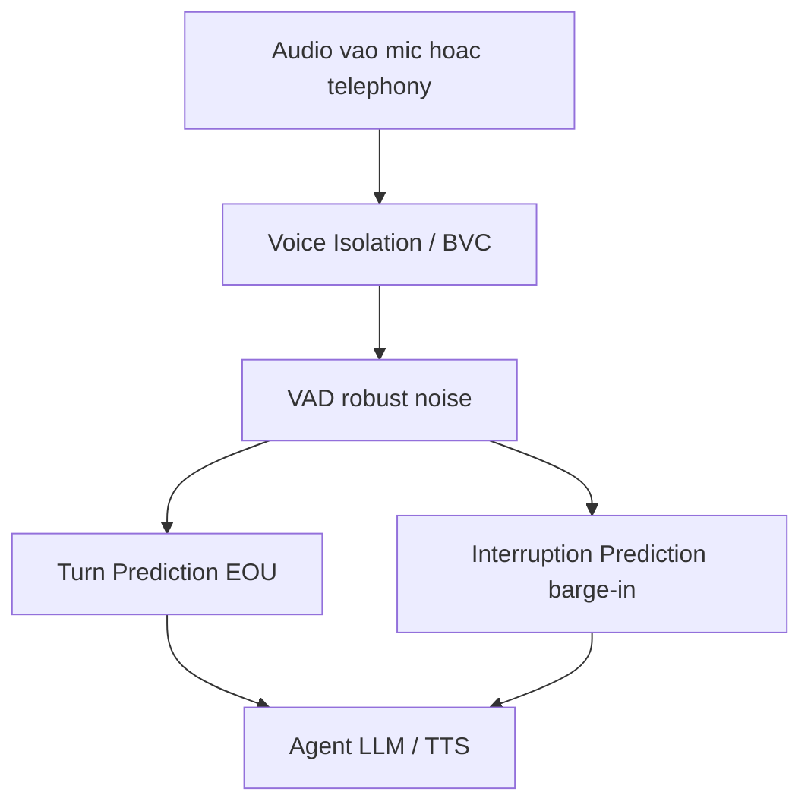

# 03 — Krisp: Bóc Tách Giải Pháp Thương Mại Cho Turn-taking + Barge-in Dưới Nhiễu

> [!NOTE]
> - Tài liệu đơn vị tự đứng vững bóc tách giải pháp thương mại từ nhà cung cấp Krisp (VIVA SDK) phục vụ voice-agent thời gian thực,
> - **trích xuất tập đề bài cốt lõi** và các mốc hiệu năng tham chiếu để đối chiếu với hệ thống FCI.
> - Tham chiếu chi tiết về kiến trúc luồng logic turn-taking xem tại [00_README.md](00_README.md),
> - và taxonomy phân loại chi tiết kịch bản ngắt lời xem tại [01_interrupt_taxonomy.md](01_interrupt_taxonomy.md).

---

## 1. Dẫn dắt bối cảnh

- **Bối cảnh thực tế**:
  - Khi nghiên cứu giải pháp xử lý tiếng ồn và ngắt lời cho các trợ lý thoại thời gian thực trong môi trường telephony,
  - việc tham chiếu các mô hình thương mại đã được chứng minh hiệu năng trên thị trường là vô cùng cần thiết để định vị năng lực hệ thống.
- **Nghịch lý đo lường**:
  - Các nhà phát triển thường cố gắng tích hợp toàn bộ các mô hình lọc âm của các bên cung cấp thương mại mà không đánh giá kỹ lưỡng mô hình tính phí hoặc giới hạn ngôn ngữ,
  - dẫn đến chi phí vận hành thực tế tăng vọt và hệ thống hoạt động kém hiệu quả do mô hình không hỗ trợ tiếng Việt bản địa hoặc không tương thích dải tần kênh thoại.

> Tài liệu này bóc tách giải pháp thương mại của Krisp (VIVA SDK),
> **xác định tập đề bài chất lượng và các mốc số liệu tham chiếu**,
> từ đó đề xuất phương án tích hợp và tối ưu hóa chi phí cho hệ thống FCI.

---

## 2. Glossary

- `VIVA SDK` -> **Voice Infrastructure for Voice AI Agents** ->
  - Dòng thư viện SDK thương mại của Krisp thiết kế riêng cho các ứng dụng trợ lý giọng nói đàm thoại với người dùng.
- `RTC SDK` -> **Real-Time Communication SDK** ->
  - Dòng thư viện SDK của Krisp tối ưu hóa cho cuộc gọi trực tiếp giữa người với người (Contact Center).
- `BVC` -> **Background Voice Cancellation** ->
  - Công nghệ loại bỏ giọng nói của người xung quanh (cross-talk),
  - giữ lại duy nhất giọng nói của người dùng mục tiêu.
- `Voice Isolation` -> **Voice Isolation** ->
  - Bộ tiền xử lý đứng đầu pipeline,
  - thực hiện tách giọng nói chính ra khỏi nhiễu môi trường và giọng nói nền.
- `primary speaker` -> **Primary / Target Speaker** ->
  - Người dùng chính trong cuộc hội thoại cần được hệ thống thu âm và phản hồi.
- `Turn Prediction` -> **Turn Prediction (Turn-Taking model)** ->
  - Mô hình dự đoán điểm kết thúc lượt nói (EOU) trực tiếp từ tín hiệu âm thanh thô.
- `Interruption Prediction` -> **Interruption Prediction** ->
  - Mô hình phân loại tín hiệu chen ngang khi agent đang nói,
  - thực hiện phân biệt giữa ngắt lời giành lượt thật sự và tiếng đệm thụ động.
- `MST` -> **Missed Shift / Mean Shift Time** ->
  - Chỉ số đo lường việc bỏ sót thời điểm chuyển giao lượt thoại giữa người và bot.
- `BVC-tel` / `BVC-app` -> **BVC Telephony / BVC Application** ->
  - Hai biến thể của BVC phân chia theo dải tần:
    - BVC-tel tối ưu cho kênh thoại telephony (tần số lấy mẫu ≤16kHz),
    - BVC-app tối ưu cho ứng dụng chất lượng cao (tần số lấy mẫu ≤32kHz).

---

## 3. Bản đồ Phân phối Sản phẩm của Krisp

- **Dòng sản phẩm VIVA SDK (Dành cho Voice-agent)**:
  - **Voice Isolation v3**: Module đứng đầu chuỗi để loại bỏ nhiễu và tách giọng nói chính.
  - **Turn Prediction v3**: Dự đoán EOU từ âm thanh thô mà không cần kết quả STT.
  - **Interruption Prediction v1**: Phân loại ngắt lời giành lượt hay tiếng đệm backchannel.
  - **VAD robust**: Phát hiện hoạt động giọng nói chống tiếng ồn động và giọng nền.
- **Dòng sản phẩm RTC SDK (Dành cho Contact Center)**:
  - Noise Cancellation (khử nhiễu hai chiều), Background Voice Cancellation, Accent Conversion (chuyển đổi chất giọng), và Voice Translation API.

### 3.1 Sơ đồ pipeline xử lý tiêu chuẩn của VIVA SDK

- **Khung đọc sơ đồ**:
  - **Đề bài cần giải**:
    - Mô tả trình tự xử lý tín hiệu âm thanh qua các module trong cấu trúc VIVA SDK.
  - **Giả định nền**:
    - Hệ thống xử lý thời gian thực,
    - phân tách rõ ràng hai tác vụ Turn Prediction và Interruption Prediction.
  - **Ý nghĩa các khối**:
    - `MIC`: Nguồn nhận tín hiệu âm thanh đầu vào.
    - `ISO`: Tầng tiền xử lý âm học (BVC / Voice Isolation).
    - `VAD`: Bộ phát hiện tiếng nói chống nhiễu.
    - `TT`: Bộ dự đoán EOU.
    - `INT`: Bộ phán đoán ngắt lời barge-in.
    - `AGENT`: Bộ não hội thoại và phát TTS của bot.
  - **Cách đọc sơ đồ**:
    - Luồng dữ liệu đi tuần tự từ trái sang phải.
    - Khối `ISO` được đặt trước mọi module phán đoán lượt lời.
    - Nguyên tắc thiết kế: Làm sạch tín hiệu về đúng giọng nói của người dùng chính trước,
    - giúp nâng cao độ tin cậy cho các mô hình phát hiện lượt lời (`TT`) và ngắt lời (`INT`) ở phía sau.

---

## 4. Các Đề Bài Kỹ Thuật dưới góc nhìn Thương Mại

### 4.1 Voice Isolation / Background Voice Cancellation

- **⚙️ Cơ chế**:
  - Tách giọng nói của người dùng chính (primary speaker) ra khỏi nhiễu môi trường và giọng nói xung quanh (cross-talk),
  - không yêu cầu đăng ký giọng nói trước (no enrollment).
- **🔍 Cách nhận diện**:
  - Khắc phục hiện tượng VAD báo còi giả trong môi trường có nhiều người nói chuyện (babble noise).
- **💡 Ý nghĩa**:
  - Đây là chốt chặn đầu tiên giúp giải quyết bài toán "barge-in dưới nhiễu" trước khi tín hiệu đi vào các module phán đoán lượt lời.

### 4.2 Turn Prediction (Bài toán EOU)

- **⚙️ Cơ chế**:
  - Sử dụng mô hình audio-only xử lý trên các khung thời gian 100ms,
  - tính toán xác suất kết thúc lượt thoại theo từng khung để đưa ra quyết định phản hồi.
- **🔍 Thử thách xử lý**:
  - Phải phân biệt chính xác giữa khoảng ngập ngừng (hesitation/fillers) với điểm kết thúc câu thực tế.
  - Xử lý các khoảng lặng tự nhiên giữa câu của người nói để tránh cướp lời.
- **💡 Giới hạn của VAD**:
  - VAD thông thường chỉ nhận diện sự xuất hiện/biến mất của năng lượng âm thanh, không thể hiểu ý đồ giao tiếp của người nói.

### 4.3 Interruption Prediction (Bài toán Barge-in)

- **⚙️ Cơ chế**:
  - Sử dụng mô hình phân tích âm học thô trên các khung thời gian 40ms,
  - xuất xác suất người dùng thực sự muốn giành lượt nói để quyết định ngắt TTS.
- **🔍 Thử thách xử lý**:
  - Phân biệt tiếng ngắt lời thực sự với các phản hồi đệm thụ động (backchannel).
- **💡 Giới hạn của bộ luật cứng**:
  - Các heuristic dựa trên luật (như ngưỡng thời gian, đếm số từ) dễ bị hỏng trước các biến đổi tự nhiên của giọng nói.

---

## 5. Số Liệu Hiệu Năng công bố của Krisp

- **Voice Isolation / BVC**:
  - Độ trễ thuật toán: **~15ms** (vận hành trên CPU).
  - Tần số lấy mẫu hỗ trợ: BVC-tel (≤16kHz), BVC-app (≤32kHz).
  - Hiệu quả:
    - Giảm **3.5 lần** tỷ lệ kích hoạt sai (false-positive) của VAD nền.
    - Precision của VAD tăng **>25%** sau khi đi qua bộ lọc.
    - Cải thiện chỉ số WER lên tới **>2 lần** khi chạy mô hình Whisper V3 trên dataset AMI.
- **Turn Prediction v3**:
  - Kích thước mô hình: **6.1 triệu tham số** (dung lượng file ~65MB), chạy trên CPU.
  - Hiệu năng benchmark (đối chiếu baseline):

| Model | Balanced Acc | AUC Shift | F1 (Shift) | AUC (MST vs FPR, thấp hơn tốt hơn) |
|---|---|---|---|---|
| **Krisp TT** | **0.82** | **0.89** | **0.80** | **0.21** |
| VAD-based | 0.59 | — | 0.48 | — |
| SmartTurn V1 | 0.78 | 0.86 | 0.73 | 0.39 |
| SmartTurn V2 | 0.78 | 0.83 | 0.76 | 0.44 |

  - Độ trễ phản xạ: **0.9 giây** (so với SmartTurn: 1.3 giây tại cùng mức FPR 0.06).
- **Interruption Prediction v1**:
  - Kích thước mô hình: ~6 triệu tham số, xử lý khung 40ms.
  - Ngôn ngữ: Chỉ hỗ trợ tiếng Anh ở phiên bản v1.
  - Hiệu năng benchmark:
    - Balanced Accuracy đạt **90.6%**.
    - Tỷ lệ FPR đạt **5.9%** (so với baseline VAD thông thường: FPR lên tới 66.3%).
    - Độ trễ ra quyết định ngắt trung bình: **0.833 giây**.

---

## 6. Bài học cho FCI: Ranh giới xử lý Nhiễu và Lượt lời

- **Cơ chế phát sinh lỗi ngắt nhầm**:
  - Nhiễu nền và giọng nói xung quanh đi trực tiếp vào VAD -> VAD kích hoạt sai -> hệ thống quyết định ngắt TTS oan khi khách hàng chưa nói gì.
- **Phương án chặn lỗi**:
  - Áp dụng bộ lọc BVC/Voice Isolation ở ngay đầu pipeline, trước khi dữ liệu đi vào VAD.
  - Việc tối ưu hóa chất lượng barge-in dưới nhiễu **không nằm ở thuật toán turn-detection** mà nằm ở **năng lực lọc giọng nói chính (voice isolation) ở tầng tiền xử lý**.
  - *Tham khảo thêm chi tiết phân tích tại tài liệu [02_turn_models_and_voice_frontend.md](02_turn_models_and_voice_frontend.md).*

---

## 7. Ánh xạ Đề Bài Nghiệp Vụ cho FCI

- **Bản đồ ánh xạ các tác vụ và chỉ số đo lường**:

| # | Đề bài | Module chịu trách nhiệm | Mốc tham chiếu Krisp | Chỉ số FCI cần định nghĩa |
|---|---|---|---|---|
| 1 | Tách target-user khỏi noise + giọng nền | Voice Isolation / BVC | latency ~15ms; FPR VAD giảm 3.5×; WER >2× | tỉ lệ tách đúng target-user dưới acu.babble |
| 2 | Không cần enrollment giọng | Voice Isolation / BVC | no enrollment | đo trên giọng người gọi lạ |
| 3 | EOU không cướp lời, không trễ | Turn Prediction | Balanced Acc 0.82; latency 0.9s @FPR 0.06 | accuracy + latency EOU tiếng Việt |
| 4 | Barge-in: phân biệt ngắt thật vs backchannel | Interruption Prediction | Balanced Acc 90.6%; FPR 5.9%; 0.833s | accuracy barge-in khi tín hiệu đã sạch |
| 5 | VAD kháng noise + giọng phụ | VAD (sau isolation) | precision +>25% sau BVC | precision VAD telephony 8kHz |
| 6 | Hỗ trợ tiếng Việt | (Krisp TT multilingual; Interruption English-only v1) | TT multilingual; barge-in chưa có vi | bắt buộc đo riêng cho vi |

- **Khoảng trống tiếng Việt**:
  - Mô hình Interruption Prediction của Krisp hiện tại chỉ hỗ trợ tiếng Anh (English-only ở v1).
  - Đây là phần FCI bắt buộc phải tự nghiên cứu, thu thập dữ liệu và huấn luyện độc lập cho tiếng Việt.

---

## 8. Phân tích mô hình Chi phí thương mại

- **Cơ chế tính phí VIVA SDK**:
  - Các module (Voice Isolation, Turn Prediction, Interruption, VAD) được đóng gói chung trong giải pháp VIVA, không bán lẻ từng mô hình.
  - Giá VIVA SDK là **quote-based** (phải đàm phán trực tiếp với sales dựa trên lượng phút sử dụng thực tế), không có bảng giá công khai.
- **Mốc giá tham chiếu (Voice Translation API)**:
  - Gói Starter ($249/tháng): 45 giờ sử dụng, chi phí overage đạt $7.00/giờ (quy đổi tương đương **$0.09 - $0.12/phút**).
  - Sử dụng mốc này để ước lượng độ lớn chi phí dịch vụ thương mại của Krisp.

### 8.1 Chiến lược sử dụng dịch vụ tối ưu chi phí cho FCI

- **Chỉ mua module có giá trị cốt lõi**:
  - Chỉ trả tiền cho module **Voice Isolation / BVC** (đây là phần khó tự phát triển nhất và mang lại hiệu quả cao nhất cho bài toán target-speaker dưới nhiễu).
  - Thay thế các module Turn Prediction và VAD bằng các giải pháp mã nguồn mở chất lượng cao (như Smart Turn BSD-2, VAP MIT, Silero VAD).
- **Bật bộ lọc chọn lọc theo kênh**:
  - Chỉ kích hoạt module Voice Isolation cho các cuộc gọi có chỉ số nhiễu đo được vượt ngưỡng,
  - tránh bật đại trà để giảm tối đa chi phí phút tính tiền.
- **Lựa chọn mô hình bản quyền flat (On-premise)**:
  - Do VIVA chạy trực tiếp trên CPU của server, FCI nên đàm phán mô hình trả tiền theo instance/flat rate thay vì trả theo phút cloud để tối ưu chi phí khi vận hành quy mô lớn.

---

## ✅ Tự kiểm nhanh

1. Tại sao Krisp bắt buộc phải đặt module Voice Isolation / BVC trước mô hình VAD và Turn Prediction?

- **Ngăn chặn lỗi từ nguồn**:
  - Nếu không lọc, nhiễu nền và giọng nói xung quanh sẽ đi trực tiếp vào VAD làm VAD kích hoạt sai (false-positive).
  - Việc làm sạch và cô lập chính xác giọng của khách hàng chính ở đầu pipeline,
  - giúp các mô hình phán đoán lượt lời phía sau có được dữ liệu đầu vào sạch, nâng cao độ chính xác tổng thể.

2. Điểm hạn chế lớn nhất của VIVA SDK đối với nghiệp vụ tổng đài tiếng Việt của FCI là gì?

- **Khoảng trống ngôn ngữ**:
  - Mô hình Interruption Prediction của Krisp (phân biệt ngắt lời thật và backchannel) chỉ hỗ trợ tiếng Anh ở phiên bản v1.
  - Do đó, FCI không thể mua sẵn giải pháp này,
  - bắt buộc phải tự xây dựng bộ kịch bản và huấn luyện mô hình phân loại riêng cho tiếng Việt.

3. Phương án tối ưu hóa chi phí được đề xuất cho FCI khi tích hợp giải pháp thương mại là gì?

- **Tích hợp lai (Hybrid integration)**:
  - Chỉ mua và sử dụng module Voice Isolation / BVC của bên thương mại để giải quyết bài toán khó nhất là target-speaker dưới nhiễu.
  - Sử dụng các giải pháp mã nguồn mở miễn phí (như Smart Turn, Silero VAD) để xử lý tác vụ turn-taking và phát hiện tiếng nói,
  - kết hợp kích hoạt chọn lọc theo kênh và đàm phán license flat để giảm thiểu tối đa chi phí vận hành.

