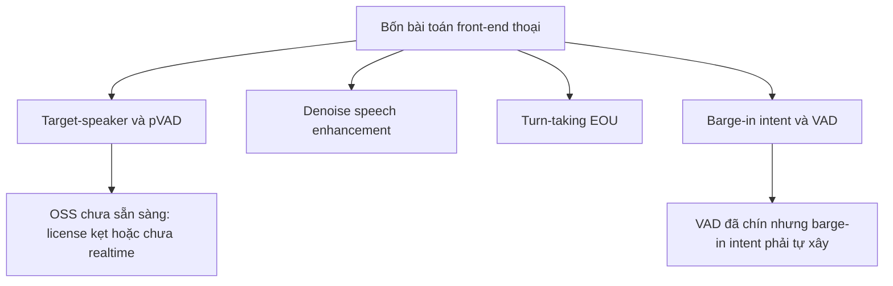

# 04 — Open-source Cho Front-end Thoại: Bản Đồ Build-vs-Buy

> [!NOTE]
> - Tài liệu đơn vị tự đứng vững đối chiếu các giải pháp xử lý tín hiệu thoại front-end mã nguồn mở (OSS),
> - **thiết lập bản đồ quyết định tự xây dựng (build) hay mua ngoài (buy)** dựa trên các tiêu chí ràng buộc về bản quyền, tần số telephony và ngôn ngữ tiếng Việt.
> - Tham chiếu phân tích giải pháp thương mại Krisp xem tại [03_krisp_commercial_reference.md](03_krisp_commercial_reference.md),
> - và đào sâu kiến trúc các mô hình turn-detection xem tại [02_turn_models_and_voice_frontend.md](02_turn_models_and_voice_frontend.md).

---

## 1. Dẫn dắt bối cảnh

- **Bối cảnh thực tế**:
  - Khi thiết kế hệ thống xử lý tín hiệu thoại (front-end) cho voice-agent FCI,
  - việc lựa chọn giữa tự xây dựng dựa trên mã nguồn mở (build) hay mua các giải pháp thương mại đóng gói (buy) là quyết định ảnh hưởng trực tiếp đến chi phí hạ tầng và giấy phép sử dụng.
- **Nghịch lý đo lường**:
  - Các kỹ sư thường cho rằng các mô hình mã nguồn mở có thể thay thế hoàn toàn giải pháp thương mại mà không đánh giá kỹ các rào cản về bản quyền thương mại (license) và sự suy giảm chất lượng khi hoạt động ở dải tần thoại 8kHz tiếng Việt,
  - dẫn đến các rủi ro pháp lý nghiêm trọng khi đưa sản phẩm ra thị trường hoặc làm bot hoạt động kém hiệu quả do tiếng ồn xé nát tín hiệu.

> Tài liệu này sẽ đối chiếu các dự án mã nguồn mở hiện nay trên bốn bài toán front-end cốt lõi,
> **định hình bản đồ quyết định Build-vs-Buy tối ưu cho hệ thống FCI**,
> giúp kiểm soát chi phí bản quyền và hạ tầng vận hành.

---

## 2. Glossary

- `TSE` -> **Target-Speaker Extraction** ->
  - Thuật toán cô lập giọng nói chính,
  - thực hiện tách giọng nói của người dùng mục tiêu ra khỏi hỗn hợp nhiều giọng nói nền.
- `pVAD` -> **Personalized / Target-Speaker VAD** ->
  - Bộ phát hiện hoạt động giọng nói cá nhân hóa,
  - chỉ kích hoạt khi phát hiện đúng giọng nói của người dùng mục tiêu.
- `SE` -> **Speech Enhancement** ->
  - Thuật toán tăng cường tiếng nói,
  - thực hiện khử nhiễu, khử vang để nâng cao chất lượng tín hiệu âm thanh.
- `EOU` -> **End-of-Utterance** ->
  - Mốc thời gian đánh giá điểm kết thúc phát ngôn của người dùng.
- `enrollment` -> **Voice Enrollment** ->
  - Quá trình đăng ký và phân tích giọng nói mẫu của người dùng chính,
  - giúp mô hình nhận diện giọng nói cần cô lập.
- `causal / streaming` -> **Causal / Streaming model** ->
  - Mô hình xử lý thời gian thực,
  - chỉ sử dụng dữ liệu âm thanh trong quá khứ kết hợp khoảng trễ nhìn trước (lookahead) siêu ngắn.
- `RTF` -> **Real-Time Factor** ->
  - Tỷ lệ giữa thời gian xử lý âm thanh chia cho thời lượng thực tế của chính đoạn âm thanh đó.
- `copyleft` -> **Copyleft License (như GPL)** ->
  - Giấy phép mã nguồn mở bắt buộc các sản phẩm phái sinh sử dụng nó phải mở mã nguồn tương tự khi phân phối.
- `NC` -> **Non-Commercial License** ->
  - Giấy phép mã nguồn mở cấm sử dụng cho các mục đích thương mại sinh lời.

---

## 3. Bản đồ Bốn Bài Toán Front-end và Trạng thái Mã nguồn mở

### 3.1 Sơ đồ phân phối giải pháp mã nguồn mở

- **Khung đọc sơ đồ**:
  - **Đề bài cần giải**:
    - Xác định mức độ sẵn sàng và tính khả thi của các dự án mã nguồn mở đối với bốn bài toán xử lý tín hiệu.
  - **Giả định nền**:
    - Hệ thống yêu cầu giấy phép sạch dùng được trong thương mại và khả năng chạy thời gian thực trên CPU.
  - **Ý nghĩa các khối**:
    - `PROB`: Bốn bài toán front-end cần giải quyết trước khi đưa dữ liệu vào LLM.
    - `P1`/`P2`/`P3`/`P4`: Các module xử lý tín hiệu tương ứng.
    - `V1`: Khẳng định trạng thái chưa sẵn sàng của mã nguồn mở đối với tác vụ cô lập giọng nói chính.
    - `V2`: Trạng thái sẵn sàng của VAD nền nhưng khuyết thiếu bộ phán đoán ý định ngắt lời.
  - **Cách đọc sơ đồ**:
    - Sơ đồ phân nhánh từ trung tâm `PROB` sang bốn tác vụ.
    - Nhánh `P1` dẫn đến `V1` cho thấy đây là điểm yếu lớn nhất của mã nguồn mở, củng cố quyết định nên mua hoặc tự huấn luyện riêng.
    - Nhánh `P4` dẫn đến `V2` chỉ rõ ranh giới: có thể dùng mã nguồn mở cho VAD và phải tự phát triển logic phân loại ý định ngắt lời.

---

## 4. Bài toán 1 — Cô lập giọng nói chính (Target-speaker / pVAD)

- **⚙️ Cơ chế hoạt động**:
  - Tách giọng nói của người dùng chính (target speaker) ra khỏi tiếng ồn đám đông (babble noise) và tiếng người xung quanh nói chèn vào.
- **🔍 Nhận diện hiện trạng mã nguồn mở**:
  - Bản quyền (License) là rào cản lớn nhất đối với các dự án cô lập giọng nói hiện nay.
  - Dưới đây là bảng đối chiếu chi tiết các dự án:

| Dự án | License | 8kHz | Realtime CPU | Pretrained | Ghi chú |
| :--- | :--- | :--- | :--- | :--- | :--- |
| **ClearerVoice-Studio** | Apache-2.0 | separation 8k/16k | chưa rõ (MossFormer offline) | Có | Sạch nhất + có weights; phải tự đo latency |
| **LookOnceToHear** (UW) | **Non-commercial** | chưa rõ | **Có (~12ms embedded CPU)** | Có | Kiến trúc causal TF-GridNet tốt nhất — chỉ để học, cấm thương mại |
| **VoiceFilter-Lite** (Google) | không có code | — | thiết kế cho on-device | Không | **Blueprint nên đọc** (2.2MB, streaming, asymmetric loss); phải tự implement |
| **USEF-TSE** | **CC-BY-NC** | chưa rõ | offline | Có | Ý tưởng embedding-free hay; NC |
| **WeSep** | **không có LICENSE** | có recipe | có thư mục runtime | chưa có | Kiến trúc đúng hướng; kẹt bản quyền + chưa weights |
| **SpeakerBeam** (BUT) | **evaluation-only** | recipe 8k | offline | Không | Baseline kinh điển; cấm dùng thật |
| **SpEx / SpEx+** | GPL-3.0 (copyleft) | — | offline | hạn chế | Baseline; copyleft rủi ro sản phẩm đóng |
| **maum-ai/voicefilter** | Apache-2.0 | — | offline | yếu | License tốt nhưng chất lượng dưới paper, bỏ maintain |
| **pirxus/personalVAD** | GPL-3.0 | — | — | Không | pVAD; chỉ là đồ án, để học cách dựng |

- **💡 Kết luận**:
  - Hiện tại **không có dự án mã nguồn mở nào** đáp ứng đồng thời cả ba tiêu chí: giấy phép thương mại sạch, mô hình huấn luyện sẵn, và khả năng chạy thời gian thực trên CPU.
  - Hướng đi khuyến nghị: Mua giải pháp thương mại của Krisp (Voice Isolation) hoặc tự lập trình và huấn luyện mô hình dựa trên thiết kế **VoiceFilter-Lite** trên tập dữ liệu tiếng Việt.

---

## 5. Bài toán 2 — Khử nhiễu tăng cường tiếng nói (Speech Enhancement)

- **⚙️ Cơ chế hoạt động**:
  - Áp dụng các thuật toán làm sạch tín hiệu âm thanh thô để cải thiện chất lượng nghe.
- **🔍 Nhận diện các dự án mã nguồn mở**:
  - Hầu hết các dự án khử nhiễu đều có giấy phép mở thoải mái, tuy nhiên không có mô hình nào chạy native ở tần số 8kHz (đều dùng 16kHz hoặc 48kHz và cần resample).
  - Bảng so sánh chi tiết các dự án khử nhiễu:

| Dự án | License | Params | Sample rate | Latency / RTF (tự công bố) | Ghi chú |
| :--- | :--- | :--- | :--- | :--- | :--- |
| **RNNoise** | BSD-3 | ~85kB | 48k (robust băng hẹp) | ~10ms lookahead, ~60× realtime CPU | Siêu nhẹ, đã dùng WebRTC/Mumble; cần resample |
| **GTCRN** | MIT (code) | ~48K | 16k | RTF ~0.07 CPU | Siêu nhẹ, có ONNX/streaming + sherpa-onnx |
| **DeepFilterNet2/3** | MIT/Apache | 2.31M | 48k | 40ms, RTF 0.04–0.19 | Engine Rust, nổi tiếng; 48k-only |
| **DTLN** | MIT | <1M | 16k | 32ms, <1ms/block CPU | Streaming, TFLite nhẹ; ít maintain từ 2020 |
| **FullSubNet** | MIT | 5.6M | 16k | 32ms, RTF ~0.32 | LSTM, CPU dư headroom |
| **FullSubNet+** | Apache-2.0 | 8.67M | 16k | 32ms, RTF ~0.57 | Chất lượng hơn base, tốn ~80% CPU hơn |
| **ClearerVoice FRCRN** | Apache-2.0 | ~10M | 16k | ~30ms (paper gốc) | Ứng viên streaming khả dĩ; phải tự viết glue |
| **DNS NSNet2** (Microsoft) | CC-BY-4.0 | ~1-2M | 16k/48k | ~20ms | ~10MB ONNX, causal, CPU RTF ~0.02 | Baseline chuẩn ngành, onnxruntime CPU; cần attribution |

- **⚠️ Cạm bẫy - Sự suy giảm chất lượng nhận diện (WER)**:
  - Các mô hình khử nhiễu (SE) được tối ưu hóa cho chất lượng nghe của tai người (PESQ), không tối ưu hóa cho bộ nhận dạng tiếng nói (STT).
  - Các nghiên cứu thực nghiệm chỉ ra việc lọc quá mạnh tạo ra biến dạng âm thanh làm tăng tỷ lệ lỗi chữ nhận diện (WER từ 8.82% vọt lên 25.83% dưới nhiễu 10dB).
  - Khuyến nghị thiết kế: **Chỉ áp dụng bộ khử nhiễu cho nhánh VAD và phát hiện lượt lời**, giữ nguyên âm thanh gốc hoặc chỉ khử nhẹ cho nhánh STT.

---

## 6. Bài toán 3 — Phát hiện kết thúc lượt nói (Turn-taking / EOU)

- **⚙️ Cơ chế hoạt động**:
  - Phán đoán xem người dùng đã kết thúc lượt nói hay chưa trực tiếp từ ngữ điệu hoặc văn bản dịch chữ.
- **🔍 Nhận diện các dự án mã nguồn mở**:
  - Dưới đây là bảng đối chiếu các dự án turn-detection:

| Dự án | License | Kiến trúc | Realtime CPU | Tiếng Việt | Ghi chú |
| :--- | :--- | :--- | :--- | :--- | :--- |
| **Smart Turn v3** (Pipecat) | **BSD-2** | Whisper-tiny encoder, ~8M, audio-only | **Có (~12ms)** | **Có (~81% tự công bố)** | Sạch nhất; mở cả weights + training data → fine-tune VI hợp pháp |
| **VAP** (+ VAP-Realtime) | code MIT, **weights academic-only** | CPC + transformer, audio-only | Có (tự công bố) | Không | Mô hình hóa cả backchannel; weights kẹt license, repo sắp archive |
| **LiveKit turn-detector** | code Apache, **weights khóa framework** | audio v1 (semantic+acoustic) / text Qwen2.5-0.5B | v1-mini có | Không | Weights không bê ra pipeline tự xây được |
| **TEN turn-detection** | Apache **+ ràng buộc bổ sung** | Qwen2.5-7B, text-based | **Không (cần GPU)** | Không | Nặng, đắt; phải đọc kỹ LICENSE |
| **Easy-Turn** (ASLP) | Apache-2.0 | bimodal audio+text | GPU (~263ms) | Không (ZH+EN) | Phân loại 4 trạng thái gồm backchannel; **mở trainset 1145h** |
| **UltraVAD** (Fixie) | cần xác minh | audio-native + ngữ cảnh | GPU? | chưa rõ | Hướng audio-LLM nuốt audio trực tiếp; mới mở weights 2025 |
| **turnsense** | Apache-2.0 | text (SmolLM2-135M) | CPU (Pi) | Không | Siêu nhẹ nhưng train chỉ 2k mẫu → dè chừng |
| **Namo Turn Detector v1** | (cần xác minh) | multilingual | — | **Có** | Đáng tham khảo riêng vì có VI |

- **💡 Kết luận**:
  - **Smart Turn v3** là lựa chọn tối ưu nhất nhờ giấy phép mở BSD-2-Clause, cấu trúc siêu nhẹ và có sẵn baseline tiếng Việt. Không cần mua giải pháp thương mại.

---

## 7. Bài toán 4 — Nhận diện ngắt lời (Barge-in intent) & VAD

- **⚙️ Phân tách hiện trạng**:
  - **Phân khúc VAD (Đã hoàn thiện hoàn toàn)**:
    - Silero VAD đóng vai trò là giải pháp mặc định nhờ kích thước nhỏ (~1MB) và tốc độ cực nhanh trên CPU.
    - Dưới đây là bảng so sánh các giải pháp VAD:

| Dự án | License | 8kHz | Ghi chú |
| :--- | :--- | :--- | :--- |
| **Silero VAD** | MIT | **Có (8k+16k)** | Lựa chọn mặc định; ~1-2MB, CPU <1ms/chunk |
| **WebRTC VAD** | BSD | **Có** | Cực nhẹ nhưng kém kháng nhiễu → chỉ làm fallback |
| **NeMo MarbleNet** | Apache code / CC-BY weights | **Có bản telephony** | ~91.5K params; kéo theo dependency NeMo nặng |
| **pyannote** | MIT (gated) | — | Giá trị ở **overlap detection** làm feature cho barge-in |

  - **Phân khúc Phán đoán ý định ngắt lời (Khoảng trống lớn)**:
    - Các dự án mã nguồn mở hiện tại chỉ giải quyết bài toán phát hiện điểm dừng câu (EOU), không hỗ trợ phân biệt tiếng đệm backchannel và ngắt lời giành lượt thật.
    - Các giải pháp thương mại đáp ứng được yêu cầu (Krisp, LiveKit Adaptive) đều đóng mã nguồn, và bản Krisp v1 hiện cũng chỉ hỗ trợ tiếng Anh.
- **💡 Kết luận**:
  - Sử dụng Silero VAD cho bộ phát hiện tiếng nói.
  - Logic phân loại ý định ngắt lời **bắt buộc phải tự phát triển** bằng cách kết hợp tín hiệu VAD, các đặc trưng chồng lấn âm thanh (overlap detection từ pyannote) và một bộ phân loại nhỏ tự huấn luyện trên dữ liệu tiếng Việt.

---

## 8. Khuyến nghị Kế hoạch Build-vs-Buy cho FCI

- **Bản đồ quyết định xây dựng hay mua ngoài cho từng thành phần**:

| Module | Phương án | Lý do |
| :--- | :--- | :--- |
| **VAD** | **Dùng OSS** — Silero (MIT, 8kHz) | Đã chín, license sạch, không cần mua |
| **Turn-taking / EOU** | **Dùng OSS** — Smart Turn v3 (BSD-2) + fine-tune VI | Có baseline VI 81%, mở training data, CPU |
| **Denoise / SE** | **OSS tùy chọn + A/B test**, hoặc bỏ | Rủi ro tăng WER; chọn RNNoise/GTCRN khử nhẹ nếu A/B test có lợi |
| **Target-speaker (chốt chặn)** | **Mua Krisp** hoặc **tự xây** theo VoiceFilter-Lite | OSS chưa sẵn sàng (license/realtime); đây là phần đáng trả tiền nhất |
| **Barge-in intent** | **Tự xây** (VAD + overlap + classifier, VAP làm tham khảo) | Không có OSS chín; Krisp v1 chưa có VI |

- **Hai phần đáng cân nhắc mua Krisp**: target-speaker/Voice Isolation (OSS yếu) và bộ barge-in (OSS chưa chín) — nhưng barge-in Krisp còn English-only nên với tiếng Việt vẫn phải tự xây/đo.
- **Ba phần nên dùng OSS ngay**: VAD, EOU, denoise (tùy chọn) — license sạch, đủ chín, tiết kiệm chi phí.

---

## ✅ Tự kiểm nhanh

1. Tại sao các mô hình khử nhiễu mã nguồn mở (Speech Enhancement) rất sẵn có nhưng lại ít khi được đặt ngay trước bộ nhận diện giọng nói (STT)?

- **Rủi ro làm tăng tỷ lệ lỗi chữ nhận diện (WER)**:
  - Các mô hình SE được tối ưu để âm thanh dễ nghe hơn với tai người,
  - tuy nhiên quá trình lọc mạnh thường làm méo tín hiệu âm học và cắt cụt tần số cao của giọng nói.
  - Điều này làm tăng tỷ lệ WER của STT ở hạ nguồn,
  - do đó cần tiến hành A/B test cẩn thận trước khi tích hợp.

2. Dự án mã nguồn mở nào được khuyến nghị để giải quyết bài toán phát hiện hết lượt lời (EOU) cho FCI?

- **Lựa chọn tối ưu**:
  - Dự án **Smart Turn v3** của Pipecat.
  - Đạt tiêu chuẩn nhờ giấy phép mở BSD-2-Clause, kiến trúc siêu nhẹ chạy tốt trên CPU,
  - hỗ trợ sẵn tiếng Việt và cung cấp toàn bộ tập dữ liệu huấn luyện để tự hiệu chuẩn.

3. Điểm nghẽn lớn nhất trong việc ứng dụng các dự án mã nguồn mở cho bài toán Barge-in dưới nhiễu của FCI là gì?

- **Sự thiếu hụt của module cô lập giọng nói và phân loại ý định**:
  - Không có dự án mã nguồn mở nào cung cấp mô hình cô lập giọng nói chính (Target-Speaker Extraction) chạy thời gian thực trên CPU với giấy phép thương mại sạch.
  - Đồng thời, các bộ phán đoán ngắt lời mã nguồn mở chỉ giải quyết EOU,
  - bắt buộc FCI phải tự xây dựng bộ phân loại ý định ngắt lời (giành lượt nói hay tiếng đệm backchannel) cho tiếng Việt.

