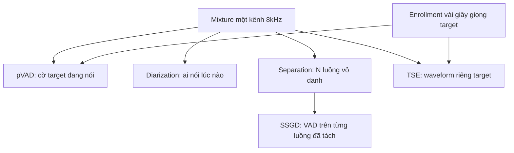

# 05 — Target-Speaker Isolation: Bóc Tách Giọng Chính Của User Trong Kênh Thoại 8kHz

> [!NOTE]
> - Tài liệu đơn vị tự đứng vững đào sâu bài toán bóc tách giọng chính của user (target-speaker isolation) cho voice-bot tổng đài tiếng Việt 8kHz,
> - **thiết lập thang giải pháp từ rule-based đến learnable** và bài toán enrollment đặc thù call-center.
> - Ranh giới ba lớp model xem tại [02_turn_models_and_voice_frontend.md](02_turn_models_and_voice_frontend.md), số liệu thương mại Krisp BVC xem tại [03_krisp_commercial_reference.md](03_krisp_commercial_reference.md),
> - bảng license mã nguồn mở cho TSE/pVAD xem tại [04_opensource_build_vs_buy.md](04_opensource_build_vs_buy.md) (mục 4),
> - taxonomy nhiễu xem tại [../03_audio_frontend/00_README.md](../03_audio_frontend/00_README.md), luận điểm denoise-vs-robust-ASR xem tại [../04_asr_telephony/00_README.md](../04_asr_telephony/00_README.md) (mục 5).

---

## 1. Dẫn dắt bối cảnh

- **Bối cảnh thực tế**:
  - Voice-bot tổng đài gọi tới máy cá nhân của khách hàng, người nghe thường đang ở nhà hoặc nơi làm việc,
  - kênh inbound duy nhất vì vậy chứa lẫn giọng target với tiếng TV, tiếng người nhà nói chuyện, và cả tình huống người thứ ba cầm máy trả lời hộ.
- **Nghịch lý của khử nhiễu**:
  - Bộ denoise mạnh đến đâu cũng không giải quyết được giọng người nền, vì giọng nền là speech thật — cùng dải phổ, cùng prosody với giọng target (`acu.babble` trong taxonomy nhiễu);
  - bài toán vì vậy đổi chất: từ "có tiếng nói hay không" (việc của VAD) sang "tiếng nói này có phải của đúng MỘT người không" (bài toán speaker);
  - riêng nghiệp vụ thu hồi nợ còn có chiều ngược: người thứ ba nói hộ (vợ/chồng con nợ) là tín hiệu nghiệp vụ cần phát hiện và báo lên, không phải rác cần lọc bỏ.

> Tài liệu này định nghĩa chùm bài toán con của target-speaker isolation và ranh giới giữa chúng,
> **dựng thang giải pháp từ rule-based đến learnable kèm số liệu đo trên 8kHz**,
> và phân tích bài toán enrollment đặc thù call-center cùng các van an toàn cho tầng downstream.

---

## 2. Glossary

- `target-speaker isolation` -> **Target-Speaker Isolation** -> giữ lại đúng giọng người dùng chính, loại giọng người khác và nhiễu nền khỏi luồng audio.
- `enrollment` -> **Enrollment** -> đoạn audio mẫu của target speaker dùng làm reference để model biết cần giữ giọng nào.
- `speaker embedding` -> **Speaker Embedding** -> vector đặc trưng giọng nói (d-vector / x-vector / ECAPA-TDNN), đầu vào điều kiện cho pVAD và TSE.
- `pVAD` -> **Personal VAD** -> VAD chỉ kích hoạt khi đúng giọng target đang nói; output là cờ, không phải audio.
- `TS-VAD` -> **Target-Speaker VAD** -> dự đoán khung thời gian hoạt động của TỪNG speaker đã biết profile, gốc từ bài toán diarization.
- `TSE` -> **Target-Speech Extraction** -> tách ra waveform (hoặc feature) sạch của riêng target speaker từ mixture nhiều giọng.
- `BSS` -> **Blind Source Separation** -> tách mixture thành N luồng speaker mà không biết trước ai là ai (Conv-TasNet, SepFormer...).
- `SSGD` -> **Separation-Guided Diarization** -> tách nguồn trước rồi chạy VAD trên từng luồng đã tách.
- `over-suppression` -> **Over-suppression** -> model lọc quá tay, cắt bỏ nhầm giọng target khiến downstream tưởng user im lặng.
- `target confusion` -> **Target Confusion** -> lỗi TSE bám nhầm giọng người khác thay vì target.
- `SI-SDR(i)` / `DER` / `EER` -> **Signal-to-Distortion Ratio (improvement) / Diarization Error Rate / Equal Error Rate** -> metric tách nguồn, lỗi diarization, lỗi speaker verification.
- `OA` -> **Observation Addition** -> trộn lại một phần tín hiệu thô vào tín hiệu đã lọc để giảm artifact trước khi vào ASR.

---

## 3. Chùm bài toán con — ranh giới và quan hệ

- **Bảng ranh giới trách nhiệm**:

| Bài toán | Câu hỏi trả lời | Output | Cần enrollment? | Có làm sạch audio? |
| :--- | :--- | :--- | :--- | :--- |
| **pVAD** | Target có đang nói ở frame này không | Cờ 3 lớp: non-speech / target / non-target | Có (biến thể enrollment-less tồn tại) | Không |
| **TS-VAD / diarization** | Ai nói lúc nào | Nhãn thời gian theo từng speaker | TS-VAD cần profile; diarization thường không | Không |
| **BSS / separation** | Trong mixture có những giọng nào | N waveform vô danh | Không | Có, nhưng chưa biết luồng nào là target |
| **TSE** | Giữ lại đúng giọng target | 1 waveform hoặc feature của target | Có | Có |
| **SSGD** | Tách trước rồi mới hỏi ai nói lúc nào | Luồng đã tách + nhãn VAD từng luồng | Không | Có |

### 3.1 Sơ đồ quan hệ giữa các bài toán con

- **Khung đọc sơ đồ**:
  - **Đề bài cần giải**: định vị bốn bài toán con cùng nhận một mixture đơn kênh nhưng trả lời bốn câu hỏi khác nhau.
  - **Giả định nền**: tín hiệu vào là luồng inbound telephony 8kHz một kênh, trong đó có thể lẫn nhiều giọng nói.
  - **Ý nghĩa các khối**:
    - `MIX`: mixture đầu vào chung; `ENR`: enrollment — tín hiệu điều kiện, chỉ nuôi hai nhánh speaker-aware.
    - `PVAD` / `DIA`: hai nhánh chỉ trả về CỜ hoặc nhãn thời gian, không đụng vào audio.
    - `BSS` / `TSE`: hai nhánh trả về audio đã tách; `SSGD`: cầu nối đóng gói `BSS` thành nhãn diarization dùng được cho telephony.
  - **Cách đọc sơ đồ**:
    - Nhánh càng đi sâu về phía tách audio càng đắt và càng rủi ro (artifact, target confusion);
    - hai nhánh cờ (`PVAD`, `DIA`) rẻ hơn và miễn nhiễm rủi ro làm méo audio vào ASR — gợi ý thiết kế quan trọng ở mục 6.

---

## 4. Thang giải pháp: rule-based → learnable

Nguyên tắc đọc thang: mỗi nấc tăng chi phí (tính toán + data + vận hành) đổi lấy khả năng phân biệt "giọng target vs giọng khác" tốt hơn; nấc thấp chỉ phân biệt được "có tiếng vs không tiếng".

### 4.1 Nấc 0 — Tách kênh telephony (rule-based, gần như miễn phí)

- **Cơ chế**: kênh SIP/PSTN vốn mono theo leg — luồng inbound chỉ chứa âm thanh phía user, TTS của bot nằm ở luồng outbound riêng.
- **Ý nghĩa**: giọng của chính bot đã bị loại ở mức kiến trúc; chỉ còn echo âm học khi user bật loa ngoài → xử lý bằng AEC với reference là chính TTS đang phát.
- **Ghi âm offline**: dual-channel recording tách agent/customer là chuẩn ngành ("perfect separation with no diarization overhead") ✅ tài liệu Deepgram https://developers.deepgram.com/docs/multichannel-vs-diarization
- **Giới hạn cứng**: người nói nền (người nhà, TV, đồng nghiệp) nằm CÙNG kênh inbound với target → tách kênh không chạm tới được, đây mới là đề bài của tài liệu này.

### 4.2 Nấc 1 — Energy gating / spectral gating (rule-based DSP)

- **Energy gating**: ngưỡng năng lượng RMS, giả định ngầm "target nói to hơn nền vì gần mic hơn";
  - harness turn-detection của FCI đã đo energy-VAD đạt 65% (số đo nội bộ, đã verify) → baseline sàn; sụp khi người nền nói to ngang target hoặc target nói nhỏ.
- **Spectral gating (noisereduce)**: ước lượng phổ nhiễu từ đoạn lặng rồi trừ phổ ✅ https://github.com/timsainb/noisereduce ;
  - chỉ hạ được nhiễu tĩnh (`acu.device`); với `acu.babble` gần như vô dụng (`../03_audio_frontend/00_README.md` mục 4.1) — vị trí đúng là tiền xử lý rẻ cho nhánh EDA.
- **Kết luận nấc 1**: cả hai chỉ trả lời "có tiếng hay không", không trả lời "có phải target không".

### 4.3 Nấc 2 — VAD thường (learnable nhưng speaker-agnostic)

- **Silero VAD** (MIT, 8kHz native, <1ms/chunk CPU) đã chốt là mặc định tại [04_opensource_build_vs_buy.md](04_opensource_build_vs_buy.md) mục 7 — không nhắc lại.
- **Điểm cần nhấn**: VAD thường về nguyên lý KHÔNG THỂ giải bài background speaker — giọng nền là speech thật, VAD báo speech là đúng chức năng thiết kế;
  - số Krisp "VAD FPR giảm 3.5 lần sau BVC" (file `03`) chính là bằng chứng lỗi nằm ngoài phạm vi VAD.

### 4.4 Nấc 3 — Personal VAD / VoiceFilter-Lite (speaker-aware, output là cờ hoặc feature)

- **Personal VAD (Google 2019)**: VAD điều kiện theo speaker embedding, 3 lớp output, model ~130KB ✅ https://google.github.io/speaker-id/publications/PersonalVAD/
- **Personal VAD 2.0 (Interspeech 2022)**: tối ưu streaming on-device, hỗ trợ CẢ hai chế độ có enrollment và không enrollment trong cùng model ✅ https://arxiv.org/abs/2204.03793 —
  - điểm đáng học nhất cho FCI: model chạy được ngay cả khi CHƯA có voiceprint, đúng tình huống đầu cuộc gọi tổng đài.
- **VoiceFilter-Lite (Interspeech 2020)**: TSE dạng feature-domain (lọc trên filterbank cho ASR, không tái tạo waveform), 2.2MB, streaming frame-by-frame ✅ https://arxiv.org/abs/2009.04323 ;
  - cải thiện WER tương đối 47.3% dưới nhiễu speech chồng lấn, không làm tăng WER trên audio sạch ✅ (paper trên);
  - không có code chính thức (đã ghi ở file `04`) — giá trị là blueprint kiến trúc, không phải đồ dùng ngay.
- **Chi phí nấc 3**: cần embedding model + data mixture để train; bù lại inference rất rẻ (KB–MB), phù hợp CPU realtime.

### 4.5 Nấc 4 — TS-VAD / SSGD / online diarization (biết "ai nói lúc nào", không tách audio)

- **TS-VAD gốc (Interspeech 2020, CHiME-6)**: thắng baseline x-vector clustering hơn 30% DER absolute ✅ https://arxiv.org/abs/2005.07272 ; biến thể PET-TSVAD chịu được profile lỗi, DER 27.94% → 25.88% trên DIHARD-I ⚠️ https://arxiv.org/abs/2309.12521
- **SSGD — hướng đáng bám nhất cho telephony**: phát triển và đo trực tiếp trên Fisher/CALLHOME (điện thoại 8kHz thật):
  - bản online DPRNN đạt DER 11.1% trên CALLHOME với latency 0.1s ✅ https://arxiv.org/abs/2204.02306 ;
  - bản end-to-end đạt DER 8.8% CALLHOME, tín hiệu đã tách "feed thẳng vào ASR với hiệu năng gần oracle" ✅ https://arxiv.org/abs/2303.12002 — một mũi tên trúng hai đích: diarization + audio sạch cho ASR.
- **Online diarization framework**: diart được đánh giá tốt trong khảo sát latency ⚠️ https://arxiv.org/abs/2407.04293 ; NeMo Streaming Sortformer giữ DER cạnh tranh với chunk 0.32s ⚠️ https://arxiv.org/abs/2507.18446 ; pyannote community-1 (model card mở) ✅ https://huggingface.co/pyannote/speaker-diarization-community-1
- **Vai trò trong pipeline FCI**: nấc này KHÔNG làm sạch audio; giá trị là cờ "frame này không phải target" → làm gate cho barge-in và làm nhãn cắt segment đưa vào ASR.

### 4.6 Nấc 5 — Blind speech separation (tách hết mọi speaker, chưa biết ai là target)

- **Số liệu chuẩn trên WSJ0-2mix — lưu ý đáng giá**: bản chuẩn của benchmark là 8kHz, tức các số dưới đây đo đúng sample rate telephony:
  - Conv-TasNet: 5.1M tham số, SI-SNRi 15.3 dB ✅ ; SepFormer: SI-SNRi 22.3 dB ✅ https://arxiv.org/pdf/2010.13154 , checkpoint 8kHz public ✅ https://huggingface.co/speechbrain/sepformer-wsj02mix ;
  - MossFormer2: 55.7M tham số, SI-SDRi 24.1 dB ✅ https://arxiv.org/abs/2312.11825 — có trong ClearerVoice-Studio (Apache-2.0, đã ghi ở file `04`).
- **Vấn đề với voice-bot**: output là N luồng vô danh → vẫn phải giải "luồng nào là target" (speaker counting sai, permutation đổi luồng giữa chừng); SSGD (nấc 4) chính là cách đóng gói BSS thành dạng dùng được cho telephony 2 speaker.
- **Chi phí**: SepFormer/MossFormer2 là model offline non-causal, RTF CPU streaming chưa có số công bố ❓ — vị trí đúng là xử lý offline (phân tích sau cuộc gọi, data pipeline), không phải trong vòng lặp thoại.

### 4.7 Nấc 6 — Target-speech extraction (đỉnh thang: tách đúng waveform giọng target)

- **USEF-TSE (IEEE TASLP)**: bỏ hẳn embedding model, dùng cross-attention lấy đặc trưng target trực tiếp từ enrollment; SOTA SI-SDR trên WSJ0-2mix/WHAM!/WHAMR! ✅ https://arxiv.org/abs/2409.02615 ; code CC-BY-NC (cấm thương mại, đã ghi file `04`).
- **LookOnceToHear (CHI 2024)**: TSE causal chạy ~12ms trên embedded CPU ✅ https://github.com/vb000/LookOnceToHear ; license non-commercial — bằng chứng rằng TSE streaming CPU khả thi về kỹ thuật, chỗ kẹt là license + data.
- **Personalized DNS (ICASSP 2022)**: baseline pDCCRN với 2.5 phút enrollment mỗi speaker ✅ https://arxiv.org/abs/2202.13288 — call-center không bao giờ có 2.5 phút enrollment → gap giữa setup nghiên cứu và đề bài FCI (mục 5).
- **Hướng enrollment-free mới**: dự đoán tập embedding trực tiếp từ mixture ⚠️ https://arxiv.org/html/2604.03219 ; challenge TSE trên data thật đang mở ❓ https://real-tse.github.io/challenge/ ; hướng multi-mic (3S-TSE ⚠️ https://arxiv.org/abs/2312.10979 ) loại khỏi phạm vi telephony single-channel.
- **Chi phí nấc 6**: đắt nhất về data (mixture simulation + cặp enrollment), có mode lỗi riêng (target confusion, artifact), và OSS thương mại-sạch gần như trống — kết luận build-vs-buy của file `04` vẫn đứng vững.

### 4.8 Trục xương sống của nấc 3/4/6 — speaker embedding trên 8kHz

- **Benchmark SVeritas (EMNLP 2025 Findings)** ✅ https://arxiv.org/abs/2509.17091 — ECAPA-TDNN trên CommonVoice:
  - clean 16kHz: EER 6.13%; chỉ codec narrowband (GSM/AMR/Opus-NB): EER ~6.15% → codec 8kHz đơn lẻ gần như KHÔNG phá embedding;
  - GSM + nhiễu môi trường + reverb: EER 16.47%; GSM + cross-talk + reverb: EER 24.68% — tổ hợp đúng điều kiện FCI làm EER tăng ~4 lần so với clean;
  - cùng mức stress, các model khác kém hơn: WavLM-Base 40.64%, MFA-Conformer 27.30%, TitaNet 26.01%, RedimNet 22.46% → ECAPA thuộc nhóm bền nhất.
- **Robustness theo sampling rate (Interspeech 2025)** ✅ https://www.isca-archive.org/interspeech_2025/ferrofilho25_interspeech.pdf : xuống 8kHz, ECAPA suy giảm tương đối ~57% còn TitaNet ~102% — cùng chiều với SVeritas.
- **Diễn giải bản chất**: một phần thông tin phân biệt speaker nằm ở dải trên 4kHz bị narrowband cắt mất → embedding sống chủ yếu bằng dải formant thấp, biên phân biệt hẹp lại,
  - và chính vì biên hẹp nên nhiễu mới là yếu tố làm suy giảm mạnh (codec đơn lẻ gần như vô hại, codec + nhiễu + cross-talk mới kéo EER lên ~25%).
- **Hệ quả lựa chọn**: chọn ECAPA-TDNN làm backbone embedding cho 8kHz là lựa chọn có căn cứ (checkpoint public ✅ https://huggingface.co/speechbrain/spkrec-ecapa-voxceleb ), nhưng bắt buộc đo lại trên telephony tiếng Việt trước khi tin.

### 4.9 Bảng so sánh model (trục dọc theo thang trên)

| Model / hệ | Nấc | Tham số | Latency / RTF | License | 8kHz? | Bằng chứng tiếng Việt? |
| :--- | :--- | :--- | :--- | :--- | :--- | :--- |
| Energy gate + noisereduce | 1 | 0 | không đáng kể | MIT ✅ | Có | energy-VAD 65% (harness FCI) |
| Silero VAD | 2 | ~1-2MB | <1ms/chunk CPU | MIT | Native 8k+16k | Chưa có số riêng ❓ |
| Personal VAD 2.0 | 3 | ~130KB (bản 1.0) ✅ | streaming on-device | không có code ✅ | ❓ | Không |
| VoiceFilter-Lite | 3 | 2.2MB ✅ | frame-streaming | không có code | thiết kế cho ASR bất kỳ ❓ | Không |
| TS-VAD / PET-TSVAD | 4 | ~vài chục M ❓ | offline gốc, có biến thể online | code tham khảo rải rác | i-vector telephony gốc ⚠️ | Không |
| Online diarization: diart · Sortformer · pyannote community-1 | 4 | ~vài M-chục M ❓ | diart ~0.5-5s ⚠️ ; Sortformer chunk 0.32s ⚠️ | MIT / NVIDIA ❓ / mở ✅ | resample nội bộ ❓ | VieSpeaker dùng pyannote 3.1 ⚠️ |
| SSGD online (DPRNN CSS) | 4+5 | ~vài M ❓ | 0.1s ✅ | code nghiên cứu ❓ | Fisher/CALLHOME 8k ✅ | Không |
| Conv-TasNet | 5 | 5.1M ✅ | causal variant khả thi CPU ❓ | nhiều bản Apache | WSJ0-2mix 8k ✅ | Không |
| SepFormer | 5 | ~26M ❓ | offline, GPU | Apache (SpeechBrain) | checkpoint 8k ✅ | Không |
| MossFormer2 (ClearerVoice) | 5 | 55.7M ✅ | offline ❓ | Apache-2.0 | bản sep 8k/16k ✅ | Không |
| USEF-TSE | 6 | ❓ | offline | CC-BY-NC | 16k ❓ | Không |
| pDCCRN (pDNS baseline) | 6 | ~vài M ❓ | causal được | MIT (code) ⚠️ | wideband ❓ | Không |
| LookOnceToHear | 6 | ~2M ❓ | ~12ms embedded ✅ | Non-commercial | ❓ | Không |
| Krisp BVC (thương mại) | 6 | đóng | ~15ms CPU (file `03`) | quote-based | BVC-tel ≤16k ✅ | Không công bố ❓ |

- **Ghi chú bảng**:
  - Cột "Bằng chứng tiếng Việt" gần như trắng toàn bộ — không model target-speaker nào công bố số trên tiếng Việt; ô đánh ❓ nghĩa là chưa tìm được số công bố đáng tin, không có nghĩa là bằng không.
  - Tài nguyên tiếng Việt liên quan duy nhất tìm được: VieSpeaker (~902 giờ, 4,715 speaker, build bằng pyannote 3.1) ⚠️ https://arxiv.org/abs/2606.24066 và VietSuperSpeech (267 giờ hội thoại, đã phân tích tại `../04_asr_telephony/00_README.md` mục 8) ⚠️ https://arxiv.org/abs/2603.01894 — cần kiểm tra license data trước khi dùng.

---

## 5. Bài toán enrollment trong call-center

### 5.1 Đặc thù đề bài FCI

- **Không có voiceprint trước**: người gọi/được gọi là số điện thoại lạ, không có voiceprint trong DB;
  - việc lưu voiceprint lâu dài còn kéo theo rủi ro pháp lý về dữ liệu sinh trắc ❓ (cần thẩm định pháp lý riêng cho Việt Nam, chưa khảo sát ở đây).
- **Yêu cầu nghiệp vụ ngược chiều**: thu hồi nợ cần PHÁT HIỆN người cầm máy không phải con nợ (nói hộ, đưa máy cho người khác) — tín hiệu nghiệp vụ giá trị, không chỉ là nhiễu.

### 5.2 Chiến lược enroll-on-first-turn — lấy vài giây đầu cuộc gọi làm reference

- **Bằng chứng khả thi**: enrollment 2-3 giây lấy từ chính câu nói đầu đạt hiệu năng gần tương đương enrollment dài hơn ⚠️ (preprint Enroll-on-Wakeup) https://arxiv.org/abs/2602.15519
- **Ánh xạ sang tổng đài**: bot chào → user đáp câu đầu ("alô", xưng danh) → đoạn 2-4s đó là enrollment tự nhiên;
  - kịch bản thoại có thể THIẾT KẾ để câu đầu dài hơn (câu hỏi bắt buộc trả lời trọn câu, ví dụ xác nhận họ tên + ngày sinh) — đòn rẻ nhất: sửa script thay vì sửa model.
- **Gate chất lượng enrollment** (kiểm tự động trước khi tin):
  - đủ độ dài speech thực sau VAD — giả thuyết ≥2s dựa trên paper trên ⚠️, ngưỡng phải tự đo;
  - SNR vượt ngưỡng (đo bằng Brouhaha-VAD theo quy trình EDA ở `../03_audio_frontend/00_README.md` mục 6);
  - không có overlap trong đoạn enrollment — enrollment bẩn là nguồn trực tiếp của target confusion (mục 5.4).

### 5.3 Speaker drift và phone handover

- **Drift tự nhiên**: giọng user thay đổi trong cuộc gọi (cảm xúc lên xuống, Lombard effect khi môi trường ồn — `spk.lombard`) → embedding đầu cuộc gọi lệch dần;
  - hướng chuẩn trong văn liệu: centroid-based consistency + augment enrollment bằng noise/reverb khi train ✅ https://arxiv.org/abs/2204.01355 ;
  - hướng vận hành: running average embedding có trọng số confidence ❓ (chưa thấy paper chuẩn cho telephony, cần tự thực nghiệm).
- **Phone handover (đưa máy cho người khác)**: bản chất là speaker change detection trên luồng đơn kênh:
  - tín hiệu = khoảng cách embedding giữa segment mới và reference vượt ngưỡng KÉO DÀI, không phải spike một frame;
  - hành xử đúng KHÔNG phải lọc bỏ giọng mới mà là chuyển nhánh hội thoại (hỏi xác nhận danh tính lại) — quyết định nằm ở tầng dialogue policy, front-end chỉ cấp cờ;
  - phân biệt với người thứ ba chen tạm: cần cửa sổ thời gian + tỷ lệ frame non-target trước khi tuyên bố handover ❓ (ngưỡng phải đo trên data thật).
- **Người thứ ba nói hộ**: tình huống khó nhất vì cả hai giọng đều hợp lệ về nghiệp vụ ở các thời điểm khác nhau;
  - giải pháp thuần front-end không đủ — cần front-end gắn nhãn speaker turn (nấc 4) + LLM đọc ngữ cảnh ("để tôi nói cho chồng tôi") để quyết định.

### 5.4 Target confusion — lỗi đặc hữu khi enrollment ngắn hoặc bẩn

- **⚙️ Cơ chế**:
  - TSE/pVAD bám nhầm giọng người khác thay vì target, do utterance bias và embedding bias khi enrollment quá ngắn hoặc lẫn giọng khác ✅ https://arxiv.org/abs/2204.01355
- **🔍 Cách nhận diện**:
  - Điều kiện kích hoạt trùng khớp đề bài FCI: giọng target và giọng nền giống nhau (người nhà — cùng phương ngữ, cùng môi trường âm học) cộng với mixture nhiễu nặng.
- **💡 Ý nghĩa**:
  - Hệ quả nghiệp vụ ở tổng đài thu hồi nợ: bot tách và nghe theo giọng vợ/chồng thay vì con nợ → hội thoại sai đối tượng, nghiêm trọng hơn nhiều so với nhiễu thông thường.
- **⚠️ Bẫy**:
  - SI-SDR trung bình cao vẫn có thể che giấu tỷ lệ confusion — audio đầu ra sạch nhưng SAI NGƯỜI;
  - vì vậy phải có verification score chạy song song và báo cáo tỷ lệ target confusion tách riêng, không tin TSE một chiều.

---

## 6. Tác động downstream: ASR artifact vs cờ turn-taking

### 6.1 Bộ metric 3 tầng

- **Tầng tín hiệu (intrinsic)**: SI-SDR/SI-SDRi, DNSMOS, PESQ/STOI — chỉ dùng làm gate sơ bộ vì SI-SDR cao không bảo đảm WER thấp (bằng chứng ở 6.3).
- **Tầng speaker**: DER, EER, và riêng cho TSE là tỷ lệ target confusion — báo cáo tách riêng khỏi SI-SDR trung bình.
- **Tầng nhiệm vụ (extrinsic — quyết định cuối)**: WER của ASR sau front-end + cặp metric turn-taking đã định nghĩa ở [02_turn_models_and_voice_frontend.md](02_turn_models_and_voice_frontend.md) mục 7;
  - cách Krisp công bố số (VAD FPR, WER — xem file `03`) xác nhận khung extrinsic này là chuẩn ngành thực tế.

### 6.2 Over-suppression — chuỗi lỗi cần canh nhất cho voice-bot

- **⚙️ Cơ chế**:
  - Model lọc quá tay cắt bỏ nhầm giọng target → phía sau nhìn thấy im lặng giả.
- **🔍 Cách nhận diện**:
  - VoiceFilter-Lite chỉ ra phần lớn degradation WER đến từ false deletion do over-suppression, và trị bằng asymmetric loss — phạt over-suppression nặng hơn under-suppression ✅ https://arxiv.org/abs/2009.04323
- **💡 Ý nghĩa (chuỗi hậu quả cho turn-taking, đi xa hơn WER)**:
  - user đang nói mà bị cắt → VAD im → bot tưởng user im lặng → bot nói đè lên user — lỗi cướp lời "ngược", không phải do turn-detector sai mà do front-end xóa mất bằng chứng;
  - user barge-in mà tiếng chen bị lọc như nhiễu → bot nói hết câu, mất chức năng ngắt lời — tức tầng isolation chỉnh quá mạnh phá đúng chức năng được giao bảo vệ.
- **⚠️ Bẫy**:
  - Tune ngưỡng suppression bằng SNR/DNSMOS là sai chỗ; phải tune bằng barge-in recall,
  - và luôn báo cáo cặp trade-off (false-reject giọng target ↔ false-accept giọng nền), chọn điểm vận hành theo chi phí nghiệp vụ.

### 6.3 Kiến trúc 2 nhánh + Observation Addition — van xả rủi ro cascade

- **Bằng chứng định lượng**: phân rã lỗi speech enhancement thành noise error (tự nhiên) vs artifact error (nhân tạo) — artifact mới là thủ phạm chính kéo WER, vì ASR multi-condition vốn đã "quen" nhiễu tự nhiên ✅ https://arxiv.org/abs/2201.06685
- **Observation Addition (OA)**: trộn lại tín hiệu thô theo hệ số ω vào tín hiệu đã lọc, thu ~20% relative WER improvement trên CHiME-3 real với ω trong [0.3, 0.8] ✅ (paper trên) — chi phí gần bằng không, một phép cộng có trọng số.
- **Kiến trúc 2 nhánh** (khớp khuyến nghị sẵn có tại [04_opensource_build_vs_buy.md](04_opensource_build_vs_buy.md) mục 5, giờ có số chống lưng):
  - nhánh QUYẾT ĐỊNH (VAD / turn-detection / barge-in) ăn tín hiệu đã isolate mạnh — cần cờ đúng người, chấp nhận audio méo;
  - nhánh ASR ăn tín hiệu thô hoặc isolate nhẹ + OA — lỗi tách giọng ở nhánh quyết định chỉ làm sai một cờ, còn artifact lọt vào nhánh ASR làm hỏng transcript → mức suppression hai nhánh phải tune độc lập.
- **Hai van bổ sung**:
  - hướng switching — chỉ dùng tín hiệu đã tách khi phát hiện có overlap ✅ https://arxiv.org/abs/2106.00949 (hợp triết lý "bật isolation chọn lọc theo kênh" ở file `03` mục 8.1); phân tích mở rộng cùng dòng ⚠️ https://arxiv.org/abs/2404.14860 ;
  - feature-domain TSE kiểu VoiceFilter-Lite — không tái tạo waveform nên không có chỗ cho musical noise, đổi lại khóa chặt vào một ASR feature cụ thể (mất tính module).
- **Riêng cho tách giọng nền**: TSE còn có mode lỗi tráo người (target confusion, mục 5.4) mà denoise không có → chuỗi giám sát phải có verification score liên tục, không chỉ đo SNR.

---

## 7. Khuyến nghị cho FCI — thang triển khai rẻ → đắt

Phần này là kế hoạch vận hành (tách khỏi phần kiến thức ở trên), theo nguyên tắc chỉ leo bậc khi có số đo chứng minh bậc dưới không đủ.

- **Bậc 0 (chi phí bằng không, làm ngay)**:
  - chốt kiến trúc kênh — inbound leg mono là "target + nhiễu in-channel"; AEC với reference TTS cho tình huống loa ngoài;
  - dựng harness đo có nhiễu `acu.babble` trộn ở 8kHz + codec G.711, tận dụng quy trình EDA sẵn có.
- **Bậc 1 (rẻ)**:
  - ECAPA-TDNN pretrained → enroll-on-first-turn (2-4s câu đáp đầu, có gate chất lượng VAD/SNR/overlap) → speaker-verification score chạy song song từng segment làm cờ non-target cho barge-in + cờ handover; CHƯA tách audio.
  - Phải đo trước: EER của ECAPA trên telephony tiếng Việt 8kHz — nếu data FCI cũng lên mức ~25% như điều kiện cross-talk của SVeritas thì ngưỡng verification phải nới và bậc 1 chỉ dùng làm cờ mềm.
- **Bậc 2 (trung bình)**:
  - personal-VAD nhỏ tự train (kiến trúc theo Personal VAD 2.0, điều kiện ECAPA embedding, output 3 lớp) trên mixture simulation tiếng Việt 8kHz;
  - output là CỜ cho turn-taking, chưa đụng audio vào ASR → miễn nhiễm rủi ro cascade mục 6;
  - data: VieSpeaker/VietSuperSpeech (kiểm license) + MUSAN babble + RIR + codec augmentation.
- **Bậc 3 (đắt hơn)**:
  - nếu WER dưới babble vẫn là nút nghẽn sau bậc 2 → thử SSGD-style (separation causal + VAD trên từng luồng) cho phần offline/analytics trước,
  - đo trên data thật rồi mới cân nhắc đưa bản online latency 0.1s vào vòng thoại.
- **Bậc 4 (đắt nhất, chỉ khi có số chứng minh)**:
  - POC Krisp BVC-tel trên cuộc gọi tiếng Việt thật — đặc biệt kiểm claim "no enrollment, proximity cues" khi giọng nền là người nhà cùng phòng ❓ (điểm yếu tiềm năng của proximity heuristic);
  - HOẶC tự train TSE feature-domain kiểu VoiceFilter-Lite cho tiếng Việt.
- **Chỗ nên đo TRƯỚC khi tiêu tiền (xếp ưu tiên)**:
  1. EER speaker-verification 8kHz tiếng Việt theo điều kiện nhiễu — quyết định toàn bộ nhánh speaker-aware;
  2. barge-in recall/precision với cờ verification bậc 1 so với baseline energy-VAD 65% hiện có;
  3. WER delta khi thêm isolation vào nhánh ASR (có/không OA) — nếu delta âm thì đóng băng ý tưởng đặt isolation trước ASR, chỉ giữ trước VAD/turn-detection.

---

## 8. Nguồn tham chiếu

Nhãn tin cậy: ✅ nguồn mạnh (paper hội nghị/journal, tài liệu chính thức) · ⚠️ preprint / blog / vendor tự công bố · ❓ chưa xác minh, cần tự đo. URL đầy đủ đã gắn inline tại từng luận điểm; bảng dưới gom các nguồn chốt số liệu.

| Nguồn | Nội dung chứng minh | Nhãn |
| :--- | :--- | :--- |
| [arXiv:2009.04323](https://arxiv.org/abs/2009.04323) | VoiceFilter-Lite 2.2MB; WER tương đối cải thiện 47.3%; asymmetric loss chống over-suppression. | ✅ |
| [arXiv:2204.03793](https://arxiv.org/abs/2204.03793) | Personal VAD 2.0 — streaming, hỗ trợ chế độ không enrollment. | ✅ |
| [arXiv:2005.07272](https://arxiv.org/abs/2005.07272) | TS-VAD thắng x-vector clustering hơn 30% DER absolute trên CHiME-6. | ✅ |
| [arXiv:2204.02306](https://arxiv.org/abs/2204.02306) | SSGD online: DER 11.1% CALLHOME, latency 0.1s, telephony 8kHz thật. | ✅ |
| [arXiv:2303.12002](https://arxiv.org/abs/2303.12002) | SSGD end-to-end: DER 8.8% CALLHOME; audio tách feed ASR gần oracle. | ✅ |
| [arXiv:2010.13154](https://arxiv.org/pdf/2010.13154) | SepFormer SI-SNRi 22.3 dB; Conv-TasNet 5.1M / 15.3 dB — WSJ0-2mix 8kHz. | ✅ |
| [arXiv:2312.11825](https://arxiv.org/abs/2312.11825) | MossFormer2 55.7M tham số, SI-SDRi 24.1 dB. | ✅ |
| [arXiv:2409.02615](https://arxiv.org/abs/2409.02615) | USEF-TSE embedding-free, SOTA SI-SDR; code CC-BY-NC. | ✅ |
| [LookOnceToHear](https://github.com/vb000/LookOnceToHear) | TSE causal ~12ms embedded CPU; license non-commercial. | ✅ |
| [arXiv:2202.13288](https://arxiv.org/abs/2202.13288) | pDNS baseline với 2.5 phút enrollment mỗi speaker. | ✅ |
| [arXiv:2602.15519](https://arxiv.org/abs/2602.15519) | Enroll-on-Wakeup — enrollment 2-3s từ câu nói đầu. | ⚠️ |
| [arXiv:2204.01355](https://arxiv.org/abs/2204.01355) | Target confusion: nguyên nhân + centroid consistency + augment enrollment. | ✅ |
| [arXiv:2509.17091](https://arxiv.org/abs/2509.17091) | SVeritas: ECAPA EER 6.13% clean → 24.68% GSM+cross-talk+reverb. | ✅ |
| [ferrofilho25_interspeech](https://www.isca-archive.org/interspeech_2025/ferrofilho25_interspeech.pdf) | Xuống 8kHz: ECAPA suy giảm ~57%, TitaNet ~102%. | ✅ |
| [arXiv:2201.06685](https://arxiv.org/abs/2201.06685) | Artifact error là thủ phạm chính kéo WER; OA cải thiện ~20% relative CHiME-3. | ✅ |
| [arXiv:2106.00949](https://arxiv.org/abs/2106.00949) | Hướng switching: chỉ separation khi có overlap. | ✅ |
| [Deepgram multichannel](https://developers.deepgram.com/docs/multichannel-vs-diarization) | Dual-channel recording là chuẩn ngành cho ghi âm offline. | ✅ |
| [REAL-TSE challenge](https://real-tse.github.io/challenge/) | Challenge TSE trên data thật đang mở. | ❓ |
| [arXiv:2606.24066](https://arxiv.org/abs/2606.24066) | VieSpeaker ~902 giờ, 4,715 speaker tiếng Việt. | ⚠️ |
| [arXiv:2603.01894](https://arxiv.org/abs/2603.01894) | VietSuperSpeech 267 giờ hội thoại tiếng Việt. | ⚠️ |

---

## ✅ Tự kiểm nhanh

1. Vì sao denoise và VAD thường về nguyên lý không giải được bài toán giọng người nền?

- **Bản chất tín hiệu**:
  - Giọng người nền là speech thật — cùng dải phổ và prosody với giọng target,
  - nên denoise (tối ưu phân biệt speech vs noise) và VAD (báo có speech) đều hành xử ĐÚNG chức năng khi cho giọng nền đi qua.
- **Đổi chất bài toán**: phân biệt "ai đang nói" đòi hỏi tín hiệu điều kiện về danh tính speaker (enrollment/embedding) — tức phải leo lên các nấc speaker-aware: pVAD, TS-VAD/diarization, hoặc TSE.

2. Over-suppression gây chuỗi lỗi gì cho turn-taking, và ba van giảm rủi ro là gì?

- **Chuỗi lỗi**: isolation cắt bỏ nhầm giọng target → VAD thấy im lặng giả → bot nói đè lên user, hoặc tiếng barge-in bị lọc như nhiễu nên bot không dừng được TTS.
- **Ba van xếp theo chi phí**:
  - Observation Addition (trộn lại tín hiệu thô, ~20% relative WER improvement trên CHiME-3),
  - kiến trúc 2 nhánh (nhánh quyết định ăn tín hiệu isolate mạnh, nhánh ASR ăn tín hiệu thô hoặc isolate nhẹ + OA),
  - feature-domain TSE kiểu VoiceFilter-Lite (không tái tạo waveform nên không sinh musical noise).
- **Nguyên tắc tune**: ngưỡng suppression đo bằng barge-in recall, không đo bằng SNR/DNSMOS.

3. Vì sao enrollment ngắn hoặc bẩn dẫn đến target confusion, và hậu quả nghiệp vụ là gì?

- **Cơ chế**: enrollment quá ngắn hoặc lẫn overlap tạo embedding bias — reference không đại diện đúng giọng target; khi giọng nền giống target (người nhà cùng phương ngữ, cùng phòng) model bám nhầm sang giọng người can thiệp.
- **Hậu quả nghiệp vụ**:
  - Bot tách và nghe theo giọng vợ/chồng thay vì con nợ → hội thoại sai đối tượng,
  - audio đầu ra vẫn sạch nên SI-SDR không phát hiện được — bắt buộc chạy verification score song song và báo cáo tỷ lệ confusion tách riêng.

