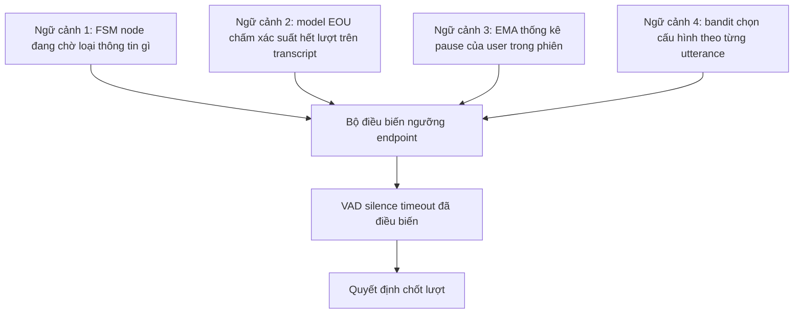
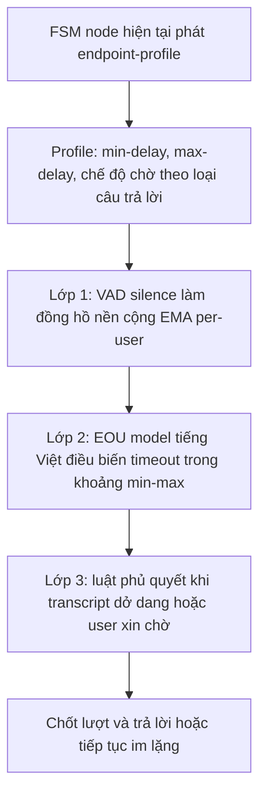

# 05.06 — EOU / Endpointing: Xác Định Kết Thúc Lượt Nói Cho Voice-bot Tổng Đài Tiếng Việt 8kHz

> [!NOTE]
> - Tài liệu này đào sâu bài toán endpointing — quyết định thời điểm "user đã nói xong, đến lượt bot" — cho pipeline callbot tiếng Việt trên kênh thoại 8kHz.
>
> - Bảng so sánh landscape các giải pháp turn-detection (LiveKit / Smart Turn / VAP / TEN) đã có tại [00_README.md](00_README.md) §4-§5 — tài liệu này KHÔNG lặp lại bảng, chỉ mở rộng các góc mới: phân rã tín hiệu EOU, endpointing bên trong streaming ASR, context-conditioned endpointing gắn FSM node, đặc thù tiếng Việt và recipe label data.
>
> - Ranh giới trách nhiệm với VAD / voice-isolation xem [02_turn_models_and_voice_frontend.md](02_turn_models_and_voice_frontend.md); harness text-first đã chạy xem [../11_sim_test_system/04_turn_detection.md](../11_sim_test_system/04_turn_detection.md); streaming ASR xem [../04_asr_telephony/00_README.md](../04_asr_telephony/00_README.md); hai chủ đề liền kề đang viết song song: `05_target_speaker_isolation.md` và `07_bargein_decision.md`.
>
> - Nhãn độ tin cậy số liệu: ✅ paper peer-review / doc chính thức vendor · ⚠️ preprint / blog vendor / số cần kiểm chứng lại · ❓ chưa có nguồn, cần thực nghiệm.

---

## 1. Dẫn dắt bối cảnh

- **Bối cảnh thực tế**:
  - Trong hội thoại người-người, khoảng lặng (gap) giữa hai lượt nói có mode chỉ khoảng ~200ms — ngắn hơn cả thời gian con người cần để chuẩn bị phát âm một câu trả lời (~600ms),
  - nghĩa là người nghe DỰ ĐOÁN điểm kết thúc lượt dựa trên nội dung và ngữ điệu, chứ không chờ im lặng xảy ra rồi mới phản ứng (Levinson & Torreira 2015 ✅).
- **Nghịch lý kỹ thuật**:
  - Đa số voice-bot hiện nay quyết định hết lượt bằng một ngưỡng im lặng cố định — hệ như vậy về nguyên lý luôn chậm hơn người vì bản chất là phản ứng sau sự kiện,
  - và khi ép ngưỡng xuống thấp để phản xạ nhanh hơn thì lại cắt lời user đang ngập ngừng giữa câu — hai lỗi kéo nhau theo hai hướng ngược chiều.

> Tài liệu này phân rã các lớp tín hiệu EOU,
> tổng hợp số liệu trade-off latency ↔ cắt lời từ các hệ endpointing công nghiệp,
> **và chỉ ra lợi thế cấu trúc của kiến trúc FSM node trong FCI: ngữ cảnh hội thoại cho phép điều biến endpoint với chi phí gần bằng không.**

---

## 2. Glossary

- `EOU / EOT` -> **End-of-Utterance / End-of-Turn** -> điểm user kết thúc phát ngôn / kết thúc lượt nói.
- `endpointing (EP)` -> **Endpointing** -> bài toán quyết định thời điểm đóng micro / chốt transcript trong ASR; trong voice agent đồng nghĩa với quyết định "đến lượt bot".
- `TRP` -> **Transition Relevance Place** -> điểm "có thể chuyển lượt" trong lý thuyết hội thoại (Sacks et al. 1974); người nghe dự đoán TRP từ cú pháp-ngữ nghĩa, im lặng chỉ là hệ quả.
- `EEPR` -> **Early Endpoint Rate** -> tỷ lệ chốt endpoint sớm gây cắt lời user (metric của Amazon).
- `EP50 / EP90` -> **Endpointing latency percentile 50 / 90** -> độ trễ chốt endpoint tại phân vị 50 / 90 của phân bố.
- `UPL` -> **User-Perceived Latency** -> độ trễ user cảm nhận từ lúc nói xong đến lúc nghe phản hồi.
- `prosody / final lengthening` -> **Prosody / Final lengthening** -> ngữ điệu (F0, trường độ, cường độ); final lengthening là kéo dài âm tiết cuối trước điểm dừng.
- `filler / hesitation pause` -> **Filler / Hesitation pause** -> từ đệm ngập ngừng ("ừm", "à", "để em xem") và khoảng lặng suy nghĩ GIỮA lượt — khác bản chất với khoảng lặng kết lượt.
- `particle` -> **Sentence-final particle** -> hư từ cuối câu tiếng Việt ("ạ", "nhé", "nhỉ", "rồi", "đó") mang chức năng kết câu / giữ lượt.
- `eager EOT` -> **Eager End-of-Turn** -> chốt EOT "non" ở ngưỡng tin cậy thấp để LLM chạy trước, có cơ chế rollback nếu user nói tiếp.

---

## 3. Ba lớp tín hiệu EOU và trần của silence-only

### 3.1 Khung phân rã ba tầng tín hiệu

- **Tầng acoustic** — nhanh nhất, mù nghĩa:
  - khoảng lặng là tín hiệu rẻ nhất nhưng nhập nhằng nhất (không phân biệt hesitation pause với EOU pause);
  - final lengthening và F0 hạ cuối câu hoạt động tốt ở ngôn ngữ không thanh điệu — với tiếng Việt xem §7;
  - cường độ giảm dần và chất giọng creaky cuối lượt là cue phụ trợ.
- **Tầng lexico-syntactic** — chủ lực, cần ASR:
  - thí nghiệm che tín hiệu của de Ruiter et al. (2006) ✅: nghe được nội dung từ vựng-cú pháp (lọc mất prosody) vẫn dự đoán EOU gần như đủ; chỉ nghe prosody (mất nội dung) thì dự đoán sụp — tín hiệu lexico-syntactic là chủ lực, prosody là phụ trợ;
  - bổ chính từ Bögels & Torreira (2015) ✅: prosody quan trọng ở đúng chỗ phân định "câu đã trọn nghĩa nhưng người nói còn tiếp" — cùng một chuỗi từ, ngữ điệu quyết định đó là điểm dừng hay giữa câu;
  - dấu hiệu cụ thể: câu đã trọn cú pháp chưa, từ cuối có phải filler hay liên từ treo ("và", "nhưng", "là") không.
- **Tầng pragmatic** — rẻ nhưng hay bị bỏ quên:
  - bot vừa hỏi GÌ quyết định KỲ VỌNG dạng trả lời: hỏi yes/no → lượt ngắn, chốt nhanh; hỏi số điện thoại → chuỗi digit có pause giữa nhóm, phải chờ; hỏi open-ended → lượt dài, nhiều hesitation;
  - với agent FSM node-based của FCI, tầng này gần như miễn phí vì node hiện tại đã mã hóa kỳ vọng — chi tiết §5.
- **💡 Ý nghĩa**:
  - survey turn-taking IWSDS 2025 ✅ tổng kết: model đơn tín hiệu (chỉ silence hoặc chỉ text) đều có trần; các hệ tốt nhất fuse acoustic + linguistic, và LLM fusion (2024) thêm được ngữ cảnh hội thoại nhiều lượt.

### 3.2 Trần nguyên lý của silence-only trên telephony

- **⚠️ Bẫy ngưỡng ngắn**:
  - đo trên Switchboard (telephone speech tự nhiên — đúng distribution của FCI), chỉ dùng trailing silence 200ms cho WER ~24,4% so với oracle ~21,9% — degradation rõ do cắt sớm;
  - WER chỉ bão hòa về gần oracle quanh trailing silence ~600ms → "điểm gãy" của silence thuần trên hội thoại điện thoại nằm quãng 600ms (Uniphore, Hacioglu & Stolcke et al. 2025 ⚠️ preprint);
  - hệ quả: silence-only dưới 400ms là vùng nguy hiểm trên kênh thoại; muốn xuống 200-300ms phản xạ phải có tín hiệu semantic / prosodic bù vào.
- **Hai họ bài toán**:
  - reactive classification (Smart Turn, LiveKit, TEN): chờ VAD báo im lặng RỒI mới hỏi "lượt đã xong chưa" — trần latency = silence tối thiểu + inference, không bao giờ đạt gap ~200ms của người;
  - predictive projection (VAP, đã định vị ở [00_README.md](00_README.md) §4): dự đoán liên tục hoạt động giọng nói 2s tương lai, mô phỏng đúng cách người dự đoán TRP — nhưng multilingual VAP mới chứng minh EN/ZH/JA, tiếng Việt chưa có ⚠️;
  - vị trí cho FCI: coi predictive là nâng cấp giai đoạn sau, khi kiến trúc reactive 3 lớp (§9) đã chạy và có số đo nền.

---

## 4. Endpointing bên trong streaming ASR

- **⚙️ Cơ chế RNN-T endpointer với token `</s>` (Google 2020 ✅)**:
  - thêm token `</s>` vào vocabulary của RNN-T, decoder tự phát `</s>` khi "nghe thấy" điểm kết thúc — endpointing dùng được cả lịch sử ngôn ngữ lẫn acoustic, thay vì VAD ngoài chỉ nhìn năng lượng;
  - early/late penalty phạt trong training khi `</s>` phát quá sớm (gây deletion — cắt lời) hoặc quá muộn (gây latency), mốc chuẩn lấy từ forced alignment.
- **Số liệu trade-off (cùng nguồn ✅)**:
  - RNN-T EP so với VAD endpointer ngoài: EP50 giảm ~130ms, EP90 giảm ~200ms, nhưng WER TĂNG +0,3% tuyệt đối — đánh đổi kinh điển latency ↔ deletion;
  - thêm late penalty + MWER training: WER giảm 8% tương đối, EP50 −30ms, EP90 −130ms;
  - thêm 2nd-pass LAS rescoring: WER giảm 18,7% tương đối, EP50 −40ms, EP90 −160ms.
- **Bài học đo lường từ Meta (Interspeech 2021 ✅)**:
  - model size / RTF / FLOPS KHÔNG tương quan mạnh với UPL; hai yếu tố chi phối là token emission latency (RNN-T phát chữ trễ so với âm) và endpointing behavior;
  - silence threshold càng ngắn thì WER tăng chủ yếu do DELETION; endpointer có học cho đường cong WER-latency tốt hơn hẳn static silence;
  - hệ quả cho FCI: tối ưu UPL phải đo ở tầng endpointer + emission delay, không phải cứ đổi model ASR nhỏ hơn là nhanh hơn — kết nối trực tiếp với lựa chọn streaming ASR ở [../04_asr_telephony/00_README.md](../04_asr_telephony/00_README.md).
- **Vị trí trong lộ trình FCI**: nhúng `</s>` đòi hỏi train lại ASR — đường dài, chỉ xét khi FCI tự chủ ASR NeMo; giá trị trước mắt là QUY LUẬT chung: mọi kỹ thuật đều là cách "mua" lại latency mà không trả bằng deletion.

---

## 5. Context-conditioned endpointing — trục quan trọng nhất với FCI

### 5.1 Bốn nguồn ngữ cảnh điều biến endpoint

- **Nguồn 1 — model EOU điều biến silence timeout (pattern LiveKit)**:
  - VAD vẫn là đồng hồ nền; model EOU text-based chấm xác suất "đã hết lượt" trên transcript → xác suất thấp thì KÉO DÀI silence timeout, xác suất cao thì RÚT NGẮN — model không thay VAD mà điều biến ngưỡng của VAD ✅ (blog LiveKit);
  - số liệu v1: giảm 85% ngắt lời nhầm so với VAD thuần, inference ~50ms CPU, context 4 lượt gần nhất ⚠️ (benchmark nội bộ vendor);
  - v0.4.1-intl: nền Qwen2.5-0.5B distill từ teacher 7B, giảm thêm 39,23% tương đối false-positive interruption, học được "chờ cho trọn format" với số điện thoại / email — 14 ngôn ngữ, KHÔNG có tiếng Việt ⚠️.
- **Nguồn 2 — dialog state / node (pattern Lex, Dialogflow — chi phí 0 model)**:
  - Amazon Lex V2 ✅ đặt timeout THEO TỪNG intent:slot qua session attribute: `end-timeout-ms` (silence sau khi nói, mặc định 600ms), `start-timeout-ms` (chờ user bắt đầu nói, mặc định 4s), ghi đè được trong Lambda giữa hội thoại — slot credit-card tăng start-timeout (khách lục ví), slot đọc số tăng end-timeout;
  - Google Dialogflow CX ✅ đặt end-of-speech sensitivity và no-speech timeout ở cấp agent / flow / PAGE — page trong CX tương đương node trong FSM của FCI;
  - Microsoft Copilot Studio ✅ cho chọn silence-based VAD (câu trả lời ngắn) vs semantic VAD (câu hỏi open-ended) — vendor thừa nhận LOẠI câu hỏi quyết định LOẠI endpointing;
  - đây là template trực tiếp cho FSM node của FCI: "context-conditioned endpointing bằng bảng cấu hình", không cần model.
- **Nguồn 3 — per-user trong phiên (EMA pause)**:
  - LiveKit mode `dynamic` ✅ (doc chính thức): delay thích nghi trong khoảng [min_delay 0.5s, max_delay 3.0s] theo EMA thống kê pause của phiên, hệ số alpha mặc định 0.9 — dạng per-user speaking-tempo adaptation rẻ nhất, chống được khác biệt người nói chậm / nói nhanh; patent Amazon ⚠️ tính ngưỡng EOS từ phân bố inter-word time của chính speaker — bằng chứng industry đã làm per-user adaptation.
- **Nguồn 4 — per-utterance (contextual bandit, Amazon ICASSP 2023 ✅)**:
  - bandit chọn cấu hình endpoint (aggressive vs relaxed) THEO TỪNG utterance dựa trên audio feature, học online bằng Thompson sampling, không cần nhãn ground-truth;
  - utterance nói chậm / nhiều pause giữa chừng → cấu hình relaxed — giảm early-cutoff mà giữ latency thấp; cần hạ tầng online learning, xếp giai đoạn sau.
- **⚠️ Bẫy vận hành (Twilio ✅)**:
  - smart endpointing giảm median latency nhưng tạo BƯỚC NHẢY ở tail latency đúng bằng silence timeout — khi model đoán sai "user còn nói" thì phải chờ hết fallback timeout;
  - dấu hiệu chẩn đoán: cục u trong phân bố latency trùng vị trí timeout → harness phải đo phân bố P50/P90/P99, không chỉ median.

### 5.2 Sơ đồ bốn nguồn ngữ cảnh

- **Khung đọc sơ đồ**:
  - **Đề bài cần giải**:
    - Minh họa vị trí của bốn nguồn ngữ cảnh so với đồng hồ VAD nền — tất cả đều điều biến ngưỡng chứ không thay thế VAD.
  - **Giả định nền**:
    - Pipeline đã có VAD chạy ổn định làm đồng hồ nền và transcript streaming từ ASR.
  - **Ý nghĩa các khối**:
    - `STATE`: nguồn rẻ nhất — bảng cấu hình theo node, chi phí 0 model.
    - `MEOU`: nguồn cần model — phải tự train tiếng Việt (§8).
    - `USER` / `UTT`: nguồn thích nghi theo người và theo câu — chi phí tăng dần.
    - `MOD` / `VAD` / `OUT`: ngưỡng hợp nhất, đồng hồ nền và quyết định cuối.
  - **Cách đọc**:
    - Bốn nguồn đổ về một bộ điều biến duy nhất; thứ tự triển khai theo chi phí: STATE trước, MEOU sau, USER kèm theo, UTT để giai đoạn có traffic thật.

---

## 6. Ngập ngừng và số đọc ngắt quãng

- **Bản chất lớp lỗi**:
  - hệ silence-based không phân biệt được pause-suy-nghĩ với pause-kết-lượt;
  - nghiên cứu SRI ✅ chỉ ra speech với trợ lý ảo thường phát dưới cognitive load → nonfinal pausing nhiều, và feature TRƯỚC pause (prepausal: final lengthening, F0, phổ) phân biệt được final vs nonfinal pause.
- **Taxonomy tình huống cần cover trong test-set FCI**:
  - filler kéo dài: "ừm... à... để em xem..." — chưa xong;
  - structured input đọc ngắt quãng: số điện thoại đọc 3-3-4 ("không chín tám... ba bảy sáu... năm bốn hai một"), số hợp đồng — pause giữa nhóm digit 0,5-1,5s là BÌNH THƯỜNG;
  - câu treo liên từ: kết thúc bằng "là", "với lại", "nhưng mà" — chưa xong dù pause dài;
  - yêu cầu chờ tường minh: "đợi em xíu", "để em hỏi chồng em" — không phải EOU, cũng không phải tiếp tục ngay: bot phải im và chờ LÂU;
  - suy nghĩ khi bị hỏi nhạy cảm: hỏi về khoản nợ → pause dài đầu lượt và giữa lượt, đặc trưng domain thu hồi nợ ❓ (chưa thấy nghiên cứu riêng, cần đo trên data FCI).
- **⚙️ Mẫu thiết kế arbitrator 2-pass (Amazon ✅ arXiv 2401.08916)**:
  - pass 1 = endpointer nhanh; pass 2 = arbitrator xác nhận lại, có model nhận diện semantic incompleteness + hesitation từ transcript;
  - kết quả: EEPR giảm 16,34% tương đối trên transactional query, giảm 32,45% trên tập partial-utterance, WER giảm 3,12% tương đối;
  - chi phí dồn vào đuôi phân bố: median latency KHÔNG đổi, P90 tăng nhẹ, P99 tăng đáng kể — mẫu "quyết định nhanh + phủ quyết chậm" hợp kiến trúc phễu FCI ở [00_README.md](00_README.md) §7.
- **Lớp "wait" của TEN (✅ HF model card)**:
  - ngoài finished/unfinished, TEN có lớp thứ ba **wait** ("user bảo AI dừng / chờ") — map thẳng vào tình huống "đợi em xíu"; gợi ý cho FCI: output của EOU detector nên là 3 lớp chứ không phải nhị phân;
  - kèm theo chế độ chờ dài là backchannel của bot ("dạ", "vâng, anh/chị cứ nói") phát định kỳ khi khoảng lặng vượt 2-3s để user không tưởng rớt máy — đây là output của endpointing, không phải module riêng (tần suất cụ thể cần thử nghiệm ❓).
- **Lớp lỗi digit trong công nghiệp**:
  - case đọc account number bị cắt giữa chuỗi vì pause giữa digit vượt silence threshold; semantic VAD học được "chuỗi digit dở dang chưa phải utterance trọn" nên chờ tiếp ✅ (case study vendor Gradium);
  - Deepgram smart_format ✅: phát hiện đang đọc số điện thoại thì CHỦ ĐỘNG chờ thêm audio để format trọn — endpointing bị hoãn bởi tầng hiểu format;
  - LiveKit v0.4.1 ⚠️ xử lý cùng lớp lỗi bằng data: train thêm hội thoại synthetic nhấn structured data để model "chờ cho trọn format".

---

## 7. Đặc thù tiếng Việt — thanh điệu và từ kết câu

- **Luận điểm trung tâm (có chứng cứ ngôn ngữ học)**:
  - trong tiếng Việt, F0 đã bị "chiếm dụng" cho thanh điệu từ vựng → vai trò của intonation (ngữ điệu câu) yếu hơn hẳn ngôn ngữ không thanh điệu;
  - Brunelle et al. (2012) ✅: "the role of intonation seems far more limited than in the average non-tonal language" (tiếng Việt Bắc); Phạm & Brunelle (2019) ✅: tiếng Việt Nam Bộ — intonation khó dùng để phân biệt loại câu, kể cả khi có mặt;
  - chức năng của intonation được THAY THẾ bằng phương tiện từ vựng — hư từ cuối câu.
- **Boundary tone không biến mất hoàn toàn (Hạ Kiều Phương, Speech Prosody 2010 ✅, corpus điện thoại)**:
  - backchannel ("mm", "ừ") mang boundary tone THẤP (L%), thanh điệu từ vựng gần như bị lấn át;
  - câu hỏi / repair initiation / turn exit mang đường F0 chốt CAO (H%) cuối cụm, giữ nguyên bất kể thanh điệu từ vựng;
  - nhưng Hạ (2012) ✅: với discourse particle trong ngữ cảnh turn-yielding, realization KHÔNG nhất quán giữa các speaker — tín hiệu prosody có tồn tại nhưng nhiễu.
- **💡 Ý nghĩa thiết kế — text-first có lợi thế cấu trúc**:
  - prosody tiếng Việt CÓ tín hiệu lượt lời nhưng yếu và bất nhất giữa speaker → audio-model thuần prosody sẽ có trần thấp hơn so với ngôn ngữ Âu châu;
  - từ kết câu là tín hiệu EOU mạnh và RẺ: "ạ", "nhé/nha", "nhỉ", "hen/há", "đó/đấy", "rồi", "luôn", "được không", "đúng không" — nằm trong TEXT nên detector text-based bắt được không cần prosody; ngược chiều, từ TREO ("là", "thì", "mà", "với", "cái") là tín hiệu chưa-xong mạnh ❓ (chưa có paper đo weight các particle này cho EOU tiếng Việt — chỗ FCI có thể đóng góp số liệu đầu tiên);
  - lập luận này giải thích hợp lý cho false-positive 14,84% của Smart Turn v3 trên tiếng Việt (số đo 16kHz, xem bảng ở [00_README.md](00_README.md) §4): model học cue "xuống giọng cuối câu" từ ngôn ngữ Âu châu, cue này không ổn định trong tiếng Việt — suy luận, cần kiểm chứng ❓.
- **⚠️ Bẫy ASR với particle**:
  - particle cuối câu thường nói nhỏ, nuốt âm, trên kênh 8kHz dễ mất trong transcript → phải đo recall của ASR nội bộ với các particle này TRƯỚC khi tin feature text-based ❓.
- **Bài học chuyển giao từ tiếng Thái** (ngôn ngữ thanh điệu cùng khu vực, ⚠️ preprint arXiv 2510.04016): sentence-final particle tiếng Thái là cue chính cho text-only EOT; model đa ngữ (mDeBERTa) sau fine-tune vượt model chuyên tiếng Thái — kiến trúc mạnh + data đủ thắng pretrain bản địa.

---

## 8. Label data EOU để train — recipe và bẫy

### 8.1 Recipe từ paper Thai EOT (template gần nhất cho tiếng Việt ⚠️ arXiv 2510.04016)

- **Nguồn và pipeline làm sạch**:
  - subtitle có timestamp từ corpus YODAS, lọc giữ ngôn ngữ đích;
  - regex filter → LLM 12B lọc bài hát / quảng cáo / non-dialogue → cùng LLM tách dòng subtitle thành đơn vị câu để căn lại ranh giới lượt.
- **Chiến lược label**:
  - decoder model: chèn token stop cuối câu, train next-token → likelihood của stop token tại mỗi boundary = xác suất EOU;
  - encoder model: mỗi câu trọn = positive; CẮT CHÍNH GIỮA câu tạo negative → dataset cân bằng, không cần heuristic punctuation.
- **Kết quả chốt** (59k câu, CPU Xeon):
  - fine-tuned Qwen3-0.6B: F1 0,866 @ 90ms — điểm ngọt cho CPU serving;
  - fine-tuned Llama3.2-Typhoon2-1B: F1 0,881 @ 110ms; mDeBERTa-v3-base (276M): F1 0,861 @ 290ms, không cần calibrate ngưỡng;
  - zero-shot thresholding không calibrate (ngưỡng 0.5) → F1 ≈ 0 vì xác suất thô của stop token cực nhỏ (ngưỡng tối ưu cỡ 1e-6…1e-8) — bẫy triển khai kinh điển;
  - prompting zero/few-shot: F1 tối đa 0,706 và latency 1,5-2,6s — loại khỏi real-time.

### 8.2 Bẫy của weak label và data cũ

- **⚠️ Pause không phải EOU**: label "hết lượt = im lặng > X ms" sẽ dán nhầm hesitation pause dài thành EOU và bỏ sót chuyển lượt nhanh (gap < X) — weak label tái sản xuất đúng lỗi của silence-based vào model ✅ (suy ra trực tiếp từ phân bố gap ~200ms của Levinson & Torreira).
- **⚠️ Cắt lời của hệ cũ làm bẩn corpus**: data thu từ hệ endpoint ngắn không chứa mẫu pause dài tự nhiên → train trên đó model không bao giờ học được "chờ"; SRI ✅ đề xuất elicitation riêng để thu mẫu pause tự nhiên.
- **⚠️ Premature EOT làm méo cả eval**: EOT chốt sớm chẻ 1 lượt thật thành 2 lượt trong ground truth pipeline → metric latency/accuracy sai lệch; eval phải chấm trên ranh giới lượt gốc (Deepgram ✅).
- **Synthetic TTS không đủ**: Smart Turn v3.0 train nặng bằng TTS data → thiếu biến thiên người thật; v3.1 chỉ thêm human audio (EN/ES) đã nhảy accuracy EN 88,3%→94,7-95,6%, ES 86,7%→90,1-91,0% — 21 ngôn ngữ còn lại (gồm tiếng Việt) KHÔNG đổi vì không có data mới ⚠️ (blog vendor Daily).
- **Hướng distill cho FCI** ⚠️ (cách làm vendor, chưa có ablation công khai):
  - dùng LLM lớn (trên DGX) chấm nhãn finished/unfinished/wait cho transcript callbot, người rà lại mẫu nghi ngờ, distill xuống model 0.5-1B — cùng lối LiveKit (Qwen 7B → 0.5B) và TEN;
  - augment negative hội tụ từ các nguồn: cắt giữa câu + cắt sau liên từ treo + chèn filler tiếng Việt + cắt giữa chuỗi digit (mô phỏng đọc số 3-3-4).

---

## 9. Khuyến nghị cho FCI — kiến trúc endpointing 3 lớp gắn FSM node

### 9.1 Sơ đồ kiến trúc

- **Khung đọc sơ đồ**:
  - **Đề bài cần giải**:
    - Xếp các nguồn tín hiệu §5 thành một kiến trúc thực thi được theo thứ tự chi phí tăng dần, gắn vào FSM node sẵn có của FCI.
  - **Giả định nền**:
    - Agent FCI chạy theo FSM node; mỗi node biết loại thông tin đang chờ (yes/no, digit, lý do, free-talk).
  - **Ý nghĩa các khối**:
    - `NODE` / `PROF`: lớp 0 — cấu hình pragmatic, chi phí 0 model, làm được ngay.
    - `VAD`: đồng hồ nền Silero + EMA pause per-user (alpha ~0.9 theo LiveKit).
    - `EOU`: model text-first tiếng Việt tự train, output 3 lớp finished/unfinished/wait.
    - `ARB` / `OUT`: luật rẻ phủ quyết trước khi chốt, rồi quyết định cuối.
  - **Cách đọc**:
    - Tín hiệu đi từ trên xuống; lớp trên đặt khung (min/max), lớp dưới tinh chỉnh trong khung; lớp phủ quyết chỉ chặn chiều "chốt sớm", không kéo dài vô hạn nhờ max_delay.

### 9.2 Nội dung từng lớp

- **Lớp 0 — endpoint-profile theo node** (làm NGAY, không cần model):
  - mỗi node FSM khai báo `expected_answer_type` (yes_no · digit_sequence · money_amount · open_reason · free_talk) → map sang min_delay/max_delay;
  - điểm khởi đầu đề xuất (chưa kiểm chứng, cần grid-search trên harness ❓): yes/no 0,3-0,5s; digit_sequence min 1,2s giữa nhóm số + regex đếm đủ 10 digit thì chốt sớm; open_reason 0,8-1,5s; free_talk theo EOU model;
  - cơ sở: Lex đặt end-timeout per slot ✅, Dialogflow đặt sensitivity per page ✅ — FCI làm giống nhưng ở tầng node;
  - tách riêng hai tham số theo bài học Copilot Studio ✅: no-speech timeout (user chưa nói gì) khác end-silence timeout (user nói xong).
- **Lớp 1 — VAD + EMA per-user**: giữ Silero làm đồng hồ; cộng EMA pause statistics trong phiên để tự nới cho người nói chậm.
- **Lớp 2 — EOU model tiếng Việt text-first**:
  - không vendor nào có text-EOU tiếng Việt → tự train theo recipe §8: Qwen3-0.6B fine-tune (mục tiêu F1 ≥ 0,86, ≤ 100ms CPU) hoặc mDeBERTa/PhoBERT nếu muốn khỏi calibrate ngưỡng;
  - output 3 lớp theo TEN: finished / unfinished / wait — lớp wait nhảy sang chế độ chờ dài (max_delay lớn + backchannel định kỳ);
  - đầu ra là XÁC SUẤT điều biến timeout (pattern LiveKit), không phải quyết định cứng — khớp kiến trúc phễu ở [00_README.md](00_README.md) §7.
- **Lớp 3 — luật phủ quyết rẻ trước khi chốt** (pattern arbitrator Amazon):
  - transcript kết thúc bằng từ treo ("là/thì/mà/với") hoặc digit chưa đủ độ dài kỳ vọng của node → phủ quyết, chờ tiếp;
  - đo P99 tail để biết chi phí — đúng cảnh báo Twilio §5.1.
- **Eager EOT cho node đắt LLM** (pattern Deepgram Flux ✅):
  - với node cần gọi LLM/tool chậm, chốt "non" ở ngưỡng tin cậy thấp cho LLM chạy trước, rollback nếu user nói tiếp (Flux phát sự kiện EagerEndOfTurn / TurnResumed);
  - giảm latency cảm nhận hàng trăm ms mà không đổi quyết định lượt; EOT latency Flux công bố ~260ms P50 ⚠️ (số bên thứ ba).
- **Thứ tự triển khai và harness**:
  - bước 1 (0 model): lớp 0 + lớp 3 — đo ngay trên harness text-first hiện có ([../11_sim_test_system/04_turn_detection.md](../11_sim_test_system/04_turn_detection.md));
  - bước 2: dựng dataset label theo §8, fine-tune Qwen3-0.6B tiếng Việt, cắm làm lớp 2;
  - bước 3: fine-tune Smart Turn v3.1 trên audio 8kHz tiếng Việt để thêm nhánh acoustic khi renderer audio của harness sẵn sàng;
  - bước 4 (khi có traffic): per-user EMA tinh chỉnh + cân nhắc bandit online;
  - mở rộng harness: thêm trục kịch bản EOU (digit 3-3-4, filler kéo dài, câu treo, "đợi em xíu", yes/no nhanh — mỗi loại ≥ 2 ví dụ thật), metric thêm EEPR + phân bố latency P50/P90/P99.

---

## 10. Nguồn tham chiếu

| Nguồn | Nội dung dùng trong tài liệu | Nhãn | URL |
| :--- | :--- | :--- | :--- |
| Levinson & Torreira 2015 | gap ~200ms, người dự đoán EOU trước im lặng | ✅ | https://www.frontiersin.org/journals/psychology/articles/10.3389/fpsyg.2015.00731/full |
| de Ruiter et al. 2006 (Language 82(3)) | lexico-syntactic chủ lực, prosody phụ trợ | ✅ | — |
| Survey turn-taking IWSDS 2025 | trần của model đơn tín hiệu, xu hướng fusion | ✅ | https://aclanthology.org/2025.iwsds-1.27.pdf |
| SRI — prepausal feature | phân biệt final vs nonfinal pause, elicitation data | ✅ | https://www.sri.com/wp-content/uploads/2021/12/enhanced_end-of-turn_detection_for_speech_to_a_personal_assistant.pdf |
| Google RNN-T `</s>` (2020) | EP50 −130ms, WER +0,3%, penalty + MWER | ✅ | https://ar5iv.labs.arxiv.org/html/2004.11544 |
| Meta UPL (Interspeech 2021) | UPL do emission + endpointing, không do model size | ✅ | https://www.isca-archive.org/interspeech_2021/shangguan21_interspeech.pdf |
| Uniphore — EP trên Switchboard | 200ms → WER 24,4% vs oracle 21,9%, bão hòa ~600ms | ⚠️ | https://arxiv.org/html/2505.17070v1 |
| Amazon 2-pass arbitrator | EEPR −16,34% / −32,45%, P99 tăng | ✅ | https://arxiv.org/html/2401.08916v1 |
| Amazon contextual bandit (ICASSP 2023) | chọn cấu hình EP per-utterance online | ✅ | https://arxiv.org/pdf/2303.13407 |
| Amazon Lex V2 doc | timeout per intent:slot, end-timeout mặc định 600ms | ✅ | https://docs.aws.amazon.com/lexv2/latest/dg/session-attribs-speech.html |
| Dialogflow CX doc | sensitivity / timeout per page | ✅ | https://docs.cloud.google.com/dialogflow/cx/docs/concept/advanced-speech |
| LiveKit blog turn detector + v0.4.1 | −85% ngắt nhầm, −39,23% FP, chờ trọn format | ⚠️ | https://livekit.com/blog/improved-end-of-turn-model-cuts-voice-ai-interruptions-39 |
| LiveKit doc turn-handling | mode dynamic, EMA alpha 0.9, min/max delay | ✅ | https://docs.livekit.io/reference/agents/turn-handling-options |
| Deepgram — Flux eager EOT · eval EOT | EagerEndOfTurn / TurnResumed; premature EOT làm méo ground truth | ✅ | https://developers.deepgram.com/docs/flux/voice-agent-eager-eot · https://deepgram.com/learn/evaluating-end-of-turn-detection-models |
| Twilio latency guide | bước nhảy tail latency tại vị trí timeout | ✅ | https://www.twilio.com/en-us/blog/developers/best-practices/guide-core-latency-ai-voice-agents |
| TEN Turn Detection | lớp thứ ba "wait" ngoài finished/unfinished | ✅ | https://huggingface.co/TEN-framework/TEN_Turn_Detection |
| Hạ Kiều Phương (Speech Prosody 2010) | H% / L% boundary tone trên corpus điện thoại | ✅ | https://www.isca-archive.org/speechprosody_2010/ha10_speechprosody.pdf |
| Brunelle 2012 · Phạm & Brunelle 2019 | intonation tiếng Việt yếu hơn ngôn ngữ không thanh điệu | ✅ | https://theses.hal.science/tel-04717308v1 |
| Thai EOT (SCBX/KMUTT) | recipe label + Qwen3-0.6B F1 0,866 @ 90ms | ⚠️ | https://arxiv.org/pdf/2510.04016 |
| Smart Turn v3.1 (Daily) | human audio +6-7 điểm EN/ES, tiếng Việt không đổi | ⚠️ | https://www.daily.co/blog/improved-accuracy-in-smart-turn-v3-1/ |
| Gradium — case digit sequence | semantic VAD chờ trọn chuỗi số | ⚠️ | https://gradium.ai/content/semantic-vad-voice-agents-turn-detection-2026 |
| Filler lexicon tiếng Việt · weight particle EOU · pause domain thu hồi nợ | chưa tìm được nguồn, cần thực nghiệm trên data FCI | ❓ | — |

---

## ✅ Tự kiểm nhanh

1. Vì sao silence threshold thuần không xuống được dưới ~400ms trên kênh thoại?

- **Trade-off latency ↔ deletion**:
  - Ngưỡng càng ngắn thì càng cắt lời user đang ngập ngừng, WER tăng chủ yếu do deletion.
  - Đo trên Switchboard: trailing silence 200ms cho WER 24,4% so với oracle 21,9%, chỉ bão hòa quanh 600ms — muốn phản xạ nhanh hơn phải có tín hiệu semantic / prosodic bù, không hạ ngưỡng đơn thuần.

2. Nguồn ngữ cảnh nào rẻ nhất để điều biến endpoint trong kiến trúc FCI, và vì sao?

- **Dialog state theo FSM node**:
  - Node hiện tại đã biết đang chờ loại thông tin gì (yes/no, chuỗi digit, lý do dài) — chỉ cần bảng cấu hình min/max delay theo `expected_answer_type`, không cần model.
  - Lex (per intent:slot) và Dialogflow CX (per page) là bằng chứng công nghiệp cho pattern này; các framework generic không có lợi thế cấu trúc như vậy.

3. Vì sao EOU cho tiếng Việt nên đi hướng text-first thay vì prosody-first?

- **Thanh điệu chiếm dụng F0**:
  - Intonation câu trong tiếng Việt yếu và bất nhất giữa speaker (Brunelle 2012, Hạ 2012) vì F0 đã dùng cho thanh điệu từ vựng.
  - Chức năng kết câu dồn vào particle từ vựng ("ạ", "nhé", "rồi", "đúng không") — nằm trong transcript nên model text bắt được; điều kiện đi kèm là phải đo recall của ASR 8kHz với các particle này trước khi tin feature.

