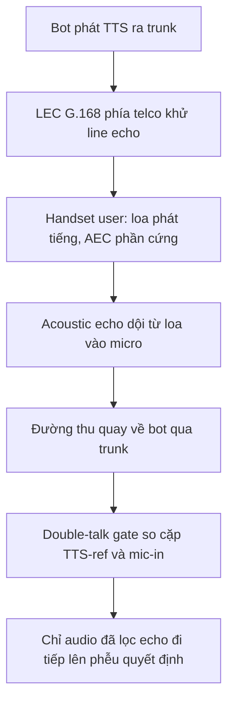
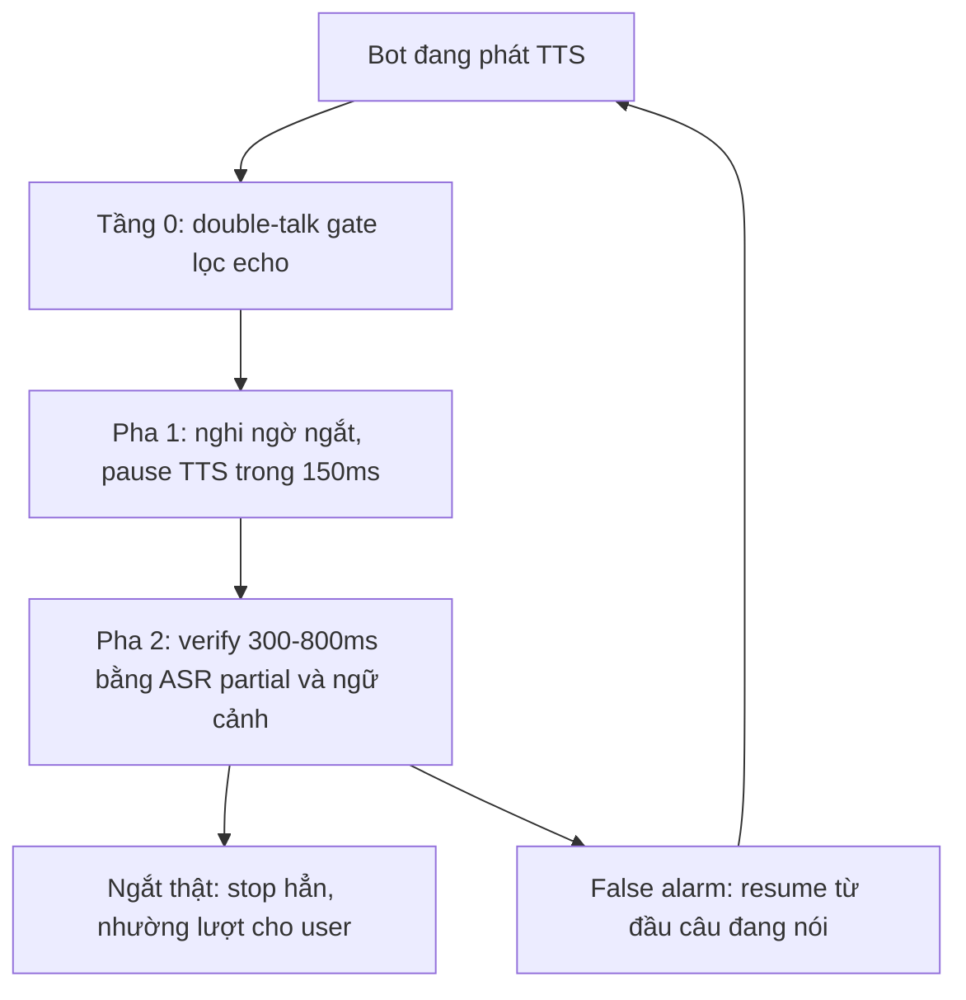

# 05.07 — Barge-in Decision: Kiến Trúc Quyết Định 2 Pha và Lớp Vật Lý Echo / Double-talk

> [!NOTE]
> - Tài liệu này đào sâu bài toán barge-in ở **tầng quyết định** (khi nào pause/stop TTS, khi nào nói tiếp) và **lớp vật lý echo / double-talk** nằm dưới mọi model.
> - KHÔNG lặp lại taxonomy 6 chiều và bảng tình huống FN/FP — xem [01_interrupt_taxonomy.md](01_interrupt_taxonomy.md).
> - Ngân sách 150ms và phễu 3 tầng xem [00_README.md](00_README.md) mục 6-7; pipeline as-built xem [../10_implementation/02_e2e_report.md](../10_implementation/02_e2e_report.md).
> - Bài toán side-speech / target-speaker được đào sâu riêng tại [05_target_speaker_isolation.md](05_target_speaker_isolation.md); tài liệu này chỉ xét side-speech ở góc độ quyết định.
> - Nhãn nguồn: ✅ nguồn mạnh (paper peer-review / doc chính thức / chuẩn ITU) · ⚠️ số do hãng tự công bố hoặc preprint / blog kỹ thuật · ❓ suy luận hoặc chưa có số định lượng, cần thực nghiệm.

---

## 1. Dẫn dắt bối cảnh

- **Bối cảnh thực tế**:
  - Một voice-bot tổng đài dựng trên Asterisk AudioSocket (đúng kiến trúc telco → bot như FCI) bật continuous listening để làm barge-in mà không có echo cancellation và VAD gating,
  - kết quả được ghi nhận nguyên văn là "cascade of false interruptions, echo-loop logic failures, and an unusable conversational flow" — bot liên tục tự ngắt chính mình vì nghe thấy tiếng TTS của bản thân dội về ✅ https://www.technetexperts.com/asterisk-audiosocket-barge-in-fix/ ; cùng hiện tượng được báo trên diễn đàn Asterisk chính thức — frame echo bị xem là "possible user" ngay khi bot đang phát TTS ✅ https://community.asterisk.org/t/inconsistent-barge-in-detection-in-asterisk-audiosocket-voice-bot/113041
- **Nghịch lý thiết kế**:
  - Kỹ sư thường coi barge-in là bài toán machine learning thuần túy — chọn classifier tốt hơn thì false-interrupt sẽ giảm,
  - trong khi case trên cho thấy tầng dưới cùng là một lớp vật lý: khi echo TTS lọt qua đường thu, mọi model phía trên đang phân loại chính giọng của bot, nhãn INTERRUPT/HOLD trở nên vô nghĩa; đồng thời ngân sách 150ms tưởng như loại bỏ mọi verifier chậm như LLM, nhưng ràng buộc này chỉ đúng khi quyết định gói trong một pha duy nhất.

> Tài liệu này bóc hai tầng của bài toán barge-in decision,
> **lớp vật lý echo / double-talk ở tầng 0 và kiến trúc quyết định 2 pha pause-and-confirm ở tầng trên**,
> từ đó chốt thứ tự triển khai hợp lý cho voice-bot tổng đài tiếng Việt 8kHz của FCI.

---

## 2. Glossary

- `acoustic / line echo` -> **Acoustic Echo vs Line Echo** -> acoustic echo là tiếng TTS của bot phát ra loa điện thoại user, dội qua không khí vào micro rồi quay về đường thu của bot; line echo là tiếng vọng điện sinh ra ở bộ hybrid 2-dây/4-dây trong mạng PSTN hoặc do impedance mismatch.
- `AEC` -> **Acoustic Echo Cancellation** -> adaptive filter ước lượng echo từ reference signal (audio bot phát) rồi trừ khỏi tín hiệu thu về.
- `LEC / G.168` -> **Line Echo Canceller chuẩn ITU-T G.168** -> bộ khử line echo đặt trong mạng viễn thông hoặc gateway, tail 32-128ms, có sẵn double-talk detection trong spec.
- `double-talk` -> **Double-talk** -> trạng thái cả hai bên cùng phát tiếng — chính là trạng thái vật lý của barge-in; **DTD** (Double-Talk Detector) phát hiện trạng thái này để đóng băng adaptation của filter.
- `ERL / ERLE` -> **Echo Return Loss (Enhancement)** -> độ suy hao echo trước/sau khi khử, đơn vị dB — chỉ số chất lượng của đường truyền và của AEC.
- `ducking` -> **Ducking / Half-duplex Gating** -> giảm hoặc tắt hẳn đường thu (hoặc bỏ qua STT) khi bot đang phát TTS — cách "né" echo thay vì khử.
- `pause-and-confirm` -> **Pause-and-Confirm** -> kiến trúc quyết định 2 pha: pha 1 pause TTS ngay khi nghi ngờ (hành động rẻ, đảo ngược được), pha 2 verify chậm hơn rồi mới stop hẳn hoặc resume.
- `false barge-in` -> **False Barge-in** -> sự kiện trigger ngắt nhưng KHÔNG phải ý định ngắt thật — gồm nhiễu, backchannel, echo TTS, tiếng nói không hướng vào bot.
- `side-speech` -> **Side-speech / Cross-talk** -> user nói với người khác ngoài cuộc gọi (phổ biến khi gọi thu hồi nợ); bài toán nhận diện tương đương là **DDSD** (Device-Directed Speech Detection) của Alexa — câu nói có hướng vào máy không.

---

## 3. Lớp vật lý — tầng 0: echo và double-talk trong telephony

### 3.1 Vì sao echo là tầng 0, không phải phần phụ

- **Chuỗi hỏng echo-loop**:
  - TTS bot → loa điện thoại user → dội vào micro user → quay về đường thu của bot → VAD thấy "có tiếng người" → bot tự ngắt chính mình, hoặc STT dịch lại chính câu bot vừa nói → LLM trả lời chính mình,
  - mô tả nguyên văn: "The agent's TTS output gets picked up by the microphone, fed back into the STT as if the user said it, and the agent starts responding to itself. The conversation spirals." ✅ https://www.coval.ai/blog/voice-ai-echo-cancellation
- **Kết luận cấu trúc**: chiều D1 (nguồn phát) trong [01_interrupt_taxonomy.md](01_interrupt_taxonomy.md) chỉ giải được khi tầng vật lý sạch; nếu echo lọt qua, mọi classifier D2/D3 phía trên đang phân loại tiếng của chính bot — vô nghĩa về mặt nhãn ✅ (suy ra trực tiếp từ các case ở mục 1).

### 3.2 Hai loại echo — và bên nào ĐÃ khử sẵn

- **Acoustic echo (loa → micro của user)**:
  - Nguồn: speakerphone, loa ngoài, tai nghe kém; biến thiên khi user di chuyển hoặc đổi tay cầm máy; bên xử lý là **handset của user** — điện thoại di động hiện đại có AEC phần cứng/DSP tích hợp, nhưng chất lượng lệch mạnh theo hãng máy ✅ https://www.coval.ai/blog/voice-ai-echo-cancellation
  - Hệ quả cho FCI: KHÔNG kiểm soát được — echo về từ máy user là biến ngẫu nhiên theo thiết bị; speakerphone (người lớn tuổi, vừa nghe vừa làm việc khác) là tình huống xấu nhất.
- **Line / hybrid echo (điện, trong mạng PSTN)**:
  - Nguồn: bộ hybrid 2-dây/4-dây, impedance mismatch — ổn định hơn acoustic echo, tail ngắn; bên xử lý là **carrier/telco** bằng LEC chuẩn ITU-T G.168 ✅ https://www.itu.int/rec/dologin_pub.asp?lang=e&id=T-REC-G.168-200903-S%21%21PDF-E&type=items — nhưng telco thường CHỈ đặt echo canceller ở tuyến cần thiết (đường dài, di động) ✅ https://www.voip-info.org/causes-of-echo
  - Với SIP trunk số hóa đầu-cuối (khả năng cao là setup của FCI): không còn hybrid analog trên đường đi → line echo gần như biến mất, echo còn lại chủ yếu là acoustic echo từ handset user ❓ (suy luận, cần xác nhận với telco Việt Nam cụ thể).
- **Hàm ý kiến trúc cho FCI**: bot ở phía server, không có loa/micro vật lý → bot KHÔNG tự sinh acoustic echo; câu hỏi đúng không phải "FCI có cần chạy AEC như trình duyệt không" mà là "**tín hiệu về từ trunk đã sạch echo tới mức nào, và phần dư xử lý bằng gì**".

### 3.3 Sơ đồ đường đi của echo trong telephony

- **Khung đọc sơ đồ**:
  - **Đề bài cần giải**: xác định echo sinh ra ở đâu trên đường truyền và bên nào chịu trách nhiệm khử ở từng chặng.
  - **Giả định nền**: bot nằm ở phía server, kết nối tới user qua SIP trunk; user dùng điện thoại cầm tay hoặc speakerphone.
  - **Ý nghĩa các khối**: `TTS`/`RX` là hai đầu phát-thu của bot trên trunk; `LEC` là điểm khử line echo do telco kiểm soát (có bật hay không phải hỏi bằng văn bản, không giả định); `HS`/`AE` là nguồn acoustic echo nằm ngoài tầm kiểm soát của FCI; `GATE` là lớp phòng thủ cuối phía server cho phần echo dư (mục 3.5).
  - **Cách đọc sơ đồ**: đọc từ trên xuống theo đường đi của một câu TTS — echo có thể sinh ở hai chặng (`LEC` không bật, hoặc `AE` từ handset kém); phần echo dư lọt tới `RX` thì chỉ còn `GATE` chặn được, vắng `GATE` thì echo đi thẳng lên phễu quyết định và tạo false barge-in hàng loạt như case Asterisk.

### 3.4 Vì sao KHÔNG bê nguyên WebRTC AEC3 vào giữa pipeline server

- **Điều kiện của adaptive filter**: cần reference signal và mic signal đồng bộ chặt về clock — điều kiện này không tồn tại giữa pipeline server.
- **Thực tế qua trunk**: TTS đi qua Asterisk → SIP provider → PSTN → máy user rồi mới vọng lại; jitter mạng cộng buffer playback tạo clock drift và delay không xác định → adaptive filter trở nên "mathematically ineffective" ✅ https://www.technetexperts.com/asterisk-audiosocket-barge-in-fix/
- **Khi có reference đồng bộ (môi trường WebRTC)**: AEC3 được người dùng đánh giá vượt Speex AEC ⚠️ https://groups.google.com/g/discuss-webrtc/c/T0W8m5Wy7RM — tức AEC3 tốt trong điều kiện của mình, nhưng điều kiện đó không tồn tại giữa pipeline server.
- **Khuyến nghị phân tầng từ thực chiến Asterisk** ✅ https://www.technetexperts.com/asterisk-audiosocket-barge-in-fix/ :
  - khử echo tại **biên viễn thông** (Asterisk: `ECHOCAN(oslec)=on`, `DENOISE(rx)=on`, `AGC(rx)=on`) trước khi audio vào AI service;
  - phía AI service chỉ làm **double-talk gating** (so năng lượng TTS-out với mic-in) cho phần echo dư.
- **Fallback rẻ nhất (đánh đổi UX)**: ducking / half-duplex — bỏ STT khi TTS đang phát; hết false barge-in do echo nhưng cũng mất luôn barge-in → chỉ dùng cho đoạn pháp lý bắt buộc user nghe hết ✅ https://www.coval.ai/blog/voice-ai-echo-cancellation

### 3.5 Double-talk gate — tái dụng bài toán 50 năm của telephony

- **⚙️ Cơ chế**:
  - Trong echo canceller, khi cả hai bên cùng nói, adaptive filter phải ĐÓNG BĂNG adaptation — nếu không filter học giọng user thành "echo" rồi triệt luôn giọng user ✅ https://vocal.com/echo-cancellation/double-talk-detection/ ; DTD vì vậy bản chất là bộ phát hiện "**user nói đè lên TTS thật, không phải echo**" — trùng khớp với vai trò tầng 0 của phễu barge-in.
- **🔍 Nhận diện — các họ thuật toán tăng dần độ chính xác và chi phí**:
  - **Geigel (1970s)**: so biên độ mic với max biên độ reference trong cửa sổ N mẫu; cực rẻ, chạy per-sample; yếu với acoustic echo vì ERL biến thiên ✅ https://vocal.com/echo-cancellation/double-talk-detector-in-echo-cancellation
  - **Cross-correlation / NCC**: tương quan chuẩn hóa giữa mic và reference; vượt Geigel rõ rệt ✅ https://www.semanticscholar.org/paper/bf2f8a918bbdc0f8546267a024a218e652d7704d
  - **Coherence-based ngưỡng thích nghi** (Tashev, Microsoft Research): bền hơn trong nhiễu và vang ✅ https://www.microsoft.com/en-us/research/wp-content/uploads/2016/02/Tashev_ET11_DoubleTalkDetector_final.pdf
  - **DNN-based / implicit AEC**: Amazon đề xuất bỏ AEC tường minh — đưa thẳng cặp (mic, reference TTS) vào model, để model tự học phân biệt echo với giọng thật ✅ https://arxiv.org/pdf/2111.10639
- **💡 Ý nghĩa cho FCI**:
  - Phiên bản tối giản không cần AEC đầy đủ: so **năng lượng + tương quan** giữa buffer TTS đang phát và tín hiệu thu về, kiểu Geigel/NCC — bot có sẵn reference chính xác vì chính mình sinh ra audio; đây là fix được khuyến nghị trong case Asterisk ✅.
  - Hướng implicit AEC gợi ý dài hạn: đưa cặp 2 kênh (TTS-ref, mic-in) vào chính model barge-in tầng 2 thay vì xử lý tách rời ❓ (chưa thấy công bố cho telephony bot, cần thử).
- **⚠️ Bẫy**:
  - DTD cổ điển được đo trên tín hiệu lab; qua codec nén G.711/G.729 cộng jitter buffer, reference và echo lệch delay biến thiên — ERLE thực tế phải tự đo trên trunk, không tin số lab ❓.
  - Đúng lúc barge-in xảy ra là lúc tín hiệu tệ nhất (bài toán "cancel echo while preserving user speech") — gate quá gắt sẽ méo giọng user gửi lên STT ✅ https://vocal.com/echo-cancellation/aec-barge-in/

---

## 4. Kiến trúc quyết định 2 pha: pause-and-confirm

### 4.1 Gốc học thuật: Ström & Seneff (MIT, ICSLP 2000)

- **Khung 3 giai đoạn detection → verification → recovery** ✅ https://sls.csail.mit.edu/publications/2000/03082.pdf :
  - **Detection**: energy + periodicity trên frame 50ms; đệm 200ms ở biên phát ngôn, cho phép cầu nối 900ms giữa các frame speech.
  - **Verification**: 2 phép thử — confidence của recognizer + câu có parse được thành nghĩa hợp ngữ cảnh không; rớt 1 trong 2 → coi là false detection.
  - **Recovery — 2 chiến lược, chính là gốc của pause-and-confirm**:
    - Strategy I (reduce-and-listen): giảm âm lượng TTS ngay khi detect; tắt hẳn sau timeout 1000ms nếu verify đậu, khôi phục âm lượng nếu verify rớt;
    - Strategy II (rewind-and-resume): dừng TTS ngay khi detect; verify đậu → bỏ phần còn lại; verify rớt → phát 1 disfluency marker ("ừm…") rồi nói lại từ ranh giới phrase gần nhất.
  - Cả hai chiến lược mô phỏng cơ chế hội thoại người-người nên user hiểu ngay không cần huấn luyện.
- **Barge-in verification hiện đại (Amazon, Interspeech 2022)** ✅ https://www.isca-archive.org/interspeech_2022/bekal22_interspeech.pdf :
  - supervised task phân loại true/false barge-in CHỈ TỪ AUDIO, không đợi ASR — nhanh hơn 38% (relative) và +4.5% F1 (relative) so với baseline LSTM dùng audio + ASR 1-best; bơm thêm lexical + contextual features được +5.7% F1 relative nhưng chỉ còn nhanh hơn 22% — minh họa trade-off đúng kiểu tầng 2 vs tầng 3 của phễu.
- **Bằng chứng pattern đã thành sản phẩm**: patent AT&T "Multi-state barge-in models for spoken dialog systems" — máy trạng thái nhiều mức thay vì nhị phân ✅ https://patents.google.com/patent/US8612234

### 4.2 Hiện thực production: LiveKit Agents

- **Cơ chế** ✅ https://docs.livekit.io/agents/v1/build/turn-detection/configuration :
  - `min_interruption_duration` (default 0.5s): speech phải kéo dài đủ lâu mới tính là interruption;
  - `false_interruption_timeout` (default 2.0s): sau khi ngắt, nếu user im lặng và không có transcript nào sinh ra trong 2s → phát event `agent_false_interruption`;
  - `resume_false_interruption` (default True): tự nói tiếp từ chỗ dừng khi xác nhận false interruption — lưu ý từng có bug resume không hoạt động (issue #4039), tính năng còn mới, cần test kỹ ⚠️ https://github.com/livekit/agents/issues/4039
- **Điểm khác Ström & Seneff**:
  - LiveKit xác nhận false bằng "KHÔNG có transcript sau X giây" (verify bằng vắng mặt bằng chứng), còn bản 2000 verify bằng "có nghĩa trong ngữ cảnh" (bằng chứng dương) — bản sau mạnh hơn nhưng đắt hơn;
  - hướng lai cho FCI: transcript-vắng-mặt (rẻ) + kiểm tra nghĩa khi CÓ transcript ❓ (suy luận, cần kiểm chứng).

### 4.3 Sơ đồ máy trạng thái 2 pha đề xuất

- **Khung đọc sơ đồ**:
  - **Đề bài cần giải**: vừa phản ứng trong ngân sách 150ms, vừa cho verifier chậm (kể cả LLM ~280ms) chỗ đứng hợp lệ trong kiến trúc.
  - **Giả định nền**: audio vào đã đi qua double-talk gate (mục 3.5), tức tiếng chen được coi là của người thật, không phải echo.
  - **Ý nghĩa các khối**: `GATE` là điều kiện tiên quyết (thiếu gate thì hai pha phía sau xử lý input nhiễm bẩn); `P1` là hành động rẻ và đảo ngược được — chỉ khối này chịu ràng buộc 150ms; `P2` được phép tiêu 300-800ms vì bot đang im, với người nghe im lặng ngắn là tự nhiên; `STP`/`RES` là hai lối ra — stop hẳn hoặc resume từ đầu câu đang phát.
  - **Cách đọc sơ đồ**: đọc từ trên xuống theo vòng đời một sự kiện tiếng chen; nhánh `RES` quay về `SPK` tạo vòng lặp — false alarm không phá hội thoại mà chỉ tạo một khoảng dừng ngắn; LiveKit chọn cùng triết lý — trigger nhanh (median 216ms audio) và xác nhận false chậm (timeout 2s) ⚠️ (số hãng tự công bố, mục 5.1).

### 4.4 Insight ngân sách: 150ms chỉ dành cho pha 1

- **Phân bổ lại ngân sách**: ngân sách 150ms ([00_README.md](00_README.md) mục 7) chỉ cần chi cho **pha 1 = pause** — hành động rẻ, đảo ngược được; pha 2 được phép tiêu 300-800ms vì user không cảm nhận trễ khi bot đang im.
- **Hệ quả thiết kế**: phễu 3 tầng trong [00_README.md](00_README.md) KHÔNG cần cả 3 tầng chạy xong trong 150ms — chỉ tầng 1 (trigger pause) cần, tầng 2-3 trở thành verifier của pha 2; nút thắt "LLM 280ms vỡ ngân sách" được gỡ về mặt kiến trúc.

### 4.5 Resume TTS tự nhiên — các kỹ thuật đã ghi nhận

- **Nói lại từ ranh giới ngữ đoạn**: rewind về phrase boundary gần nhất + disfluency marker (Strategy II của Ström & Seneff) ✅ — dễ làm với TTS câu-theo-câu: giữ con trỏ câu đang phát, false alarm → phát lại từ đầu câu hiện tại.
- **Tắt tiếng có taper thay vì cắt phựt**: Pipecat cắt ngay lập tức bị phản ánh là "hard-cut"; đã có đề xuất graceful interruption release (fade ngắn khi ngắt) nhưng chưa thành tính năng mặc định ⚠️ https://github.com/pipecat-ai/pipecat/issues/1305 ; ngoài ra sau lệnh ngắt vẫn nghe lọt vài phoneme do buffer transport (issue #3077) — stop-latency thật phải đo TẠI TAI USER, không phải tại lệnh cancel ⚠️ https://github.com/pipecat-ai/pipecat/issues/3077
- **Đồng bộ context LLM khi ngắt**: lỗi phổ biến — phần bot ĐÃ NÓI trước khi bị ngắt không được ghi vào context → lượt sau LLM đọc lại từ đầu (Pipecat issue #2791) ⚠️ https://github.com/pipecat-ai/pipecat/issues/2791 → resume đúng đòi hỏi theo dõi playback offset tới mức từ.
- **Phục hồi phía ngược lại (bot ngắt nhầm user)**: Addlesee 2024 so sánh 2 chính sách khi câu user bị cắt cụt — để LLM ĐOÁN phần còn thiếu chỉ trả lời đúng 15.45%, còn HỎI LẠI có định hướng (trỏ đúng slot thiếu) đạt 45.63% ✅ https://pmc.ncbi.nlm.nih.gov/articles/PMC11285561 — khi nghi ngờ đã ngắt nhầm user, hỏi lại ngắn gọn thay vì đoán.

---

## 5. Phân loại ý định tiếng chen: model và số liệu

### 5.1 Acoustic-only: LiveKit adaptive interruption

- **Kiến trúc**: audio encoder CNN trên waveform thô; đặc trưng gồm hình dạng waveform, độ mạnh của onset, thời lượng, prosody ⚠️ https://livekit.com/blog/adaptive-interruption-handling
- **Số liệu (toàn bộ do hãng TỰ CÔNG BỐ, chưa có kiểm chứng độc lập)** ⚠️ cùng URL:
  - precision 86% / recall 100% tại 500ms overlap; median chỉ cần **216ms audio** để trigger ngắt thật; inference ≤ 30ms; loại bỏ 51% false alarm của VAD; phát hiện ngắt thật nhanh hơn VAD trong 64% trường hợp;
  - train trên hàng trăm giờ hội thoại người-người, multilingual — chưa có số riêng cho tiếng Việt ❓.
- **💡 Ý nghĩa**: recall 100% + precision 86% nghĩa là hãng chọn "không bao giờ sót ngắt thật, chấp nhận 14% ngắt oan rồi cứu bằng resume" — lựa chọn này chỉ hợp lý KHI có pha 2 resume tốt; xác nhận kiến trúc 2 pha là cấu phần bắt buộc đi kèm.

### 5.2 Backchannel cần cả acoustic lẫn lexical

- **Kết luận modality (Amazon, arXiv 2401.14717)** ✅ https://arxiv.org/abs/2401.14717 :
  - turn-taking và continuing-speech được báo hiệu mạnh bởi ngữ điệu + trường độ (acoustic), backchannel lại nghiêng về thông tin cú pháp/ngữ nghĩa (lexical) — tức từ điển backchannel tiếng Việt ở tầng 1 của phễu là đúng hướng nhưng phải kèm dialog-state (đúng chiều D5 của taxonomy); fusion acoustic + LLM thắng mọi single-modality trên Switchboard.
- **Xu hướng hội tụ**: FastTurn (2026, preprint) hợp nhất acoustic cue + semantic streaming cho turn-detection latency thấp ⚠️ https://arxiv.org/html/2604.01897 — dòng nghiên cứu đang hội tụ về "acoustic trigger + semantic confirm", trùng kiến trúc 2 pha.

### 5.3 Side-speech: DDSD còn sai 1x%, phải cứu ở pha 2

- **Ánh xạ bài toán**: "user nói với người nhà, không nói với bot" ≅ "câu nói không hướng vào Alexa" — chuỗi nghiên cứu DDSD:
  - nền tảng: acoustic embedding + ASR decoder features (Amazon 2018) ✅ https://arxiv.org/pdf/1808.02504 ; dùng LLM cho follow-up không wake-word (2024) ✅ https://arxiv.org/html/2411.00023v1 ; Selective Attention System (2026, preprint) — audio-only đạt precision 0.89 / recall 0.83 / F1 0.86, lỗi lớn nhì là BỎ SÓT lời hướng vào máy 15.9% ⚠️ https://arxiv.org/pdf/2604.08412
- **Bài học số liệu**:
  - ngay cả hệ tốt nhất, phân loại "nói với ai" từ audio thuần vẫn sai 1x% — với cuộc gọi thu hồi nợ (side-speech nhiều, cảm xúc cao), KHÔNG nên kỳ vọng lọc side-speech sạch ở tầng acoustic;
  - lớp cứu nằm ở verify pha 2: nội dung có khớp ngữ cảnh nghiệp vụ không; số trên telephony 8kHz tiếng Việt chưa tồn tại, phải tự đo ❓;
  - hướng cô lập target-speaker (kiểu Retell BVC) xem chi tiết tại [05_target_speaker_isolation.md](05_target_speaker_isolation.md).

### 5.4 Cửa sổ quyết định — các mốc đã công bố

| Cửa sổ | Hệ / nguồn | Nhãn |
| :--- | :--- | :--- |
| 216ms (median) đủ trigger ngắt thật | LiveKit adaptive https://livekit.com/blog/adaptive-interruption-handling | ⚠️ hãng tự công bố |
| 500ms overlap → precision 86 / recall 100 | LiveKit adaptive (cùng URL) | ⚠️ hãng tự công bố |
| 0.5s speech tối thiểu mới tính interruption | LiveKit default `min_interruption_duration` https://docs.livekit.io/agents/v1/build/turn-detection/configuration | ✅ doc |
| 0.2s `voiceSeconds` tiếng nói liên tục tối thiểu | Vapi default https://docs.vapi.ai/customization/speech-configuration | ✅ doc |
| 1000ms timeout tắt hẳn output sau detect | Ström & Seneff 2000 https://sls.csail.mit.edu/publications/2000/03082.pdf | ✅ |
| 2.0s im lặng → kết luận false interruption | LiveKit `false_interruption_timeout` | ✅ doc |

---

## 6. Khai thác log production làm weak label

### 6.1 Tín hiệu implicit trong log — ngành đã ghi nhận

- **Bộ metric của Hamming** (phân tích 4M+ cuộc gọi production) ⚠️ https://hamming.ai/resources/voice-agent-interruption-handling-runbook :
  - **repeated user speech rate** — user lặp lại cùng một câu → bằng chứng bot đã BỎ SÓT ngắt hoặc ngắt xong xử lý sai;
  - **silence after interruption** — bot dừng xong không ai nói (dead air) → bằng chứng NGẮT OAN;
  - **escalation after interruption** — đòi gặp người ngay sau sự kiện ngắt → nhãn "trải nghiệm ngắt hỏng";
  - schema đi kèm: 8 họ event có call-ID/turn-ID ổn định (speech start/stop 2 phía, interruption candidate, decision, playback action, transcript outcome, recovery result, false-positive class).
- **Nghiên cứu học thuật cùng hướng**:
  - Komatani et al. — phát hiện lỗi barge-in online bằng lịch sử phát ngôn của TỪNG user ✅ https://www.researchgate.net/publication/220794509_Online_Error_Detection_of_Barge-In_Utterances_by_Using_Individual_Users_%27_Utterance_Histories_in_Spoken_Dialogue_System ; taxonomy implicit negative feedback (ICON 2024) — auto-categorizer đạt accuracy 85%, vượt GPT-4 few-shot 73.1% ⚠️ https://aclanthology.org/2024.icon-1.26.pdf
  - Addlesee 2024: mọi chính sách phục hồi được thiết kế để user KHÔNG phải lặp lại toàn bộ câu — ngầm xác nhận "user phải lặp lại" là tín hiệu hỏng chuẩn ✅ https://pmc.ncbi.nlm.nih.gov/articles/PMC11285561

### 6.2 Pipeline mining đề xuất cho FCI — 3 luật gán nhãn

- **Bước 1 — trích sự kiện overlap**: mọi đoạn user-audio bắt đầu khi TTS đang phát (cần timestamp TTS-start/stop và VAD-start — đã có trong pipecat metrics của pipeline as-built, xem [../10_implementation/02_e2e_report.md](../10_implementation/02_e2e_report.md)).
- **Bước 2 — gán weak label bằng hành vi SAU sự kiện**:
  - bot nói tiếp nhưng user nói đè TIẾP trong < 2-3s, hoặc sau lượt bot user lặp lại gần-trùng nội dung (so bằng embedding) → nhãn yếu **MISSED-INTERRUPT** (bot đã sót);
  - bot dừng nhưng sau đó là im lặng ≥ 2s hoặc user nói "alo?" / bot phải reprompt → nhãn yếu **FALSE-INTERRUPT** (ngắt oan);
  - bot dừng, user nói tiếp liền mạch và slot nghiệp vụ được điền → nhãn yếu **TRUE-INTERRUPT** (ngắt đúng).
- **Bước 3 — lọc nhiễu nhãn**: giữ case có ASR confidence cao + human spot-check theo tỷ lệ; nhãn yếu nuôi classifier waveform tầng 2 và bộ eval harness.
- **Giá trị kép**: cùng schema log phục vụ luôn các metric vận hành (false-interrupt rate, missed-interrupt rate, stop-latency, resume success rate) — làm một lần, dùng hai việc.
- **Khe hở nghiên cứu**: chưa tìm thấy paper nào dùng thẳng "overlap event + user lặp lại yêu cầu" làm weak label để TRAIN interrupt-intent classifier cho telephony ❓ — log tổng đài thu hồi nợ 8kHz là data độc quyền, đóng góp theo hướng verify-first là khe hở khả thi cho FCI.

---

## 7. Bảng so sánh cơ chế barge-in của 7 framework (cập nhật 2026-07)

| Framework | Trigger ngắt | Tham số chính (default) | False barge-in / resume | Ghi chú cho telephony 8kHz | Nguồn |
| :--- | :--- | :--- | :--- | :--- | :--- |
| **Pipecat** | VAD + strategy min-words trên transcript | `MinWordsInterruptionStrategy(min_words)`; từ v0.0.99 chuyển sang `turn_start_strategies`; audio không đạt ngưỡng bị bỏ, không queue | KHÔNG có resume built-in; cắt phựt, context dễ mất phần đã nói (issue #2791) | Tự chủ hoàn toàn, dễ tự viết 2 pha; phải tự lo echo gate | ✅ https://docs.pipecat.ai/server/utilities/interruption-strategies |
| **LiveKit Agents** | VAD + CNN acoustic (adaptive interruption) | `min_interruption_duration=0.5s`, `min_interruption_words`, `false_interruption_timeout=2.0s` | `resume_false_interruption=True` — nói tiếp từ chỗ dừng; event `agent_false_interruption` | Model claim multilingual; chưa số vi/8kHz; từng có bug resume (#4039) | ✅ https://docs.livekit.io/agents/v1/build/turn-detection/configuration ⚠️ https://livekit.com/blog/adaptive-interruption-handling |
| **Vapi** | VAD/transcript theo `numWords` | `numWords=0` (ngắt ngay theo VAD), `voiceSeconds=0.2`, `backoffSeconds=1.0`, `acknowledgementPhrases` | Lọc backchannel bằng danh sách acknowledgement; không mô tả resume tự động | Khuyến nghị chỉnh numWords 2-3 cho môi trường ồn; đóng hộp, ít kiểm soát | ✅ https://docs.vapi.ai/customization/speech-configuration |
| **Retell** | Interruption sensitivity (slider) + denoise | interruption sensitivity; denoise 2 mức; BVC cô lập primary speaker | Không công bố cơ chế resume | BVC là lợi thế chống side-speech hiếm có ở bản đóng hộp | ⚠️ https://docs.retellai.com/build/handle-background-noise |
| **Amazon Lex / Connect** | Barge-in bật mặc định mức bot | session attr `x-amz-lex:allow-interrupt:<intent>:<slot>` bật/tắt theo TỪNG slot; DTMF barge-in điều khiển riêng | Không có verify/resume công bố — nhị phân cho/không-cho ngắt | Điều khiển theo dialog-state (per-slot) là pattern đáng học cho chiều D5 | ✅ https://docs.aws.amazon.com/lexv2/latest/dg/session-attribs-speech.html |
| **Twilio ConversationRelay** | Provider phát hiện lời chen, tự pause TTS | `interruptible` (bool), `reportInputDuringAgentSpeech`, interruption sensitivity | Pause TTS khi nghi ngờ; app tự lo context sau ngắt | Đã lo sẵn lớp media/echo phía trunk; logic ý định vẫn ở app | ✅ https://www.twilio.com/en-us/blog/developers/tutorials/product/token-streaming-interruption-handling-twilio-voice-openai |
| **NVIDIA Riva / ACE Agent** | 2 chế độ: barge-in theo DANH SÁCH TỪ hoặc any-word always-on | `enable_barge_in` (default false), `barge_in_words_list`; VAD Riva tunable | Không công bố verify/resume | Word-list barge-in trùng baseline word-check mà taxonomy đã chỉ ra hạn chế | ✅ https://docs.nvidia.com/ace/ace-agent/4.1/config/speech-configurations.html |

- **Đọc bảng — 3 nhận xét**:
  - chỉ **LiveKit** có đủ 2 pha (trigger acoustic nhanh + false-interruption resume) dưới dạng tính năng chính thức; các framework còn lại dừng ở pha 1;
  - **Amazon Lex** là hệ duy nhất expose điều khiển barge-in theo slot/dialog-state — xác nhận độc lập cho kết luận "D5 là đòn bẩy rẻ" của [01_interrupt_taxonomy.md](01_interrupt_taxonomy.md);
  - **không framework nào** công bố xử lý echo/double-talk ở tầng application — tất cả mặc định lớp media/telco phía dưới đã sạch → FCI tự dựng trên trunk Việt Nam thì phải TỰ kiểm chứng giả định này (mục 9, bước 0).

---

## 8. Full-duplex model — chân trời xa (điểm ngắn)

- **Moshi (Kyutai, 2024)**: model speech-to-speech 2 stream song song (giọng user + giọng bot), xử lý overlap/interruption NGAY TRONG model, không cần module barge-in rời; latency lý thuyết 160ms / thực đo ~200ms ✅ https://arxiv.org/abs/2410.00037 ; **Full-Duplex-Bench (2025)** benchmark 4 hành vi — pause handling, backchannel, turn-taking, user interruption — với metric takeover rate và latency after interruption ✅ https://arxiv.org/abs/2503.04721
- **Số tham chiếu từ hệ full-duplex nghiên cứu 2025-2026**: barge-in latency ~0.53-0.54s, barge-in success 88.6-94.1% (tiêu chí stop ≤ 1.5s) ⚠️ https://medium.com/@brijeshrn/from-turn-taking-to-synchronous-dialogue-building-and-measuring-true-full-duplex-systems-794a07f3e59f — đáng chú ý: cascade tốt hiện tại KHÔNG thua các mốc này.
- **Kết luận cho FCI**: full-duplex hợp nhất là hướng dài hạn nhưng chưa có bản tiếng Việt/8kHz/production-grade; giá trị trước mắt là **mượn bộ metric + kịch bản benchmark** (Full-Duplex-Bench) cho sim-test harness — khớp kết luận "giữ cascade + ghép van" của survey voice-agent.

---

## 9. Khuyến nghị cho FCI — thứ tự triển khai

- **Bước 0 — Kiểm toán echo của hạ tầng telco TRƯỚC KHI viết bất kỳ model nào** (chi phí 1-2 ngày, quyết định mọi bước sau):
  - đo thực nghiệm: cho bot phát TTS qua trunk thật (SIP trunk Viettel/VNPT/CMC mà FCI sẽ dùng), user KHÔNG nói gì, ghi lại đường thu → đo ERL theo từng loại thiết bị user (cầm tay, speakerphone, tai nghe);
  - 3 kịch bản kết quả: (a) echo không đáng kể → bỏ qua AEC, chỉ cần double-talk gate mỏng; (b) echo yếu nhưng có → Geigel/NCC gate trên cặp (TTS-ref, mic-in); (c) echo mạnh/biến thiên → cần server-side AEC có reference alignment (khó, mục 3.4) hoặc đề nghị telco bật LEC;
  - đồng thời hỏi telco bằng văn bản: trunk có bật G.168 LEC không, tail length bao nhiêu — không giả định.
- **Bước 1 — Double-talk gate + rule 2 pha (chưa cần model)**:
  - tầng 0: chỉ chuyển audio cho decider khi năng lượng mic vượt ngưỡng so với năng lượng TTS-ref theo kiểu Geigel — chặn echo và nhiễu nền;
  - pha 1: pause TTS (không stop) khi gate mở quá `min_duration` ~200-250ms; pha 2: verify bằng ASR partial + dialog-state (từ điển backchannel + luật đảo nghĩa D5 đã có trong taxonomy) trong ≤ 800ms; false → resume từ đầu câu đang phát;
  - log đủ 8 họ event theo schema mục 6.1 ngay từ ngày đầu — điều kiện để mọi bước sau có data.
- **Bước 2 — Model acoustic nhỏ cho pha 1, giữ rule cho pha 2**:
  - thay/đỡ gate năng lượng bằng classifier waveform nhỏ (kiểu LiveKit CNN hoặc fine-tune Smart Turn encoder) trên data 8kHz tự thu + weak label từ log (mục 6.2);
  - mục tiêu số: recall ngắt-thật ≥ 95% ở cửa sổ 300ms, chấp nhận precision thấp hơn vì đã có resume;
  - side-speech: không kỳ vọng giải ở tầng acoustic (bằng chứng DDSD sai 1x%, mục 5.3) — để verify pha 2 xử bằng khớp ngữ cảnh nghiệp vụ.
- **Bước 3 — LLM verifier chỉ cho ca mơ hồ + eval liên tục**: LLM-binary (~280ms) chỉ chạy ở pha 2 nơi ngân sách cho phép — kiến trúc 2 pha đã gỡ nút thắt 150ms; đưa các metric mục 6.2 vào sim-harness hiện có, thêm kịch bản echo-TTS và side-speech vào bộ kịch bản đối kháng.
- **Nguyên tắc xuyên suốt**: mọi cải tiến model phía trên chỉ có nghĩa khi bước 0 xác nhận input sạch — nếu chưa đo echo mà thấy false-interrupt cao, nghi phạm số 1 là echo chứ không phải classifier.

---

## 10. Nguồn tham chiếu

> Số liệu LiveKit (precision/recall, 216ms, 51% false alarm) toàn bộ do hãng tự công bố trên blog, chưa có kiểm chứng độc lập — dùng làm mốc tham khảo, không dùng làm cam kết chất lượng.

| Nguồn | Nội dung chứng minh | Nhãn |
| :--- | :--- | :--- |
| [Ström & Seneff, ICSLP 2000](https://sls.csail.mit.edu/publications/2000/03082.pdf) | Khung detection → verification → recovery; 2 chiến lược recovery gốc của pause-and-confirm. | ✅ |
| [Bekal et al., Interspeech 2022](https://www.isca-archive.org/interspeech_2022/bekal22_interspeech.pdf) · [arXiv 2111.10639](https://arxiv.org/pdf/2111.10639) | Barge-in verification audio-only; hướng implicit AEC đưa cặp (mic, TTS-ref) thẳng vào model. | ✅ |
| [ITU-T G.168](https://www.itu.int/rec/dologin_pub.asp?lang=e&id=T-REC-G.168-200903-S%21%21PDF-E&type=items) · [VOCAL — DTD](https://vocal.com/echo-cancellation/double-talk-detection/) · [Tashev, MSR](https://www.microsoft.com/en-us/research/wp-content/uploads/2016/02/Tashev_ET11_DoubleTalkDetector_final.pdf) | Chuẩn line echo canceller (tail 32-128ms); vai trò DTD trong echo canceller; các họ thuật toán Geigel / NCC / coherence. | ✅ |
| [TechNetExperts — Asterisk AudioSocket fix](https://www.technetexperts.com/asterisk-audiosocket-barge-in-fix/) · [Asterisk community #113041](https://community.asterisk.org/t/inconsistent-barge-in-detection-in-asterisk-audiosocket-voice-bot/113041) · [Coval](https://www.coval.ai/blog/voice-ai-echo-cancellation) | Case false-interruption hàng loạt; echo-loop spiral; khuyến nghị khử echo tại biên viễn thông + double-talk gating phía AI; fallback ducking. | ✅ blog kỹ thuật có cấu hình tái lập + diễn đàn chính thức |
| [LiveKit docs — turn detection](https://docs.livekit.io/agents/v1/build/turn-detection/configuration) · [LiveKit blog — adaptive interruption](https://livekit.com/blog/adaptive-interruption-handling) | Tham số min_interruption_duration / false_interruption_timeout / resume_false_interruption; precision 86 / recall 100 @500ms; median 216ms. | ✅ doc (tham số) / ⚠️ blog (số hãng tự công bố) |
| [Pipecat issues #1305 / #2791 / #3077](https://github.com/pipecat-ai/pipecat/issues/2791) | Hard-cut, mất context phần đã nói, đuôi audio kẹt buffer transport. | ⚠️ issue tracker |
| [Vapi](https://docs.vapi.ai/customization/speech-configuration) · [Retell](https://docs.retellai.com/build/handle-background-noise) · [Lex](https://docs.aws.amazon.com/lexv2/latest/dg/session-attribs-speech.html) · [Twilio](https://www.twilio.com/en-us/blog/developers/tutorials/product/token-streaming-interruption-handling-twilio-voice-openai) · [Riva](https://docs.nvidia.com/ace/ace-agent/4.1/config/speech-configurations.html) | Cơ chế barge-in của các framework đóng hộp (bảng mục 7). | ✅ doc / ⚠️ Retell |
| [Hamming runbook](https://hamming.ai/resources/voice-agent-interruption-handling-runbook) | 3 tín hiệu implicit trong log + schema 8 họ event. | ⚠️ hãng tự công bố |
| [Addlesee 2024, PMC11285561](https://pmc.ncbi.nlm.nih.gov/articles/PMC11285561) | Chính sách phục hồi sau ngắt nhầm: hỏi lại có định hướng 45.63% vs đoán 15.45%. | ✅ |
| [arXiv 2401.14717](https://arxiv.org/abs/2401.14717) · [arXiv 2604.08412](https://arxiv.org/pdf/2604.08412) | Fusion acoustic + LLM thắng single-modality; DDSD audio-only F1 0.86, bỏ sót 15.9%. | ✅ / ⚠️ preprint |
| [Moshi, arXiv 2410.00037](https://arxiv.org/abs/2410.00037) · [Full-Duplex-Bench, arXiv 2503.04721](https://arxiv.org/abs/2503.04721) | Full-duplex model và benchmark 4 hành vi turn-taking. | ✅ |
| ERL trunk Việt Nam · ngưỡng pause tiếng Việt · weak-label yield trên log FCI | Chưa có số công khai — phải tự đo (mục 9 bước 0, mục 6.2). | ❓ |

---

## ✅ Tự kiểm nhanh

1. Vì sao phải kiểm toán echo hạ tầng telco trước khi tối ưu bất kỳ model barge-in nào?

- **Nhiễm bẩn nhãn từ tầng vật lý**:
  - Echo TTS lọt qua đường thu làm VAD/classifier nhận input là tiếng của chính bot: nhãn INTERRUPT/HOLD phía trên trở nên vô nghĩa, false-interrupt tăng không phải do model kém.
  - Bằng chứng: case Asterisk AudioSocket — bật continuous listening không có echo gate dẫn tới chuỗi false interruption và echo-loop, phải khử echo tại biên viễn thông trước rồi mới làm logic barge-in.

2. Kiến trúc 2 pha pause-and-confirm giải nút thắt ngân sách 150ms như thế nào?

- **Tách hành động rẻ khỏi quyết định đắt**:
  - Pha 1 chỉ PAUSE TTS (hành động rẻ, đảo ngược được) trong ≤ 150ms bằng gate hoặc classifier nhanh.
  - Pha 2 verify trong 300-800ms khi bot đang im — user không cảm nhận trễ; false alarm thì resume từ đầu câu đang nói.
  - Nhờ vậy LLM verifier ~280ms không còn vỡ ngân sách vì chỉ chạy ở pha 2.

3. Ba tín hiệu log nào cho phép gán weak label cho interrupt-intent mà không cần người gán nhãn?

- **Ba luật gán nhãn từ hành vi sau sự kiện overlap**:
  - User nói đè tiếp hoặc lặp lại gần-trùng nội dung sau lượt bot → bot đã SÓT ngắt (missed interrupt).
  - Bot dừng xong là im lặng dài / phải reprompt → NGẮT OAN (false interrupt).
  - Bot dừng, user nói liền mạch và slot nghiệp vụ được điền → NGẮT ĐÚNG (true interrupt).

