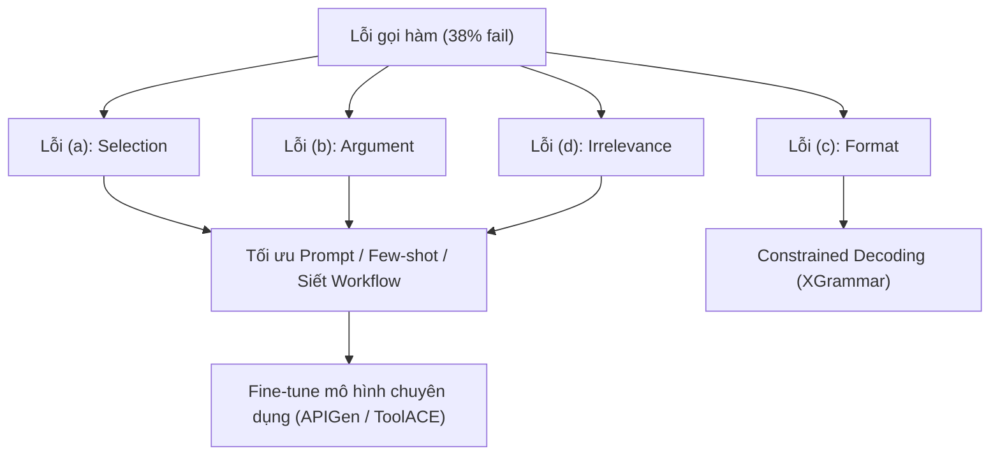
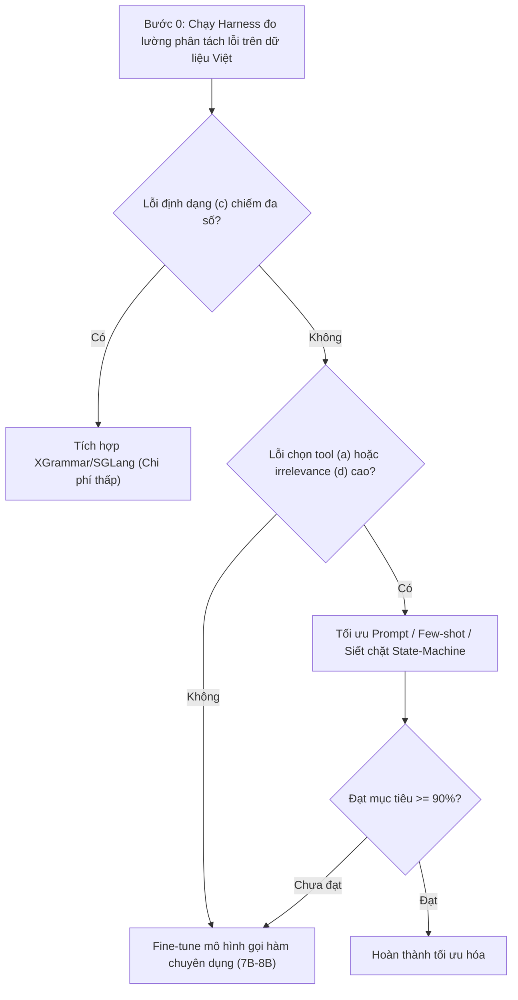

# 06 — LLM Agent và Cơ Chế Gọi Hàm (Tool-Calling) trong Tổng Đài

> [!NOTE]
> Tài liệu này tập trung vào việc chuẩn đoán nguyên nhân gây lỗi của mô hình gọi hàm (Tool-Calling) hiện tại (đạt 61.79% so với mục tiêu $\ge$ 90%), phân tích landscape các giải pháp SOTA, và đề xuất lộ trình vá lỗi từ tối giản đến nâng cao.
>
> Phần lõi điều phối hội thoại (orchestration) và quản lý state — nơi ráp tool-calling và barge-in vào một hệ — tách riêng ở [**06.01 — Orchestration và State**](01_orchestration_state.md).
> Cơ chế tool-call theo taxonomy 4 loại tool của FCI + grounding tham số từ state/goal (nơi điểm đau 62% thực sự rò rỉ) ở [**06.02 — Tool-call: tham số, state, goal**](02_tool_call_grounding.md).
> Ba tầng chất lượng tool-call (quyết-định-gọi/chọn-hàm · cú-pháp/danh-sách-tham-số · giá-trị) — mổ con số 62% để chọn đúng đòn bẩy vá — ở [**06.03 — Ba tầng chất lượng tool-call**](03_tool_calling_stages.md).
> Kiến trúc & thư viện hiện thực tool-calling dưới tầng prompting (constrained decoding, structured-output lib, model FC fine-tune, agent framework) — map vào 3 bước — ở [**06.04 — Framework/lib hiện thực**](04_tool_call_frameworks.md).
> Ba domain CSKH cụ thể (booking · customer-care · đòi nợ) — kiến trúc mục tiêu + dữ liệu/state phải chuẩn bị + mức guardrail để ghép tool-calling hiệu quả — ở [**06.05 — Ba domain CSKH**](05_cskh_domains.md).
> Lõi tri thức pháp luật tài chính (hai trụ: hiểu/suy-luận pháp lý grounding RAG/KG + tính toán bằng tool deterministic) — ở [**06.06 — Lõi tri thức pháp luật tài chính**](06_financial_law_knowledge.md).

---

## 1. Dẫn dắt bối cảnh

- **Vai trò điều phối nghiệp vụ**:

  - Trong kiến trúc cascade tổng đài, mô hình ngôn ngữ lớn (LLM) đóng vai trò là bộ não điều phối (Orchestrator), chịu trách nhiệm lựa chọn hành động và tương tác với các hệ thống backend thông qua cơ chế gọi hàm.
  - Khả năng thực thi chính xác các lệnh gọi hàm quyết định sự thành bại của các giao dịch tự động.
- **Nghịch lý của khả năng tuân thủ**:

  - Tại sao mô hình LLM có khả năng tuân thủ prompt xuất sắc (~95%) lại thường xuyên thất bại trong việc thực thi các lệnh gọi hàm, với độ chính xác chỉ dừng lại ở mức 61.79%?
  - Sự sụt giảm hiệu năng này thực sự nằm ở việc định dạng cú pháp JSON bị hỏng hay ở việc hiểu sai logic nghiệp vụ khi lựa chọn tham số?
- **Mục tiêu của tài liệu**:

  Tài liệu này sẽ phân loại chi tiết taxonomy lỗi gọi hàm, phân tích hiệu quả thực tế của giải pháp ép cấu pháp (constrained decoding), và xây dựng cây quyết định vá lỗi tối ưu cho hệ thống.

---

## 2. Glossary

Bảng Glossary dưới đây định nghĩa toàn bộ ký hiệu và thuật ngữ viết tắt xuất hiện trong bài:

| Ký hiệu / Thuật ngữ | Tên đầy đủ tiếng Anh                      | Giải nghĩa tiếng Việt                                                                       |
| :---------------------- | :---------------------------------------------- | :---------------------------------------------------------------------------------------------- |
| `LLM`                 | **Large Language Model**                  | Mô hình ngôn ngữ lớn.                                                                      |
| `FC`                  | **Function Calling**                      | Cơ chế gọi hàm / gọi công cụ của mô hình ngôn ngữ.                                  |
| `AST`                 | **Abstract Syntax Tree**                  | Cây cú pháp trừu tượng (dùng để so khớp cấu trúc mã nguồn).                       |
| `CFG`                 | **Context-Free Grammar**                  | Văn phạm phi ngữ cảnh (dùng để định hình cấu trúc sinh text).                       |
| `FSM`                 | **Finite-State Machine**                  | Máy trạng thái hữu hạn (dùng để mask các token không hợp lệ).                       |
| `BFCL`                | **Berkeley Function Calling Leaderboard** | Bảng xếp hạng năng lực gọi hàm của các mô hình ngôn ngữ.                           |
| `AUC`                 | **Area Under Curve**                      | Diện tích dưới đường cong ROC (thước đo độ phân tách của mô hình phân loại). |
| `TTFT`                | **Time to First Token**                   | Thời gian phản hồi ra token đầu tiên của mô hình ngôn ngữ.                           |
| `CCU`                 | **Concurrent Users**                      | Số lượng cuộc gọi đồng thời trong hệ thống.                                           |
| `SOTA`                | **State-of-the-Art**                      | Công nghệ tiên tiến nhất hiện nay.                                                        |
| `OSS`                 | **Open Source Software**                  | Phần mềm mã nguồn mở.                                                                      |
| `VQA`                 | **Visual Question Answering**             | Trả lời câu hỏi dựa trên phân tích hình ảnh.                                          |

---

## 3. Taxonomy Lỗi Gọi Hàm Phải Phân Tách

Lỗi gọi hàm cần được bóc tách thành 4 nhóm độc lập vì mỗi nhóm yêu cầu một giải pháp xử lý kỹ thuật riêng biệt:

| Nhóm lỗi                            | Hành vi lỗi                                                         | Nguyên nhân chính                                                           | Hướng giải quyết                                                                                 |
| :------------------------------------ | :-------------------------------------------------------------------- | :----------------------------------------------------------------------------- | :--------------------------------------------------------------------------------------------------- |
| **(a) Tool Selection**          | Chọn sai công cụ hoặc gọi công cụ sai thời điểm.            | Schema mô tả công cụ mơ hồ, prompt thiếu ví dụ vài mẫu (few-shot).  | Tối ưu hóa prompt, bổ sung few-shot, fine-tune mô hình.                                        |
| **(b) Argument Filling**        | Sai/thiếu tên tham số hoặc gán sai giá trị tham số logic.     | Định nghĩa tham số không rõ ràng, mô hình suy luận kém.             | Mô tả chi tiết schema, few-shot.*(Constrained decoding không giải quyết được lỗi này)*. |
| **(c) Format / Syntax**         | JSON bị hỏng, thiếu ngoặc hoặc sai cú pháp cơ bản.           | Mô hình bị ngắt quãng giữa chừng hoặc mất khả năng sinh cấu trúc. | Áp dụng**Constrained Decoding** (XGrammar, Outlines).                                        |
| **(d) Irrelevance / None-call** | Gọi công cụ khi yêu cầu không cần, hoặc không gọi khi cần. | Khả năng phân loại mức độ liên quan (relevance) của mô hình yếu.   | Tối ưu prompt, bổ sung các mẫu thử thách không gọi tool.                                    |

---

### 3.1 Sơ đồ phân tách lỗi và hướng vá tương ứng

#### Khung đọc sơ đồ phân tách lỗi:

- **Đề bài cần giải**: Xác định giải pháp kỹ thuật phù hợp dựa trên phân loại lỗi gọi hàm.
- **Giả định nền**: Hệ thống đã có hạ tầng đo lường tách biệt các chỉ số lỗi.
- **Ý nghĩa các khối**:
  - `TypeA` đến `TypeD`: Bốn phân nhóm lỗi theo taxonomy.
  - `SolPrompt` / `SolGrammar` / `FT`: Các giải pháp tương ứng đi từ chi phí thấp đến cao.
- **Cách đọc và ứng dụng**: Quy trình hướng giải quyết:
  - Nếu lỗi tập trung ở định dạng (`TypeC`)
    - áp dụng XGrammar;
  - Nếu lỗi tập trung ở ngữ nghĩa (`TypeA`, `TypeB`)
    - tối ưu hóa prompt hoặc chuẩn bị dữ liệu fine-tune.

---

## 4. Landscape Các Mô Hình và Benchmark Gọi Hàm (SOTA)

### 4.1 Berkeley Function Calling Leaderboard (BFCL)

- ⚙️ **Cơ chế**:
  - Benchmark chuẩn hóa sử dụng phương pháp so khớp cây cú pháp trừu tượng (AST matching)
  - so sánh lời gọi hàm của mô hình với ground-truth,
  - kết hợp chạy thực tế (Execution-based) để kiểm tra tính đúng đắn của dữ liệu đầu ra.
- 🔍 **Cách nhận diện**:
  - Được chia thành các category: *simple*, *parallel*, *multiple*, *relevance*, *multi-turn*, và *multi-step*.
- 💡 **Ý nghĩa**:
  - Giúp đánh giá chính xác năng lực gọi hàm trong cả hai chế độ gọi trực tiếp (native) và gọi mô phỏng qua prompt (prompt-based).
- ⚠️ **Bẫy**: Điểm số trên bảng xếp hạng BFCL liên tục cập nhật theo phiên bản (V1 đến V4). Tuyệt đối không so sánh chéo điểm số giữa các phiên bản khác nhau.

---

### 4.2 Đánh giá các họ mô hình chuyên dụng gọi hàm

| Họ mô hình                        | Kích thước tham số | Hiệu năng BFCL                                             | Trọng tâm tối ưu hóa                                |
| :----------------------------------- | :--------------------- | :----------------------------------------------------------- | :------------------------------------------------------- |
| **xLAM / xLAM-2 (Salesforce)** | 1B - 8B+               | Đạt Top-1 BFCL (tháng 4/2025).                            | Tối ưu hóa cho các tác vụ Agentic hành động.    |
| **ToolACE-8B**                 | 8B                     | Đạt**91.41%** (BFCL-v1), **85.77%** (BFCL-v2). | Vượt qua GPT-4-1106 trên tập dữ liệu thử nghiệm. |
| **Hammer-7B**                  | 7B                     | Đạt Rank-2 BFCL tổng thể.                                | Tích hợp cơ chế che giấu hàm (function masking).   |
| **Qwen3 (32B)**                | 32B                    | Đạt**~75.7%** (BFCL-v3).                             | Mạnh về đa ngôn ngữ và suy luận logic.            |

- **Ý nghĩa thực tiễn**: Các bằng chứng khoa học cho thấy các mô hình cỡ nhỏ (7B - 8B) được fine-tune đúng phương pháp hoàn toàn có thể vượt qua các mô hình thương mại đóng lớn ở tác vụ gọi hàm.

---

## 5. Constrained Decoding: Phạm Vi Giải Quyết Thực Tế

Kỹ thuật giải mã ràng buộc can thiệp trực tiếp vào bước sinh token của mô hình để đảm bảo đầu ra hợp lệ định dạng.

- **Các thư viện chính**:
  - **XGrammar**: Đang là backend mặc định của vLLM và SGLang nhờ tốc độ sinh nhanh (<40µs/token cho JSON Schema).
  - **Outlines & LLGuidance**: Cung cấp cơ chế xây dựng FSM chặt chẽ, giảm tỷ lệ lỗi cú pháp xuống mức <0.2%.
- **Giới hạn kỹ thuật then chốt**:
  - **Không giải quyết lỗi logic**:
    - Kỹ thuật này chỉ cam kết văn bản sinh ra đúng cấu trúc JSON,
    - Không giúp mô hình chọn đúng tên tool hay điền chính xác giá trị tham số.
  - **Overhead trong hệ thống realtime**:
    - Việc biên dịch FSM cho một JSON schema mới tiêu tốn từ 50ms đến 200ms ở lần chạy đầu tiên.
    - Khi CCU = 100 và batch size lớn, constrained decoding có thể làm sụt giảm thông lượng (throughput) của vLLM.
    - Cần thực hiện kiểm thử tải thực tế trước khi cấu hình hàng loạt.

---

## 6. Luồng Xử Lý 2-Pass và Agentic Orchestration

- **Luồng 2-Pass (Tách biệt hai lượt xử lý)**:
  - *Lượt 1*: LLM nhận input của người dùng và chỉ sinh ra lời gọi hàm JSON sạch (áp dụng constrained decoding tối đa).
  - *Lượt 2*: Hệ thống thực thi hàm, lấy kết quả trả về nạp lại vào LLM để sinh câu trả lời tự nhiên cho khách hàng.
  - *Đánh đổi*: Làm tăng gấp đôi độ trễ TTFT do phải gọi LLM hai lần liên tiếp. Chỉ áp dụng cho các tác vụ không yêu cầu thời gian thực nghiêm ngặt.
- **Orchestration dựa trên State-Machine (LangGraph)**:
  - Xu hướng thiết kế agent hiện đại chuyển dịch từ mô hình tự do (free-agent) sang mô hình kiểm soát bằng máy trạng thái (workflow-controlled).
  - Định nghĩa tường minh các node trạng thái và đường chuyển tiếp giúp hệ thống kiểm soát chặt chẽ luồng nghiệp vụ tổng đài.
  - Thiết kế này tương đồng với giải pháp gọi hàm mô phỏng (simulated tool-calling) của hệ nội bộ và cần được duy trì để bảo đảm tính an toàn giao dịch.

---

## 7. Cây Quyết Định Vá Lỗi Cho Hệ Thống Nội Bộ

Quy trình vá lỗi được thực hiện tuần tự từ chi phí thấp đến cao để tối ưu hóa tài nguyên:

#### Khung đọc sơ đồ cây quyết định:

- **Đề bài cần giải**: Lựa chọn giải pháp vá lỗi gọi hàm tối ưu về mặt chi phí và hiệu quả.
- **Giả định nền**: Kỹ sư đã có dữ liệu phân tách lỗi từ Bước 0.
- **Ý nghĩa các khối**:
  - `ApplyXG`: Giải pháp can thiệp tầng giải mã.
  - `OptPrompt`: Giải pháp can thiệp tầng kỹ nghệ prompt.
  - `FTFC`: Giải pháp can thiệp tầng huấn luyện trọng số mô hình.
- **Cách đọc và ứng dụng**: Đi theo các nhánh điều kiện; đảm bảo không chuyển sang bước huấn luyện lại mô hình (FTFC) tốn kém nếu chưa tối ưu hóa prompt hoặc tích hợp bộ lọc grammar.

---

## 8. Bằng Chứng Thực Nghiệm và Khoảng Trống Tiếng Việt

- **Thực trạng dữ liệu benchmark**:
  - Hoàn toàn **chưa có bộ dữ liệu benchmark công khai** cho tác vụ gọi hàm (tool-calling) bằng tiếng Việt.
  - Các bộ benchmark tiếng Việt hiện tại như VMLU chỉ tập trung vào đánh giá tri thức tổng hợp hoặc suy luận ngữ nghĩa cơ bản.
- **Giải pháp cho dự án**:
  - Dự án bắt buộc phải tự xây dựng tập dữ liệu đánh giá gọi hàm (evaluation set) dựa trên các log hội thoại cuộc gọi thực tế của tổng đài.
  - Biên dịch tập dữ liệu này sang định dạng chuẩn tương thích với BFCL harness để phục vụ đo lường nội bộ.

---

## 9. ✅ Tự Kiểm Nhanh

<b>Câu hỏi 1: Tại sao nói việc tích hợp thư viện Constrained Decoding (như XGrammar) chỉ giải quyết được một phần của bài toán nâng cao độ chính xác gọi hàm?</b>

- **Phạm vi tác động của Constrained Decoding**:
  - Thư viện này chỉ can thiệp vào tầng sinh token để ép đầu ra tuân thủ đúng cú pháp định dạng (ví dụ: JSON không bị thiếu ngoặc, đúng kiểu dữ liệu).
  - Nó hoàn toàn không hiểu ngữ nghĩa của tác vụ. Nếu mô hình ngôn ngữ quyết định chọn sai công cụ (`Tool Selection Error`) hoặc điền sai giá trị tham số logic (`Argument Value Error`), XGrammar vẫn sẽ sinh ra một chuỗi JSON hợp lệ cấu trúc nhưng hoàn toàn sai về mặt nghiệp vụ.
  - Do đó, XGrammar chỉ vá được nhóm lỗi định dạng (c), không thể cứu được các lỗi logic nhóm (a) và (b).

<b>Câu hỏi 2: Sự khác biệt trong việc đánh giá gọi hàm bằng phương pháp khớp cây cú pháp (AST Matching) so với so khớp chuỗi văn bản thô (String Matching)?</b>

- **So khớp chuỗi văn bản thô**:
  - So sánh trực tiếp chuỗi ký tự sinh ra với đáp án chuẩn.
  - Dễ bị chấm sai khi mô hình sinh đúng tham số nhưng thay đổi thứ tự các key trong JSON, hoặc thêm bớt các khoảng trắng, dấu xuống dòng vô hại.
- **So khớp cây cú pháp trừu tượng (AST Matching)**:
  - Phân tích chuỗi JSON sinh ra thành cấu trúc cây logic (bao gồm tên hàm và các cặp key-value của đối số).
  - So sánh cấu trúc cây này với cây logic của đáp án chuẩn.
  - Giúp đánh giá chính xác bản chất logic của lời gọi hàm, loại bỏ hoàn toàn các sai lệch về mặt định dạng khoảng trắng hoặc thứ tự hiển thị.

<b>Câu hỏi 3: Lợi ích của kiến trúc workflow-controlled (như LangGraph) đối với tính an toàn của hệ thống tổng đài tự động?</b>

- **Hạn chế của mô hình Free-Agent**:
  - Mô hình tự do được quyền tự quyết định chọn gọi bất kỳ công cụ nào tại bất kỳ thời điểm nào dựa trên prompt. Dễ bị hiện tượng ảo giác gọi sai công cụ hoặc bị tấn công prompt-injection để kích hoạt các hàm nguy hiểm.
- **Ưu thế của Workflow-Controlled**:
  - Ràng buộc không gian hành động của mô hình trong một máy trạng thái hữu hạn. Tại mỗi bước hội thoại, mô hình chỉ được phép lựa chọn một tập công cụ giới hạn tương ứng với trạng thái đó.
  - Giúp kiểm soát chặt chẽ luồng nghiệp vụ tổng đài, dễ dàng debug và cô lập lỗi khi có sự cố xảy ra.

