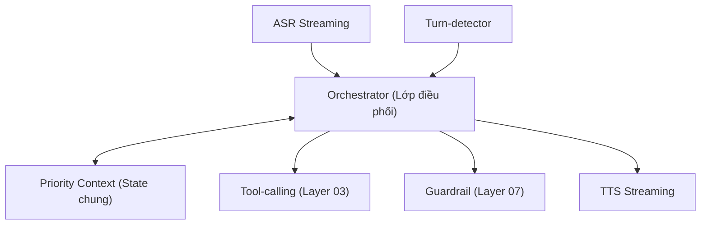
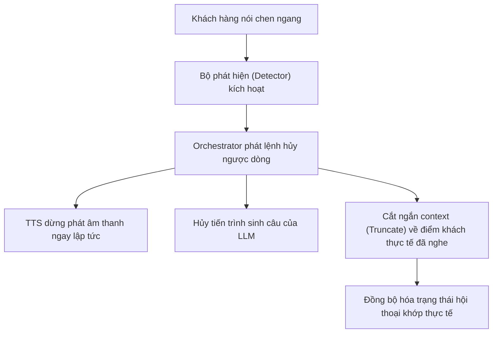
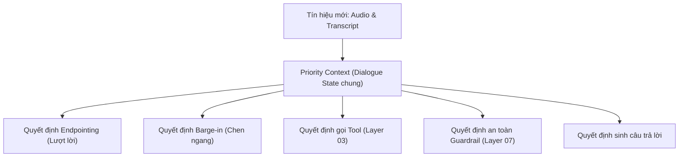

# 06.01 — Lõi Điều Phối Hội Thoại: Kiến Trúc Orchestration và Quản Lý State

> [!NOTE]
> Tài liệu này phân tích lớp điều phối trung tâm (Orchestration) và cơ chế quản lý trạng thái (State Management) trong hệ thống Voice AI Agent.
> Đây là chốt chặn quan trọng ráp nối hai điểm đau cốt lõi: Quản lý chen ngang (barge-in - thuộc Layer 05) và gọi hàm (tool-calling - thuộc Layer 06) thành một hệ vận hành đồng nhất thời gian thực.

---

## 1. Dẫn dắt bối cảnh

- **Tình huống hội thoại tổng đài thực tế**:
  - Hãy tưởng tượng một kịch bản cuộc gọi: Bot đang đọc dở thông tin "Số dư tài khoản của anh là ba triệu năm trăm...", khách hàng lập tức chen ngang "À khoan, thế còn phí thường niên năm nay thế nào?".
  - Hệ thống lúc này bắt buộc phải dừng phát âm thanh ngay lập tức, ghi nhớ chính xác bot đã đọc đến từ nào, hiểu được ý định thay đổi chủ đề của khách hàng, và quyết định xem có cần gọi API để truy vấn thông tin phí hay không.

- **Nghịch lý của các quyết định hội thoại**:
  - Tại sao cùng một tiếng đệm "dạ" của khách hàng, lúc thì khiến bot dừng lại hoàn toàn, lúc thì lại được bỏ qua để bot tiếp tục trình bày?
  - Tại sao cùng một câu hỏi của khách hàng, lúc thì kích hoạt API truy vấn cơ sở dữ liệu, lúc thì bot lại trả lời trực tiếp từ bộ nhớ?

- **Mục tiêu của tài liệu**:
  
  Sự khác biệt trên không được quyết định bởi các mô hình đơn lẻ, mà là nhờ **lớp điều phối cầm luồng tín hiệu (Orchestrator)** kết hợp với **trạng thái hội thoại toàn cục (Dialogue State)**. Tài liệu này mổ xẻ cơ chế điều phối tốc độ cao (Trục A), quy trình theo dõi trạng thái DST (Trục B), và phương pháp áp dụng priority context để điều kiện hóa mọi quyết định (Trục C).

---

## 2. Glossary

Bảng Glossary dưới đây định nghĩa toàn bộ ký hiệu và thuật ngữ viết tắt xuất hiện trong tài liệu này:

| Ký hiệu / Thuật ngữ | Tên đầy đủ tiếng Anh | Giải nghĩa tiếng Việt |
| :--- | :--- | :--- |
| `Orchestrator` | **Orchestrator** | Lớp điều phối trung tâm phối hợp các module (ASR, Turn-detector, LLM, Tool, Guardrail, TTS). |
| `Frame` | **Frame** | Đơn vị dữ liệu nhỏ (audio, text, control) truyền tải trong pipeline. |
| `FrameProcessor` | **Frame Processor** | Module trung gian thực hiện xử lý hoặc biến đổi các Frame dữ liệu. |
| `AgentSession` | **Agent Session** | Thực thể quản lý phiên cuộc gọi thời gian thực của LiveKit. |
| `StateGraph` | **State Graph** | Đồ thị node/edge mô tả máy trạng thái hội thoại. |
| `DST` | **Dialogue State Tracking** | Tiến trình theo dõi và cập nhật trạng thái hội thoại qua từng lượt. |
| `JGA` | **Joint Goal Accuracy** | Tỷ lệ đoán chính xác toàn bộ các slot thông tin trong một lượt thoại. |
| `EOU` / `EOT` | **End-of-Utterance / End-of-Turn** | Tín hiệu phát hiện điểm kết thúc phát ngôn hoặc lượt nói của người dùng. |
| `VAD` | **Voice Activity Detection** | Bộ phát hiện hoạt động giọng nói. |
| `TTFT` | **Time to First Token** | Thời gian trễ sinh token đầu tiên của mô hình ngôn ngữ. |
| `TTFA` | **Time to First Audio** | Thời gian trễ phát tín hiệu âm thanh đầu tiên của bộ TTS. |
| `PDL` | **Procedure Description Language** | Ngôn ngữ mô tả quy trình hội thoại kết hợp giữa luật cứng và ngôn ngữ tự nhiên. |
| `NSW` | **Non-Standard Word** | Từ không chuẩn (số, viết tắt, ký hiệu tiền tệ) cần chuẩn hóa. |

---

## 3. Khung Bài Toán: Trách Nhiệm Của Bộ Điều Phối

### 3.1 Khái niệm lớp điều phối hội thoại (Orchestrator)
- ⚙️ **Cơ chế**:
  - Quản lý và đồng bộ luồng tín hiệu âm thanh vào/ra theo thời gian thực.
  - Đọc, cập nhật và đồng bộ trạng thái hội thoại toàn cục (Dialogue State).
  - Định tuyến dữ liệu bất đồng bộ đến các module thành phần (ASR, Turn-detector, LLM, Tools, Guardrails, TTS).
- 🔍 **Cách nhận diện**:
  - Đối tượng session hoặc pipeline chạy xuyên suốt vòng đời cuộc gọi. Mọi module con chỉ giao tiếp trực tiếp với orchestrator, không gọi chéo lẫn nhau.
- 💡 **Ý nghĩa**:
  - Là trái tim của hệ thống voice-agent, tích hợp hai điểm đau barge-in và tool-calling vào một trục thời gian đồng bộ, làm bệ đỡ cho tính tự nhiên của hội thoại.
- ⚠️ **Bẫy**:
  - Tránh hiểu lầm hệ thống voice-bot chỉ là một mô hình ngôn ngữ lớn (LLM) đơn thuần. Phần lớn độ phức tạp nằm ở lớp điều phối bất đồng bộ này.

### 3.2 Các đại lượng gốc (First-Principles)
- Toàn bộ kiến trúc hệ thống được điều khiển bởi 3 đại lượng nguyên tử:
  - **Thời gian ($T$)**: Tín hiệu âm thanh thoại là luồng liên tục, mọi quyết định xử lý đều bị ràng buộc bởi đồng hồ vật lý thời gian thực.
  - **Trạng thái ($State$)**: Tập hợp toàn bộ thông tin đã thu thập và ngữ cảnh hiện tại của cuộc gọi.
  - **Ngân sách độ trễ ($Latency\ Budget$)**: Giới hạn thời gian (tính bằng miligiây) cho phép đối với mỗi hành động để đảm bảo phản xạ tự nhiên.
- **Luật nền tảng**: Mọi quyết định xử lý trong hội thoại (ngắt lời, gọi tool, trả lời) đều là một hàm số của trạng thái hiện tại và tín hiệu mới nhận dưới sự ràng buộc nghiêm ngặt về mặt độ trễ:
  $$Decision = f(State, Signal) \quad \text{under} \quad Latency \le Target$$

---

## 4. Trục A — Kiến Trúc Điều Phối Tốc Độ Cao và Xử Lý Chen Ngang

### 4.1 Bốn paradigm điều phối trong công nghiệp

| Paradigm | Mô hình đại diện | Đơn vị điều phối chính | Ưu thế đối với tổng đài realtime |
| :--- | :--- | :--- | :--- |
| **Frame-based** | Pipecat (NVIDIA ACE Controller) | `Frame` truyền qua chuỗi `FrameProcessor` | Xử lý barge-in cực tốt: Tín hiệu ngắt lời được đóng gói thành một Frame ưu tiên cao, tự động lan truyền để triệt tiêu các frame âm thanh đang xếp hàng phía sau. |
| **Session-based** | LiveKit Agents | `AgentSession` quản lý phiên | Độc lập trạng thái cho mỗi cuộc gọi; tích hợp sẵn turn-detector; dễ dàng phân tải qua worker pool. |
| **Graph / State-machine** | LangGraph, Rasa | Node và Edge mang state chung | Đảm bảo tính tất định; cưỡng chế luồng nghiệp vụ đi đúng kịch bản tài chính. |
| **Event-driven** | OpenAI / Gemini (WebSocket) | Event truyền nhận trên kênh chung | Hỗ trợ tốt các sự kiện barge-in bất đồng bộ; đòi hỏi kiểm soát chặt chẽ thứ tự gói tin để tránh race conditions. |

- **Giải pháp tối ưu cho FCI**:
  - Sử dụng kiến trúc lai: Dùng **Frame-based** (Pipecat) hoặc **Session-based** (LiveKit) để điều phối trực tiếp luồng audio thời gian thực, kết hợp với **State-machine** (LangGraph) ở tầng nền làm bộ não điều phối nghiệp vụ (routing/guardrail).
  - NVIDIA ACE Controller cũng được xây dựng dựa trên nền tảng Frame-based của Pipecat.

---

#### Sơ đồ A1 — Orchestrator làm trung tâm điều phối và quản lý state chung

##### Khung đọc sơ đồ A1:
- **Đề bài cần giải**: Trực quan hóa vai trò trung gian điều phối của Orchestrator và sự tương tác đọc-ghi với trạng thái chung (State).
- **Giả định nền**: Luồng tín hiệu thoại viễn thông 8kHz hoạt động liên tục, các module chạy song song bất đồng bộ.
- **Ý nghĩa các khối**:
  - `ORC`: Lớp điều phối trung tâm.
  - `STATE`: Bộ nhớ trạng thái chung (mũi tên hai chiều thể hiện thao tác đọc và ghi liên tục).
  - Các khối khác: Các module nghiệp vụ con.
- **Cách đọc và ứng dụng**: Mọi module không giao tiếp trực tiếp mà phải thông qua Orchestrator; Orchestrator liên tục cập nhật và đối chiếu với State để đưa ra quyết định đồng bộ, đảm bảo tính nhất quán của hành động.

---

### 4.2 Định lượng ngân sách độ trễ cảm nhận ($T_{\text{percv}}$)
- **Độ trễ cảm nhận thực tế**:
  - Tổng thời gian khách hàng chờ đợi phản hồi của bot được tính toán theo công thức dưới đây:
    $$T_{\text{percv}} \approx T_{\text{trans}} + T_{\text{stt}} + T_{\text{ttft}} + T_{\text{ttfa}}$$
  - Trong đó:
    - **$T_{\text{percv}}$**: Độ trễ khách hàng cảm nhận thực tế (**Perceived Latency**), đơn vị tính bằng miligiây (ms).
    - **$T_{\text{trans}}$**: Độ trễ truyền dẫn tín hiệu qua mạng viễn thông (**Transport Delay**). Ngưỡng tham chiếu: $\le 50$ ms ⚠️.
    - **$T_{\text{stt}}$**: Độ trễ giải mã ra phân đoạn văn bản đầu tiên của ASR (**STT Latency**). Ngưỡng tham chiếu: $100 - 200$ ms ⚠️.
    - **$T_{\text{ttft}}$**: Độ trễ sinh ra token đầu tiên của mô hình ngôn ngữ (**Time-to-First-Token**). Ngưỡng tham chiếu: $200 - 400$ ms ⚠️. *Đây là nút thắt chiếm tỷ trọng lớn nhất*.
    - **$T_{\text{ttfa}}$**: Độ trễ tổng hợp và phát ra frame âm thanh đầu tiên của TTS (**Time-to-First-Audio**). Ngưỡng tham chiếu: $100 - 300$ ms ⚠️.
  - **Mục tiêu trải nghiệm tự nhiên**: Tổng thời gian $T_{\text{percv}}$ phải nằm trong khoảng $< 1000$ ms ⚠️.

- **Các kỹ thuật tăng tốc song song**:
  - *Streaming + Pipelining*: Cho phép LLM sinh văn bản cuốn chiếu và TTS tổng hợp âm thanh ngay lập tức cho các câu ngắn, tạo sự chồng lấn thời gian (overlap) thay vì chờ đợi tuần tự.
  - *Speculative Execution*: Dự đoán trước các câu hỏi tiếp theo dựa trên trạng thái hiện tại để chuẩn bị sẵn dữ liệu hoặc luồng sinh TTS (Speculative TTS).
  - *Filler Speech*: Chủ động phát các câu đệm tự nhiên (ví dụ: "Dạ, anh chờ em kiểm tra thông tin này một lát nhé...") để lấp đầy khoảng lặng khi chờ đợi các API gọi tool hoạt động.

---

### 4.3 Xử lý chen ngang (Barge-in) ở tầng hệ thống
- ⚙️ **Cơ chế**:
  - Khi phát hiện có tín hiệu ngắt lời hợp lệ, orchestrator lập tức thực hiện 3 bước đồng bộ:
    1. **Phát lệnh hủy (Cancel)**: Truyền tín hiệu hủy ngược dòng để dừng ngay lập tức bộ đọc TTS và ngắt luồng sinh của LLM.
    2. **Cắt ngắn ngữ cảnh (Truncate)**: Xác định chính xác vị trí thời gian khách hàng ngắt lời để cắt bỏ phần văn bản/âm thanh bot đã sinh ra trên server nhưng khách hàng chưa thực tế nghe thấy.
    3. **Đồng bộ trạng thái (Sync)**: Cập nhật lại history chat về đúng điểm cắt để làm ngữ cảnh chuẩn xác cho lượt suy luận tiếp theo.
- 🔍 **Cách nhận diện**:
  - Trong Pipecat: Kích hoạt `UserStartedSpeakingFrame` để truyền phát `StartInterruptionFrame` hủy output.
  - Trong OpenAI Realtime: Gọi lệnh `conversation.item.truncate` đi kèm tham số `audio_end_ms` để cắt bỏ phần âm thanh thừa.
- 💡 **Ý nghĩa**:
  - Nếu không cắt ngắn ngữ cảnh (truncate), LLM sẽ lưu giữ lịch sử rằng nó đã đọc xong thông tin số dư tài khoản, trong khi khách hàng mới nghe được một nửa $\rightarrow$ Dẫn đến việc suy luận sai lệch ở các lượt tiếp theo.
- ⚠️ **Bẫy**:
  - *Lỗi ngắt lời giả (False Barge-in)*: Các tiếng ồn môi trường hoặc tiếng thở mạnh bị VAD nhận diện nhầm làm dừng bot liên tục.
  - *Mất đồng bộ context*: Thứ tự các frame điều khiển bị đảo lộn khiến session bị đóng băng hoặc lặp lại câu thoại cũ.

---

#### Sơ đồ A2 — Tiến trình xử lý chen ngang hệ thống: Phát hiện, Hủy và Cắt ngữ cảnh

##### Khung đọc sơ đồ A2:
- **Đề bài cần giải**: Chuẩn hóa 3 bước xử lý đồng bộ khi khách hàng chen ngang ngắt lời bot.
- **Giả định nền**: Luồng truyền âm thanh hoạt động bất đồng bộ; tốc độ sinh của server luôn nhanh hơn tốc độ nghe thực tế của khách hàng.
- **Ý nghĩa các khối**:
  - `CANCEL`: Tín hiệu điều khiển trung tâm để triệt tiêu tài nguyên thừa.
  - `TRUNC`: Khâu tính toán cắt ngắn ngữ cảnh dựa trên mốc thời gian thực tế.
  - `SYNC`: Trạng thái đích bảo đảm tính nhất quán.
- **Cách đọc và ứng dụng**: Các nhánh từ `CANCEL` được thực hiện đồng thời; nhấn mạnh bước `TRUNC` là điều kiện bắt buộc để bảo vệ sự chính xác của Dialogue State ở chặng sau.

---

## 5. Trục B — Theo Dõi và Cập Nhật Trạng Thái Hội Thoại (DST)

### 5.1 Khái niệm theo dõi trạng thái hội thoại (DST)
- ⚙️ **Cơ chế**:
  - Trạng thái hội thoại (Belief State) được cấu thành từ tập hợp các ô thông tin cần điền (slots) và loại hành vi hội thoại (dialogue act) ở mỗi lượt.
  - DST chịu trách nhiệm cập nhật liên tục các giá trị này qua từng lượt nói để giữ vững ngữ cảnh nghiệp vụ.
- 🔍 **Cách nhận diện**:
  - Trong các hệ thống hiện đại, schema của một domain nghiệp vụ được định nghĩa như một cấu trúc hàm (Function Schema).
  - DST được thực thi bằng cách ép LLM gọi hàm (Function Calling), trong đó **Belief State chính là các tham số của lời gọi hàm** (hướng FnCTOD).
- 💡 **Ý nghĩa**:
  - Trạng thái tường minh là nguồn dữ liệu chuẩn để điều kiện hóa mọi quyết định định tuyến và gọi tool ở chặng sau.
- ⚠️ **Bẫy**:
  - Các mô hình ngôn ngữ lớn (LLM) sinh hội thoại tự do không mặc định vượt trội hơn các mô hình điền slot (slot-filling) cổ điển về mặt duy trì trạng thái tường minh.
  - Cần duy trì các bộ lọc slot để tránh hiện tượng LLM quên thông tin khi hội thoại kéo dài.

- **Định lượng hiệu năng DST bằng chỉ số Joint Goal Accuracy ($JGA$)**:
  - Chỉ số $JGA$ đánh giá độ chính xác của việc dự đoán trạng thái hội thoại theo công thức:
    $$JGA = \frac{N_{\text{correct}}}{N_{\text{total}}}$$
  - Trong đó:
    - **$JGA$**: Tỷ lệ chính xác mục tiêu chung (**Joint Goal Accuracy**).
    - **$N_{\text{correct}}$**: Số lượng lượt thoại mà hệ thống đoán **chính xác hoàn toàn tất cả các slot** thông tin cần thiết.
    - **$N_{\text{total}}$**: Tổng số lượt thoại thực hiện đánh giá.
  - *Đặc trưng*: Chỉ số này phạt rất nặng nếu hệ thống đoán sai dù chỉ một slot thông tin nhỏ trong câu.

---

### 5.2 Ba trường phái lưu trữ mô hình dữ liệu state

| Trường phái | Mô hình đại diện | Cơ chế lưu trữ trạng thái | Hệ quả đối với hệ thống |
| :--- | :--- | :--- | :--- |
| **Event-sourced** | Rasa (Tracker) | Lưu trữ chuỗi các sự kiện (events) bất biến theo thời gian. Trạng thái hiện tại được dựng lại bằng cách cuộn (fold) toàn bộ chuỗi sự kiện từ đầu. | Dễ dàng tái hiện kịch bản (replay) và khôi phục lỗi; các slot thông tin hoạt động như các thuộc tính phái sinh. |
| **Snapshot / State-channel** | LangGraph | Ghi nhận một ảnh chụp trạng thái (snapshot) sau khi kết thúc xử lý tại mỗi node. Sử dụng các hàm `reducer` để gộp dữ liệu. | Hỗ trợ cực tốt tính năng quay ngược thời gian (time-travel) và tiếp tục phiên (resume) khi mất kết nối. |
| **Message-list append** | Pipecat, LiveKit, OpenAI | Duy trì một danh sách các tin nhắn (messages) được nối dài liên tục kết hợp với kết quả trả về của tool. | Đơn giản, dễ lập trình, phù hợp cho các luồng realtime; đòi hỏi tự xây dựng module lưu trữ ngoài nếu muốn duy trì dài hạn. |

---

## 6. Trục C — Priority Context và Cơ Chế Điều Kiện Hóa Quyết Định

### 6.1 Priority Context làm tín hiệu điều khiển hành vi
Dialogue State đóng vai trò là "Priority Context" dùng chung (Shared Blackboard) để điều kiện hóa 5 quyết định cốt lõi của bot tại mỗi lượt thoại:

- **Quyết định kết thúc câu (Endpointing)**:
  - *Heuristics*: LiveKit Turn Detector chỉ dựa trên phân tích lượt nói hiện tại để tối ưu hóa latency.
  - *Context-aware*: Sử dụng Dialogue State và lịch sử hội thoại để phán đoán xem câu nói đã trọn vẹn ý nghĩa ngữ pháp chưa, tránh ngắt lời sai khi khách hàng ngập ngừng.
- **Quyết định ngắt lời (Barge-in)**:
  - Phân biệt tiếng đệm backchannel hay ngắt lời thật dựa trên trạng thái bot đang trình bày thông tin quan trọng hay thông tin phụ.
- **Quyết định gọi công cụ (Tool Selection)**:
  - Ràng buộc các API được phép gọi dựa theo trạng thái bước nghiệp vụ hiện hành, ngăn chặn việc gọi nhầm các tool không liên quan.
- **Quyết định kiểm soát an toàn (Guardrails)**:
  - Kích hoạt các bộ lọc an toàn tương ứng với từng bước (ví dụ: Chỉ kích hoạt bộ lọc OTP khi bot đang ở trạng thái xác thực danh tính).
- **Quyết định sinh câu trả lời (Response Generation)**:
  - Điều kiện hóa nội dung sinh của LLM bám sát mục tiêu của bước hiện tại.

---

#### Sơ đồ C1 — Priority Context làm đầu vào điều kiện hóa năm quyết định hội thoại

##### Khung đọc sơ đồ C1:
- **Đề bài cần giải**: Thể hiện vai trò quyết định của một trạng thái chung (Dialogue State) đối với tất cả các hành vi phản xạ của bot.
- **Giả định nền**: Trạng thái Priority Context được cập nhật đồng bộ sau mỗi lượt thoại.
- **Ý nghĩa các khối**:
  - `PCTX`: Trọng tâm lưu trữ thông tin chung.
  - Các khối `D*`: Các quyết định hành vi độc lập của bot.
- **Cách đọc và ứng dụng**: Mọi quyết định của bot đều được cấu hình và điều khiển bởi một nguồn thông tin duy nhất (`PCTX`), đảm bảo tính đồng bộ và tránh việc các module đưa ra các quyết định mâu thuẫn nhau.

---

### 6.2 Cơ chế kiểm soát luồng (Flow Control) và bài toán gọi hàm giả lập
- **So sánh 3 hướng thiết kế kiểm soát luồng**:
  - *Workflow-driven (State-machine)*: Sử dụng các sơ đồ kịch bản cứng (như Pipecat Flows, Rasa stories). Chuyển bước hội thoại bằng các function call tường minh. Hướng đi này cưỡng chế quy trình nghiệp vụ rất mạnh.
  - *LLM-driven (Agent tự do)*: Cho phép LLM tự quyết định hướng đi bằng prompt hoặc ReAct. Linh hoạt cao nhưng khả năng bám quy trình nghiệp vụ rất kém.
  - *Hybrid (FlowAgent)*: Sử dụng ngôn ngữ mô tả quy trình PDL kết hợp các bộ giám sát (controllers) nằm ngoài LLM để vừa bám sát quy trình vừa xử lý linh hoạt các câu hỏi ngoài lề.
- **Đối chiếu với giải pháp "Simulated Tool-Calling" của FCI**:
  - Giải pháp sử dụng fake tool `what_should_I_do_next` của FCI thực chất là một dạng **dự đoán hành động kế tiếp dựa trên trạng thái (next-action prediction)** $\rightarrow$ Trùng khớp với triết lý thiết kế Flows của Pipecat.
  - **Rủi ro kỹ thuật**: FCI nhúng bộ điều hướng này trực tiếp vào cơ chế tool-calling của LLM. Do đó, chất lượng điều hướng bị phụ thuộc hoàn toàn vào độ chính xác gọi hàm của mô hình (đang là điểm đau chỉ đạt 61.79%). Cần cân nhắc hướng thiết kế của FlowAgent: Tách bộ giám sát (controller) ra ngoài để giảm tải cho LLM.

---

## 7. Danh Mục Nguồn Tham Chiếu Chi Tiết

### 7.1 Bài báo khoa học (arXiv / Hội nghị)

| Link tài liệu | Nội dung chứng minh | Trạng thái |
| :--- | :--- | :--- |
| [arXiv:2402.10466](https://arxiv.org/abs/2402.10466) | Thiết lập phương pháp FnCTOD sử dụng cơ chế gọi hàm để theo dõi trạng thái DST. | ✅ Nguồn mạnh (ACL 2024). |
| [arXiv:2310.14970](https://arxiv.org/abs/2310.14970) | Khảo sát sự chuyển dịch từ các bộ điền slot truyền thống sang generative DST. | ✅ Nguồn mạnh. |
| [arXiv:2503.08857](https://arxiv.org/abs/2503.08857) | Ứng dụng kỹ thuật tóm tắt ngôn ngữ tự nhiên làm bộ nhớ trạng thái hội thoại. | ✅ Nguồn mạnh. |
| [arXiv:2502.14345](https://arxiv.org/abs/2502.14345) | Kiến trúc FlowAgent kết hợp PDL và controller ngoài để giữ tính compliance. | ✅ Nguồn mạnh. |
| [arXiv:2510.04371](https://arxiv.org/pdf/2510.04371) | Kỹ thuật Speculative Actions giúp giảm từ 2 đến 5 lần độ trễ hệ thống. | ⚠️ Preprint rất mới. |
| [arXiv:2507.01701](https://arxiv.org/pdf/2507.01701) | Ứng dụng kiến trúc bảng tin dùng chung (Blackboard) cho hệ thống đa tác nhân. | ⚠️ Preprint rất mới. |
| [arXiv:2510.01285](https://arxiv.org/abs/2510.01285) | Đo lường hiệu quả trao đổi thông tin của kiến trúc Blackboard trong phân tích dữ liệu. | ⚠️ Preprint rất mới. |
| [arXiv:2506.02264](https://arxiv.org/pdf/2506.02264) | Phương pháp căn chỉnh CoDial phục vụ thiết lập guardrail dòng hội thoại. | ⚠️ Preprint rất mới. |
| [arXiv:2601.08158](https://arxiv.org/html/2601.08158) | Mô hình WISE-Flow lựa chọn hành động tối ưu dựa trên trạng thái thế giới thực. | ⚠️ Preprint (2026). |

---

### 7.2 Tài liệu Kỹ thuật từ Framework chính thức

- **Pipecat Pipeline & Frame Processing**:
  - Link: [Pipecat Developer Guide](https://docs.pipecat.ai/guides/learn/pipeline)
  - Nội dung: Hướng dẫn cơ chế truyền dẫn Frame qua các Processor và xử lý bất đồng bộ.
- **Pipecat Flows Specification**:
  - Link: [Pipecat Flows Guide](https://docs.pipecat.ai/guides/features/pipecat-flows)
  - Nội dung: Đặc tả việc quản lý trạng thái hội thoại dạng State-machine và chuyển bước bằng function call.
- **OpenAI Realtime Guide**:
  - Link: [OpenAI Developer Documentation](https://platform.openai.com/docs/guides/realtime-conversations)
  - Nội dung: Hướng dẫn sử dụng sự kiện `conversation.item.truncate` để đồng bộ hóa context khi có ngắt lời.
- **NVIDIA Tokkio/ACE Architecture**:
  - Link: [NVIDIA ACE Documentation](https://docs.nvidia.com/ace/tokkio/5.0/overview/architecture.html)
  - Nội dung: Đặc tả kiến trúc ACE Controller được xây dựng dựa trên nền tảng Pipecat.

---

## 8. ✅ Tự Kiểm Nhanh

<b>Câu hỏi 1: Tại sao bước cắt ngắn ngữ cảnh (Conversation Truncation) lại được coi là khâu tinh tế và bắt buộc phải có khi xử lý ngắt lời (barge-in) trên tổng đài thoại?</b>

- **Lý do kỹ thuật**:
  - Trong các hệ thống voice-bot, luồng sinh âm thanh của server (TTS generation) luôn chạy nhanh hơn nhiều so với tốc độ phát âm thanh thực tế qua loa thoại của người dùng (client-side playback).
  - Khi khách hàng cướp lời ngắt bot, mô hình LLM trên server có thể đã sinh và lưu vào lịch sử chat toàn bộ câu thoại dài 20 từ, trong khi khách hàng thực tế mới chỉ nghe được 5 từ đầu tiên trước khi chen ngang.
  - Nếu không thực hiện **cắt ngắn ngữ cảnh (truncate)**, lịch sử hội thoại của LLM sẽ bị lệch pha hoàn toàn so với thực tế của khách hàng. LLM sẽ tin rằng nó đã truyền đạt hết 20 từ và đưa ra các suy luận sai lệch ở lượt sau. Lệnh `conversation.item.truncate` giúp cắt bỏ 15 từ chưa nghe để đồng bộ lại trạng thái chính xác.

<b>Câu hỏi 2: Sự khác biệt bản chất giữa cách quản lý luồng bằng kịch bản cứng (State-machine) so với để LLM tự quyết định (LLM-driven)?</b>

- **Quản lý bằng kịch bản cứng (State-machine / Flows)**:
  - *Cơ chế*: Định nghĩa trước toàn bộ các bước hội thoại và các đường chuyển trạng thái hợp lệ. LLM chỉ được phép hoạt động trong phạm vi chỉ dẫn của bước hiện tại.
  - *Ưu thế*: Đảm bảo tính an toàn giao dịch tuyệt đối, bot không bao giờ đi chệch kịch bản hoặc bỏ sót các bước bắt buộc (như xác thực danh tính).
- **Quản lý bằng LLM tự do (LLM-driven)**:
  - *Cơ chế*: Cung cấp toàn bộ chỉ dẫn và công cụ trong prompt để LLM tự suy luận hướng đi tiếp theo.
  - *Ưu thế*: Linh hoạt cao, có thể xử lý tốt các câu hỏi tự do ngoài lề của khách hàng. Tuy nhiên, rủi ro ảo giác cao và rất khó kiểm soát dòng nghiệp vụ trong môi trường tài chính.

<b>Câu hỏi 3: Chỉ số Joint Goal Accuracy (JGA) được tính toán như thế nào và tại sao nó lại là thước đo khắt khe đối với hệ thống theo dõi trạng thái DST?</b>

- **Phương pháp tính toán**:
  - Chỉ số $JGA$ được tính bằng tỷ lệ số lượt thoại đoán đúng **đồng thời tất cả các slot** thông tin trên tổng số lượt thoại kiểm thử.
  - Ví dụ: Một câu thoại yêu cầu điền vào 3 slot thông tin bao gồm: `Họ tên`, `Số điện thoại`, và `Số tài khoản`.
  - Nếu hệ thống nhận dạng đúng Họ tên và Số điện thoại nhưng chỉ cần đoán sai lệch một chữ số của Số tài khoản, toàn bộ lượt thoại đó sẽ bị tính là **đoán sai hoàn toàn (0 điểm)**.
  - Chỉ số này phản ánh chính xác chất lượng dịch vụ tài chính viễn thông, nơi không chấp nhận bất kỳ sai sót nhỏ nào trong việc thu thập thông tin khách hàng.

