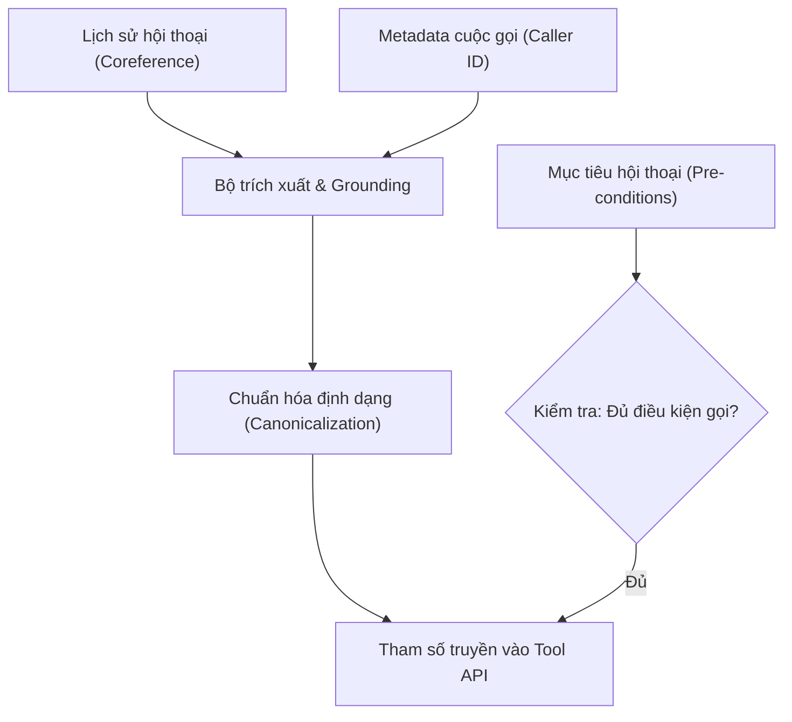

# 06.02 — Cơ Chế Tool-Call: Trích Xuất Tham Số, State và Mục Tiêu Hội Thoại

> [!NOTE]
> Tài liệu này phân tích chuyên sâu cơ chế gọi hàm (Tool-calling) trong hệ thống Voice AI Agent.
> Trọng tâm nhằm làm rõ nguyên nhân gây ra sự sụt giảm độ chính xác tool-calling (đang ở mức 61.79% so với mục tiêu $\ge$ 90%), định hình taxonomy công cụ cho tổng đài FCI, và thiết lập các giải pháp neo dữ liệu (grounding) tham số.

---

## 1. Dẫn dắt bối cảnh

- **Một câu hỏi nghiệp vụ thực tế**:
  - Khi khách hàng gọi điện đến tổng đài tài chính và hỏi: "Khoản vay của tôi tới hôm nay còn phải thanh toán bao nhiêu tiền?".
  - Để kích hoạt chính xác API truy vấn thông tin, hệ thống cần điền đầy đủ các tham số: Định danh chính xác người gọi là ai (suy từ siêu dữ liệu cuộc gọi), và mốc thời gian "hôm nay" tương ứng với ngày cụ thể nào.

- **Nghịch lý của con số 62%**:
  - Các kết quả thực nghiệm chỉ ra rằng mô hình ngôn ngữ chọn đúng tên công cụ cần gọi (Tool Selection) đạt tỷ lệ rất cao (từ 75% đến 89%).
  - Vậy tại sao độ chính xác thực thi gọi hàm tổng thể của FCI lại rò rỉ nghiêm trọng và chỉ dừng lại ở mức 61.79%?

- **Mục tiêu của tài liệu**:
  
  Lỗ hổng lớn này nằm ở **khâu điền giá trị tham số (Argument/Parameter Filling)** do thiếu cơ chế neo dữ liệu (grounding) từ trạng thái và mục tiêu hội thoại. Tài liệu này sẽ phân tích 4 nhóm công cụ của tổng đài FCI, vạch ra các điểm nghẽn tham số, và đề xuất kiến trúc xử lý tối ưu.

---

## 2. Glossary

Bảng Glossary dưới đây định nghĩa toàn bộ ký hiệu và thuật ngữ viết tắt xuất hiện trong bài:

| Ký hiệu / Thuật ngữ | Tên đầy đủ tiếng Anh | Giải nghĩa tiếng Việt |
| :--- | :--- | :--- |
| `tool-call` | **Tool / Function Calling** | Lời gọi hàm có cấu trúc sinh từ mô hình để hệ thống thực thi. |
| `schema` | **Tool Schema** | Đặc tả tên hàm và định dạng tham số yêu cầu (JSON Schema). |
| `argument` | **Argument** | Tham số truyền vào cho lời gọi API của công cụ. |
| `grounding` | **Grounding** | Neo giữ giá trị tham số vào các nguồn dữ liệu thực tế (hội thoại, metadata). |
| `canonicalization` | **Canonicalization** | Chuẩn hóa các giá trị ngôn ngữ tự nhiên thô về dạng máy hiểu được. |
| `coreference` | **Coreference Resolution** | Phép giải quyết tham chiếu đồng thực thể (nối đại từ về danh từ đã nhắc). |
| `SIP REFER` | **Session Initiation Protocol REFER** | Bản tin giao thức SIP dùng để chuyển tiếp cuộc gọi trong viễn thông. |
| `JGA` | **Joint Goal Accuracy** | Tỉ lệ lượt thoại dự đoán chính xác toàn bộ các slot thông tin. |
| `BFCL` | **Berkeley Function Calling Leaderboard** | Bảng xếp hạng đánh giá năng lực gọi hàm của LLM. |
| `RAG` | **Retrieval-Augmented Generation** | Mô hình sinh văn bản tăng cường bằng truy xuất tri thức. |
| `VAD` | **Voice Activity Detection** | Bộ phát hiện hoạt động giọng nói. |

---

## 3. Nguyên Tắc Thiết Kế: Vòng Phản Xạ Nhanh và Vòng Nhận Thức Chậm

Để đảm bảo hiệu năng tối ưu, luồng xử lý của hệ thống cần được phân tách thành hai vòng hoạt động độc lập:

- **Vòng phản xạ nhanh (Reflex Loop)**:
  - *Chức năng*: Xử lý hoạt động giọng nói (VAD), điểm kết thúc câu (turn-detection), và chen ngang (barge-in).
  - *Nguyên tắc*: Đòi hỏi phản hồi trong mức mili-giây cực thấp, **tối giản hóa ngữ cảnh (context-light)**, không nhồi các trạng thái phức tạp để tránh gây trễ tín hiệu âm thanh.
- **Vòng nhận thức chậm (Cognitive Loop)**:
  - *Chức năng*: Thực thi gọi hàm (tool-call), cập nhật trạng thái (state tracking), và sinh phản hồi tự nhiên.
  - *Nguyên tắc*: Được phép sử dụng **ngữ cảnh giàu thông tin (context-rich)** và chấp nhận thời gian xử lý dài hơn để đảm bảo tính chính xác của nghiệp vụ.
- **Hệ quả cho tool-calling**:
  - Khâu gọi hàm và trích xuất tham số thuộc về **vòng nhận thức chậm**, hoạt động trên trục dữ liệu nền và không được phép can thiệp trực tiếp làm nghẽn luồng truyền âm thanh thời gian thực.

---

## 4. Cơ Chế Xử Lý Gọi Hàm và Bản Đồ Lỗi

### 4.1 Vòng đời của một lời gọi công cụ
 
 ```mermaid
 graph TD
   SCHEMA["Schema của Tool"] --> PROMPT["Nhúng Schema vào Prompt"]
   PROMPT --> DECODE["LLM sinh lời gọi hàm JSON"]
   DECODE --> PARSE["Parse cú pháp JSON"]
   PARSE --> EXEC["Thực thi Tool API/DB"]
   EXEC --> RESULT["Nạp kết quả vào Chat History"]
 ```

#### Khung đọc sơ đồ vòng đời:
- **Đề bài cần giải**: Xác định vị trí phát sinh lỗi trong quá trình thực thi gọi hàm.
- **Giả định nền**: Bộ parser JSON hoạt động đồng bộ trước khi gọi API.
- **Ý nghĩa các khối**: Các bước xử lý tuần tự từ trái qua phải; kết quả cuối cùng (`RESULT`) quay lại làm context cho LLM.
- **Cách đọc và ứng dụng**: Quy trình chạy thẳng; giúp kỹ sư thấy rõ lỗi có thể phát sinh ở khâu sinh cú pháp (`DECODE`) hoặc khâu thực thi thực tế (`EXEC`), từ đó khoanh vùng để áp dụng constrained decoding hoặc tối ưu hóa tham số.

---

### 4.2 Bản Đồ Phân Loại Lỗi Tham Số

Lỗi gán tham số (Argument/Parameter Error) là điểm nghẽn chính làm sụt giảm chất lượng gọi hàm, được chia thành 3 khía cạnh:

- **Sự neo giữ tham số thực tế (Argument Grounding)**:
  - ⚙ *Cơ chế*: Quá trình tìm kiếm, trích xuất và liên kết các giá trị tham số cần thiết của lời gọi hàm từ lịch sử hội thoại, siêu dữ liệu (metadata) cuộc gọi hoặc cơ sở dữ liệu hệ thống, thay vì để mô hình tự sinh ngẫu nhiên.
  - 🔍 *Cách nhận diện*: Log tham số đầu vào của API chứa các biến thực tế như `caller_id` lấy từ metadata hoặc `contract_id` lấy từ session context.
  - 💡 *Ý nghĩa*: Loại bỏ lỗi bịa đặt tham số (parameter hallucination), đảm bảo API nghiệp vụ nhận đúng đối tượng dữ liệu thật của khách hàng.
  - ⚠️ *Bẫy*: Tin tưởng LLM sẽ tự trích xuất chính xác các thực thể này từ prompt mà không xây dựng cơ chế binding tường minh trong mã nguồn.
- **Chuẩn hóa giá trị tham số (Canonicalization)**:
  - ⚙ *Cơ chế*: Chuyển đổi các định dạng ngôn ngữ tự nhiên mơ hồ hoặc tương đối (ví dụ: "hôm nay", "đầu tháng sau", "hai triệu") thành các định dạng chuẩn hóa tương thích với máy (ví dụ: ngày cụ thể `YYYY-MM-DD`, số nguyên `2000000`).
  - 🔍 *Cách nhận diện*: Các giá trị tham số đầu vào được tiền xử lý và chuyển đổi kiểu dữ liệu trước khi API được gọi.
  - 💡 *Ý nghĩa*: Tránh các lỗi gán tham số sai định dạng làm API trả về mã lỗi 400 Bad Request hoặc truy vấn sai khoảng thời gian.
  - ⚠️ *Bẫy*: Để mô hình LLM tự thực hiện các phép tính toán thời gian tương đối trong prompt, vốn là khía cạnh mô hình ngôn ngữ cực kỳ yếu.
- **Hành động hệ thống tất định (Deterministic System Call / Block-by-default)**:
  - ⚙ *Cơ chế*: Các tác vụ có tính chất phá hủy hoặc không thể hoàn tác (như ngắt cuộc gọi `EndCall`, chuyển tiếp cuộc gọi `TransferCall` qua SIP REFER) được kiểm soát bởi một lớp chính sách tất định (deterministic policy rule) bên ngoài, hoạt động theo triết lý chặn mặc định (block-by-default).
  - 🔍 *Cách nhận diện*: Bot chỉ thực thi chuyển tiếp máy sau khi đã có bước xác nhận rõ ràng của khách hàng và được duyệt qua một state transition cứng, không phụ thuộc hoàn toàn vào sinh tự do của LLM.
  - 💡 *Ý nghĩa*: Ngăn ngừa tuyệt đối các trường hợp cúp máy nhầm hoặc chuyển hướng nhầm máy gây đứt gãy dịch vụ.
  - ⚠️ *Bẫy*: Cho phép LLM tự do gọi các hàm hệ thống này chỉ dựa vào phân loại ý định (intent selection) từ prompt thô.

---

## 5. Phân Loại 4 Nhóm Công Cụ Tổng Đài FCI (Taxonomy)

Mỗi nhóm công cụ yêu cầu một phương pháp xử lý kỹ thuật chuyên biệt để tránh lỗi:

| Nhóm công cụ | Mô tả nghiệp vụ | Thách thức chính | Hướng giải quyết đề xuất |
| :--- | :--- | :--- | :--- |
| **Loại 1: System-call** | Gác máy (`EndCall`), chuyển tiếp cuộc gọi (`TransferCall`), human handoff. | Hành động không thể hoàn tác; nguy cơ cúp máy nhầm khi hiểu sai ý. | Tách biệt quyền thực thi khỏi LLM; cấu hình block-by-default; yêu cầu khách hàng xác nhận. |
| **Loại 2: RAG-query** | Tra cứu lãi suất, chính sách kỳ hạn, kiểm tra phòng trống. | Cần thông tin chính xác tuyệt đối; RAG vector dễ sinh ảo giác số liệu. | Sử dụng truy vấn có cấu trúc (Text-to-SQL / DB lookup); không dùng vector RAG thô. |
| **Loại 3: Tham số trích xuất** | Điền thông tin ngày tháng, SĐT định danh, số tiền giao dịch. | Grounding giá trị từ history và chuẩn hóa định dạng (canonicalization). | Ràng buộc metadata cuộc gọi cứng; expose công cụ chuẩn hóa ngày; hỏi lại khi thiếu thông tin. |
| **Loại 4: Chuỗi suy luận** | Tác vụ phức tạp đòi hỏi gọi nhiều API tuần tự. | Độ dài chuỗi gọi hàm tăng nguy cơ tích lũy sai số. | Tạm gác lại; ưu tiên tối ưu hóa và làm ổn định các nhóm công cụ **1**, **2**, và **3** trước. |

---

### 5.1 Cơ chế neo dữ liệu tham số từ các nguồn context



#### Khung đọc sơ đồ neo dữ liệu:
- **Đề bài cần giải**: Đảm bảo các tham số truyền vào công cụ được neo giữ chính xác từ các nguồn dữ liệu xác thực của hệ thống.
- **Giả định nền**: Session lưu trữ đầy đủ các biến ngữ cảnh và metadata cuộc gọi viễn thông.
- **Ý nghĩa các khối**:
  - `Grounding` / `Canon`: Các bước trích xuất và chuẩn hóa giá trị.
  - `Verify`: Chốt chặn logic kiểm tra tính hợp lệ dựa trên mục tiêu hội thoại.
- **Cách đọc và ứng dụng**: Hai nhánh xử lý chạy song song trước khi gộp vào `Arg`; nhánh bên trái đảm bảo *giá trị tham số chính xác*, nhánh bên phải đảm bảo *thời điểm gọi an toàn*, ngăn ngừa các lệnh gọi hàm rác hoặc sai thời điểm.

---

## 6. Trạng Thái và Mục Tiêu: Nhiên Liệu Cho Lời Gọi Công Cụ

Để gán tham số chính xác, hệ thống cần liên tục đồng bộ 3 thành phần dữ liệu:

- **Bộ lưu trữ thực thể (Entity/Slot Store)**:
  - Duy trì các giá trị đã được xác minh (như mã hợp đồng, tên khách hàng) xuyên suốt các lượt thoại.
  - Áp dụng các giải pháp giải quyết đồng tham chiếu (Coreference Resolution) để nối các đại từ chỉ định (ví dụ: "khoản vay **đó**", "tài khoản **này**") về đúng thực thể gốc đã lưu trữ.
- **Ràng buộc siêu dữ liệu cuộc gọi (Metadata Binding)**:
  - Tránh việc bắt LLM tự suy đoán thông tin cá nhân của khách hàng từ prompt.
  - Mã nguồn hệ thống cần thực hiện bind cứng caller ID (số điện thoại gọi vào tổng đài) lấy từ luồng SIP viễn thông trực tiếp vào tham số định danh của công cụ tra cứu cơ sở dữ liệu.
- **Độ chính xác mục tiêu chung ($JGA$)**:
  - Áp dụng chỉ số $JGA$ để giám sát chất lượng điền slot trước khi kích hoạt gọi tool:
    $$JGA = \frac{N_{\text{correct}}}{N_{\text{total}}}$$
  - Trong môi trường tài chính không chấp nhận sai lệch số liệu, một lượt gọi công cụ chỉ được coi là thành công khi **tất cả các slot tham số đầu vào** đều được điền chính xác tuyệt đối.

---

## 7. Đề Xuất Quy Trình Đánh Giá Tách Biệt Lỗi

Để vá lỗ hổng 28% độ chính xác gọi hàm, dự án cần xây dựng một harness thử nghiệm chuyên biệt dựa trên các bộ benchmark công nghiệp:

- **Tách lỗi điền tham số (sử dụng subset của HammerBench)**:
  - Đo lường riêng biệt khả năng điền đúng đối số của mô hình độc lập với khả năng chọn tên công cụ.
  - Đánh giá năng lực giải quyết tham chiếu (pronoun resolution) và duy trì slot qua nhiều lượt thoại.
- **Đo lường tính phụ thuộc trạng thái (sử dụng subset của ToolSandbox)**:
  - Kiểm tra khả năng chuẩn hóa thời gian tương đối (canonicalization) của mô hình.
  - Đánh giá phản xạ của mô hình khi bị thiếu thông tin tham số (xem mô hình có chủ động hỏi lại khách hàng hay tự động bịa ra giá trị).

---

## 8. ✅ Tự Kiểm Nhanh

<details>
<summary><b>Câu hỏi 1: Tại sao việc chỉ tập trung tối ưu hóa khả năng chọn đúng tên công cụ (Tool Selection) không giúp hệ thống đạt mục tiêu accuracy >= 90%?</b></summary>

- **Phân tích lỗi**:
  - Các nghiên cứu khoa học (như HammerBench) chứng minh rằng các mô hình LLM hiện đại có năng lực chọn đúng tên công cụ rất tốt (đạt từ 75% đến 89%).
  - Tuy nhiên, lỗi giải mã chủ yếu tập trung ở khâu **gán sai giá trị tham số (argument error)** do mô hình bịa đặt thông tin khi thiếu chỉ dẫn, hoặc không thể tính toán các mốc thời gian tương đối (ví dụ: "tới hôm nay", "ngày mai").
  - Do đó, để đạt mục tiêu $\ge$ 90%, dự án cần tập trung xây dựng cơ chế neo giữ (grounding) tham số cứng từ metadata cuộc gọi và cung cấp các công cụ chuẩn hóa tất định bên ngoài LLM.

</details>

<details>
<summary><b>Câu hỏi 2: Tại sao siêu dữ liệu định danh cuộc gọi (như số điện thoại khách hàng) bắt buộc phải được bind cứng trong mã nguồn thay vì để LLM tự điền qua prompt?</b></summary>

- **Nguyên nhân an toàn và kỹ thuật**:
  - Trong các framework tổng đài (như LiveKit), các biến ngữ cảnh cuộc gọi (`context_variables`) chỉ được nạp vào system prompt dưới dạng văn bản để LLM có thông tin hội thoại.
  - LLM không tự động liên kết các biến này vào tham số của lời gọi hàm một cách ổn định 100%. Mô hình có thể bị nhầm lẫn giữa số điện thoại của khách hàng với các con số khác xuất hiện trong lịch sử chat, hoặc bịa ra một số điện thoại ngẫu nhiên dưới tải cao.
  - Việc bind cứng giá trị định danh trong code bảo đảm tính tất định, loại bỏ hoàn toàn nguy cơ truy vấn nhầm thông tin của tài khoản khác.

</details>
