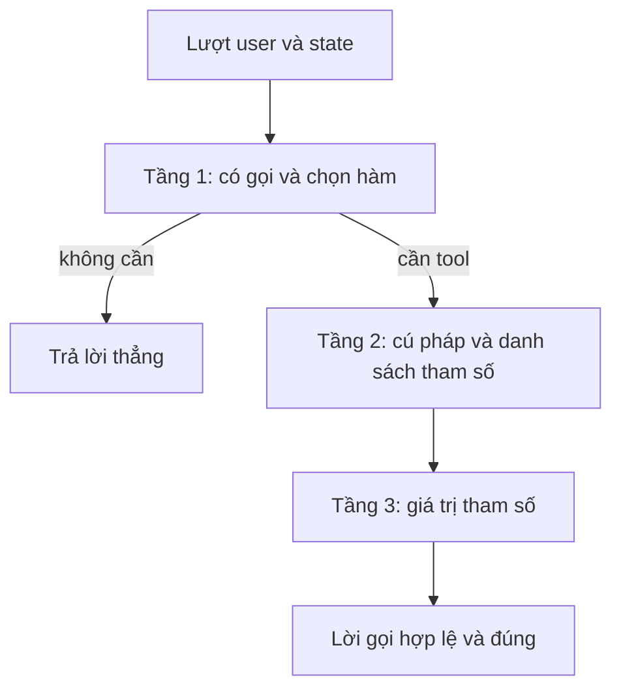
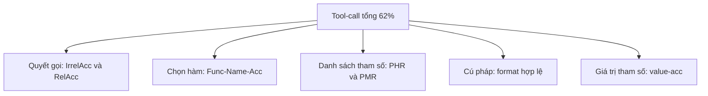

# 06.03 — Ba Tầng Chất Lượng Tool-Calling: Quyết Định Gọi, Cú Pháp, Giá Trị

> [!NOTE]
> - Tài liệu đơn vị tự đứng vững mổ xẻ con số chất lượng tool-calling,
> - **tập trung phân rã con số 61.79%** thành ba tầng quyết định độc lập,
> - hỗ trợ xác định chính xác nguyên nhân gây lỗi và đề xuất cách vá lỗi phù hợp.
> - Tham chiếu chi tiết về grounding giá trị từ state/goal xem tại [02_tool_call_grounding.md](02_tool_call_grounding.md),
> - và bản đồ lỗi tổng quan cùng lộ trình vá lỗi xem tại [00_README.md](00_README.md).

---

## 1. Dẫn dắt bối cảnh

- **Bối cảnh thực tế**:
  - Khi phát triển các trợ lý giọng nói FCI,
  - chỉ số chất lượng tổng thể của tính năng gọi hàm (tool-calling) thường chỉ được báo cáo qua một con số phần trăm duy nhất (ví dụ: 61.79%).
- **Nghịch lý đo lường**:
  - Điều này tạo ra một nghịch lý đo lường khi mô hình có thể nhận diện tên hàm rất chính xác (lên tới ~89%),
  - nhưng tổng thể hệ thống vẫn liên tục gặp lỗi hội thoại do sai sót ở các khía cạnh cú pháp hoặc tham số,
  - và một con số gộp không thể chỉ ra lỗi cụ thể đang nằm ở giai đoạn nào.

> Tài liệu này sẽ phân rã quá trình tool-calling thành ba tầng quyết định độc lập,
> **nhằm cung cấp một bản đồ chẩn đoán lỗi chi tiết**,
> giúp lập trình viên chọn đúng đòn bẩy kỹ thuật để tối ưu hóa hệ thống.

---

## 2. Glossary

- `decide-to-call` -> **Decision-to-call** ->
  - Quyết định nhị phân:
  - có cần gọi tool hay trả lời trực tiếp từ ngữ cảnh.
- `irrelevance / relevance detection` -> **Irrelevance / Relevance Detection** ->
  - Phát hiện các trường hợp:
  - không cần dùng tool (irrelevance),
  - hoặc bắt buộc phải sử dụng tool (relevance).
- `IrrelAcc / RelAcc` -> **Irrelevance / Relevance Accuracy** ->
  - Độ chính xác khi đánh giá:
  - các trường hợp không cần tool,
  - và các trường hợp cần tool.
- `tool selection` -> **Tool Selection** ->
  - Lựa chọn đúng hàm mục tiêu:
  - trong số nhiều hàm được định nghĩa sẵn.
- `tool retrieval` -> **Tool Retrieval / Tool RAG** ->
  - Truy hồi các hàm liên quan:
  - từ thư viện lớn để đưa vào prompt trước khi mô hình lựa chọn.
- `PHR / PMR` -> **Parameter Hallucination / Missing Rate** ->
  - Tỷ lệ sinh thừa tham số không tồn tại,
  - hoặc thiếu các tham số bắt buộc trong schema.
- `IFN / IAN / IAV` -> **Incorrect Function Name / Arg Name / Arg Value** ->
  - Sai tên hàm (IFN),
  - sai tên tham số (IAN),
  - hoặc sai giá trị tham số (IAV).
- `schema adherence` -> **Schema Adherence** ->
  - Mức độ tuân thủ cấu trúc của schema:
  - đúng khóa (key),
  - đủ trường bắt buộc,
  - và không dư thừa.
- `constrained decoding` -> **Constrained / Structured Decoding** ->
  - Ép token đầu ra theo ngữ pháp hoặc JSON Schema:
  - trong quá trình sinh của mô hình ngôn ngữ.
- `AST` -> **Abstract Syntax Tree** ->
  - Cây cú pháp trừu tượng:
  - dùng để phân tích cấu trúc và so khớp lời gọi hàm.
- `calibration / abstention` -> **Calibration / Abstention** ->
  - Hiệu chỉnh độ tự tin nội bộ của mô hình,
  - hoặc chủ động không hành động khi độ tin cậy thấp.
- `function masking` -> **Function Masking** ->
  - Che tên hàm khi thực hiện fine-tune:
  - để mô hình tập trung bám sát mô tả chức năng thay vì học vẹt.
- `tool-call parser` -> **Tool-call Parser** ->
  - Bộ phân tích cú pháp:
  - dùng để bóc tách lời gọi hàm từ chuỗi văn bản đầu ra theo chat template.

---

## 3. Khung: ba tầng nối tiếp

- **Nguyên lý hoạt động**:
  - Ba tầng chất lượng là các điều kiện cần nối tiếp nhau:
    - Tầng sau chỉ có thể hoạt động chính xác nếu tầng trước đó đã thành công.
    - Chọn sai tên hàm thì cấu trúc cú pháp đúng cũng không mang lại giá trị.
    - Sinh đúng cấu trúc tham số nhưng sai giá trị cụ thể thì lời gọi vẫn bị thất bại.

### 3.1 Sơ đồ S0 — Ba tầng từ lượt nói tới lời gọi

- **Khung đọc sơ đồ S0**:
  - **Đề bài cần giải**:
    - Phân tách rõ ràng ba tầng chất lượng nối tiếp,
    - phục vụ việc định vị chính xác vị trí phát sinh lỗi trong luồng gọi hàm.
  - **Giả định nền**:
    - Trạng thái hội thoại và mục tiêu người dùng đã được theo dõi liên tục,
    - tương ứng với cơ chế trong tài liệu [02_tool_call_grounding.md](02_tool_call_grounding.md).
  - **Ý nghĩa các khối**:
    - `IN`: Dữ liệu đầu vào gồm lượt nói của người dùng và trạng thái hệ thống.
    - `S1`: Tầng quyết định việc sử dụng công cụ và lựa chọn hàm cụ thể.
    - `ANSWER`: Trả lời trực tiếp người dùng khi không cần gọi công cụ.
    - `S2`: Tầng đảm bảo tính hợp lệ của cấu trúc cú pháp và định dạng JSON.
    - `S3`: Tầng đảm bảo độ chính xác của các giá trị tham số được truyền vào.
    - `CALL`: Lời gọi hàm hoàn chỉnh, đáp ứng cả tính hợp lệ lẫn tính chính xác.
  - **Cách đọc sơ đồ**:
    - Luồng xử lý đi từ `IN` qua `S1`,
    - nếu không cần công cụ thì rẽ sang `ANSWER`,
    - nếu cần công cụ sẽ đi qua chuỗi liên tục `S2` và `S3` để tạo ra `CALL`.
    - Bất kỳ sự thất bại nào ở một tầng đều làm đứt gãy toàn bộ luồng xử lý phía sau.

---

## 4. Tầng 1 — Quyết định gọi và Chọn hàm

### 4.1 Quyết định CÓ gọi hàm hay không

- **⚙️ Cơ chế**:
  - Thực hiện bài toán phân loại nhị phân:
    - đánh giá yêu cầu của khách hàng cần gọi công cụ bên ngoài,
    - hay có thể trả lời trực tiếp từ thông tin có sẵn trong ngữ cảnh.
  - Đo lường thông qua hai chỉ số bổ trợ của BFCL:
    - **IrrelAcc** (độ chính xác khi từ chối gọi đối với các yêu cầu không liên quan),
    - và **RelAcc** (độ chính xác khi kích hoạt gọi đối với các yêu cầu liên quan).
- **🔍 Cách nhận diện**:
  - Nhận diện thông qua hai lỗi đối lập chính:
    - **Over-triggering** (gọi công cụ cho cả những câu hỏi thông thường, làm giảm IrrelAcc),
    - và **Under-triggering** (bỏ qua việc gọi công cụ khi cần thiết, tự bịa câu trả lời, làm giảm RelAcc).
- **💡 Ý nghĩa**:
  - Một mô hình có độ chính xác chọn tên hàm cao vẫn có thể gây lỗi hệ thống nếu quyết định kích hoạt kém,
  - đây là điểm mù lớn khi chỉ đánh giá qua một chỉ số chung duy nhất.
- **⚠️ Bẫy**:
  - Ép mô hình gọi công cụ cho mọi truy vấn là hướng tiếp cận sai lầm,
  - vì trong thực tế có nhiều câu hỏi cần được xử lý trực tiếp bằng thông tin hội thoại hiện tại.
- **Kỹ thuật cải thiện**:
  - **Confidence calibration**:
    - Hiệu chỉnh độ tự tin từ trạng thái nội bộ của mô hình,
    - hỗ trợ quyết định có nên kích hoạt lời gọi hàm (áp dụng MICE cho CATs).
  - **Conformal abstention**:
    - Chủ động từ chối hành động khi mô hình không đủ tự tin,
    - đi kèm các bảo đảm lý thuyết về giới hạn tỷ lệ sai sót.
  - **Router/Classifier riêng biệt**:
    - Sử dụng một bộ định tuyến độc lập bên ngoài mô hình ngôn ngữ lớn,
    - đặt các ngưỡng độ tin cậy để quyết định phân tầng xử lý (cần lưu ý các ngưỡng này thường là heuristic).

### 4.2 Chọn đúng hàm khi có nhiều hàm

- **Quy luật cốt lõi**:
  - Độ chính xác chọn hàm tỷ lệ nghịch với số lượng hàm có sẵn:
    - khi số lượng hàm tăng, độ chính xác chọn hàm giảm mạnh.
    - Việc nhét quá nhiều schema vào prompt làm kéo dài ngữ cảnh và làm nhiễu mô hình,
    - một số nghiên cứu chỉ ra hiệu năng giảm ~16 điểm khi prompt tăng thêm 1.000 token.
- **Kỹ thuật Tool retrieval / Tool RAG**:
  - Thực hiện truy hồi top-k hàm liên quan nhất từ thư viện,
  - sau đó mới đưa các schema này vào prompt cho mô hình lựa chọn.
  - Giúp giảm đáng kể số lượng token trong prompt:
    - kiểm thử thực tế ghi nhận mức tăng độ chính xác chọn hàm từ **13.62% lên 43.13%** (cần tự đo lường lại trên dữ liệu riêng).
- **Mô tả hàm chi tiết**:
  - Tên hàm đặt trùng lặp hoặc mô tả mơ hồ là nguyên nhân trực tiếp dẫn đến lỗi chọn nhầm,
  - cần viết lại mô tả chỉ rõ điều kiện áp dụng và trường hợp sử dụng cụ thể.
- **Hệ thống Benchmark**:
  - Sử dụng MetaTool (đo năng lực nhận biết và chọn lựa công cụ),
  - BFCL (kiểm thử gọi nhiều hàm song song hoặc độc lập),
  - và ToolBench.

### 4.3 Phân biệt hai tác vụ của Tầng 1

- **So sánh chi tiết**:
  - **Quyết định gọi (Binary)**:
    - Lỗi đặc trưng: Over-triggering và Under-triggering.
    - Chỉ số đo lường: IrrelAcc, RelAcc, và độ nhận biết của MetaTool.
    - Phương pháp vá: Hiệu chỉnh độ tin cậy (calibration), từ chối hành động (abstention), bộ định tuyến ngưỡng.
    - Yếu tố nhạy cảm: Câu hỏi mơ hồ hoặc câu hỏi có thể trả lời trực tiếp.
  - **Chọn hàm (Multi-class)**:
    - Lỗi đặc trưng: Chọn nhầm hàm, lẫn lộn giữa các hàm có mô tả tương đồng.
    - Chỉ số đo lường: BFCL multiple, và độ chính xác lựa chọn của MetaTool.
    - Phương pháp vá: Truy hồi công cụ (tool retrieval), tối ưu hóa mô tả hàm, tái xếp hạng (rerank).
    - Yếu tố nhạy cảm: Số lượng hàm trong tập hợp, độ tương đồng mô tả, và độ dài prompt ngữ cảnh.

---

## 5. Tầng 2 — Cú pháp và Danh sách tham số

### 5.1 Lỗi cú pháp và định dạng JSON

- **⚙️ Cơ chế**:
  - Mô hình sinh chuỗi JSON không hợp lệ, không thể phân tích cú pháp (parse),
  - dẫn đến việc bị loại ngay từ bước dựng Cây cú pháp trừu tượng (AST).
- **🔍 Cách nhận diện**:
  - Khi không áp dụng cơ chế kiểm soát,
  - tỷ lệ định dạng JSON hợp lệ đối với các schema phức tạp chỉ dao động khoảng ~61% - 72%.
- **💡 Ý nghĩa**:
  - Đây là chốt chặn kỹ thuật đầu tiên,
  - sai định dạng cú pháp sẽ khiến mọi xử lý logic phía sau hoàn toàn vô nghĩa.
- **⚠️ Bẫy**:
  - Các cấu trúc schema phức tạp (như kiểu dữ liệu lồng nhau) làm gia tăng mạnh lỗi cú pháp,
  - tuy nhiên đây là nhóm lỗi có thể khắc phục triệt để bằng cơ chế kỹ thuật.

### 5.2 Đảm bảo đúng danh sách tham số

- **Phân biệt then chốt**:
  - **Schema adherence**:
    - Đảm bảo đúng khóa (key), đủ các trường bắt buộc, không thừa trường, đúng kiểu dữ liệu,
    - đây là phần có thể ép buộc bằng cơ chế kỹ thuật.
  - **Đúng giá trị tham số**:
    - Đảm bảo giá trị truyền vào là chính xác về mặt ngữ nghĩa,
    - phần này không thể ép buộc bằng cơ chế định dạng (thuộc phạm vi Tầng 3).
- **Bằng chứng thực nghiệm (HammerBench)**:
  - **Độ chính xác chọn tên hàm**: đạt mức khá cao (lên tới 89.53% trên xLAM-7b-fc-r).
  - **Tỷ lệ sinh thừa tham số (PHR)**: đạt mức cao đáng báo động:
    - GPT-4o gặp lỗi ở mức 18.12%,
    - Llama-3.1-8B gặp lỗi lên tới 34.15%.
  - **Tỷ lệ thiếu tham số bắt buộc (PMR)**: tương đối thấp, thường chỉ khoảng 1% - 2%.
  - **Kết luận từ nghiên cứu**:
    - Lỗi đặt tên và sinh thừa tham số là nguyên nhân cốt lõi gây thất bại trong cuộc hội thoại,
    - rất khớp với các vấn đề thực tế gặp phải tại FCI.
- **Phân loại lỗi theo ToolScan**:
  - **IFN** (Incorrect Function Name) -> sai tên hàm.
  - **IAN** (Incorrect Arg Name) -> sai tên tham số.
  - **IAV** (Incorrect Arg Value) -> sai giá trị tham số (bao gồm cả việc bỏ sót tham số bắt buộc).

### 5.3 Kỹ thuật Constrained Decoding

- **⚙️ Cơ chế**:
  - Trong từng bước sinh token,
  - hệ thống thực hiện che (mask) các token không phù hợp với cấu trúc ngữ pháp hoặc JSON Schema đã định nghĩa,
  - đảm bảo chuỗi đầu ra luôn phân tích cú pháp được và tuân thủ tuyệt đối schema.
  - Các thư viện hỗ trợ phổ biến:
    - XGrammar (tích hợp sẵn trong vLLM, SGLang, TensorRT-LLM),
    - Outlines, lm-format-enforcer, và Guidance.
- **🔍 Cách nhận diện**:
  - Tỷ lệ định dạng hợp lệ được kéo lên mức gần như tuyệt đối (~100%),
  - giúp cải thiện đáng kể hiệu năng tổng thể của mô hình đối với các tác vụ gọi hàm.
- **💡 Ý nghĩa**:
  - Loại bỏ hoàn toàn lỗi định dạng JSON và lỗi sai cấu trúc khóa/tham số,
  - chi phí xử lý phát sinh rất nhỏ nhờ cơ chế cache FSM (XGrammar tối ưu hóa thời gian sinh dưới 40µs/token, tuy nhiên cần lưu ý hiệu năng throughput có thể giảm trên vLLM khi batch size lớn hơn 8).
- **⚠️ Bẫy**:
  - **Khả năng giải quyết**: Chỉ xử lý được lỗi định dạng cú pháp và danh sách tham số ở Tầng 2.
  - **Không giải quyết được**: Việc chọn sai hàm (Tầng 1) hoặc điền sai giá trị tham số (Tầng 3).
  - **Đánh đổi suy luận**:
    - Việc ép định dạng quá chặt chẽ ngay từ đầu có thể làm suy giảm khả năng tư duy và lập luận của mô hình ngôn ngữ lớn.
    - Khuyến nghị: để mô hình tự do suy luận và lựa chọn hàm trong phần lập luận, chỉ áp dụng ép schema cho phần sinh các tham số (arguments).

### 5.4 Sử dụng mô hình Fine-tune và Chat Template

- **Hiệu quả của mô hình chuyên dụng**:
  - Các mô hình được tinh chỉnh chuyên cho function-calling sinh cú pháp chuẩn xác hơn nhiều so với việc dùng prompt trên mô hình nền:
    - Hammer sử dụng kỹ thuật che hàm (function masking) kết hợp dữ liệu hội thoại không liên quan để huấn luyện mô hình bám sát mô tả.
    - xLAM được huấn luyện trên tập dữ liệu APIGen lớn (~60k mẫu), cho hiệu năng vượt trội về độ chính xác tên hàm.
- **Sự đồng bộ giữa Chat Template và Parser**:
  - Mỗi dòng mô hình có cấu trúc bọc lời gọi hàm riêng (ví dụ: Qwen sử dụng `<tool_call>...</tool_call>`).
  - Bộ phân tích cú pháp (parser) ở backend phải khớp cấu trúc này:
    - ví dụ vLLM cần cấu hình chính xác tham số `--tool-call-parser hermes` để trích xuất đúng lời gọi,
    - cấu hình sai parser sẽ dẫn đến lỗi định dạng dù mô hình sinh đúng.

### 5.5 Thao tác gọi song song và gọi nhiều hàm

- **Đặc trưng lỗi**:
  - Việc gọi song song (parallel) hoặc gọi nhiều hàm (multiple) cùng lúc làm gia tăng lỗi về số lượng lời gọi (thừa hoặc thiếu lời gọi hàm).
  - Constrained decoding chỉ kiểm soát được cấu trúc của từng lời gọi riêng lẻ,
  - không thể tự quyết định số lượng lời gọi cần thiết.

---

## 6. Tầng 3 — Giá trị tham số

- **Bản chất vấn đề**:
  - Đảm bảo điền chính xác nội dung giá trị của tham số,
  - chứ không chỉ dừng lại ở việc tuân thủ đúng định dạng kiểu dữ liệu.
- **Ba nguồn khai thác giá trị**:
  - **Ngữ cảnh hội thoại**: Trích xuất thông tin thông qua cơ chế coreference (ví dụ: xác định "nó" là đối tượng nào).
  - **Metadata định danh**: Tra cứu và ánh xạ thông tin (ví dụ: từ số điện thoại truy vấn ra mã khách hàng).
  - **Chuẩn hóa dữ liệu (Canonicalization)**: Chuyển đổi các dạng biểu đạt tự do về dạng chuẩn (ví dụ: chuyển từ "hôm nay" thành ngày cụ thể yyyy-mm-dd).
- **Mối liên kết giữa các tầng**:
  - Các kỹ thuật tối ưu ở tầng trên như truy hồi công cụ (Tầng 1) hay constrained decoding (Tầng 2) hoàn toàn không có tác dụng hỗ trợ Tầng 3.
  - Đây là điểm nghẽn lớn nhất gây thất bại cho các công cụ yêu cầu trích xuất tham số phức tạp.
  - *Xem hướng dẫn chi tiết về cơ chế grounding, liên kết metadata và chuẩn hóa giá trị tại tài liệu [02_tool_call_grounding.md](02_tool_call_grounding.md).*

---

## 7. Đo tách ba tầng (chẩn đoán con số 62%)

### 7.1 Sơ đồ S1 — Mổ một con số thành nhiều metric

- **Khung đọc sơ đồ S1**:
  - **Đề bài cần giải**:
    - Phân rã chỉ số hiệu năng gộp duy nhất (62%) thành năm chỉ số đo lường độc lập,
    - giúp chẩn đoán chính xác bộ phận bị lỗi trong hệ thống.
  - **Giả định nền**:
    - Sử dụng các khung đánh giá chuyên dụng có khả năng bóc tách lỗi chi tiết,
    - tương tự như HammerBench, BFCL, hoặc ToolSandbox.
  - **Ý nghĩa các khối**:
    - `TOTAL`: Chỉ số chất lượng gọi hàm gộp cuối cùng.
    - `M1`: Chỉ số đo năng lực quyết định có sử dụng công cụ hay không.
    - `M2`: Chỉ số đo năng lực chọn chính xác tên hàm cần gọi.
    - `M3`: Chỉ số đo tỷ lệ sinh thừa hoặc thiếu tham số của hàm.
    - `M4`: Chỉ số đo tỷ lệ sinh đúng định dạng cú pháp JSON.
    - `M5`: Chỉ số đo tỷ lệ điền đúng giá trị thực tế của tham số.
  - **Cách đọc sơ đồ**:
    - Hiệu năng gộp `TOTAL` được cấu thành từ năm nhánh đo độc lập từ `M1` đến `M5`.
    - Khi đánh giá hệ thống, cần đo lường cả năm chỉ số này.
    - Nhánh nào có kết quả thấp nhất sẽ chỉ ra chính xác tầng đang gặp lỗi cần tập trung khắc phục.

### 7.2 Bản đồ công cụ đánh giá theo tầng

- **Tầng 1 (Quyết định & Lựa chọn)**:
  - Sử dụng BFCL (đo IrrelAcc, RelAcc và khả năng gọi nhiều hàm),
  - và MetaTool.
- **Tầng 2 (Cú pháp & Tham số)**:
  - Sử dụng HammerBench (đo tỷ lệ PHR, PMR và độ chính xác tên hàm),
  - và BFCL đánh giá ở mức AST (cú pháp).
- **Tầng 3 (Giá trị tham số)**:
  - Sử dụng ToolSandbox (đo khả năng chuẩn hóa và phụ thuộc trạng thái),
  - và HammerBench (đo năng lực trích xuất giá trị từ ngữ cảnh).

---

## 8. Hệ quả thiết kế cho trợ lý giọng nói FCI

- **Quy trình tối ưu hóa khuyến nghị**:
  - **Bước 0 — Đo lường**:
    - Dựng hệ thống đánh giá để bóc tách con số hiệu năng gộp thành các chỉ số chi tiết ở mục §7,
    - xác định rõ tầng nào đang là điểm nghẽn chính của hệ thống.
  - **Xử lý lỗi Tầng 1 (Quyết định & Lựa chọn)**:
    - Nếu lỗi do quyết định kích hoạt kém: áp dụng hiệu chỉnh độ tin cậy (calibration) hoặc sử dụng bộ định tuyến độc lập.
    - Nếu lỗi do chọn sai hàm: áp dụng truy hồi công cụ (tool retrieval) kết hợp tối ưu hóa và viết lại mô tả hàm rõ ràng hơn.
  - **Xử lý lỗi Tầng 2 (Cú pháp & Tham số)**:
    - Bật cơ chế constrained decoding (sử dụng XGrammar trên vLLM, cache schema).
    - Sử dụng các mô hình ngôn ngữ được fine-tune chuyên dụng cho gọi hàm.
    - Cấu hình chính xác parser tương ứng với chat template của mô hình.
  - **Xử lý lỗi Tầng 3 (Giá trị tham số)**:
    - Áp dụng liên kết metadata định danh, sử dụng các công cụ phụ trợ để chuẩn hóa dữ liệu, và thiết kế kịch bản thu thập tham số chủ động.
- **Nguyên tắc cốt lõi**:
  - Chỉ tập trung sửa đổi tầng đang phát sinh lỗi, tránh áp dụng sai kỹ thuật gây lãng phí tài nguyên.
  - Thứ tự triển khai từ chi phí thấp đến cao:
    1. Đo lường chi tiết để chẩn đoán nguyên nhân.
    2. Tối ưu hóa mô tả hàm và áp dụng truy hồi công cụ.
    3. Áp dụng cơ chế constrained decoding.
    4. Tiến hành fine-tune mô hình chuyên dụng.

---

## 9. Các câu hỏi nghiên cứu mở

- **Phân bố lỗi thực tế**:
  - Tỷ lệ lỗi gộp của hệ thống FCI hiện tại phân bổ cụ thể vào các tầng nào?
  - Cần chạy hệ thống đánh giá để thu thập số liệu thực tế trên các mô hình đang vận hành.
- **Ảnh hưởng của constrained decoding đối với tiếng Việt**:
  - Việc ép cứng định dạng schema của tham số có làm suy giảm năng lực tư duy lập luận của mô hình trên các câu lệnh tiếng Việt hay không?
- **Quy mô của tập hợp công cụ**:
  - Tập hợp công cụ của FCI lớn đến mức nào?
  - Liệu có thực sự cần thiết phải triển khai cơ chế truy hồi công cụ (tool retrieval) hay có thể đưa toàn bộ schema vào prompt?
- **So sánh hiệu năng mô hình**:
  - Đối với các nghiệp vụ tổng đài tiếng Việt,
  - mô hình chuyên dụng cho gọi hàm hay mô hình đa nhiệm thông thường sẽ mang lại chỉ số hiệu năng tốt hơn ở các tầng?

---

## 10. Tài liệu tham khảo

> Các chỉ số benchmark được trích dẫn trực tiếp từ các nghiên cứu gốc, chưa thực hiện kiểm chứng chéo trên bảng dữ liệu PDF. Các ID arXiv từ năm 2026 là các nghiên cứu mới và cần tiếp tục theo dõi thực nghiệm để xác minh độ tin cậy.

### 10.1 Các bài báo nghiên cứu khoa học

- `2310.03128` -> **MetaTool**:
  - Đo năng lực nhận biết và lựa chọn công cụ của mô hình ngôn ngữ lớn.
  - URL tham chiếu: [https://arxiv.org/abs/2310.03128](https://arxiv.org/abs/2310.03128)
- `2505.03275` -> **RAG-MCP**:
  - Đánh giá hiệu quả của truy hồi công cụ giúp cắt giảm token prompt và tăng độ chính xác lựa chọn.
  - URL tham chiếu: [https://arxiv.org/abs/2505.03275](https://arxiv.org/abs/2505.03275)
- `2410.14594` -> **Toolshed**:
  - Nghiên cứu về sự suy giảm độ chính xác khi số lượng công cụ tăng lên.
  - URL tham chiếu: [https://arxiv.org/pdf/2410.14594](https://arxiv.org/pdf/2410.14594)
- `2505.10570` -> **LongFuncEval**:
  - Đánh giá ảnh hưởng của độ dài prompt ngữ cảnh đến khả năng gọi hàm.
  - URL tham chiếu: [https://arxiv.org/pdf/2505.10570](https://arxiv.org/pdf/2505.10570)
- `2504.20168` -> **MICE for CATs**:
  - Sử dụng độ tự tin nội bộ để tối ưu hóa quyết định gọi công cụ.
  - URL tham chiếu: [https://arxiv.org/pdf/2504.20168](https://arxiv.org/pdf/2504.20168)
- `2405.01563` -> **Conformal Abstention**:
  - Cơ chế từ chối hành động có kiểm soát lý thuyết.
  - URL tham chiếu: [https://arxiv.org/abs/2405.01563](https://arxiv.org/abs/2405.01563)
- `2412.16516` -> **HammerBench**:
  - Nghiên cứu về lỗi tham số và sự ảnh hưởng đến chất lượng cuộc hội thoại.
  - URL tham chiếu: [https://arxiv.org/abs/2412.16516](https://arxiv.org/abs/2412.16516)
- `2411.13547` -> **ToolScan**:
  - Phân loại chi tiết các dạng lỗi gọi hàm trong thực tế.
  - URL tham chiếu: [https://arxiv.org/abs/2411.13547](https://arxiv.org/abs/2411.13547)
- `2408.02442` -> **Let Me Speak Freely?**:
  - Nghiên cứu về ảnh hưởng của việc ép định dạng đến khả năng lập luận của mô hình.
  - URL tham chiếu: [https://arxiv.org/abs/2408.02442](https://arxiv.org/abs/2408.02442)
- `2411.15100` -> **XGrammar**:
  - Cơ chế và hiệu năng của ép cấu trúc token bằng ngữ pháp ngữ cảnh.
  - URL tham chiếu: [https://arxiv.org/pdf/2411.15100](https://arxiv.org/pdf/2411.15100)
- `2410.04587` -> **Hammer**:
  - Kỹ thuật che hàm phục vụ huấn luyện mô hình gọi hàm chuyên dụng.
  - URL tham chiếu: [https://arxiv.org/html/2410.04587v1](https://arxiv.org/html/2410.04587v1)

### 10.2 Tài liệu hướng dẫn kỹ thuật

- **BFCL (Berkeley Function Call Leaderboard)**:
  - Tài liệu hướng dẫn đánh giá cấu trúc lời gọi hàm.
  - URL tham chiếu: [https://openreview.net/pdf?id=2GmDdhBdDk](https://openreview.net/pdf?id=2GmDdhBdDk)
- **vLLM Tool Calling**:
  - Hướng dẫn cấu hình parser theo chat template trên vLLM.
  - URL tham chiếu: [https://docs.vllm.ai/en/latest/features/tool_calling/](https://docs.vllm.ai/en/latest/features/tool_calling/)
- **Qwen Function Calling**:
  - Cấu trúc Hermes và cú pháp gọi hàm của dòng mô hình Qwen.
  - URL tham chiếu: [https://qwen.readthedocs.io/en/latest/framework/function_call.html](https://qwen.readthedocs.io/en/latest/framework/function_call.html)
- **Red Hat - Structured outputs in vLLM**:
  - Hướng dẫn tối ưu hóa hiệu năng ép định dạng đầu ra trên vLLM.
  - URL tham chiếu: [https://developers.redhat.com/articles/2025/06/03/structured-outputs-vllm-guiding-ai-responses](https://developers.redhat.com/articles/2025/06/03/structured-outputs-vllm-guiding-ai-responses)

### 10.3 Mã nguồn mở trên GitHub

- **HowieHwong/MetaTool**:
  - URL tham chiếu: [https://github.com/HowieHwong/MetaTool](https://github.com/HowieHwong/MetaTool)
- **mlc-ai/xgrammar**:
  - URL tham chiếu: [https://github.com/mlc-ai/xgrammar](https://github.com/mlc-ai/xgrammar)
- **SalesforceAIResearch/xLAM**:
  - URL tham chiếu: [https://github.com/SalesforceAIResearch/xLAM](https://github.com/SalesforceAIResearch/xLAM)
- **Gorilla (BFCL Evaluation Harness)**:
  - URL tham chiếu: [https://github.com/ShishirPatil/gorilla/tree/main/berkeley-function-call-leaderboard](https://github.com/ShishirPatil/gorilla/tree/main/berkeley-function-call-leaderboard)

### 10.4 Các bài viết công nghệ tham khảo

- **SqueezeBits - Guided Decoding Performance**:
  - Đánh giá hiệu năng và throughput của sinh đầu ra có cấu trúc trên vLLM và SGLang.
  - URL tham chiếu: [https://blog.squeezebits.com/guided-decoding-performance-vllm-sglang](https://blog.squeezebits.com/guided-decoding-performance-vllm-sglang)
- **Tianpan.co - Intent classification router**:
  - Thiết kế bộ định tuyến ý định dựa trên các ngưỡng độ tin cậy.
  - URL tham chiếu: [https://tianpan.co/blog/2026-04-16-intent-classification-agent-routers](https://tianpan.co/blog/2026-04-16-intent-classification-agent-routers)
- **Red Hat - Tool RAG**:
  - Ứng dụng kỹ thuật RAG trong việc quản lý và truy hồi tập hợp công cụ lớn.
  - URL tham chiếu: [https://next.redhat.com/2025/11/26/tool-rag-the-next-breakthrough-in-scalable-ai-agents/](https://next.redhat.com/2025/11/26/tool-rag-the-next-breakthrough-in-scalable-ai-agents/)
- **Hugging Face - Qwen-3 chat template deep dive**:
  - Phân tích chi tiết chat template hỗ trợ gọi hàm song song.
  - URL tham chiếu: [https://huggingface.co/blog/qwen-3-chat-template-deep-dive](https://huggingface.co/blog/qwen-3-chat-template-deep-dive)

---

## ✅ Tự kiểm nhanh

1. Vì sao chỉ số gộp "tool-calling 62%" không đủ để định hướng tối ưu hóa?

- **Không phản ánh đúng nguyên nhân**:
  - Chỉ số gộp này che giấu lỗi cụ thể xảy ra ở ba tầng độc lập:
    - Tầng 1: mô hình quyết định gọi và chọn đúng hàm mục tiêu.
    - Tầng 2: mô hình sinh đúng định dạng cú pháp JSON và đủ danh sách tham số.
    - Tầng 3: mô hình điền chính xác giá trị thực tế của tham số.
- **Dẫn đến tối ưu hóa sai hướng**:
  - Mỗi tầng yêu cầu một giải pháp kỹ thuật khắc phục hoàn toàn khác nhau.
  - Việc không phân tách chỉ số đo lường sẽ dẫn đến việc áp dụng các đòn bẩy kỹ thuật không khớp với điểm nghẽn thực tế.

2. Kỹ thuật Constrained Decoding giải quyết được lỗi ở tầng nào và có những giới hạn gì?

- **Khả năng giải quyết**:
  - Khắc phục triệt để các lỗi thuộc Tầng 2 bao gồm:
    - lỗi định dạng JSON không hợp lệ,
    - lỗi sai tên tham số, sinh thừa hoặc thiếu tham số bắt buộc.
- **Giới hạn kỹ thuật**:
  - Hoàn toàn không hỗ trợ khắc phục lỗi ở Tầng 1 (chọn sai hàm mục tiêu) và Tầng 3 (điền sai giá trị tham số).
  - Ép buộc định dạng quá chặt chẽ có thể làm suy giảm năng lực lập luận logic của mô hình ngôn ngữ lớn.

3. Dựa trên nghiên cứu thực nghiệm, điểm nghẽn chính gây lỗi gọi hàm nằm ở đâu?

- **Vị trí lỗi chính**:
  - Nghiên cứu từ HammerBench chỉ ra lỗi nằm chủ yếu ở phần tham số của hàm thay việc xác định tên hàm:
    - độ chính xác nhận diện tên hàm đạt mức rất cao (~89%).
    - nhưng tỷ lệ sinh thừa tham số (PHR) lại rất lớn (GPT-4o là 18%, Llama-3.1-8B lên tới 34%).
- **Hệ quả đối với hệ thống**:
  - Lỗi đặt tên và sinh thừa tham số là nguyên nhân cốt lõi gây thất bại trong cuộc hội thoại,
  - đòi hỏi hệ thống FCI phải chú trọng tối ưu hóa cấu trúc và giá trị tham số.

