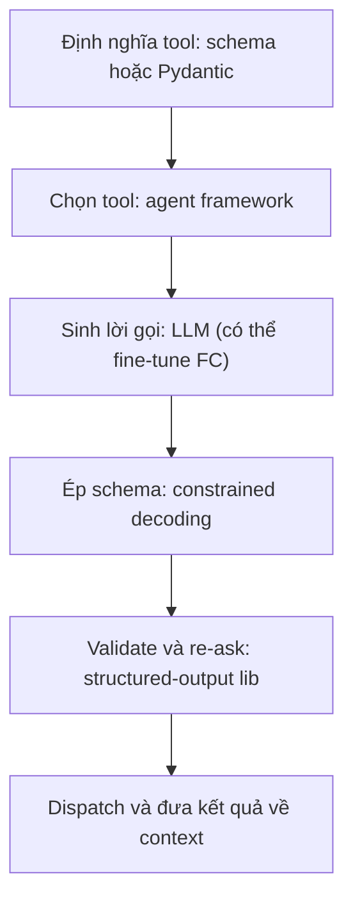
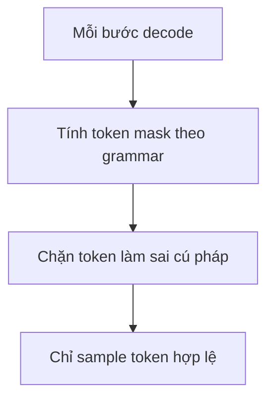

# 06.04 — Kiến Trúc & Thư Viện Hiện Thực Tool-Calling: Các Lớp Giải Pháp Dưới Tầng Prompting

> [!NOTE]
> - Tài liệu đơn vị tự đứng vững làm rõ các lớp giải pháp kỹ thuật hỗ trợ hiện thực tính năng gọi hàm (tool-calling),
> - **tập trung phân tích các giải pháp thay thế** và nâng cấp cho phương pháp prompting truyền thống,
> - chỉ ra các framework và thư viện phổ biến tương ứng với từng giai đoạn xử lý.
> - Tham chiếu chi tiết về ba bước của tool-calling xem tại [03_tool_calling_stages.md](03_tool_calling_stages.md),
> - và cơ chế grounding giá trị xem tại [02_tool_call_grounding.md](02_tool_call_grounding.md).

---

## 1. Dẫn dắt bối cảnh

- **Bối cảnh thực tế**:
  - Khi triển khai tính năng gọi hàm (tool-calling) trên các mô hình ngôn ngữ lớn,
  - phương pháp ban đầu thường là mô tả định dạng đầu ra mong muốn trong system prompt và kỳ vọng mô hình tự tạo ra chuỗi JSON tương ứng.
- **Nghịch lý đo lường**:
  - Phương pháp prompting thuần túy này rất mong manh khi mô hình có thể sinh lỗi định dạng ngẫu nhiên,
  - dẫn đến việc lập trình viên phải liên tục tinh chỉnh câu lệnh (prompt engineering) mà vẫn không đạt được sự đảm bảo tuyệt đối ở mức hạ tầng.

> Tài liệu này sẽ phân tích năm lớp giải pháp kỹ thuật từ tầng client, tầng giải mã đến tầng điều phối agent,
> **định vị chính xác vai trò của từng lớp** trong việc giải quyết ba bước cốt lõi của tool-calling,
> giúp chọn đúng giải pháp kỹ thuật cho từng dạng lỗi cụ thể.

---

## 2. Glossary

- `structured output` -> **Structured Output** ->
  - Ép đầu ra mô hình bám sát một cấu trúc định sẵn,
  - thường được định nghĩa bằng JSON Schema hoặc Pydantic.
- `constrained decoding` -> **Constrained / Guided Decoding** ->
  - Can thiệp ở mức giải mã token của engine,
  - thực hiện chặn (mask) các token không phù hợp với cấu trúc.
- `FSM` -> **Finite State Machine** ->
  - Máy trạng thái hữu hạn,
  - được biên dịch từ biểu thức chính quy hoặc JSON Schema để định hướng sinh token.
- `CFG` -> **Context-Free Grammar** ->
  - Văn phạm phi ngữ cảnh,
  - hỗ trợ biểu diễn các cấu trúc dữ liệu lồng nhau hoặc đệ quy phức tạp.
- `PDA` -> **Pushdown Automaton** ->
  - Automaton có ngăn xếp,
  - là mô hình thực thi vật lý của văn phạm phi ngữ cảnh.
- `re-ask` -> **Retry-on-validation** ->
  - Cơ chế tự động gửi lại thông báo lỗi và yêu cầu mô hình sửa đổi,
  - khi dữ liệu đầu ra không vượt qua bước kiểm thử.
- `tool-call parser` -> **Tool-Call Parser** ->
  - Bộ phân tích cú pháp,
  - dùng để trích xuất các lời gọi hàm thô từ đầu ra của mô hình thành cấu trúc JSON chuẩn.
- `chat template` -> **Chat Template** ->
  - Khuôn định dạng token,
  - dùng để chuẩn hóa hội thoại và lời gọi hàm cho từng dòng mô hình.
- `GBNF` -> **GGML BNF** ->
  - Cú pháp định nghĩa văn phạm,
  - được sử dụng trong thư viện llama.cpp.
- `TPOT` -> **Time Per Output Token** ->
  - Thời gian xử lý trung bình để sinh ra một token đầu ra,
  - dùng để đo lường độ trễ sinh của mô hình.
- `FC` -> **Function Calling** ->
  - Năng lực gọi hàm của mô hình ngôn ngữ lớn,
  - "model FC" là mô hình đã được fine-tune chuyên biệt cho nhiệm vụ này.

---

## 3. Năm lớp giải pháp và vòng đời một lời gọi

### 3.1 Sơ đồ F1 — Mỗi lớp can thiệp vào đâu trong vòng đời

- **Khung đọc sơ đồ F1**:
  - **Đề bài cần giải**:
    - Định vị vị trí can thiệp của từng lớp công cụ kỹ thuật,
    - theo chuỗi vòng đời hoàn chỉnh của một lời gọi hàm.
  - **Giả định nền**:
    - Các lớp giải pháp hoạt động bổ trợ lẫn nhau,
    - và một hệ thống hoàn chỉnh thường kết hợp nhiều lớp cùng lúc.
  - **Ý nghĩa các khối**:
    - `DEF`: Định nghĩa công cụ ban đầu dưới dạng Pydantic hoặc JSON Schema.
    - `SEL`: Lớp điều phối để chọn công cụ (năng lực của Agent Framework).
    - `GEN`: Giai đoạn mô hình sinh ra lời gọi hàm (năng lực của LLM hoặc Fine-tuned Model).
    - `DECODE`: Giai đoạn can thiệp giải mã để đảm bảo cấu trúc (năng lực của Constrained Decoding).
    - `VAL`: Giai đoạn xác thực dữ liệu và yêu cầu sinh lại nếu lỗi (Structured Output Library).
    - `EXEC`: Thực thi hàm và cập nhật kết quả vào ngữ cảnh hội thoại.
  - **Cách đọc sơ đồ**:
    - Vòng đời lời gọi đi tuần tự từ trên xuống dưới.
    - Tại mỗi khối, lập trình viên có thể xác định công cụ phù hợp để can thiệp tùy theo loại lỗi phát sinh trong thực tế.

### 3.2 Bảng phân loại Năm lớp công cụ

- **Lớp 0 — Prompting thủ công**:
  - Đại diện tiêu biểu: Đặt schema trực tiếp vào system prompt.
  - Tác vụ đảm nhận: Đảm nhận cả 3 bước (chọn hàm, cú pháp, giá trị) nhưng ở mức độ ràng buộc mềm.
  - Cơ chế cốt lõi: Dựa trên khả năng tuân thủ câu lệnh của mô hình, tự viết bộ phân tích cú pháp chuỗi đầu ra.
  - Khả năng tự vận hành (Self-host): Không áp dụng.
- **Lớp 1 — Structured-output library**:
  - Đại diện tiêu biểu: Instructor, Pydantic-AI, Marvin.
  - Tác vụ đảm nhận: Tập trung vào bước sinh cú pháp (2) và xác thực giá trị (3).
  - Cơ chế cốt lõi: Sử dụng thư viện Pydantic để kiểm thử đầu ra, thực hiện cơ chế **re-ask** khi phát hiện lỗi.
  - Khả năng tự vận hành (Self-host): Hỗ trợ đầy đủ thông qua các cổng API tương thích với OpenAI.
- **Lớp 2 — Constrained decoding**:
  - Đại diện tiêu biểu: Outlines, XGrammar, Guidance, GBNF.
  - Tác vụ đảm nhận: Đảm nhận chặt chẽ bước sinh cú pháp (2) ở mức độ ràng buộc cứng.
  - Cơ chế cốt lõi: Che (mask) các token không hợp lệ ngay trong quá trình giải mã của engine.
  - Khả năng tự vận hành (Self-host): Tích hợp trực tiếp trong các engine phục vụ như vLLM, SGLang, hoặc TensorRT-LLM.
- **Lớp 3 — Model fine-tune FC**:
  - Đại diện tiêu biểu: xLAM, Hammer, Qwen-FC.
  - Tác vụ đảm nhận: Tối ưu hóa việc chọn hàm (1) và sinh cú pháp (2).
  - Cơ chế cốt lõi: Mô hình được huấn luyện sẵn trên tập dữ liệu gọi hàm chuyên dụng.
  - Khả năng tự vận hành (Self-host): Hỗ trợ triển khai trực tiếp trên hạ tầng riêng.
- **Lớp 4 — Agent framework**:
  - Đại diện tiêu biểu: LangChain, LlamaIndex, Pipecat, LiveKit.
  - Tác vụ đảm nhận: Quản lý việc chọn hàm (1) và toàn bộ vòng đời thực thi.
  - Cơ chế cốt lõi: Đóng gói công cụ, tự động kích hoạt thực thi, và đồng bộ hóa kết quả vào lịch sử hội thoại.
  - Khả năng tự vận hành (Self-host): Hỗ trợ đầy đủ.

- **Kỹ thuật lập trình hóa prompt (DSPy)**:
  - Hoạt động độc lập bằng cách định nghĩa đầu vào/đầu ra qua các **signature** rõ ràng.
  - Sử dụng các **optimizer** để tự động biên dịch và tinh chỉnh câu lệnh dựa trên dữ liệu đánh giá thực tế.
  - Thích hợp khi hệ thống đã có chỉ số đo lường chất lượng cụ thể và cần tối ưu hóa tự động.

---

## 4. Ánh xạ ba bước tool-calling vào các lớp giải pháp

- **Bước 1 — Selection (Lựa chọn)**:
  - Phương pháp Prompting: Có thể thực hiện nhưng độ chính xác kém khi số lượng công cụ lớn.
  - Thư viện Structured-output: Hỗ trợ một phần thông qua việc tối ưu hóa cấu trúc gọi của DSPy.
  - Kỹ thuật Constrained decoding: Không có khả năng giải quyết trực tiếp.
  - Agent framework / Model FC: Là thế mạnh cốt lõi thông qua cơ chế liên kết công cụ (bind_tools), truy hồi công cụ (tool retrieval), và tối ưu hóa từ mô hình fine-tune.
- **Bước 2 — Grammar (Cú pháp)**:
  - Phương pháp Prompting: Mức độ bảo đảm rất yếu, dễ phát sinh lỗi định dạng ngẫu nhiên.
  - Thư viện Structured-output: Đảm bảo tính hợp lệ thông qua quy trình kiểm thử và tự động gửi lại yêu cầu (re-ask).
  - Kỹ thuật Constrained decoding: Đảm bảo độ chính xác tuyệt đối ở mức độ ràng buộc cứng bằng cách chặn token lỗi từ nguồn.
  - Agent framework / Model FC: Ủy thác xử lý xuống tầng giải mã (decoding level).
- **Bước 3 — Args value (Giá trị tham số)**:
  - Phương pháp Prompting: Phụ thuộc hoàn toàn vào năng lực tư duy của mô hình.
  - Thư viện Structured-output: Hỗ trợ kiểm soát thông qua các hàm kiểm thử nghiệp vụ (Pydantic validators) kết hợp re-ask.
  - Kỹ thuật Constrained decoding: Không giải quyết được lỗi sai lệch về mặt ngữ nghĩa (chỉ đảm bảo đúng định dạng kiểu dữ liệu).
  - Agent framework / Model FC: Hỗ trợ một phần thông qua năng lực fine-tune hoặc cơ chế tự sửa của DSPy.

- **Định hướng khắc phục lỗi**:
  - Lỗi định dạng JSON hoặc sai schema: áp dụng Constrained decoding (Lớp 2) để loại bỏ lỗi cú pháp.
  - Lỗi chọn sai công cụ hoặc không kích hoạt công cụ: áp dụng Agent framework (Lớp 4) kết hợp truy hồi công cụ hoặc sử dụng mô hình Fine-tuned chuyên biệt (Lớp 3).
  - Lỗi sai lệch giá trị thực tế của tham số: áp dụng các thư viện Structured-output (Lớp 1) để xây dựng bộ xác thực nghiệp vụ chặt chẽ.

---

## 5. Bước 1 — Selection: Địa hạt của Agent Framework

- **Thư viện LangChain**:
  - Cung cấp hàm `bind_tools()` để chuyển đổi các lớp Pydantic hoặc hàm Python thành định dạng schema gửi cho mô hình.
  - Cung cấp hàm `with_structured_output()` để ép mô hình trả về đúng cấu trúc định nghĩa phía dưới.
  - Lập trình viên chịu trách nhiệm xây dựng bản đồ ánh xạ từ tên công cụ sang hàm thực thi cụ thể (dispatching map).
- **Thư viện LlamaIndex**:
  - Cung cấp các lớp điều phối Agent cấp cao như `FunctionAgent`, `FunctionTool`, và `QueryEngineTool`.
  - Quản lý vòng lặp hội thoại và tự động kích hoạt gọi công cụ dựa trên phản hồi của mô hình.
- **Giải pháp của Microsoft (Semantic Kernel & AutoGen)**:
  - Semantic Kernel tập trung vào cơ chế lập kế hoạch (planning) và gọi hàm.
  - AutoGen hỗ trợ kiến trúc nhiều tác nhân (multi-agent) nhưng cần giám sát chặt chẽ để tránh vòng lặp gọi vô hạn (runaway loop).
- **Các giải pháp chuyên dụng cho hội thoại giọng nói (Pipecat & LiveKit)**:
  - Hỗ trợ định nghĩa công cụ gọi hàm trực tiếp trong luồng xử lý âm thanh (pipeline).
  - Cho phép chạy các tác vụ gọi công cụ ở dạng **background task**, giúp trợ lý ảo có thể tiếp tục tương tác giọng nói với người dùng trong khi chờ kết quả từ hệ thống, giảm thiểu độ trễ cảm nhận.
- **Xử lý tập hợp công cụ quy mô lớn**:
  - Áp dụng kỹ thuật truy hồi công cụ (tool retrieval) để lọc ra top-k công cụ phù hợp nhất,
  - tránh làm quá tải prompt ngữ cảnh và giảm thiểu lỗi suy giảm hiệu năng của mô hình.

---

## 6. Bước 2 — Grammar: Kỹ thuật Constrained Decoding

### 6.1 Cơ chế ép cấu trúc khi giải mã

- **⚙️ Cơ chế**:
  - Trong mỗi bước sinh token, engine phục vụ tính toán một danh sách token hợp lệ (token mask) dựa trên cấu trúc ngữ pháp đã định nghĩa.
  - Các token vi phạm cấu trúc sẽ bị gán xác suất bằng 0, loại bỏ hoàn toàn khả năng sinh lỗi cú pháp từ nguồn.
- **🔍 Cách nhận diện**:
  - Chuỗi đầu ra của mô hình luôn đảm bảo phân tích cú pháp thành công và tuân thủ tuyệt đối schema định sẵn,
  - hoạt động ổn định trên cả các mô hình ngôn ngữ nhỏ.
- **💡 Ý nghĩa**:
  - Khắc phục hoàn toàn lỗi định dạng JSON và lỗi sai cấu trúc tham số (sai khóa, thiếu trường bắt buộc).
- **⚠️ Bẫy**:
  - Ép đúng cấu trúc không đồng nghĩa với việc điền đúng giá trị hoặc chọn đúng hàm mục tiêu (chỉ giải quyết được tính hợp lệ của định dạng).

### 6.2 Sơ đồ F2 — Token masking theo grammar

- **Khung đọc sơ đồ F2**:
  - **Đề bài cần giải**:
    - Mô tả cơ chế chặn lỗi cú pháp trực tiếp tại tầng sinh token của engine phục vụ.
  - **Giả định nền**:
    - Cấu trúc định dạng (JSON Schema hoặc Grammar) đã được biên dịch thành máy trạng thái hữu hạn trước khi giải mã.
  - **Ý nghĩa các khối**:
    - `STEP`: Bước sinh token hiện tại của mô hình ngôn ngữ.
    - `MASK`: Quá trình tính toán danh sách token hợp lệ theo cấu trúc ngữ pháp.
    - `BLOCK`: Thực hiện gán xác suất bằng 0 cho các token vi phạm định dạng.
    - `SAMPLE`: Lựa chọn token tiếp theo từ danh sách các token hợp lệ còn lại.
  - **Cách đọc sơ đồ**:
    - Chu trình lặp lại cho từng token được sinh ra.
    - Nhớ có bước `BLOCK` chặn lỗi từ nguồn, đầu ra cuối cùng luôn đảm bảo hợp lệ về mặt cú pháp mà không cần các bước yêu cầu sinh lại (re-ask).

### 6.3 Phân loại công cụ biên dịch ngữ pháp

- **Nhóm máy trạng thái hữu hạn (FSM)**:
  - Tiêu biểu là Outlines.
  - Biên dịch biểu thức chính quy (regex) hoặc JSON Schema thành máy trạng thái để kiểm soát sinh token.
  - Tốc độ xử lý nhanh nhưng không hỗ trợ các cấu trúc dữ liệu lồng nhau phức tạp hoặc đệ quy.
- **Nhóm văn phạm phi ngữ cảnh (CFG)**:
  - Tiêu biểu là XGrammar, llama.cpp GBNF, và Guidance.
  - Sử dụng mô hình automaton có ngăn xếp (PDA), hỗ trợ hoàn hảo cho các cấu trúc JSON lồng nhau hoặc đệ quy phức tạp.
  - XGrammar hiện là giải pháp tối ưu và là backend mặc định trên nhiều engine phục vụ lớn.

### 6.4 Triển khai trên các Serving Engine self-host

- **Engine vLLM**:
  - Hỗ trợ các tham số cấu hình cấu trúc đầu ra (`guided_json`, `guided_regex`, `guided_grammar`).
  - Mặc định sử dụng thư viện `xgrammar` làm backend xử lý từ phiên bản v0.6.5.
- **Engine SGLang**:
  - Tích hợp mặc định XGrammar với overhead sinh cực thấp (nhà sản xuất công bố dưới 40µs/token).
- **Engine TensorRT-LLM**:
  - Hỗ trợ tích hợp backend thông qua các tùy chọn `xgrammar` hoặc `llguidance`.
- **Đánh đổi về băng thông xử lý (Throughput)**:
  - Kỹ thuật tính toán token mask có thể gây trễ đồng bộ và giảm băng thông tổng thể khi xử lý batch size lớn,
  - cần thực hiện đo lường hiệu năng thực tế trên tải nghiệp vụ thay vì tin tưởng hoàn toàn vào số liệu công bố của nhà sản xuất.

### 6.5 Sự đồng bộ giữa Parser và Chat Template

- **⚙️ Cơ chế**:
  - Mô hình ngôn ngữ lớn được huấn luyện để sinh ra lời gọi hàm đi kèm các ký tự đặc biệt (marker) đặc thù (ví dụ: Qwen sử dụng cấu trúc `<tool_call>...</tool_call>`).
  - Tầng phục vụ cần sử dụng bộ phân tích cú pháp (parser) tương thích để trích xuất đúng nội dung lời gọi hàm.
- **⚠️ Bẫy**:
  - Sử dụng sai parser sẽ dẫn đến lỗi định dạng hoặc bỏ sót lời gọi hàm mặc dù mô hình đã sinh chính xác.
  - Khuyến nghị: Phải đồng bộ tuyệt đối bộ ba cấu hình: **Mô hình ↔ Chat Template ↔ Tool-call Parser** khi triển khai hệ thống.

### 6.6 Đánh đổi đối với khả năng suy luận (Reasoning)

- **Ảnh hưởng hiệu năng**:
  - Nghiên cứu thực nghiệm chỉ ra việc ép định dạng quá chặt chẽ ngay từ đầu làm giảm khả năng tư duy suy luận của mô hình (từ 10% - 30% tùy tác vụ).
  - Tuy nhiên, kỹ thuật này lại mang lại hiệu quả cao đối với các tác vụ phân loại hoặc trích xuất thông tin (slot-filling).
- **Khuyến nghị thiết kế**:
  - Cho phép mô hình tự do suy luận và viết lập luận trung gian trước,
  - chỉ kích hoạt ép định dạng tại thời điểm mô hình bắt đầu sinh lời gọi hàm.

---

## 7. Bước 3 — Args value: Kiểm soát bằng Validator Nghiệp vụ

- **Giới hạn của tầng giải mã**:
  - Cơ chế constrained decoding không thể phát hiện các lỗi sai lệch về mặt ngữ nghĩa nếu giá trị đó vẫn đúng định dạng dữ liệu (ví dụ: điền một số điện thoại sai nhưng vẫn đủ 10 chữ số).
- **Ứng dụng thư viện Structured-output (Instructor)**:
  - Cho phép đính kèm các hàm kiểm thử nghiệp vụ (validators) vào cấu trúc dữ liệu Pydantic.
  - Khi phát hiện lỗi giá trị, thư viện tự động đóng gói lỗi và yêu cầu mô hình sửa đổi (re-ask) tối đa theo số lần cấu hình (`max_retries`).
- **Khuyến nghị cho FCI**:
  - Thiết lập các validator nghiệp vụ nghiêm ngặt cho các trường dữ liệu quan trọng như định dạng số điện thoại, mã dịch vụ, hoặc khoảng thời gian hợp lệ.
  - *Xem chi tiết các cơ chế chuẩn hóa dữ liệu và trích xuất giá trị tại tài liệu [02_tool_call_grounding.md](02_tool_call_grounding.md).*

---

## 8. Đề xuất cấu trúc công nghệ cho trợ lý giọng nói FCI

- **Tầng đánh giá chất lượng (Evaluation)**:
  - Thực hiện phân loại lỗi trên tập dữ liệu thực tế theo ba bước cốt lõi để định vị chính xác điểm nghẽn.
- **Tầng cú pháp và định dạng (Bước 2)**:
  - Triển khai ép định dạng ở tầng giải mã (decoding level) bằng **XGrammar** trên các engine như SGLang hoặc vLLM.
  - Đồng bộ chặt chẽ cấu hình mô hình, template và parser.
- **Tầng giá trị tham số (Bước 3)**:
  - Sử dụng **Instructor** kết hợp các validator nghiệp vụ của Pydantic trên client.
  - Tách biệt logic tính toán ngày tháng hoặc chuẩn hóa thông tin thành các công cụ phụ trợ độc lập thay vì bắt mô hình tự tính toán trong prompt.
- **Tầng lựa chọn công cụ (Bước 1)**:
  - Sử dụng cơ chế truy hồi công cụ (tool retrieval) khi số lượng công cụ nghiệp vụ lớn.
  - Cân nhắc sử dụng các mô hình chuyên dụng cho gọi hàm (xLAM, Qwen-FC) để tăng tính ổn định.
- **Tầng điều phối hội thoại giọng nói**:
  - Triển khai qua các framework hỗ trợ thoại như **Pipecat** hoặc **LiveKit** để tối ưu hóa trễ và hỗ trợ thực thi tác vụ background.
- **Tối ưu hóa tự động**:
  - Áp dụng **DSPy** để tối ưu hóa và tự động hóa việc tinh chỉnh câu lệnh dựa trên dữ liệu phản hồi của khách hàng.

---

## 9. Các câu hỏi nghiên cứu mở

- **Phân bổ lỗi thực tế**:
  - Dữ liệu lỗi của hệ thống FCI thực tế đang tập trung ở bước nào (lựa chọn, cú pháp, hay giá trị)?
- **Đo lường overhead của constrained decoding**:
  - Độ trễ sinh token tăng thêm thực tế là bao nhiêu khi triển khai XGrammar trên hệ thống CSKH chịu tải lớn (CCU cao)?
- **Đánh giá hiệu quả mô hình tiếng Việt chuyên dụng**:
  - Liệu việc tinh chỉnh mô hình chuyên dụng gọi hàm trên tập dữ liệu tiếng Việt có mang lại hiệu năng vượt trội hơn so với việc kết hợp mô hình đa nhiệm và cơ chế constrained decoding?
- **Độ tin cậy của DSPy trên hội thoại thoại**:
  - Khả năng tối ưu hóa tự động của DSPy đối với các kịch bản thoại tiếng Việt đạt mức độ khả thi và chính xác như thế nào?

---

## 10. Tài liệu tham khảo

> Các chỉ số benchmark được trích dẫn trực tiếp từ các tài liệu gốc và cần thực nghiệm kiểm chứng chéo trên hạ tầng thực tế để xác minh.

### 10.1 Các bài báo nghiên cứu khoa học

- `2411.15100` -> **XGrammar**:
  - Kỹ thuật ép cấu trúc ngữ pháp phi ngữ cảnh và tối ưu hiệu năng giải mã token.
  - URL tham chiếu: [https://arxiv.org/pdf/2411.15100](https://arxiv.org/pdf/2411.15100)
- `2408.02442` -> **Let Me Speak Freely?**:
  - Đánh giá sự ảnh hưởng của việc ép định dạng đầu ra đến khả năng suy luận logic của mô hình.
  - URL tham chiếu: [https://arxiv.org/html/2408.02442v1](https://arxiv.org/html/2408.02442v1)
- `2310.03714` -> **DSPy**:
  - Phương pháp lập trình hóa prompt và tối ưu hóa tự động các pipeline mô hình ngôn ngữ lớn.
  - URL tham chiếu: [https://arxiv.org/pdf/2310.03714](https://arxiv.org/pdf/2310.03714)
- `2312.13382` -> **DSPy Assertions**:
  - Tích hợp các ràng buộc nghiệp vụ để mô hình tự sửa lỗi đầu ra.
  - URL tham chiếu: [https://arxiv.org/pdf/2312.13382](https://arxiv.org/pdf/2312.13382)
- `2601.07525` -> **Thinking Before Constraining**:
  - Kỹ thuật cho phép mô hình lập luận tự do trước khi ép định dạng gọi hàm.
  - URL tham chiếu: [https://www.arxiv.org/pdf/2601.07525](https://www.arxiv.org/pdf/2601.07525)

### 10.2 Tài liệu hướng dẫn kỹ thuật của các Framework

- **Instructor**:
  - Hướng dẫn áp dụng Pydantic và cơ chế tự động yêu cầu sinh lại đầu ra.
  - URL tham chiếu: [https://python.useinstructor.com/](https://python.useinstructor.com/)
- **DSPy**:
  - Hướng dẫn định nghĩa signature và sử dụng bộ tối ưu hóa tự động.
  - URL tham chiếu: [https://dspy.ai/learn/programming/signatures/](https://dspy.ai/learn/programming/signatures/)
- **Pydantic-AI**:
  - Framework xây dựng Agent an toàn kiểu dữ liệu.
  - URL tham chiếu: [https://ai.pydantic.dev/](https://ai.pydantic.dev/)
- **LangChain tool calling**:
  - Hướng dẫn tích hợp gọi hàm trong LangChain.
  - URL tham chiếu: [https://www.langchain.com/blog/tool-calling-with-langchain](https://www.langchain.com/blog/tool-calling-with-langchain)
- **LlamaIndex agents**:
  - URL tham chiếu: [https://docs.llamaindex.ai/en/stable/module_guides/deploying/agents/](https://docs.llamaindex.ai/en/stable/module_guides/deploying/agents/)
- **OpenAI Structured Outputs**:
  - Hướng dẫn cấu hình strict JSON Schema trên API OpenAI.
  - URL tham chiếu: [https://openai.com/index/introducing-structured-outputs-in-the-api/](https://openai.com/index/introducing-structured-outputs-in-the-api/)
- **Anthropic tool use**:
  - Hướng dẫn gọi hàm với dòng mô hình Claude.
  - URL tham chiếu: [https://platform.claude.com/docs/en/agents-and-tools/tool-use/how-tool-use-works](https://platform.claude.com/docs/en/agents-and-tools/tool-use/how-tool-use-works)
- **vLLM Structured Outputs**:
  - Tài liệu hướng dẫn cấu hình sinh có cấu trúc trên vLLM.
  - URL tham chiếu: [https://docs.vllm.ai/en/stable/features/structured_outputs.html](https://docs.vllm.ai/en/stable/features/structured_outputs.html)
- **vLLM Tool Calling**:
  - URL tham chiếu: [https://docs.vllm.ai/en/stable/usage/tool_calling.html](https://docs.vllm.ai/en/stable/usage/tool_calling.html)
- **SGLang Structured Outputs**:
  - URL tham chiếu: [https://docs.sglang.ai/advanced_features/structured_outputs.html](https://docs.sglang.ai/advanced_features/structured_outputs.html)
- **TensorRT-LLM Guided Decoding**:
  - Hướng dẫn cấu hình giải mã có hướng dẫn trên TensorRT-LLM.
  - URL tham chiếu: [https://github.com/NVIDIA/TensorRT-LLM/blob/main/docs/source/features/guided-decoding.md](https://github.com/NVIDIA/TensorRT-LLM/blob/main/docs/source/features/guided-decoding.md)
- **LiveKit function calling**:
  - Thiết lập gọi hàm chạy ngầm (background) cho trợ lý ảo giọng nói.
  - URL tham chiếu: [https://docs.livekit.io/agents/voice-agent/function-calling/](https://docs.livekit.io/agents/voice-agent/function-calling/)
- **Pipecat function calling**:
  - URL tham chiếu: [https://docs.pipecat.ai/pipecat/learn/function-calling](https://docs.pipecat.ai/pipecat/learn/function-calling)

### 10.3 Mã nguồn mở trên GitHub

- **Instructor**:
  - URL tham chiếu: [https://github.com/567-labs/instructor](https://github.com/567-labs/instructor)
- **stanfordnlp/dspy**:
  - URL tham chiếu: [https://github.com/stanfordnlp/dspy](https://github.com/stanfordnlp/dspy)
- **mlc-ai/xgrammar**:
  - URL tham chiếu: [https://github.com/mlc-ai/xgrammar](https://github.com/mlc-ai/xgrammar)
- **llama.cpp GBNF grammars**:
  - Hướng dẫn viết cú pháp EBNF trên llama.cpp.
  - URL tham chiếu: [https://github.com/ggml-org/llama.cpp/blob/master/grammars/README.md](https://github.com/ggml-org/llama.cpp/blob/master/grammars/README.md)
- **vllm issue #9312**:
  - Báo cáo lỗi sai cấu hình parser dẫn đến thất bại khi gọi hàm.
  - URL tham chiếu: [https://github.com/vllm-project/vllm/issues/9312](https://github.com/vllm-project/vllm/issues/9312)

### 10.4 Các bài viết công nghệ tham chiếu

- **A Guide to Structured Outputs**:
  - URL tham chiếu: [https://www.aidancooper.co.uk/constrained-decoding/](https://www.aidancooper.co.uk/constrained-decoding/)
- **vLLM blog — Structured Decoding a gentle introduction**:
  - URL tham chiếu: [https://vllm.ai/blog/2025-01-14-struct-decode-intro](https://vllm.ai/blog/2025-01-14-struct-decode-intro)
- **SqueezeBits — Guided Decoding Performance**:
  - URL tham chiếu: [https://blog.squeezebits.com/guided-decoding-performance-vllm-sglang](https://blog.squeezebits.com/guided-decoding-performance-vllm-sglang)
- **Red Hat — Structured outputs in vLLM**:
  - URL tham chiếu: [https://developers.redhat.com/articles/2025/06/03/structured-outputs-vllm-guiding-ai-responses](https://developers.redhat.com/articles/2025/06/03/structured-outputs-vllm-guiding-ai-responses)

---

## ✅ Tự kiểm nhanh

1. Vì sao cơ chế Constrained Decoding được đánh giá là "cứng" hơn phương pháp Prompting?

- **Không phụ thuộc vào sự tuân thủ của mô hình**:
  - Prompting chỉ là một dạng ràng buộc mềm, dựa vào khả năng hiểu và tuân thủ định dạng của mô hình ngôn ngữ.
  - Constrained decoding can thiệp trực tiếp vào quá trình giải mã ở tầng sinh token của engine phục vụ,
  - chặn hoàn toàn các token vi phạm cấu trúc ngữ pháp ngay tại nguồn.
- **Tác vụ đảm nhận**:
  - Giải quyết triệt để lỗi cú pháp định dạng (Bước 2).
  - Không hỗ trợ giải quyết lỗi chọn công cụ (Bước 1) hoặc lỗi sai lệch giá trị tham số (Bước 3).

2. Vai trò cụ thể của Agent Framework, Structured-output Library và Constrained Decoding là gì?

- **Agent Framework (như LangChain, LiveKit)**:
  - Phụ trách quản lý việc lựa chọn công cụ (Bước 1), điều phối luồng xử lý và đồng bộ lịch sử hội thoại.
- **Constrained Decoding (như XGrammar)**:
  - Phụ trách ép định dạng cấu pháp JSON Schema cứng (Bước 2) trong quá trình giải mã token.
- **Structured-output Library (như Instructor)**:
  - Phụ trách xác thực giá trị tham số (Bước 3) bằng các ràng buộc nghiệp vụ ở client và thực hiện re-ask khi lỗi.

3. Lỗi cấu hình parser trên vLLM/SGLang dẫn đến hệ quả gì?

- **Gây thất bại cuộc gọi hàm**:
  - Khi mô hình sinh đúng cấu trúc bọc lời gọi hàm (ví dụ: sử dụng thẻ `<tool_call>`) nhưng engine cấu hình sai parser tương ứng,
  - parser sẽ không thể phát hiện và trích xuất cấu trúc lời gọi,
  - dẫn đến việc hệ thống coi đó là văn bản thông thường hoặc báo lỗi định dạng mặc dù mô hình hoạt động chính xác.

