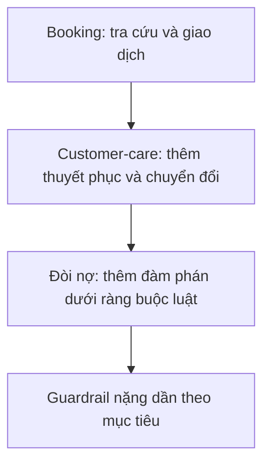
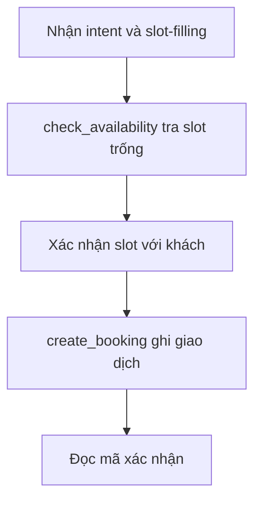
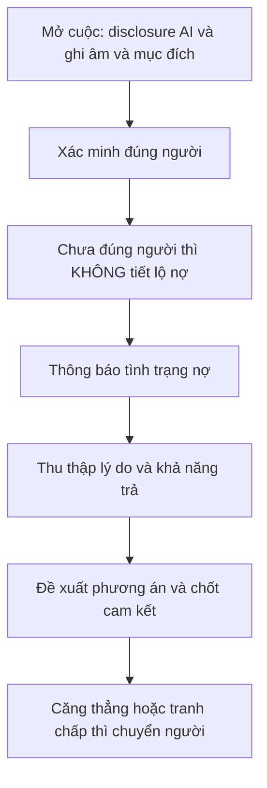

# 06.05 — Ba Domain Chăm Sóc Khách Hàng: Kiến Trúc Mục Tiêu và Dữ Liệu Để Ghép Tool-Calling

> [!NOTE]
> - Tài liệu đơn vị tự đứng vững, đi vào ba domain CSKH cụ thể: **Booking · Customer-care chủ động · Thu hồi nợ**.
> - Mục tiêu: làm rõ mỗi domain cần **kiến trúc mục tiêu + tool + dữ liệu/state + mức guardrail** gì để ghép tool-calling hiệu quả.
> - Ba domain xếp theo **độ phức tạp mục tiêu tăng dần**: giao dịch → chuyển đổi → hành vi dưới ràng buộc luật.
> - Tham chiếu: taxonomy 4 loại tool + grounding ở [06.02](02_tool_call_grounding.md); ba bước tool-calling ở [06.03](03_tool_calling_stages.md); guardrail ở [07](../07_guardrails/00_README.md).
> - **Lưu ý (đòi nợ):** năng lực hợp pháp cần có là **truyền đạt mức độ nghiêm trọng có kiểm soát** (cảnh báo hậu quả rõ ràng, có thật + giọng điệu nghiêm túc) — xem §6.5; chỉ **đe doạ TRÁI LUẬT** (bịa hậu quả, bạo lực, liên hệ người thân, quấy rối) mới là vùng cấm guardrail chặn.

---

## 1. Dẫn dắt bối cảnh

- **Hai cuộc gọi nghe rất khác nhau**:
  - Một cuộc đặt bàn nhà hàng: khách chủ động, mục tiêu rõ, bot chỉ cần tra slot trống rồi ghi.
  - Một cuộc nhắc nợ: bot chủ động gọi đi, phải xác minh đúng người, giữ đúng luật, đàm phán phương án trả.
- **Câu hỏi kiến trúc**:
  - Vì sao cùng một nền tảng voice-agent, hai cuộc gọi này lại đòi hỏi **lượng dữ liệu và mức kiểm soát hoàn toàn khác nhau**?
  - Khác biệt nằm ở **độ phức tạp của MỤC TIÊU** cuộc gọi — và mục tiêu càng phức thì dữ liệu, tool, guardrail phải chuẩn bị càng nặng.

> Tài liệu này mổ ba domain theo trục độ-phức-tạp-mục-tiêu, và với mỗi domain trả lời bốn câu cụ thể: mục tiêu/luồng là gì, cần tool nào (theo taxonomy), cần chuẩn bị dữ liệu/state gì, và guardrail nặng tới đâu — để biết phải "dọn dữ liệu" gì trước khi ghép tool-calling.

---

## 2. Glossary

- `PTP` -> **Promise-to-Pay** ->
  - Cam kết trả nợ (số tiền + ngày hẹn) thu được trong cuộc gọi đòi nợ.
- `RPC` -> **Right-Party Contact** ->
  - Xác nhận đang nói đúng người nợ trước khi tiết lộ thông tin nợ.
- `DPD` -> **Days Past Due** ->
  - Số ngày quá hạn của khoản nợ.
- `FDCPA` -> **Fair Debt Collection Practices Act** ->
  - Luật thu hồi nợ của Mỹ; `Reg F` (12 CFR 1006) là quy định triển khai.
- `TCPA` -> **Telephone Consumer Protection Act** ->
  - Luật Mỹ về gọi tự động; FCC coi giọng AI là "artificial voice" cần consent.
- `mini-Miranda` -> **Mini-Miranda Disclosure** ->
  - Câu bắt buộc tự khai là bên thu nợ + mục đích thu nợ.
- `objection handling` -> **Objection Handling** ->
  - Kỹ thuật nhận diện và phản hồi lời từ chối của khách.
- `warm transfer` -> **Warm Transfer** ->
  - Chuyển cuộc cho nhân viên kèm đầy đủ ngữ cảnh đã thu thập.
- `opt-out` -> **Opt-out** ->
  - Quyền khách yêu cầu ngừng liên hệ; phải tôn trọng tức thì.
- `slot` -> **Slot** ->
  - Ô thông tin cần điền cho giao dịch/tool (ngày, giờ, số người...).
- `IDOR` -> **Insecure Direct Object Reference** ->
  - Lỗ hổng cho truy cập dữ liệu người khác qua định danh — ở đây là tiết lộ nợ sai người.

---

## 3. Trục chung: ba domain theo độ phức tạp mục tiêu

### 3.1 Sơ đồ D1 — Thang độ phức tạp mục tiêu

- **Khung đọc sơ đồ D1**:
  - **Đề bài cần giải**:
    - Cho thấy ba domain không cùng độ khó; mục tiêu càng phức thì gánh nặng dữ liệu + guardrail càng tăng.
  - **Giả định nền**:
    - Cùng một nền tảng voice-agent + cùng cụm tool-calling (xem 06.01–06.04).
  - **Ý nghĩa các khối**:
    - `BOOK` mục tiêu giao dịch rõ; `CARE` thêm mục tiêu tối ưu tỉ lệ; `DEBT` thêm ràng buộc pháp lý cứng; `GUARD` là hệ quả: mức kiểm soát tăng dần.
  - **Cách đọc sơ đồ**:
    - Đọc dọc như một thang; vị trí domain trên thang quyết định lượng dữ liệu phải chuẩn bị và độ chặt của guardrail.

### 3.2 Bốn câu hỏi áp cho mỗi domain

- **Mục tiêu & luồng**: cuộc gọi nhằm đạt gì, đi qua các bước nào.
- **Tool cần (theo taxonomy 06.02)**: system-call · RAG-query · tham số trích xuất · suy luận nhiều bước.
- **Dữ liệu/state phải chuẩn bị**: structured DB · knowledge/RAG · slot/entity track · metadata định danh.
- **Mức guardrail**: nhẹ (booking) → trung (customer-care) → nặng/bắt buộc (đòi nợ).

### 3.3 Vì sao cần AI-voice-bot (không phải rule-based)

- ⚙️ **Cơ chế**:
  - Chính **độ phức tạp mục tiêu** quyết định cần AI hay chỉ cần rule-based.
  - Mục tiêu **đơn giản, không cần thuyết phục** (thông báo một chiều, quảng cáo phát sẵn, menu IVR) → **rule-based / TTS script là đủ**.
  - Mục tiêu **phức** (đọc phản ứng khách, điều chỉnh lập luận và **giọng điệu/cảm xúc**, đàm phán, cảnh báo có trọng lượng) → **cần AI-voice-bot** (LLM + expressive TTS).
- 🔍 **Cách nhận diện**:
  - Vẽ được hết kịch bản bằng một cây quyết định cứng → rule-based.
  - Phải hiểu ngữ cảnh + cá nhân hoá + điều tiết cảm xúc theo phản ứng → AI.
- 💡 **Ý nghĩa**:
  - Giá trị của AI-voice-bot nằm **đúng ở các domain khó/cao-target** — customer-care (thuyết phục) và đòi nợ (truyền đạt mức nghiêm trọng), **không** phải ở phát thông báo.
  - Đây là lý do ba domain trong tài liệu này đều thuộc nhóm "đáng dùng AI".
- ⚠️ **Bẫy**:
  - Dùng AI cho việc rule-based làm được = đốt chi phí + tăng rủi ro thừa.
  - Dùng rule-based cho việc cần đọc cảm xúc = vô hiệu, vỡ trận khi khách phản ứng ngoài kịch bản.

---

## 4. Domain 1 — Booking / Giao dịch

- **Đặc trưng**: mục tiêu **rõ, nhị phân** (xong/chưa); ràng buộc chính là **correctness** — bot không được bịa slot trống.

### 4.1 Mục tiêu & luồng

#### Sơ đồ D2 — Luồng đặt mới

- **Khung đọc sơ đồ D2**:
  - **Đề bài cần giải**: chuẩn hoá luồng đặt mới đơn giản nhất.
  - **Giả định nền**: lịch trống là dữ liệu realtime, có khoá tránh đặt trùng.
  - **Ý nghĩa các khối**: `CHECK` đọc nguồn sự thật; `CREATE` là hành động ghi side-effect.
  - **Cách đọc**: phải `CONFIRM` trước `CREATE`; đổi/hủy là **luồng riêng**, không sinh từ luồng này.

- **Nguyên tắc kiến trúc** (đồng thuận nhiều nguồn):
  - **Tách lớp**: extraction (rút entity — pluggable LLM/regex/NER) **tách khỏi** flow logic (Python deterministic) — không để LLM tự quyết business logic.
  - Reschedule/cancel là **flow riêng** + kiểm điều kiện phí (suy luận nhiều bước).

### 4.2 Tool cần (map taxonomy)

- **`check_availability`** -> loại (2) RAG-query/tra cứu -> tham số: dịch vụ, ngày, khoảng giờ, số người.
- **`lookup_booking`** -> loại (3) trích xuất (sđt → booking) -> tham số: phone / booking_id.
- **`create_booking`** -> **action ghi** (ngoài 4 loại tra cứu) -> cần confirm + idempotency.
- **`reschedule_booking` / `cancel_booking`** -> loại (4) suy luận nhiều bước (tra → kiểm điều kiện → áp phí).
- **`get_policy`** (phí đổi/hủy) -> loại (2) RAG-query.
- **`transfer_to_human` / `end_call`** -> loại (1) system-call.

### 4.3 Dữ liệu / state phải chuẩn bị

- **Structured (realtime)**:
  - Lịch trống / inventory slot — nguồn sự thật, có khoá tránh đặt trùng.
  - Bảng giá / phí đổi-hủy.
  - Hồ sơ KH (map `phone → customer_id`).
  - Booking hiện có (cho lookup/reschedule/cancel).
- **Knowledge / RAG**:
  - Chính sách đổi-trả, điều kiện đổi vé/lịch theo mốc thời gian.
  - Điều khoản dịch vụ.
- **Slot/state track**:
  - Required slots: dịch vụ, ngày, giờ, số lượng, tên, phone.
  - Cờ "đủ slot chưa" để routing hỏi-tiếp hay gọi-tool.
- **Đo lường**: task success/completion · slot-filling accuracy (JGA) · tỉ lệ phải chuyển người · tỉ lệ đặt trùng/sai slot.

---

## 5. Domain 2 — Customer-care chủ động (nhắc lịch / khuyến mãi / upsell-retention)

- **Đặc trưng**: mục tiêu **phức hơn** — không chỉ "làm xong việc" mà **tối đa hoá chuyển đổi / giữ chân**; thêm chiều persuasion và ranh giới gây phiền.

### 5.1 Mục tiêu & luồng

- Mở thoại + **disclosure là AI** → nạp context tài khoản → xác minh KH → đưa **offer cá nhân hoá** → **xử lý từ chối (objection handling)** → chốt **hoặc** warm transfer sang người (kèm context) → ghi outcome về CRM.
- **Điểm kiến trúc**: cuộc giữ-chân giá trị cao nên kết thúc bằng **warm transfer** sang nhân viên đã nạp đủ ngữ cảnh — bot "dọn đường" thay vì cố tự chốt.

### 5.2 Tool cần (map taxonomy)

- **`lookup_account`** (sđt → segment, usage, churn signal) -> loại (3) trích xuất + tra cứu.
- **`recommend_offer`** (chọn offer theo segment) -> loại (4) suy luận nhiều bước.
- **`get_promo_terms`** -> loại (2) RAG-query.
- **`apply_promo` / `send_voucher` / `apply_discount`** -> action ghi (có thể đụng payment).
- **`schedule_callback`** -> giao dịch (như booking).
- **`warm_transfer_to_human`** -> loại (1) system-call + đẩy context (objection + offer đã chuẩn bị).
- **`log_outcome` / `opt_out`** -> action ghi (compliance).

### 5.3 Dữ liệu / state phải chuẩn bị

- So với booking, cần thêm hẳn **lớp dữ liệu cá nhân hoá + tín hiệu hành vi**:
  - **Structured**:
    - Segment / lifecycle stage (phân nhóm để chọn offer).
    - Product usage patterns (mức dùng, sản phẩm đang có).
    - Churn signals + behavioral/intent signals (để gọi khi "intent ấm", không gọi tràn lan).
    - Lịch sử mua + hồ sơ KH; **CRM đồng bộ hai chiều** outcome.
  - **Knowledge / RAG**:
    - Điều kiện khuyến mãi, điều khoản voucher.
    - **Battle-card**: kho phản đối thường gặp (giá, thời điểm, đang hài lòng) + cách reframe.
    - Quy định compliance + opt-out.
  - **Slot/state track**:
    - Objection đã nhận diện; offer đã đưa/đã từ chối; cờ consent/opt-out.
- **Đo lường**: conversion rate · save/acceptance rate · contact/qualification rate · sentiment.
  - ⚠️ Các con số vendor (uplift conversion 20-30%, save 40-55%) **chưa xác minh** — không dùng làm baseline mục tiêu.
- **Ranh giới**: bắt buộc disclosure AI đầu cuộc, opt-out, chỉ gọi khi có tín hiệu intent — chống spam/gây phiền.

---

## 6. Domain 3 — Thu hồi nợ hợp pháp (debt collection)

- **Đặc trưng**: mục tiêu **hành vi phức tạp nhất** (thu cam kết trả) **đi kèm ràng buộc pháp lý cứng**; rủi ro pháp lý/thương hiệu cao nhất.

### 6.1 Mục tiêu & luồng (mỗi bước có gate compliance)

#### Sơ đồ D3 — Luồng đòi nợ tuân thủ

- **Khung đọc sơ đồ D3**:
  - **Đề bài cần giải**: chuẩn hoá luồng đòi nợ sao cho mỗi bước nằm trong khuôn khổ luật.
  - **Giả định nền**: cuộc gọi bị ràng buộc giờ + tần suất; thông tin nợ là PII nhạy cảm.
  - **Ý nghĩa các khối**: `VERIFY → GATE` là chốt chặn quan trọng nhất — chưa xác minh đúng người thì không nói bất cứ chi tiết nợ nào.
  - **Cách đọc**: `GATE` chống tiết lộ nợ cho bên thứ ba (vừa là yêu cầu luật, vừa là một dạng IDOR/PII-leak); `ESC` là đường thoát bắt buộc.

### 6.2 Tool + dữ liệu/state

- **Dữ liệu khoản nợ**: số dư gốc/lãi/phí, ngày đến hạn, DPD, lịch sử trả/cam kết — không được nói sai số.
- **Xác minh danh tính** -> tool verify (tên + ≥1 yếu tố phụ) + cờ `verified` -> gate trước tiết lộ.
- **Date math** -> tool tính số tiền tới hôm nay -> **không để LLM tự tính** (chống bịa số → tránh "false representation").
- **Promise-to-pay** -> tool ghi PTP (số tiền, ngày hẹn, kênh) + theo dõi promise-kept.
- **Phương án trả** -> bảng phương án **đã duyệt** (trả 1 lần / trả góp / giãn nợ) -> bot không tự "sáng tác" ưu đãi.
- **Escalate human** -> tool chuyển người + lý do.
- **State đàm phán** -> đã disclosure? đã verify? số lượt gọi trong ngày? đã opt-out?
- **Audit log** -> timestamp + recording + outcome + PTP/dispute, không sửa được.

### 6.3 Tuân thủ (trọng tâm)

- **Quốc tế (Mỹ)**:
  - **FDCPA / Reg F**: giờ gọi **8h–21h** giờ địa phương; quy tắc **7-in-7** (gọi cùng khoản nợ quá 7 lần/7 ngày bị giả định vi phạm); cấm quấy rối; **right-party contact** + cấm tiết lộ nợ cho bên thứ ba; mini-Miranda + validation notice trong 5 ngày.
  - **TCPA / FCC 24-17**: giọng AI bị coi là "artificial voice" → cần **prior express consent**; xu hướng (FCC 24-84, đề xuất ⚠️) bắt buộc khai là AI đầu cuộc.
- **Việt Nam**:
  - **Luật Đầu tư 2020**: cấm **kinh doanh dịch vụ đòi nợ thuê** → thu hồi nợ chỉ hợp pháp khi do chính chủ nợ / tổ chức tín dụng thực hiện trong khuôn khổ hợp đồng.
  - **Thông tư 18/2019/TT-NHNN** (công ty tài chính tiêu dùng): nhắc nợ **tối đa 5 lần/ngày**, khung **7h–21h**, **cấm dùng biện pháp đe doạ**, **cấm nhắc nợ/gửi thông tin nợ cho người thân** của khách.
  - **Nghị định 13/2023/NĐ-CP** (bảo vệ dữ liệu cá nhân): xử lý PII đúng mục đích đã khai báo; gọi sai người/tiết lộ nợ bên thứ ba có thể vi phạm.
  - ⚠️ **Chưa xác minh**: mức phạt cụ thể; **chưa thấy văn bản riêng cho voice-bot AI đòi nợ tại VN** → áp **chuẩn chặt nhất (giao của US + VN)** làm baseline; **tham vấn luật sư VN trước khi triển khai thật**.

### 6.4 Guardrail bắt buộc (map [Layer 07](../07_guardrails/00_README.md))

- **Cảnh báo cốt lõi** (ScamAgents): guardrail tĩnh per-prompt **thất bại** trước agent đa-turn — ý đồ bị chia nhỏ qua nhiều lượt né được filter (refusal rate tụt 84-100% → 17-32%). → một bot "ôn hoà từng câu" vẫn có thể **trượt dần sang đe doạ** qua nhiều lượt.
- **Các chốt bắt buộc**:
  - **Moderation đa-turn** chặn đe doạ **trái luật** / quấy rối / bịa hậu quả sai sự thật / xúc phạm (theo dõi escalation tích luỹ, không chỉ per-turn; cả text lẫn sau khi thành TTS) — **khác** với cảnh báo hậu quả hợp pháp ở §6.5.
  - **Verify-trước-tiết-lộ**: gate cứng `verified==true` mới mở thông tin nợ (chống IDOR/PII).
  - **Giới hạn giờ + tần suất** enforce ở **tầng dispatch** (VN: 5 lần/ngày, 7h-21h) — chặn TRƯỚC khi quay số.
  - **Disclosure bắt buộc** (AI + ghi âm + mục đích), không cho skip.
  - **Đường escalate human** khi tranh chấp/đòi luật sư/opt-out/tín hiệu căng thẳng.
  - **Persona lock**: cấm bot giả danh cơ quan nhà nước hoặc đe doạ pháp lý sai.
- **Đo lường**: PTP rate · RPC rate · promise-kept rate · **compliance-rate là ràng buộc cứng** — đề xuất chỉ tính PTP nếu compliance = 100% cho cuộc đó.

### 6.5 Năng lực lõi: truyền đạt mức độ nghiêm trọng có kiểm soát

Đây là năng lực khiến domain đòi nợ **phải dùng AI** chứ không phải rule-based — và phải tách rõ khỏi đe doạ trái luật.

- ⚙️ **Cơ chế**:
  - Bot truyền đạt **hậu quả có thật** của việc chậm trả (phát sinh lãi/phí, chuyển xử lý theo hợp đồng, ảnh hưởng lịch sử tín dụng),
  - bằng **giọng điệu nghiêm túc, khẩn trương, điều tiết cảm xúc** theo phản ứng của khách,
  - để khách **hiểu đúng mức độ nghiêm trọng** và đi tới cam kết trả.
- 🔍 **Cách nhận diện ranh giới** (hợp pháp ↔ trái luật) — cùng "mức căng" nhưng khác bản chất:
  - **Hợp pháp (năng lực cần có)**: nội dung **đúng sự thật + đúng luật + tôn trọng nhân phẩm**; nêu hậu quả thực tế theo hợp đồng/quy định.
  - **Trái luật (guardrail chặn — xem §6.4)**: **bịa** hậu quả sai sự thật, đe doạ bạo lực/tới nhà, xúc phạm-lăng mạ, liên hệ-bôi nhọ người thân, quấy rối tần suất.
  - Ranh giới = **sự thật × hợp pháp × nhân phẩm**, không phải ở chỗ "to tiếng hay nhẹ nhàng".
- 💡 **Ý nghĩa**:
  - Đúng phần "đọc cảm xúc + điều tiết giọng điệu theo ngữ cảnh" này là thứ **rule-based không làm được** (xem §3.3) → lý do cốt lõi để dùng AI ở domain khó.
- ⚠️ **Bẫy & hướng kỹ thuật cần đào sâu**:
  - Điều tiết cảm xúc/giọng điệu đòi **expressive / controllable TTS** (điều khiển prosody, emotion) — chưa nằm trong tài liệu này, là hướng nghiên cứu riêng (lớp TTS).
  - Cần **escalation ladder theo DPD** (mức cảnh báo tăng dần theo số ngày quá hạn) + **consequence framing** đúng pháp lý — nội dung cảnh báo nên có người/luật sư duyệt trước khi đưa vào.

---

## 7. So sánh ba domain và checklist dữ liệu để ghép tool-calling

- **Theo mục tiêu**:
  - Booking: rõ, nhị phân (xong/chưa).
  - Customer-care: tối ưu tỉ lệ (conversion/retention).
  - Đòi nợ: cam kết trả **dưới ràng buộc luật**.
- **Theo tool nặng nhất**:
  - Booking: action ghi giao dịch + correctness.
  - Customer-care: suy luận cá nhân hoá offer + warm transfer.
  - Đòi nợ: verify-gate + date-math + PTP + escalate, mọi action qua gate compliance.
- **Theo dữ liệu lõi phải chuẩn bị**:
  - Booking: slot trống realtime, giá, policy đổi-hủy.
  - Customer-care: segment + usage + churn/intent + battle-card.
  - Đòi nợ: dữ liệu khoản nợ chính xác + xác minh danh tính + bảng phương án đã duyệt + audit log.
- **Theo guardrail**:
  - Booking: nhẹ (chống hallucinate slot, confirm trước ghi).
  - Customer-care: trung (disclosure, opt-out, chống spam).
  - Đòi nợ: nặng/bắt buộc (đa-turn moderation, verify-gate, giờ/tần suất, audit).
- **Mẫu số chung cho cả ba** (chuẩn bị trước khi ghép tool-calling):
  - `phone` là **khoá định danh** ghép sđt → account → lịch sử (loại tool 3).
  - Số liệu/giá trị nhạy cảm phải do **tool deterministic** cung cấp, không để LLM tự suy.
  - Mọi action ghi side-effect cần **confirm + idempotency**.
  - Knowledge (policy/điều khoản/khuyến mãi) tách thành nguồn RAG riêng, không nhồi vào prompt cứng.

---

## 8. Khuyến nghị cho FCI và câu hỏi mở

- **Khuyến nghị**:
  - Bắt đầu chứng minh giá trị ở **Booking** (mục tiêu rõ, rủi ro thấp, dữ liệu structured sẵn) trước khi lên customer-care rồi đòi nợ.
  - Coi **compliance là gate cứng** cho domain đòi nợ ngay từ thiết kế, không vá sau.
  - Chuẩn hoá một **lớp dữ liệu định danh** (`phone → account → history`) dùng chung cả ba domain.
- **Câu hỏi mở**:
  - Dữ liệu structured của khách FCI (lịch/đơn/khoản nợ) sẵn sàng tới đâu để ghép tool — cần khảo sát hệ thống thật.
  - Khung pháp lý VN cho **voice-bot AI đòi nợ** (disclosure, consent ghi âm) — cần luật sư xác nhận.
  - Battle-card objection tiếng Việt cho customer-care — chưa có, phải tự xây.

---

## 9. Nguồn (tách theo loại để kiểm chứng thủ công)

> Lưu ý: số % hiệu quả (conversion/save/PTP) phần lớn là **vendor marketing** → ⚠️ chưa xác minh. Điều luật trích theo văn bản gốc; mức phạt VN ⚠️ cần đối chiếu lại.

### (a) Paper arXiv
- `2402.10466` — *LLMs as Zero-shot DST through Function Calling*: function-calling làm cơ chế dialogue state tracking. https://arxiv.org/abs/2402.10466
- `2406.08848` — *Zero-Shot Slot-Filling for Industry-Grade Assistants*: slot-filling booking/restaurant. https://arxiv.org/abs/2406.08848
- `2508.06457` — *ScamAgents*: agent đa-turn né guardrail (refusal 84-100% → 17-32%). https://arxiv.org/html/2508.06457v1
- `2312.06674` — *Llama Guard*: classifier input-output theo taxonomy rủi ro. https://arxiv.org/pdf/2312.06674

### (b) Doc chính thức / luật
- CFPB — when/how often a debt collector can call (8h-21h, 7-in-7): https://www.consumerfinance.gov/ask-cfpb/when-and-how-often-can-a-debt-collector-call-me-on-the-phone-en-2110/
- eCFR — 12 CFR Part 1006 (Regulation F): https://www.ecfr.gov/current/title-12/chapter-X/part-1006
- Thông tư 18/2019/TT-NHNN (5 lần/ngày, 7h-21h, cấm đe doạ, cấm liên hệ người thân): https://thuvienphapluat.vn/van-ban/Tien-te-Ngan-hang/Thong-tu-18-2019-TT-NHNN-sua-doi-Thong-tu-43-2016-TT-NHNN-cho-vay-tieu-dung-409941.aspx
- Nghị định 13/2023/NĐ-CP (bảo vệ dữ liệu cá nhân): https://vanban.chinhphu.vn/?pageid=27160&docid=207759
- Microsoft Azure AI Foundry — booking agent (3 lớp Decision/Action/Synthesis): https://techcommunity.microsoft.com/blog/azure-ai-foundry-blog

### (c) Repo GitHub / pattern
- bansky-cl/tods-arxiv-daily-paper (intent/slot/DST): https://github.com/bansky-cl/tods-arxiv-daily-paper
- Guardrail tham chiếu: NeMo Guardrails, Llama Guard (⚠️ chưa có repo open-source chuyên voice-bot đòi nợ tuân thủ).

### (d) Blog / case study (vendor — đọc phê phán)
- Medium (Juan Luis) — Stop Building Unpredictable AI Agents for Booking (tách extraction/flow). 
- Dograh — reschedule là flow riêng, lookup theo phone: https://dograh.com/feeds/blog/conversational-ai-appointment-booking
- Fini Labs — outbound retention/save desk, warm transfer: https://usefini.com/guides/outbound-ai-voice-platforms-customer-retention
- Retell AI — sales funnel (behavioral trigger): https://retellai.com/blog/ai-voice-agents-sales-funnel-optimization
- Speechify — Voice AI for Debt Collection compliance 2026: https://speechify.com/blog/voice-ai-for-debt-collection-compliance-scripts-and-best-practices-2026/
- Smallest.ai — FDCPA guidelines for AI voice agents (FCC 24-17/24-84): https://smallest.ai/blog/fdcpa-guidelines-voice-ai-debt-collection

---

## ✅ Tự kiểm nhanh

1. Vì sao ba domain CSKH cần lượng dữ liệu và guardrail khác nhau?

Vì khác nhau ở **độ phức tạp mục tiêu**: booking là giao dịch rõ (chỉ cần slot trống + giá + policy); customer-care thêm mục tiêu chuyển đổi (cần segment + usage + churn/intent + battle-card); đòi nợ thêm mục tiêu hành vi **dưới ràng buộc luật** (cần dữ liệu nợ chính xác + xác minh danh tính + guardrail compliance nặng). Mục tiêu càng phức, dữ liệu và guardrail càng nặng.

2. Trong domain đòi nợ, vì sao "xác minh đúng người" phải đứng trước mọi tiết lộ thông tin nợ?

Vì tiết lộ nợ cho người không phải chủ nợ là **vi phạm luật** (right-party contact, cấm tiết lộ bên thứ ba — FDCPA; Thông tư 18/2019 cấm liên hệ người thân), đồng thời là một dạng **IDOR/PII-leak** về kỹ thuật. Do đó cần gate cứng `verified==true` mới mở thông tin nợ.

3. Vì sao guardrail per-prompt không đủ cho voice-bot đòi nợ?

Vì ScamAgents cho thấy ý đồ độc hại bị **chia nhỏ qua nhiều lượt** né được filter per-prompt (refusal rate tụt 84-100% → 17-32%). Một bot "ôn hoà từng câu" vẫn có thể trượt dần sang đe doạ qua nhiều lượt → cần **moderation đa-turn** theo dõi escalation tích luỹ, cả ở text lẫn sau khi thành TTS.

