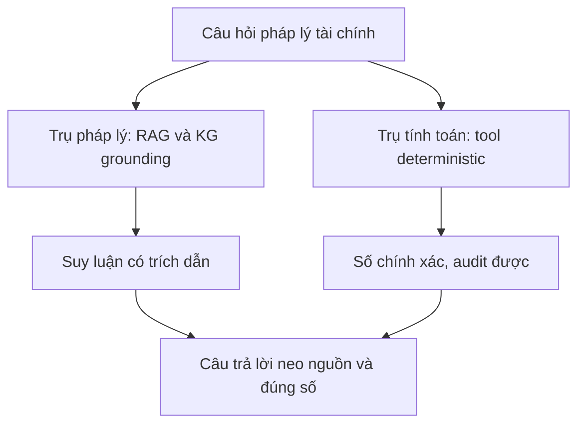
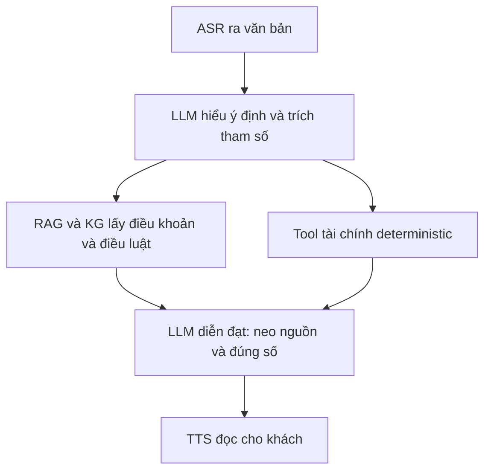

# 06.06 — Lõi Tri Thức Pháp Luật Tài Chính: Hiểu — Suy Luận — Tính Toán

> [!NOTE]
> - Tài liệu đơn vị tự đứng vững về **lõi tri thức pháp luật tài chính** cho voice-bot tổng đài FCI (ngân hàng / cho vay tiêu dùng).
> - Hai trụ: **(A) hiểu thực thể + liên kết phức tạp + suy luận logic pháp lý**; **(B) tính toán tài chính cơ bản** (lãi kép, hàm mũ, trả góp).
> - Luận điểm xuyên suốt: cả hai trụ đều **không được để LLM "tự nhớ" hay "tự tính"** — pháp lý phải **grounding** (RAG/KG + trích dẫn), số phải **tính bằng tool deterministic**.
> - Nối nguyên tắc tool-calling ở [06.02](02_tool_call_grounding.md)/[06.04](04_tool_call_frameworks.md); ứng dụng domain ở [06.05](05_cskh_domains.md); guardrail ở [07](../07_guardrails/00_README.md).

---

## 1. Dẫn dắt bối cảnh

- **Một câu hỏi tổng đài tài chính gói cả hai trụ**:
  - Khách hỏi: "Khoản vay của tôi tới hôm nay còn phải trả bao nhiêu, lãi quá hạn tính thế nào, hợp đồng có cho trả trước không?".
  - Để trả lời, bot vừa phải **hiểu hợp đồng + quy định** (thực thể, điều khoản, điều luật) và **suy luận** điều kiện, vừa phải **tính ra con số** (gốc + lãi cộng dồn theo ngày).
- **Nghịch lý của sự tự tin**:
  - LLM trả lời pháp lý rất trôi chảy nhưng **bịa điều luật/án lệ tới mức nguy hiểm**, và làm **sai số học** ngay cả phép cơ bản.
  - Vậy không thể tin LLM "biết luật" hay "biết tính" — phải dựng lõi tri thức theo cách khác.

> Tài liệu này mổ hai trụ của lõi tri thức pháp luật tài chính, chỉ ra vì sao mỗi trụ phải được **đưa ra ngoài năng lực nội tại của LLM** (grounding cho pháp lý, tool cho tính toán), và đề xuất kiến trúc ghép cả hai cho một câu trả lời vừa neo nguồn vừa đúng số.

---

## 2. Glossary

- `RAG` -> **Retrieval-Augmented Generation** ->
  - Truy hồi tài liệu liên quan rồi mới sinh câu trả lời, để neo vào nguồn thật.
- `KG` -> **Knowledge Graph** ->
  - Đồ thị thực thể + quan hệ (luật/điều/khoản, hợp đồng, bên, nghĩa vụ).
- `IRAC` -> **Issue–Rule–Application–Conclusion** ->
  - Khung suy luận pháp lý chuẩn: vấn đề → quy phạm → áp dụng → kết luận.
- `holding` -> **Holding** ->
  - Lập luận/phán quyết cốt lõi của một bản án.
- `PoT` -> **Program-of-Thoughts** ->
  - LLM sinh chương trình rồi để máy chạy, tách suy luận khỏi tính toán.
- `PAL` -> **Program-Aided LM** ->
  - Tương tự PoT: LLM sinh code, interpreter thực thi phép tính.
- `APR` / `EAR` -> **Annual Percentage Rate / Effective Annual Rate** ->
  - Lãi suất danh nghĩa năm / lãi suất hiệu dụng năm.
- `amortization` -> **Amortization** ->
  - Lịch trả góp đều gốc + lãi theo kỳ.
- `CUAD` -> **Contract Understanding Atticus Dataset** ->
  - Bộ chuẩn trích xuất điều khoản hợp đồng (41 loại).

---

## 3. Hai trụ của lõi tri thức

### 3.1 Sơ đồ K1 — Một câu hỏi, hai trụ tách biệt

- **Khung đọc sơ đồ K1**:
  - **Đề bài cần giải**: tách rõ hai năng lực khác bản chất trong cùng một câu hỏi.
  - **Giả định nền**: cả hai trụ đều **không dựa vào trí nhớ/khả năng tính nội tại của LLM**.
  - **Ý nghĩa các khối**: `LEGAL` neo vào nguồn luật/hợp đồng thật; `MATH` giao phép tính cho tool; `ANS` chỉ hợp lệ khi cả hai nhánh đều đạt.
  - **Cách đọc**: hai nhánh độc lập rồi hội tụ; thiếu một nhánh là câu trả lời không an toàn (bịa luật hoặc sai số).

### 3.2 Vì sao phải tách hai trụ

- **Khác bản chất lỗi**:
  - Trụ pháp lý hỏng kiểu **bịa nội dung** (điều luật/án lệ không có thật).
  - Trụ tính toán hỏng kiểu **sai số học** (nhân/lũy thừa/cộng dồn sai).
- **Khác cách chữa**:
  - Pháp lý → **grounding** (RAG/KG + trích dẫn nguồn truy hồi được).
  - Tính toán → **đưa ra tool deterministic** (code/thư viện tài chính).

---

## 4. Trụ A — Hiểu pháp luật và suy luận logic

### 4.1 Rủi ro lõi: hallucination pháp lý (ba lớp)

- ⚙️ **Cơ chế**:
  - LLM "nhớ" luật từ tham số huấn luyện, không phải từ văn bản gốc → khi không chắc vẫn sinh ra điều luật/án lệ nghe hợp lý nhưng sai.
- 🔍 **Cách nhận diện** (bằng chứng định lượng):
  - Nghiên cứu Stanford RegLab/HAI (>200.000 query/model): **tỉ lệ hallucination 69–88%** với câu hỏi pháp lý cụ thể; hỏi về **holding thì bịa ≥75%** ⚠️.
  - Công cụ legal AI chuyên dụng vẫn lỗi: Lexis+ AI ~17%, Westlaw ~33%, GPT-4 ~43% ⚠️ (số thứ cấp, cần đối chiếu paper gốc).
- 💡 **Ý nghĩa**:
  - Với tài chính (số tiền, quyền-nghĩa vụ), một câu bịa luật là **rủi ro pháp lý + thương hiệu trực tiếp**.
- ⚠️ **Bẫy (case thật)**:
  - Vụ *Mata v. Avianca* (2023): luật sư bị phạt **5.000 USD** vì nộp án lệ ChatGPT bịa; tới 2025 đã có **~900 hồ sơ tòa Mỹ** dính AI hallucination.
  - → **Bắt buộc grounding + trích dẫn**; cấm để LLM tự nhớ điều luật.

### 4.2 Biểu diễn tri thức: KG + RAG

- **Knowledge Graph**: mô hình hoá thực thể (luật/điều/khoản, hợp đồng, bên vay, khoản nợ, tài sản đảm bảo, điều khoản) + quan hệ (tham chiếu, áp dụng, điều kiện) → neo LLM vào cấu trúc thay vì trí nhớ.
- **Legal RAG**: truy hồi đúng điều khoản hợp đồng / điều luật cụ thể rồi mới sinh; điểm yếu cần lưu là **độ tin của bước retrieval** (truy hồi sai → vẫn sai).
- **Hàm ý FCI**: biểu diễn hợp đồng vay dưới dạng KG + RAG có nền học thuật; không dựa LLM nhớ luật.

### 4.3 Suy luận pháp lý và giới hạn

- **Khung chuẩn**: IRAC (Issue–Rule–Application–Conclusion); benchmark LegalBench (162 nhiệm vụ), LexGLUE, LEXam.
- **Trích xuất thực thể–quan hệ**: CUAD (41 loại điều khoản), ContractNLI (entailment/contradiction nghĩa vụ–điều kiện).
- ⚠️ **Giới hạn đã ghi nhận** (rủi ro trực tiếp cho luật tín dụng):
  - LLM **không suy luận đúng tính hiệu lực theo thời gian** của quy phạm — mà lãi suất/quy định tín dụng **đổi theo từng thời kỳ**.
  - LLM **không nhận ra khi thông tin không đủ** → vẫn kết luận; cần buộc abstain/hỏi lại.
  - Suy luận nhiều bước cần chấm cả **bước trung gian**, không chỉ kết luận.

### 4.4 Tiếng Việt và luật VN

- **Có**: ALQAC (thi QA luật thành văn VN, nhưng thiên *đề thi luật sư*), VLQA (2025, dataset Vietnamese legal QA quy mô lớn), ViLQA.
- ⚠️ **Khoảng trống**: chưa thấy benchmark/model chuyên **luật tín dụng–tài chính VN** hay suy luận hợp đồng vay tiếng Việt; chưa rõ độ phủ Bộ luật Dân sự / luật tổ chức tín dụng / quy định lãi suất quá hạn.
  - → FCI nhiều khả năng **phải tự xây tập đánh giá nội bộ**; con số trần lãi suất theo luật VN phải **tra văn bản gốc + luật sư**, không để LLM/tài liệu này tự khẳng định.

---

## 5. Trụ B — Tính toán tài chính

### 5.1 Rủi ro lõi: LLM yếu số học (ba lớp)

- ⚙️ **Cơ chế**:
  - Sinh token trái-sang-phải mâu thuẫn với thuật toán số học (cộng/nhân vốn xử lý phải-sang-trái) → số lớn, nhiều toán hạng, lũy thừa đều khó.
- 🔍 **Cách nhận diện** (bằng chứng định lượng):
  - GPT-4 chỉ ~**59%** đúng ở phép **nhân 3 chữ số** ⚠️.
  - **BankMathBench** (sát nghiệp vụ ngân hàng): GPT-4o sập theo độ khó **67.8% → 14.4% → 6.3%**; open-source **18% / 0.8% / 0.5%** ⚠️.
- 💡 **Ý nghĩa**:
  - Bài càng giống nghiệp vụ thật (tiền gửi, vay, trả góp) thì LLM tự tính càng sập → **không thể tin LLM ra con số tiền cho khách**.
- ⚠️ **Bẫy**:
  - Lỗi một bước trung gian **lan truyền** phá cả chuỗi; "biết công thức" không có nghĩa "tính đúng".

### 5.2 Giải pháp: đưa tính toán ra ngoài LLM

- **PoT / PAL**: LLM sinh **code**, interpreter chạy — tách *reasoning* khỏi *computation*.
  - PoT trung bình **+~12%** so với CoT, gồm cả FinQA/ConvFinQA/TAT-QA.
  - PAL: GSM8K **72.0% vs CoT 65.6%**; GSM-Hard vượt CoT **~40%** tuyệt đối.
- **Tool / calculator**: trên **BankMathBench**, cho gọi calculator ngoài cộng thêm **+21.3 / +71.1 / +62.8 điểm** theo độ khó — bằng chứng mạnh nhất cho FCI.
- **Kết luận**: tool/code-execution là cách **đáng tin duy nhất** cho số học tuỳ ý; CoT thuần không đủ.

### 5.3 Công thức cần đúng (phần "lũy thừa/hàm mũ") và thư viện

- **Lãi kép (future value)**:
$$A = P\left(1 + \frac{r}{n}\right)^{nt}$$
  - **`P`** gốc, **`r`** lãi suất năm, **`n`** số kỳ ghép/năm, **`t`** số năm.
- **EAR từ lãi suất danh nghĩa**:
$$\text{EAR} = \left(1 + \frac{r}{n}\right)^{n} - 1$$
- **Trả góp đều (amortization)**:
$$M = P \cdot \frac{i\,(1+i)^{N}}{(1+i)^{N} - 1}$$
  - **`i`** = lãi suất kỳ ($r/12$), **`N`** = tổng số kỳ; trường hợp $i=0$ xử lý riêng $M = P/N$.
- **Hiện giá / tương lai**:
$$PV = \frac{FV}{(1+i)^{N}}, \qquad FV = PV\,(1+i)^{N}$$
- **Lãi quá hạn theo ngày**: $\text{Interest} = P \cdot r_{\text{day}} \cdot d$ ($d$ = số ngày quá hạn; hệ số phạt theo hợp đồng).
- **Thư viện chuẩn**: `numpy-financial` (`pmt`, `ppmt`/`ipmt` tách gốc-lãi, `fv`, `pv`, `nper`, `rate`, `npv`, `irr`) — dùng để dựng lịch trả góp + số dư còn lại, **không để LLM tự nhân**.

### 5.4 Benchmark tham chiếu
- **BankMathBench** (ngân hàng — sát FCI nhất), **FinQA / ConvFinQA / TAT-QA** (suy luận số trên báo cáo + hội thoại nhiều lượt), **DocMath-Eval**, **BizBench** (giải bằng sinh code).
- ⚠️ Mọi số ở §5 lấy qua tóm tắt — đối chiếu bảng gốc trước khi đưa vào quyết định.

---

## 6. Kiến trúc ghép hai trụ cho voice-bot FCI

### 6.1 Sơ đồ K2 — Luồng trả lời câu hỏi pháp lý tài chính

- **Khung đọc sơ đồ K2**:
  - **Đề bài cần giải**: ghép trụ pháp lý + trụ tính toán vào một vòng đời trả lời.
  - **Giả định nền**: LLM **chỉ** làm hai việc — hiểu/trích tham số và diễn đạt; không nhớ luật, không tự tính.
  - **Ý nghĩa các khối**: `RAG` lo nội dung pháp lý có trích dẫn; `TOOL` lo con số chính xác audit được; `COMPOSE` ráp lại.
  - **Cách đọc**: hai nhánh `RAG` và `TOOL` chạy từ cùng bộ tham số, hội tụ ở `COMPOSE` — đây là hiện thực của "hai trụ" trong sơ đồ K1.

### 6.2 Vai trò từng tầng

- **LLM** chỉ: (1) parse yêu cầu → trích tham số (gốc, lãi suất, ngày vay, hôm nay, số kỳ); (2) diễn đạt kết quả thành lời. **Không nhân, không lũy thừa, không nhớ điều luật.**
- **Trụ pháp lý**: KG/RAG truy hồi điều khoản hợp đồng + điều luật cụ thể, trả kèm **nguồn để trích dẫn**; buộc **abstain/hỏi lại** khi không đủ thông tin.
- **Trụ tính toán**: hàm Python cố định / `numpy-financial`, validate input, có unit test theo công thức §5.3 → kết quả **tái lập, audit được, không trôi giữa phiên**.

---

## 7. Khuyến nghị cho FCI và câu hỏi mở

- **Khuyến nghị**:
  - Coi đây là **hai năng lực phải externalize**, không phải "chọn model giỏi luật/toán hơn".
  - Dựng sớm **financial calculation tool** (numpy-financial + validate + unit test) — rẻ, hiệu quả cao, audit được.
  - Dựng **legal RAG/KG** trên hợp đồng + văn bản quy phạm thật, bắt buộc trích dẫn nguồn.
- **Câu hỏi mở**:
  - Văn bản pháp lý nguồn của FCI (hợp đồng mẫu, quy định lãi suất quá hạn) sẵn sàng số hoá tới đâu để dựng RAG/KG?
  - Trần lãi suất + quy định lãi quá hạn theo **luật VN** cụ thể — cần tra văn bản gốc + luật sư (không để tài liệu này tự khẳng định số).
  - Tập đánh giá nội bộ tiếng Việt cho hỏi-đáp hợp đồng vay — chưa có, phải tự xây.

---

## 8. Nguồn (tách theo loại để kiểm chứng thủ công)

> Lưu ý: số benchmark + tỉ lệ hallucination/legal-tool đều nên đối chiếu bảng/PDF gốc trước khi trích; ID arXiv năm 2026 (`2601.*`, `2602.*`, `2603.*`) là rất mới, ⚠️ chưa kiểm chứng nội dung.

### (a) Paper arXiv / hội nghị
- `2308.11462` — *LegalBench* (162 nhiệm vụ, IRAC). https://arxiv.org/pdf/2308.11462
- `2103.06268` — *CUAD* (trích xuất 41 loại điều khoản). https://arxiv.org/pdf/2103.06268
- `2511.07979` — *Multi-Step Legal Reasoning + CoT*. https://arxiv.org/pdf/2511.07979
- `2405.20362` — *Hallucination-Free?* (đo legal AI tools). https://arxiv.org/pdf/2405.20362
- `2507.19995` — *VLQA* (Vietnamese legal QA). https://arxiv.org/html/2507.19995v1
- `2211.12588` — *Program-of-Thoughts*. https://arxiv.org/abs/2211.12588
- `2211.10435` — *PAL: Program-Aided LM*. https://arxiv.org/abs/2211.10435
- `2602.17072` — *BankMathBench* (tool +62-71 điểm) ⚠️. https://arxiv.org/html/2602.17072v2
- `2311.09805` — *DocMath-Eval*; `2311.06602` — *BizBench*; `2506.05828` — *FinanceReasoning*.
- `2502.19981` — *The Lookahead Limitation* (vì sao LLM yếu cộng/nhân).

### (b) Doc chính thức / viện
- Stanford Law — Hallucinating Law (holding bịa ≥75%): https://law.stanford.edu/2024/01/11/hallucinating-law-legal-mistakes-with-large-language-models-are-pervasive/
- Stanford HAI — Profiling Legal Hallucinations (PDF): https://dho.stanford.edu/wp-content/uploads/Hallucinations_JLA.pdf
- numpy-financial (pmt/ppmt/ipmt/fv/pv/rate/irr): https://numpy.org/numpy-financial/latest/
- ALQAC (QA luật VN): https://alqac.github.io/

### (c) Repo GitHub / dataset
- ViLQA (Vietnamese legal QA): https://github.com/ntphuc149/ViLQA
- numpy-financial source: https://github.com/numpy/numpy-financial
- calculator_agent_rl (tool +62% accuracy): https://github.com/Danau5tin/calculator_agent_rl

### (d) Blog / báo
- Mata v. Avianca sanction (Seyfarth): https://www.seyfarth.com/news-insights/update-on-the-chatgpt-case-counsel-who-submitted-fake-cases-are-sanctioned.html
- ~900 AI hallucination filings (Cronkite News 2025): https://cronkitenews.azpbs.org/2025/10/28/lawyers-ai-hallucinations-chatgpt/
- ConvFinQA gap analysis (beancount.io): https://beancount.io/bean-labs/research-logs/2026/05/15/convfinqa-chain-numerical-reasoning-conversational-finance-qa
- GSM8K arithmetic overview (emergentmind): https://www.emergentmind.com/topics/gsm8k-arithmetic-benchmark

---

## ✅ Tự kiểm nhanh

1. Vì sao không để LLM "tự nhớ" luật cũng không "tự tính" số?

Hai lỗi khác bản chất: trụ pháp lý LLM **bịa điều luật/án lệ** (Stanford: bịa holding ≥75%; vụ Mata v. Avianca bị phạt thật); trụ tính toán LLM **sai số học** (BankMathBench: GPT-4o sập 67.8%→6.3% theo độ khó).
Nên pháp lý phải **grounding (RAG/KG + trích dẫn)**, số phải **tính bằng tool deterministic** — không dựa năng lực nội tại của LLM.

2. Trong kiến trúc ghép hai trụ, LLM được làm gì và không được làm gì?

LLM **chỉ**: (1) hiểu yêu cầu + trích tham số (gốc, lãi suất, ngày, số kỳ); (2) diễn đạt kết quả thành lời.
LLM **không**: tự nhân/lũy thừa/cộng dồn (giao cho tool numpy-financial), không tự nhớ điều luật (giao cho RAG/KG có trích dẫn). Hai nhánh hội tụ ở bước diễn đạt.

3. Vì sao giới hạn "tính hiệu lực theo thời gian" của LLM lại nguy hiểm riêng cho luật tín dụng?

Vì lãi suất và quy định tín dụng **thay đổi theo từng thời kỳ**; LLM được ghi nhận **không suy luận đúng temporal validity** của quy phạm và **không nhận ra khi thiếu thông tin**. Nếu để LLM tự nhớ, nó có thể áp một mức/quy định đã hết hiệu lực → phải neo vào văn bản hiện hành qua RAG + buộc hỏi lại khi không đủ dữ kiện.

