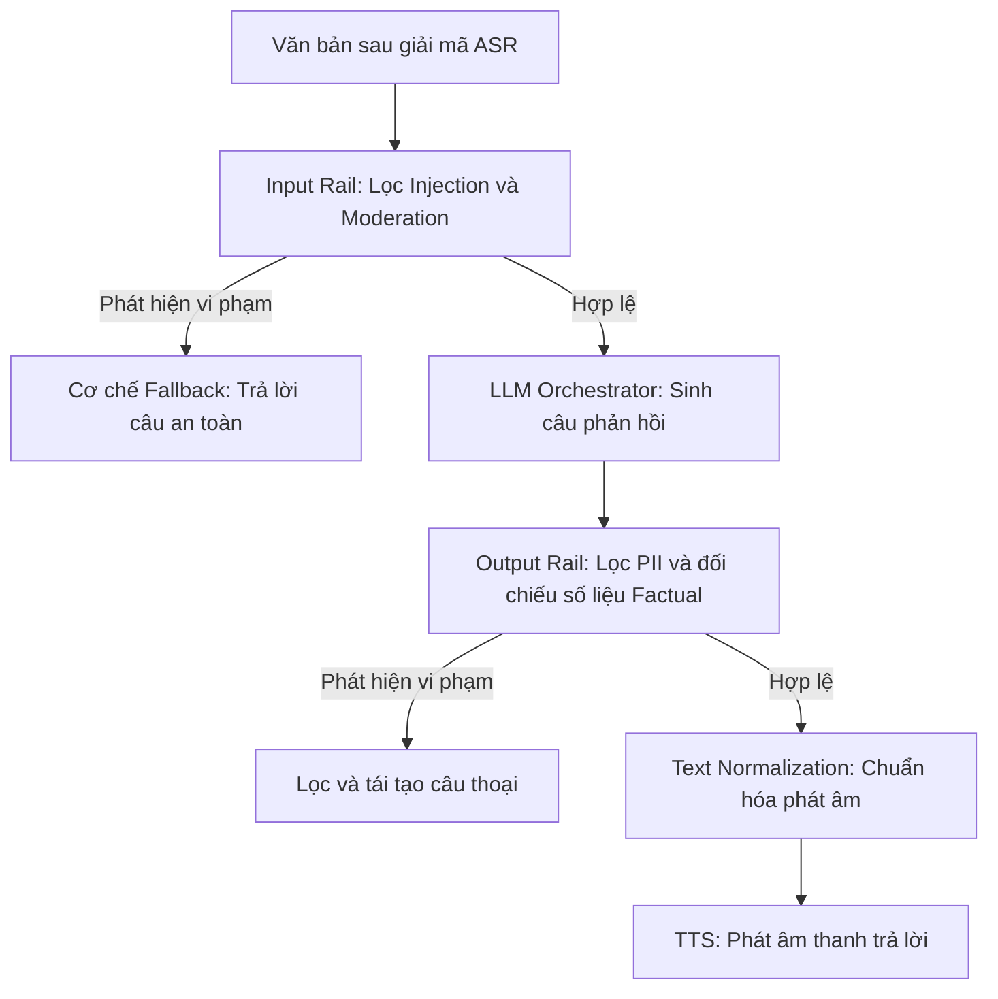

# 07 — Guardrails: Hệ Thống Bộ Lọc An Toàn và Chuẩn Hóa Văn Bản

> [!NOTE]
> Tài liệu này thiết kế lớp bảo mật và an toàn thông tin (Guardrails) cho hệ thống voice-bot tổng đài FCI.
> Mục tiêu nhằm xây dựng mô hình lọc PII, chống tấn công prompt-injection, kiểm soát tính chính xác dữ liệu (factuality), và chuẩn hóa văn bản đầu ra cho TTS dưới các ràng buộc khắt khe về mặt độ trễ (latency).

---

## 1. Dẫn dắt bối cảnh

- **Yêu cầu bảo mật trong tài chính viễn thông**:
  - Khi triển khai các dịch vụ thoại tự động trong lĩnh vực tài chính và chăm sóc khách hàng, việc bảo mật dữ liệu cá nhân (PII) và ngăn chặn các hành vi phá hoại hệ thống là nhiệm vụ sống còn.
  - Mọi dữ liệu đi vào và đi ra khỏi mô hình ngôn ngữ cần được kiểm duyệt chặt chẽ để tránh rủi ro pháp lý và danh tiếng.

- **Nghịch lý của hệ thống kiểm duyệt**:
  - Làm thế nào để xây dựng một hàng rào bảo mật (Guardrails) ngăn chặn các hành vi tấn công prompt injection tinh vi và lọc bỏ các thông tin nhạy cảm của khách hàng, mà vẫn giữ vững ngân sách độ trễ phản hồi cực thấp dưới tải CCU = 100?
  - Tại sao việc áp dụng các mô hình guardrail học sâu một cách đồng loạt lại dễ dàng bóp nghẹt hiệu năng của cả hệ thống?

- **Mục tiêu của tài liệu**:
  
  Tài liệu này phân tích chi tiết cơ chế của các loại rail bảo mật, chỉ ra các khoảng trống công cụ dành cho tiếng Việt, và thiết lập kiến trúc phễu lọc phân tầng tối ưu hóa chi phí vận hành.

---

## 2. Glossary

Bảng Glossary dưới đây định nghĩa toàn bộ ký hiệu và thuật ngữ viết tắt xuất hiện trong bài:

| Ký hiệu / Thuật ngữ | Tên đầy đủ tiếng Anh | Giải nghĩa tiếng Việt |
| :--- | :--- | :--- |
| `PII` | **Personally Identifiable Information** | Thông tin nhận dạng cá nhân (CCCD, SĐT, số tài khoản, mã PIN). |
| `ASR` | **Automatic Speech Recognition** | Hệ thống tự động nhận dạng giọng nói. |
| `TTS` | **Text-to-Speech** | Hệ thống chuyển đổi văn bản thành giọng nói. |
| `LLM` | **Large Language Model** | Mô hình ngôn ngữ lớn. |
| `RAG` | **Retrieval-Augmented Generation** | Mô hình sinh văn bản tăng cường bằng truy xuất tri thức. |
| `NER` | **Named Entity Recognition** | Nhận dạng thực thể có tên (phát hiện tên người, địa điểm, con số). |
| `NSW` | **Non-Standard Word** | Từ không chuẩn (ví dụ: viết tắt, ký hiệu tiền tệ, định dạng ngày tháng). |
| `TN` | **Text Normalization** | Chuẩn hóa văn bản (chuyển chữ viết không chuẩn sang dạng chữ đọc phát âm). |
| `ITN` | **Inverse Text Normalization** | Chuẩn hóa ngược (chuyển âm thanh nhận dạng được sang dạng ký hiệu/số). |
| `AUC` | **Area Under Curve** | Chỉ số diện tích dưới đường cong ROC đánh giá mô hình phân loại. |
| `FPR` | **False Positive Rate** | Tỷ lệ báo còi giả (tỷ lệ nhận diện nhầm). |
| `WFST` | **Weighted Finite-State Transducer** | Bộ chuyển đổi máy trạng thái hữu hạn có trọng số. |
| `CCU` | **Concurrent Users** | Số lượng cuộc gọi đồng thời trong hệ thống. |

---

## 3. Phân Loại Hệ Thống Rail Bảo Mật

Tham chiếu theo khung kiến trúc của NeMo Guardrails, hệ thống bộ lọc được chia thành 5 nhóm chức năng:

| Loại bộ lọc (Rail) | Tín hiệu xử lý | Hành vi tác động | Vai trò tương ứng trong FCI |
| :--- | :--- | :--- | :--- |
| **Input Rail** | Văn bản người dùng sau ASR | Từ chối (`reject`), che dấu (`mask`), viết lại (`rephrase`). | Lớp 1: Kiểm soát an toàn đầu vào (Prompt Injection, Moderation). |
| **Dialog Rail** | Luồng logic hội thoại | Điều hướng trạng thái, gọi câu trả lời mẫu. | Lớp 2: Điều phối nghiệp vụ và simulated tool-calling. |
| **Retrieval Rail** | Dữ liệu tri thức RAG | Loại bỏ các đoạn tri thức không liên quan hoặc độc hại. | Kiểm soát an toàn kho tri thức đầu vào (nếu áp dụng RAG). |
| **Execution Rail** | Tham số đầu vào/ra của Tool | Chặn hoặc sửa đổi lời gọi API. | Lớp 3: Giám sát và bảo vệ lời gọi hàm (Tool-calling). |
| **Output Rail** | Văn bản sinh ra từ LLM | Từ chối, che dấu thông tin nhạy cảm. | Lớp 4: Lọc PII đầu ra và kiểm soát tính chính xác (Factual Rail). |

---

### 3.1 Sơ đồ quy trình lọc an toàn và chuẩn hóa tín hiệu

#### Khung đọc sơ đồ quy trình lọc:
- **Đề bài cần giải**: Bảo vệ hệ thống khỏi các prompt độc hại đầu vào và ngăn ngừa rò rỉ dữ liệu nhạy cảm hoặc thông tin sai lệch ở đầu ra.
- **Giả định nền**: Tất cả các bước lọc đều hoạt động ở chế độ đồng bộ (blocking mode) để đảm bảo an toàn tuyệt đối trước khi phát âm thanh.
- **Ý nghĩa các khối**:
  - `IR` / `OR`: Các chốt chặn bảo mật đồng bộ đầu-cuối.
  - `Fallback` / `ReGen`: Các nhánh xử lý sự cố tự động.
  - `TN`: Khâu tiền xử lý ngôn ngữ trước khi đưa vào mô hình tổng hợp giọng nói.
- **Cách đọc và ứng dụng**: Quy trình chạy tuần tự từ trên xuống dưới; nhấn mạnh vai trò của Text Normalization là chốt chặn cuối cùng ngay trước TTS để đảm bảo chất lượng phát âm chuẩn xác.

---

## 4. Cơ Chế Hoạt Động và Những Hiểu Lầm Phổ Biến

### 4.1 Bộ Lọc Đồng Bộ (Blocking Rails)
- ⚙️ **Cơ chế**: Middleware an toàn hoạt động đồng bộ, buộc luồng xử lý phải dừng lại để quét dữ liệu.
- 🔍 **Cách nhận diện**: Cấu hình chạy trên luồng chính của cuộc gọi (trước LLM và trước TTS).
- 💡 **Ý nghĩa**: Đảm bảo 100% các câu thoại độc hại hoặc thông tin nhạy cảm (như mã PIN, số thẻ) bị ngăn chặn trước khi truyền đi tiếp.
- ⚠️ **Bẫy**: Việc gọi liên tục các mô hình phân loại học sâu lớn cho mỗi lượt blocking rail sẽ cộng dồn độ trễ nghiêm trọng, trực tiếp phá vỡ cam kết phản hồi thời gian thực của hệ thống tổng đài.

### 4.2 Tấn Công Né Bộ Lọc (Evasion Attack)
- ⚙️ **Cơ chế**: Người dùng sử dụng các kỹ thuật ngụy trang ký tự, chèn mã độc dạng gián tiếp hoặc sử dụng ngôn ngữ ẩn dụ để vượt qua các bộ phân loại an toàn BERT-style.
- 🔍 **Cách nhận diện**: Xuất hiện các câu lệnh jailbreak thành công bằng tiếng Việt lách qua các từ khóa trong danh sách cấm (blocklist).
- 💡 **Ý nghĩa**: Giúp kỹ sư nhận thức rằng bộ lọc an toàn đầu vào không bao giờ là tuyệt đối. Hệ thống cần phối hợp đa lớp bảo mật, đặc biệt là siết chặt máy trạng thái hội thoại (dialog rail).
- ⚠️ **Bẫy**: Tin tưởng hoàn toàn vào một mô hình Prompt Guard duy nhất và thả lỏng luồng hội thoại tự do cho LLM.

### 4.3 Chuẩn Hóa Văn Bản (Text Normalization)
- ⚙️ **Cơ chế**: Chuyển đổi các định dạng số, ký hiệu và từ viết tắt thành dạng âm tiết chữ viết đầy đủ tương thích với bộ đọc của TTS.
- 🔍 **Cách nhận diện**: Biến đổi chuỗi "SĐT 0901" $\rightarrow$ "số điện thoại không chín không một".
- 💡 **Ý nghĩa**: Đảm bảo giọng đọc của bot tự nhiên, không bị vấp hoặc phát âm sai nghĩa, đặc biệt quan trọng với ngôn ngữ có thanh điệu phức tạp như tiếng Việt.
- ⚠️ **Bẫy**: Áp dụng các bộ luật regex thô sơ mà bỏ qua các trường hợp đồng âm khác nghĩa phụ thuộc ngữ cảnh tài chính viễn thông.

---

## 5. Landscape Các Giải Pháp Phát Hiện Prompt Injection và Moderation

### 5.1 Phân tích các mô hình phát hiện Prompt Injection (BERT-style)

| Tên mô hình | Cỡ tham số | AUC kiểm thử | Recall @ 1% FPR | Độ trễ (GPU A100) | Phạm vi hỗ trợ đa ngữ |
| :--- | :--- | :--- | :--- | :--- | :--- |
| **Prompt Guard 2 (86M)** | ~86 triệu | 0.998 | 97.5% | **92.4 ms** | Hỗ trợ 8 ngôn ngữ (Có tiếng Thái, `⛔ no-vi` không có tiếng Việt). |
| **Prompt Guard 2 (22M)** | ~22 triệu | 0.995 | 88.7% | **19.3 ms** | Chỉ hỗ trợ tiếng Anh (`⛔ no-vi`). |

---

### 5.2 Phân tích các mô hình Content Moderation (Lọc nội dung độc hại)

| Giải pháp | Kích thước | Phân loại đầu ra | Điểm mạnh | Điểm yếu | Bản quyền |
| :--- | :--- | :--- | :--- | :--- | :--- |
| **Llama Guard 3** | 1B / 8B | 13 Category (MLCommons) | Taxonomy chuẩn hóa, chất lượng phân loại cao. | Khả năng phát hiện Prompt Injection trung bình. | Llama Community License. |
| **Llama Guard 4** | 12B | Safe / Unsafe + Category | Đa thể thức (Text + Hình ảnh), cải tiến đa ngữ. | Kích thước lớn, thời gian xử lý chậm. | Llama Community License. |
| **ShieldGemma** | 2B | Safe / Unsafe | Tốc độ nhanh, cực mạnh ở phát hiện Jailbreak. | Yếu ở Prompt Injection. | Gemma Terms. |
| **Granite Guardian** | 2B / 8B | Safe / Unsafe | Rất mạnh ở Prompt Injection, PII và groundedness. | Dễ gặp lỗi chặn nhầm các câu lành tính (over-block). | Apache-2.0. |
| **OpenAI Moderation** | API | Điểm số theo các Category độc hại | Miễn phí, hỗ trợ đa ngữ xuất sắc. | Gửi dữ liệu ra máy chủ ngoài (vi phạm PII viễn thông). | OpenAI API Terms. |

---

## 6. Giải Pháp Lọc Dữ Liệu Nhạy Cảm (PII) Cho Tiếng Việt

Việc triển khai bộ lọc PII cho tổng đài tiếng Việt cần kết hợp giữa bộ công cụ chuẩn và các bộ luật đặc thù nội địa:

- **Microsoft Presidio (Kiến trúc chuẩn hóa)**:
  - *Analyzer*: Kết hợp các bộ nhận diện luật (PatternRecognizer) và các mô hình NER học sâu (spaCy/PhoBERT).
  - *Anonymizer*: Thay thế hoặc làm mờ các dữ liệu nhạy cảm đã phát hiện.
  - **Khoảng trống tiếng Việt**: Presidio không có sẵn gói cấu hình cho tiếng Việt (`⚠️ chưa xác minh`). Kỹ sư phải tự xây dựng các lớp Pattern và tích hợp mô hình PhoBERT-NER riêng biệt.
- **Thiết lập bộ luật Regex PII tiếng Việt**:
  - **Căn cước công dân (CCCD)**: Nhận diện chuỗi 12 chữ số liên tục. Thực hiện kiểm tra tính đúng đắn dựa trên mã tỉnh (3 chữ số đầu) và mã thế kỷ/giới tính.
  - **Số điện thoại (SĐT) Việt Nam**: Nhận diện đầu số bắt đầu bằng `0` hoặc `+84` đi kèm 9 chữ số nhà mạng. Cần xử lý trường hợp khách hàng đọc tách rời từng số sau khi qua bộ ASR (ví dụ: "không chín không...").
  - **Mã giao dịch OTP / PIN**: Thiết lập regex nhận diện chuỗi 4-6 chữ số đi kèm các từ khóa ngữ cảnh trực quan (ví dụ: "mã", "OTP", "PIN", "mật khẩu").

---

## 7. Giải Pháp Chuẩn Hóa Văn Bản Tiếng Việt (Text Normalization)

Khâu chuẩn hóa NSW đóng vai trò quan trọng quyết định chất lượng đầu ra của TTS. Landscape các công cụ xử lý tiếng Việt bao gồm:

- **VietNormalizer**:
  - *Bản chất*: Thư viện Python zero-dependency hoạt động hoàn toàn dựa trên các bộ luật (rule-based).
  - *Ưu điểm*: Cực nhẹ, tốc độ xử lý nhanh, xử lý chính xác định dạng tiền tệ (VND/USD), số thập phân, ngày tháng, và tỷ lệ %.
- **soe-vinorm**:
  - *Bản chất*: Kết hợp giữa từ điển chuẩn hóa và mô hình ngôn ngữ BERT.
  - *Ưu điểm*: Giải quyết tốt các từ viết tắt phức tạp phụ thuộc ngữ cảnh hội thoại.
- **Vinorm**:
  - *Bản chất*: Thư viện chuyên biệt chuẩn hóa chữ viết thành âm tiết cho hệ thống TTS tiếng Việt.
  - *Ưu điểm*: Xử lý sâu ở tầng ngôn ngữ học tiếng Việt.

---

## 8. Kiến Trúc Phễu Lọc Guardrail Tiết Kiệm Latency

Đề xuất kiến trúc phễu lọc 3 tầng để đáp ứng cam kết latency cho hệ thống realtime CCU = 100:

| Tác vụ bảo mật | Tầng 0: Bộ luật Heuristics / Regex (<1ms) | Tầng 1: Classifier / NER cỡ nhỏ (Chục ms) | Tầng 2: LLM Judge (Trăm ms - Đắt) | Ngưỡng chuyển tầng |
| :--- | :--- | :--- | :--- | :--- |
| **Prompt Injection** | Blocklist các cụm từ cấm tiếng Việt và tiếng Anh. | Prompt Guard 2 (86M). | LLM Judge đánh giá ngữ cảnh. | Tầng 0 không bắt được $\rightarrow$ Tầng 1; Tầng 1 nghi ngờ $\rightarrow$ Tầng 2. |
| **Content Moderation** | Blocklist các từ tục tĩu, xúc phạm tiếng Việt. | ShieldGemma 2B / Granite Guardian 2B. | LLM Judge phân loại. | Ca nghi vấn hoặc cần độ chính xác cao $\rightarrow$ Tầng 2. |
| **PII / Lộ Secret** | Regex CCCD, SĐT, số thẻ kèm thuật toán Luhn. | Presidio + PhoBERT-NER (tên riêng, địa chỉ). | — | Dữ liệu dạng số dùng Tầng 0; dạng văn bản tự do dùng Tầng 1. |
| **Bot xin Secret** | Blocklist các câu bot yêu cầu OTP/PIN. | Intent classifier nhỏ của Orchestrator. | LLM Judge kiểm tra. | Tầng 0 và Tầng 1 nghi ngờ $\rightarrow$ Tầng 2. |
| **Factual Rail** | Trích xuất con số và so khớp cứng với kết quả API. | — | AlignScore / Self-check LLM. | Chỉ kích hoạt Tầng 2 khi câu thoại chứa con số nghiệp vụ quan trọng. |
| **Text Normalization** | VietNormalizer (Rule-based). | soe-vinorm (BERT viết tắt). | — | Từ viết tắt mơ hồ ngữ cảnh $\rightarrow$ Tầng 1. |

---

## 9. Danh Mục Nguồn Tham Chiếu Chi Tiết

### 9.1 Bài báo khoa học (arXiv / Hội nghị)

| Link tài liệu | Nội dung chứng minh | Trạng thái |
| :--- | :--- | :--- |
| [arXiv:2310.10501](https://arxiv.org/abs/2310.10501) | Thiết lập framework NeMo Guardrails và ngôn ngữ Colang điều phối. | ✅ Nguồn mạnh (NVIDIA). |
| [arXiv:2605.28830](https://arxiv.org/html/2605.28830v1) | Đánh giá so sánh hiệu năng các mô hình guardrail mở (Llama Guard, ShieldGemma). | ⚠️ Preprint. |
| [arXiv:2412.07724](https://arxiv.org/html/2412.07724v1) | Giới thiệu mô hình Granite Guardian chuyên dụng cho RAG và bảo mật. | ⚠️ Preprint (IBM). |
| [arXiv:2504.11168](https://arxiv.org/pdf/2504.11168) | Chứng minh các mô hình Prompt Guard dễ bị bypass bằng kỹ thuật Evasion. | ⚠️ Preprint. |
| [arXiv:2510.01529](https://arxiv.org/pdf/2510.01529) | Kỹ thuật bypass bộ lọc trong môi trường production bằng prompt giải phóng có kiểm soát. | ⚠️ Preprint. |
| [arXiv:2603.04145](https://arxiv.org/abs/2603.04145) | Giới thiệu thư viện chuẩn hóa văn bản tiếng Việt VietNormalizer. | ⚠️ Preprint. |
| [arXiv:2209.02971](https://arxiv.org/abs/2209.02971) | Nghiên cứu nhận diện và chuẩn hóa các từ không chuẩn (NSW) trong tiếng Việt. | ⚠️ Preprint. |

---

### 9.2 Tài liệu Kỹ thuật chính thức

- **NeMo Guardrails Process Guide (NVIDIA)**:
  - Link: [NVIDIA Guardrails User Guide](https://docs.nvidia.com/nemo/guardrails/latest/user-guides/guardrails-process.html)
  - Nội dung: Đặc tả luồng xử lý của 5 loại rail trong kiến trúc Colang.
- **Llama Prompt Guard 2 (HuggingFace)**:
  - Link: [Meta Llama-Prompt-Guard-2 Card](https://huggingface.co/meta-llama/Llama-Prompt-Guard-2-86M)
  - Nội dung: Công bố thông số AUC và danh sách các ngôn ngữ được hỗ trợ.
- **Microsoft Presidio Analyzer**:
  - Link: [Presidio API Documentation](https://microsoft.github.io/presidio/analyzer/)
  - Nội dung: Hướng dẫn cấu hình custom PatternRecognizer và liên kết NER.

---

## 10. ✅ Tự Kiểm Nhanh

<b>Câu hỏi 1: Tại sao việc chỉ phụ thuộc vào một lớp bảo mật Prompt Guard Classifier duy nhất là không đủ để bảo vệ voice-bot tổng đài khỏi các hành vi phá hoại?</b>

- **Hạn chế của Classifier**:
  - Các mô hình classifier BERT-style (như Prompt Guard) được huấn luyện trên các mẫu tấn công tĩnh. Chúng rất dễ bị vượt qua bởi các kỹ thuật **tấn công Evasion** (sử dụng ngôn ngữ ẩn dụ, chèn ký tự đặc biệt, hoặc chia nhỏ câu lệnh).
  - Ngoài ra, Prompt Guard không được huấn luyện trên dữ liệu tiếng Việt có dấu, dẫn đến tỷ lệ lọt lưới cao khi người dùng tấn công bằng tiếng Việt.
  - Do đó, hệ thống cần phối hợp đa lớp bảo mật: Dùng blocklist Heuristic ở Tầng 0, kết hợp siết chặt máy trạng thái (Dialog Rail) để bot chỉ hoạt động trong phạm vi nghiệp vụ hẹp, giảm thiểu không gian cho các câu lệnh jailbreak hoạt động.

<b>Câu hỏi 2: Khoảng trống lớn nhất đối với hạ tầng Guardrails tại thị trường Việt Nam là gì và hướng xử lý thực tế?</b>

- **Thực trạng thiếu hụt**:
  - Hoàn toàn **chưa có các bộ dữ liệu benchmark an toàn và các mô hình Guardrail chuyên dụng (như Llama Guard) được tối ưu hóa riêng cho tiếng Việt**. Các mô hình open-source lớn của Meta hay IBM hầu như không hỗ trợ hoặc hỗ trợ rất yếu tiếng Việt.
- **Giải pháp xử lý**:
  - Doanh nghiệp phải tự xây dựng các lớp Pattern PII cho Việt Nam (CCCD, SĐT, định dạng số tiền đọc rời).
  - Dựng tập kiểm thử an toàn nội bộ để tự đánh giá độ chính xác của các mô hình open-source đa ngữ trên tiếng Việt trước khi quyết định đưa vào pipeline chính thức.

<b>Câu hỏi 3: Làm thế nào để xây dựng Factual Rail (Kiểm soát tính chính xác số liệu) cho voice-bot mà không làm phát sinh thêm độ trễ từ các mô hình LLM lớn?</b>

- **Cơ chế tối ưu hóa**:
  - Đối với các tác vụ đàm thoại tài chính, thông tin cần bảo đảm tính chính xác tuyệt đối chủ yếu là các con số nghiệp vụ (ví dụ: lãi suất, số tiền gốc, số ngày quá hạn).
  - Thay vì gọi các mô hình LLM lớn để self-check toàn bộ câu thoại, hệ thống có thể áp dụng **Factual Rail dạng Rule-based**:
    1. Trích xuất tất cả các con số xuất hiện trong câu thoại do LLM sinh ra bằng regex.
    2. So khớp trực tiếp các con số này với dữ liệu trả về từ các hàm gọi API (Tool Results) được lưu trong session chat history.
    3. Nếu phát hiện có sự sai lệch (ví dụ: API trả về 5% nhưng LLM viết 6%), hệ thống sẽ tự động sửa đổi hoặc kích hoạt kịch bản sinh lại câu thoại.
  - Giải pháp này có độ trễ gần như bằng 0ms và đảm bảo tính chính xác tuyệt đối cho các dữ liệu số.

