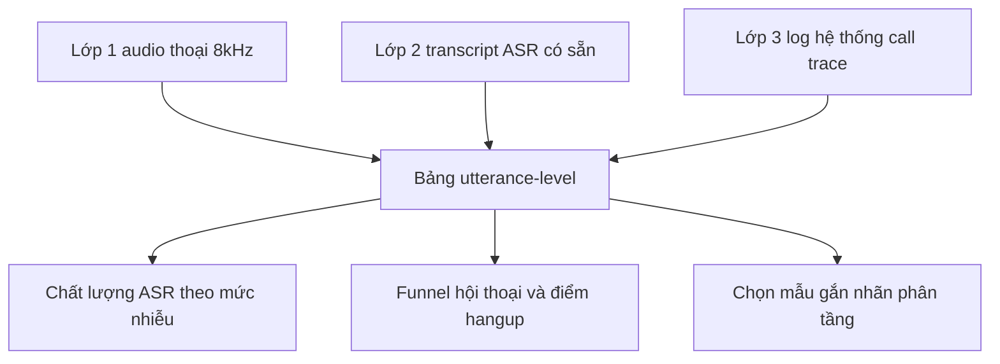
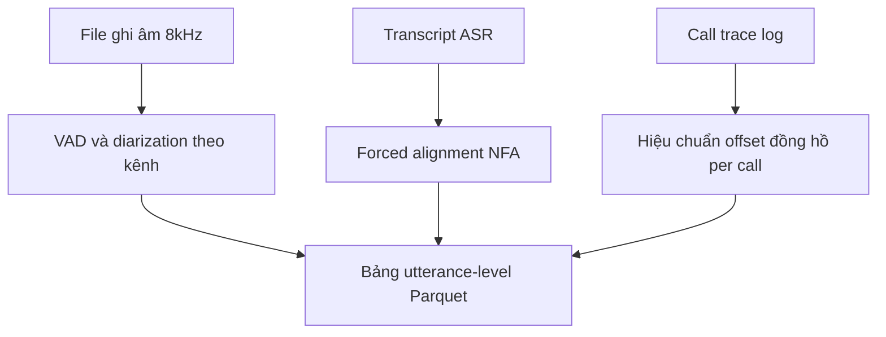

# 08.01 — Phương pháp EDA Bộ Dữ liệu Tổng đài 3 Lớp: Audio Thoại · Transcript · Log Hệ Thống

> [!NOTE]
> - Tài liệu này chuẩn hóa phương pháp EDA (exploratory data analysis) cho corpus cuộc gọi tổng đài tiếng Việt 8kHz (thu hồi nợ / CSKH), trải trên 3 lớp dữ liệu: audio thoại → transcript ASR có sẵn → log hệ thống, và cách join 3 lớp về một bảng phân tích hợp nhất.
> - **Kế thừa, không lặp lại**: quy trình EDA gắn nhãn nhiễu (Brouhaha SNR/C50/VAD → PANNs/CLAP → clustering → dashboard) đã có tại [../03_audio_frontend/00_README.md](../03_audio_frontend/00_README.md) mục 6;
> - danh mục dataset hiện có của layer này xem [00_README.md](00_README.md); chiến lược quản trị dữ liệu doanh nghiệp xem [../11_sim_test_system/01_design.md](../11_sim_test_system/01_design.md) mục 7; quy trình PII masking xem [../07_guardrails/00_README.md](../07_guardrails/00_README.md) mục 6.
> - Nhãn độ tin cậy nguồn: ✅ đã xác minh qua nguồn chính thức · ⚠️ nguồn thứ cấp hoặc chưa kiểm chứng độc lập · ❓ chưa tra được số liệu; các đoạn suy luận kỹ thuật đều ghi rõ "suy luận, cần kiểm chứng".

---

## 1. Dẫn dắt bối cảnh

- **Bối cảnh thực tế**:
  - Mọi quyết định lớn của dự án voice-bot — chọn hay train model ASR, thiết kế turn-detection, calibrate sim system, lập kế hoạch gắn nhãn — đều cần hiểu dữ liệu production trước; corpus tổng đài không phải một khối đồng nhất: audio 8kHz nhiều nhiễu, transcript do engine ASR sinh ra với chất lượng chưa được đo, log hệ thống rải rác qua nhiều service với đồng hồ khác nhau.
- **Nghịch lý phổ biến**:
  - Team thường bàn luận model trước ("nên fine-tune hay mua engine") rồi mới quay lại hỏi "dữ liệu thật trông như thế nào", trong khi phần lớn kết luận quan trọng (ASR hỏng ở đâu, khách gác máy vì sao, nhiễu loại nào chiếm đa số) rút ra được từ EDA với chi phí thấp hơn nhiều lần chi phí train một model.
  - EDA đồng thời là bước cold-start give-first: kết quả phân tích bằng số liệu thật là sản phẩm trao đi được ngay, không cần chờ phê duyệt hạ tầng hay budget gắn nhãn.

> Tài liệu này trình bày bộ chỉ số EDA cho từng lớp dữ liệu theo nguyên tắc pass rẻ trước — pass đắt sau,
> **thiết kế bảng utterance-level hợp nhất 3 lớp làm nền cho mọi phân tích về sau**,
> và chốt chiến lược chọn mẫu gắn nhãn dựa trên chính kết quả EDA.

---

## 2. Glossary

- `EDA` -> **Exploratory Data Analysis** ->
  - Phân tích khám phá dữ liệu trước khi mô hình hóa hoặc ra quyết định kỹ thuật.
- `call trace` -> **Call Trace** ->
  - Chuỗi sự kiện có timestamp của một cuộc gọi (asr_final, llm_request, tts_start, interrupt...).
- `forced alignment` -> **Forced Alignment** ->
  - Căn chỉnh transcript vào audio để có timestamp từng từ / âm tiết.
- `cross-WER` -> **Cross-WER** ->
  - WER tính giữa output của 2 engine ASR với nhau, làm proxy chất lượng khi không có ground-truth.
- `reference-free` -> **Reference-free / Non-intrusive** ->
  - Đo chất lượng không cần tín hiệu gốc sạch hoặc nhãn ground-truth.
- `utterance-level table` -> **Bảng utterance-level** ->
  - Bảng phân tích mỗi lượt nói một dòng, join đủ 3 lớp dữ liệu; trong tài liệu này gọi là "bảng vàng" (tên định danh).
- `asr_missed` -> **ASR Missed Flag** ->
  - Cờ đánh dấu đoạn VAD có tiếng nói nhưng transcript rỗng — proxy đo deletion của ASR không cần nhãn.
- `containment rate` -> **Containment Rate** ->
  - Tỷ lệ cuộc gọi bot tự xử lý trọn vẹn, không chuyển người thật.
- `stratified sampling` -> **Stratified Sampling** ->
  - Chọn mẫu phân tầng theo tổ hợp thuộc tính để phủ đều các nhóm, kể cả nhóm hiếm.

---

## 3. Bức tranh 3 lớp dữ liệu và bảng hợp nhất

- **Ba lớp dữ liệu, ba nguồn gốc độc lập**:
  - **Lớp 1 — Audio thoại 8kHz**: file ghi âm từ media server; giữ thông tin âm học (nhiễu, overlap, khoảng lặng) mà transcript không giữ lại.
  - **Lớp 2 — Transcript ASR có sẵn**: text do engine ASR production sinh ra, chưa có ground-truth; mang nội dung hội thoại nhưng chất lượng chưa được đo.
  - **Lớp 3 — Log hệ thống**: call trace từ orchestrator / ASR / LLM / TTS; mang hành vi bot (latency, interrupt, tool-call) và kết cục cuộc gọi.
- **Nguyên tắc tổ chức**:
  - Mỗi lớp có bộ chỉ số EDA riêng, nhưng giá trị lớn nhất nằm ở phép join: mỗi lượt nói mang đồng thời chất lượng âm thanh + nội dung + hành vi bot + kết cục.
  - Bảng join này là **bảng utterance-level ("bảng vàng")**: mỗi lượt nói = 1 dòng; mọi câu hỏi phân tích về sau trở thành một câu SQL trên bảng này.
  - Thứ tự dựng: chuẩn hóa schema và bảng utterance-level TRƯỚC; các phân tích chuyên sâu chỉ là query trên bảng đã dựng.

- **Khung đọc sơ đồ**:
  - **Đề bài cần giải**: minh họa cách 3 lớp dữ liệu độc lập hội tụ về một bảng hợp nhất, và 3 nhóm quyết định mà bảng này phục vụ.
  - **Giả định nền**: ba lớp cùng chia sẻ khóa join `call_id` + trục thời gian đã hiệu chuẩn (mục 7).
  - **Ý nghĩa các khối**: `A`/`T`/`L` là ba nguồn gốc từ media server, ASR service và app log; `J` là bảng utterance-level — điểm hội tụ duy nhất; `Q1`/`Q2`/`Q3` là ba quyết định chính — chọn phương án xử lý nhiễu, sửa kịch bản hội thoại, lập kế hoạch gắn nhãn.
  - **Cách đọc sơ đồ**: dữ liệu chảy từ trên xuống; mọi phân tích đầu ra đều đi qua bảng hợp nhất, không query trực tiếp lớp thô.

---

## 4. EDA lớp audio

### 4.1 Pass 1 — thống kê mô tả, chi phí CPU thuần

- **Duration và cấu trúc file**:
  - Phân bố duration (histogram + percentile), số kênh (mono hay stereo tách agent/customer), sample rate thực tế, codec — đọc header bằng `soxi`/`ffprobe`, không cần decode toàn bộ.
  - Cờ đỏ cần soi: file < 5s (gọi nhầm / máy trả lời), file dài bất thường (ghi âm không cắt), sample rate lẫn lộn 8k/16k trong cùng corpus.
- **Silence-ratio và số lượt nói**:
  - Chạy `silero-vad` lấy speech segments → silence-ratio và số segment; `silero-vad` hỗ trợ native 8kHz (window 256 samples; ONNX cần opset 16) ✅ https://github.com/snakers4/silero-vad
  - Nếu recording stereo tách kênh: VAD từng kênh cho ngay turn structure + talk-ratio bot/khách mà không cần diarization (suy luận, cần kiểm chứng cấu hình ghi âm thực tế của FCI).
  - Nếu mono trộn 2 bên: bắt buộc diarization mới tách được lượt — chi phí toàn pipeline tăng một bậc.
- **Volume, clipping, tone**:
  - Phân bố RMS/dBFS per file và per segment; clipping ratio đếm bằng numpy (|x| ≥ 0.99 full-scale), ngưỡng gắn cờ cụ thể cần calibrate trên data thật ❓.
  - DTMF phát hiện bằng Goertzel/FFT bin matching, nằm trọn trong băng 8kHz ✅ https://github.com/ribt/dtmf-decoder ; tần số ringback/tone chuẩn Việt Nam cần tra quy chuẩn viễn thông ❓; IVR prompt / câu TTS của bot là các đoạn audio lặp giống hệt giữa nhiều cuộc gọi → dedup bằng audio fingerprint để không tính nhầm thành speech của khách (suy luận, cần kiểm chứng).

### 4.2 Pass 2 — chất lượng tín hiệu và overlap, cần model

- **NISQA**:
  - Model MOS non-intrusive thiết kế riêng cho tín hiệu viễn thông; ngoài MOS còn 4 chiều chẩn đoán Noisiness / Coloration / Discontinuity / Loudness ✅ https://github.com/gabrielmittag/NISQA ; chiều Discontinuity là proxy tiềm năng cho packet loss (suy luận, cần kiểm chứng bằng cách bơm packet loss giả lập).
  - ⚠️ Code MIT nhưng model weights CC BY-NC-SA 4.0 — dùng EDA nội bộ research được, đưa vào sản phẩm thương mại phải rà pháp lý lại.
- **TorchAudio-SQUIM**:
  - Ước lượng STOI / PESQ / SI-SDR reference-free ✅ https://arxiv.org/abs/2304.01448 ; ⚠️ train ở 16kHz, chạy trên 8kHz phải resample và độ tin cậy trên narrowband chưa kiểm chứng.
- **Overlap và số người nói**:
  - `pyannote.audio` có sẵn OSD (overlapped speech detection) và diarization ✅ https://github.com/pyannote/pyannote-audio ; ghi âm call center có tỷ lệ overlap cao hơn các loại audio khác ✅ https://www.pyannote.ai/blog/community-1
  - Chỉ số cần xuất: overlap ratio per call (vùng overlap là nơi turn-detection dễ sai nhất) và số người nói ước lượng (> 2 người trên kênh khách = side conversation, khớp taxonomy ở `../11_sim_test_system/01_design.md`).
- **Phân vai trong stack** (suy luận, cần kiểm chứng): Brouhaha (đã có ở layer 03) chạy toàn bộ corpus; NISQA toàn bộ (nhẹ); SQUIM và pyannote OSD chỉ chạy trên mẫu — không cần cả 4 công cụ phủ toàn corpus.
- **Trực quan hóa**: spectrogram + player nghe thử 5-10 mẫu per cụm nhãn nhiễu; UMAP trên audio embedding tìm cụm bất thường ✅ https://arxiv.org/abs/2412.00591 (Audio Atlas); browse tương tác bằng Renumics Spotlight ✅ https://github.com/Renumics/spotlight

### 4.3 ⚠️ Bẫy 16kHz vs 8kHz

- **Hiện tượng**: phần lớn model đo chất lượng và diarization (SQUIM, PANNs/CLAP, pyannote) train trên data wideband 16kHz; telephony là narrowband 8kHz.
- **Hệ quả**: chạy trực tiếp phải resample lên 16kHz, và con số trả về chưa được kiểm chứng trên narrowband — cùng khung cảnh báo với PANNs/CLAP đã ghi ở layer 03.
- **Nguyên tắc**: mọi model 16kHz dùng trong EDA đều gắn cờ "cần benchmark nội bộ trên mẫu nhỏ có nhãn tay trước khi tin số tuyệt đối"; ưu tiên công cụ native 8kHz (silero-vad, model ASR nội bộ) khi có lựa chọn.

---

## 5. EDA lớp transcript

### 5.1 Thống kê mô tả và bẫy transcript "sạch giả tạo"

- **Độ dài lượt**: phân bố số âm tiết per turn, tách theo speaker role; lượt khách trong nghiệp vụ thu hồi nợ thường rất ngắn ("ừ", "đúng rồi") → phân bố lệch trái mạnh (suy luận, cần kiểm chứng trên data thật).
- **Vocab và OOV**: đếm type/token, OOV so với lexicon tiếng Việt chuẩn + lexicon domain; từ tần suất thấp bất thường xuất hiện lặp = dấu hiệu lỗi ASR hệ thống — nguồn tín hiệu để xây bảng ASR error confusion cho sim system.
- **Mật độ entity**: regex trước cho số tiền / ngày tháng / số điện thoại / số hợp đồng; NER tiếng Việt (underthesea, PhoBERT-NER) ⚠️ train trên văn bản viết, chạy trên text ASR cần ITN (inverse text normalization) trước và mức suy giảm chưa đo (suy luận, cần kiểm chứng).
- **Filler và code-switching**: wordlist filler đóng ("ừ, à, ờ, ừm, dạ, vâng...") → filler-ratio per turn, liên hệ trực tiếp nhãn backchannel HOLD của turn-detection; token EN đếm bằng word-level langid, tiếng Việt đơn lập nên tách theo khoảng trắng đủ tốt.
- **⚠️ Bẫy "sạch giả tạo"** (suy luận, cần kiểm chứng):
  - Nhiều engine ASR thương mại tự động xóa filler/disfluency → transcript có sẵn trông sạch nhưng không verbatim; filler-ratio thấp bất thường chính là một finding EDA — transcript như vậy không dùng được làm nhãn EOU/turn-detection trực tiếp, chỉ dùng phân tích nội dung.

### 5.2 Đo chất lượng khi không có ground-truth

- **Cross-engine disagreement (khuyến nghị chính)**:
  - ⚙️ Cơ chế: chạy 2 engine ASR độc lập (model nội bộ từ `nvidia_asr_nemo` + PhoWhisper hoặc engine cloud) → cross-WER giữa 2 output làm proxy chất lượng per utterance ✅ https://arxiv.org/abs/2604.14152
  - 🔍 Diễn giải: cross-WER thấp → 2 engine đồng thuận → transcript khả năng đúng; cross-WER cao → utterance khó (nhiễu / phương ngữ / code-switching) → ứng viên gắn nhãn (mục 8).
  - ⚠️ Giới hạn (suy luận): 2 engine cùng lệch data train giống nhau thì đồng thuận giả; nên chọn 2 engine khác kiến trúc và khác nguồn data train; metric referenceless học sẵn tham khảo thêm: NoRefER ✅ https://arxiv.org/pdf/2306.12577
- **Perplexity theo LM domain**:
  - Train KenLM n-gram trên text domain → perplexity per utterance; pattern chuẩn hóa từ CCNet ✅ https://arxiv.org/abs/1911.00359
  - ⚠️ Bẫy đã biết: perplexity cao = lệch domain chứ không nhất thiết = sai ✅ https://mbrenndoerfer.com/writing/quality-filtering-heuristic-perplexity-classifier-thresholds — dùng làm tín hiệu xếp hạng, không làm bộ lọc cứng.
- **Cờ asr_missed (deletion)**:
  - Join VAD lớp audio với transcript: đoạn VAD nói ≥ 1s mà transcript rỗng → cờ `asr_missed`; tỷ lệ theo mức SNR là chỉ số sức khỏe ASR quan trọng nhất không cần nhãn (suy luận, cần kiểm chứng; ứng dụng trực tiếp của bảng join mục 7).
- **Confidence ASR**: nếu engine trả confidence, vẽ phân bố theo node kịch bản + mức nhiễu; confidence cao mà cross-WER cũng cao → confidence calibration kém, là finding riêng.

### 5.3 Forced alignment transcript ↔ audio

- **Mục đích**: timestamp từng từ → khoảng lặng cuối lượt (nền cho nhãn EOU), thời điểm khách nói đè lên TTS (nhãn barge-in), tốc độ nói chính xác.
- **NeMo Forced Aligner (NFA) — khuyến nghị chính**:
  - Sinh timestamp token/word/segment bằng Viterbi trên CTC log-prob, dùng được với model CTC tự train ✅ https://docs.nvidia.com/nemo-framework/user-guide/latest/nemotoolkit/tools/nemo_forced_aligner.html
  - Điểm khớp với FCI: align bằng chính model FastConformer tiếng Việt fine-tune 8kHz trong `nvidia_asr_nemo` — không cần upsample, khớp domain (suy luận về tính khớp; tool đã xác minh ✅).
- **WhisperX**: pipeline Whisper → wav2vec2 CTC alignment ✅ https://github.com/m-bain/whisperX ; tiếng Việt map sang `nguyenvulebinh/wav2vec2-base-vi-vlsp2020` (PR #776 đã merge) ✅ ; ⚠️ có báo cáo word-timestamp kém hơn MFA ở mức đo tinh (issue #1247), và wav2vec2 train 16kHz nên phải resample 8k→16k với sai số chưa đo.
- **MFA (Montreal Forced Aligner)**: chuẩn ngành ngữ âm học, cần lexicon phoneme tiếng Việt, nặng công setup — để dành khi cần độ chính xác phoneme-level ⚠️.

---

## 6. EDA lớp log hệ thống

### 6.1 Schema call trace hợp nhất (đề xuất)

- **Nguyên tắc**: mọi service (media server, ASR, LLM orchestrator, TTS) ghi event về một stream chung, JSONL append-only, mỗi event một dòng.

| Trường | Kiểu | Ghi chú |
| :--- | :--- | :--- |
| `call_id` | string | Khóa xuyên suốt mọi service — điều kiện tiên quyết của toàn bộ EDA lớp này. |
| `ts` | ISO-8601 ms | Wall-clock của service ghi event; kèm `ts_media_ms` = offset so với đầu ghi âm nếu có. |
| `event` | enum 16 giá trị | `call_start · asr_partial · asr_final · eou_detected · llm_request · llm_first_token · llm_response · tool_call · tool_result · tts_start · tts_first_byte · tts_stop · interrupt · transfer · hangup · call_end` |
| `turn_idx` | int | Chỉ số lượt hội thoại, gán bởi orchestrator. |
| `node_id` | string | Node kịch bản đang đứng — khóa cho phân tích funnel. |
| `payload` | JSON | Text ASR + confidence · token count · tên tool + args + status · lý do interrupt... |

- **Đối chiếu chuẩn ngành**: LiveKit Agents đo sẵn LLMMetrics (TTFT), STTMetrics, TTSMetrics (TTFB), EOUMetrics ✅ https://deepwiki.com/livekit/agents/7.2-telemetry-and-observability ; Pipecat có Observers + OpenTelemetry tracing per-processor ✅ https://docs.pipecat.ai/pipecat/fundamentals/evaluations/overview

### 6.2 Chỉ số tính từ log

- **Latency từng chặng** (per turn, xuất P50/P95/P99): `eou_detected → llm_first_token` (TTFT), `eou_detected → tts_first_byte` (TTFS end-to-end, khớp chỉ số nghiệm thu ở `../01_survey`); P95 per chặng mới lộ bottleneck, trung bình che mất spike.
- **Hành vi hội thoại**:
  - Interrupt rate = số event `interrupt` / tổng turn bot nói, tách theo node → node bot nói dài bị ngắt nhiều = kịch bản dài dòng.
  - Re-prompt rate = tỷ lệ turn bot lặp cùng `node_id` liên tiếp — proxy cho ASR nghe không rõ hoặc khách trả lời ngoài intent (suy luận về cách đo, cần khớp cấu trúc kịch bản thật).
  - Transfer rate + containment rate; benchmark chatbot text 70-90% containment ⚠️ https://botpress.com/blog/containment-rate — chỉ là mốc tham khảo xa, số cho voice thu hồi nợ chưa có.
- **Funnel theo node và taxonomy hangup**:
  - Với mỗi node: số call đi vào / đi tiếp / hangup tại node; node > 30% drop là node có vấn đề ✅ https://hamming.ai/resources/voice-agent-drop-off-analysis-abandonment-framework
  - Phân loại nguyên nhân theo tín hiệu final-turn: hangup sau latency cao = lỗi độ trễ; hangup sau chuỗi re-prompt = lỗi ASR/intent; hangup ngay đầu call = lỗi greeting/kết nối ✅ nguồn trên.
  - Đặc thù thu hồi nợ (suy luận): khách chủ động gác máy sớm là hành vi phổ biến, không phải lỗi hệ thống — funnel phải tách "hangup sau khi bot xưng danh" (từ chối nghe) khỏi "hangup giữa nghiệp vụ" (lỗi trải nghiệm).
- **Mining log prompting**:
  - Phân bố prompt/completion token per turn; prompt bloat = token prompt tăng tuyến tính theo `turn_idx` — nhìn một biểu đồ là thấy.
  - Tool-call: tỷ lệ lỗi schema, tỷ lệ retry, phân bố latency tool — nối thẳng vào điểm nghẽn tool-calling accuracy 61.79% đã nêu ở `../01_survey`.
- **Công cụ triển khai** (suy luận): SaaS voice-observability nước ngoài (Hamming, Coval, Canonical) khó dùng cho dữ liệu tài chính — giá trị là học danh mục metric; triển khai thật dùng Langfuse self-host (nhận trace OpenTelemetry ✅ https://langfuse.com/integrations/native/opentelemetry) hoặc JSONL + DuckDB tự dựng.

---

## 7. Join 3 lớp — dựng bảng utterance-level

### 7.1 Khóa join và hiệu chuẩn đồng hồ

- **Khóa chính**: `call_id` phải được media server và app dùng chung (truyền qua SIP header / metadata khi khởi tạo call); nếu chưa có → join fuzzy theo (số điện thoại đã hash + thời gian bắt đầu ± vài giây), chấp nhận được cho EDA offline nhưng phải sửa tận gốc về sau (suy luận, cần kiểm chứng hiện trạng log FCI).
- **Hai hệ trục thời gian**: file ghi âm có t=0 = thời điểm bắt đầu ghi; log app dùng wall-clock UTC → cần anchor event mang cả hai giá trị để tính offset per call.
- **Lệch đồng hồ giữa máy**:
  - NTP vẫn để lại drift; trace phân tán có thể ra "duration âm" ✅ https://oneuptime.com/blog/post/2026-02-06-resolve-clock-skew-opentelemetry-distributed-traces/view
  - Nguyên tắc thực dụng: căn chỉnh tương đối trong một call quan trọng hơn giờ tuyệt đối ✅ https://www.oreilly.com/library/view/mastering-distributed-tracing/9781788628464/ch03s07.html
- **⚙️ Anchor `tts_start` hiệu chuẩn bằng chính dữ liệu** (suy luận, cần kiểm chứng):
  - Lấy event `tts_start` trong log, tìm onset năng lượng TTS tương ứng trong file ghi âm bằng cross-correlation với audio TTS đã biết → offset thực per call; vài anchor như vậy ước lượng được cả offset lẫn drift tuyến tính.
  - Sanity check bắt buộc sau join: bất biến thứ tự `asr_final ≤ llm_request ≤ tts_start` trong cùng turn; tỷ lệ call vi phạm = chỉ số sức khỏe của chính pipeline join.

### 7.2 Schema bảng utterance-level và stack lưu trữ

- **Định nghĩa dòng**: mỗi lượt nói (của khách hoặc của bot) = 1 dòng; lưu Parquet, query bằng DuckDB.

| Nhóm cột | Cột | Nguồn lớp |
| :--- | :--- | :--- |
| Định danh | call_id · turn_idx · speaker (bot/khách) · node_id | Log |
| Thời gian | t_start · t_end · duration · gap so với lượt trước | Audio VAD + alignment |
| Chất lượng audio | snr_brouhaha · c50 · nisqa_mos · nisqa_discontinuity · clipping_ratio · overlap_ratio · nhãn nhiễu layer 03 | Audio |
| Nội dung | transcript · số âm tiết · tốc độ nói · filler_ratio · entity_flags · cs_ratio | Transcript |
| Chất lượng transcript | asr_confidence · cross_wer_2engine · ppl_kenlm · asr_missed | Transcript + Audio |
| Hành vi bot | latency_ttft · latency_ttfs · tool_called · tool_status · bị interrupt · re_prompt | Log |
| Kết cục | outcome_call (hoàn thành / transfer / hangup tại node) · cam kết trả (nghiệp vụ nếu có) | Log + CRM |

- **Khung đọc sơ đồ**:
  - **Đề bài cần giải**: minh họa đường đi từ 3 nguồn thô đến bảng utterance-level, kèm bước xử lý bắt buộc của từng nhánh.
  - **Giả định nền**: `call_id` đã xuyên suốt 3 nguồn; forced alignment dùng model 8kHz nội bộ (mục 5.3).
  - **Ý nghĩa các khối**: `VAD` cắt lượt và tính chỉ số âm học; `FA` gắn timestamp từng từ cho transcript; `ANCHOR` quy 2 hệ trục thời gian về một; `GOLD` là bảng hợp nhất — đầu ra duy nhất của pipeline join.
  - **Cách đọc sơ đồ**: ba nhánh xử lý độc lập, chạy song song được; chỉ hội tụ ở bước ghép cuối, nên hỏng một nhánh không chặn hai nhánh còn lại.
- **Giá trị kép của bảng** (suy luận có cơ sở từ toàn bộ khảo sát):
  - Mọi câu hỏi phân tích thành một câu SQL: "WER-proxy theo mức SNR", "interrupt rate ở turn có overlap cao", "hangup tập trung ở node nào khi cross-WER cao".
  - Phân phối thật của SNR, tốc độ nói, overlap, độ dài turn trong bảng chính là bộ tham số calibrate sim-to-real cho `../11_sim_test_system/01_design.md` — một công đôi việc.
- **Dashboard nhẹ cho team nhỏ**: Parquet + DuckDB + notebook (khám phá) → Streamlit app 4 tab: corpus overview · utterance explorer có player nghe audio · funnel drill-down · labeling queue ✅ https://motherduck.com/videos/duckdb-streamlit-crafting-dynamic-dashboards-and-data-apps/ ; lưu corpus theo chuẩn manifest Lhotse ngay từ đầu để về sau train ASR không phải convert ✅ https://arxiv.org/pdf/2110.12561

---

## 8. Chiến lược chọn mẫu gắn nhãn từ kết quả EDA

- **Stratified sampling theo 3 trục**:
  - Trục 1 — mức nhiễu: bin SNR từ Brouhaha (ví dụ < 5dB / 5-15dB / > 15dB) × nhãn loại nhiễu layer 03.
  - Trục 2 — loại tình huống: node kịch bản hoặc nhóm hành vi (backchannel / trả lời entity / hỏi ngược / side-conversation) — khớp taxonomy đã có ở `../11_sim_test_system`.
  - Trục 3 — kết cục cuộc gọi: hoàn thành / transfer / hangup giữa chừng.
  - Quy tắc ô hiếm: ô hiếm (ví dụ nhiễu nặng × hangup) lấy đủ số tối thiểu tuyệt đối 30-50 utterance/ô thay vì theo tỷ lệ — lấy tỷ lệ thuần thì ô hiếm không đủ mẫu để kết luận (suy luận, thống kê cơ bản).
- **Active learning trên tín hiệu EDA**:
  - Hàng đợi ưu tiên gắn nhãn xếp hạng theo (cross-WER cao) + (asr_confidence thấp) + (cờ asr_missed) — pattern uncertainty + disagreement sampling.
  - Bằng chứng hiệu quả: sound event detection trên data hiếm chỉ cần ~2% data được nhãn để đạt hiệu năng tương đương nhãn toàn bộ ✅ https://arxiv.org/pdf/2002.05033 ; con số tiết kiệm > 60% budget là tổng hợp thứ cấp ⚠️ https://labelyourdata.com/articles/active-learning-machine-learning
  - Gắn nhãn theo segment ngắn thay vì cả cuộc gọi — đa dạng hơn trên cùng giờ công ✅ nguồn trên.
- **Chi phí giờ-người** (số chính xác cần đo pilot ❓):
  - Transcription verbatim tiếng Việt telephony nhiễu thường 4-8× real-time ❓ chưa có số công bố chuẩn; nhãn phân loại nhẹ (INTERRUPT/HOLD per đoạn 5-10s) ước 1.5-2× real-time ❓ — phải pilot 1-2 giờ audio đầu để có đơn giá thật.
- **PII masking trước khi annotator nghe**: bắt buộc mask/bleep số điện thoại, số tài khoản, tên đầy đủ trước khi đưa ra ngoài team — quy trình chi tiết xem [../07_guardrails/00_README.md](../07_guardrails/00_README.md) mục 6, không lặp ở đây.

---

## 9. Khuyến nghị cho FCI

- **Hai câu hỏi chặn đường — phải trả lời trước mọi việc khác**:
  - **Ghi âm stereo tách kênh hay mono trộn?** Stereo tách kênh cho turn structure gần như miễn phí bằng VAD per kênh; mono trộn kéo theo diarization và chi phí toàn pipeline tăng một bậc.
  - **`call_id` có xuyên suốt media server ↔ app log không?** Nếu không, EDA lớp log mất phần lớn giá trị — phải đề xuất sửa instrument trước, join fuzzy chỉ là giải pháp tạm.
- **Thứ tự dựng (ưu tiên giá trị / chi phí)**:
  - Bước 1 — chốt schema call trace (mục 6.1) + schema bảng utterance-level (mục 7.2); chạy thông luồng ingest → Parquet → DuckDB trên data sim hiện có, không chờ data thật.
  - Bước 2 — audio pass 1 CPU rẻ (soxi + silero-vad + clipping + RMS) trên toàn bộ ghi âm; ra corpus overview và danh sách file loại.
  - Bước 3 — ghép nhánh nhiễu layer 03 (Brouhaha, thêm NISQA cho chiều Discontinuity) — tái dùng quy trình đã thiết kế, chỉ thêm cột vào bảng.
  - Bước 4 — transcript pass: thống kê mô tả + KenLM perplexity + engine ASR thứ 2 trên mẫu (không toàn bộ) để có cross-WER + asr_missed.
  - Bước 5 — forced alignment bằng NFA với model 8kHz nội bộ từ `nvidia_asr_nemo` — tận dụng tài sản sẵn có, tránh phụ thuộc model 16kHz.
  - Bước 6 — log trace + funnel: nếu xin được log production thì đây là lớp rẻ nhất và ra insight nghiệp vụ nhanh nhất; nếu chưa, áp schema lên log sim system.
  - Bước 7 — labeling pilot 1-2 giờ audio đo đơn giá thật, rồi mới cam kết kế hoạch stratified + active learning.
  - Bước 8 — Streamlit dashboard 4 tab khi các bước trên đã có dữ liệu chảy qua.
- **Điểm khớp chiến lược** (suy luận):
  - Cross-WER + asr_missed cho phép nói chuyện bằng số về chất lượng ASR production mà không cần chờ phê duyệt gắn nhãn — hợp chiến lược cold-start give-first.
  - Mining tool-call log là đường ngắn nhất từ dữ liệu đến đề xuất sửa cụ thể cho điểm nghẽn tool-calling.

---

## 10. Danh mục nguồn tham chiếu

| Nguồn | Nội dung sử dụng | Độ tin cậy |
| :--- | :--- | :--- |
| https://github.com/snakers4/silero-vad | VAD native 8kHz, window 256 samples | ✅ |
| https://github.com/gabrielmittag/NISQA | MOS non-intrusive cho viễn thông + 4 chiều chẩn đoán | ✅ (⚠️ weights CC BY-NC-SA) |
| https://arxiv.org/abs/2304.01448 | TorchAudio-SQUIM: STOI/PESQ/SI-SDR reference-free | ✅ (⚠️ train 16kHz) |
| https://github.com/pyannote/pyannote-audio · https://www.pyannote.ai/blog/community-1 | OSD + diarization; overlap cao ở call center | ✅ (⚠️ hiệu năng 8kHz chưa đo) |
| https://arxiv.org/abs/2604.14152 · https://arxiv.org/pdf/2306.12577 | Cross-engine disagreement làm tín hiệu reference-free; NoRefER — metric referenceless cho ASR | ✅ |
| https://arxiv.org/abs/1911.00359 · https://mbrenndoerfer.com/writing/quality-filtering-heuristic-perplexity-classifier-thresholds | CCNet — pattern perplexity KenLM; bẫy perplexity cao = lệch domain | ✅ |
| https://github.com/m-bain/whisperX (PR #776, issue #1247) | Forced alignment + model align tiếng Việt | ✅ (⚠️ độ chính xác timestamp) |
| https://docs.nvidia.com/nemo-framework/user-guide/latest/nemotoolkit/tools/nemo_forced_aligner.html | NFA — alignment bằng model CTC tự train | ✅ |
| https://deepwiki.com/livekit/agents/7.2-telemetry-and-observability · https://docs.pipecat.ai/pipecat/fundamentals/evaluations/overview | Danh mục metric observability voice-agent | ✅ |
| https://hamming.ai/resources/voice-agent-drop-off-analysis-abandonment-framework | Funnel drop-off + phân loại nguyên nhân hangup | ✅ |
| https://botpress.com/blog/containment-rate | Containment 70-90% (chatbot text) | ⚠️ |
| https://oneuptime.com/blog/post/2026-02-06-resolve-clock-skew-opentelemetry-distributed-traces/view | Clock skew trong trace phân tán | ✅ |
| https://arxiv.org/pdf/2002.05033 · https://labelyourdata.com/articles/active-learning-machine-learning | Active learning ~2% data nhãn / tiết kiệm > 60% | ✅ / ⚠️ |
| https://arxiv.org/abs/2412.00591 · https://github.com/Renumics/spotlight | Audio Atlas + Spotlight — browse corpus bằng embedding | ✅ |
| https://arxiv.org/pdf/2110.12561 | Lhotse — chuẩn manifest speech corpus | ✅ |
| https://motherduck.com/videos/duckdb-streamlit-crafting-dynamic-dashboards-and-data-apps/ | Stack DuckDB + Streamlit | ✅ |
| Đơn giá gắn nhãn tiếng Việt telephony · tần số ringback/tone Việt Nam | Chưa tra được số công bố | ❓ (pilot / tra quy chuẩn) |

---

## ✅ Tự kiểm nhanh

1. Vì sao bảng utterance-level phải được dựng TRƯỚC các phân tích chuyên sâu, và giá trị kép của bảng này là gì?

- **Thứ tự dựng**:
  - Các câu hỏi giá trị nhất ("hangup tập trung ở node nào khi cross-WER cao") đòi hỏi cả 3 lớp trên cùng một dòng; dựng bảng trước biến mọi phân tích về sau thành query SQL rẻ, thay vì mỗi phân tích phải tự join lại từ đầu.
- **Giá trị kép**:
  - Phân phối thật của SNR, tốc độ nói, overlap, độ dài turn trong bảng đồng thời là bộ tham số calibrate sim-to-real cho sim system (layer 11).

2. Cross-WER 2 engine đo điều gì khi không có ground-truth, và giới hạn chính của tín hiệu này là gì?

- **Cơ chế đo**:
  - Chạy 2 engine ASR độc lập trên cùng audio, tính WER giữa 2 output; mức disagreement là proxy độ khó / khả năng sai của transcript per utterance, dùng để xếp hàng đợi review và gắn nhãn.
- **Giới hạn**:
  - Hai engine cùng train trên data lệch giống nhau có thể cùng sai giống nhau → đồng thuận giả; cần chọn 2 engine khác kiến trúc và khác nguồn data train, và calibrate proxy bằng một mẫu nhỏ có nhãn tay.

3. Hai câu hỏi nào phải được trả lời trước khi cam kết kế hoạch EDA, và vì sao?

- **Ghi âm stereo tách kênh hay mono trộn**:
  - Stereo tách kênh cho turn structure gần như miễn phí bằng VAD per kênh; mono trộn bắt buộc thêm diarization, chi phí và độ phức tạp toàn pipeline tăng một bậc.
- **`call_id` có xuyên suốt media server ↔ app log không**:
  - Khóa join là điều kiện tiên quyết của bảng utterance-level; thiếu khóa thì chỉ còn join fuzzy tạm thời và phải sửa instrument tận gốc trước khi EDA lớp log có giá trị đầy đủ.

