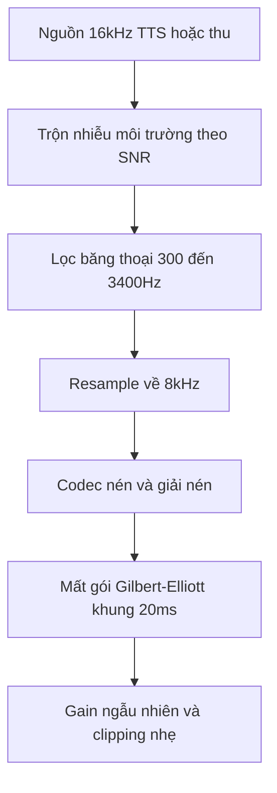
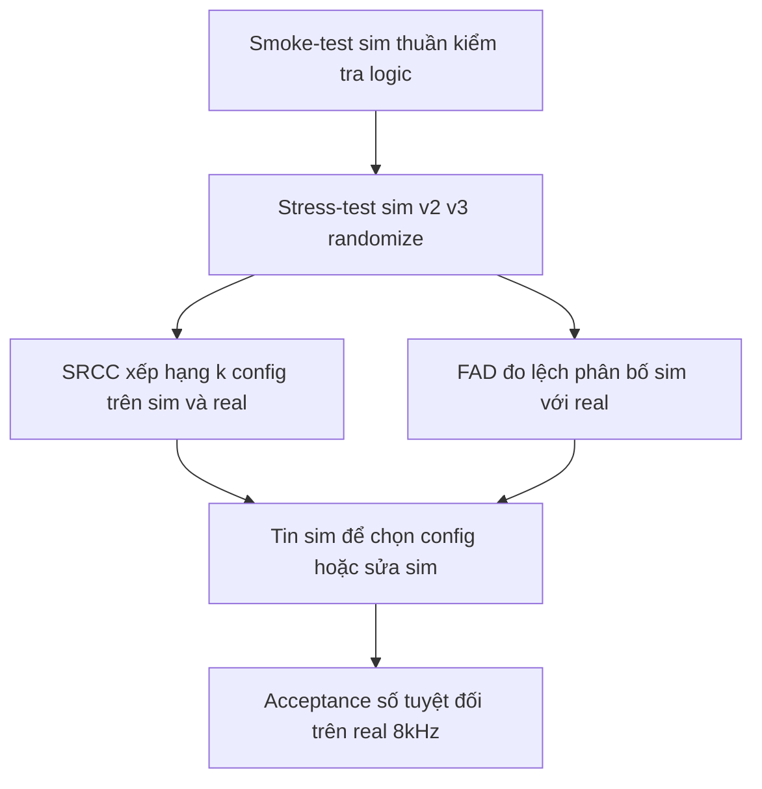

# 08.02 — Tạo Dữ Liệu Sim → Real: Sinh Audio Giả Lập Bổ Trợ Real-Data Cho Voice-Bot 8kHz

> [!NOTE]
> - Tài liệu này mô tả cách SINH dữ liệu giả lập (audio + hội thoại + nhãn) bổ trợ real-data, phục vụ kiểm thử model và hệ thống voice-bot tổng đài tiếng Việt 8kHz theo kịch bản.
> - Đây là tầng AUDIO bổ sung cho thiết kế sim hội thoại mức text/event tại [01_design.md](../11_sim_test_system/01_design.md), nối tiếp harness text-first đã chạy tại [04_turn_detection.md](../11_sim_test_system/04_turn_detection.md).
> - Trục kịch bản nhiễu bám taxonomy A/B/C tại [03_audio_frontend/00_README.md](../03_audio_frontend/00_README.md); hai tài liệu cùng thư mục `01_eda_methodology.md` và `03_training_recipes.md` đang được biên soạn song song.

---

## 1. Dẫn dắt bối cảnh

- **Bối cảnh thực tế**:
  - Real-data cuộc gọi tổng đài là nguồn chuẩn nhất để đánh giá voice-bot,
  - nhưng nguồn dữ liệu này vừa khó tiếp cận (quy trình phê duyệt, ẩn danh hóa) vừa thiếu nhãn chi tiết ở mức mili-giây (thời điểm ngắt lời, loại sự kiện thoại),
  - và gần như không có mẫu ở các tình huống hiếm: nói đè tại SIR thấp, mất gói dạng burst, karaoke nền lẫn tiếng người.
- **Nghịch lý đo lường**:
  - Muốn tin kết quả trên sim thì phải đối chiếu với real, nhưng muốn sinh sim đúng thì phải biết trước phân bố nhiễu và kênh của real,
  - nghĩa là EDA trên real corpus phải đi TRƯỚC việc sinh sim (quy trình EDA xem `01_eda_methodology.md`),
  - và sim không thay thế real mà bổ trợ theo vai: smoke-test kiểm tra logic, stress-test kiểm tra thứ hạng và failure mode, còn số tuyệt đối vẫn thuộc về real.

> Tài liệu này trình bày bốn trục sinh dữ liệu — chuỗi kênh telephony, nhiễu môi trường, hội thoại TTS, kịch bản barge-in có nhãn —
> **cùng kỷ luật đo khoảng cách sim-to-real**,
> để tầng render audio nối vào harness text-first sẵn có mà không phá thiết kế đã chốt.

---

## 2. Glossary

- `codec chain` -> **Codec Chain** ->
  - Chuỗi biến đổi mô phỏng kênh thoại: lọc băng → resample → codec nén và giải nén → mất gói → gain.
- `SIR` -> **Signal-to-Interference Ratio** ->
  - Tỷ lệ tiếng người nói mục tiêu trên tiếng chen (người khác, TV); tương tự SNR nhưng nguồn chen là tiếng nói nên khó tách hơn với turn-detection.
- `Gilbert-Elliott` -> **Gilbert-Elliott Model** ->
  - Mô hình Markov 2 trạng thái (good/bad) sinh mất gói dạng burst, chuẩn hóa trong ITU-T G.191 STL.
- `PLC` -> **Packet Loss Concealment** ->
  - Kỹ thuật che lấp gói mất ở phía nhận; quyết định dạng méo mà ASR nhìn thấy khi mất gói.
- `domain randomization` -> **Domain Randomization** ->
  - Random hóa tham số môi trường sim trên dải rộng để kết luận bất biến với tham số không biết chắc.
- `FAD / FSD` -> **Fréchet Audio / Speech Distance** ->
  - Khoảng cách phân bố embedding giữa hai pool audio, dùng đo độ lệch sim với real.
- `SRCC` -> **Spearman Rank Correlation Coefficient** ->
  - Tương quan thứ hạng giữa hai bảng xếp hạng config, trả lời câu hỏi "A hơn B trên sim thì có hơn trên real không".
- `reference voice` -> **Reference Voice (zero-shot cloning)** ->
  - Đoạn audio mẫu vài giây để TTS zero-shot nhân bản giọng, cho phép sinh giọng vùng miền không cần thu người mới.

---

## 3. Chuỗi Simulate Kênh Telephony 8kHz — Tầng Rẻ Nhất, Bằng Chứng Mạnh Nhất

### 3.1 Bằng chứng số liệu

- **APSIPA 2019 — codec simulation cho telephony ASR** (✅ đã đọc trọn PDF):
  - Bối cảnh giống FCI: không có data telephony thật để train, chỉ có data wideband 16kHz → downsample 8kHz rồi cho qua 27 codec giả lập bằng ffmpeg (landline μ/A-law, cellular GSM và AMR-NB, VoIP G.729a, Opus...).
  - Kết quả trên 4 tập telephony THẬT: WER giảm 7.28–12.78% absolute chỉ nhờ codec simulation, không cần thêm giờ data mới (ví dụ FreeTalk-2016: 64.78% → 55.09%).
  - Insight chọn nhóm codec: nhóm méo nặng khớp real telephony nhất; nhóm mixed (random toàn bộ 27 codec) gần bằng và robust nhất trên mọi test set → khuyến nghị dùng mixed-codec khi không biết trước kênh thật.
- **MDPI Applied Sciences 2022 — codec + packet loss cho call-center** (⚠️ đọc trích đoạn):
  - Méo Fisher Spanish bằng 3 codec call-center (GSM-FR, MP3-8k/16k) + mất gói 0–20% theo gói đơn / burst 60ms / trộn, mất gói mô phỏng bằng zero-fill.
  - Mô hình augmentation codec + single + burst loss (da_model4) thắng trên cả 3 tập call-center thật, tốt nhất +10% WER absolute, khác biệt có ý nghĩa thống kê.
  - ⚠️ Bẫy PLC: train với data đã qua PLC chỉ tốt khi test cũng qua đúng PLC — nếu tổng đài FCI có PLC ở SBC/gateway thì chuỗi sim phải có, còn không thì không thêm.
- **Kết luận trục này**: codec-chain augmentation là kỹ thuật rẻ nhất có bằng chứng WER mạnh nhất (2 paper độc lập, cải thiện 7–13% absolute trên data thật);
  - mức fidelity v3 trong [01_design.md §6](../11_sim_test_system/01_design.md) (8kHz μ-law) là mức sàn, cần nâng thành chuỗi đầy đủ dưới đây.

### 3.2 Chuỗi biến đổi chuẩn — thứ tự cố định, tham số randomize

- **⚙️ Cơ chế**: mô phỏng đúng đường đi vật lý của tín hiệu — nhiễu vào microphone TRƯỚC, kênh truyền méo SAU, nên thứ tự các tầng không được đảo.
- **🔍 Nhận diện**: spectrogram sau chuỗi phải cắt đúng 3.4kHz; mất gói hiện thành dropout theo khung 20ms; codec low-rate làm mờ cấu trúc hài âm.
- **💡 Ý nghĩa**: một chuỗi đúng thứ tự cho phép randomize từng tầng độc lập (codec nào, tỷ lệ mất gói bao nhiêu) mà vẫn giữ tính vật lý của kênh.
- **⚠️ Bẫy**: trộn nhiễu SAU codec là lỗi sim phổ biến — trong hệ thật nhiễu môi trường cũng bị codec nén méo như tiếng nói.

- **Khung đọc sơ đồ**:
  - **Đề bài cần giải**:
    - Chuẩn hóa thứ tự các tầng biến đổi khi render một file audio sim từ nguồn sạch thành audio giống kênh tổng đài 8kHz.
  - **Giả định nền**:
    - Nguồn đầu vào là audio 16kHz (TTS hoặc thu trực tiếp); RIR chỉ chèn thêm trước tầng trộn nhiễu khi mô phỏng loa ngoài.
  - **Ý nghĩa các khối**:
    - `SRC` → `MIX`: nhiễu môi trường vào microphone trước khi tín hiệu lên kênh.
    - `BAND` → `RS` → `CODEC`: giới hạn băng thoại, hạ tần số lấy mẫu, rồi nén bằng codec (μ-law, A-law, AMR-NB 4.75–12.2k, GSM-FR, Opus NB).
    - `LOSS` → `GAIN`: mất gói burst theo Gilbert-Elliott (tỷ lệ trung bình 0.5–5%, burst 40–200ms, zero-fill hoặc repeat-frame), rồi level ngẫu nhiên quanh −26 dBFS.
  - **Cách đọc**:
    - Luồng đi từ trên xuống; thứ tự cố định, tham số mỗi khối randomize theo dải lấy từ EDA real.
- **Công cụ sẵn có**:
  - NeMo có `TranscodePerturbation` (G.711 A-law qua sox 8kHz + AMR-NB) dùng được ngay trong stack NeMo ✅;
  - ffmpeg đủ cho toàn bộ tầng codec offline (recipe Opus narrowband gốc từ paper APSIPA, lệnh mẫu tự tổng hợp cần verify bằng spectrogram trước khi tin ⚠️); Gilbert-Elliott tự viết khoảng 50 dòng Python trên khung 20ms;
  - tham số tham chiếu: τ-Voice dùng khoảng 2% loss trung bình, burst 100ms ✅ — tạm mượn cho đến khi đo được số kênh thật của FCI.

---

## 4. Augmentation Nhiễu Môi Trường + RIR

### 4.1 Nguồn nhiễu và RIR công khai

| Nguồn | Nội dung | Map taxonomy | License | Nhãn |
| :--- | :--- | :--- | :--- | :--- |
| MUSAN (openSLR-17) | ~42h music + ~60h speech babble + ~6h noise | `acu.babble`, `acu.music`, `acu.device` | CC BY 4.0 ⚠️ | ✅ chuẩn ngành |
| DNS Challenge | ~180h noise clip + 60k RIR tổng hợp | `acu.*` đa dạng | trộn nhiều license ⚠️ | ✅ |
| WHAM! | ~80h nhiễu quán cafe/bar thu thật | `acu.babble`, `acu.cafe` | CC BY-NC 4.0 ⚠️ | ✅ |
| CHiME-3/4 | bus/cafe/pedestrian/street thu thật | `acu.street`, `acu.transport` | theo challenge ⚠️ | ✅ |
| ESC-50 | 2000 clip 5s × 50 lớp sự kiện (trẻ khóc, còi xe) | `acu.impulse` + sự kiện lẻ | CC BY-NC ⚠️ | ✅ |
| openSLR-26/28 (RIRS_NOISES) | 60k RIR mô phỏng + RIR thật + point-noise | `acu.reverb` | Apache 2.0 ⚠️ | ✅ chuẩn ngành |

- **Recipe SNR chuẩn ngành** (kiểu VoxCeleb/Kaldi): convolve RIR openSLR-26 + trộn MUSAN ở SNR 5–20dB random ✅.
- **Thứ tự trộn**: nhiễu môi trường trộn TRƯỚC chuỗi codec (xem ⚠️ Bẫy ở §3.2).
- **RIR cho telephony**: cuộc gọi cầm máy sát miệng thì RIR ít tác dụng; RIR chỉ bật khi mô phỏng loa ngoài / speakerphone (`spk.farfield` trong taxonomy C).

### 4.2 Nhiễu đặc thù tổng đài Việt Nam

- **Hiện trạng nguồn**: không có dataset nghiên cứu chuyên dụng cho nhiễu Việt Nam —
  - gần nhất là Ho Chi Minh City Sound Library (thu thật tại TP.HCM: traffic xe máy, chợ, đám đông; trả phí một lần, license thương mại cần đọc kỹ ⚠️); còn karaoke hàng xóm, TV thời sự, tiếng rao — không nguồn công khai nào có ❓.
- **Cách lấp chỗ trống**: tự thu bằng smartphone theo checklist, mỗi loại 10–15 phút là đủ cho augmentation (cơ sở lượng: DEMAND cũng chỉ khoảng 15 phút cho mỗi môi trường ⚠️);
  - danh sách ưu tiên: ngã tư giờ cao điểm, chợ, quán cafe vỉa hè, TV mở thời sự, karaoke vọng qua tường, phòng có trẻ em.
- **Ưu tiên nhiễu speech-like**: lớp rủi ro cao nhất cho turn-detection là nhiễu CÓ TIẾNG NGƯỜI (TV, karaoke, chợ) vì tạo false-positive dạng "tiếng người nhưng không phải khách" — thu lớp này trước, và tag riêng `speech-like noise` trong metadata để Scorer phân tích theo nhóm.

---

## 5. Sinh Hội Thoại Tổng Hợp Bằng TTS

### 5.1 TTS tiếng Việt khả dụng

| Model / dịch vụ | Kiểu | Giọng vùng miền | License / giá | Nhãn |
| :--- | :--- | :--- | :--- | :--- |
| F5-TTS-Vietnamese-ViVoice | zero-shot cloning, train 1000h | clone theo reference voice | CC-BY-NC-SA-4.0, chỉ research ⚠️ | ✅ tồn tại |
| viXTTS | XTTS-v2 fine-tune viVoice, cloning | theo reference voice | Coqui CPML non-commercial ⚠️ | ✅ |
| FPT.AI TTS | API thương mại | nhiều giọng 3 miền | free 100k ký tự/tháng; 500k VND/1.5M ký tự | ✅ |

- **Ghép nguồn giải bài đa giọng vùng miền** (không cần thu người mới):
  - **ViMD** (102.56h, 63 tỉnh, 12.9k speakers — đã dẫn trong [03_audio_frontend §7](../03_audio_frontend/00_README.md)) làm kho reference voice cho zero-shot cloning → sinh giọng user 63 tỉnh với text tùy ý.
  - **VietSuperSpeech** (267h hội thoại tiếng Việt tự nhiên từ YouTube, public trên HF ✅) làm nguồn giọng hội thoại có disfluency thật và làm pool đối chứng phân bố.

### 5.2 Pipeline LLM viết kịch bản → TTS 2 vai → trộn kênh

- **Mẫu ngành đã chứng minh — τ-Voice benchmark** (✅):
  - chuỗi: LLM sinh text theo persona → TTS đa giọng → mô phỏng môi trường (noise nền SNR 15dB ±3dB drift, sự kiện burst, out-of-turn speech) → G.711 μ-law 8kHz + Gilbert-Elliott 2% burst 100ms;
  - số liệu đáng chú ý: voice agent chỉ giữ 30–45% năng lực so với bản text; ablation Retail cho thứ tự tác động **accent lạ −10pp > turn-taking −7pp > noise −4pp** → thứ tự đầu tư trục kịch bản nên là giọng > turn-taking > nhiễu;
  - kỷ luật đáng học: nhóm tác giả chứng minh 79–90% failure do agent chứ không phải artifact của simulator — sim test hệ thống phải tự kiểm chứng mình trước.
- **Giữ nguyên tắc của [01_design.md](../11_sim_test_system/01_design.md)**: LLM chỉ đa dạng hóa diễn đạt bề mặt; nhãn (INTERRUPT/HOLD, expected tool-call) đến từ template, không cho LLM tự quyết nhãn.
- **Vai bot dùng đúng TTS production của FCI**: barge-in detector phải nghe đúng giọng bot thật; chỉ vai user mới cần đa dạng hóa.

### 5.3 Rủi ro TTS quá sạch — mismatch prosody

- **Bằng chứng gap**:
  - train ASR bằng synthetic-only kém hơn real-only, và thêm quá nhiều synthetic có thể làm kết quả tệ đi do lệch phân bố (arXiv:2407.21476 ⚠️);
  - TTS truyền thống sinh giọng sạch, prosody phẳng, thiếu biến thiên mà ASR/VAD cần (arXiv:2410.16726 ⚠️);
  - phân tích bispectral vẫn phân biệt được TTS hiện đại với người thật — khác phân bố là có thật, không dừng ở mức "nghe giống là đủ" ⚠️.
- **Cách giảm gap, xếp theo chi phí**:
  1. Codec chain + noise (§3, §4) đè lên TTS — băng 300–3400Hz cắt phần lớn artifact trên 4kHz, rẻ nhất.
  2. Đa dạng hóa reference voice (ViMD 63 tỉnh) + random tốc độ + chèn disfluency trong text script ("à", "ừ thì", lặp từ) — hướng Hard-Synth (arXiv:2411.13159 ⚠️).
  3. Trộn tỷ lệ có kiểm soát: mọi kết luận trọng yếu phải có nhóm đối chứng real (§8).
- **Lưu ý riêng cho TEST (khác train)**: dữ liệu test sinh bằng TTS chấp nhận được cho smoke/stress vì cần NHÃN đúng hơn cần phân bố đúng; nhưng số tuyệt đối (WER, accuracy ngắt lời) đo trên TTS không được trích dẫn như số production.

---

## 6. Sinh Kịch Bản Barge-in Có Nhãn Miễn Phí — Giá Trị Cao Nhất Cho FCI

### 6.1 Nguyên lý: trộn tại offset kiểm soát → nhãn tự có

- **⚙️ Cơ chế**: render một scenario turn-detection bằng cách cộng 3 track —
  - track A = bot-TTS (đúng TTS production), track B = user event chèn tại `t_start_s` kiểm soát và scale theo SIR mục tiêu (đo RMS trên vùng active, không đo cả file), track C = noise theo SNR; tổng 3 track cho qua chuỗi kênh §3.2.
- **🔍 Nhận diện**: nhãn tự có và chính xác tuyệt đối — thời điểm ngắt chuẩn = `t_start_s`, loại sự kiện = tag của template — giải đúng chỗ số latency synthetic mà [04_turn_detection.md §5](../11_sim_test_system/04_turn_detection.md) tự nhận.
- **💡 Ý nghĩa**: nhãn mức mili-giây kiểu này gần như không thể có từ real-data (gán nhãn tay không đạt độ phân giải thời gian tương đương).
- **⚠️ Bẫy — kiến trúc kênh của tổng đài**: trong hệ thật, audio bot không quay lại microphone user trừ đường echo; kênh mà turn-detector nghe là kênh USER —
  - nên render 2 chế độ: (a) kênh user thuần + timeline trạng thái "bot đang nói" để test decider logic; (b) thêm echo-leak của bot vào kênh user với suy hao −15..−30dB ❓ (tham số cần đo trên hạ tầng thật) để stress-test AEC.

### 6.2 Bằng chứng ngành làm cùng cách

- **RelayS2S** (arXiv:2603.23346 ⚠️ snippet): train duplex control bằng synthesized dialogue; barge-in = cắt utterance assistant tại điểm random 20–60% độ dài, user turn đè lên 320ms — bê nguyên bộ tham số làm mốc khởi đầu.
- **Full-Duplex-Bench v1.0/v1.5** (arXiv:2503.04721 ✅): benchmark 4 hành vi turn-taking; v1.5 thêm đúng các negative FCI cần (background speech, side conversation, user backchannel); metric tham khảo: Takeover Rate, latency vào lượt.
- **Smart-turn (pipecat)** (✅): model turn-detection open-source BSD-2, train chủ yếu bằng synthetic TTS data, dataset public trên HF — bằng chứng rằng sinh data turn-taking bằng TTS là hướng ngành làm thật.
- **Barge-in cổ điển (IVR)** (✅ tồn tại): ngành đã đo "accuracy tại offset 0/50/100ms sau onset" và "latency tối thiểu đạt 90% barge-in accuracy" — 2 metric nên bê vào Scorer.

### 6.3 Ma trận negative — sinh cùng khuôn, đổi track B

- **Backchannel**: "dạ", "vâng", "ừm" 200–500ms, SIR cao → nhãn HOLD.
- **False start**: 1–2 âm tiết rồi im ≥ 800ms → HOLD (kèm timeout).
- **Side-speech**: giọng KHÁC reference voice của khách, câu hoàn chỉnh → HOLD.
- **TV/karaoke có lời**: nhiễu speech-like đã thu ở §4.2, SNR quét 0–15dB → HOLD.
- **Nói đè thật**: câu đầy đủ ngữ nghĩa của khách, SIR quét −5..+15dB, offset quét đầu/giữa/cuối câu bot → INTERRUPT.
- **Từ khóa dừng**: "khoan", "dừng lại" tại offset kiểm soát → INTERRUPT.
- **Trục quét chung**: offset × SIR × SNR nền — vùng đuôi phân bố mà real-data gần như không bao giờ đủ mẫu, và là chỗ sim bổ trợ real rõ nhất.

---

## 7. Ma Trận Kịch Bản Test — Pairwise Thay Vì Tích Đầy Đủ

- **Kích thước tích đầy đủ** (ước lượng từ taxonomy hiện có, suy luận cần kiểm chứng):
  - nhiễu (6 loại × 3 SNR) × giọng (3 miền × 2 giới × 2 tốc độ) × hội thoại (8 nhóm N1–N6 + negative mới) × kênh (4 codec × 3 mức mất gói) ≈ 31k tổ hợp — không chạy nổi và không cần chạy.
- **Cơ sở pairwise (NIST ✅)**: đa số bug kích hoạt bởi 1 tham số hoặc tương tác đúng 2 tham số; phủ 2-way bắt trên 90% lỗi với vài phần trăm số case.
- **Cách áp cho FCI**:
  - sinh tổ hợp 2-way bằng `allpairspy` (Python, MIT) hoặc PICT (Microsoft) → ma trận khoảng 50–150 scenario đại diện;
  - **ngoại lệ phủ đủ (full-factorial cục bộ)**: cặp trục nghi tương tác mạnh về vật lý — (nhiễu speech-like × SIR) cho turn-detection và (codec low-rate × packet loss) cho ASR — không để pairwise pha loãng;
  - **trọng số rủi ro nghiệp vụ**: nhóm INTERRUPT-miss tốn kém hơn HOLD-miss → nhân số scenario nhóm N1/N5/N6 lên 2–3 lần;
  - mỗi ô ma trận sinh n ≥ 5 biến thể bề mặt (LLM đổi diễn đạt) để ước lượng phương sai, không kết luận trên n=1.

---

## 8. Kỷ Luật Đo Sim-to-Real Gap

### 8.1 Ba tầng tin cậy

- **Smoke-test** (sim thuần v1): chỉ kết luận đúng/sai LOGIC — decider có đọc nhầm tag, scorer có lệch off-by-one; không kết luận chất lượng model.
- **Stress-test** (sim v2/v3 + domain randomization): kết luận THỨ HẠNG và FAILURE MODE — config A hơn B, model gãy ở SNR/SIR nào; số tuyệt đối chưa tin.
- **Acceptance** (real 8kHz ẩn danh): kết luận SỐ TUYỆT ĐỐI; tập real chỉ dùng đối chiếu, không train (đúng nguyên tắc trong [01_design.md §7](../11_sim_test_system/01_design.md)).

- **Khung đọc sơ đồ**:
  - **Đề bài cần giải**:
    - Xác định khi nào một kết luận đo trên sim được phép nâng cấp thành kết luận cho hệ thật.
  - **Giả định nền**:
    - Đã có một tập real 8kHz ẩn danh nhỏ làm mỏ neo, và renderer sim đã qua smoke-test logic.
  - **Ý nghĩa các khối**:
    - `SMOKE` → `STRESS`: hai tầng kết luận nội bộ của sim, tăng dần fidelity.
    - `SRCC` / `FAD`: hai thước đo độc lập — thứ hạng config và độ lệch phân bố đặc trưng.
    - `TRUST` → `ACC`: chỉ khi hai thước đo cùng đạt mới dùng sim để chọn config, và số tuyệt đối vẫn đo trên real.
  - **Cách đọc**:
    - Luồng đi từ trên xuống; nếu `SRCC` hoặc `FAD` không đạt thì quay lại sửa renderer, không nhảy thẳng xuống `ACC`.

### 8.2 Hai thước đo cụ thể

- **SRCC — tương quan thứ hạng**:
  - chạy k config (k ≥ 5, ví dụ 5 ngưỡng VAD hoặc 3 decider) trên cả sim và tập real nhỏ → tính Spearman giữa 2 bảng xếp hạng;
  - SRCC cao (đề xuất > 0.8 ❓ — quy ước nội bộ tự đặt, chưa có chuẩn ngành cho bài này) → tin sim để chọn config; thấp → sửa sim trước khi dùng tiếp.
- **FAD/FSD — lệch phân bố đặc trưng**:
  - Fréchet Audio Distance giữa pool sim và pool real trên embedding (nghiên cứu 2026 cho thấy WavLM embedding ổn định nhất cho speech, arXiv:2601.21386 ⚠️); dùng như đồng hồ tiến bộ của renderer: mỗi lần thêm 1 tầng (noise → codec → packet loss) FAD so với real phải GIẢM, tầng nào thêm vào mà FAD tăng là tầng sai tham số;
  - ⚠️ đồng bộ với cảnh báo trong [03_audio_frontend §6](../03_audio_frontend/00_README.md): encoder embedding train trên 16kHz wideband, hành vi trên 8kHz chưa kiểm chứng — so sánh FAD chỉ hợp lệ khi cả hai pool cùng qua một chuẩn hóa.

### 8.3 Bài học domain randomization từ robotics

- **Giới hạn nguyên tắc** (✅ tổng hợp): domain randomization chỉ vá được gap MÔ HÌNH HÓA ĐƯỢC (tham số vật lý không chắc → randomize dải rộng); gap ngoài mô hình — bên audio tương đương: hành vi AGC firmware lạ, PLC độc quyền của carrier, méo microphone giá rẻ — thì randomization không xử lý được.
- **Hệ quả thực dụng**: EDA real corpus TRƯỚC, randomize SAU — dải randomize (SNR range, loss rate) phải lấy từ phân bố đo được (`01_eda_methodology.md`), không tự đặt tùy ý.
- **Chi phí của randomize quá rộng**: kết luận bị pha loãng — model tốt trên phân bố quá rộng có thể không tối ưu cho phân bố thật hẹp.
- **Tự kiểm chứng simulator** (học từ τ-Voice): nghe xác suất 10–20 case fail, phân loại "lỗi model" và "lỗi renderer" — bảo đảm failure quy được cho hệ chứ không phải artifact sim.

---

## 9. Khuyến Nghị Cho FCI — Pipeline 7 Ngày

> Nguyên tắc: tận dụng harness text-first ĐÃ CHẠY ([04_turn_detection.md](../11_sim_test_system/04_turn_detection.md), 17 scenario) — chỉ thêm tầng render audio, không đập lại thành phần nào.

- **Ngày 1–2 — Renderer v3-lite, chuỗi kênh trước**:
  - viết `render_channel.py`: ffmpeg chain (bandpass 300–3400 → 8kHz → codec random trong {μ-law, AMR-NB 4.75k, GSM-FR} → decode) + Gilbert-Elliott packet-drop tự viết (zero-fill, p_loss 0/2/5%);
  - lý do đảo thứ tự so với thang v1→v3 của [01_design.md](../11_sim_test_system/01_design.md): codec chain là tầng có bằng chứng WER mạnh nhất (§3.1) và rẻ nhất, còn nhiễu môi trường Việt Nam cần thời gian thu;
  - nghiệm thu: spectrogram cắt đúng 3.4kHz; nghe 5 file bằng tai; FAD với pool real nhỏ giảm so với bản 16kHz sạch.
- **Ngày 2–3 — TTS 2 vai cho 17 scenario sẵn có**:
  - vai bot = TTS production FCI; vai user = F5-TTS-Vietnamese-ViVoice (license research, chỉ nội bộ ⚠️) với 5–10 reference voice từ ViMD (Bắc/Trung/Nam × nam/nữ);
  - trộn theo công thức §6.1, xuất nhãn `t_start_s` chính xác vào manifest (Lhotse cuts hoặc JSON hiện có).
- **Ngày 3–4 — Nhiễu**: tải MUSAN + 3 loại speech-like tự thu (TV thời sự, karaoke, chợ — 15 phút/loại bằng smartphone); trộn SNR {5, 10, 15dB} TRƯỚC chuỗi codec.
- **Ngày 4–5 — Ma trận pairwise**: `allpairspy` trên 5 trục (loại nhiễu, SNR, giọng, loại sự kiện N1–N6, codec × loss) → khoảng 60–100 scenario audio; giữ full-factorial cục bộ cho (speech-like noise × SIR).
- **Ngày 5–7 — Chạy và neo thực tế**:
  - chạy energy-VAD và semantic decider trên bộ audio mới → lần đầu có latency THẬT thay số synthetic;
  - neo mini: 10–20 đoạn gọi thật ẩn danh (hoặc proxy tạm = VietSuperSpeech + tự render kênh) → tính SRCC 2 decider và FAD sim với real;
  - báo cáo theo format Scorer sẵn có: ma trận nhầm lẫn × nhóm × môi trường + latency phân vị.
- **Việc KHÔNG làm trong tuần 1** (ghi tech-debt): echo-leak/AEC path, RIR far-field, AGC pumping, thu đủ bộ nhiễu Việt Nam, interrupt do LLM điều khiển kiểu τ-Voice, tool-calling audio-mode.
- **Câu hỏi phải chốt với team hạ tầng**: codec thật của tổng đài (G.711 hay AMR-NB), tỷ lệ packet loss / burst thật, SBC có PLC không, mức echo-leak dB — mọi dải randomize hiện tạm mượn số nước ngoài.

---

## 10. Nguồn Tham Chiếu

| Link tài liệu | Nội dung chứng minh | Nhãn |
| :--- | :--- | :--- |
| [APSIPA 2019](http://www.apsipa.org/proceedings/2019/pdfs/216.pdf) | 27 codec ffmpeg, WER giảm 7.28–12.78% absolute trên 4 tập telephony thật; mixed-codec robust nhất. | ✅ đã đọc trọn PDF |
| [MDPI Appl. Sci. 12(3):1580](https://doi.org/10.3390/app12031580) | Codec + packet loss Gilbert-style cho call-center, tốt nhất +10% WER absolute; bẫy PLC mismatch. | ⚠️ trích đoạn |
| [τ-Voice](https://arxiv.org/html/2603.13686v1) | Pipeline LLM→TTS→môi trường→G.711+GE 2%; agent giữ 30–45% năng lực; accent −10pp > turn-taking −7pp > noise −4pp. | ✅ |
| [Full-Duplex-Bench](https://arxiv.org/abs/2503.04721) | Benchmark 4 hành vi turn-taking; v1.5 thêm background speech / side conversation / backchannel. | ✅ |
| [RelayS2S](https://arxiv.org/pdf/2603.23346) | Barge-in synthetic: cắt câu bot tại 20–60% độ dài, overlap 320ms. | ⚠️ snippet |
| [Smart-turn (pipecat)](https://github.com/pipecat-ai/smart-turn) | Model turn-detection train chủ yếu bằng synthetic TTS, dataset public. | ✅ |
| [TTS-for-ASR gap](https://arxiv.org/pdf/2407.21476) | Synthetic-only kém real-only; thêm quá nhiều synthetic có thể gây hại. | ⚠️ abstract |
| [F5-TTS-Vietnamese-ViVoice](https://huggingface.co/hynt/F5-TTS-Vietnamese-ViVoice) | TTS cloning tiếng Việt 1000h; license CC-BY-NC-SA chỉ research. | ✅ tồn tại, ⚠️ license |
| [VietSuperSpeech](https://arxiv.org/pdf/2603.01894) | 267h hội thoại tiếng Việt tự nhiên, public trên HF. | ✅ |
| [NeMo TranscodePerturbation](https://docs.nvidia.com/deeplearning/nemo/archives/nemo-100rc1/user-guide/docs/_modules/nemo/collections/asr/parts/perturb.html) | Transcode G.711/AMR-NB sẵn trong NeMo. | ✅ |
| [NIST combinatorial testing](https://csrc.nist.gov/CSRC/media/Presentations/Combinatorial-Coverage-Measurement-Concepts-and-Ap/images-media/kuhn-et-al-iwct13.pdf) | Phủ pairwise bắt trên 90% lỗi với vài phần trăm số case. | ✅ |
| [Fréchet Speech Distance](https://arxiv.org/html/2601.21386) | WavLM embedding ổn định nhất cho FAD trên speech. | ⚠️ |
| [HCM City Sound Library](https://freetousesounds.com/ho-chi-minh-city-sound-effects-traffic-crowds-industrial-sounds) | Nguồn nhiễu thu thật tại TP.HCM, trả phí một lần. | ✅ tồn tại, ⚠️ license |
| EVA-Bench (arXiv:2605.13841) | Framework đánh giá voice agent end-to-end, mới xuất hiện. | ❓ chưa xác minh |

---

## ✅ Tự kiểm nhanh

1. Vì sao nhiễu môi trường phải trộn TRƯỚC chuỗi codec chứ không phải sau?

- **Bám đường đi vật lý của tín hiệu**:
  - Trong hệ thật, nhiễu môi trường vào microphone cùng tiếng nói, rồi cả hai cùng bị codec nén méo trên kênh truyền.
  - Trộn nhiễu sau codec tạo ra nhiễu "sạch" chưa qua nén — một phân bố không tồn tại trong thực tế, làm sim lệch khỏi real ngay từ khâu render.

2. Vì sao nhãn barge-in sinh từ phương pháp trộn tại offset kiểm soát được coi là "miễn phí" và chính xác tuyệt đối?

- **Nhãn sinh ra từ chính tham số render**:
  - Thời điểm user bắt đầu chen (`t_start_s`), loại sự kiện (backchannel / nói đè / side-speech) và SIR đều là tham số đầu vào của renderer, không cần gán nhãn tay.
  - Real-data không thể cho nhãn mức mili-giây tương đương, và cũng gần như không có mẫu ở vùng đuôi phân bố (SIR thấp, offset hiếm) mà renderer quét được.

3. Khi nào được tin kết quả đo trên sim, và số nào vẫn phải đo trên real?

- **Phân vai theo ba tầng tin cậy**:
  - Sim thuần chỉ kết luận logic (smoke-test); sim v2/v3 kết luận thứ hạng config và failure mode (stress-test) sau khi SRCC trên k ≥ 5 config đạt ngưỡng quy ước và FAD giảm dần theo từng tầng render.
  - Số tuyệt đối (WER, accuracy ngắt lời, latency cam kết) luôn thuộc tầng acceptance đo trên real 8kHz ẩn danh — tập real chỉ dùng đối chiếu, không train.

