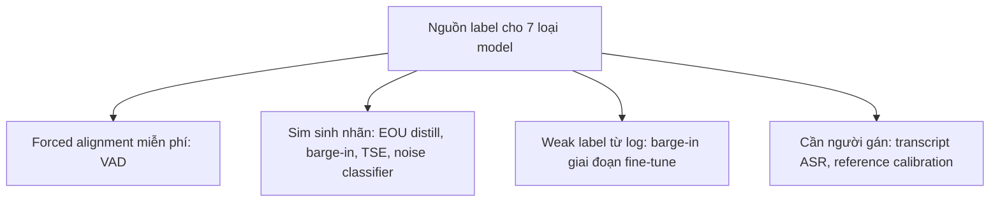

# 08.03 — Recipe Training Đặc Thù Từng Loại Model Trong Hệ Voice-Agent Tổng Đài 8kHz

> [!NOTE]
> - Tài liệu này tổng hợp đặc thù huấn luyện của 7 loại model trong pipeline voice-agent tiếng Việt 8kHz (data cần · nguồn label · loss · bẫy · metric · thứ tự ROI),
> - **mỗi loại model có "chế độ ăn data" riêng** — tài liệu chỉ rõ loại nào train từ đầu được, loại nào chỉ nên fine-tune hoặc distill.
> - Tham chiếu danh mục dataset hiện có tại [00_README.md](00_README.md), kinh nghiệm fine-tune ASR 8kHz tại [../04_asr_telephony/00_README.md](../04_asr_telephony/00_README.md),
> - các model turn-detection tại [../05_turn_interruption/00_README.md](../05_turn_interruption/00_README.md), và thiết kế hệ sim sinh data tại [../11_sim_test_system/01_design.md](../11_sim_test_system/01_design.md).

---

## 1. Dẫn dắt bối cảnh

- **Bối cảnh thực tế**:
  - Pipeline voice-agent tổng đài gồm ít nhất 7 loại model ghép cascade: VAD → EOU/turn-detection → barge-in intent → target-speaker extraction → noise classifier → ASR → confidence calibration.
  - Team đã có kinh nghiệm neo: fine-tune ASR NeMo FastConformer tiếng Việt trên DGX GB10 bằng curriculum 3 nấc (public → domain gần → callbot), WER callbot 40% → 22,87%, 9/9 test set cải thiện, không catastrophic forgetting.
- **Nghịch lý huấn luyện**:
  - Kinh nghiệm ASR dễ tạo phản xạ "mọi model đều cần gom giờ audio + thuê người gán nhãn rồi fine-tune",
  - trong khi thực tế VAD có label gần như miễn phí từ forced alignment, TSE bắt buộc 100% data sim, còn confidence calibration gần như không tốn GPU —
  - áp chung một recipe cho mọi model là nguồn lãng phí GPU và công gán nhãn phổ biến.

> Tài liệu này lập bản đồ "chế độ ăn data" của từng loại model,
> **chuẩn hóa quy trình chung sim pre-train → real fine-tune → eval phân tầng**,
> và chốt thứ tự huấn luyện theo ROI phù hợp với ràng buộc 1 GPU DGX GB10.

---

## 2. Glossary

- `forced alignment` -> **Forced Alignment** ->
  - Căn thẳng transcript với audio ở mức frame/word bằng model ASR — nguồn label frame-level miễn phí cho VAD.
- `hard negative` -> **Hard Negative** ->
  - Mẫu âm tính dễ gây nhầm (nhạc chờ giống speech, pause giữa câu giống hết turn) — quyết định chất lượng classifier.
- `distill` -> **Knowledge Distillation** ->
  - Dùng model lớn (teacher) gán nhãn/logits cho model nhỏ (student) học theo.
- `weak label` -> **Weak Label** ->
  - Nhãn suy ra gián tiếp từ hành vi hệ thống/log, có nhiễu, chỉ dùng bổ trợ giai đoạn fine-tune.
- `enrollment` -> **Enrollment** ->
  - Đoạn audio tham chiếu vài giây của speaker mục tiêu, điều kiện hóa model TSE.
- `SI-SDR` -> **Scale-Invariant Signal-to-Distortion Ratio** ->
  - Loss/metric chuẩn cho tách nguồn trên waveform; SI-SDRi là mức cải thiện so với mixture.
- `ECE / NCE` -> **Expected Calibration Error / Normalized Cross Entropy** ->
  - Metric đo chất lượng confidence score so với xác suất đúng thực tế.
- `temperature scaling` -> **Temperature Scaling** ->
  - Hiệu chỉnh post-hoc chia logits cho một hằng số T fit trên calibration set.
- `CEM` -> **Confidence Estimation Module** ->
  - Head nhỏ học dự đoán từ đúng/sai từ feature của ASR.
- `canary set` -> **Canary Set** ->
  - Tập mẫu nhỏ đại diện failure mode đã fix, chạy tự động để bắt regression.
- `SRCC` -> **Spearman Rank Correlation Coefficient** ->
  - Đo mức data sim dự báo đúng thứ hạng config khi chuyển sang data thật.

---

## 3. Bảng tổng hợp bảy loại model

- **⚙️ Bảng so sánh "chế độ ăn data"** (cột giờ data là ước lượng có neo văn liệu, cần kiểm chứng trên data FCI):

| Loại model | Data cần | Nguồn label | Giờ data tối thiểu (ước lượng) | Train từ đầu hay fine-tune | Bẫy chính |
| :--- | :--- | :--- | :--- | :--- | :--- |
| **VAD / speech-noise** | Audio 8kHz đủ loại nhiễu + non-speech | Forced alignment + synthetic mixing (miễn phí) | ~50-200h trộn nhiễu | Train từ đầu ĐƯỢC (model ~91k params) hoặc fine-tune MarbleNet | Class imbalance im lặng ≫ nói; nhạc chờ/TV/babble nhận nhầm là speech |
| **EOU / turn-detection** | Cặp (đoạn cuối turn, nhãn complete/incomplete) | Ranh giới turn corpus + distill LLM + synthetic TTS | ~10-50h audio cắt turn | Fine-tune smart-turn v3 / VAP; KHÔNG train từ đầu | Negative khó = ngập ngừng giữa câu; model gốc train 16kHz sạch |
| **Barge-in / backchannel intent** | Cửa sổ 300-500ms chen ngang + ngữ cảnh bot đang nói | Trộn tổng hợp offset kiểm soát + weak label log | ~5-20h clip chen ngang | Train từ đầu classifier nhỏ (CNN) hoặc fine-tune smart-turn encoder | Precision/recall lệch chi phí nghiệp vụ; cửa sổ ngắn thiếu ngữ cảnh |
| **TSE / speaker embedding** | Cặp (mixture, clean) — telephony KHÔNG có clean | Tự sinh 100% bằng sim (mix 2 speaker + nhiễu) | ~100-300h mixture sim | Train từ đầu trên sim 8kHz hoặc fine-tune model 16kHz | Enrollment ngắn/nhiễu làm sập chất lượng; target confusion giọng giống nhau |
| **Noise / audio-quality classifier** | Clip multi-label loại nhiễu + SNR | Pipeline tự động (Brouhaha, CLAP zero-shot) — KHÔNG cần người | ~20-100h synthetic contamination | Distill từ CLAP về model nhỏ; hoặc train từ đầu multi-task | Nhãn teacher nhiễu; taxonomy không khớp production |
| **ASR 8kHz tiếng Việt** | Audio telephony + transcript chuẩn hóa | Người gán + pseudo-label lọc | ~50-100h domain thật đã filter | CHỈ fine-tune (đã có kinh nghiệm nội bộ) | Quên data cũ nếu không trộn lại; text norm số/tiền không nhất quán |
| **Confidence calibration** | Held-out set phân tầng SNR/domain | Tự động: align hypothesis với reference → đúng/sai | ~5-10h held-out (KHÔNG train, chỉ calibrate) | Post-hoc (temperature scaling) hoặc CEM head nhỏ | Calibrate trên clean rồi dùng cho noisy → lệch |

### 3.1 Sơ đồ nhóm model theo nguồn label

- **Khung đọc sơ đồ**:
  - **Đề bài cần giải**:
    - Phân nhóm 7 loại model theo nguồn label để thấy phần lớn pipeline KHÔNG phụ thuộc vào người gán nhãn.
  - **Giả định nền**:
    - Hệ sim (Generator/Renderer trong `../11_sim_test_system/01_design.md`) sinh được data kèm nhãn cứng; chi tiết nguồn data sim xem `02_sim_to_real_data.md`.
  - **Ý nghĩa các khối**:
    - `Fa`: label sinh miễn phí từ chính corpus ASR đã có transcript.
    - `Sim`: nhãn ground-truth có sẵn theo cách sinh data (offset chen ngang, SNR trộn, nguồn clean trước khi mix, nhãn distill từ teacher).
    - `Weak`: nhãn suy từ hành vi production, có nhiễu, chỉ dùng bổ trợ.
    - `Human`: hai chỗ duy nhất bắt buộc transcript chuẩn do người kiểm soát.
  - **Cách đọc sơ đồ**:
    - Nhóm càng gần `Fa`/`Sim` thì chi phí label càng thấp → ưu tiên train sớm.
    - Ngân sách người gán nên dồn hết vào nhánh `Human` (transcript ASR + reference calibration) thay vì rải đều.

---

## 4. Recipe từng loại model

### 4.1 VAD / speech-noise classifier

- **Data và nguồn label**:
  - Label frame-level speech/non-speech ở độ phân giải ~20ms.
  - Nguồn rẻ nhất là forced alignment từ corpus ASR có transcript (sẵn từ pipeline FastConformer nội bộ); nguồn thứ hai là synthetic mixing — trộn speech sạch với nhiễu tại offset biết trước, label sinh kèm data.
  - Recipe tham chiếu: NVIDIA Frame-VAD Multilingual MarbleNet v2.0 train trên 2.600h data thật + 1.000h synthetic + 330h noise (MUSAN, Freesound, Vocalsound) — ✅ https://huggingface.co/nvidia/Frame_VAD_Multilingual_MarbleNet_v2.0
- **Loss và augmentation**:
  - Binary cross-entropy frame-level (NeMo `EncDecFrameClassificationModel`); chi tiết loss weighting không được công bố — ❓; xử lý class imbalance bằng weighted CE hoặc cân tỷ lệ segment — suy luận, cần kiểm chứng trên config NeMo cụ thể.
  - Hard negative bắt buộc cho tổng đài: nhạc chờ, TV/karaoke, babble, tiếng thở/ho/cười; downsample toàn bộ nguồn về 8kHz TRƯỚC khi trộn để tránh mismatch dải tần.
- **Giờ data tối thiểu**: ~50-200h hỗn hợp — ước lượng có neo văn liệu (model chỉ 91,5k params, MarbleNet đạt gần SOTA với 1/10 tham số — ✅ https://arxiv.org/abs/2010.13886), cần kiểm chứng.
- **⚠️ Bẫy**:
  - Silero VAD không có code fine-tune chính thức, chỉ tune hyperparameter — muốn học phân bố nhiễu tổng đài phải chuyển sang MarbleNet/pyannote — ✅ https://github.com/snakers4/silero-vad (discussion #146).
  - MarbleNet v2.0 khai báo input 16kHz → fine-tune cho 8kHz phải tự downsample và kiểm tra lại mel frontend — ✅ model card.
- **Metric và recipe mẫu**:
  - ROC-AUC frame-level (MarbleNet v2.0 báo 92-97 tùy test set — ✅ model card); cho FCI đo riêng theo tầng nhiễu (quiet / music-hold / babble) khớp taxonomy nội bộ.
  - Recipe end-to-end: NeMo tutorial Voice_Activity_Detection.ipynb — ✅ https://github.com/NVIDIA-NeMo/NeMo/blob/main/tutorials/asr/Voice_Activity_Detection.ipynb

### 4.2 EOU / turn-detection

- **Data và nguồn label** (ba nguồn bổ trợ nhau):
  - Ranh giới turn trong corpus hội thoại 2 kênh (Switchboard/Fisher cho tiếng Anh 8kHz; tiếng Việt chưa có corpus tương đương công khai — khoảng trống đã ghi ở `../04_asr_telephony/00_README.md`).
  - Distill từ LLM kiểu LiveKit: teacher Qwen2.5-7B-Instruct → student 0.5B dự đoán xác suất token `<|im_end|>`, hội tụ sau ~1.500 step; data synthetic có cấu trúc (địa chỉ, số điện thoại) + đa format STT — ⚠️ https://livekit.com/blog/improved-end-of-turn-model-cuts-voice-ai-interruptions-39
  - Synthetic TTS theo smart-turn: test set 26.101 mẫu chủ yếu synthetic, 30+ ngôn ngữ trong đó có tiếng Việt — ✅ https://huggingface.co/datasets/pipecat-ai/smart-turn-data-v3-test; quy tắc label (complete = "ý đã trọn", incomplete = filler/liên từ cuối câu, tỷ lệ 50:50) — ✅ https://github.com/pipecat-ai/smart-turn/blob/main/docs/data_generation_contribution_guide.md
- **Loss và augmentation**:
  - Smart-turn v3: Whisper-tiny chỉ lấy encoder + linear classifier (~8M params), binary classification, QAT (quantization-aware training) int8 khi export ONNX — ✅ repo + ⚠️ https://www.daily.co/blog/announcing-smart-turn-v3-with-cpu-inference-in-just-12ms/
  - VAP: objective tự giám sát dự đoán voice activity 0,6s tương lai trên 2 kênh — ✅ https://arxiv.org/abs/2205.09812 + ✅ https://arxiv.org/abs/2410.15929
  - Negative khó cắt từ GIỮA câu tại chỗ ngập ngừng thật (cờ `midfiller`/`endfiller` trong schema smart-turn — ✅); cho FCI: downsample 8kHz + codec μ-law trước khi fine-tune vì model gốc train trên 16kHz sạch.
- **Giờ data tối thiểu**: ~10-50h turn tiếng Việt (≈ vài chục nghìn mẫu ngắn, sinh chủ yếu bằng TTS + LLM script) — ước lượng có neo văn liệu, cần kiểm chứng; đối chiếu: VAP pre-train ~35h hội thoại, fine-tune sang ngôn ngữ mới khả thi với corpus cỡ chục giờ — ✅ https://arxiv.org/abs/2403.06487
- **⚠️ Bẫy**:
  - Label từ pause thuần túy dạy model "pause dài = hết turn" — đúng lỗi mà semantic turn-detection phải sửa; bắt buộc trộn negative "pause dài giữa câu".
  - LLM teacher có thể sai hệ thống với câu tiếng Việt khẩu ngữ ("dạ để em xem...") — cần người audit mẫu ngẫu nhiên trước khi tin nhãn distill — suy luận, cần kiểm chứng.
- **Metric và recipe mẫu**:
  - Accuracy + FP rate (bot cướp lời) + FN rate (bot đơ chờ) tách riêng; latency inference (smart-turn v3: 12,6-94,8ms CPU — ⚠️ blog Daily.co) đo cùng lúc với accuracy.
  - Recipe fine-tune mở duy nhất chạy được ngay: https://github.com/pipecat-ai/smart-turn (train.py + dataset HF) — ✅; baseline tiếng Việt 81,27% (FP 14,84%) còn dư địa lớn.

### 4.3 Barge-in / backchannel intent classifier

- **Data và nguồn label**:
  - Mẫu = (ngữ cảnh bot đang nói, cửa sổ audio user chen 300-500ms) + nhãn INTERRUPT/HOLD — khớp schema Scenario trong `../11_sim_test_system/01_design.md`.
  - Nguồn 1 — trộn tổng hợp từ gym-env: TTS câu bot + chèn tiếng user tại offset biết trước → nhãn ground-truth cứng từ template, LLM chỉ đa dạng hóa bề mặt.
  - Nguồn 2 — weak label từ production log (bot đã dừng/nói tiếp + kết cục hội thoại) → chỉ dùng fine-tune giai đoạn sau — suy luận, cần kiểm chứng; taxonomy nhãn giữ đúng 6 nhóm N1-N6 của bộ Excel nội bộ.
- **Loss và augmentation**:
  - Binary hoặc 3 lớp INTERRUPT/HOLD/UNSURE cross-entropy; lớp UNSURE để đẩy lên tầng LLM trong phễu 3 tầng (`../05_turn_interruption/00_README.md`); tham chiếu LiveKit adaptive interruption: CNN âm học, precision 86% / recall 100% ở cửa sổ 500ms — ⚠️ https://livekit.com/blog/adaptive-interruption-handling
  - Quét offset chen ngang dọc câu bot; trộn echo TTS bot lọt kênh mic (AEC không triệt hết) làm hard negative đặc thù telephony — suy luận, cần kiểm chứng; SNR sweep + nhạc chờ/TV làm distractor.
- **Giờ data tối thiểu**: ~5-20h clip chen ngang (mỗi clip <1s nên số mẫu lớn); bottleneck là ĐỘ PHỦ kịch bản chứ không phải giờ — ước lượng, cần kiểm chứng.
- **⚠️ Bẫy**:
  - Ngưỡng quyết định phải đặt theo cost matrix nghiệp vụ chứ không maximize F1: trong thu hồi nợ, FN (bot nói tiếp khi khách muốn ngắt) gây khiếu nại nặng hơn FP (bot dừng nhầm) — cần nghiệp vụ chốt cost, chưa có số.
  - Cửa sổ 300-500ms không đủ phân biệt "dạ" (backchannel) với "dạ khoan..." (mở đầu ngắt) → thiết kế two-stage decision cho phép sửa quyết định khi có thêm 200-300ms.
  - Train toàn synthetic TTS → model học artifact TTS thay vì intent; bắt buộc trộn giọng thu thật ở tập fine-tune cuối — suy luận từ bài học sim-to-real, cần kiểm chứng bằng eval real.
- **Metric và recipe mẫu**:
  - Confusion matrix theo nhóm N1-N6 × môi trường (quiet/noisy); latency quyết định end-to-end so với ngân sách ≤150ms của doc 05.
  - Không có recipe mở chuẩn cho bài toán này — FCI tự dựng bằng gym-env/Renderer là hợp lý; gần nhất là mượn smart-turn encoder hoặc VAP backchannel head.

### 4.4 Target-speaker extraction (TSE) / speaker embedding

- **Data và nguồn label**:
  - Cặp (mixture, clean target) + enrollment vài giây; telephony KHÔNG bao giờ có clean reference → toàn bộ supervised data phải SIM: speech sạch (VIVOS/CommonVoice/VLSP downsample 8kHz) trộn 2 speaker + MUSAN + RIR + codec μ-law, clean = nguồn gốc trước khi trộn.
  - Chuẩn benchmark: Libri2Mix bản 8kHz min-mode, 270h train, 100% overlap — ✅ https://arxiv.org/abs/2005.11262
  - Enrollment cho tổng đài lấy chính đoạn user nói đầu cuộc gọi — enrollment ngắn + cùng kênh, đúng điều kiện xấu cần augment.
- **Loss và augmentation**:
  - SI-SDR loss trên waveform + auxiliary speaker classification CE trên embedding — ✅ SpeakerBeam https://arxiv.org/abs/2001.08378; TSE có enrollment điều kiện hóa nên KHÔNG cần PIT (PIT dành cho blind separation).
  - Enrollment augmentation: mọi augmentation trên enrollment đều giúp, self-sample augmentation tốt nhất — ⚠️ https://arxiv.org/abs/2409.09589; model sập rõ khi enrollment SI-SNR dưới -12,5dB, fine-tune với enrollment scale -20..-15dB giúp phục hồi — ⚠️ https://arxiv.org/abs/2502.16611
  - Embedding degrade ở 8kHz: bandwidth đóng góp ~50% suy giảm speaker recognition trên kênh thoại — ⚠️ https://arxiv.org/abs/2406.10956 → KHÔNG dùng embedding pretrained 16kHz trực tiếp, fine-tune ECAPA-TDNN trên data downsample 8kHz + codec — suy luận, cần đo degradation cụ thể.
- **Giờ data tối thiểu**: train từ đầu ~270h mixture theo chuẩn Libri2Mix; fine-tune model có sẵn sang 8kHz tiếng Việt ước ~50-100h mixture sim — ước lượng, cần kiểm chứng.
- **⚠️ Bẫy**:
  - Target confusion khi 2 giọng cùng giới/cùng vùng miền → cần hard pairs cùng giới tính khi sinh mixture — ✅ https://arxiv.org/abs/2204.01355
  - Train 100% overlap nhưng tổng đài thực tế overlap thưa → nên sinh cả sparse overlap — suy luận, cần kiểm chứng.
  - TSE output có artifact → cắm trước ASR lặp lại bẫy cascade SE-ASR (đã ghi ở doc 04): joint-train hoặc chỉ dùng TSE cho VAD/barge-in gating, không đưa audio đã "làm sạch" vào ASR.
- **Metric và recipe mẫu**:
  - SI-SDRi là metric trung gian; quan trọng hơn cho FCI là WER downstream và accuracy barge-in gating khi có TSE vs không — đo tác động cuối.
  - Recipe mở: SpeakerBeam time-domain — ✅ https://github.com/BUTSpeechFIT/speakerbeam; Asteroid có sẵn recipe Libri2Mix 8k — ✅ https://github.com/asteroid-team/asteroid

### 4.5 Noise / audio-quality classifier

- **Data và nguồn label** (pipeline tự động thay người, hai cách bổ trợ):
  - Brouhaha: multi-task VAD + SNR frame-level + C50, label sinh miễn phí từ pipeline contamination tổng hợp (trộn nhiễu + RIR biết trước) — ✅ https://arxiv.org/abs/2210.13248 + https://github.com/marianne-m/brouhaha-vad
  - CLAP zero-shot làm teacher gán nhãn loại nhiễu bằng text prompt; zero-shot ESC-50 đạt 82-91% top-1 tùy checkpoint — ❓ số tổng hợp, cần verify checkpoint cụ thể.
- **Loss và augmentation**:
  - Distill: student nhỏ (CNN cỡ 1-5M params) học logits/embedding của CLAP; tinyCLAP giữ 95% hiệu năng zero-shot với 6% tham số — ⚠️ https://arxiv.org/abs/2311.14517; multi-label với teacher nhiễu: binary CE per-class + lọc nhãn theo ngưỡng confidence — ⚠️ https://arxiv.org/abs/2407.14712
  - Data CHÍNH là augmentation: contamination pipeline (speech × noise × SNR sweep × RIR × codec 8kHz), mỗi tổ hợp tự mang nhãn; bổ sung clip nhạc chờ hotline VN thật làm class riêng — nguồn không có trong MUSAN, cần tự thu.
- **Giờ data tối thiểu**: ~20-100h synthetic contamination — ước lượng (nhãn sạch, bài toán dễ hơn ASR), cần kiểm chứng.
- **⚠️ Bẫy**:
  - CLAP train trên audio internet 16-48kHz → độ suy giảm khi prompt trên telephony 8kHz chưa có công bố; phải spot-check nhãn teacher (~100 clip) trên chính data tổng đài trước khi distill hàng loạt — suy luận, cần kiểm chứng.
  - Taxonomy nhiễu tự đặt không khớp phân bố production → dùng chính taxonomy Excel nội bộ (nhạc/TV/karaoke, cross-talk) làm class gốc.
- **Metric**: mAP per-class + MAE của SNR estimate so với ground-truth sim; tác dụng cuối là routing cuộc gọi ồn sang luồng xử lý thận trọng (hạ ngưỡng confidence ASR).

### 4.6 ASR vòng 2 — fine-tune 8kHz tiếng Việt

- **Điểm neo nội bộ (đã verify bằng thực nghiệm team)**:
  - Curriculum 3 nấc public → domain gần → callbot: WER callbot 40% → 22,87%, 9/9 test set cải thiện, không quên — kết quả khớp văn liệu về experience replay + curriculum; chi tiết fine-tune 8kHz xem `../04_asr_telephony/00_README.md`.
- **Data mixing và data selection**:
  - Khảo sát mixing domain:general theo tỷ lệ 1:1 → 1:10 để cân bằng hấp thụ domain mới và giữ năng lực cũ — ⚠️ https://arxiv.org/abs/2512.22165; experience replay chèn buffer data general chống quên — ⚠️ https://arxiv.org/abs/2512.16401 — đúng cơ chế "trộn lại data cũ" team đã dùng.
  - Data selection quan trọng hơn data volume: fine-tune call-center với 7.500h pseudo-label đạt WER 12,3%, lọc xuống còn 100h (1,4%) vẫn giữ hiệu năng tương đương — ✅ https://www.isca-archive.org/interspeech_2025/rangappa25_interspeech.pdf → vòng 2 nên đầu tư vào FILTER pseudo-label thay vì gom giờ.
- **LR schedule và PEFT**:
  - LR thấp hơn 1-2 bậc so với pretrain + warmup ngắn để tránh update phá hoại từ dataset nhỏ — ⚠️ tổng hợp từ https://apxml.com/courses/speech-recognition-synthesis-asr-tts/chapter-3-language-modeling-adaptation-asr/practice-asr-adaptation; bài học nội bộ: cosine schedule cần max_steps THẬT, Lightning lưu max_time trong checkpoint khi resume.
  - LoRA/PEFT giảm tham số update → tự nhiên chống quên, phù hợp khi data domain <50h — ⚠️ https://arxiv.org/abs/2410.13445
- **SpecAugment cho narrowband**:
  - Policy chuẩn LibriSpeech F=27, m_F=1-2 trên 80 mel bins — ✅ https://arxiv.org/abs/1904.08779; với 8kHz mel bins chỉ phủ 0-4kHz nên giữ F=27 sẽ che tỷ lệ thông tin lớn hơn → giảm F (~13-20) hoặc giảm m_F — suy luận từ tỷ lệ dải tần, cần ablation trên chính test callbot.
  - Augmentation quan trọng hơn cho telephony: codec simulation (μ-law/AMR-NB sweep bitrate) + multi-condition training trộn MUSAN/RIR.
- **Text normalization số/tiền**:
  - Transcript train phải ở spoken-form nhất quán ("hai trăm nghìn đồng", không phải "200.000đ") — mọi lệch chuẩn giữa nguồn data là nguồn WER ảo; VietNormalizer rule-based phủ 7 nhóm — ⚠️ https://arxiv.org/abs/2603.04145; NeMo có framework TN/ITN WFST nhưng chưa có grammar tiếng Việt, phải tự viết cho domain tiền tệ/số hợp đồng — ✅ https://developer.nvidia.com/blog/text-normalization-and-inverse-text-normalization-with-nvidia-nemo/
- **Metric**: WER + CER (tiếng Việt ranh giới từ mờ), phân tầng theo SNR/loại nhiễu/giọng vùng miền; entity-WER riêng cho số tiền/số hợp đồng vì lỗi 1 chữ số là hỏng nghiệp vụ — suy luận nghiệp vụ, chưa có chuẩn đo công khai.

### 4.7 Confidence calibration

- **Data và nguồn label**:
  - Held-out calibration set TÁCH KHỎI train/dev, có transcript chuẩn; label sinh tự động bằng align hypothesis với reference → mỗi từ đúng/sai, không cần người gán thêm.
  - Phân tầng theo nhiễu là bắt buộc: model overconfidence nặng nhất ở SNR thấp; selective temperature scaling giảm ECE 58% và tăng NCE ~3 lần ở -5dB — ⚠️ https://arxiv.org/abs/2509.07195
- **Ba tầng theo chi phí** (gần như không tốn GPU):
  - Tầng 0 không train: entropy-based confidence của NeMo, chính xác gấp 2-4 lần max-prob trong phát hiện từ sai — ✅ https://arxiv.org/abs/2212.08703 (đã ghi ở doc 04).
  - Tầng 1 post-hoc: temperature scaling fit bằng NLL; nên fit T riêng theo tầng SNR do noise classifier (mục 4.5) cung cấp — suy luận kết hợp hai nguồn trên.
  - Tầng 2 học CEM: head nhỏ ăn feature encoder/decoder, train binary CE từ nhãn đúng/sai; rescoring giảm WER 3-5% relative — ✅ https://arxiv.org/abs/2104.12870
- **Giờ data tối thiểu**: temperature scaling cần vài nghìn utterance (~5-10h); CEM cần vài chục giờ có transcript — ước lượng từ số tham số, cần kiểm chứng.
- **⚠️ Bẫy**:
  - Domain shift (đổi nhà mạng, đổi codec, thêm kịch bản) làm ECE trôi im lặng → monitor ECE trên canary set định kỳ, vượt ngưỡng thì re-fit T (rẻ, không đụng ASR) — suy luận vận hành, cần kiểm chứng.
  - Ngưỡng fallback tối ưu theo cost khác nhau giữa luồng CSKH và thu hồi nợ → mỗi luồng một ngưỡng, không dùng chung.
- **Metric**: ECE, NCE, AUC-ROC phát hiện từ sai; nghiệp vụ đo precision của cổng hỏi lại — nối thẳng vào cơ chế fallback ở doc 04.

---

## 5. Quy trình chung và ràng buộc tài nguyên

### 5.1 Vòng chuẩn sim pre-train → real fine-tune → eval phân tầng

- **⚙️ Năm bước thống nhất cho cả 7 model**:
  - Bước 1: sinh data sim có nhãn cứng bằng Renderer/contamination pipeline (nhãn miễn phí, phủ kịch bản chủ động) — nguồn data sim chi tiết xem `02_sim_to_real_data.md`, phương pháp khảo sát data xem `01_eda_methodology.md`.
  - Bước 2: pre-train/train trên sim 8kHz — downsample + codec NGAY từ đầu, không train 16kHz rồi mong chuyển.
  - Bước 3: fine-tune bằng lát data thật nhỏ (weak label từ log hoặc người gán chọn lọc).
  - Bước 4: eval phân tầng theo trục SNR × loại nhiễu × nhóm kịch bản N1-N6 × giọng vùng miền — không báo 1 số tổng.
  - Bước 5: đo SRCC giữa xếp hạng config trên sim vs trên lát real; data thật chỉ làm validation, KHÔNG train — tránh cháy tập đối chiếu (nguyên tắc đã chốt ở `../11_sim_test_system/01_design.md`).
- **Thứ tự áp augmentation cứng trong pipeline sim**: ghép kịch bản thời gian → trộn nhiễu theo SNR + RIR → downsample 8kHz + codec (LUÔN là bước cuối trước khi ghi file) → SpecAugment/volume chỉ on-the-fly lúc train;
  - lý do: nhiễu phòng đi qua codec cùng speech ngoài đời thật — trộn nhiễu SAU codec là sai vật lý và tạo sim-bias.
- **Tài sản dùng chung**: mọi pipeline sim dùng CHUNG một bộ seed + manifest versioned để tái lập data giữa các lần train — tránh so sánh model trên data trộn khác nhau.

### 5.2 Phối hợp 1 GPU DGX GB10 (unified 121GB)

- **⚙️ Phân lớp theo kích thước model**:

| Mức | Model | Ghi chú |
| :--- | :--- | :--- |
| **Train từ đầu được** | VAD (91k), barge-in CNN (~1-5M), noise student (~1-5M), TSE (10-30M) | Batch lớn thoải mái trong 121GB unified |
| **Fine-tune** | smart-turn (8M), FastConformer (115M), ECAPA-TDNN (~6M) | FastConformer đã chạy thực tế trên chính máy này |
| **Chỉ LoRA / distill, không full** | Teacher LLM 7-8B cho nhãn EOU; CLAP teacher | CLAP chỉ chạy inference gán nhãn rồi distill; LoRA 7-8B chạy trọn 1 node (ghi nhận nội bộ) |

- **Lịch chạy**: model nhỏ train xen kẽ ban ngày, job ASR/LLM dài chiếm đêm; bài học nội bộ — flagship job nên độc chiếm GPU, chú ý bẫy max_time lưu trong checkpoint khi resume.
- **Điểm gãy overfit theo cỡ model** (suy luận có neo văn liệu, cần kiểm chứng từng model): smart-turn có dưới 1k mẫu real thì chỉ calibrate ngưỡng, đừng fine-tune encoder; TSE dưới 50h thì freeze speaker encoder chỉ train separator; ASR dưới ~10h domain mới thì LoRA/freeze encoder an toàn hơn full fine-tune.

### 5.3 Eval protocol chống regression

- **Test set đóng băng**: mỗi model một tập frozen versioned (như 9 test set ASR hiện tại), không thêm/sửa mẫu trong đời version; đổi tập = đổi version và báo cáo cả 2 số trong 1 release.
- **Canary set**: lát nhỏ ~100-500 mẫu đại diện failure mode đã fix + kịch bản nghiệp vụ sống còn (số tiền, từ khóa dừng); chạy tự động sau MỌI lần train lại bất kỳ model nào — vì các model ghép cascade, sửa VAD có thể phá turn-detection.
- **Đo cấp hệ thống**: ngoài metric từng model, giữ một bộ scenario end-to-end (Generator → Renderer → full pipeline → Scorer) làm hàng rào cuối — đúng thiết kế `../11_sim_test_system/01_design.md`.

---

## 6. Khuyến nghị cho FCI — thứ tự train theo ROI

- **Ưu tiên 1 — EOU/turn-detection fine-tune smart-turn v3 cho tiếng Việt 8kHz**:
  - Recipe mở duy nhất chạy được ngay, model 8M fine-tune rẻ, baseline vi 81,27% còn nhiều dư địa, và đúng bài toán trọng tâm của FCI (turn interruption); harness turn-detection text-first của team dùng làm đối chứng.
- **Ưu tiên 2 — Barge-in/backchannel classifier train từ đầu trên gym-env**:
  - Tận dụng trực tiếp Renderer + taxonomy N1-N6 đã có; model nhỏ, vòng lặp nhanh, giá trị nghiệp vụ tức thời (bot đỡ cướp lời).
- **Ưu tiên 3 — Confidence calibration (entropy có sẵn + temperature theo tầng SNR)**:
  - Gần như không tốn GPU, chỉ cần held-out set; mở khóa cổng fallback — giảm rủi ro nghiệp vụ ngay cả khi ASR chưa cải thiện thêm.
- **Ưu tiên 4 — VAD fine-tune/train MarbleNet 8kHz với hard negative nhạc chờ**:
  - Nhanh, rẻ, là móng của mọi tầng trên; label miễn phí từ forced alignment sẵn có.
- **Ưu tiên 5 — ASR vòng 2**:
  - Filter pseudo-label call-center + SpecAugment narrowband ablation + ITN tiền/số — tận dụng đà curriculum đã chạy.
- **Ưu tiên 6 — Noise classifier distill**:
  - Làm sau khi contamination pipeline chạy ổn (dùng chung code với Renderer).
- **Xếp cuối — TSE/speaker embedding**:
  - Chi phí data sim và rủi ro artifact cascade cao nhất; chỉ khởi động khi cross-talk chứng minh là failure mode lớn trong số liệu production.

---

## 7. Nguồn tham chiếu

| Nguồn | Dùng cho mục | Độ tin |
| :--- | :--- | :--- |
| MarbleNet paper (arxiv 2010.13886) + model card Frame-VAD v2.0 + NeMo VAD tutorial + Silero discussion #146 | 4.1 VAD | ✅ |
| smart-turn repo + dataset HF + contribution guide (pipecat-ai) | 4.2 EOU | ✅ |
| Blog vendor: Daily.co smart-turn v3/v3.2 (latency, data ồn) + LiveKit EOU distill (~1.500 step) và adaptive interruption (precision 86%/recall 100%) | 4.2, 4.3 | ⚠️ |
| VAP (arxiv 2205.09812, 2410.15929, 2403.06487) | 4.2, 4.3 | ✅ |
| LibriMix (2005.11262), SpeakerBeam (2001.08378 + repo), Asteroid, target confusion (2204.01355) | 4.4 TSE | ✅ |
| Enrollment augmentation (2409.09589, 2502.16611), speaker augmentation (2505.21805) | 4.4 augmentation | ⚠️ |
| Bandwidth degradation (2406.10956), SVeritas codec benchmark (2509.17091) | 4.4 embedding 8kHz | ⚠️ |
| Brouhaha (2210.13248 + repo) | 4.5 noise | ✅ |
| tinyCLAP (2311.14517), distill teacher nhiễu (2407.14712) | 4.5 distill | ⚠️ |
| CLAP zero-shot ESC-50 82-91% | 4.5 teacher | ❓ |
| Data selection call-center 7.500h → 100h (Interspeech 2025 rangappa25) | 4.6 ASR | ✅ |
| Marco-ASR mixing (2512.22165), experience replay (2512.16401), LoRA ASR (2410.13445), apxml LR | 4.6 ASR | ⚠️ |
| SpecAugment (1904.08779), NeMo TN/ITN blog | 4.6 ASR | ✅ |
| VietNormalizer (2603.04145) | 4.6 text norm | ⚠️ |
| Entropy confidence NeMo (2212.08703), CEM Google (2104.12870) | 4.7 calibration | ✅ |
| R-SPIN selective temperature scaling (2509.07195) | 4.7 theo SNR | ⚠️ |
| MUSAN (1510.08484), DEMAND (zenodo 1227121), OpenSLR SLR28 | 5.1 tài sản chung | ✅ |

---

## ✅ Tự kiểm nhanh

1. Vì sao không nên áp chung một recipe "gom giờ audio + người gán nhãn" cho cả 7 loại model?

- **Nguồn label khác nhau về bản chất**:
  - VAD lấy label miễn phí từ forced alignment; EOU/barge-in/TSE/noise sinh nhãn cứng từ pipeline sim hoặc distill teacher; chỉ ASR và calibration reference bắt buộc transcript do người kiểm soát.
  - Chi phí label vì vậy chênh nhau nhiều bậc — ngân sách người gán nên dồn vào transcript ASR + calibration set thay vì rải đều, và GPU nên dồn vào các model chỉ-fine-tune được (ASR, smart-turn) thay vì train lại từ đầu.

2. Vì sao TSE xếp cuối thứ tự ROI dù là chốt chặn cho bài toán cross-talk?

- **Chi phí và rủi ro cao nhất trong 7 loại**:
  - Telephony không có clean reference nên toàn bộ data supervised phải sim (~100-300h mixture, ước lượng), cộng thêm rủi ro enrollment ngắn/nhiễu và target confusion.
  - Output TSE có artifact — cắm trước ASR lặp lại bẫy cascade SE-ASR; chỉ nên khởi động khi số liệu production chứng minh cross-talk là failure mode lớn, và khi làm thì dùng cho gating thay vì đưa audio đã tách vào ASR.

3. Trong pipeline sim, vì sao codec 8kHz phải là bước cuối trước khi ghi file, sau khi đã trộn nhiễu?

- **Mô phỏng đúng thứ tự vật lý của kênh thoại**:
  - Ngoài đời thật, nhiễu phòng đi vào micro cùng speech rồi cả hai cùng đi qua codec của mạng thoại.
  - Trộn nhiễu SAU codec là sai vật lý, tạo sim-bias khiến model học phân bố không tồn tại trong production; SpecAugment/volume perturb thì ngược lại — chỉ áp on-the-fly lúc train, không nướng vào file.

