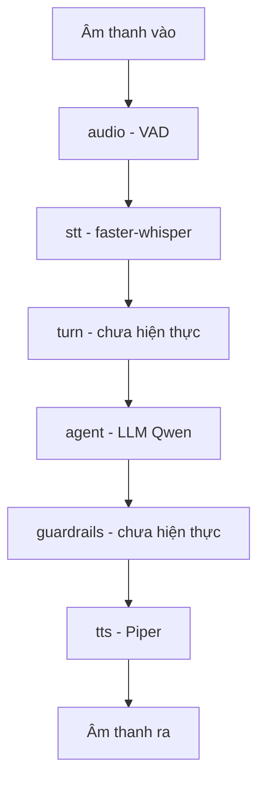

# 10.01 — Tổng kết kiến trúc code (as-built)

> Mô tả cách tổ chức **code** (khác `docs/01–09` là khảo sát). Trạng thái phản ánh
> đúng **hiện trạng đã chạy được trên DGX** (xem [`02_e2e_report.md`](02_e2e_report.md)).

## Glossary
- **Pipecat** — framework open-source điều phối voice-agent realtime theo *pipeline of frame processors*. Tự lo: ghép pipeline, transport audio, vòng barge-in, sự kiện turn, gom context cho tool-calling.
- **Frame** — đơn vị dữ liệu chảy trong pipeline (audio thô, text, sự kiện điều khiển).
- **FrameProcessor** — một mắt xích xử lý frame; ta kế thừa để cắm logic riêng.
- **Service** — FrameProcessor chuyên loại (`STTService`/`LLMService`/`TTSService`) = **slot ta thay model**.
- **Adapter** — code MỎNG của ta bọc một model/endpoint cho khớp interface Pipecat.

## 1. Triết lý: framework giữ khung, ta thay model
Pipecat **sở hữu phần điều phối** (pipeline, frame transport, barge-in, turn loop, context aggregator).
Ta **không viết lại** những thứ đó. `src/fci_voice/` = **adapter mỏng tại điểm swap** + **logic domain**.

> ⚠️ **Ranh giới:** Pipecat cho ta *cái slot*, không cho ta *chất lượng*. Hai điểm đau (tool-calling 62%, semantic-turn vi @8kHz) vẫn nằm **bên trong adapter của ta**. Phụ thuộc Pipecat qua `uv add`, **KHÔNG fork**.

## 2. Bố cục thư mục
```
fci_voice_agent/
├── docs/                     # 01–09 khảo sát · 10 triển khai (track này)
├── pyproject.toml            # uv, src-layout; base tối thiểu + extra exp02/exp03
├── src/fci_voice/            # CODE TÁI DÙNG — adapter mỏng + logic domain
│   ├── config.py             # đọc .env (no-secret)
│   ├── pipeline/             # ráp Pipeline + transport (build.py, mock.py)
│   ├── stt/                  # ↔ docs/04  faster_whisper_stt.py
│   ├── agent/                # ↔ docs/06  llm.py (transformers)
│   ├── tts/                  # piper_tts.py (+ placeholder)
│   ├── audio/ turn/ guardrails/   # ↔ docs/03 · 05 · 07 (chưa hiện thực)
├── experiments/NN_*/         # runbook + script + results mỗi lần chạy
└── notebooks/ data/
```

## 3. Ánh xạ `src/` ↔ `docs/` + trạng thái as-built
| Lớp tín hiệu | docs | src | Slot Pipecat | Trạng thái |
|---|---|---|---|---|
| Tiền xử lý audio | 03 | `audio/` | VAD analyzer | ⬜ chưa (VAD base Pipecat có sẵn) |
| Nhận dạng tiếng nói | 04 | `stt/` | `STTService` | ✅ faster-whisper EN (CPU) |
| Quản lý lượt lời | 05 | `turn/` | turn analyzer | ⬜ chưa (module turn base có sẵn) |
| Bộ não / tool-call | 06 | `agent/` | `LLMService` | ✅ Qwen2.5-1.5B (GPU GB10) |
| An toàn đầu ra | 07 | `guardrails/` | processor | ⬜ chưa |
| Sinh tiếng nói | — | `tts/` | `TTSService` | ✅ Piper EN (CPU) |

## 4. Ranh giới `src/` vs `experiments/`
- **`src/fci_voice/`** = tái dùng nhiều exp (adapter, build pipeline). Package cài được → exp `import fci_voice...`.
- **`experiments/NN_*/`** = một lần chạy: script + runbook + kết quả. Thấy code dùng lại → kéo lên `src/`.

## 5. Bản đồ chảy: vòng phản xạ nhanh vs nhận thức chậm

Nguyên tắc: module realtime nhạy (audio/VAD/turn) phải **gọn, ít context** = *vòng phản xạ nhanh*;
agent/tool/state/goal = *vòng nhận thức chậm*. Pipecat tách 2 vòng bằng frame + event.

## 6. Đồng bộ code local → DGX
- Phát triển ở local; **chạy trên DGX Spark** (arm64 GB10) qua `ssh dgx`.
- Sync = **rsync over ssh** (`experiments/01_pipecat_dgx_smoke/sync_to_dgx.sh`), KHÔNG git push, KHÔNG cần git trên DGX. Loại trừ `.git/ data/ **/results/ .venv/`.
- Trên DGX: `setup_dgx.sh` mỗi exp → `uv sync` (cache uv/HF chung ở `/srv/team-share`) → chạy.

## ✅ Tự kiểm nhanh
<details><summary>1. Vì sao không viết lại vòng barge-in?</summary>
Đó là plumbing Pipecat đã làm ổn định. Giá trị research nằm ở model trong slot (turn 8kHz vi, tool-calling), không phải khung điều phối.</details>
<details><summary>2. Code dùng chung 2 exp đặt đâu?</summary>
Kéo lên `src/fci_voice/`. `experiments/` chỉ giữ script + runbook + kết quả.</details>
<details><summary>3. Vì sao sync DGX bằng rsync chứ không git push?</summary>
Rule repo: không tự push. Rsync cho vòng dev nhanh, không đụng git remote; bản git chỉ cập nhật khi Kỳ yêu cầu.</details>
