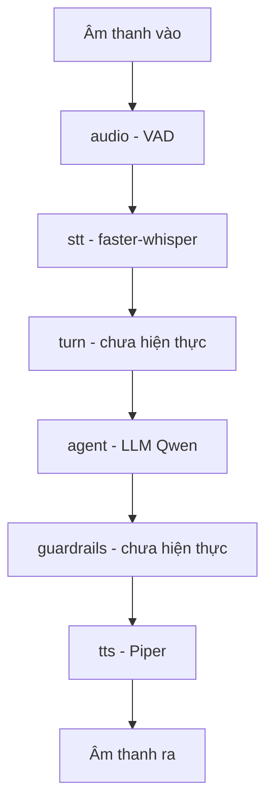

# 10.01 — Tổng Kết Kiến Trúc Code (As-built)

> [!NOTE]
> - Tài liệu này mô tả chi tiết cách thức tổ chức mã nguồn thực tế đang vận hành trên hạ tầng DGX,
> - **làm rõ ranh giới trách nhiệm** giữa framework điều phối và phần code adapter tự phát triển.
> - Tham chiếu chi tiết về báo cáo đo lường hiệu năng thực nghiệm xem tại [02_e2e_report.md](02_e2e_report.md),
> - và sơ đồ thiết kế hệ thống giả lập kiểm thử xem tại [docs/11_sim_test_system/01_design.md](../11_sim_test_system/01_design.md).

---

## 1. Dẫn dắt bối cảnh

- **Bối cảnh thực tế**:
  - Khi hiện thực hóa một hệ thống trợ lý giọng nói thời gian thực (voice agent),
  - việc thiết kế kiến trúc điều phối dữ liệu âm thanh và các tín hiệu trung gian đóng vai trò sống còn đến độ trễ tổng thể của hệ thống.
- **Nghịch lý đo lường**:
  - Việc tự xây dựng lại toàn bộ hạ tầng xử lý âm thanh thô thường gây lãng phí tài nguyên và dễ phát sinh lỗi ngắt lời (barge-in),
  - trong khi nếu phụ thuộc hoàn toàn vào các framework nguồn mở mà không thiết kế các lớp bọc (adapter) mỏng thì hệ thống sẽ thiếu linh hoạt khi thay đổi mô hình backend và gặp khó khăn trong việc kiểm soát chất lượng nghiệp vụ.

> Tài liệu này tổng hợp kiến trúc code thực tế chạy trên hạ tầng DGX,
> **xác định rõ ranh giới giữa framework điều phối Pipecat và các module nghiệp vụ**,
> giúp định hướng phát triển và tối ưu hóa hệ thống một cách khoa học.

---

## 2. Glossary

- `pipecat` -> **Pipecat Framework** ->
  - Framework mã nguồn mở điều phối các luồng xử lý voice-agent thời gian thực theo mô hình pipeline.
  - Tự động xử lý việc ghép nối đường ống, truyền tải âm thanh, quản lý ngắt lời (barge-in), nhận diện sự kiện lượt thoại, và gom ngữ cảnh cho tool-calling.
- `frame` -> **Frame** ->
  - Đơn vị truyền tải dữ liệu cơ bản trong pipeline,
  - có thể chứa âm thanh thô, văn bản, hoặc các tín hiệu điều khiển hệ thống.
- `frame processor` -> **FrameProcessor** ->
  - Một mắt xích xử lý dữ liệu trong pipeline,
  - cho phép kế thừa để triển khai các logic xử lý nghiệp vụ riêng biệt.
- `service` -> **Service** ->
  - Lớp FrameProcessor chuyên biệt phục vụ nhận diện giọng nói (STT), xử lý ngôn ngữ (LLM), hoặc tổng hợp giọng nói (TTS),
  - đóng vai trò là các slot có thể thay thế mô hình linh hoạt.
- `adapter` -> **Adapter** ->
  - Lớp mã nguồn mỏng tự phát triển để bọc các API hoặc endpoint của mô hình,
  - giúp chúng tương thích hoàn toàn với interface của Pipecat.

---

## 3. Triết lý thiết kế: Framework giữ khung, ta thay mô hình

- **Phần do Framework sở hữu**:
  - Pipecat chịu trách nhiệm quản lý toàn bộ hạ tầng điều phối luồng:
    - quản lý pipeline và vận chuyển frame dữ liệu qua các bộ xử lý,
    - xử lý logic ngắt lời (barge-in) và phát hiện lượt thoại (turn detection),
    - tổng hợp ngữ cảnh (context aggregation) để chuẩn bị cho việc gọi hàm.
  - Chúng ta kế thừa và sử dụng trực tiếp các tính năng này để tránh lãng phí công sức xây dựng lại hạ tầng cơ bản.
- **Phần do chúng ta phát triển (`src/fci_voice/`)**:
  - Tập trung xây dựng các adapter mỏng tại các điểm chuyển đổi mô hình (STT, LLM, TTS).
  - Triển khai logic nghiệp vụ và các thuật toán xử lý nghiệp vụ chuyên biệt của hệ thống FCI.
- **Ranh giới kỹ thuật**:
  - Pipecat chỉ cung cấp các vị trí cắm mô hình (slots), không đảm bảo chất lượng nghiệp vụ cuối cùng.
  - Hai điểm nghẽn lớn nhất của hệ thống:
    - chất lượng gọi hàm (tool-calling chỉ đạt ~62%),
    - và thuật toán nhận diện lượt lời thông minh (semantic turn-detection trên môi trường thoại 8kHz),
    - hoàn toàn nằm bên trong lớp adapter do chúng ta làm chủ.
  - Tương tác với Pipecat thông qua cơ chế quản lý thư viện của `uv`, tuyệt đối không thực hiện sao chép hoặc chỉnh sửa mã nguồn gốc (fork).

---

## 4. Bố cục cấu trúc thư mục dự án

- `docs/` -> Chứa toàn bộ tài liệu nghiên cứu khảo sát (01-09) và báo cáo triển khai thực tế (10-11).
- `pyproject.toml` -> Tập tin cấu hình quản lý môi trường ảo `uv`, khai báo các thư viện nền tảng và các gói bổ trợ phục vụ thực nghiệm.
- `src/fci_voice/` -> **Phân vùng mã nguồn tái sử dụng**:
  - `config.py` -> Đọc các cấu hình môi trường từ tệp tin `.env` (cam kết không lưu trữ khóa bảo mật).
  - `pipeline/` -> Lắp ráp các mắt xích pipeline và quản lý kết nối truyền dẫn.
  - `stt/` -> Triển khai adapter cho nhận diện tiếng nói (nhận tài liệu khảo sát từ `docs/04`).
  - `agent/` -> Triển khai adapter cho bộ não LLM và gọi hàm (nhận tài liệu khảo sát từ `docs/06`).
  - `tts/` -> Triển khai adapter cho tổng hợp tiếng nói (Piper TTS).
  - `audio/`, `turn/`, `guardrails/` -> Các phân vùng adapter chuẩn bị cho việc tích hợp (chưa hiện thực).
- `experiments/NN_*/` -> Chứa các kịch bản chạy thử nghiệm, runbook hướng dẫn và kết quả thô của từng lượt chạy.
- `notebooks/`, `data/` -> Chứa các tập tin phân tích dữ liệu và dữ liệu mẫu.

---

## 5. Ánh xạ chi tiết giữa Mã nguồn và Tài liệu khảo sát

- **Tiền xử lý âm thanh**:
  - Tài liệu khảo sát tương ứng: `docs/03`.
  - Thư mục mã nguồn: `audio/`.
  - Vị trí cắm trong Pipecat: VAD analyzer.
  - Trạng thái hiện tại: Chưa triển khai (đang tạm thời sử dụng module VAD mặc định của Pipecat).
- **Nhận dạng tiếng nói**:
  - Tài liệu khảo sát tương ứng: `docs/04`.
  - Thư mục mã nguồn: `stt/`.
  - Vị trí cắm trong Pipecat: `STTService`.
  - Trạng thái hiện tại: Đã tích hợp thành công mô hình faster-whisper phiên bản tiếng Anh (chạy trên CPU).
- **Quản lý lượt lời**:
  - Tài liệu khảo sát tương ứng: `docs/05`.
  - Thư mục mã nguồn: `turn/`.
  - Vị trí cắm trong Pipecat: Turn analyzer.
  - Trạng thái hiện tại: Chưa triển khai (đang tạm thời sử dụng module quản lý mặc định của Pipecat).
- **Bộ não LLM và Gọi hàm**:
  - Tài liệu khảo sát tương ứng: `docs/06`.
  - Thư mục mã nguồn: `agent/`.
  - Vị trí cắm trong Pipecat: `LLMService`.
  - Trạng thái hiện tại: Đã tích hợp thành công mô hình Qwen2.5-1.5B (chạy trên GPU native).
- **An toàn thông tin đầu ra**:
  - Tài liệu khảo sát tương ứng: `docs/07`.
  - Thư mục mã nguồn: `guardrails/`.
  - Vị trí cắm trong Pipecat: Custom FrameProcessor.
  - Trạng thái hiện tại: Chưa triển khai.
- **Tổng hợp tiếng nói**:
  - Tài liệu khảo sát tương ứng: Không áp dụng.
  - Thư mục mã nguồn: `tts/`.
  - Vị trí cắm trong Pipecat: `TTSService`.
  - Trạng thái hiện tại: Đã tích hợp thành công mô hình Piper phiên bản tiếng Anh (chạy trên CPU).

---

## 6. Phân vùng giữa Mã nguồn Tái sử dụng và Thực nghiệm

- **Thư mục `src/fci_voice/`**:
  - Chứa toàn bộ các đoạn mã có khả năng tái sử dụng cao qua nhiều lần thử nghiệm (như các adapter, logic khởi dựng pipeline).
  - Được đóng gói thành thư viện nội bộ để các kịch bản thực nghiệm import trực tiếp khi cần.
- **Thư mục `experiments/NN_*/`**:
  - Đóng vai trò là các runbook thực nghiệm độc lập:
    - chứa script kích hoạt kịch bản chạy cụ thể,
    - ghi nhận kết quả đầu ra và các chỉ số đo lường hiệu năng của lần chạy đó.
    - Quy tắc: khi một đoạn mã trong thực nghiệm chứng minh được giá trị và có nhu cầu dùng chung, lập trình viên phải chủ động đưa đoạn mã đó lên phân vùng `src/`.

---

## 7. Bản đồ luồng dữ liệu: Vòng phản xạ nhanh và Vòng nhận thức chậm

### 7.1 Sơ đồ dòng chảy dữ liệu âm thanh đầu cuối

- **Khung đọc sơ đồ**:
  - **Đề bài cần giải**:
    - Mô tả cách thức truyền dẫn dữ liệu âm thanh qua các module từ đầu vào đến đầu ra trong pipeline.
  - **Giả định nền**:
    - Hệ thống hoạt động theo cơ chế luồng frame liên tục,
    - hỗ trợ ngắt lời tức thời khi phát hiện tín hiệu người dùng.
  - **Ý nghĩa các khối**:
    - `IN`/`OUT`: Điểm tiếp nhận và phát tín hiệu âm thanh thô.
    - `VAD`/`TURN`: Các module xử lý tín hiệu và quản lý lượt thoại (Vòng phản xạ nhanh).
    - `STT`/`TTS`: Các bộ chuyển đổi giữa âm thanh và văn bản.
    - `AGENT`: Bộ não quyết định nội dung phản hồi và gọi hàm (Vòng nhận thức chậm).
    - `GUARD`: Chốt chặn an toàn thông tin đầu ra trước khi tổng hợp âm thanh.
  - **Cách đọc sơ đồ**:
    - Dữ liệu âm thanh chảy tuần tự qua các khối.
    - Các khối xử lý nhanh ở đầu chuỗi (VAD, TURN) hoạt động với ít ngữ cảnh để phản hồi tức thời.
    - Khối xử lý chậm (AGENT) đảm nhận logic nghiệp vụ phức tạp.
    - Pipecat thực hiện điều phối việc truyền tải frame và quản lý các sự kiện ngắt lời giữa hai vòng xử lý này.

---

## 8. Cơ chế đồng bộ mã nguồn lên hạ tầng DGX

- **Quy trình phát triển**:
  - Lập trình viên viết mã nguồn tại môi trường máy tính cá nhân (local).
  - Quá trình chạy thử nghiệm và kiểm thử hiệu năng được thực hiện trực tiếp trên máy chủ DGX Spark (hệ kiến trúc arm64 kết hợp GPU GB10).
- **Cơ chế đồng bộ dữ liệu (Sync)**:
  - Sử dụng công cụ `rsync` truyền tải dữ liệu trực tiếp qua kết nối bảo mật SSH,
  - tuyệt đối không sử dụng lệnh `git push` để đồng bộ mã nguồn sang DGX.
  - Các thư mục chứa thông tin nhạy cảm hoặc tệp tin rác sẽ bị loại trừ trong quá trình rsync:
    - loại trừ thư mục `.git/`, `data/`, các thư mục chứa kết quả thử nghiệm `**/results/`, và môi trường ảo `.venv/`.
- **Triển khai trên máy chủ DGX**:
  - Chạy script cấu hình môi trường ứng với mỗi thử nghiệm,
  - sử dụng `uv sync` để đồng bộ và khóa các thư viện phụ thuộc (tận dụng thư mục cache dùng chung tại `/srv/team-share` để tăng tốc độ cài đặt).

---

## ✅ Tự kiểm nhanh

1. Tại sao chúng ta không tự phát triển lại cơ chế ngắt lời (barge-in) mà sử dụng trực tiếp của Pipecat?

- **Tránh trùng lặp hạ tầng**:
  - Cơ chế ngắt lời và truyền tải frame là những thành phần hạ tầng (plumbing) đã được Pipecat xây dựng ổn định.
  - Trọng tâm nghiên cứu và giá trị cốt lõi của hệ thống nằm ở chất lượng mô hình trong các adapter (như xử lý lượt lời thông minh và gọi hàm nghiệp vụ),
  - không nằm ở việc xây dựng lại khung điều phối.

2. Quy trình xử lý khi phát hiện một đoạn mã trong thư mục experiments/ có thể tái sử dụng là gì?

- **Chuyển vùng mã nguồn**:
  - Lập trình viên phải tách đoạn mã đó ra khỏi kịch bản thực nghiệm,
  - cấu trúc lại thành module dùng chung và đưa lên thư mục `src/fci_voice/`,
  - đảm bảo các thư mục thực nghiệm khác có thể import một cách sạch sẽ.

3. Tại sao hệ thống sử dụng rsync thay vì git để đồng bộ mã nguồn sang máy chủ DGX?

- **Tuân thủ quy tắc quản trị**:
  - Tuân thủ quy tắc tối quan trọng: không tự ý push mã nguồn lên git remote khi chưa được yêu cầu.
  - Rsync giúp đẩy nhanh tốc độ thử nghiệm ở local-dev,
  - tránh làm rác lịch sử commit của repository bằng các thay đổi thử nghiệm nhỏ.

