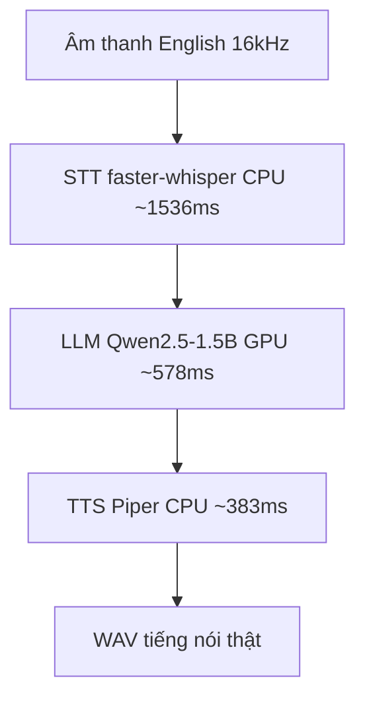

# 10.02 — Báo Cáo Thông Luồng End-to-End Trên DGX (exp01→04)

> [!NOTE]
> - Tài liệu này tổng kết kết quả của bốn thực nghiệm đầu tiên trên máy chủ hiệu năng cao DGX Spark,
> - **phân tích chi tiết các chỉ số độ trễ** và xác định điểm nghẽn hiệu năng của hệ thống.
> - Tham chiếu chi tiết về kiến trúc code as-built xem tại [01_architecture.md](01_architecture.md),
> - và thiết kế hệ thống giả lập kiểm thử xem tại [docs/11_sim_test_system/01_design.md](../11_sim_test_system/01_design.md).

---

## 1. Dẫn dắt bối cảnh

- **Bối cảnh thực tế**:
  - Khi hoàn thành giai đoạn tích hợp thử nghiệm cơ bản cho một trợ lý ảo giọng nói thời gian thực,
  - chúng ta cần tiến hành đo lường hiệu năng tổng thể trên hạ tầng thực tế để xác định chính xác các điểm nghẽn về độ trễ xử lý của từng cấu phần.
- **Nghịch lý đo lường**:
  - Việc báo cáo một chỉ số độ trễ gộp tuần tự duy nhất thường tạo ra cảm giác hệ thống quá chậm để đưa vào vận hành thực tế,
  - trong khi trong thực tế, nếu phân rã chi tiết luồng xử lý và áp dụng cơ chế truyền luồng (streaming) song song, độ trễ cảm nhận của người dùng sẽ giảm đi đáng kể mặc cho tổng thời gian xử lý tuần tự lớn.

> Báo cáo này tổng hợp kết quả đo lường từ bốn thử nghiệm thông luồng đầu tiên trên máy chủ DGX Spark,
> **phân tích chi tiết độ trễ của từng module xử lý**,
> giúp định hướng các kỹ thuật tối ưu hóa độ trễ thời gian thực cho giai đoạn tiếp theo.

---

## 2. Glossary

- `RTF` -> **Real-Time Factor** ->
  - Tỷ lệ giữa thời gian hệ thống xử lý tệp tin âm thanh chia cho thời lượng thực tế của tệp tin âm thanh đó.
  - Chỉ số RTF < 1 biểu thị hệ thống có tốc độ xử lý nhanh hơn thời gian thực tế của cuộc thoại.
- `TTFT` -> **Time-To-First-Token** ->
  - Khoảng thời gian tính từ khi nhận yêu cầu cho tới khi mô hình sinh ra token đầu tiên,
  - đây là chỉ số cốt lõi đánh giá độ trễ hội thoại thời gian thực của mô hình ngôn ngữ lớn (LLM).
- `WER` -> **Word Error Rate** ->
  - Tỷ lệ lỗi nhận diện chữ của mô hình nhận dạng tiếng nói (STT),
  - dùng để đánh giá chất lượng chuyển đổi từ âm thanh sang văn bản.

---

## 3. Môi trường thử nghiệm thực tế

- **Hạ tầng phần cứng và hệ điều hành**:
  - Máy chủ DGX Spark chạy hệ kiến trúc chip `aarch64`,
  - hệ điều hành Ubuntu Linux sử dụng nhân kernel v6.17 của NVIDIA,
  - trình quản lý gói Python v3.12.3 chạy qua công cụ `uv`.
  - Bộ xử lý đồ họa: sử dụng card đồ họa GPU **NVIDIA GB10**.
- **Cấu hình thư viện phục vụ**:
  - Sử dụng thư viện điều phối **Pipecat v1.4.0** cài đặt qua cơ chế đồng bộ `uv sync`.
  - Thư viện Deep Learning PyTorch v2.6 tích hợp CUDA 13.0 chạy trực tiếp trên GPU (`cuda/float16`).
  - Thư viện onnxruntime hoạt động ở chế độ CPU-only (sử dụng nhà cung cấp CPU Execution Provider, chưa hỗ trợ CUDA EP),
  - do đó các mô hình chạy qua ONNX như Silero VAD hoặc turn detector sẽ chạy hoàn toàn trên CPU.

---

## 4. Tổng kết bốn thực nghiệm thông luồng đầu tiên

- **Thử nghiệm exp01 (Smoke Test)**:
  - Mục tiêu: Kiểm thử khả năng khởi động và tương thích của engine Pipecat trên hệ kiến trúc arm64.
  - Kết quả đạt được: Import các thư viện thành công, khởi tạo pipeline chạy thử nghiệm luồng văn bản sạch, kiểm kê đầy đủ các thành phần.
- **Thử nghiệm exp02 (STT & WER)**:
  - Mục tiêu: Đánh giá chất lượng mô hình nhận dạng tiếng nói trên tập dữ liệu âm thanh tiếng Anh.
  - Kết quả đạt được: Chỉ số lỗi từ WER đạt 9.65% (ngưỡng cận trên), RTF đạt 0.175. Khép luồng chuyển đổi từ âm thanh sang văn bản qua Pipecat.
- **Thử nghiệm exp03 (Full Loop)**:
  - Mục tiêu: Khép kín toàn bộ vòng lặp hội thoại đa lượt.
  - Kết quả đạt được: Chạy thành công mô hình ngôn ngữ lớn trên GPU, hoàn thành cuộc hội thoại mô phỏng qua 3 lượt thoại liên tục và giữ nguyên ngữ cảnh.
- **Thử nghiệm exp04 (English Latency)**:
  - Mục tiêu: Đo lường chi tiết độ trễ từng bước của đường ống hội thoại tiếng Anh có âm thanh thật.
  - Kết quả đạt được: Tích hợp thành công mô hình tổng hợp giọng nói Piper TTS và ghi nhận dữ liệu độ trễ chi tiết của toàn bộ chuỗi xử lý.

---

## 5. Kiến trúc Đường ống Hội thoại Thực tế (exp04)

### 5.1 Sơ đồ tuần tự xử lý âm thanh

- **Khung đọc sơ đồ**:
  - **Đề bài cần giải**:
    - Mô tả luồng xử lý và phân bổ độ trễ thời gian của từng bước trong chuỗi hội thoại đầu cuối.
  - **Giả định nền**:
    - Thử nghiệm thực hiện trên môi trường tiếng Anh, tần số lấy mẫu 16kHz,
    - xử lý tuần tự toàn bộ câu (offline processing) với độ dài câu phản hồi tối đa là 64 token.
  - **Ý nghĩa các khối**:
    - `A`: Tín hiệu âm thanh đầu vào của người dùng.
    - `B`: Giai đoạn nhận diện giọng nói sử dụng mô hình faster-whisper chạy trên CPU.
    - `C`: Giai đoạn suy luận và sinh phản hồi sử dụng mô hình Qwen2.5-1.5B chạy trên GPU GB10.
    - `D`: Giai đoạn tổng hợp âm thanh phản hồi sử dụng mô hình Piper chạy trên CPU.
    - `E`: Tệp tin âm thanh đầu ra hoàn chỉnh.
  - **Cách đọc sơ đồ**:
    - Luồng dữ liệu chạy tuần tự từ `A` qua các khối xử lý để tạo ra `E`.
    - Độ trễ ghi nhận ở mỗi mũi tên là khoảng thời gian trung bình cần thiết để hoàn thành tác vụ tương ứng.

---

## 6. Phân tích chi tiết Chỉ số Độ trễ từng giai đoạn

- **Giai đoạn nhận dạng tiếng nói (STT base.en)**:
  - Thiết bị xử lý: CPU.
  - Độ trễ trung bình: **~1536 ms** (dao động thực tế từ 1396 ms đến 1619 ms).
  - Ghi chú: Thực hiện giải mã toàn bộ tệp tin âm thanh đầu vào có thời lượng từ 5 đến 12 giây sau khi người dùng kết thúc câu nói.
- **Giai đoạn xử lý ngôn ngữ (LLM Qwen2.5-1.5B)**:
  - Thiết bị xử lý: GPU GB10 (CUDA native).
  - Độ trễ trung bình: **~578 ms** (dao động thực tế từ 472 ms đến 657 ms).
  - Ghi chú: Đo lường thời gian để hoàn thành việc sinh chuỗi 64 token đầu ra.
- **Giai đoạn tổng hợp tiếng nói (TTS Piper)**:
  - Thiết bị xử lý: CPU.
  - Độ trễ trung bình: **~383 ms** (dao động thực tế từ 313 ms đến 440 ms).
  - Ghi chú: Chuyển đổi văn bản phản hồi thành âm thanh tiếng nói thật.
- **Tổng độ trễ xử lý tuần tự**:
  - Đo lường đầu cuối (từ lúc âm thanh vào đến lúc có âm thanh ra): **~2496 ms**.
  - Đo lường thông qua điều phối của Pipecat (chỉ tính chuỗi STT + LLM): **~1841 ms** (xác nhận framework hoạt động ổn định).

---

## 7. Phân biệt rõ Độ trễ Tuần tự và Độ trễ Thời gian thực

- **Bản chất của các chỉ số đo lường**:
  - Các số liệu đo lường ở mục §6 là thời gian xử lý ngoại tuyến (offline), tuần tự trên toàn bộ câu,
  - không phản ánh giới hạn hiệu năng của một hệ thống thoại thời gian thực thực tế.
- **Điểm nghẽn STT (~1536 ms)**:
  - Phát sinh do mô hình chờ người dùng nói xong mới tiến hành giải mã toàn bộ câu trên CPU.
  - Giải pháp tối ưu: chuyển sang cơ chế **STT streaming** để dịch song song khi người dùng đang nói, giúp triệt tiêu phần lớn độ trễ này khi câu thoại kết thúc.
- **Điểm nghẽn LLM (~578 ms)**:
  - Đo lường thời gian sinh ra toàn bộ câu (64 token).
  - Giải pháp tối ưu: chỉ cần đo chỉ số **TTFT** (trễ đến token đầu tiên) và truyền luồng token (token-streaming) trực tiếp sang TTS để phát âm thanh sớm.
- **Khả năng tối ưu tổng thể**:
  - Khi áp dụng cơ chế truyền luồng (streaming), xử lý gối đầu (overlap) và quản lý ngắt lời (barge-in),
  - độ trễ cảm nhận thực tế của người dùng sẽ giảm xuống dưới 1 giây,
  - khẳng định thiết kế hiện tại hoàn toàn có khả năng nâng cấp lên trải nghiệm thời gian thực.

---

## 8. Đánh giá mức độ hoàn thiện của hệ thống (Scorecard Maturity)

- **Mức độ hoàn thiện đã đạt được (Pass)**:
  - Tích hợp thành công engine Pipecat trên kiến trúc arm64 kết hợp GPU GB10.
  - Vận hành thành công mô hình STT (faster-whisper) tiếng Anh trên CPU với WER đạt 9.65%.
  - Vận hành thành công mô hình LLM (Qwen2.5-1.5B) chạy trên GPU GB10.
  - Đảm bảo duy trì ngữ cảnh hội thoại đa lượt (đã kiểm thử thành công bằng tiếng Việt).
  - Vận hành thành công mô hình TTS (Piper) sinh tiếng nói thật bằng tiếng Anh.
  - Hoàn thành khép kín đường ống đầu cuối qua điều phối của Pipecat.
- **Các hạng mục chưa hoàn thiện hoặc cần cải thiện**:
  - Các bộ phát hiện hoạt động âm thanh (VAD) và quản lý lượt lời (turn) mới chỉ dùng mặc định, chưa được tinh chỉnh cấu hình hay đo lường chất lượng.
  - Chưa tích hợp module an toàn đầu ra (guardrails) và gọi hàm nghiệp vụ (tool-calling).
  - Hệ thống mới chỉ chạy trên tiếng Anh tần số lấy mẫu 16kHz, chưa hỗ trợ tiếng Việt và môi trường thoại 8kHz (telephony).
  - Chưa triển khai tối ưu hóa truyền luồng thời gian thực để giảm độ trễ cảm nhận.

---

## 9. Định hướng kế hoạch phát triển tiếp theo

- **Trục tối ưu hóa độ trễ thời gian thực**:
  - Triển khai cơ chế STT streaming để loại bỏ điểm nghẽn giải mã câu.
  - Chuyển đổi LLM sang các serving engine chuyên dụng như vLLM hoặc SGLang để khai thác truyền luồng token và giảm TTFT.
  - Hiện thực hóa cơ chế quản lý ngắt lời và phát hiện lượt lời thông minh trong môi trường thoại.
- **Trục nghiệp vụ FCI**:
  - Tích hợp mô hình STT tiếng Việt hỗ trợ xử lý tín hiệu thoại tần số lấy mẫu 8kHz.
  - Áp dụng thuật toán Smart Turn v3 chuyên biệt cho tiếng Việt.
  - Tích hợp mô hình tổng hợp tiếng nói (TTS) tiếng Việt.
- **Trục chất lượng Agent**:
  - Đo lường và phân loại chi tiết các lỗi gọi hàm nghiệp vụ (tool-calling).
  - Triển khai chốt chặn an toàn thông tin đầu ra (guardrails).

---

## ✅ Tự kiểm nhanh

1. Tại sao con số độ trễ STT ~1536 ms trong báo cáo không phải là giới hạn của hệ thống thoại thời gian thực?

- **Cơ chế xử lý tuần tự**:
  - Con số này phản ánh thời gian mô hình giải mã toàn bộ tệp tin âm thanh dài từ 5 đến 12 giây sau khi người dùng dừng nói.
  - Trong hệ thống thời gian thực, cơ chế STT streaming sẽ giải mã song song trong khi người dùng đang nói,
  - giúp giảm trễ cảm nhận xuống chỉ còn khoảng thời gian giải mã của vài token cuối cùng.

2. Thực nghiệm exp04 đã chứng minh được những cấu phần nào hoạt động ổn định?

- **Thông luồng hệ thống**:
  - Chứng minh toàn bộ đường ống đầu cuối (nhận âm thanh -> chuyển văn bản -> LLM xử lý trên GPU -> tổng hợp âm thanh tiếng nói thật) đã chạy thông suốt,
  - hoạt động ổn định trên cả môi trường tuần tự thuần túy và môi trường điều phối của framework Pipecat trên hạ tầng DGX Spark.

3. Những hạng mục quan trọng nào liên quan đến nghiệp vụ CSKH tiếng Việt vẫn chưa được triển khai?

- **Hạng mục tiếng Việt và Telephony**:
  - Mô hình STT tiếng Việt hỗ trợ tần số lấy mẫu 8kHz cho telephony.
  - Thuật toán phát hiện lượt lời thông minh Smart Turn v3.
  - Mô hình TTS tiếng Việt sinh giọng nói tự nhiên.
  - Module gọi hàm nghiệp vụ và chốt chặn an toàn thông tin đầu ra.

