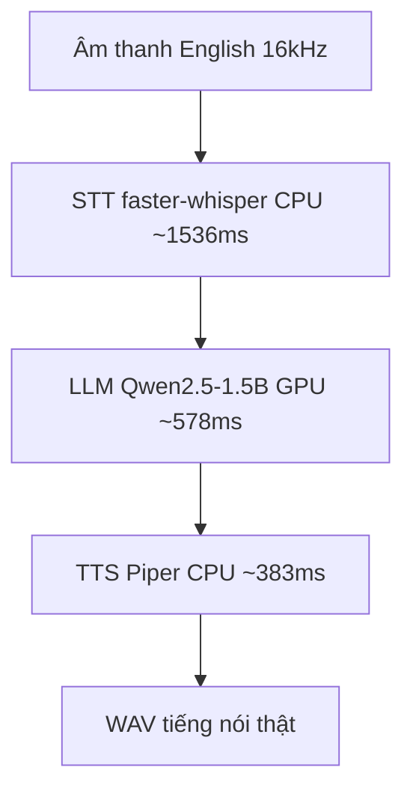

# 10.02 — Report thông luồng end-to-end trên DGX (exp01→04)

> Tổng kết 4 thực nghiệm đầu tiên: từ "engine chạy được" → "full loop English có tiếng thật + latency".
> Tất cả **đã chạy thật** trên DGX Spark (arm64 GB10), 2026-06-26. Chi tiết runbook ở `experiments/NN_*/`.

## Glossary
- **RTF** (real-time factor) — thời-gian-xử-lý ÷ thời-lượng-audio. <1 = nhanh hơn thời gian thực.
- **TTFT** — time-to-first-token, độ trễ tới token đầu của LLM (chỉ số realtime quan trọng).
- **WER** — word error rate, tỉ lệ lỗi từ của STT.

## 1. Môi trường (đo được)
- DGX Spark `aarch64`, kernel 6.17 nvidia, Python 3.12.3, `uv`. GPU = **NVIDIA GB10**.
- **Pipecat 1.4.0** cài qua `uv sync` + chạy OK trên arm64.
- **torch cu130** chạy **GPU native** (`cuda/float16`). **onnxruntime = CPU-only** (providers `Azure, CPU` — KHÔNG có CUDA EP) → VAD/turn ONNX chạy CPU (hợp model nhỏ).
- Base Pipecat đã kéo sẵn **Silero VAD + module turn + onnxruntime**.

## 2. Bốn thực nghiệm
| exp | Mục tiêu | Kết quả |
|---|---|---|
| **01** smoke | engine Pipecat chạy nổi arm64? | ✅ L0 import + L1 pipeline text chảy sạch; kiểm kê thành phần |
| **02** STT+WER | STT thật trên audio English | ✅ WER 9,65% (cận trên), RTF 0,175; audio→text qua Pipecat ✅ |
| **03** full loop | khép vòng + hội thoại | ✅ LLM GPU + hội thoại vi 3 lượt giữ ngữ cảnh; full chain qua Pipecat ✅ |
| **04** English latency | full loop English + tiếng thật + latency | ✅ TTS Piper thật; latency từng step (mục 4) |

## 3. Pipeline full loop (as-run, exp04)

Ví dụ 1 lượt: audio → STT `"Mr. Quilter is the apostle of the middle classes..."` → LLM
`"The passage expresses gratitude for Mr. Quilter's appeal to middle-class values."` → Piper → `reply_0.wav`.

## 4. Latency từng step (trung bình 3 case, LLM warmup, max 64 token)
| Step | Thiết bị | Latency TB | Per-case | Ghi chú |
|---|---|---:|---|---|
| STT base.en | CPU | **~1536 ms** | 1396–1619 | transcribe nguyên clip 5–12s |
| LLM Qwen2.5-1.5B | **GPU GB10** | **~578 ms** | 472–657 | sinh 64 token |
| TTS Piper en_US-lessac | CPU | **~383 ms** | 313–440 | sinh tiếng thật |
| **Tổng tuần tự** | | **~2496 ms** | | audio vào → audio ra |
| Qua Pipecat (STT+LLM) | | ~1841 ms | | xác nhận orchestration |

## 5. ⚠️ Đọc latency cho đúng (không nhầm với realtime)
Các số trên là **offline, tuần tự, xử lý CẢ câu** — KHÔNG phải latency telephony realtime:
- **STT ~1536ms** = transcribe toàn clip **sau khi nói xong**, trên **CPU** → đang là **bottleneck**.
  Kiến trúc realtime dùng **STT streaming** (chạy lúc đang nói) → trễ cảm nhận chỉ là phần đuôi, thấp hơn nhiều.
- **LLM ~578ms/64 token** = sinh hết câu; realtime tính theo **TTFT** + **token-streaming** sang TTS → bắt đầu nói sớm hơn.
- **TTS ~383ms** Piper CPU đã nhanh; cũng stream được theo câu.
- Cộng tuần tự ~2,5s, nhưng **streaming + overlap + barge-in** sẽ giảm mạnh — đó là việc tối ưu trục realtime, không phải giới hạn của khung.

## 6. Scorecard maturity
| Hạng mục | Trạng thái |
|---|---|
| Engine Pipecat (arm64 GB10) | ✅ |
| STT (faster-whisper base.en, CPU) | ✅ thật, WER 9,65% (cận trên) |
| LLM (Qwen2.5-1.5B, GPU GB10) | ✅ thật |
| Hội thoại đa lượt giữ ngữ cảnh | ✅ (đã thử tiếng Việt) |
| TTS (Piper, tiếng thật) | ✅ English |
| Full loop end-to-end (tuần tự + Pipecat) | ✅ |
| VAD / turn | 🟡 có sẵn trong base, chưa cắm/đo |
| Guardrails · tool-calling | ⬜ chưa |
| **Tiếng Việt STT · telephony 8kHz** | ⬜ chưa (mới English 16kHz) |
| Latency realtime (streaming/TTFT) | ⬜ chưa tối ưu |

## 7. Việc còn lại (ưu tiên theo trục)
- **Realtime:** STT streaming (vá bottleneck 1536ms) · LLM token-streaming/serving (vLLM-SGLang) · barge-in/turn thật.
- **Domain FCI:** STT tiếng Việt + resample 8kHz · Smart Turn v3 vi · TTS tiếng Việt.
- **Chất lượng agent:** tool-calling (đo phân tách lỗi trước) · guardrails.

## ✅ Tự kiểm nhanh

1. Vì sao latency STT ~1536ms KHÔNG phải con số realtime?

Đó là transcribe TOÀN BỘ clip 5–12s SAU khi người nói xong, trên CPU. Realtime dùng STT streaming chạy song song lúc đang nói, nên độ trễ cảm nhận chỉ là phần đuôi — thấp hơn nhiều.

2. Report này chứng minh điều gì là chắc chắn?

Khung voice-agent English chạy thông suốt cả vòng (audio → STT → LLM-GPU → TTS-tiếng-thật → WAV) trên DGX GB10, cả tuần tự lẫn qua orchestration Pipecat. Đây là mốc "thông luồng được", chưa phải "tối ưu realtime".

3. Còn gì đang mock/chưa làm?

VAD/turn mới có sẵn trong base chưa cắm/đo; guardrails + tool-calling chưa làm; STT tiếng Việt + telephony 8kHz chưa; latency realtime (streaming/TTFT) chưa tối ưu.

