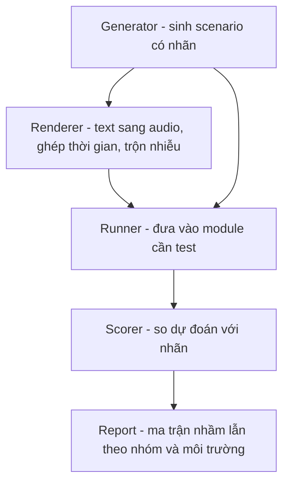

# 11.01 — Thiết Kế Hệ Thống Giả Lập Sinh Hội Thoại Để Test Module (Plan)

> [!NOTE]
> - Tài liệu thiết kế hệ thống giả lập hội thoại tự động (Simulation system) hiện đang ở trạng thái PLAN / Khảo sát,
> - **tập trung giải quyết bài toán khoảng cách sim-to-real** và rào cản tiếp cận dữ liệu thật.
> - Tham chiếu chi tiết về cấu trúc gym-env và bot-agent xem tại [02_gym_env_and_roles.md](02_gym_env_and_roles.md),
> - và cơ chế chấm điểm gọi hàm ba tầng xem tại [docs/06_llm_agent/03_tool_calling_stages.md](../06_llm_agent/03_tool_calling_stages.md).

---

## 1. Dẫn dắt bối cảnh

- **Bối cảnh thực tế**:
  - Khi phát triển các trợ lý ảo giọng nói CSKH hiệu năng cao,
  - việc đánh giá chất lượng của các module nhạy cảm (như phát hiện ngắt lời và gọi hàm nghiệp vụ) phụ thuộc rất nhiều vào dữ liệu cuộc gọi thực tế từ khách hàng.
- **Nghịch lý đo lường**:
  - Việc tiếp cận nguồn dữ liệu cuộc gọi thực tế tại các doanh nghiệp lớn thường vấp phải các quy trình phê duyệt hành chính phức tạp làm trì hoãn tốc độ thử nghiệm,
  - trong khi nếu chỉ dựa vào quy trình kiểm thử thủ công qua file Excel thì không thể bao phủ hết các tình huống nhiễu môi trường, tốn nhiều nhân lực và có nguy cơ bias dữ liệu cao.

> Tài liệu này thiết kế một hệ thống giả lập hội thoại tự động,
> **giải quyết bài toán khoảng cách từ giả lập sang thực tế (sim-to-real)**,
> giúp đội ngũ phát triển tối ưu hóa mô hình độc lập với các nút thắt dữ liệu thực tế.

---

## 2. Glossary

- `Scenario` -> **Scenario** ->
  - Một ca kiểm thử hoàn chỉnh bao gồm nhãn chuẩn (ground-truth),
  - và đầy đủ thông tin ngữ cảnh đầu vào để chạy module cần kiểm thử.
- `Generator` -> **Generator** ->
  - Thành phần tự động sinh các Scenario từ danh mục mẫu cấu hình,
  - sử dụng mô hình ngôn ngữ lớn để đa dạng hóa diễn đạt bề mặt mà không làm thay đổi nhãn chuẩn.
- `Renderer` -> **Renderer** ->
  - Thành phần chuyển đổi kịch bản văn bản thành dữ liệu âm thanh tương ứng (áp dụng cho module turn-detection),
  - hỗ trợ ghép nối thời gian thoại, trộn nhiễu môi trường và chuyển đổi tần số lấy mẫu.
- `Runner` -> **Runner** ->
  - Thành phần nạp các dữ liệu từ Scenario vào module cần kiểm thử,
  - thu thập và ghi nhận kết quả dự đoán của mô hình.
- `Scorer` -> **Scorer** ->
  - Thành phần so khớp các kết quả dự đoán từ Runner với nhãn chuẩn,
  - thực hiện tính toán ma trận nhầm lẫn và xuất báo cáo chỉ số hiệu năng tương tự báo cáo Excel.
- `barge-in` -> **Barge-in** ->
  - Hành vi người dùng chủ động ngắt lời khi trợ lý ảo đang nói,
  - phân biệt với **Backchannel** là các âm đệm ngắn ("dạ/vâng/ok") không mang ý định ngắt lời.

---

## 3. Phân tích Quy trình Kiểm thử Thủ công (Excel)

- **Môi trường và kịch bản kiểm thử**:
  - Quy trình hiện tại sử dụng file `data/Testcase_Ngắt lời.xlsx` để đánh giá module turn-detection trên luồng nghiệp vụ "khóa thẻ" với 2 môi trường.
- **Phân loại kịch bản (Taxonomy)**:
  - **Môi trường yên tĩnh**:
    - Nhóm N1 (Người dùng thực sự muốn ngắt lời như dùng từ khóa dừng, trả lời sớm, sửa thông tin, hỏi ngược) -> Nhãn mong muốn: **INTERRUPT**.
    - Nhóm N2 (Âm đệm ngắn - backchannel như "ừ/dạ/vâng/ok") -> Nhãn mong muốn: **HOLD**.
    - Nhóm N3 (Người dùng nói chuyện với người bên cạnh - side conversation) -> Nhãn mong muốn: **HOLD**.
    - Nhóm N4 (Nói vấp rồi dừng ngay - false start) -> Nhãn mong muốn: **HOLD** (có thể đi kèm thời gian timeout).
    - Nhóm N5 (Nói đè hoàn toàn lên câu thoại của agent) -> Nhãn mong muốn: **INTERRUPT**.
    - Nhóm N6 (Sử dụng chính xác từ khóa yêu cầu dừng) -> Nhãn mong muốn: **INTERRUPT**.
  - **Môi trường ồn**:
    - Nhóm N1 (Nhiễu môi trường từ nhạc/TV/karaoke) -> Nhãn mong muốn: **INTERRUPT** nếu người dùng thực sự nói, và **HOLD** nếu chỉ có tiếng nhạc hoặc tiếng ASR nhận diện nhầm lời nhạc.
    - Nhóm N2 (Nhiều người nói chồng chéo - cross-talk) -> Nhãn mong muốn: **HOLD** (chỉ cho phép **INTERRUPT** khi đúng giọng của người dùng mục tiêu).
- **Cơ chế ghi nhận lỗi**:
  - Ghi nhận các lỗi bỏ sót ngắt lời (False Negative - FN) và lỗi ngắt lời nhầm (False Positive - FP) do nhiễu hoặc thiết bị.
- **Hạn chế của phương pháp thủ công**:
  - Chi phí nhân sự cao, không có khả năng lặp lại một cách nhất quán, và số liệu đánh giá phụ thuộc nhiều vào cảm quan của kiểm thử viên.

---

## 4. Mô hình cấu trúc Scenario cho hai Module

- **Module Phát hiện lượt thoại (Turn-detection)**:
  - Yêu cầu dữ liệu: Tệp tin âm thanh và mốc thời gian chi tiết.
  - Cấu trúc Scenario:
    - ID và phân loại kịch bản (category).
    - Môi trường kiểm thử (yên tĩnh hoặc ồn).
    - Ngữ cảnh câu thoại hiện tại của agent (agent_context).
    - Danh sách các sự kiện thoại bao gồm người nói (người dùng mục tiêu hoặc người khác), nội dung văn bản, và mốc thời gian bắt đầu nói (t_start_s).
    - Cấu hình nhiễu môi trường (loại nhiễu và tỷ lệ SNR).
    - Nhãn mong muốn cuối cùng (**INTERRUPT** hoặc **HOLD**).
- **Module Gọi hàm nghiệp vụ (Tool-calling)**:
  - Yêu cầu dữ liệu: Dữ liệu văn bản thô.
  - Cấu trúc Scenario:
    - ID và phân loại kịch bản (category).
    - Lịch sử cuộc hội thoại trước đó (history).
    - Danh sách định nghĩa schema của các công cụ có sẵn (tools).
    - Lượt thoại hiện tại của người dùng (user_turn).
    - Nhãn mong muốn bao gồm cờ hiệu quyết định gọi hàm (call) và tên hàm cùng các tham số tương ứng (expected).

---

## 5. Đường ống Xử lý Dữ liệu Giả lập

### 5.1 Sơ đồ tuần tự từ sinh kịch bản đến chấm điểm

- **Khung đọc sơ đồ**:
  - **Đề bài cần giải**:
    - Mô tả quy trình tự động hóa hoàn chỉnh từ khâu khởi tạo dữ liệu giả lập đến khâu xuất báo cáo chất lượng mô hình.
  - **Giả định nền**:
    - Hệ thống hỗ trợ cả chế độ kiểm thử văn bản (text mode) và âm thanh (audio mode).
  - **Ý nghĩa các khối**:
    - `GEN`: Bộ sinh kịch bản hội thoại đi kèm nhãn chuẩn xác định trước từ mẫu cấu hình.
    - `REN`: Bộ chuyển đổi văn bản sang âm thanh, đồng bộ thời gian thoại và trộn nhiễu môi trường.
    - `RUN`: Bộ nạp dữ liệu và kích hoạt chạy thử nghiệm trên các module đích.
    - `SCORE`: Bộ chấm điểm so sánh đầu ra của Runner với nhãn ground-truth của Generator.
    - `REP`: Báo cáo kết quả ma trận nhầm lẫn chi tiết theo từng nhóm kịch bản và môi trường.
  - **Cách đọc sơ đồ**:
    - Luồng dữ liệu đi tuần tự từ trái qua phải.
    - `GEN` cung cấp thông tin cho cả `REN` (đối với âm thanh) và trực tiếp cho `RUN` (đối với văn bản).
    - Kết quả từ `RUN` và nhãn chuẩn từ `GEN` được hội tụ tại `SCORE` để kết xuất báo cáo `REP`.

---

## 6. Bài toán Khoảng cách Giả lập - Thực tế (Sim-to-Real)

- **Bản chất thách thức**:
  - Lệch phân phối dữ liệu (reality gap) giữa môi trường giả lập sạch và môi trường mạng điện thoại telephony thật 8kHz dễ dẫn đến việc các kết luận tối ưu trên giả lập không còn đúng khi triển khai thực tế.
- **Phương án giải quyết (Ba câu hỏi sống còn)**:
  - **Dự báo thứ hạng (Rank correlation)**:
    - Đảm bảo hệ thống giả lập phản ánh đúng xu hướng cải thiện: nếu cấu hình A tốt hơn B trên giả lập thì A cũng phải tốt hơn B trên thực tế.
    - Đo lường thông qua hệ số tương quan Spearman (SRCC).
  - **Bao phủ các failure modes**:
    - Giả lập phải tái hiện được các lỗi vật lý thực tế như lỗi ASR nghe nhầm từ khóa do chất lượng âm thanh 8kHz kém bằng cách chủ động bơm lỗi (error-injection).
  - **Cơ chế neo thực tế (Telephony calibration)**:
    - Sử dụng một tập nhỏ dữ liệu cuộc gọi thực tế đã ẩn danh để làm thước đo hiệu chuẩn hệ thống giả lập và domain randomization.
- **Các cấp độ mô phỏng âm thanh (Fidelity scale)**:
  - **Cấp độ v1 (Clean)**: Âm thanh tổng hợp sạch ở tần số lấy mẫu 16kHz phục vụ kiểm thử logic xử lý.
  - **Cấp độ v2 (Noise)**: Trộn thêm các loại nhiễu môi trường ở các tỷ lệ SNR khác nhau.
  - **Cấp độ v3 (Telephony)**: Hạ tần số lấy mẫu xuống 8kHz μ-law kết hợp cơ chế chủ động bơm lỗi nhận dạng (ASR error confusion).

---

## 7. Chiến lược Quản trị Dữ liệu tại Doanh nghiệp

- **Nút thắt tốc độ phát triển**:
  - Việc xin quyền truy cập và kiểm duyệt dữ liệu cuộc gọi thực tế tại các tổ chức tài chính thường tốn rất nhiều thời gian, làm chậm tốc độ cải tiến mô hình.
  - Các mẫu dữ liệu thu thập được thường bị bias nặng và không phản ánh đúng phân phối lỗi thực tế.
- **Giá trị của hệ thống giả lập**:
  - Giúp đội ngũ phát triển hoạt động độc lập, thử nghiệm nhanh chóng mà không phụ thuộc vào quy trình xin dữ liệu.
  - Tuy nhiên, cần lưu ý rủi ro kép: sai lệch của giả lập (sim-bias) và sai lệch của mẫu thực tế thu thập được (real-sample-bias).
- **Phương án khắc phục**:
  - Sử dụng các tập dữ liệu thoại 8kHz tiếng Anh công khai (như Switchboard, Fisher) làm proxy thử nghiệm cho các hành vi hội thoại tự nhiên (như nói đè, đệm từ).
  - Sử dụng các tập nhiễu tiêu chuẩn (MUSAN, DEMAND).
  - Tiết kiệm dữ liệu thực tế: chỉ sử dụng dữ liệu thực tế lấy được làm tập đối chiếu (validation set) để tính toán độ tương quan của hệ thống giả lập, tuyệt đối không dùng để huấn luyện.

---

## 8. Kế hoạch Triển khai Hệ thống

- **Giai đoạn 1 — Kiểm thử module Gọi hàm (Tool-calling)**:
  - Triển khai kịch bản dạng văn bản trước để hoàn thiện và kiểm chứng bộ Generator và Scorer với chi phí vận hành thấp.
- **Giai đoạn 2 — Kiểm thử module Phát hiện lượt thoại (Turn-detection)**:
  - Xây dựng bộ Renderer hỗ trợ các cấp độ mô phỏng từ v1 đến v3.
  - Tập trung xử lý các ca kiểm thử âm đệm (backchannel) trước khi nâng cấp lên xử lý tiếng ồn và cross-talk phức tạp.
- **Nguyên tắc quyết định**:
  - Chỉ bắt tay vào viết mã nguồn sau khi đã xác định rõ phương án neo thực tế và đo lường hệ số tương quan sim-to-real,
  - tránh xây dựng một hệ thống giả lập không có độ tin cậy thực tế.

---

## ✅ Tự kiểm nhanh

1. Tại sao Generator không được phép sử dụng LLM để tự quyết định nhãn của Scenario?

- **Đảm bảo tính chính xác của nhãn**:
  - Nhãn chuẩn (ground-truth) phải được xác định cứng từ các template cấu hình.
  - LLM chỉ được dùng để đa dạng hóa cách diễn đạt bề mặt của câu thoại.
  - Việc để LLM tự quyết định nhãn sẽ đưa thêm nhiễu và sai sót vào tập dữ liệu kiểm thử.

2. Bài toán sim-to-real trong hệ thống giả lập âm thanh thoại được xử lý qua những cấp độ nào?

- **Thang phân cấp Fidelity**:
  - Cấp độ v1: Âm thanh sạch 16kHz để kiểm tra logic.
  - Cấp độ v2: Bổ sung thêm nhiễu môi trường tiêu chuẩn.
  - Cấp độ v3: Hạ tần số xuống 8kHz μ-law và chủ động bơm lỗi nhận dạng chữ (ASR) để giả lập lỗi mạng điện thoại telephony thực tế.

3. Làm thế nào để giải quyết nút thắt về thời gian xin phê duyệt dữ liệu cuộc gọi thực tế từ ngân hàng?

- **Sử dụng dữ liệu thay thế và hiệu chuẩn**:
  - Xây dựng hệ thống giả lập độc lập sử dụng các tập dữ liệu thoại và nhiễu công khai làm proxy.
  - Khi xin được dữ liệu thật, chỉ dùng chúng làm tập đối chiếu nhỏ để tính toán độ tương quan và hiệu chuẩn hệ sinh,
  - giúp tối ưu hóa vòng lặp phát triển mà không bị phụ thuộc vào tiến độ phê duyệt hành chính.

