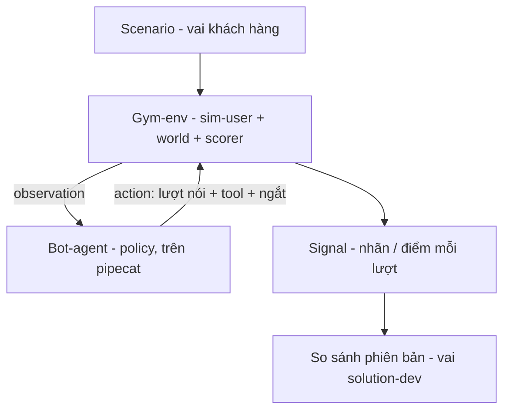
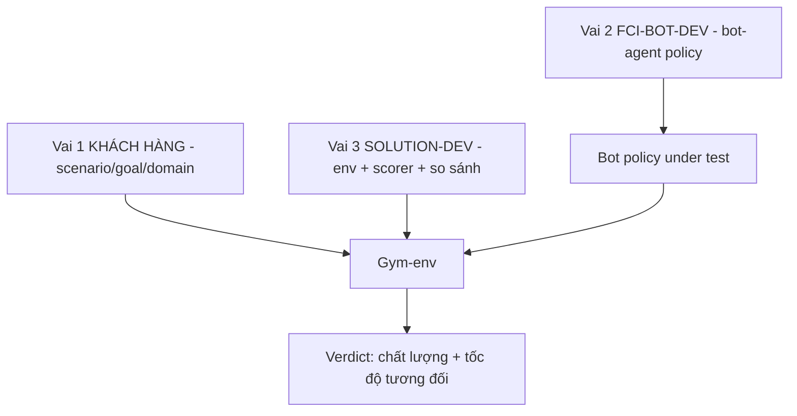

# 11.02 — Gym-env, Bot-agent, và Mô Hình 3 Vai (Thiết Kế Chi Tiết)

> [!NOTE]
> - Tài liệu này mô tả chi tiết kiến trúc đóng gói hệ thống giả lập hội thoại thành một môi trường tiêu chuẩn Gym-env,
> - **thiết lập ranh giới trách nhiệm rõ ràng** giữa các thành phần môi trường và mô hình kiểm thử.
> - Tham chiếu chi tiết về bản thiết kế tổng thể hệ thống giả lập xem tại [01_design.md](01_design.md),
> - và cơ chế chấm điểm gọi hàm nghiệp vụ ba tầng xem tại [docs/06_llm_agent/03_tool_calling_stages.md](../06_llm_agent/03_tool_calling_stages.md).

---

## 1. Dẫn dắt bối cảnh

- **Bối cảnh thực tế**:
  - Khi đánh giá hiệu năng của các phiên bản trợ lý ảo giọng nói khác nhau trong quá trình phát triển,
  - việc không thống nhất được môi trường kiểm thử và các tham số nhiễu thường dẫn đến sự sai lệch lớn về kết quả đo lường chất lượng và tốc độ phản hồi.
- **Nghịch lý đo lường**:
  - Việc tích hợp trực tiếp mã nguồn của mô hình vào bộ khung chấm điểm làm cho hệ thống trở nên cồng kềnh, khó thay thế phiên bản và khó thực hiện so sánh song song (paired A/B testing) một cách sạch sẽ,
  - trong khi nếu không thiết kế các interface chuẩn hóa thì nỗ lực xây dựng bộ kiểm thử sẽ bị lãng phí khi hệ thống runtime thay đổi công nghệ.

> Tài liệu này thiết kế chi tiết mô hình Gym-env để phân tách rõ ràng giữa môi trường giả lập và mô hình kiểm thử,
> **định nghĩa mô hình 3 vai trò độc lập**,
> giúp khép kín quy trình đánh giá tự động và so sánh các phiên bản bot một cách công bằng.

---

## 2. Glossary

- `gym-env` -> **Gym Environment** ->
  - Thành phần quản lý trạng thái thế giới mô phỏng, mô phỏng hành vi người dùng (sim-user) và thực hiện chấm điểm đầu ra.
  - Lộ ra hai hàm chuẩn hóa `reset()` và `step()` mà không cần biết cấu trúc nội tại của mô hình đang kiểm thử.
- `policy` -> **Bot Agent Policy** ->
  - Module xử lý hội thoại cần được đánh giá chất lượng,
  - nhận thông tin quan sát (observation) từ môi trường và đưa ra hành động phản hồi (action).
- `episode` -> **Episode** ->
  - Một lượt hội thoại hoàn chỉnh tính từ khi bắt đầu (reset) cho đến khi cuộc gọi kết thúc,
  - kết thúc khi đạt mục tiêu, hết số lượt thoại cho phép, hoặc người dùng cúp máy.
- `sim-user` -> **Simulated User** ->
  - Cấu phần bên trong Gym-env chịu trách nhiệm sinh lượt thoại kế tiếp của người dùng dựa trên kịch bản nghiệp vụ,
  - và chèn các sự kiện thoại (ngắt lời, tiếng ồn) vào luồng âm thanh.
- `role` -> **Role** ->
  - Ba vai trò sở hữu các thành phần khác nhau của hệ thống kiểm thử:
  - vai Khách hàng, vai FCI-bot-dev, và vai Solution-dev.

---

## 3. Lý do đóng gói hệ thống dưới dạng Gym-env

- **Phân tách hoàn toàn Policy và Environment**:
  - Giữ nguyên toàn bộ cấu hình môi trường (cùng scenario, cùng seed tạo số ngẫu nhiên) và chỉ thực hiện thay đổi phiên bản bot.
  - Hỗ trợ so sánh trực tiếp, loại bỏ nhiễu từ các yếu tố môi trường (paired comparison).
  - Đóng vai trò là cỗ máy đánh giá chất lượng và tốc độ tương đối giữa các phiên bản.
- **Rủi ro nếu không phân tách**:
  - Logic chấm điểm bị trộn lẫn vào mã nguồn của bot,
  - dẫn đến việc mỗi lần thay đổi mô hình phải sửa đổi mã nguồn ở nhiều nơi, gây sai lệch số liệu đo lường.

---

## 4. Quy trình vận hành của Gym-env (Sim-user)

### 4.1 Sơ đồ tương tác luồng dữ liệu của Gym-env

- **Khung đọc sơ đồ**:
  - **Đề bài cần giải**:
    - Mô tả luồng dữ liệu và sự tương tác giữa môi trường giả lập (Gym-env) và mô hình đang được kiểm thử (Bot-agent).
  - **Giả định nền**:
    - Vòng lặp hội thoại hoạt động dựa trên cơ chế phản hồi trạng thái (observation-action loop).
  - **Ý nghĩa các khối**:
    - `CFG`: Cấu hình scenario định nghĩa mục tiêu và persona của người dùng.
    - `ENV`: Môi trường giả lập tích hợp bộ sinh lượt thoại (sim-user), mô phỏng thế giới, và bộ chấm điểm.
    - `BOT`: Mô hình trợ lý ảo cần kiểm thử (Policy) vận hành trên nền tảng Pipecat.
    - `SIG`: Tín hiệu điểm số và nhãn chất lượng của lượt thoại hiện tại.
    - `CMP`: Bộ so sánh hiệu năng để đánh giá chất lượng giữa các phiên bản bot.
  - **Cách đọc sơ đồ**:
    - `CFG` khởi tạo trạng thái cho `ENV`.
    - `ENV` gửi `observation` sang `BOT`, `BOT` phản hồi bằng `action` gửi ngược lại `ENV`.
    - Quá trình này lặp lại liên tục cho đến khi kết thúc lượt thoại, sinh ra các `SIG` để `CMP` tổng hợp báo cáo.

### 4.2 Chi tiết các bước xử lý trong vòng lặp

- **Khởi tạo (`reset()`)**:
  - Nạp cấu hình persona, mục tiêu cuộc gọi, trạng thái thế giới mô phỏng và kịch bản âm thanh thoại.
  - Trả về thông tin quan sát ban đầu (lượt nói mở đầu của bot hoặc lượt thoại đầu tiên của người dùng).
- **Thực thi lượt thoại (`step(action)`)**:
  - Bước 1 — Chấm điểm: đối chiếu hành động (action) của bot với nhãn chuẩn của lượt thoại hiện tại để sinh tín hiệu `signal`.
  - Bước 2 — Cập nhật trạng thái: thực thi các hiệu ứng của việc gọi hàm (tool execution) để cập nhật trạng thái thế giới mô phỏng.
  - Bước 3 — Sinh lượt thoại mới: kích hoạt sim-user tạo câu thoại kế tiếp và chèn các sự kiện thoại nghiệp vụ (nhiễu, ngắt lời).
  - Bước 4 — Kiểm tra kết thúc: đánh giá các điều kiện dừng để cập nhật trạng thái `done`.

### 4.3 Hai chế độ vận hành (Modality)

- **Chế độ văn bản (Text mode)**:
  - Phục vụ kiểm thử module gọi hàm (tool-calling).
  - Dữ liệu quan sát và hành động truyền qua dạng văn bản thô.
  - Thực hiện chấm điểm chi tiết qua ba tầng chất lượng.
- **Chế độ âm thanh (Audio mode)**:
  - Phục vụ kiểm thử module phát hiện lượt thoại (turn-detection).
  - Môi trường giả lập thực hiện tổng hợp và trộn nhiễu để tạo luồng âm thanh đầu vào.
  - Đo lường độ chính xác của quyết định ngắt lời hoặc giữ lời thoại.

---

## 5. Quy trình xây dựng Bot-agent (Policy)

- **Xây dựng Bot Proxy nội bộ**:
  - Do chưa thể kết nối trực tiếp với hệ thống inference của FCI, chúng ta chủ động xây dựng một bot proxy trên nền tảng Pipecat (đã thông luồng STT -> VAD -> LLM -> TTS).
- **Quản lý phiên bản (Versioned Policy)**:
  - Các phiên bản `BotV1`, `BotV2` được cấu hình khác nhau về prompt, mô hình LLM, hoặc cơ chế giải mã,
  - giúp đo lường chính xác mức độ cải thiện chất lượng (delta) trên cùng một cấu hình môi trường.
- **Interface chuẩn hóa**:
  - Định nghĩa interface `BotPolicy` độc lập để Gym-env gọi thực thi mà không phụ thuộc vào công nghệ bên dưới:
    - phương thức `act(observation)` nhận thông tin quan sát và trả về đối tượng `Action` chứa nội dung thoại, yêu cầu gọi hàm, và tín hiệu ngắt lời.
    - Thiết kế này đảm bảo sau này có thể dễ dàng bọc bot thật của FCI (FCI Bot Adapter) vào hệ thống kiểm thử mà không cần viết lại Gym-env.

---

## 6. Mô hình phối hợp 3 Vai trò (Role Model)

### 6.1 Sơ đồ phân chia trách nhiệm hệ thống kiểm thử

- **Khung đọc sơ đồ**:
  - **Đề bài cần giải**:
    - Phân định quyền sở hữu và ranh giới trách nhiệm giữa ba vai trò trong hệ thống kiểm thử.
  - **Giả định nền**:
    - Ba vai trò hoạt động độc lập và tương tác qua các interface đã định nghĩa trước.
  - **Ý nghĩa các khối**:
    - `R1`: Vai Khách hàng, sở hữu cấu hình kịch bản kiểm thử.
    - `R2`: Vai FCI-bot-dev, sở hữu mô hình và logic xử lý của bot.
    - `R3`: Vai Solution-dev, sở hữu môi trường giả lập và bộ chấm điểm.
    - `ENV2`/`BOTP`: Các thực thể kỹ thuật tương ứng trong hệ thống.
    - `OUT`: Kết quả báo cáo chất lượng cuối cùng.
  - **Cách đọc sơ đồ**:
    - Lực đẩy từ ba vai trò hội tụ tại `ENV2` để tạo ra báo cáo so sánh `OUT` khách quan.

### 6.2 Phân định trách nhiệm chi tiết

- **Vai 1 — Khách hàng (Scenario Owner)**:
  - Sở hữu: Đặc tả kịch bản kiểm thử (Scenario spec), bao gồm nghiệp vụ, persona, mục tiêu cuộc gọi, tiêu chí thành công, danh mục công cụ, và độ khó của kịch bản.
  - Đầu ra: File cấu hình scenario để nạp vào Gym-env.
- **Vai 2 — FCI-bot-dev (Policy Owner)**:
  - Sở hữu: Mã nguồn và cấu hình của mô hình trợ lý ảo (Bot-agent policy) bao gồm prompt, turn detector, và constrained decoding.
  - Đầu ra: Các phiên bản `BotVx` sẵn sàng để kiểm thử.
- **Vai 3 — Solution-dev (Harness Owner - Vai trò của chúng ta)**:
  - Sở hữu: Mã nguồn Gym-env, bộ mô phỏng người dùng, bộ chấm điểm (scorer) và bộ công cụ so sánh phiên bản tự động.
  - Đầu ra: Báo cáo chất lượng và tốc độ tương đối giữa các phiên bản.

---

## 7. Trọng tâm đo lường: Chất lượng và Tốc độ Tương đối

- **Đo lường Chất lượng**:
  - Đánh giá tỷ lệ lỗi của từng module (gọi hàm: T1/T2/T3; lượt lời: FN/FP) và tỷ lệ hoàn thành mục tiêu cuộc gọi (goal-success rate) trên toàn cuộc thoại.
  - Thống kê kết quả dưới dạng so sánh sự chênh lệch (delta) giữa hai phiên bản trên cùng một tập kịch bản để giảm nhiễu.
  - Áp dụng chỉ số ổn định `pass^k` từ tiêu chuẩn τ-bench.
- **Đo lường Tốc độ**:
  - Ghi nhận thời gian xử lý của từng bước (STT, LLM, TTS, turn) để làm chỉ số so sánh tương đối giữa các phiên bản mô hình,
  - không dùng làm chỉ số tuyệt đối để cam kết hiệu năng thời gian thực.
- **Các nội dung nằm ngoài phạm vi kiểm thử (Out of Scope)**:
  - Kiểm thử khả năng chịu tải (CCU), băng thông xử lý (throughput), và tối ưu hóa serving.
  - Chỉ thực hiện tối ưu hóa nhỏ ở tầng kiểm thử (như cache âm thanh giả lập hoặc tính toán batch offline) để tăng tốc độ chạy harness.
  - Sự hữu ích của kết quả giả lập phụ thuộc vào độ tương quan xếp hạng (SRCC) với thực tế.

---

## ✅ Tự kiểm nhanh

1. Tại sao việc đóng gói hệ thống dưới dạng Gym-env lại giúp quá trình kiểm thử A/B của bot diễn ra công bằng hơn?

- **Đồng bộ điều kiện kiểm thử**:
  - Đảm bảo giữ nguyên hoàn toàn các tham số môi trường, kịch bản, và hạt giống ngẫu nhiên (seed) giữa các lượt chạy.
  - Sự thay đổi điểm số cuối cùng nếu có chỉ xuất phát từ sự khác biệt của phiên bản bot,
  - giúp loại bỏ nhiễu và đánh giá chính xác mức độ cải tiến.

2. Vai trò FCI-bot-dev và Solution-dev giao tiếp với nhau qua interface nào?

- **Interface chuẩn hóa**:
  - Giao tiếp thông qua interface `BotPolicy` đã được định nghĩa sẵn.
  - Env của Solution-dev chỉ gọi phương thức `act(observation)` và nhận về cấu trúc `Action` chuẩn,
  - giúp Gym-env hoàn toàn không bị phụ thuộc vào nội tại phát triển của bot.

3. Hệ thống kiểm thử này có đo lường năng lực phục vụ đồng thời (CCU) của bot hay không?

- **Giới hạn phạm vi**:
  - Không. Kiểm thử CCU và throughput nằm ngoài phạm vi của hệ thống này.
  - Hệ thống chỉ tập trung đo lường chất lượng xử lý nghiệp vụ (đúng/sai) và tốc độ xử lý tương đối của mô hình ngôn ngữ lớn trên mỗi lượt thoại.

