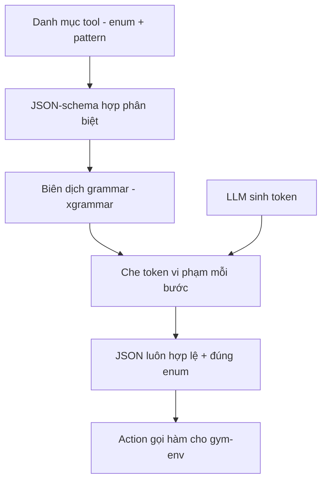

# 11.03 — Structured Decoding cho Tool-Calling (Thiết Kế Cách Test)

> [!NOTE]
> - Tài liệu này mô tả cơ chế ràng buộc giải mã (structured/constrained decoding) để ép đầu ra gọi hàm của LLM luôn hợp lệ về cấu trúc và giá trị,
> - **thiết lập cách kiểm thử so sánh** giữa giải mã tự do (free-form) và giải mã có ràng buộc trên bộ kịch bản khó.
> - Hiện thực tham chiếu: [experiments/06_gym_env_hard](../../experiments/06_gym_env_hard/README.md) và `src/fci_voice/sim/structured.py`.
> - Nền lý thuyết chung và nguồn học thuật: [.agent/skills/05_model_quality_engineering](../../../.agent/skills/05_model_quality_engineering/).

---

## 1. Dẫn dắt bối cảnh

- **Bài toán thực tế**:
  - Mô-đun gọi hàm nghiệp vụ (tool-calling) yêu cầu LLM sinh ra một đối tượng JSON đúng cấu trúc:
    chọn đúng tên hàm và điền đúng tham số theo ràng buộc (giá trị thuộc một tập cố định, hoặc khớp một khuôn mẫu).
  - Với mô hình nhỏ (Qwen2.5-1.5B), giải mã tự do thường sinh JSON sai cú pháp, sai tên hàm, hoặc điền giá trị ngoài tập cho phép.
- **Nghịch lý đo lường**:
  - Nếu chỉ "nhắc" mô hình trả JSON trong prompt rồi kiểm tra hậu kỳ, ta không kiểm soát được tỷ lệ lỗi cấu trúc và khó quy trách nhiệm lỗi cho đúng tầng.
  - Trong khi đó, nếu ràng buộc ngay tại bước sinh token, mọi đầu ra đều hợp lệ về cấu trúc, giúp tách bạch lỗi-định-dạng khỏi lỗi-ngữ-nghĩa.

> Tài liệu này thiết kế cơ chế ràng buộc giải mã cho tool-calling và quy trình kiểm thử so sánh,
> **làm rõ structured decoding vá được lớp lỗi nào và KHÔNG vá được lớp lỗi nào**,
> để định hướng đúng nỗ lực cải thiện chất lượng mô hình.

---

## 2. Glossary

- `constrained decoding` -> **Giải mã có ràng buộc** ->
  - Tại mỗi bước sinh token, một bộ xử lý logits che (mask) các token vi phạm cấu trúc cho phép,
  - khiến mô hình không thể sinh ra chuỗi sai cú pháp grammar.
- `logits processor` -> **Bộ xử lý logits** ->
  - Móc nối tiêu chuẩn của thư viện sinh văn bản, nhận vector điểm số token và gán âm vô cực cho token bị cấm trước khi lấy mẫu.
- `discriminated union` -> **Hợp phân biệt** ->
  - Lược đồ trong đó cấu trúc tham số (`args`) phụ thuộc vào giá trị trường định danh (`tool`),
  - mỗi tên hàm tương ứng một nhánh tham số riêng.
- `format tax` -> **Thuế định dạng** ->
  - Hiện tượng việc ép định dạng cứng có thể làm giảm khả năng suy luận của mô hình trong một số tác vụ.

---

## 3. Cơ chế ràng buộc — ba mức biểu diễn

- **Văn phạm phi ngữ cảnh (CFG)**:
  - Biểu diễn bằng máy tự động đẩy ngăn xếp (pushdown automaton), diễn đạt được cấu trúc lồng nhau và đệ quy (JSON lồng).
  - Mạnh nhất nhưng chi phí biên dịch và kiểm tra cao hơn.
- **Lược đồ JSON (JSON-schema)**:
  - Khai báo trực tiếp kiểu, trường bắt buộc, tập giá trị (`enum`) và khuôn mẫu (`pattern`).
  - Tiện nhất cho tool-calling vì nói thẳng được ràng buộc nghiệp vụ.
- **Biểu thức chính quy (regex / FSM)**:
  - Ràng buộc theo máy trạng thái hữu hạn, phù hợp định dạng phẳng (số, ngày, mã định danh).
  - Nhẹ nhất nhưng không diễn đạt được lồng nhau sâu.

> Lựa chọn cho FCI: **JSON-schema** (qua thư viện `xgrammar`), vì khai báo được vừa cấu trúc lồng `tool`/`args` vừa `enum`/`pattern` của tham số.

---

## 4. Thiết kế lược đồ tool-calling (Hợp phân biệt)

- **Cấu trúc tổng**:
  - Mỗi lời gọi là một đối tượng `{"tool": <tên trong tập>, "args": {...}}`.
  - Lược đồ là hợp của nhiều nhánh; mỗi nhánh khóa một `tool` cố định và mô tả `args` riêng cho hàm đó.
- **Nhánh từ chối gọi**:
  - Bổ sung nhánh đặc biệt `{"tool": "none", "args": {}}` để mô hình diễn đạt quyết định KHÔNG gọi hàm
    (lời chào, câu hỏi chung, từ chối xác thực, thiếu tham số, hoặc yêu cầu ngoài phạm vi).
- **Ràng buộc tham số**:
  - Tham số kiểu liệt kê dùng `enum` (ví dụ lý do khóa thẻ thuộc {lost, stolen, damaged, fraud}).
  - Tham số định danh dùng `pattern` (ví dụ mã tài khoản khớp `AC-\d{4}`).
- **Hàm dựng lược đồ**:
  - `build_tool_json_schema(tools)` sinh lược đồ này tự động từ danh mục công cụ của mỗi scenario, không viết tay từng nhánh.

### 4.1 Vòng lặp giải mã có ràng buộc

- **Khung đọc sơ đồ**:
  - **Đề bài cần giải**: ép đầu ra LLM luôn là JSON hợp lệ và tôn trọng ràng buộc tham số.
  - **Ý nghĩa các khối**:
    - `SCHEMA`: lược đồ hợp phân biệt dựng từ danh mục tool.
    - `GRAMMAR`: grammar đã biên dịch một lần, tái dùng cho mọi lượt.
    - `MASK`: bước che token, lọc bỏ token làm hỏng cấu trúc.
    - `JSONOUT`: đầu ra đảm bảo hợp lệ, đưa thẳng vào `Action`.
  - **Cách đọc**: danh mục tool quyết định lược đồ, lược đồ quyết định grammar, grammar che token ở mỗi bước sinh để đầu ra luôn hợp lệ.

---

## 5. Cách kiểm thử: so sánh Free-form và Constrained

- **Giữ nguyên môi trường, đổi policy**:
  - Cùng bộ scenario khó, cùng mô hình và seed; chỉ thay cơ chế giải mã (free-form JSON so với xgrammar).
  - Đây là so sánh ghép cặp (paired) để cô lập đóng góp của structured decoding.
- **Chấm điểm ba tầng**:
  - Tầng quyết định (gọi/không), tầng chọn đúng hàm, tầng đúng tham số — xem [02_gym_env_and_roles](02_gym_env_and_roles.md).
- **Kết quả đo (Qwen2.5-1.5B, GB10)**:
  - Free-form: 50% lượt đạt, lỗi dồn ở giá trị enum ngoài tập, sai cấu trúc, và bịa tên hàm.
  - Constrained (xgrammar): 86% lượt đạt, hoàn thành mục tiêu 7/7 kịch bản.
- **Phân tích lớp lỗi**:
  - Structured decoding vá triệt để lỗi định-dạng: enum ngoài tập, thiếu/sai trường, bịa tên hàm.
  - Ba lỗi còn lại KHÔNG phải định dạng mà là ngữ nghĩa và ranh giới quyết định
    (chọn enum hợp lệ nhưng sai nghĩa; gọi hàm khi đáng lẽ phải hỏi).

---

## 6. Giới hạn và lưu ý (trình bày hai phía)

- **Thuế định dạng (format tax)**:
  - Có nghiên cứu chỉ ra ép định dạng cứng làm giảm suy luận ở một số tác vụ (Tam và cộng sự, 2024).
  - Có phản biện cho rằng chênh lệch chủ yếu do prompt khác nhau, và structured decoding không hại nếu prompt công bằng (dottxt, 2024).
- **Quan sát tại FCI**:
  - Thử nghiệm thêm trường suy luận tự do trước khi gọi hàm (think-then-constrain) cho kết quả hòa ở mô hình 1.5B: vá được một lỗi quyết định nhưng làm hồi quy một lỗi khác.
  - Kết luận thận trọng: ở cỡ mô hình nhỏ, reasoning field không phải cải thiện chắc chắn; cần đo lại khi đổi mô hình.
- **Chi phí**:
  - Biên dịch grammar tốn một lần rồi cache; mỗi bước sinh thêm chi phí che token nhưng chấp nhận được cho harness chạy offline.
  - Rủi ro căn lề token (token cắt ngang ký tự) do thư viện xử lý ở tầng byte; không nên tự chế mask.

---

## 7. Nguồn tham khảo

- Tam và cộng sự, *Let Me Speak Freely?* (arXiv 2408.02442, EMNLP 2024) — bằng chứng phía format tax.
- *XGrammar* (arXiv 2411.15100; blog MLC 2024-11-22) — cơ chế byte-level pushdown automaton + mask cache.
- *Say What You Mean* (blog dottxt, 2024) — phản biện về tính công bằng của prompt.
- *JSONSchemaBench* (arXiv 2501.10868) — benchmark độc lập các engine structured output.
- Tổng hợp đầy đủ phân loại theo nguồn: [.agent/skills/05_model_quality_engineering/01_sim_to_real.md](../../../.agent/skills/05_model_quality_engineering/01_sim_to_real.md) và lân cận.

---

## ✅ Tự kiểm nhanh

1. Structured decoding ép tính hợp lệ ở thời điểm nào, khác gì kiểm tra hậu kỳ?

- **Ép tại bước sinh token**:
  - Bộ xử lý logits che các token vi phạm grammar ngay khi sinh, nên chuỗi sai cấu trúc không bao giờ được tạo ra.
  - Khác với kiểm tra hậu kỳ (sinh xong mới validate rồi thử lại), cách này không cần vòng lặp sửa lỗi và đảm bảo 100% đầu ra hợp lệ về cấu trúc.

2. Vì sao structured decoding KHÔNG nâng điểm lên 100% trên bộ kịch bản khó?

- **Chỉ vá lỗi định dạng**:
  - Grammar đảm bảo JSON hợp lệ và giá trị thuộc đúng tập enum, nhưng không đảm bảo CHỌN ĐÚNG giá trị về mặt nghĩa.
  - Các lỗi còn lại là ngữ nghĩa (chọn enum sai nghĩa) và quyết định (gọi hàm khi nên hỏi) — thuộc về năng lực mô hình, cần mô hình lớn hơn hoặc tách bước quyết định, không phải ràng buộc cú pháp.

3. Nhánh "none" trong lược đồ dùng để làm gì?

- **Diễn đạt quyết định không gọi hàm**:
  - Vì grammar luôn bắt đầu ra phải là một đối tượng hợp lệ, ta cần một nhánh để mô hình nói "không gọi hàm nào".
  - Nhánh `none` cho phép xử lý lời chào, từ chối xác thực, thiếu tham số, và yêu cầu ngoài phạm vi mà không phải bịa ra một tên hàm.

