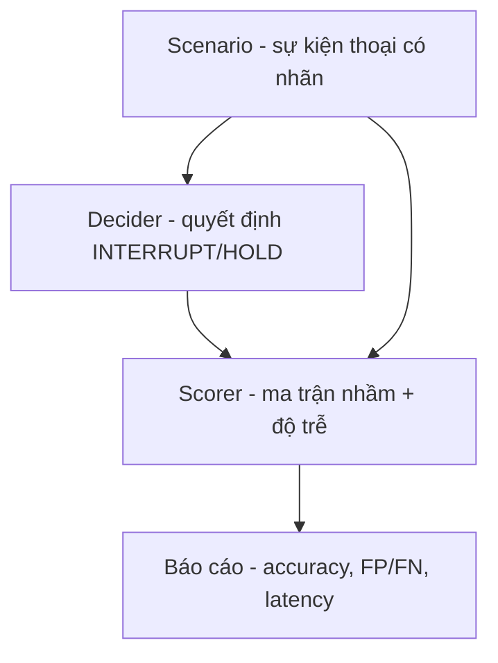

# 11.04 — Harness Phát Hiện Lượt Thoại (Turn-detection, text/event-first)

> [!NOTE]
> - Tài liệu này mô tả bộ khung kiểm thử module phát hiện lượt thoại đã hiện thực ở
>   giai đoạn TEXT/EVENT-first (chưa render audio), bám taxonomy trong
>   [01_design.md §3-4](01_design.md) và mô hình gym-env trong [02](02_gym_env_and_roles.md).
> - Mã nguồn: thư viện `src/fci_voice/sim/turn_*.py`; thực nghiệm
>   `experiments/08_turn_detection/`.
> - Đây là điểm đau số 2 của hệ thực tế: độ chính xác ngắt lời ~76% (đích ≥85%),
>   độ trễ ~280ms (đích ≤150ms).

---

## 1. Dẫn dắt bối cảnh

- **Bài toán cần đo**:
  - Khi bot ĐANG NÓI mà có tín hiệu thoại chen vào, hệ phải quyết định **NGẮT LỜI**
    (INTERRUPT, nhường lượt cho người dùng) hay **GIỮ LỜI** (HOLD, nói tiếp).
  - Quyết định sai theo hai chiều đều tốn kém: ngắt nhầm thì cắt lời khách vô cớ,
    sót ngắt thì khách phải nói đè và bực bội.
- **Vì sao tách riêng module này**:
  - Bộ phát hiện lượt thoại theo năng lượng âm thanh (energy-VAD) phản ứng nhanh
    nhưng không hiểu nội dung, nên hay ngắt nhầm vào âm đệm, tiếng người bên cạnh,
    và tiếng nhạc nền.
  - Hướng hiện đại là phát hiện lượt thoại theo NGỮ NGHĨA (semantic turn-detection):
    nhìn cả nội dung và người nói để giảm ngắt nhầm. Harness này dựng để ĐO được
    chính xác mức cải thiện đó trên cùng một tập kịch bản.

---

## 2. Glossary

- `turn-detection` -> **Phát hiện lượt thoại** ->
  - Quyết định thời điểm nhường/giữ lượt nói giữa bot và người dùng.
- `INTERRUPT / HOLD` -> **Ngắt lời / Giữ lời** ->
  - Hai nhãn đầu ra. INTERRUPT là lớp dương của ma trận nhầm lẫn (hành vi rủi ro).
- `backchannel` -> **Âm đệm** ->
  - Tiếng đáp ngắn ("dạ/vâng/ừ") người nghe phát ra để báo đang nghe, KHÔNG mang ý
    định ngắt lời.
- `false start` -> **Nói vấp** ->
  - Người dùng phát ra vài tiếng đệm ("à... ờ thì...") rồi dừng, chưa thành ý.
- `cross-talk` -> **Nói chồng chéo** ->
  - Nhiều người nói cùng lúc; chỉ giọng khách mục tiêu mới được quyền ngắt.
- `energy-VAD` -> **Dò hoạt động thoại theo năng lượng** ->
  - Phát hiện có tiếng nói dựa trên mức năng lượng/độ dài, không phân biệt nội dung
    hay người nói.
- `decider` -> **Bộ quyết định lượt thoại** ->
  - Thành phần nhận luồng sự kiện thoại và xuất quyết định INTERRUPT/HOLD; đóng vai
    "policy" của bài turn-detection (so sánh phiên bản A/B).

---

## 3. Mô hình kịch bản và quy ước chống chấm-điểm-vòng-tròn

- **Cấu trúc một kịch bản** (`TurnScenario`):
  - `agent_utterance`: câu bot đang nói (ngữ cảnh).
  - `events`: danh sách sự kiện thoại, mỗi sự kiện có **người nói** (`user` = khách
    mục tiêu, `other` = người bên cạnh/cross-talk, `noise` = nhạc/TV), **nội dung
    ASR**, **mốc thời gian** `t_start_s` và **độ dài** `duration_s`.
  - `expected`: nhãn đúng cuối cùng (INTERRUPT/HOLD).
  - `environment` (quiet/noisy), `snr_db`, `latency_budget_ms`.
- **Quy ước quan trọng — đặc trưng quan sát được vs nhãn**:
  - Mỗi sự kiện còn có trường `tag` (backchannel / stop_keyword / side_talk /
    cross_talk / music ...). `tag` và `expected` là **nhãn ground-truth dùng để
    chấm và phân tích**, decider KHÔNG được đọc.
  - Decider chỉ được nhìn các đặc trưng quan sát được: người nói, nội dung, thời
    gian. Nếu cho decider đọc `tag` thì việc chấm điểm trở thành vòng tròn (đề lộ
    đáp án).

---

## 4. Ba bậc bộ quyết định (decider)

- **Bậc 1 — `energy_vad` (baseline yếu, chạy local)**:
  - Thấy thoại đủ dài (ngưỡng năng lượng) thì ngắt, bất kể nội dung hay người nói.
  - Dự kiến: recall cao (bắt được mọi lượt nói thật) nhưng precision thấp (ngắt
    nhầm âm đệm dài, side-talk, nhạc nền).
- **Bậc 2 — `semantic_rule` (baseline mạnh, chạy local)**:
  - Lọc theo người nói (chỉ giọng khách mục tiêu mới được ngắt) cộng từ vựng quan
    sát được: nhận ra từ khóa dừng, nhận ra sự kiện toàn tiếng đệm là âm đệm/nói vấp.
- **Bậc 3 — `llm_semantic` (chạy trên DGX, đo sau)**:
  - Dùng chính LLM của agent phán đoán ý định ngắt lời; để đối chiếu với baseline.

---

## 5. Cách chấm điểm — ma trận nhầm lẫn + độ trễ

- **Trục chất lượng (accuracy)**:
  - Lớp dương = INTERRUPT. Ghi nhận bốn ô:
    - **TP**: cần ngắt và ngắt đúng.
    - **FP** (ngắt nhầm): không cần ngắt mà lại ngắt (do âm đệm/nhiễu/người khác).
    - **FN** (sót ngắt): cần ngắt mà lại giữ lời.
    - **TN**: không cần ngắt và giữ đúng.
  - Báo cáo accuracy, precision (cao = ít ngắt nhầm), recall (cao = ít sót ngắt).
- **Trục tốc độ (latency)**:
  - Chỉ đo trên ca TP: độ trễ = thời điểm chốt INTERRUPT trừ mốc khách bắt đầu nói,
    so với `latency_budget_ms` (150ms).

> [!IMPORTANT]
> Số mili-giây ở giai đoạn này là **mô hình hóa (synthetic)**, không phải đo thật:
> energy-VAD chốt sau một ngưỡng năng lượng cố định, semantic chốt sau một cửa sổ
> "nghe đủ ngữ nghĩa" dài hơn. Mục đích là **lộ trục đánh đổi nhanh-nhưng-sai
> (energy) vs đúng-nhưng-chậm (semantic)**, chưa phải để cam kết ms thực tế. Số ms
> thật cần render audio ở fidelity v2/v3 (xem [01 §6](01_design.md)).

---

## 6. Kết quả đo (text mode, 17 kịch bản: 11 yên tĩnh + 6 ồn)

| Decider | accuracy | TP/FP/FN/TN | precision | recall |
|---|---|---|---|---|
| `energy_vad` | **65%** | 9 / **6** / 0 / 2 | 60% | 100% |
| `semantic_rule` | **100%** | 9 / 0 / 0 / 8 | 100% | 100% |

- **Energy-VAD — nhanh mà ngắt nhầm**:
  - Recall 100% (không sót lượt ngắt thật) nhưng FP=6: ngắt nhầm vào âm đệm dài
    ("dạ vâng"), nói vấp, nói chuyện với người bên cạnh, tiếng nhạc và tiếng TV nền.
  - Accuracy 65% phản ánh đúng bản chất điểm đau thực tế (~76%).
- **Semantic — vá sạch lớp ngắt nhầm**:
  - Nhờ lọc theo người nói và nhận ra tiếng đệm, toàn bộ 6 ca FP được giữ lời đúng.
- **Lưu ý trung thực về một con số dễ gây hiểu nhầm**:
  - Ở vài ca ồn, energy-VAD cho độ trễ "0ms" vì nó bắn theo TIẾNG NHẠC nổi lên
    trước cả khi khách kịp nói. Nhanh nhưng phản ứng sai đối tượng — minh chứng rằng
    đo độ trễ tách rời độ chính xác thì vô nghĩa.

### Sơ đồ luồng chấm

---

## 7. Phạm vi đã làm và phần còn lại

- **Đã có**:
  - Schema kịch bản theo sự kiện thoại, scorer ma trận nhầm + độ trễ, hai decider
    chạy local (energy/semantic) và một decider LLM cho DGX.
  - 17 kịch bản hai môi trường, kiểm chứng harness phân biệt được hai bậc decider.
- **Còn lại (theo thang fidelity của [01 §6](01_design.md))**:
  - **Renderer v1→v3**: dựng âm thanh thật (ghép thời gian, trộn nhiễu MUSAN/DEMAND,
    hạ về 8kHz μ-law) để đo độ trễ THẬT thay cho số synthetic.
  - **Neo thực tế**: tính tương quan xếp hạng (SRCC) giữa giả lập và một tập nhỏ
    cuộc gọi thật trước khi tin vào kết luận.

---

## ✅ Tự kiểm nhanh

1. Vì sao decider không được đọc trường tag của sự kiện thoại?

- **Tránh chấm điểm vòng tròn**:
  - `tag` (backchannel/stop_keyword/...) gần như chính là đáp án.
  - Cho decider đọc `tag` thì nó "biết trước" nhãn, kết quả đo mất ý nghĩa.
  - Decider chỉ được dùng đặc trưng quan sát được (người nói, nội dung, thời gian).

2. Tại sao energy-VAD có recall 100% nhưng accuracy vẫn thấp?

- **Đánh đổi precision-recall**:
  - Vì ngắt theo năng lượng nên nó bắt được mọi lượt nói thật (không sót, recall cao).
  - Nhưng cũng ngắt nhầm vào âm đệm dài, người bên cạnh và tiếng nhạc (FP nhiều),
    kéo accuracy xuống. Lỗi đặc trưng của nó là ngắt nhầm chứ không phải sót ngắt.

3. Vì sao số mili-giây latency hiện tại chưa dùng để cam kết hiệu năng?

- **Độ trễ đang là synthetic**:
  - Ở chế độ text chưa có âm thanh, ms chỉ được mô hình hóa để minh họa đánh đổi
    nhanh/chậm giữa hai cách tiếp cận.
  - Muốn có ms thật phải dựng Renderer audio (v2/v3) và neo bằng dữ liệu thực tế.

