# 12 — Deck trình bày: Voice AI Agent tổng đài (tổng thể → component → bài toán challenge)

> **Mục đích tài liệu:**
>
> - Trình bày trực quan kiến trúc Voice AI Agent cho team nội bộ và đối tác FCI.
>
> - Đóng vai trò làm cơ sở thảo luận để hiệu chỉnh các thông tin kỹ thuật của hệ thống.
>
> - Tập hợp các cách hiểu của team dựa trên sơ đồ tổng quát, dữ liệu mẫu và kết quả thử nghiệm.
>
> - Làm rõ các khối chức năng và số liệu tự công bố cần FCI xác nhận hoặc đính chính.

## 0. Bản đồ deck

- **Cấu trúc chung của mỗi chủ đề**:
  - Tích hợp một sơ đồ luồng trực quan.
  - Kèm theo một bảng chú giải chi tiết các thành phần.
  - Trình bày tuần tự theo mạch logic đi từ tổng quát đến chi tiết.

- **Các điểm đau cốt lõi cần giải quyết**:
  - **Điểm đau #1 — Ngắt lời (Barge-in)**:
    - Hiệu suất hiện tại: Đạt độ chính xác khoảng 76% với thời gian phản hồi 280ms.
    - Chỉ tiêu hướng tới: Đạt độ chính xác từ 85% trở lên với độ trễ dưới 150ms.
    - Lưu ý: Số liệu nội bộ và chưa được thực hiện kiểm chứng độc lập.
  - **Điểm đau #2 — Gọi hàm (Tool-calling)**:
    - Hiệu suất hiện tại: Đạt độ chính xác khoảng 62%.
    - Chỉ tiêu hướng tới: Đạt độ chính xác từ 90% trở lên.
    - Lưu ý: Số liệu đo đạc nội bộ.

| # | Topic | Vai trò |
| :--- | :--- | :--- |
| T1 | Vòng lặp Voice Agent tổng thể | Bức tranh toàn cảnh một cuộc gọi |
| T2 | Hai trường phái kiến trúc: Cascade và S2S | Vì sao tổng đài chọn Cascade |
| T3 | Kiến trúc 4 lớp của FCI (bản hiểu, cần xác nhận) | Neo thảo luận với FCI |
| T4 | Triết lý phễu đa tầng (multi-solution-stack) | Khung tối ưu latency xuyên suốt |
| T5 | Zoom-in front-end âm thanh và chốt chặn tách giọng | Component quan trọng nhất |
| T6 | Turn-taking: ba bài toán con | Bài toán challenge #1 |
| T7 | Bản chất ngắt lời: sáu chiều và vì sao word-check sập | Challenge #1 (chiều sâu) |
| T8 | Phễu ba tầng cho barge-in dưới ngân sách 150ms | Challenge #1 (giải pháp) |
| T9 | Tool-calling: simulated tool và two-pass | Bài toán challenge #2 |
| T10 | Ba tầng chất lượng tool-call và XGrammar | Challenge #2 (chiều sâu) |
| T11 | Build-vs-Buy: Krisp (mua) và open-source (tự xây) | Hướng đi cho chốt chặn |

---

## T1 — Vòng lặp Voice Agent tổng thể

- **Dẫn dắt bối cảnh**:
  - Một cuộc gọi thoại là một vòng lặp khép kín liên tục.
  - Tín hiệu âm thanh của khách hàng đi vào hệ thống.
  - Hệ thống thực hiện nhận dạng, suy luận và sinh câu trả lời.
  - Bot phát âm thanh phản hồi và tiếp tục lắng nghe lượt lời tiếp theo.

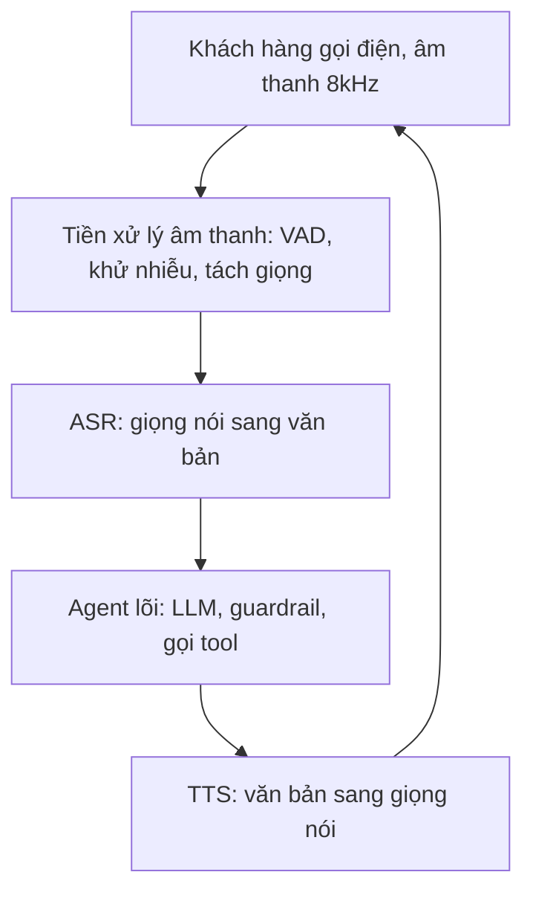

| Thành phần | Vai trò | Ghi chú cho tổng đài |
| :--- | :--- | :--- |
| **Âm thanh 8kHz** | Tín hiệu thoại qua kênh viễn thông | Băng hẹp, nén méo, nhiều nhiễu; khác hẳn micro sạch 16kHz |
| **Tiền xử lý âm thanh** | Lọc và chuẩn bị tín hiệu trước khi hiểu | Nơi đặt chốt chặn tách giọng mục tiêu (xem T5) |
| **ASR** | Chuyển giọng nói thành văn bản | Chất lượng thấp khi nhiễu, kéo lỗi xuống toàn bộ phía sau |
| **Agent lõi** | Suy luận nghiệp vụ, gọi công cụ, guardrail | Nơi đặt điểm đau #2 tool-calling (xem T9, T10) |
| **TTS** | Chuyển văn bản thành giọng nói phát ra | Phải dừng được ngay khi khách chen ngang |
| **Vòng lặp full-duplex** | Nghe và nói đồng thời | Khi TTS đang phát mà khách nói chen vào chính là barge-in (điểm đau #1) |

---

## T2 — Hai trường phái kiến trúc: Cascade và S2S

- **Dẫn dắt bối cảnh**:
  - Tồn tại hai phương pháp thiết kế hệ thống Voice Agent chính.
  - Mô hình Cascade thực hiện tách biệt các lớp xử lý tuần tự.
  - Mô hình Speech-to-Speech (S2S) xử lý end-to-end trực tiếp.
  - Hệ thống tổng đài tài chính hiện tại ưu tiên lựa chọn mô hình Cascade.
  - Giúp kiểm soát chặt chẽ nghiệp vụ và đảm bảo an toàn thông tin.
  - Đánh đổi bằng việc phải tự tích hợp và tối ưu module turn-taking từ bên ngoài.

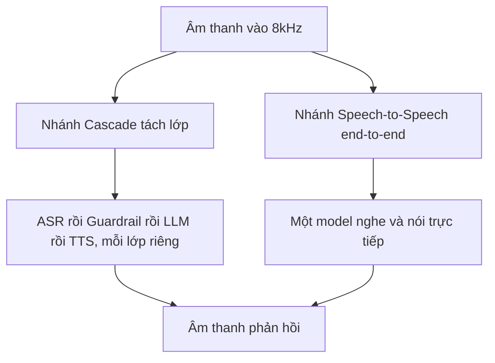

| Trục so sánh | Cascade (đang dùng) | S2S end-to-end |
| :--- | :--- | :--- |
| **Kiểm soát nghiệp vụ và tool** | Mạnh: dễ chèn luật, dễ gọi hàm | Yếu: logic nằm trong trọng số model |
| **Guardrail và bảo mật PII** | Dễ tách lớp, chốt chặn đầu vào/ra | Khó: chưa có kiểm soát an toàn đồng bộ |
| **Độ trễ** | Cộng dồn qua từng chặng | Rất thấp, bỏ qua bước dịch văn bản |
| **Barge-in / turn-taking** | Phải ghép VAD và turn-detector ngoài | Model tự xử lý ở phía server |
| **Tiếng Việt** | Phụ thuộc chất lượng ASR/TTS thành phần | Chưa có benchmark kiểm chứng |

---

## T3 — Kiến trúc 4 lớp của FCI (bản hiểu, cần FCI xác nhận)

- **Dẫn dắt bối cảnh**:
  - Khái quát lại mô hình kiến trúc Cascade 4 lớp của đối tác FCI.
  - Xây dựng dựa trên tài liệu sơ đồ tổng quát và phân tích mẫu dữ liệu.
  - Đưa ra làm khung thảo luận để đối tác xác nhận hoặc hiệu chỉnh chi tiết.

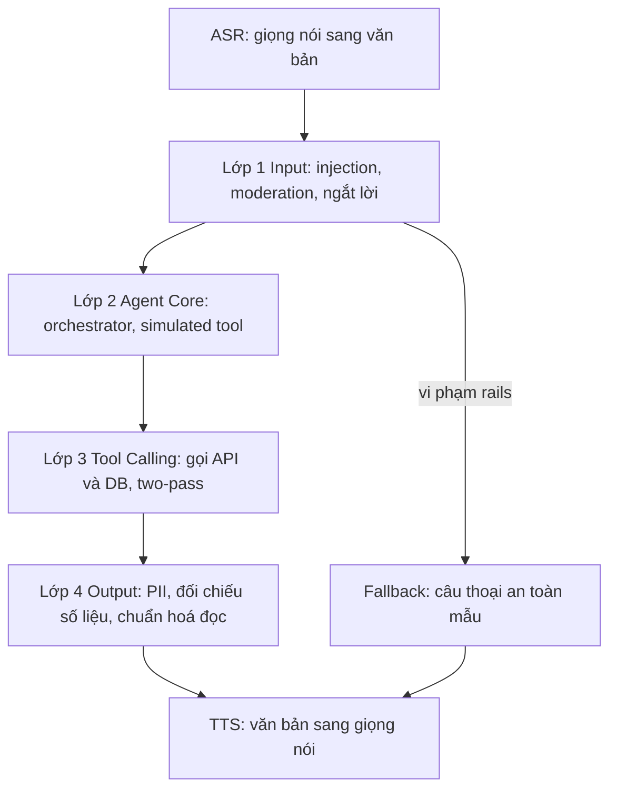

| Lớp | Nhiệm vụ chính | Cơ chế đặc trưng (cần FCI xác nhận) |
| :--- | :--- | :--- |
| **Lớp 1 — Input Handling** | Chặn tấn công và phân loại ngắt lời | Prompt injection, moderation, semantic interruption |
| **Lớp 2 — Agent Core** | Điều phối kịch bản nghiệp vụ | *Simulated tool-calling*: chèn hàm giả `what_should_I_do_next` để bám đúng một bước |
| **Lớp 3 — Tool Calling** | Lấy dữ liệu thật, chống bịa số | *Two-pass*: lượt 1 gọi API, lượt 2 viết lại câu theo số liệu thật |
| **Lớp 4 — Output Control** | Bảo vệ đầu ra | Che PII, đối chiếu số liệu factual, chuẩn hoá text cho TTS |
| **Rails Fallback** | Lối thoát an toàn | Bỏ qua agent core, trả câu mẫu khi phát hiện nguy cơ |

---

## T4 — Triết lý phễu đa tầng (multi-solution-stack)

- **Dẫn dắt bối cảnh**:
  - Áp dụng triết lý phễu lọc cho mọi tác vụ con trong hệ thống.
  - Ưu tiên giải quyết các trường hợp đơn giản tại tầng xử lý chi phí thấp.
  - Chỉ chuyển tiếp các ca phức tạp lên các mô hình học sâu lớn và đắt đỏ.
  - Hướng tới mục tiêu tối ưu hóa độ trễ (latency) toàn trình mà vẫn bảo đảm chất lượng.

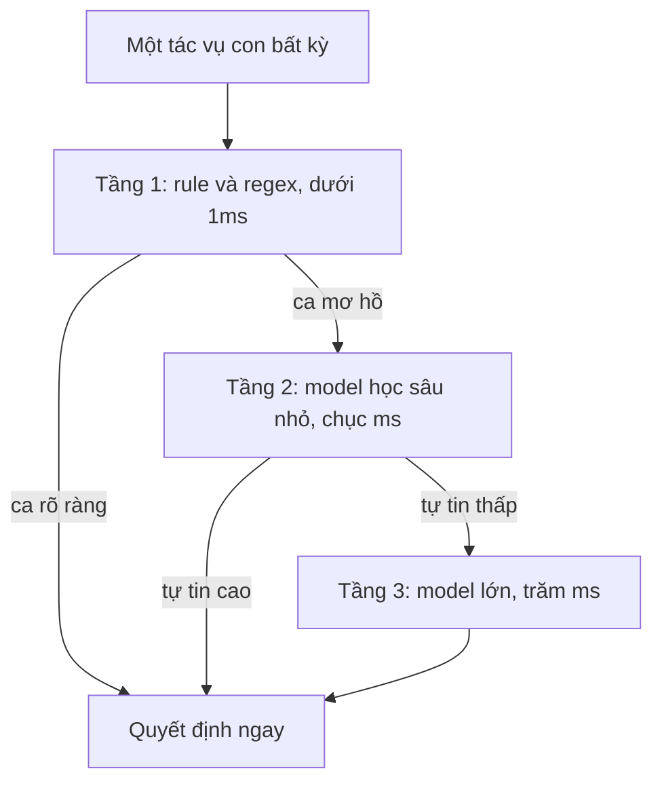

| Tác vụ | Tầng 1 rule | Tầng 2 model nhỏ | Tầng 3 model lớn |
| :--- | :--- | :--- | :--- |
| **VAD / phân đoạn** | Ngưỡng năng lượng | Silero VAD | — |
| **Ngắt lời** | Từ điển backchannel VN | Smart Turn (prosody) | LLM 7B nhị phân |
| **Chọn công cụ** | Luật định tuyến ý định | Intent classifier nhỏ | LLM sinh lời gọi hàm |
| **Lọc PII đầu ra** | Regex + Luhn | Presidio + PhoBERT-NER | LLM judge đối chiếu |

---

## T5 — Zoom-in front-end âm thanh và chốt chặn tách giọng

- **Dẫn dắt bối cảnh**:
  - Bộ phận tiền xử lý âm thanh đóng vai trò là chốt chặn quan trọng nhất.
  - Nhiệm vụ cốt lõi là tách biệt giọng nói của khách hàng mục tiêu.
  - Cần loại bỏ triệt để nhiễu nền, tiếng người xung quanh và echo từ chính loa bot.
  - Là tiền đề quyết định chất lượng cho các bước nhận dạng và suy luận phía sau.

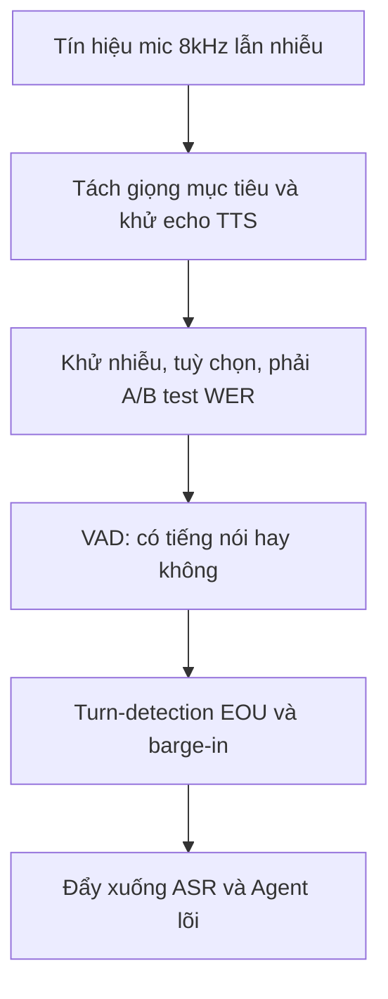

| Thành phần | Vai trò | Điểm cần lưu ý |
| :--- | :--- | :--- |
| **Tách giọng mục tiêu** | Chỉ giữ giọng khách được định danh (target-speaker) | **Chốt chặn thật**: open-source còn yếu, license hay kẹt; là nơi Krisp mạnh (xem T11) |
| **Khử echo (AEC)** | Ngăn tiếng bot dội ngược vào mic | Thiếu AEC gây ngắt lời nhầm do echo (ca C3 trong taxonomy) |
| **Khử nhiễu (denoise)** | Làm sạch tín hiệu | ⚠️ Có thể làm **tăng WER**; chỉ khử nhẹ và nuôi nhánh VAD/turn, để ASR ăn audio gốc; bắt buộc A/B test |
| **VAD** | Phân biệt im lặng và tiếng nói | Silero (DNN, 87.7% TPR nhiễu *tự công bố*) tốt hơn WebRTC (~50% TPR nhiễu) |
| **Turn-detection + barge-in** | Quyết định khi nào bot nói / dừng | Chi tiết ở T6, T7, T8 |

---

## T6 — Turn-taking: ba bài toán con

- **Dẫn dắt bối cảnh**:
  - Quản lý lượt lời (turn-taking) bao gồm ba bài toán con độc lập.
  - Mỗi bài toán được kích hoạt tại các thời điểm và ngữ cảnh khác nhau.
  - Việc gộp chung các bài toán này là nguyên nhân chính dẫn đến lỗi logic hội thoại.

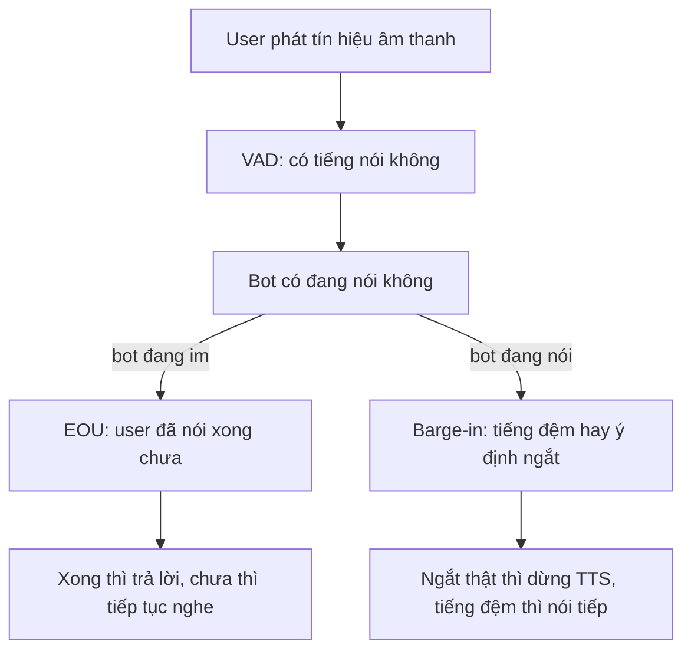

| Bài toán con | Câu hỏi cốt lõi | Thời điểm kích hoạt | Cách đo |
| :--- | :--- | :--- | :--- |
| **Turn-detection / EOU** | Khách đã nói xong chưa? | Khi khách vừa ngừng phát âm | Latency phản xạ của bot |
| **Barge-in** | Khách chen ngang, bot có nên dừng TTS? | Khi bot đang nói mà mic có tiếng | Chính xác quyết định ngắt (%) và latency dừng |
| **Semantic interruption** | Tiếng chen là backchannel hay ý định ngắt? | Xảy ra đồng thời trong barge-in | Chính xác nhận diện backchannel (%) |
| **Backchannel (bot phát)** | Bot có nên "dạ, vâng" để thể hiện đang nghe? | Khi khách trình bày câu dài | Độ tự nhiên hội thoại (MOS) |

---

## T7 — Bản chất ngắt lời: sáu chiều và vì sao word-check sập

- **Dẫn dắt bối cảnh**:
  - Hành vi khách chen ngang cuộc gọi là một thực thể đa chiều.
  - Được mô tả chi tiết bằng hệ tọa độ không gian 6 chiều khác nhau.
  - Giải pháp so khớp từ khóa (word-check) truyền thống chỉ nhận diện được lớp bề mặt.
  - Dẫn đến việc hệ thống dễ dàng bị sập hoặc xử lý sai ở các ca phức tạp.

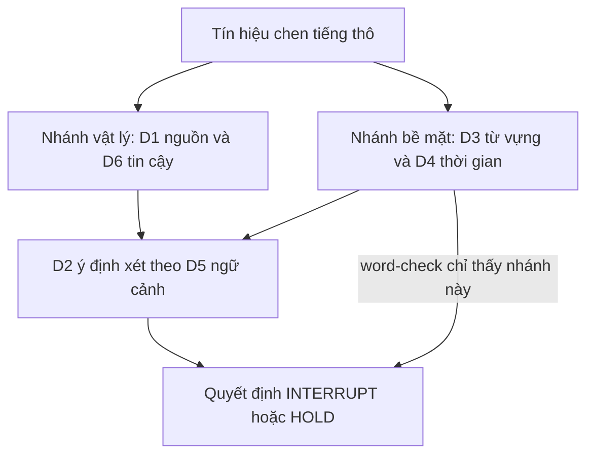

| Chiều | Câu hỏi | Thấy được từ text thuần? |
| :--- | :--- | :--- |
| **D1 — Nguồn phát** | Âm này từ đâu (khách, người bên cạnh, TV, echo)? | Một phần, cần diarization |
| **D2 — Ý định** | Khách muốn giành lượt hay chỉ đệm? | **Không**, cần ngữ cảnh |
| **D3 — Đánh dấu bề mặt** | Ý định lộ ra trên từ vựng thế nào? | Có, nhưng thiếu |
| **D4 — Quan hệ thời gian** | Chen vào lúc nào so với lời bot? | Có (timing) |
| **D5 — Ngữ cảnh hội thoại** | Bot đang hỏi slot hay đọc đoạn dài? | **Không**, cần dialog-state |
| **D6 — Độ tin cậy** | Tín hiệu và nhãn có đáng tin? | **Không**, cần confidence |

- **Kết luận rút ra**:
  - Ba chiều thông tin cốt lõi quyết định nhãn (D2, D5, D6) không xuất hiện trong văn bản thuần.
  - **Ví dụ phân tích từ khóa "Vâng"**:
    - Khi bot đang đọc một đoạn thông tin dài: Từ này đóng vai trò là tiếng đệm (HOLD).
    - Ngay sau khi bot đặt câu hỏi xác nhận: Từ này chuyển thành câu trả lời trực tiếp (INTERRUPT).
  - **Đề xuất giải pháp**:
    - Sử dụng đòn bẩy chi phí thấp nhất là tích hợp trạng thái hội thoại (D5 dialog-state) vào bộ ra quyết định.

---

## T8 — Phễu ba tầng cho barge-in dưới ngân sách 150ms

- **Dẫn dắt bối cảnh**:
  - Việc lạm dụng mô hình LLM lớn để phân tích chen ngang sẽ gây trễ lớn (~280ms).
  - Làm phá vỡ ngân sách độ trễ nghiêm ngặt của hệ thống (≤150ms).
  - Giải pháp tối ưu là xây dựng phễu lọc ba tầng để phân bổ tài nguyên hợp lý.
  - Ca dễ được xử lý tức thì, ca phức tạp mới chuyển tiếp lên mô hình lớn hơn.

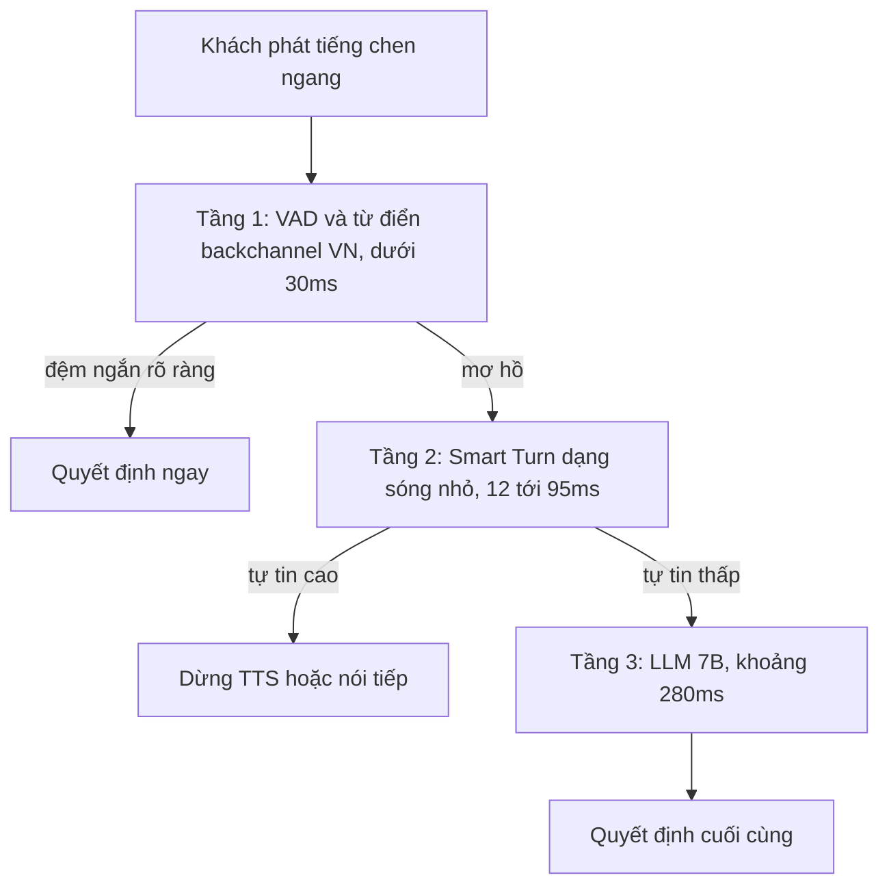

| Tầng | Công cụ | Độ trễ | Bản quyền / lưu ý |
| :--- | :--- | :--- | :--- |
| **Tầng 1** | Từ điển backchannel tiếng Việt + VAD | <30ms | Rẻ nhất, giải phần lớn ca đệm rõ ràng |
| **Tầng 2** | Smart Turn v3 (Whisper-tiny ~8M, prosody) | 12–95ms *tự công bố* | BSD-2, chạy CPU; có tiếng Việt 81.27% nhưng FP 14.84%, huấn luyện ở 16kHz sạch → **phải fine-tune 8kHz** |
| **Tầng 3** | LLM 7B nhị phân | ~280ms | Chỉ dùng cho ca khó còn lại; đây là nút thắt latency hiện tại |
| **Ngân sách** | Tổng cộng ≤150ms | — | Phễu giúp phần lớn cuộc gọi dừng ở Tầng 1–2 |

---

## T9 — Tool-calling: simulated tool và two-pass

- **Dẫn dắt bối cảnh**:
  - Phân tích sâu điểm đau cốt lõi thứ hai liên quan đến gọi công cụ (tool-calling).
  - Khắc phục các lỗi phổ biến như chọn sai hàm, điền sai tham số hoặc bịa số liệu.
  - Ứng dụng cơ chế gọi hàm giả (simulated tool) để bot tuân thủ kịch bản.
  - Sử dụng cơ chế suy luận hai lượt (two-pass) để ép buộc câu trả lời bám sát dữ liệu thật.

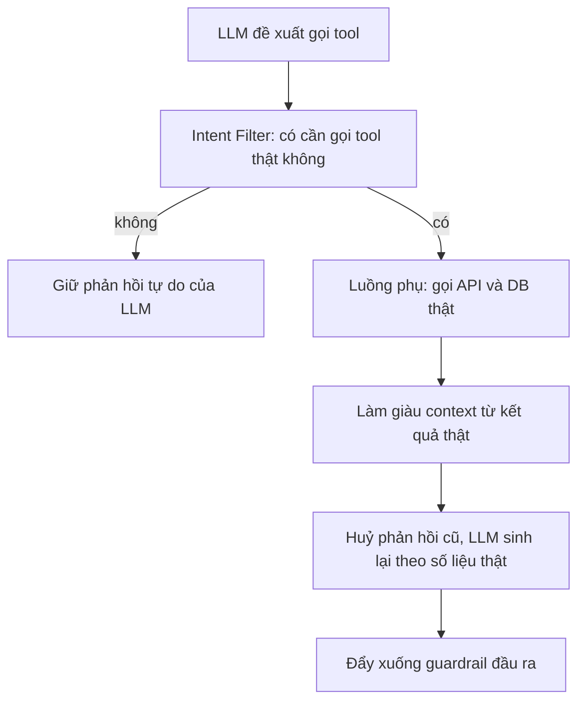

| Thành phần | Vai trò | Đánh đổi |
| :--- | :--- | :--- |
| **Simulated tool-calling** | Chèn hàm giả `what_should_I_do_next` để bot bám đúng một bước kịch bản | Nếu schema các bước lệch nhau có thể nhiễu suy luận model |
| **Intent Filter** | Quyết có thật sự cần gọi API không | Sai ở đây thì hoặc bịa số hoặc gọi thừa |
| **Two-pass response** | Lượt 1 lấy dữ liệu thật, lượt 2 viết lại câu | Tăng gần gấp đôi độ trễ (TTFT); chỉ bật khi cần truy vấn số liệu |
| **Chống ảo giác số liệu** | Ép câu trả lời bám dữ liệu API | Là lý do phải two-pass thay vì để LLM tự đoán |

---

## T10 — Ba tầng chất lượng tool-call và XGrammar

- **Dẫn dắt bối cảnh**:
  - Khoảng cách cải thiện hiệu suất gọi hàm không nằm ở việc định dạng JSON.
  - Cần phân tách lỗi cuộc gọi thành ba tầng chất lượng độc lập để định vị nguồn lỗi.
  - Sử dụng XGrammar chỉ giải quyết được các lỗi liên quan đến định dạng cú pháp JSON.
  - Cần các biện pháp bổ trợ để khắc phục lỗi logic nghiệp vụ và dữ liệu thực tế.

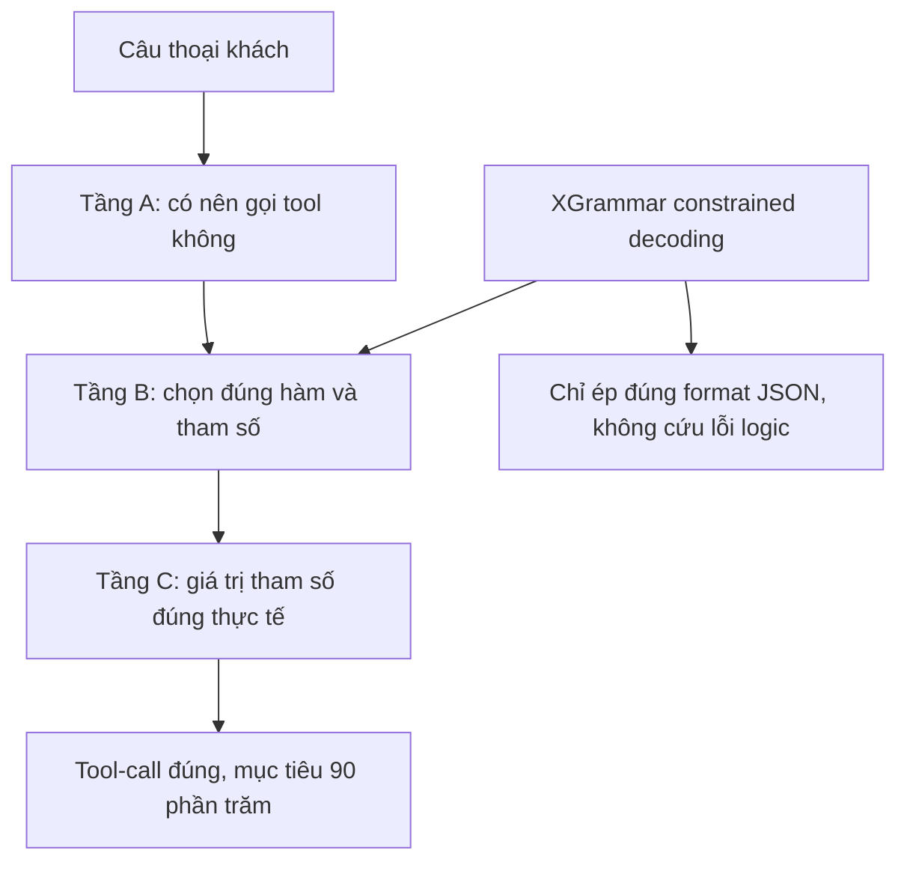

| Tầng chất lượng | Loại lỗi | Công cụ vá |
| :--- | :--- | :--- |
| **Tầng A — Quyết gọi** | Gọi tool khi không cần, hoặc quên gọi | Prompt, intent classifier |
| **Tầng B — Chọn hàm và cú pháp** | Sai hàm, sai tên tham số, JSON hỏng | **XGrammar** chỉ vá được JSON format, tiệm cận 100% cú pháp |
| **Tầng C — Grounding giá trị** | Điền đúng cú pháp nhưng sai giá trị thực tế | Cần dữ liệu, RAG, model tốt hơn |
| **BFCL V4 harness** | Đo lường tách lỗi | So khớp cây cú pháp (AST) để biết % lỗi format vs lỗi logic |

- **Kết luận rút ra**:
  - Phần lớn khoảng cách thiếu hụt 28% hiệu năng thuộc về **Tầng B–C (logic và giá trị)**.
  - Không nằm ở vấn đề định dạng cú pháp JSON.
  - Khuyến nghị ưu tiên đo lường và đánh giá bằng hệ thống BFCL trước khi cấu hình XGrammar.

---

## T11 — Build-vs-Buy: Krisp (mua) và open-source (tự xây)

- **Dẫn dắt bối cảnh**:
  - Lựa chọn phương án triển khai module tách giọng khách hàng mục tiêu.
  - So sánh giữa việc tích hợp bộ SDK thương mại từ đối tác Krisp và tự phát triển.
  - Quyết định dựa trên tích số của ba yếu tố: tính khả thi, hiệu quả thực tế và chi phí dài hạn.

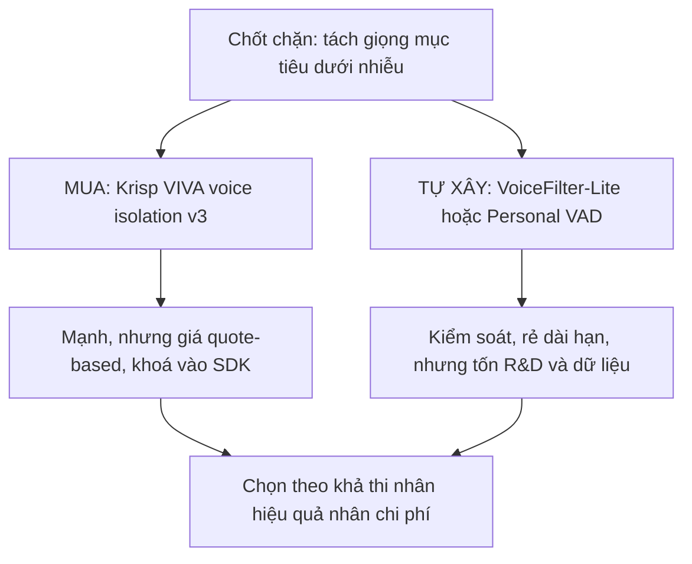

| Hướng | Đại diện | Ưu | Nhược |
| :--- | :--- | :--- | :--- |
| **Mua — Krisp** | VIVA SDK (Voice Isolation, Turn/Interruption Prediction, VAD) | Dẫn đầu thương mại, bundle sẵn các module | Giá SDK **quote-based** không công khai; chỉ Voice Translation API có giá công khai (~$0.09–0.12/phút *tham chiếu độ lớn*) |
| **Tự xây — target-speaker** | VoiceFilter-Lite, Personal VAD (blueprint Google) | Kiểm soát, rẻ dài hạn | Không có code sẵn, tốn R&D + dữ liệu enroll giọng |
| **OSS thành phần đã chín** | Silero VAD (MIT, 8kHz), Smart Turn v3 (BSD-2, có vi) | Dùng được ngay cho VAD và EOU | Không giải được phần tách giọng mục tiêu |
| **OSS còn kẹt** | SpeakerBeam (eval-only), USEF-TSE (CC-BY-NC), WeSep (no license) | Ý tưởng tốt | License chặn thương mại hoặc chưa realtime |

- **Kết luận rút ra**:
  - Đối với VAD và EOU: Ưu tiên sử dụng các mã nguồn mở sạch về mặt bản quyền.
  - Đối với chốt chặn tách giọng: Lựa chọn mua sản phẩm thương mại Krisp hoặc tự xây dựng theo blueprint của Google.
  - Đây là một quyết định chiến lược lớn cần được thảo luận kỹ lưỡng và thống nhất với đối tác FCI.

---

## ✅ Tự kiểm nhanh

1. Vì sao tổng đài tài chính lựa chọn kiến trúc Cascade thay vì Speech-to-Speech (S2S)?

- **Khả năng kiểm soát an toàn**:
  - Cascade cho phép tích hợp các lớp bảo vệ (guardrail) tách biệt.
  - Giúp dễ dàng ngăn chặn prompt injection, che thông tin nhạy cảm (PII) và đối chiếu số liệu.
- **Ràng buộc nghiệp vụ**:
  - Đảm bảo kiểm soát gọi công cụ (tool-calling) chính xác và đáng tin cậy.
  - Phù hợp với các tiêu chuẩn khắt khe trong lĩnh vực tài chính.
- **Hạn chế của mô hình Speech-to-Speech**:
  - Gom toàn bộ logic xử lý vào trong trọng số model nên cực kỳ khó chèn luật.
  - Chưa cung cấp cơ chế bảo đảm an toàn dữ liệu đồng bộ.

2. Đâu là chốt chặn thực sự của bài toán ngắt lời (barge-in)?

- **Vị trí của chốt chặn**:
  - Nằm ở tầng tiền xử lý âm thanh (front-end) để **tách giọng khách hàng mục tiêu (target-speaker)**.
- **Hệ quả của việc xử lý sai**:
  - Nếu tín hiệu vào bị lẫn nhiễu, tiếng TV hoặc echo thì mọi suy luận phía sau đều dựa trên dữ liệu sai.
  - Turn-detection ở các bước sau sẽ không thể đưa ra quyết định chính xác nếu đầu vào bị hỏng.

3. Sử dụng XGrammar có đủ nâng hiệu suất gọi công cụ từ 62% lên 90% không?

- **Phạm vi tác động của XGrammar**:
  - Chỉ hỗ trợ ràng buộc cú pháp đầu ra để bảo đảm **định dạng JSON chính xác** (Tầng B).
- **Nguyên nhân chính gây lỗi**:
  - Phần lớn lỗi nằm ở Tầng A (quyết định gọi tool) và Tầng C (giá trị tham số thực tế).
  - Đòi hỏi các cải tiến về prompt, chất lượng dữ liệu RAG và năng lực mô hình ngôn ngữ.
  - Khuyến nghị đo đạc kỹ lưỡng bằng công cụ BFCL trước khi tiến hành tối ưu cú pháp.

