# 12 — Deck trình bày: Voice AI Agent tổng đài (tổng thể → component → bài toán challenge)

> [!IMPORTANT]
> - **Mục đích deck**: dùng để trình bày trực quan cho team và cho FCI, thảo luận và **hiệu chỉnh lại thông tin về hệ thống FCI**.
> - **Nguồn hiểu biết**: phần mô tả hệ FCI ở đây là **cách hiểu của team dựng lại** từ (a) sơ đồ kiến trúc tổng quát FCI cung cấp, (b) dữ liệu mẫu, (c) một số kết quả test nhỏ.
> - **Không phải** đặc tả hệ thống nội bộ thật của FCI. Mọi khối "4 lớp" cần FCI xác nhận hoặc sửa lại.
> - **Số liệu**: các con số hãng tự công bố hoặc chưa chạy lại đều gắn nhãn *tự công bố / chưa xác minh*.

---

## 0. Bản đồ deck

- **Mỗi topic = 1 sơ đồ + 1 bảng chú giải thành phần**. Trình bày theo mạch từ tổng thể xuống chi tiết:

| # | Topic | Vai trò |
| :--- | :--- | :--- |
| T1 | Vòng lặp Voice Agent tổng thể | Bức tranh toàn cảnh một cuộc gọi |
| T2 | Hai trường phái kiến trúc: Cascade và S2S | Vì sao tổng đài chọn Cascade |
| T3 | Kiến trúc 4 lớp của FCI (bản hiểu, cần xác nhận) | Neo thảo luận với FCI |
| T4 | Triết lý phễu đa tầng (multi-solution-stack) | Khung tối ưu latency xuyên suốt |
| T5 | Zoom-in front-end âm thanh và chốt chặn tách giọng | Component quan trọng nhất |
| T6 | Turn-taking: ba bài toán con | Bài toán challenge #1 |
| T7 | Bản chất ngắt lời: sáu chiều và vì sao word-check sập | Challenge #1 (chiều sâu) |
| T8 | Phễu ba tầng cho barge-in dưới ngân sách 150ms | Challenge #1 (giải pháp) |
| T9 | Tool-calling: simulated tool và two-pass | Bài toán challenge #2 |
| T10 | Ba tầng chất lượng tool-call và XGrammar | Challenge #2 (chiều sâu) |
| T11 | Build-vs-Buy: Krisp (mua) và open-source (tự xây) | Hướng đi cho chốt chặn |

- **Hai điểm đau xuyên suốt deck** (mục tiêu cần vá):
  - **Điểm đau #1 — Ngắt lời (barge-in)**: hiện ~76% chính xác / 280ms, mục tiêu ≥85% / ≤150ms. *(số nội bộ, chưa chạy lại độc lập)*
  - **Điểm đau #2 — Gọi hàm (tool-calling)**: hiện ~62% chính xác, mục tiêu ≥90%. *(số nội bộ)*

---

## T1 — Vòng lặp Voice Agent tổng thể

- **Câu chuyện**: một cuộc gọi là vòng lặp khép kín: tiếng khách vào, hệ thống hiểu, sinh câu trả lời, phát tiếng ra, rồi lại nghe tiếp.

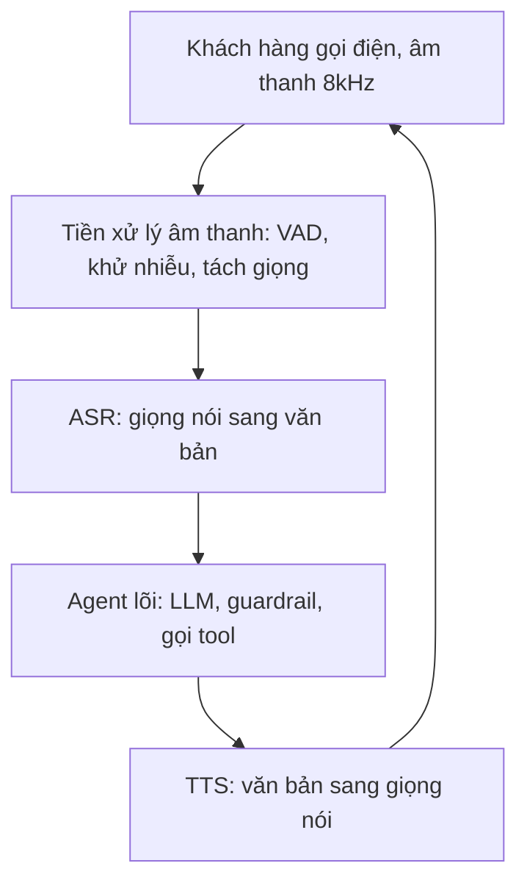

- **Bảng chú giải thành phần**:

| Thành phần | Vai trò | Ghi chú cho tổng đài |
| :--- | :--- | :--- |
| **Âm thanh 8kHz** | Tín hiệu thoại qua kênh viễn thông | Băng hẹp, nén méo, nhiều nhiễu; khác hẳn micro sạch 16kHz |
| **Tiền xử lý âm thanh** | Lọc và chuẩn bị tín hiệu trước khi hiểu | Nơi đặt chốt chặn tách giọng mục tiêu (xem T5) |
| **ASR** | Chuyển giọng nói thành văn bản | Chất lượng thấp khi nhiễu, kéo lỗi xuống toàn bộ phía sau |
| **Agent lõi** | Suy luận nghiệp vụ, gọi công cụ, guardrail | Nơi đặt điểm đau #2 tool-calling (xem T9, T10) |
| **TTS** | Chuyển văn bản thành giọng nói phát ra | Phải dừng được ngay khi khách chen ngang |
| **Vòng lặp full-duplex** | Nghe và nói đồng thời | Khi TTS đang phát mà khách nói chen vào chính là barge-in (điểm đau #1) |

---

## T2 — Hai trường phái kiến trúc: Cascade và S2S

- **Câu chuyện**: cùng một bài toán có hai cách dựng. Tổng đài tài chính hiện chọn Cascade vì kiểm soát nghiệp vụ và an toàn tốt hơn, đổi lại phải tự ghép turn-taking bên ngoài.

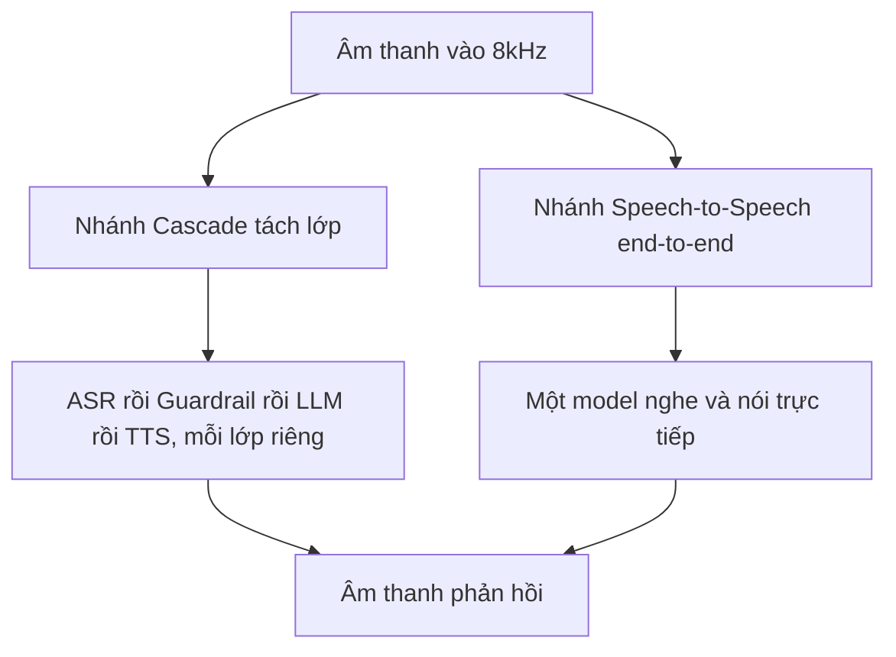

- **Bảng chú giải thành phần**:

| Trục so sánh | Cascade (đang dùng) | S2S end-to-end |
| :--- | :--- | :--- |
| **Kiểm soát nghiệp vụ và tool** | Mạnh: dễ chèn luật, dễ gọi hàm | Yếu: logic nằm trong trọng số model |
| **Guardrail và bảo mật PII** | Dễ tách lớp, chốt chặn đầu vào/ra | Khó: chưa có kiểm soát an toàn đồng bộ |
| **Độ trễ** | Cộng dồn qua từng chặng | Rất thấp, bỏ qua bước dịch văn bản |
| **Barge-in / turn-taking** | Phải ghép VAD và turn-detector ngoài | Model tự xử lý ở phía server |
| **Tiếng Việt** | Phụ thuộc chất lượng ASR/TTS thành phần | Chưa có benchmark kiểm chứng |

---

## T3 — Kiến trúc 4 lớp của FCI (bản hiểu, cần FCI xác nhận)

- **Câu chuyện**: đây là cách team **hiểu lại** kiến trúc cascade 4 lớp của FCI từ sơ đồ và mẫu dữ liệu. Đưa ra để FCI **xác nhận hoặc sửa** từng khối.

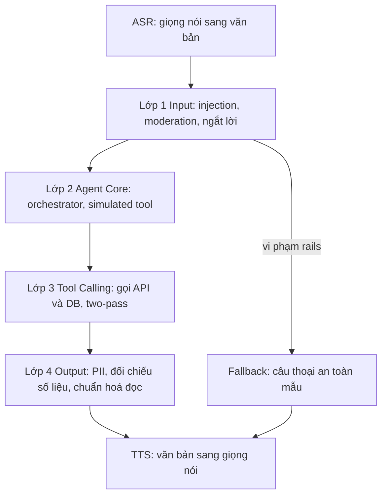

- **Bảng chú giải thành phần**:

| Lớp | Nhiệm vụ chính | Cơ chế đặc trưng (cần FCI xác nhận) |
| :--- | :--- | :--- |
| **Lớp 1 — Input Handling** | Chặn tấn công và phân loại ngắt lời | Prompt injection, moderation, semantic interruption |
| **Lớp 2 — Agent Core** | Điều phối kịch bản nghiệp vụ | *Simulated tool-calling*: chèn hàm giả `what_should_I_do_next` để bám đúng một bước |
| **Lớp 3 — Tool Calling** | Lấy dữ liệu thật, chống bịa số | *Two-pass*: lượt 1 gọi API, lượt 2 viết lại câu theo số liệu thật |
| **Lớp 4 — Output Control** | Bảo vệ đầu ra | Che PII, đối chiếu số liệu factual, chuẩn hoá text cho TTS |
| **Rails Fallback** | Lối thoát an toàn | Bỏ qua agent core, trả câu mẫu khi phát hiện nguy cơ |

---

## T4 — Triết lý phễu đa tầng (multi-solution-stack)

- **Câu chuyện**: khung tư duy áp cho **mọi** tác vụ con. Ca dễ giải ở tầng rẻ, chỉ ca khó mới đẩy lên model đắt. Mục tiêu là giữ latency thấp mà không hy sinh độ chính xác ca khó.

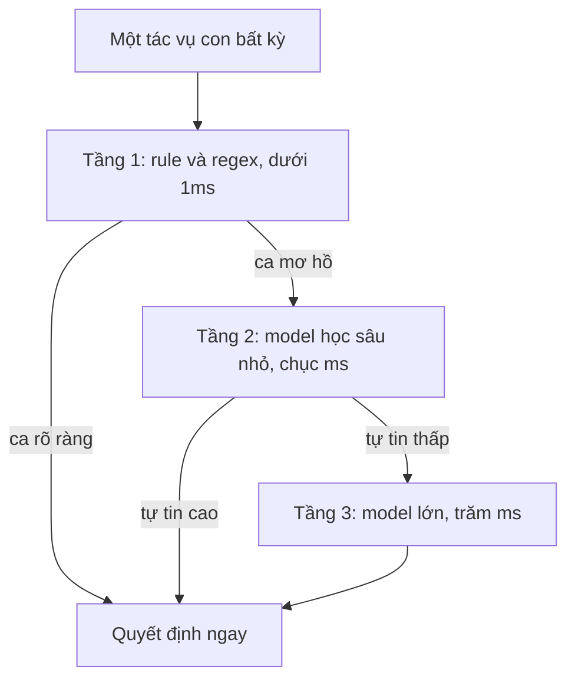

- **Bảng chú giải thành phần** (ví dụ áp cho từng tác vụ):

| Tác vụ | Tầng 1 rule | Tầng 2 model nhỏ | Tầng 3 model lớn |
| :--- | :--- | :--- | :--- |
| **VAD / phân đoạn** | Ngưỡng năng lượng | Silero VAD | — |
| **Ngắt lời** | Từ điển backchannel VN | Smart Turn (prosody) | LLM 7B nhị phân |
| **Chọn công cụ** | Luật định tuyến ý định | Intent classifier nhỏ | LLM sinh lời gọi hàm |
| **Lọc PII đầu ra** | Regex + Luhn | Presidio + PhoBERT-NER | LLM judge đối chiếu |

---

## T5 — Zoom-in front-end âm thanh và chốt chặn tách giọng

- **Câu chuyện**: đây là component quan trọng nhất và cũng là **chốt chặn thật** của bài toán. Trước khi hiểu được lời, phải tách đúng **giọng khách mục tiêu** khỏi nhiễu, người bên cạnh, tiếng TV và echo của chính bot.

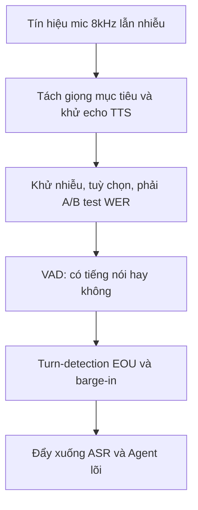

- **Bảng chú giải thành phần**:

| Thành phần | Vai trò | Điểm cần lưu ý |
| :--- | :--- | :--- |
| **Tách giọng mục tiêu** | Chỉ giữ giọng khách được định danh (target-speaker) | **Chốt chặn thật**: open-source còn yếu, license hay kẹt; là nơi Krisp mạnh (xem T11) |
| **Khử echo (AEC)** | Ngăn tiếng bot dội ngược vào mic | Thiếu AEC gây ngắt lời nhầm do echo (ca C3 trong taxonomy) |
| **Khử nhiễu (denoise)** | Làm sạch tín hiệu | ⚠️ Có thể làm **tăng WER**; chỉ khử nhẹ và nuôi nhánh VAD/turn, để ASR ăn audio gốc; bắt buộc A/B test |
| **VAD** | Phân biệt im lặng và tiếng nói | Silero (DNN, 87.7% TPR nhiễu *tự công bố*) tốt hơn WebRTC (~50% TPR nhiễu) |
| **Turn-detection + barge-in** | Quyết định khi nào bot nói / dừng | Chi tiết ở T6, T7, T8 |

---

## T6 — Turn-taking: ba bài toán con

- **Câu chuyện**: "quản lý lượt lời" không phải một bài toán mà là ba, kích hoạt ở các thời điểm khác nhau. Gộp chung là nguồn gốc nhiều lỗi.

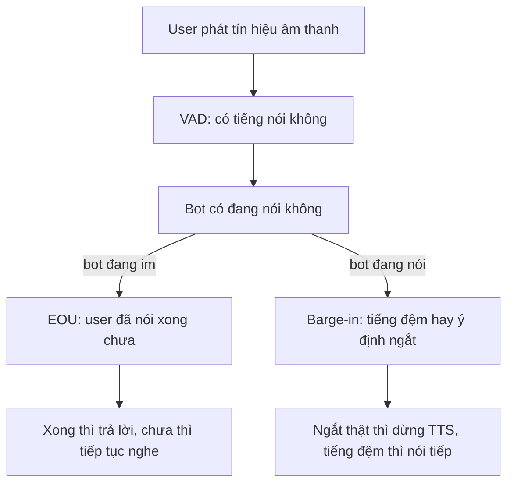

- **Bảng chú giải thành phần**:

| Bài toán con | Câu hỏi cốt lõi | Thời điểm kích hoạt | Cách đo |
| :--- | :--- | :--- | :--- |
| **Turn-detection / EOU** | Khách đã nói xong chưa? | Khi khách vừa ngừng phát âm | Latency phản xạ của bot |
| **Barge-in** | Khách chen ngang, bot có nên dừng TTS? | Khi bot đang nói mà mic có tiếng | Chính xác quyết định ngắt (%) và latency dừng |
| **Semantic interruption** | Tiếng chen là backchannel hay ý định ngắt? | Xảy ra đồng thời trong barge-in | Chính xác nhận diện backchannel (%) |
| **Backchannel (bot phát)** | Bot có nên "dạ, vâng" để thể hiện đang nghe? | Khi khách trình bày câu dài | Độ tự nhiên hội thoại (MOS) |

---

## T7 — Bản chất ngắt lời: sáu chiều và vì sao word-check sập

- **Câu chuyện**: một sự kiện chen tiếng không phải nhị phân phẳng, nó là toạ độ trong **không gian 6 chiều**. Bộ so khớp từ khoá (word-check) chỉ nhìn được nhánh bề mặt nên sập ở ca khó.

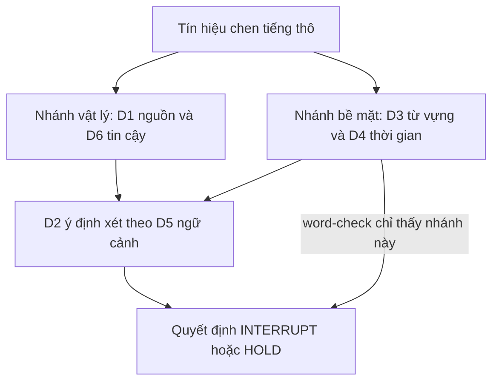

- **Bảng chú giải thành phần**:

| Chiều | Câu hỏi | Thấy được từ text thuần? |
| :--- | :--- | :--- |
| **D1 — Nguồn phát** | Âm này từ đâu (khách, người bên cạnh, TV, echo)? | Một phần, cần diarization |
| **D2 — Ý định** | Khách muốn giành lượt hay chỉ đệm? | **Không**, cần ngữ cảnh |
| **D3 — Đánh dấu bề mặt** | Ý định lộ ra trên từ vựng thế nào? | Có, nhưng thiếu |
| **D4 — Quan hệ thời gian** | Chen vào lúc nào so với lời bot? | Có (timing) |
| **D5 — Ngữ cảnh hội thoại** | Bot đang hỏi slot hay đọc đoạn dài? | **Không**, cần dialog-state |
| **D6 — Độ tin cậy** | Tín hiệu và nhãn có đáng tin? | **Không**, cần confidence |

- **Chốt**: ba chiều quyết định nhãn (D2, D5, D6) đều **không** thấy từ text thuần. Ví dụ kinh điển: từ **"vâng"** — khi bot đọc đoạn dài là backchannel (HOLD), ngay sau khi bot hỏi "anh đồng ý chứ?" lại là câu trả lời (INTERRUPT). Đòn bẩy rẻ nhất là bơm **D5 dialog-state** vào bộ quyết định.

---

## T8 — Phễu ba tầng cho barge-in dưới ngân sách 150ms

- **Câu chuyện**: dùng model LLM 7B để quyết ngắt lời tốn ~280ms, **chắc chắn vỡ** ngân sách ≤150ms. Giải pháp là phễu: xử nhanh ca rõ ở tầng thấp, chỉ đẩy ca khó lên LLM.

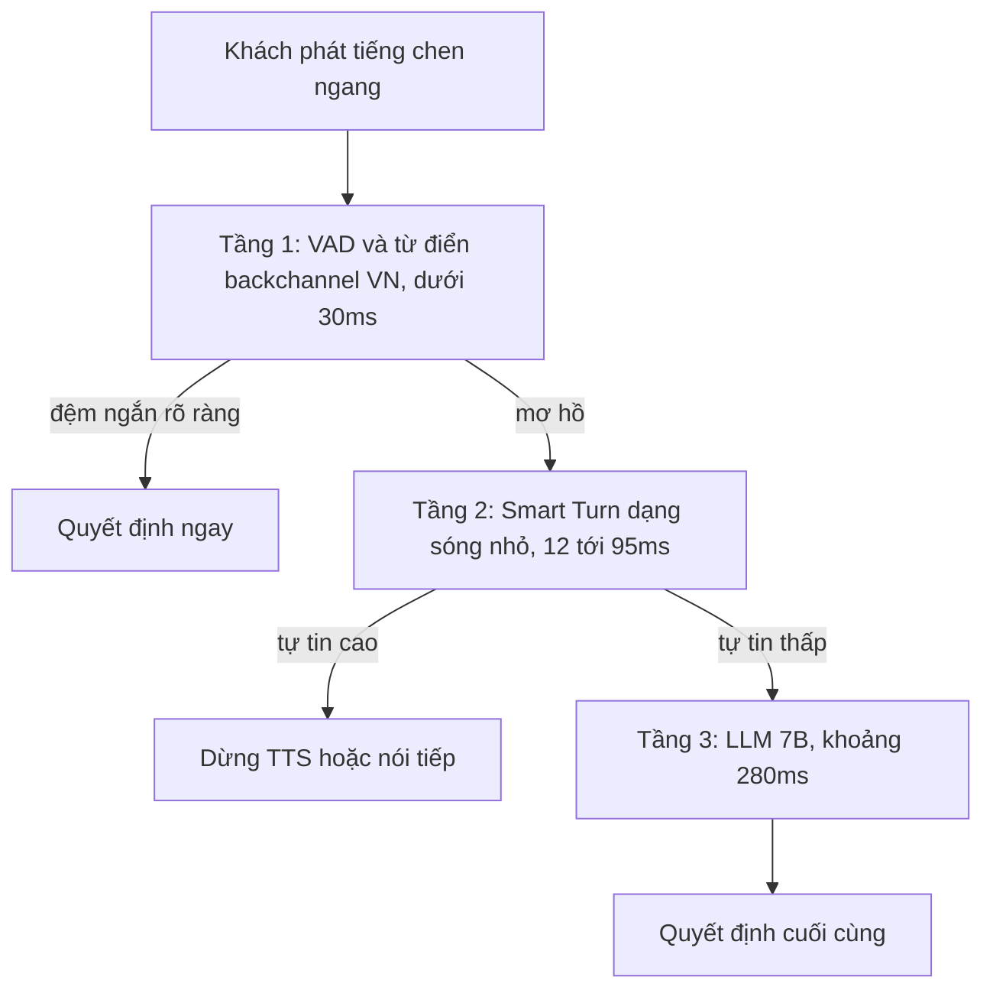

- **Bảng chú giải thành phần**:

| Tầng | Công cụ | Độ trễ | Bản quyền / lưu ý |
| :--- | :--- | :--- | :--- |
| **Tầng 1** | Từ điển backchannel tiếng Việt + VAD | <30ms | Rẻ nhất, giải phần lớn ca đệm rõ ràng |
| **Tầng 2** | Smart Turn v3 (Whisper-tiny ~8M, prosody) | 12–95ms *tự công bố* | BSD-2, chạy CPU; có tiếng Việt 81.27% nhưng FP 14.84%, huấn luyện ở 16kHz sạch → **phải fine-tune 8kHz** |
| **Tầng 3** | LLM 7B nhị phân | ~280ms | Chỉ dùng cho ca khó còn lại; đây là nút thắt latency hiện tại |
| **Ngân sách** | Tổng cộng ≤150ms | — | Phễu giúp phần lớn cuộc gọi dừng ở Tầng 1–2 |

---

## T9 — Tool-calling: simulated tool và two-pass

- **Câu chuyện**: điểm đau #2. Bot dễ chọn sai hàm, điền sai tham số, hoặc bịa số liệu. Hai cơ chế FCI dùng: chèn hàm giả để bám kịch bản, và two-pass để ép lấy số thật.

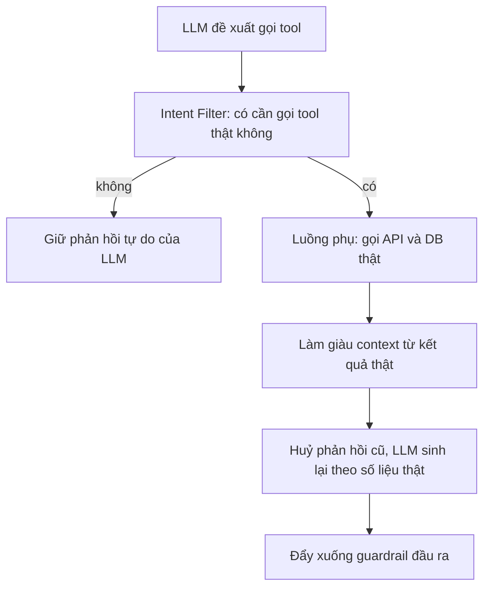

- **Bảng chú giải thành phần**:

| Thành phần | Vai trò | Đánh đổi |
| :--- | :--- | :--- |
| **Simulated tool-calling** | Chèn hàm giả `what_should_I_do_next` để bot bám đúng một bước kịch bản | Nếu schema các bước lệch nhau có thể nhiễu suy luận model |
| **Intent Filter** | Quyết có thật sự cần gọi API không | Sai ở đây thì hoặc bịa số hoặc gọi thừa |
| **Two-pass response** | Lượt 1 lấy dữ liệu thật, lượt 2 viết lại câu | Tăng gần gấp đôi độ trễ (TTFT); chỉ bật khi cần truy vấn số liệu |
| **Chống ảo giác số liệu** | Ép câu trả lời bám dữ liệu API | Là lý do phải two-pass thay vì để LLM tự đoán |

---

## T10 — Ba tầng chất lượng tool-call và XGrammar

- **Câu chuyện**: khoảng cách 62% → 90% không nằm ở định dạng JSON. Phải tách lỗi làm ba tầng để biết vá chỗ nào; XGrammar chỉ vá tầng cú pháp.

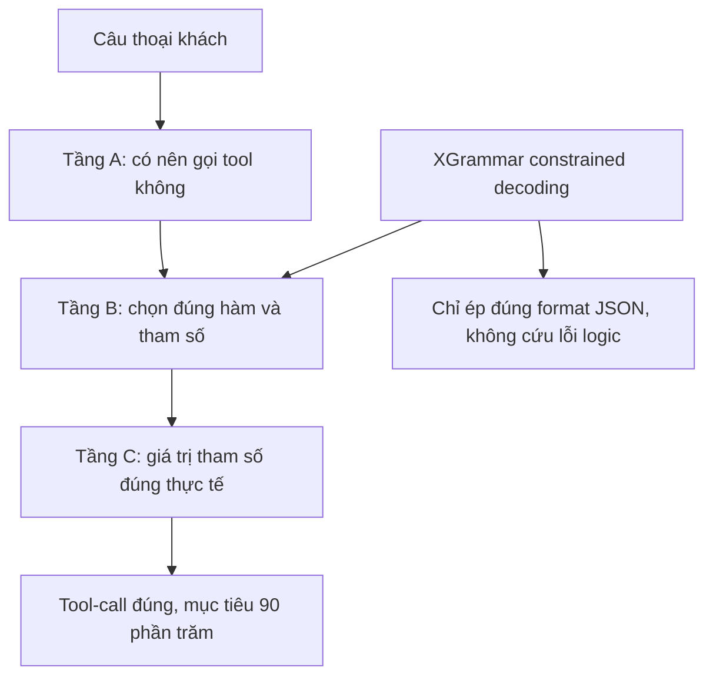

- **Bảng chú giải thành phần**:

| Tầng chất lượng | Loại lỗi | Công cụ vá |
| :--- | :--- | :--- |
| **Tầng A — Quyết gọi** | Gọi tool khi không cần, hoặc quên gọi | Prompt, intent classifier |
| **Tầng B — Chọn hàm và cú pháp** | Sai hàm, sai tên tham số, JSON hỏng | **XGrammar** chỉ vá được JSON format, tiệm cận 100% cú pháp |
| **Tầng C — Grounding giá trị** | Điền đúng cú pháp nhưng sai giá trị thực tế | Cần dữ liệu, RAG, model tốt hơn |
| **BFCL V4 harness** | Đo lường tách lỗi | So khớp cây cú pháp (AST) để biết % lỗi format vs lỗi logic |

- **Chốt**: phần lớn thiếu hụt 28% nằm ở **Tầng B–C (logic và giá trị)**, không phải format. Ưu tiên đo bằng BFCL trước khi bật XGrammar.

---

## T11 — Build-vs-Buy: Krisp (mua) và open-source (tự xây)

- **Câu chuyện**: chốt chặn "tách giọng mục tiêu dưới nhiễu" là chỗ khó nhất. Có hai hướng: mua SDK thương mại Krisp, hoặc tự xây theo blueprint. Quyết theo khả thi × hiệu quả × chi phí.

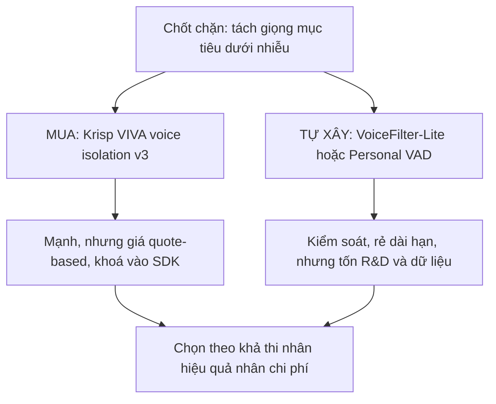

- **Bảng chú giải thành phần**:

| Hướng | Đại diện | Ưu | Nhược |
| :--- | :--- | :--- | :--- |
| **Mua — Krisp** | VIVA SDK (Voice Isolation, Turn/Interruption Prediction, VAD) | Dẫn đầu thương mại, bundle sẵn các module | Giá SDK **quote-based** không công khai; chỉ Voice Translation API có giá công khai (~$0.09–0.12/phút *tham chiếu độ lớn*) |
| **Tự xây — target-speaker** | VoiceFilter-Lite, Personal VAD (blueprint Google) | Kiểm soát, rẻ dài hạn | Không có code sẵn, tốn R&D + dữ liệu enroll giọng |
| **OSS thành phần đã chín** | Silero VAD (MIT, 8kHz), Smart Turn v3 (BSD-2, có vi) | Dùng được ngay cho VAD và EOU | Không giải được phần tách giọng mục tiêu |
| **OSS còn kẹt** | SpeakerBeam (eval-only), USEF-TSE (CC-BY-NC), WeSep (no license) | Ý tưởng tốt | License chặn thương mại hoặc chưa realtime |

- **Chốt**: VAD và EOU dùng OSS sạch license; **chốt chặn tách giọng thì hoặc mua Krisp hoặc tự xây theo blueprint** — đây là quyết định lớn cần cân với FCI.

---

## ✅ Tự kiểm nhanh

1. Vì sao tổng đài tài chính chọn Cascade thay vì S2S dù S2S trễ thấp hơn?

- Cascade cho phép **tách lớp guardrail** (chặn injection, che PII, đối chiếu số liệu) và **kiểm soát tool-calling** chặt chẽ — hai yêu cầu bắt buộc của nghiệp vụ tài chính.
- S2S nhét logic vào trọng số model nên khó chèn luật và chưa có cơ chế an toàn PII đồng bộ.

2. Đâu là "chốt chặn thật" của bài toán ngắt lời, và vì sao không nằm ở tầng turn-detection?

- Chốt chặn thật nằm **sớm hơn**, ở tầng **tách giọng mục tiêu (target-speaker) trong front-end âm thanh**.
- Nếu không tách đúng giọng khách khỏi nhiễu, người bên cạnh, TV và echo, thì mọi phân tích ý định phía sau (turn-detection) đều dựa trên tín hiệu sai (chiều D1).

3. XGrammar có đủ để đưa tool-calling từ 62% lên 90% không?

- Không. XGrammar chỉ ép **đúng định dạng JSON** (Tầng B cú pháp), tiệm cận 100% về format.
- Phần lớn khoảng cách nằm ở **Tầng B–C logic và giá trị** (chọn sai hàm, điền sai giá trị) — phải vá bằng prompt, dữ liệu và model tốt hơn, đo tách lỗi bằng BFCL trước.

