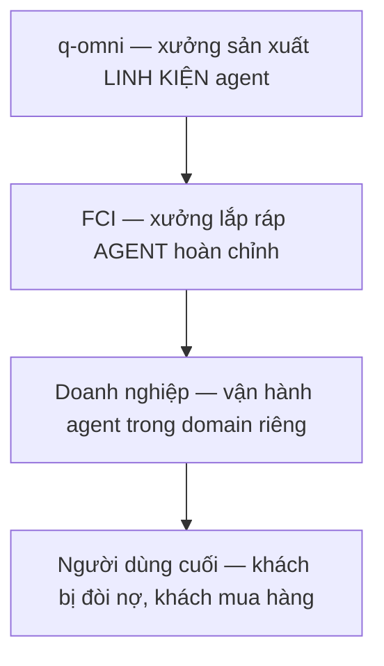
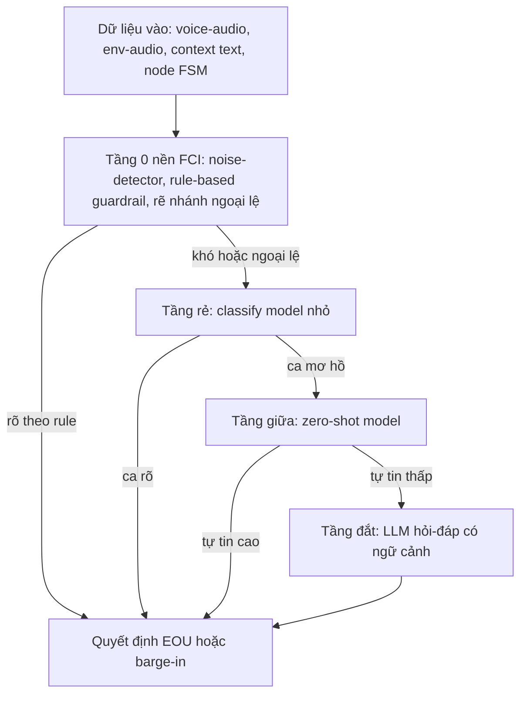
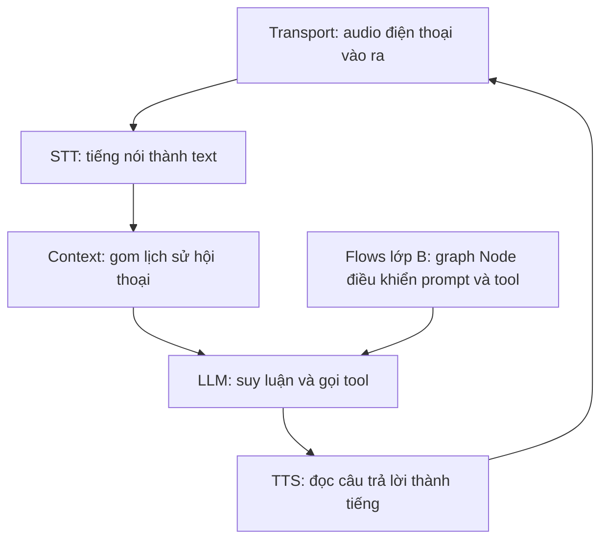
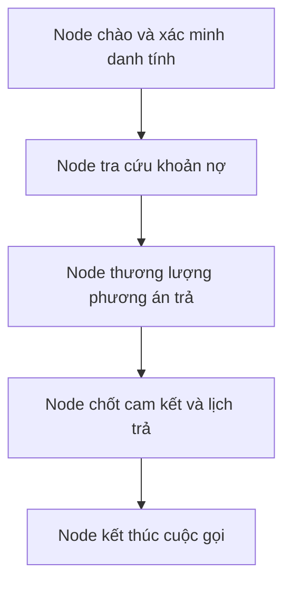
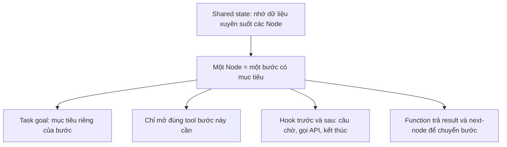

# 01 — Pitch FCI: từ linh kiện q-omni tới giá trị khách hàng (customer-first, từng lớp)

> **Vai trò:**
>
> - Định vị vai trò của linh kiện q-omni trong chuỗi giá trị customer-first.
>
> - Xác định bài toán cốt lõi và định hướng giải quyết cho hệ thống voice-agent.

> **Tài liệu đọc kèm:**
>
> - Chi tiết kỹ thuật 11 chủ đề tại [00_deck_voice_agent.md](00_deck_voice_agent.md).
>
> - Tài liệu hiện tại đóng vai trò định hướng chiến lược.
>
> - Tài liệu [00_deck_voice_agent.md](00_deck_voice_agent.md) đóng vai trò là phụ lục kỹ thuật chi tiết.

> **Quy ước số liệu:**
>
> - Toàn bộ số liệu tự công bố hoặc chưa qua kiểm chứng độc lập đều được gắn nhãn rõ ràng.

## Glossary

- **q-omni**:
  - Lab nghiên cứu QASI Multimodal.
  - Chịu trách nhiệm thiết kế và sản xuất linh kiện AI-agent.
  - Các linh kiện bao gồm perception, reasoning và serving components.
- **Open-end conversation**:
  - Cuộc hội thoại mở.
  - Không thiết lập mục tiêu nghiệp vụ cố định.
- **Oriented conversation**:
  - Cuộc hội thoại có định hướng.
  - Xác định mục tiêu nghiệp vụ cụ thể như đòi nợ, chốt sale hoặc đặt lịch.
- **EOU (End-of-Utterance)**:
  - Cơ chế nhận biết khách hàng đã kết thúc câu nói.
  - Làm cơ sở để kích hoạt phản hồi của bot.
- **Barge-in**:
  - Hành vi khách hàng nói chen ngang khi bot đang phát thoại.
- **FSM (Finite State Machine)**:
  - Máy trạng thái hữu hạn.
  - Dùng để biểu diễn và kiểm soát luồng hội thoại.
- **Flow-management**:
  - Cơ chế quản lý luồng hội thoại theo mô hình Pipecat.
  - Quản lý đồ thị các node, cơ chế gọi công cụ (tool-calling) và bộ nhớ dùng chung (shared state).
- **Tool-calling**:
  - Hành vi gọi hàm hoặc API để truy vấn dữ liệu thực tế.
  - Ngăn ngừa tình trạng mô hình sinh dữ liệu giả (ảo giác).
- **Guardrail (rule-based)**:
  - Luật bảo vệ dạng cứng.
  - Thiết lập để rẽ nhánh xử lý các tình huống vi phạm an toàn hoặc ngoại lệ.
- **Noise-detector**:
  - Bộ phát hiện loại nhiễu và cường độ nhiễu môi trường.
  - Định hướng lựa chọn nhánh xử lý tín hiệu phù hợp.

## 1. Chuỗi giá trị customer-first — bốn lớp

- **Hướng dẫn đọc sơ đồ**:
  - Mũi tên chỉ hướng phục vụ đi xuống.
  - Lớp phía dưới đóng vai trò là khách hàng trực tiếp của lớp ngay phía trên.

| Lớp | Mục tiêu của lớp | Khách hàng | Thước đo thành công |
| :--- | :--- | :--- | :--- |
| **q-omni** | sản xuất **linh kiện** agent đạt chuẩn ghép | FCI | linh kiện đo được + ghép được vào agent FCI |
| **FCI** | lắp ráp **agent hoàn chỉnh** theo domain | doanh nghiệp | agent chạy được nghiệp vụ khách |
| **Doanh nghiệp** | **chuyển đổi cao hơn, chi phí thấp hơn** trong domain | người dùng cuối | tỉ lệ chuyển đổi + chi phí mỗi cuộc |
| **Người dùng cuối** | được phục vụ tốt và nhanh hơn | — | trải nghiệm cuộc gọi |

- **Giá trị của linh kiện q-omni**:
  - Chỉ được chứng minh khi kết nối đến đỉnh chuỗi giá trị customer-first.
  - Cải tiến kỹ thuật ở turn-detector hoặc reasoning phải chuyển đổi thành **tỉ lệ chuyển đổi cao hơn** cho doanh nghiệp.
  - Sẽ vô giá trị nếu chỉ dừng lại ở mức độ demo độc lập trong phòng lab.
- **Hệ quả trong việc chọn bài toán**:
  - Ưu tiên phát triển các linh kiện nằm trên **đường rò rỉ hiệu năng** của agent (Phần 2).
  - Đánh giá chất lượng bằng thước đo thực tế của lớp dưới thay vì chỉ dùng metric nội bộ.

## 2. Bài toán key — gọi agent ra hiệu quả hơn

- **Điểm rò rỉ #1 — Turn-detection (Bắt nhịp lượt lời)**:
  - Xảy ra khi bot cắt lời khách hàng hoặc phản hồi quá trễ.
  - Gây ra trải nghiệm hội thoại gượng gạo khiến khách hàng cúp máy.
  - Thách thức lớn khi gặp môi trường nhiễu kênh truyền 8kHz.
  - Nhiễu bao gồm tiếng người nói xung quanh, tiếng TV hoặc hiện tượng dội âm (echo) của chính bot.
- **Điểm rò rỉ #2 — Agent-reasoning (Bộ não suy luận)**:
  - Xảy ra khi bot lựa chọn sai bước kịch bản, bịa số liệu hoặc lạc đề.
  - Dẫn đến việc không hoàn thành được nghiệp vụ cuộc gọi.
  - Đặc biệt phức tạp trong các cuộc hội thoại định hướng nghiệp vụ (oriented).
- **So sánh Oriented và Open-end**:
  - **Hội thoại Open-end**:
    - Không xác định mục tiêu cụ thể.
    - LLM được tự do phản hồi theo ngữ cảnh.
    - Dễ triển khai nhưng khó kiểm soát hiệu quả kinh doanh.
  - **Hội thoại Oriented**:
    - Mỗi câu thoại phải thúc đẩy tiến trình hướng tới mục tiêu nghiệp vụ.
    - Đòi hỏi bộ suy luận kiểm soát chặt chẽ từng bước đi và gọi công cụ chính xác.
    - **Nguồn gốc sinh ra tỉ lệ chuyển đổi** và giá trị kinh tế trực tiếp cho doanh nghiệp.

| Bài toán | Câu hỏi lõi | Đặc biệt khó khi | Rò rỉ về đâu |
| :--- | :--- | :--- | :--- |
| **Turn-detection** | khách nói xong chưa, có chen ngang không | môi trường nhiễu | trải nghiệm gượng → khách bỏ máy |
| **Agent-reasoning** | bước tiếp theo đúng mục tiêu là gì | hội thoại oriented | không chốt được → mất chuyển đổi |

- **Liên kết kỹ thuật**:
  - Vòng lặp cuộc gọi và vị trí hai điểm rò rỉ trong pipeline được trình bày chi tiết tại [00_deck_voice_agent.md](00_deck_voice_agent.md) (các phần T1, T6).

## 3. Hướng giải — từ rẻ tới đắt

> **Triết lý phễu lọc:**
>
> - Tận dụng triệt để mọi nguồn dữ liệu sẵn có.
>
> - Giải quyết các ca đơn giản tại tầng xử lý chi phí thấp.
>
> - Chỉ chuyển tiếp các ca phức tạp lên các mô hình đắt tiền.

> **Tầng cơ bản hiện tại:**
>
> - Giữ nguyên nền tảng FCI đang vận hành (noise-detector, rule-based guardrail).
>
> - Tích hợp thêm các linh kiện học máy của q-omni lên trên để xử lý ngoại lệ.

### 3.1 Turn-detection — tận dụng dữ liệu và phễu mô hình

- **Khai thác dữ liệu sẵn có**:
  - Dữ liệu âm thanh giọng nói (voice-audio) của khách hàng mục tiêu.
  - Dữ liệu âm thanh môi trường (env-audio) như nhiễu nền và tiếng TV.
  - Ngữ cảnh cuộc hội thoại (conversation-context) dạng văn bản.
  - Trạng thái hiện tại trong kịch bản (node FSM).
- **Phân cấp giải pháp từ rẻ đến đắt**:
  - **Tầng 0 (Nền FCI)**:
    - Sử dụng bộ lọc nhiễu (noise-detector) kết hợp rule-based guardrail.
    - Rẽ nhánh xử lý riêng cho các tình huống ngoại lệ hoặc khó xác định.
  - **Tầng rẻ**:
    - Sử dụng mô hình phân loại (classify model) kích thước nhỏ.
    - Thực hiện suy luận nhanh dựa trên các đặc trưng âm học sẵn có.
  - **Tầng giữa**:
    - Sử dụng mô hình zero-shot để tối ưu hóa thời gian huấn luyện.
  - **Tầng đắt**:
    - Kích hoạt LLM lớn để phân tích hỏi-đáp có kèm đầy đủ ngữ cảnh.
    - Chỉ áp dụng cho các ca cực khó còn sót lại.
- **Định vị đóng góp của q-omni**:
  - Không thay thế tầng 0 hiện hữu của FCI.
  - Thiết lập thêm các tầng học máy bổ trợ xếp lên trên.
  - Tiếp nhận xử lý các ca rẽ nhánh do tầng 0 bàn giao qua.

- **Hướng dẫn đọc sơ đồ**:
  - Tầng 0 rule-based của FCI xử lý đại đa số các ca rõ ràng.
  - Chỉ các ca khó hoặc ngoại lệ mới chuyển tiếp lên các tầng ML.
  - Ca mơ hồ sâu mới leo lên tầng LLM đắt tiền.
  - Cơ chế này giúp giữ độ trễ thấp mà không ảnh hưởng tới chất lượng xử lý ca khó.
- **Tài liệu tham khảo**:
  - Chi tiết về hệ thống đánh giá turn-detection nội bộ tại [04_turn_detection.md](../11_sim_test_system/04_turn_detection.md).

### 3.2 Tool-calling và reasoning — chuyển dịch sang flow-management

- **Dữ liệu đầu vào**:
  - Tận dụng đầy đủ các chiều thông tin như ngữ cảnh, trạng thái, node hiện tại và kết quả gọi hàm.
- **Hạn chế của kiến trúc cũ (FSM-based-LLM)**:
  - Nhồi nhét toàn bộ kịch bản và danh sách công cụ vào một prompt khổng lồ.
  - Dẫn đến việc LLM dễ lạc mục tiêu và chọn sai công cụ.
  - Gây khó khăn lớn cho việc kiểm soát hành vi và gỡ lỗi (debug).
- **Giải pháp chuyển dịch sang Flows (Pipecat)**:
  - **Lớp A — Cơ chế đường ống (Pipeline)**:
    - Luồng truyền tải dữ liệu dạng streaming: Audio → STT → Context → LLM → TTS.
    - Cho phép thay thế linh hoạt các provider thành phần mà không ảnh hưởng tới nghiệp vụ.
  - **Lớp B — Logic hội thoại (Flows)**:
    - Quản lý hội thoại dưới dạng đồ thị các Node (graph of nodes).
    - Cập nhật linh hoạt prompt và công cụ cho LLM tương ứng với từng node cụ thể.

**Sơ đồ 1 — Hai lớp tách biệt (Mental model cốt lõi):**

- **Hướng dẫn đọc Sơ đồ 1**:
  - Chuỗi Transport → STT → Context → LLM → TTS chạy streaming liên tục (Lớp A).
  - Khối Flows (Lớp B) đứng độc lập để quyết định prompt và tool nào LLM được tiếp cận tại mỗi thời điểm.
  - Thay đổi nghiệp vụ kinh doanh không làm ảnh hưởng đến cấu trúc xử lý audio bên dưới.

**Sơ đồ 2 — Lớp B: Biểu diễn hội thoại Oriented thành FSM các Node (ví dụ đòi nợ):**

- **Hướng dẫn đọc Sơ đồ 2**:
  - Mỗi Node chịu trách nhiệm giải quyết trọn vẹn một bước nhỏ trong kịch bản có mục tiêu.
  - Đi qua toàn bộ chuỗi Node tương đương với việc hoàn thành nghiệp vụ cuộc gọi.
  - Đây là phương pháp giúp chuyển đổi hội thoại tự do thành hội thoại oriented.

**Sơ đồ 3 — Cấu trúc chi tiết bên trong một Node:**

- **Hướng dẫn đọc Sơ đồ 3**:
  - Node chỉ được tiếp cận mục tiêu và công cụ đã được chỉ định trước.
  - Giúp loại bỏ hoàn toàn tình trạng prompt của LLM phình to quá cỡ.
  - Trạng thái dùng chung (shared state) lưu trữ thông tin xuyên suốt phiên gọi.
  - Các hook hỗ trợ tự động kích hoạt API hoặc lời thoại chờ mà không cần can thiệp prompt hệ thống.

- **Giá trị cốt lõi mang lại**:
  - Ngăn ngừa tình trạng phình to prompt của LLM.
  - Phân rã nghiệp vụ phức tạp thành các bài toán con độc lập dễ quản lý.
  - Kiểm soát chính xác mục tiêu của từng giai đoạn hội thoại.
  - Dễ dàng chèn thêm các chốt chặn an toàn (guardrail).
- **Thách thức kỹ thuật lớn nhất**:
  - Thiết kế và tự động hóa quá trình dựng cấu trúc FSM chính xác cho từng loại nghiệp vụ.
- **Tài liệu tham khảo**:
  - Đọc về ba tầng chất lượng tool-call tại [03_tool_calling_stages.md](../06_llm_agent/03_tool_calling_stages.md).
  - Đọc về orchestration và state tại [01_orchestration_state.md](../06_llm_agent/01_orchestration_state.md).
  - Tham chiếu kiến trúc Pipecat đầy đủ tại [02_pipecat_reference_architecture.md](../02_architecture/02_pipecat_reference_architecture.md).

### 3.3 Bài toán đáng lẽ phải nêu — chất lượng và chuyển đổi

- **Kiểm soát chất lượng hội thoại**:
  - Xây dựng bộ chỉ số đánh giá chất lượng cho từng cuộc gọi cụ thể.
  - Không chỉ dừng ở việc kiểm tra tính đúng/sai của việc gọi công cụ.
- **Hệ thống hóa hành trình hội thoại**:
  - Biến đổi các cuộc gọi tự do thành luồng hội thoại có mục tiêu đo lường được.
  - Áp dụng cấu trúc quản lý luồng bằng FSM chi tiết ở mục 3.2.
- **Quản lý hiệu quả chuyển đổi**:
  - Kết nối trực tiếp các metric kỹ thuật của linh kiện với tỉ lệ chuyển đổi của doanh nghiệp.
- **Định hướng huấn luyện dài hạn (Gym-training agent)**:
  - Thay vì chỉ sử dụng LLM thương mại để phản hồi linh hoạt.
  - Huấn luyện agent tự học xử lý các tình huống nghiệp vụ trong môi trường giả lập.
  - Tích hợp trực tiếp thước đo chuyển đổi kinh doanh vào vòng lặp tối ưu hóa.
  - Tham khảo môi trường giả lập đã dựng tại [02_gym_env_and_roles.md](../11_sim_test_system/02_gym_env_and_roles.md).

## 4. Các điểm cần thảo luận và thống nhất với FCI

- **Xác định ranh giới bàn giao**:
  - Phân định rõ vai trò sản xuất linh kiện của q-omni và lắp ráp agent hoàn chỉnh của FCI.
- **Lựa chọn thứ tự ưu tiên**:
  - Thống nhất tập trung giải quyết điểm rò rỉ nào trước giữa turn-detection và reasoning.
- **Phân định ranh giới chuyển tiếp**:
  - Thống nhất bộ luật để tầng rule-based của FCI chuyển tiếp các ca khó lên linh kiện q-omni.
- **Đánh giá kiến trúc suy luận của đối tác**:
  - Khảo sát xem FCI đã triển khai mô hình flow-management chưa hay vẫn dùng prompt nguyên khối.
- **Thống nhất hệ chỉ số đo lường**:
  - Đồng bộ phương án quy đổi hiệu suất linh kiện kỹ thuật ra tỉ lệ chuyển đổi kinh doanh của doanh nghiệp.

## ✅ Tự kiểm nhanh

1. Vì sao linh kiện đạt điểm cao trong phòng lab chưa chắc đã mang lại giá trị thực tế?

- **Đo lường bằng hiệu quả kinh doanh**:
  - Linh kiện chỉ có giá trị khi quy đổi được thành tỉ lệ chuyển đổi ở đỉnh chuỗi.
  - Tối ưu hóa các chỉ số kỹ thuật độc lập mà không cải thiện tỷ lệ chốt đơn là vô nghĩa.

2. Điểm khác biệt mấu chốt giữa hội thoại Oriented và Open-end là gì?

- **Hội thoại Oriented**:
  - Xác định rõ mục tiêu nghiệp vụ cụ thể cho từng bước giao tiếp.
  - Yêu cầu bộ suy luận phải liên tục dẫn dắt và kiểm soát hành trình hội thoại.
- **Hội thoại Open-end**:
  - Cho phép người dùng trao đổi tự do không ràng buộc mục tiêu.
- **Tầm quan trọng**:
  - Chỉ có hội thoại oriented mới trực tiếp tạo ra giá trị kinh tế và hiệu quả chuyển đổi cho doanh nghiệp.

3. Cơ chế Flow-management giải quyết hạn chế gì của FSM-based-LLM prompt lớn?

- **Phần tách và tối giản**:
  - Tách biệt prompt và công cụ theo từng Node nhỏ thay vì nhồi nhét tất cả vào một prompt lớn.
- **Hiệu quả**:
  - Loại bỏ tình trạng prompt phình to gây nhiễu suy luận.
  - Cho phép quản lý trạng thái qua shared state và dễ dàng tích hợp các chốt chặn an toàn (guardrail).

