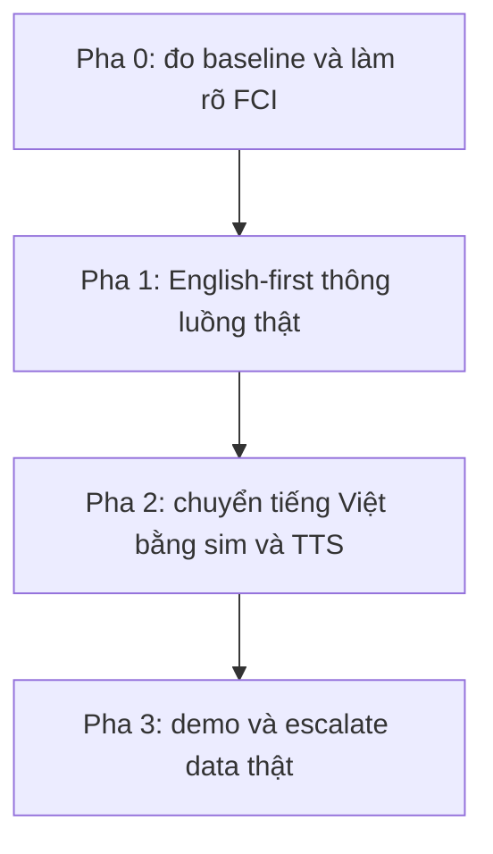

# 13.00 — Kế hoạch delivery: lộ trình có mốc và cổng nghiệm thu

> **Vai trò:**
>
> Gom định hướng đang rải rác thành một roadmap có mốc thời gian và cổng nghiệm thu.
>
> Chỉ thêm phần còn thiếu là timeline và acceptance-gate; phần khảo sát chi tiết trỏ về doc gốc, không chép lại.

---

## 1. Dẫn dắt bối cảnh

- Team đang phối hợp FCI vận hành callbot tổng đài tiếng Việt:
  - hai điểm đau đã chốt là tool-calling khoảng 62 phần trăm và turn-interruption 76 phần trăm ở 280ms,
  - phần còn lại của hệ đã đạt ngưỡng CCU 100 nên không đụng.
- Hai ràng buộc thực tế định hình cả kế hoạch:
  - FCI chỉ cấp được data adhoc test nội bộ, KHÔNG cho chạm data khách thật, muốn thì phải escalate cấp cao,
  - nên phải tự chủ bằng data public cộng simulate cộng generate, chấp nhận chạy English trước rồi mới sang tiếng Việt.

> Kế hoạch này xếp các hạng mục đã khảo sát thành bốn pha có cổng nghiệm thu, theo tinh thần give-first và verify-first: chứng minh giá trị bằng demo trước khi xin thêm tài nguyên và data thật.

---

## 2. Nguyên tắc lõi

- **Give-first:** dựng được thứ chạy và đo được trước, để lấy niềm tin rồi mới xin data khách thật.
- **Verify-first:** mọi module phải có verifier tất định cộng gym-env sim để tự đo, không phụ thuộc data FCI.
- **English-first:** thông luồng và calibrate phương pháp bằng data EN sẵn có, số tuyệt đối tiếng Việt để tầng nghiệm thu sau.
- **Giữ khung, thay ruột:** giữ framework orchestrator, chỉ thay model ở các adapter mỏng; không fork.
- **Phễu giảm tải:** rule rẻ trước, model nhỏ giữa, LLM lớn sau, cho từng tác vụ.

---

## 3. Bốn pha có cổng nghiệm thu

**Khung đọc sơ đồ:**
- **Đề bài:** đi từ đo được, sang chạy thật EN, sang tiếng Việt, tới demo lấy data.
- **Cách đọc:** mỗi pha mở khi pha trước qua cổng; không nhảy cóc.

### 3.1 Pha 0 — đo baseline và làm rõ thông tin FCI

- **Việc:**
  - gửi bản request thông tin cho FCI, xem [01_fci_info_requests.md](01_fci_info_requests.md),
  - dựng harness đo tách lỗi tool-calling 5 tầng trên scenario EN, xem [../06_llm_agent/03_toolcall_accuracy_breakdown.md](../06_llm_agent/03_toolcall_accuracy_breakdown.md),
  - tái dùng FastConformer lab làm baseline ASR, bật entropy confidence NeMo.
- **Cổng nghiệm thu:**
  - có bản request đã gửi FCI,
  - có bảng phân rã 62 phần trăm tool-calling thành 5 metric trên tập EN,
  - baseline ASR chạy được trên clip 8kHz upsample.

### 3.2 Pha 1 — English-first thông luồng thật

- **Việc (bám shortlist [02_priority_shortlist.md](02_priority_shortlist.md)):**
  - dựng audio renderer v1 để có latency THẬT thay số synthetic của harness turn-detection,
  - baseline Silero VAD cộng Smart Turn v3 trên data EN cộng renderer,
  - baseline target-speaker bằng ECAPA-TDNN trên Libri2Mix 8kHz,
  - đóng vòng tool-calling với XGrammar và Instructor trên scenario EN.
- **Cổng nghiệm thu:**
  - turn-detection có số latency THẬT mili-giây, không còn synthetic,
  - mỗi module có verifier tất định và số baseline EN tái lập được.

### 3.3 Pha 2 — chuyển tiếng Việt bằng sim và TTS

- **Việc (bám [03_data_generation_plan.md](03_data_generation_plan.md)):**
  - nhánh research TTS: chốt license cộng benchmark cộng prosody trước khi sinh hàng loạt,
  - generate kịch bản tiếng Việt có nhãn mili-giây cho barge-in cộng trace tool-calling,
  - fine-tune Smart Turn VI cộng EOU text-first, fine-tune ASR 8kHz VI.
- **Cổng nghiệm thu:**
  - có tập sim tiếng Việt đủ chạy 2 điểm đau,
  - số module tiếng Việt vượt baseline hiện tại của FCI trên tập sim.

### 3.4 Pha 3 — demo và escalate data thật

- **Việc:**
  - đóng gói demo chứng minh module vượt mốc FCI 62 phần trăm và 76 phần trăm,
  - dùng demo làm căn cứ escalate xin lát data khách thật để neo số tuyệt đối.
- **Cổng nghiệm thu:**
  - demo chạy end-to-end trên kịch bản tổng đài,
  - có văn bản đề nghị data kèm bằng chứng giá trị.

---

## 4. Bản đồ tài liệu trong thư mục

- [01_fci_info_requests.md](01_fci_info_requests.md) — bản request gửi FCI, gom câu hỏi data và interface và nội tại hệ.
- [02_priority_shortlist.md](02_priority_shortlist.md) — model open-source ưu tiên thử trước theo từng subsystem, cộng dataset public chủ động được.
- [03_data_generation_plan.md](03_data_generation_plan.md) — lộ trình English-first sang tiếng Việt, simulate và generate, nhánh research TTS.

---

## 5. Cross-link các nguồn định hướng đã có

- [../00_INDEX.md](../00_INDEX.md) — trọng tâm tuần và hai trục công việc.
- [../01_survey/00_README.md](../01_survey/00_README.md) — scope lock in và out.
- [../10_implementation/02_e2e_report.md](../10_implementation/02_e2e_report.md) — báo cáo E2E và định hướng ba trục.
- [../11_sim_test_system/01_design.md](../11_sim_test_system/01_design.md) — thiết kế hệ sim.

---

## ✅ Tự kiểm nhanh

- **Vì sao English-first?** → data EN đủ để thông luồng và calibrate phương pháp mà không phụ thuộc data FCI; số tuyệt đối tiếng Việt để tầng nghiệm thu sau.
- **Gap thật mà plan này lấp là gì?** → timeline có mốc cộng cổng nghiệm thu từng pha, phần các nguồn cũ mới liệt kê hạng mục chưa xếp thời gian.
- **Vì sao chưa xin data khách thật ngay?** → give-first, phải demo giá trị trước rồi mới escalate, tránh xin nhiều khi chưa chứng minh.
