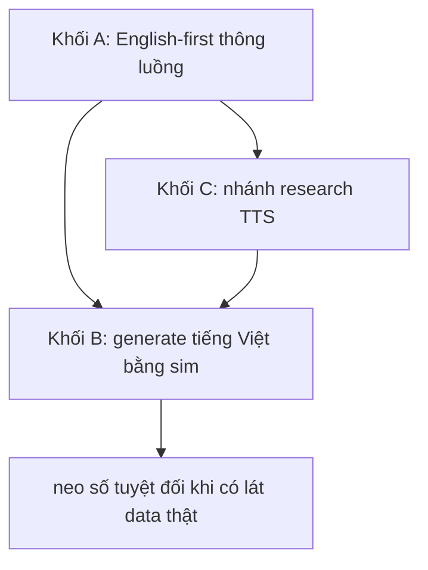

# 13.03 — Lộ trình data English-first sang tiếng Việt bằng sim và TTS

> **Vai trò:**
>
> Vạch đường tự chủ data khi không chạm được data khách thật: chạy English trước, rồi generate tiếng Việt bằng sim và TTS.
>
> Thiết kế chi tiết từng khối đã có ở doc sim và dataset; ở đây xếp thành trình tự việc cộng nhánh TTS còn thiếu.

---

## 1. Dẫn dắt bối cảnh

- Ràng buộc gốc: FCI chưa cho chạm data khách thật, và không có corpus telephony hội thoại 8kHz tiếng Việt công khai.
- Nhưng hạ tầng sim đã đi được nửa đường:
  - đã có gym-env text cộng harness tool-calling cộng harness turn-detection,
  - chưa có renderer audio nên latency vẫn là số mô phỏng, và chưa có bộ sinh kịch bản tiếng Việt.

> Lộ trình này chia ba khối: thông luồng bằng tiếng Anh, dựng bộ generate tiếng Việt, và nhánh research TTS để tự sinh giọng theo kịch bản.

---

## 2. Khối A — English-first thông luồng thật

- ⚙️ **Cơ chế:**
  - dùng data tiếng Anh và quốc tế sẵn có để dựng và validate hạ tầng, không phụ thuộc data tiếng Việt.
- 🔍 **Việc cụ thể:**
  - dựng audio renderer v1: bandpass 300 tới 3400 rồi hạ 8kHz rồi codec như mu-law hoặc AMR, để có latency THẬT thay số synthetic,
  - chạy Silero VAD cộng Smart Turn v3 trên renderer để lấy FP và latency mili-giây thật,
  - chạy target-speaker ECAPA trên Libri2Mix 8kHz,
  - chuyển scenario tool-calling và turn-detection sang tiếng Anh, tái dùng harness đã có.
- 💡 **Ý nghĩa:**
  - có bằng chứng codec-chain augmentation giảm WER nhiều điểm trên telephony tiếng Anh, nên validate phương pháp trên tiếng Anh là hợp lệ.
- ⚠️ **Bẫy:**
  - số tuyệt đối tiếng Anh KHÔNG suy ra cho tiếng Việt; English-first chỉ để thông luồng và chọn cấu hình, không phải để nghiệm thu.

---

## 3. Khối B — generate tiếng Việt bằng sim

- ⚙️ **Cơ chế:**
  - trộn nhiều track tại offset kiểm soát để có nhãn mili-giây miễn phí cho barge-in, và sinh trace tool-calling từ template.
- 🔍 **Việc cụ thể, nối tiếp cái đã có:**
  - bộ sinh kịch bản barge-in có nhãn, đổi track nền để ra ma trận negative,
  - dùng ma trận pairwise để rút hàng chục nghìn tổ hợp xuống khoảng trăm scenario,
  - đo sim-to-real gap bằng tương quan thứ hạng và khoảng cách phân bố đặc trưng.
- 💡 **Ý nghĩa:**
  - đã có harness turn-detection và tool-calling chạy, chỉ cần bơm kịch bản tiếng Việt và renderer để ra số thật.
- ⚠️ **Bẫy:**
  - nhãn cứng phải sinh từ template chứ không để LLM tự quyết, LLM chỉ đa dạng hóa bề mặt câu.
- Đã build và chưa build liệt kê rõ ở [../11_sim_test_system/01_design.md](../11_sim_test_system/01_design.md) và [../08_datasets/02_sim_to_real_data.md](../08_datasets/02_sim_to_real_data.md).

---

## 4. Khối C — nhánh research TTS để sinh giọng theo kịch bản

Đây là nhánh research riêng đúng nghĩa, vì đã có khảo sát nhưng chưa có code sinh và vướng license.

- ⚙️ **Cơ chế:**
  - LLM viết kịch bản, TTS đọc hai vai, rồi trộn kênh; vai bot phải dùng đúng TTS production của FCI để barge-in nghe đúng giọng bot, chỉ vai khách mới đa dạng hóa.
- 🔍 **Việc cụ thể:**
  - chốt license: cả F5-TTS-Vietnamese và viXTTS đều non-commercial, nên với data cho sản phẩm phải cân FPT.AI TTS hoặc tự train,
  - benchmark chất lượng và tốc độ ba lựa chọn TTS trên tình huống FCI, chưa ai đo,
  - dựng cloning đa giọng vùng miền từ ViMD 63 tỉnh cộng pool hội thoại VietSuperSpeech,
  - thêm prosody và disfluency cho negative barge-in như chèn ừ và à và lặp từ.
- 💡 **Ý nghĩa:**
  - TTS mở khóa việc tự sinh tình huống tiếng Việt theo đúng kịch bản nghiệp vụ cần, không chờ data khách.
- ⚠️ **Bẫy:**
  - TTS quá sạch và prosody phẳng gây lệch phân bố so với thoại thật, nên số đo trên TTS không được trích như số production.
- Khảo sát gốc ở [../08_datasets/02_sim_to_real_data.md](../08_datasets/02_sim_to_real_data.md) mục TTS.

---

## 5. Thứ tự và điều kiện chuyển khối

**Khung đọc sơ đồ:**
- **Đề bài:** đi từ thông luồng tiếng Anh sang có số tiếng Việt.
- **Cách đọc:** khối A dựng hạ tầng; khối C cung cấp giọng cho khối B; khối B ra số tiếng Việt trên sim; số tuyệt đối chờ lát data thật.

---

## ✅ Tự kiểm nhanh

- **Vì sao bắt buộc phải generate tiếng Việt?** → không có telephony hội thoại 8kHz tiếng Việt công khai và chưa chạm được data khách.
- **TTS là gap kiến thức hay gap thực thi?** → kiến thức đã khảo, gap là chưa có code sinh và vướng license non-commercial.
- **Vì sao vai bot phải dùng đúng TTS production?** → để barge-in detector nghe đúng giọng bot như thật, chỉ vai khách mới cần đa dạng.
