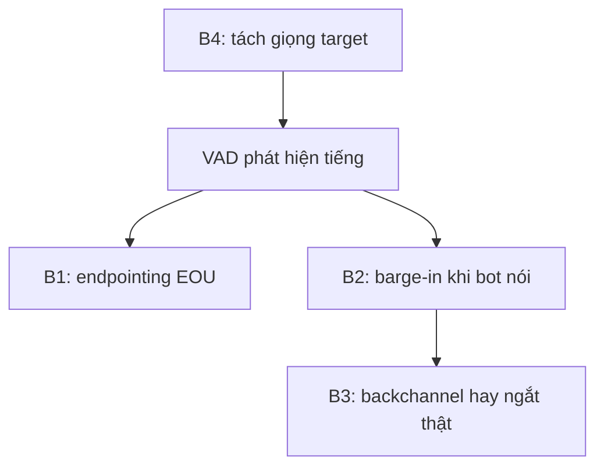
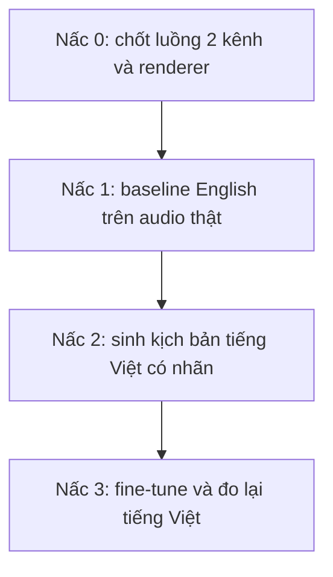

# 14.00 — Kế hoạch delivery turn-detection tách riêng

> **Vai trò:**
>
> Gom riêng nhánh turn-detection thành một folder tự đứng vững để bàn giao sang phiên làm việc khác.
>
> Chỉ phủ turn-taking và tiền xử lý audio phục vụ turn-taking; tool-calling nằm ở folder khác, không nhắc ở đây.

---

## Glossary chung

- `VAD` → **Voice Activity Detection** → phát hiện có tiếng nói hay không trong khung âm thanh.
- `EOU` → **End-Of-Utterance** → mốc người nói xong một lượt, còn gọi endpointing.
- `EOT` → **End-Of-Turn** → mốc kết thúc lượt nói, dùng thay nhau với EOU trong nhiều paper.
- `barge-in` → **barge-in** → khách chen lời khi bot đang nói, phải quyết định dừng TTS hay giữ.
- `backchannel` → **backchannel** → tiếng đế "dạ, vâng, ừ" báo đang nghe, không phải ý định ngắt.
- `TSE` → **Target-Speaker Extraction** → tách đúng giọng khách khỏi nhiễu và giọng nền.
- `pVAD` → **personal VAD** → VAD chỉ bật khi đúng giọng target đang nói.
- `AEC` → **Acoustic Echo Cancellation** → khử tiếng bot dội từ loa khách về micro.
- `DTD` → **Double-Talk Detection** → phát hiện khách nói đè lên TTS thật, phân biệt với echo.
- `SIR` → **Signal-to-Interference Ratio** → tỉ lệ giọng target trên giọng chen, tính trên vùng active.
- `SNR` → **Signal-to-Noise Ratio** → tỉ lệ tín hiệu trên nhiễu nền.
- `FP` → **False Positive** → ở đây là ngắt nhầm khi khách chưa thật sự ngắt.

---

## 1. Dẫn dắt bối cảnh

- Callbot tổng đài tiếng Việt có một điểm đau đã chốt ở nhánh xử lý lượt lời:
  - hệ thật báo quản lý lượt lời đúng khoảng **76%** ở độ trễ khoảng **280ms**,
  - đích cam kết là accuracy từ **85%** trở lên và độ trễ phản xạ từ **150ms** trở xuống.
- Nhóm đã dựng được một harness đo turn-detection chạy thật nhưng ở mức text:
  - hai baseline đã đo, `energy_vad` được **65%** còn `semantic_rule` được **100%** trên 17 kịch bản,
  - nhưng độ trễ mili-giây hiện là số mô phỏng, chưa render audio nên chưa phải số cam kết được.

> Vì bài toán này là xử lý voice, chất lượng lời giải phụ thuộc việc **tái hiện đúng luồng tín hiệu lúc chạy thật**, đặc biệt là tách hai luồng audio khách và bot như một cuộc gọi tổng đài thật; folder này xếp toàn bộ việc còn lại quanh đúng ràng buộc đó.

---

## 2. Bốn bài toán con của lượt lời — turn-taking

- **B1 — Turn-detection / endpointing (EOU):**
  - hỏi khách đã nói xong lượt chưa để bot vào lời,
  - đo bằng độ trễ phản xạ và tỉ lệ cắt lời sớm.
- **B2 — Barge-in / interruption:**
  - bot đang nói, micro có tiếng khách, phải quyết dừng TTS hay giữ,
  - đo bằng tỉ lệ ngắt nhầm, tỉ lệ bỏ sót ngắt, độ trễ dừng.
- **B3 — Semantic interruption và backchannel:**
  - phân biệt tiếng đế "dạ, vâng" với ý định ngắt thật,
  - đo bằng tỉ lệ nhận diện đúng backchannel.
- **B4 — Target-speaker isolation (tiền xử lý):**
  - tách đúng giọng khách khỏi giọng nền cùng kênh trước khi phán đoán lượt,
  - đây là tầng đứng trước B1 B2 B3, không phải bài turn-detection nhưng quyết định trần chất lượng.

**Khung đọc sơ đồ:**

- **Đề bài:** đặt bốn bài con đúng thứ tự tín hiệu đi qua lúc chạy thật.
- **Cách đọc:** B4 làm sạch giọng target trước, VAD bật cờ có tiếng, rồi ba nhánh phán đoán lượt dùng chung tín hiệu đã sạch.

---

## 3. Bản đồ tài liệu trong folder

- [01_inference_flow_two_channel.md](01_inference_flow_two_channel.md) — tái hiện luồng infer thật và tách hai luồng audio khách với bot; đây là ràng buộc lõi.
- [02_public_datasets.md](02_public_datasets.md) — dataset public là gì, bắt đầu từ tập nào, tập tiếng Việt lấy được tới đâu.
- [03_subproblems_and_models.md](03_subproblems_and_models.md) — từng bài con và các model public chạy thử lần lượt theo thang leo.
- [04_review_and_acceptance.md](04_review_and_acceptance.md) — Kỳ review và cảm nhận kết quả thế nào, metric và cổng nghiệm thu.
- [05_fci_shared_data_findings.md](05_fci_shared_data_findings.md) — đo thật lát audio FCI chia sẻ, xác nhận barge-in nằm sẵn trong data, kèm ước lượng lượng data nên xin thêm.
- [06_bargein_measurements.md](06_bargein_measurements.md) — bảng số đo thô: 36 file corpus và phân nhóm 39 mốc barge-in của file mẫu (dãy số đã ẩn).

---

## 4. Thứ tự thực thi gợi ý

**Khung đọc sơ đồ:**

- **Đề bài:** đi từ dựng đúng luồng, sang có số thật trên tiếng Anh, sang có nhãn tiếng Việt, tới số tiếng Việt.
- **Cách đọc:** mỗi nấc mở khi nấc trước có bằng chứng chạy được; nội dung từng nấc nằm trong bốn file con.

---

## 5. Cross-link nguồn khảo sát đã có

- [../05_turn_interruption/00_README.md](../05_turn_interruption/00_README.md) — khảo sát rộng bốn bài con và model.
- [../11_sim_test_system/04_turn_detection.md](../11_sim_test_system/04_turn_detection.md) — thiết kế harness và kết quả 65 phần trăm với 100 phần trăm.
- [../08_datasets/02_sim_to_real_data.md](../08_datasets/02_sim_to_real_data.md) — codec-chain 8kHz và sinh barge-in có nhãn.
- [../10_implementation/02_e2e_report.md](../10_implementation/02_e2e_report.md) — pipeline as-built, chỗ VAD và turn còn dùng mặc định.

---

## ✅ Tự kiểm nhanh

- **Vì sao tách folder riêng cho turn-detection?** → đây là nhánh xử lý voice, cần bàn giao gọn sang phiên khác trong khi phiên này quay về ASR tiếng Việt.
- **Bốn bài con là gì?** → endpointing EOU, barge-in, backchannel, và tiền xử lý target-speaker.
- **Số 65 phần trăm và số 76 phần trăm khác nhau ra sao?** → 65 phần trăm là số harness thực đo, 76 phần trăm là điểm đau của hệ thật; không được trộn.
