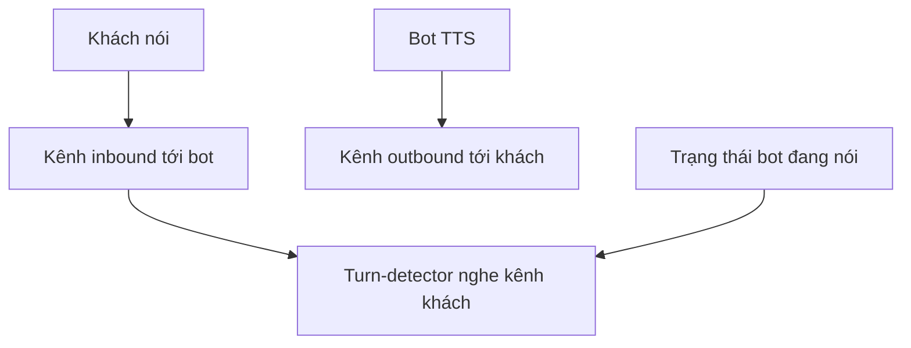
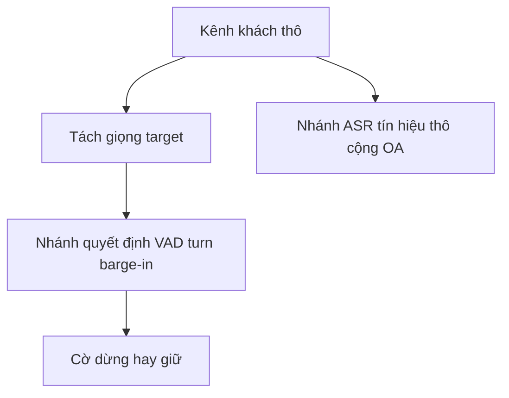

# 14.01 — Tái hiện luồng infer thật và tách hai luồng audio

> **Vai trò:**
>
> Chốt ràng buộc lõi trước khi chọn model hay dataset: sim phải tái hiện đúng đường tín hiệu lúc chạy thật.
>
> Trọng tâm là tách hai luồng audio khách và bot như một cuộc gọi tổng đài thật, vì sai luồng thì mọi con số đo được đều lệch.

---

## Glossary

- `leg` → **call leg** → một chặng kết nối trong cuộc gọi, mỗi bên có một chặng riêng.
- `inbound` → **inbound leg** → chặng mang âm thanh từ phía khách vào hệ thống.
- `outbound` → **outbound leg** → chặng mang âm thanh TTS của bot ra phía khách.
- `AEC` → **Acoustic Echo Cancellation** → khử tiếng bot dội từ loa khách về micro.
- `DTD` → **Double-Talk Detection** → phát hiện khách nói đè lên TTS thật, phân biệt echo.
- `LEC` → **Line Echo Canceller** → bộ khử echo trên đường viễn thông, chuẩn G.168.
- `SIR` → **Signal-to-Interference Ratio** → tỉ lệ giọng target trên giọng chen.
- `OA` → **Observation Addition** → cộng lại tín hiệu thô vào nhánh ASR để tránh mất thông tin.

---

## 1. Dẫn dắt bối cảnh

- Harness turn-detection hiện chạy ở mức text nên chưa chạm đúng bài toán vật lý:
  - mỗi sự kiện thoại chỉ là văn bản kèm mốc thời gian và tên người nói,
  - độ trễ mili-giây là số mô phỏng, chưa render sóng âm nên chưa cam kết được.
- Nhưng bản chất turn-taking là bài toán trên sóng âm hai chiều thời gian thực:
  - khách và bot nói xen kẽ, có lúc chồng lấn,
  - quyết định dừng hay giữ phụ thuộc tín hiệu về từ đúng kênh nào.

> Trước khi bàn model, phải trả lời câu hỏi kênh nào mang giọng gì, vì trong tổng đài giọng bot và giọng khách không nằm chung một luồng như thu âm bằng một micro; hiểu sai chỗ này sẽ chọn nhầm cả model lẫn cách sinh data.

---

## 2. Kiến trúc kênh của tổng đài

- ⚙️ **Cơ chế tách kênh sẵn có:**
  - kênh SIP hay PSTN vốn mono theo từng leg, luồng inbound chỉ chứa âm thanh phía khách, còn TTS của bot nằm ở luồng outbound riêng,
  - nguồn: [../05_turn_interruption/05_target_speaker_isolation.md](../05_turn_interruption/05_target_speaker_isolation.md) mục nấc 0 tách kênh.
- 🔍 **Cách nhận diện:**
  - bot chạy ở phía server, không có loa và micro vật lý, nên bot không tự sinh echo acoustic,
  - giọng của chính bot đã bị loại ở mức kiến trúc, không cần một model tách giọng bot ra khỏi giọng khách.
- 💡 **Ý nghĩa:**
  - turn-detector chỉ cần nghe kênh khách, phần biết bot đang nói hay không lấy từ trạng thái hệ thống chứ không phải nhận dạng lại từ audio,
  - ghi âm offline hai kênh tách agent và customer là chuẩn ngành, cho nhãn người nói miễn phí mà không cần diarization.
- ⚠️ **Bẫy:**
  - hai thứ vẫn lọt vào kênh khách và phải xử lý riêng, trình bày ở mục 3 và mục 4,
  - nếu sim gộp giọng bot và giọng khách vào một luồng thì đang mô phỏng sai kiến trúc, số đo sẽ dễ hơn thực tế.

**Khung đọc sơ đồ:**
- **Đề bài:** cho thấy giọng bot không đi vào đường nghe của turn-detector.
- **Cách đọc:** turn-detector ăn kênh inbound cộng một cờ trạng thái bot đang nói, không ăn audio TTS.

---

## 3. Phần thứ nhất còn lọt vào kênh khách là echo

- ⚙️ **Cơ chế echo:**
  - khi khách bật loa ngoài, TTS bot phát ra loa khách rồi dội ngược vào micro khách và quay về đường thu của bot,
  - hệ quả chuỗi hỏng là VAD thấy có tiếng người nên bot tự ngắt chính mình, hoặc STT phiên âm lại câu bot rồi LLM trả lời chính nó, dẫn tới xoáy hội thoại.
- 🔍 **Cách nhận diện:**
  - văn bản thu về giống hệt câu bot vừa phát, năng lượng tương quan cao với buffer TTS đang phát,
  - với SIP trunk số hóa đầu cuối thì line echo gần như biến mất, phần dư chủ yếu là echo acoustic từ handset khách.
- 💡 **Ý nghĩa:**
  - bot có sẵn tín hiệu tham chiếu chính xác vì chính mình sinh ra audio TTS, nên có thể so năng lượng và tương quan giữa buffer TTS và tín hiệu thu về để chặn echo,
  - đây là vai trò double-talk detection ở tầng 0 của phễu barge-in, nguồn [../05_turn_interruption/07_bargein_decision.md](../05_turn_interruption/07_bargein_decision.md).
- ⚠️ **Bẫy:**
  - không đặt bộ khử echo kiểu WebRTC AEC3 ở giữa pipeline server vì thiếu đồng bộ đồng hồ giữa micro và tham chiếu, bộ lọc thích nghi mất hiệu lực,
  - nên khử echo tại biên viễn thông trước khi vào AI, phần AI chỉ làm cổng double-talk, và phải đo độ dội thật trên trunk trước khi giả định.

---

## 4. Phần thứ hai còn lọt vào kênh khách là giọng nền

- ⚙️ **Cơ chế:**
  - người nói nền như người nhà, tivi, đồng nghiệp nằm cùng kênh inbound với khách target,
  - tách theo kênh không chạm tới được vì tất cả cùng một leg.
- 🔍 **Cách nhận diện:**
  - có nhiều giọng trong cùng luồng khách, nhiễu babble giống tiếng nói thật nên STT phiên âm nhầm và turn-detector dễ bắn nhầm,
  - đây mới là đề bài của target-speaker isolation, không phải của turn-detection.
- 💡 **Ý nghĩa:**
  - nếu tách được giọng target khỏi nền thì câu hỏi tiếng này thật hay nhiễu gần như được trả lời trước khi tới barge-in,
  - vì vậy target-speaker isolation là tầng đứng trước, quyết định trần chất lượng của cả ba bài turn-taking.
- ⚠️ **Bẫy:**
  - lọc quá mạnh làm chính tiếng ngắt của khách bị coi là nhiễu và bị bỏ, bot không dừng TTS,
  - nên tách hai nhánh xử lý ở mục 5 thay vì lọc chung một đường.

---

## 5. Kiến trúc hai nhánh khi chạy thật

- ⚙️ **Cơ chế hai nhánh:**
  - nhánh quyết định gồm VAD, turn, barge-in ăn tín hiệu đã tách mạnh để phán đoán nhạy và sạch,
  - nhánh ASR ăn tín hiệu thô hoặc tách nhẹ cộng cơ chế Observation Addition để không mất thông tin ngữ nghĩa.
- 🔍 **Cách nhận diện van chuyển:**
  - chỉ dùng tín hiệu đã tách khi phát hiện có chồng lấn, còn lúc bình thường giữ đường thô,
  - nguồn kiến trúc hai nhánh và van chuyển ở [../05_turn_interruption/05_target_speaker_isolation.md](../05_turn_interruption/05_target_speaker_isolation.md).
- 💡 **Ý nghĩa:**
  - tách nhánh để tối ưu hai mục tiêu ngược nhau, một bên cần nhạy và sạch cho quyết định, một bên cần trung thực cho phiên âm.
- ⚠️ **Bẫy:**
  - ngân sách 150ms chỉ áp cho pha một là tạm dừng, còn pha hai là xác minh cho phép 300ms tới 800ms; đừng ép cả quy trình vào 150ms.

**Khung đọc sơ đồ:**
- **Đề bài:** cùng một kênh khách đi vào hai nhánh với mục tiêu khác nhau.
- **Cách đọc:** nhánh quyết định ăn tín hiệu sạch để nhạy, nhánh ASR ăn tín hiệu thô để trung thực, van chỉ bật tách khi có chồng lấn.

---

## 6. Renderer hai kênh cho sim

- ⚙️ **Cơ chế ba track:**
  - render một kịch bản turn-detection bằng cách cộng ba track, track A là bot TTS đúng giọng production, track B là sự kiện khách chèn tại mốc thời gian kiểm soát và scale theo SIR mục tiêu, track C là nhiễu theo SNR,
  - tổng ba track cho qua chuỗi kênh 8kHz gồm giới hạn băng thoại, hạ tần số lấy mẫu, codec, mất gói, chỉnh mức, nguồn [../08_datasets/02_sim_to_real_data.md](../08_datasets/02_sim_to_real_data.md).
- 🔍 **Hai chế độ render bắt buộc:**
  - chế độ a là kênh khách thuần cộng một timeline trạng thái bot đang nói, để test logic decider mà không lẫn giọng bot,
  - chế độ b là thêm echo-leak của bot vào kênh khách với suy hao khoảng âm 15 tới âm 30 dB để stress-test cổng khử echo.
- 💡 **Ý nghĩa:**
  - nhãn có độ phân giải mili-giây là miễn phí và chính xác tuyệt đối vì mốc ngắt chuẩn chính là thời điểm chèn track B,
  - đây là cách vá đúng chỗ số latency đang synthetic của harness hiện tại.
- ⚠️ **Bẫy:**
  - trộn nhiễu sau codec là lỗi sim phổ biến, trong hệ thật nhiễu môi trường cũng bị codec nén méo như tiếng nói, nên phải trộn nhiễu trước codec,
  - nhãn cứng phải sinh từ template, không để mô hình ngôn ngữ tự quyết nhãn, mô hình chỉ đa dạng hóa bề mặt câu.

---

## 7. Việc cụ thể của nấc luồng audio

- **Chốt tham số kênh trước khi code:**
  - đo độ dội echo thật trên trunk của nhà mạng theo loại thiết bị khách,
  - hỏi nhà mạng có bật khử echo đường dây G.168 không và độ dài đuôi bao nhiêu, không giả định.
- **Dựng renderer hai chế độ:**
  - chế độ kênh khách thuần cộng timeline bot đang nói,
  - chế độ thêm echo-leak để test cổng double-talk.
- **Nối renderer vào harness đã có:**
  - thay số latency synthetic bằng số đo trên sóng âm thật,
  - giữ nguyên scorer ma trận nhầm để so sánh trực tiếp với baseline text.

---

## ✅ Tự kiểm nhanh

- **Vì sao turn-detector không cần tách giọng bot khỏi giọng khách?** → hai giọng đã nằm ở hai leg khác nhau, giọng bot loại ở mức kiến trúc, chỉ cần một cờ trạng thái bot đang nói.
- **Hai thứ nào vẫn lọt vào kênh khách?** → echo acoustic khi khách bật loa ngoài, và giọng nền cùng kênh inbound.
- **Vì sao render phải hai chế độ?** → chế độ kênh thuần để test logic decider, chế độ thêm echo-leak để stress-test cổng khử echo.
