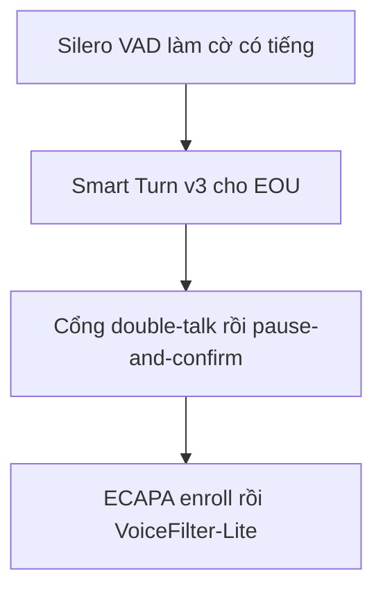

# 14.03 — Bài toán con và model public chạy thử theo thang leo

> **Vai trò:**
>
> Với từng bài con, chốt các model public chạy thử lần lượt từ rẻ tới đắt.
>
> Mỗi model kèm license, tình trạng tiếng Việt và một con số tham chiếu, để biết thử cái gì trước và bỏ cái gì.

---

## Glossary

- `VAD` → **Voice Activity Detection** → phát hiện có tiếng nói.
- `EOU` → **End-Of-Utterance** → mốc người nói xong lượt.
- `pVAD` → **personal VAD** → VAD chỉ bật khi đúng giọng target.
- `TSE` → **Target-Speaker Extraction** → tách đúng giọng khách.
- `EER` → **Equal Error Rate** → điểm cân bằng lỗi nhận và lỗi từ chối giọng.
- `TPR` → **True Positive Rate** → tỉ lệ bắt đúng khung có tiếng.
- `FPR` → **False Positive Rate** → tỉ lệ báo có tiếng khi không có.
- `F1` → **F1 score** → trung bình điều hòa precision và recall.

---

## 1. Dẫn dắt bối cảnh

- Mỗi bài con đã có bảng khảo sát rộng ở layer 05, nhưng chưa xếp thứ tự chạy thử:
  - tiêu chí chọn thử trước là rẻ, có weights mở, license sạch, có đường tới tiếng Việt,
  - mọi số accuracy trong tài liệu đều đo trên băng rộng sạch hoặc tiếng Anh, phải tự đo lại trên 8kHz tiếng Việt.
- Thang leo chung cho mọi bài con là đi từ baseline rẻ tới model nặng:
  - baseline rẻ dựng đường đo và cho số sàn,
  - model mở fine-tune được là đích chính, model nặng chỉ dùng đối chứng khi cần.

> Doc này với mỗi bài con nêu thang ba bốn nấc, chọn một hai model để thử trước làm đầu vào cho nấc English-first rồi tới nấc tiếng Việt.

---

## 2. VAD nền dùng chung

- **Silero VAD là lựa chọn thử trước:**
  - license MIT, chạy 8kHz và 16kHz native, dưới một mili-giây mỗi khung trên CPU,
  - đạt khoảng 87 phần trăm bắt đúng trong nhiễu, có trễ đuôi vài trăm mili-giây cần bù.
- **WebRTC VAD chỉ làm phương án lui:**
  - nhẹ nhưng chỉ khoảng 50 phần trăm bắt đúng trong nhiễu, không đủ cho tổng đài.
- VAD chỉ là cờ có tiếng, không quyết định lượt; quyết định lượt là ba bài dưới.

---

## 3. Bài B1 endpointing EOU

- **Thang leo:**
  - nấc 0 là baseline im lặng cố định để lộ vùng nguy hiểm dưới 400ms,
  - nấc 1 là Smart Turn v3 dùng ngay rồi fine-tune tiếng Việt,
  - nấc 2 là tự train một bộ text-first theo recipe endpoint tiếng Thái,
  - nấc 3 là model 7B chỉ để đối chứng, không đưa vào phễu vì vỡ ngân sách độ trễ.

| Model | Kiểu và kích thước | License và tiếng Việt |
| --- | --- | --- |
| Smart Turn v3 | waveform 8 giây, khoảng 8 triệu | BSD-2, có vi khoảng 81 phần trăm |
| Namo Turn Detector v1 | phân loại lượt | ghi là có vi, cần xác minh |
| bộ text-first tự train | PhoBERT hoặc Qwen 0.6B | tự train, cho tiếng Việt |
| TEN Turn Detection | text, 7 tỉ | Apache kèm ràng buộc, không vi |

- Smart Turn v3 mở cả weights lẫn dữ liệu train nên fine-tune tiếng Việt hợp pháp, đây là đích chính của B1.
- Recipe text-first tham chiếu endpoint tiếng Thái đạt F1 khoảng 0.866 ở 90ms với Qwen 0.6B, gần nhất cho tiếng Việt.
- Đặc thù tiếng Việt là từ kết câu như ạ nhé nhỉ rồi là tín hiệu EOU text rất mạnh, bù cho ngữ điệu yếu do thanh điệu.
- Chi tiết recipe và bẫy nhãn ở [../05_turn_interruption/06_eou_endpointing.md](../05_turn_interruption/06_eou_endpointing.md).

---

## 4. Bài B2 chen lời — barge-in

- **Thang leo:**
  - nấc 0 là cổng double-talk so năng lượng và tương quan với buffer TTS, chặn echo trước,
  - nấc 1 là kiến trúc pause-and-confirm hai pha tự xây, tham chiếu LiveKit,
  - nấc 2 là thêm đặc trưng chồng lấn từ pyannote làm feature cho một bộ phân loại nhỏ.
- **Model và số tham chiếu:**
  - LiveKit adaptive đạt precision 86 phần trăm và recall 100 phần trăm ở cửa sổ chồng lấn 500ms, suy luận dưới 30ms, chưa có số tiếng Việt,
  - Amazon barge-in xác minh chỉ bằng audio nhanh hơn khoảng 38 phần trăm so với baseline dùng thêm ASR,
  - pyannote license MIT có giá trị ở phát hiện chồng lấn, làm đặc trưng chứ không phải bộ quyết định.
- **Ngân sách độ trễ:**
  - 150ms chỉ cho pha một là tạm dừng, pha hai xác minh cho phép 300ms tới 800ms.
- Không framework mã nguồn mở nào công bố xử lý echo ở tầng ứng dụng, nên tầng 0 phải tự làm, nguồn [../05_turn_interruption/07_bargein_decision.md](../05_turn_interruption/07_bargein_decision.md).

---

## 5. Bài B3 backchannel và semantic interruption

- **Cách làm:**
  - phân biệt tiếng đế như dạ vâng ừ với ý định ngắt thật bằng luật từ vựng cộng ngữ cảnh, không chỉ năng lượng,
  - baseline semantic_rule của harness đã đạt 100 phần trăm trên 17 kịch bản text, là điểm khởi động tốt.
- **Model tham chiếu:**
  - Easy-Turn có bốn trạng thái gồm backchannel, mở trainset khoảng 1145 giờ nhưng chỉ tiếng Trung và tiếng Anh, dùng đối chứng recipe,
  - hướng thực dụng là bộ phân loại text-first nhỏ trên tiếng Việt, tái dùng chung với B1.
- Bẫy là backchannel kéo dài và từ vâng đảo nghĩa, phải có trong tập test.

---

## 6. Bài B4 tách giọng khách tiền xử lý — target-speaker

- **Thang leo:**
  - nấc 0 là ECAPA-TDNN làm cờ enroll giọng khách, chưa tách audio,
  - nấc 1 là personal VAD hoặc VoiceFilter-Lite bật cờ theo đúng giọng target,
  - nấc 2 là tách nguồn có hướng dẫn khi cần audio sạch cho nhánh quyết định.
- **Model và số tham chiếu:**
  - ECAPA-TDNN có EER khoảng 6 phần trăm ở 16kHz sạch nhưng tăng mạnh khi xuống 8kHz và cross-talk, phải đo lại,
  - VoiceFilter-Lite cải thiện WER tương đối khoảng 47 phần trăm dưới nhiễu speech chồng lấn, kích thước nhỏ streaming,
  - ClearerVoice-Studio license Apache có weights cho 8kHz và 16kHz, hợp làm bộ tách thử.
- **Enrollment thực dụng:**
  - lấy 2 tới 4 giây câu đáp đầu của khách làm enroll on first turn, gate chất lượng theo độ dài tiếng và tỉ lệ tín hiệu.
- Tiếng Việt gần như trắng ở bài này, phải tự dựng data bậc hai từ VieSpeaker và VietSuperSpeech cộng nhiễu và codec, nguồn [../05_turn_interruption/05_target_speaker_isolation.md](../05_turn_interruption/05_target_speaker_isolation.md).

---

## 7. Thứ tự chạy thử gợi ý

**Khung đọc sơ đồ:**
- **Đề bài:** xếp thứ tự chạy thử từ rẻ và chắc tới phần khó và tốn.
- **Cách đọc:** dựng VAD và EOU trước để có vòng lặp đo, rồi mới tới barge-in và tách giọng vốn cần data tiếng Việt tự sinh.

---

## ✅ Tự kiểm nhanh

- **Model EOU nào là đích chính và vì sao?** → Smart Turn v3 vì mở cả weights lẫn data train nên fine-tune tiếng Việt hợp pháp.
- **Tầng 0 của barge-in làm gì?** → cổng double-talk so năng lượng và tương quan với buffer TTS để chặn echo trước khi quyết ngắt.
- **Vì sao target-speaker là tầng đứng trước?** → tách được giọng target thì câu hỏi thật hay nhiễu gần như trả lời xong trước khi tới barge-in.
