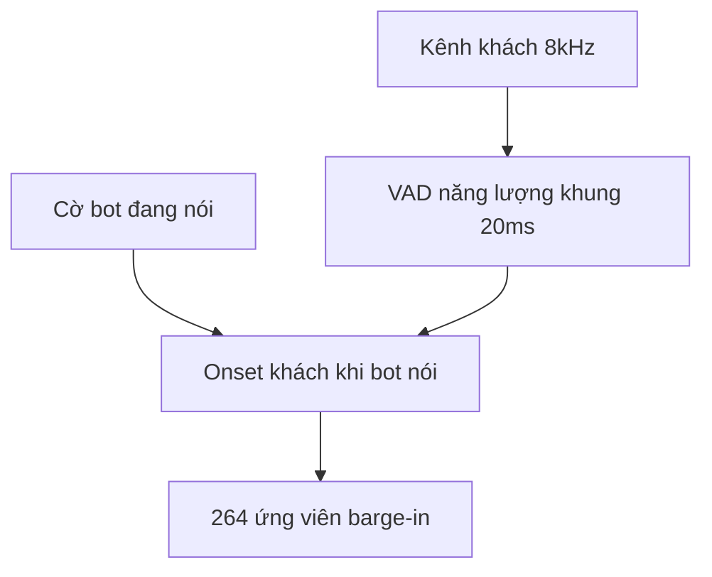
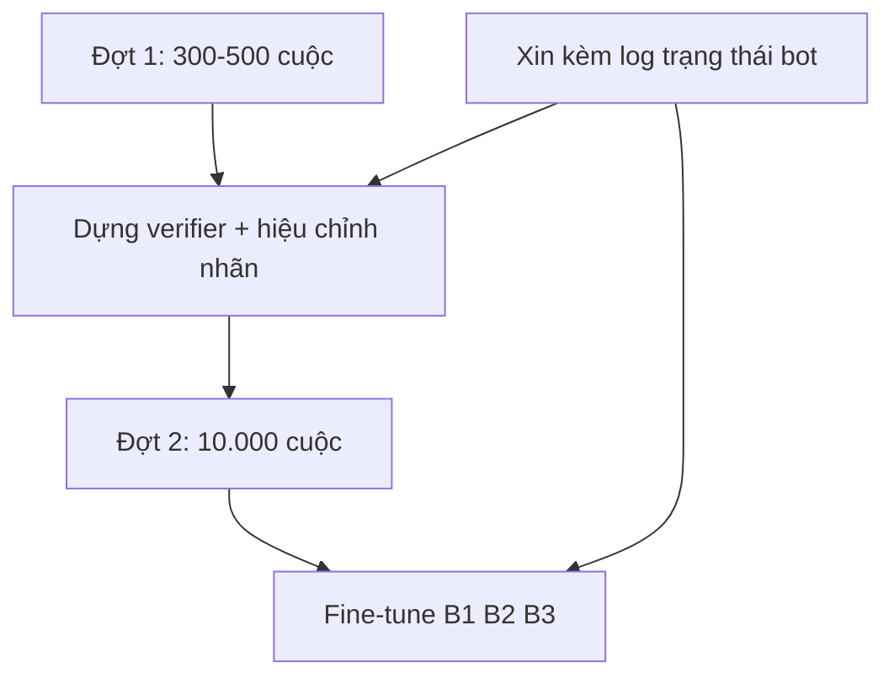

# 14.05 — Soi bộ audio FCI chia sẻ: barge-in đã nằm sẵn trong data

> **Vai trò:**
>
> Ghi lại kết quả đo trực tiếp trên bộ `data/audio_interrupt` mà team FCI chia sẻ.
>
> Chốt một điều: bộ audio này chính là loại data mà plan cũ tưởng phải tự sinh, nên đảo lại thứ tự ưu tiên.

---

## Glossary

- `barge-in` → **barge-in** → khách chen lời khi bot đang nói.
- `backchannel` → **backchannel** → tiếng đế "dạ, vâng, đúng rồi" báo đang nghe, không mang nội dung sửa.
- `VAD` → **Voice Activity Detection** → phát hiện khung có tiếng nói.
- `double-talk` → **double-talk** → hai kênh cùng có tiếng một lúc.
- `μ-law` → **G.711 mu-law** → chuẩn nén thoại 8kHz của tổng đài.
- `leg` → **call leg** → một chặng kết nối, mỗi bên một kênh riêng.
- `ASR` → **Automatic Speech Recognition** → nhận dạng tiếng nói thành chữ.
- `Otsu` → **Otsu threshold** → cách chọn ngưỡng tách hai cụm trên biểu đồ tần suất.
- `corr` → **correlation** → hệ số tương quan năng lượng giữa hai kênh.

---

## 1. Dẫn dắt bối cảnh

- **Bối cảnh gần:**
  - team FCI chia sẻ một thư mục `data/audio_interrupt` gồm 37 file ghi âm,
  - trong đó có một file được chỉ đích danh là tình huống barge-in rõ:
    bot nhận sai thông tin nên khách cuống cuồng đọc lại.
- **Nghịch lý cần chú ý:**
  - tài liệu `02_public_datasets.md` mục 5 vừa kết luận là tiếng Việt
    **không có** telephony hội thoại 8kHz và **không có** tập barge-in có nhãn mili-giây,
  - nhưng bộ audio vừa nhận, khi đo thật, lại **đúng là** loại data đó.

> Doc này ghi lại cách đo, con số thu được, và điều phải đổi trong kế hoạch sau khi có bằng chứng.
>
> Phần xin thêm data đặt riêng ở [../13_delivery_plan/01_fci_info_requests.md](../13_delivery_plan/01_fci_info_requests.md).

---

## 2. Bộ audio thật là gì

- **Định dạng đồng nhất cả 37 file:**
  - codec `pcm_mulaw`, tần số lấy mẫu 8000 Hz, **2 kênh**, tổng khoảng 57 phút,
  - đây đúng là dạng ghi âm tổng đài tách hai chặng, không phải file thu một micro.
- **Bằng chứng hai kênh tách thật, không phải mono nhân đôi:**
  - nếu là mono nhân đôi thì năng lượng hai kênh phải tương quan gần `+1.0`,
  - đo thực tế `corr` trung bình **−0,19**, và **29/36 file** mang dấu âm rõ,
  - dấu âm nghĩa là khi một bên nói thì bên kia im — đúng nhịp luân phiên agent với khách.
- **Cách gán vai kênh:**
  - callbot luôn mở lời chào trước, nên kênh active trong 4 giây đầu được gán là bot,
  - kiểm chéo bằng ASR ở mục 4 cho thấy phép gán này khớp nội dung hội thoại.

> Ghi chú lọc trùng:
>
> có một file `5b09f032...(1).wav` trùng khít bản gốc, đã loại khi thống kê, còn **36 file** đưa vào đo.

---

## 3. Đo được gì trên toàn bộ 36 file

- **Ba con số tổng:**
  - **264** sự kiện khách bắt đầu nói khi bot đang nói, tính theo VAD năng lượng,
  - **247** vùng double-talk kéo dài từ 0,25 giây trở lên,
  - tổng khoảng **2,9 phút** chồng lấn thật.
- **Khái niệm barge-in đo bằng năng lượng — ba lớp:**
  - ⚙️ **Cơ chế:**
    - chia mỗi kênh thành khung 20ms, tính năng lượng, lấy ngưỡng Otsu tách tiếng nói khỏi im lặng,
    - đánh dấu barge-in tại khung mà kênh khách vừa bật tiếng trong lúc kênh bot đang bật.
  - 🔍 **Cách nhận diện:**
    - trên dòng thời gian, đó là điểm dải khách khởi động chồng lên dải bot đang chạy.
  - 💡 **Ý nghĩa:**
    - mốc này là ứng viên "bot phải cân nhắc dừng", đầu vào cho bộ quyết định barge-in.
  - ⚠️ **Bẫy:**
    - năng lượng không phân biệt được tiếng nói thật với tiếng thở hay nhiễu,
    - nên 264 chỉ là **mức trần ứng viên**, không phải số barge-in thật; mục 4 lọc lại.

**Khung đọc sơ đồ:**

- **Đề bài:** rút ứng viên barge-in từ hai kênh mà chưa cần model nặng.
- **Giả định nền:** kênh khách đã tách sẵn theo leg, cờ bot đang nói suy từ kênh bot.
- **Cách đọc:** ứng viên sinh ra ở giao điểm "khách bật tiếng" và "bot đang nói"; đây là đầu vào thô cần lọc thêm.

---

## 4. Hướng B — đọc nội dung bằng ASR để lọc barge-in thật

- **Cách làm:**
  - cắt từng clip khách tại 39 mốc barge-in của file mẫu,
  - chạy FastConformer 114M bản callbot (`s3-fc115m-full.nemo`, chính model đã train của nhóm),
  - phân ba nhóm theo nội dung đọc được.
- **Kết quả lật một giả định — chỉ 44% là thật:**
  - **17 CONTENT** — barge-in mang nội dung, bot phải dừng, ví dụ đọc lại số hoặc "không phải không phải",
  - **5 BACKCHANNEL** — tiếng xác nhận ngắn như "đúng rồi", "dạ", không cần dừng hẳn,
  - **17 RỖNG** — không có tiếng nói đọc được, tức VAD năng lượng bắt nhầm,
  - nghĩa là năng lượng đơn thuần **over-detect khoảng 56%** số mốc.
- **Khái niệm "lọc bằng nội dung" — ba lớp:**
  - ⚙️ **Cơ chế:**
    - ASR biến clip khách thành chữ, rồi luật từ vựng chia nhóm theo có chữ số, có từ sửa, hay chỉ tiếng đế.
  - 🔍 **Cách nhận diện:**
    - clip rỗng chữ hoặc quá ngắn là ứng viên giả; clip có chuỗi số hoặc "không phải, sai" là barge-in thật.
  - 💡 **Ý nghĩa:**
    - chỉ nhóm CONTENT mới đáng để bot dừng TTS; tách được ba nhóm là tách được nhãn train cho ba bài con B1 B2 B3.
  - ⚠️ **Bẫy:**
    - transcript là bản thô, có lỗi nhỏ như "canh cước" thay cho "căn cước",
    - đủ để phân nhóm nhưng chưa phải nhãn vàng, còn cần nghe kiểm một lượt.
- **Bối cảnh cuộc gọi giải thích vì sao nhiều barge-in:**
  - đây là cuộc khóa thẻ tín dụng, bot xác minh danh tính,
  - ASR của bot FCI nghe nhầm mọi con số thành "4 năm" nên khách phải đọc lại liên tục,
  - FastConformer của nhóm đọc rõ tiếng khách, cho thấy ASR tốt hơn sẽ giảm hẳn kiểu lỗi này.

> Quan sát ghép:
>
> chất lượng ASR và tần suất barge-in gắn với nhau — ASR bot kém đẩy khách chen lời nhiều hơn.
>
> Nên bài turn-detection và bài ASR tiếng Việt không tách rời được về mặt trải nghiệm.

---

## 5. Điều phải đổi trong kế hoạch

- **Trước đây:**
  - renderer hai kênh là **nguồn chính** để có tập barge-in có nhãn, vì tin là không có data thật.
- **Bây giờ:**
  - data thật đã có, nhãn barge-in lấy gần như miễn phí từ chồng lấn hai kênh cộng một lượt ASR,
  - renderer đảo vai thành **nguồn phụ**, chỉ để nhân số lượng và kiểm soát biến như SIR, SNR, mức echo.
- **Việc mở ra ngay:**
  - lấy các mốc CONTENT làm tập test barge-in đầu tiên có mốc mili-giây thật,
    thay số latency mô phỏng mà `04_review_and_acceptance.md` nói là chưa cam kết được,
  - nghe kiểm để chốt ngưỡng VAD và tách backchannel khỏi barge-in thật cho bài B3.
- **Điểm mù còn lại:**
  - phép gán bot theo "ai chào trước" đúng 34/36 file, còn 2 file cần nghe xác nhận,
  - chưa xử lý echo; cần đo độ dội thật trên trunk trước khi giả định.

---

## 6. Ước lượng lượng data nên xin thêm

- **Đại lượng gốc đo được, quy về mỗi cuộc gọi:**
  - độ dài trung bình mỗi cuộc khoảng **1,6 phút**,
  - ứng viên barge-in khoảng **7,3 mốc mỗi cuộc**,
  - barge-in nội dung thật khoảng **2 tới 3 mốc mỗi cuộc** sau khi lọc bằng ASR,
  - ranh giới lượt cho bài EOU khoảng **10 tới 15 mốc mỗi cuộc**.
- **Suy ra sản lượng nhãn theo quy mô xin — dùng tỉ lệ đo thật:**

| Quy mô xin | Giờ audio | Barge-in nội dung | Ranh giới lượt EOU |
| --- | --- | --- | --- |
| 300 cuộc (pilot) | ~8 giờ | ~600 tới 900 | ~3.000 tới 4.500 |
| 3.000 cuộc | ~80 giờ | ~6.000 tới 9.000 | ~30.000 tới 45.000 |
| **10.000 cuộc** | **~265 giờ** | **~20.000 tới 30.000** | **~100.000 tới 150.000** |

- **Khuyến nghị mức xin — chia hai đợt:**
  - **Đợt 1 pilot khoảng 300 tới 500 cuộc:**
    - đủ dựng tập test vàng và hiệu chỉnh pipeline auto-label,
    - xác nhận phép tách kênh và gán vai bot đúng trên nhiều loại cuộc, chưa vội xin lớn.
  - **Đợt 2 khoảng 10.000 cuộc, đúng kỳ vọng đặt ra:**
    - đủ fine-tune cả ba bài con B1 B2 B3 với tách train, val, test đàng hoàng,
    - vượt mức này thì lợi ích biên giảm cho lần fine-tune đầu, để dành xin thêm khi cần robust.
- **Nhân giá trị mỗi cuộc — xin kèm log trạng thái, quan trọng hơn cả số lượng:**
  - ⚙️ **Cơ chế:**
    - nếu có log phiên của bot gồm câu TTS kèm mốc thời gian, giả thuyết ASR kèm điểm tin cậy, và sự kiện lượt,
    - thì nhãn thành **chính xác tuyệt đối** thay vì suy từ năng lượng như hiện tại.
  - 💡 **Ý nghĩa:**
    - một cuộc kèm log đáng giá bằng nhiều cuộc chỉ có audio, vì bỏ được bước đoán nhãn.
- **Xin kèm đa dạng, không chỉ số lượng:**
  - trải nhiều nghiệp vụ như đòi nợ, chăm sóc, chốt sale, khóa thẻ,
  - trộn cả cuộc nhiều barge-in như cuộc ASR lỗi lẫn cuộc bình thường,
  - trải giọng vùng miền và giới tính.

**Khung đọc sơ đồ:**

- **Đề bài:** đi từ một lát nhỏ để dựng cách đo, rồi mới xin lớn để train.
- **Giả định nền:** mỗi cuộc cho nhiều nhãn, và log trạng thái bot biến nhãn suy đoán thành nhãn chính xác.
- **Cách đọc:** pilot khóa được pipeline và niềm tin vào nhãn; đợt lớn mới đổ vào train; log bơm vào cả hai chặng.

---

## ✅ Tự kiểm nhanh

- **Vì sao chắc bộ audio là hai kênh tách thật?**
  

đáp án

  tương quan năng lượng hai kênh âm, trung bình −0,19 và 29/36 file âm rõ; mono nhân đôi thì phải gần +1,0.
  

- **Vì sao 264 không phải là số barge-in thật?**
  

đáp án

  đó là ứng viên đo bằng năng lượng; lọc bằng ASR chỉ còn khoảng 44% là nội dung thật, phần còn lại là rỗng và backchannel.
  

- **Nên xin bao nhiêu và theo đơn vị gì?**
  

đáp án

  pilot 300-500 cuộc để dựng verifier, rồi 10.000 cuộc để train ba bài con; xin kèm log trạng thái bot để có nhãn chính xác.
  

---

## Phụ lục — cách tái lập

- **Nguồn:** `fci_voice_agent/data/audio_interrupt/*.wav` (37 file, μ-law 8kHz 2 kênh).
- **Model ASR:** `kyle/vi-asr-fastconformer-114m` bản `s3-fc115m-full.nemo`, chạy CPU qua `nvidia_asr_nemo/deploy/asr_vi/infer.py`.
- **Script đo:** giải mã bằng ffmpeg, VAD năng lượng khung 20ms, ngưỡng Otsu, gộp đoạn cách ≤0,3 giây; cắt clip theo mốc barge-in rồi transcribe và phân nhóm bằng luật từ vựng.
- **Bảng số chi tiết:** toàn bộ bảng 36 file và bảng phân nhóm 39 mốc barge-in ở [06_bargein_measurements.md](06_bargein_measurements.md).
