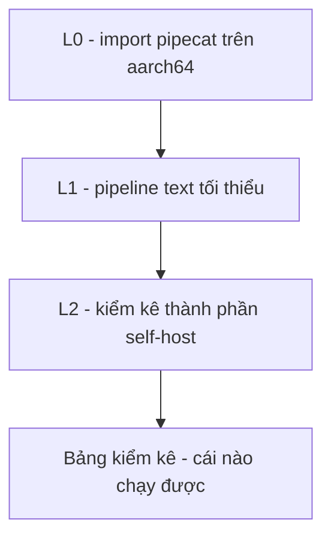

# Exp 01 — Pipecat smoke trên DGX · SPEC

**Trạng thái:** đã chạy thật (2026-06-26) · **Môi trường:** DGX Spark GB10 (aarch64) · **Loại:** smoke + kiểm kê, KHÔNG load-test

---

## 1. Mục tiêu (đăng ký exp làm gì)

- Chạy thử **Pipecat** lần đầu trên DGX để xác nhận engine điều phối chạy nổi trên `aarch64`/GB10.
- **Kiểm kê** thành phần nào self-host được ngay — biến các biến số "blog/vendor ⚠️ chưa xác minh" trong `docs/03–06` thành "đã tự chạy / chưa có".
- KHÔNG đo CCU=100 / throughput (DGX Spark là máy edge 1 con, không phải AI Factory).

## 2. Flow



Mỗi mức tự bọc try/except, in lỗi thật thay vì crash.

| Mức | Kiểm | PASS khi |
|---|---|---|
| **L0** | python/arch + `import pipecat` | machine = aarch64, import OK, in version |
| **L1** | pipeline text tối thiểu chạy hết | text đi qua đủ chặng, kết thúc sạch (EndFrame) |
| **L2** | probe import từng thành phần (Silero/turn/onnx/torch/whisper/NeMo/TTS/vLLM) | bảng ✅/❌ + providers onnx + torch CUDA |

## 3. Model & thành phần

- **Pipecat** (`pipecat-ai`, base CỐ Ý tối thiểu — chỉ engine, chưa kéo model nặng).
- Cài qua `uv sync` (src-layout). KHÔNG fork pipecat, phụ thuộc qua `uv add`.
- Đồng bộ code = **rsync** (`sync_to_dgx.sh`), KHÔNG git push. Remote `dgx:~/fci_voice_agent/` (login `dgxadmin`).

## 4. Input / Output

- **Input:** không có dữ liệu ngoài; chỉ frame text tổng hợp trong script.
- **Output:** `results/smoke_<timestamp>.txt` (gitignore) — bảng kiểm kê thành phần.

## 5. Tiêu chí nghiệm thu (KỲ VỌNG)

| Hạng mục | Kỳ vọng trước khi chạy |
|---|---|
| L0 import pipecat trên aarch64 | PASS (engine thuần Python, ít rủi ro wheel) |
| L1 pipeline tối thiểu | PASS — nếu FAIL thì lỗi hé lộ API thật của bản đã cài để khớp lại `pipeline/build.py` |
| L2 các model nặng (torch/whisper/NeMo/TTS/vLLM) | phần lớn **❌ ở lần đầu** (base tối thiểu, đúng dự kiến) — mỗi ❌ = 1 việc `uv add`/wheel arm64 |
| L2 VAD/turn | chưa rõ — đây là biến cần kiểm kê |

## 6. Cách chạy

```bash
# máy local (sau dgx-start để có token Access)
bash experiments/01_pipecat_dgx_smoke/sync_to_dgx.sh
ssh dgx 'cd fci_voice_agent && bash experiments/01_pipecat_dgx_smoke/setup_dgx.sh'
```
