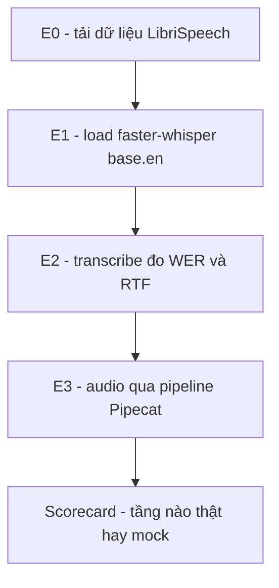

# Exp 02 — Test thông luồng tự động (English STT + WER) · SPEC

**Trạng thái:** đã chạy thật (2026-06-26) · **Môi trường:** DGX GB10 (STT chạy CPU) · **Loại:** đo độ mature có số khách quan

---

## 1. Mục tiêu (đăng ký exp làm gì)

- Chạy tự động test-case audio THẬT qua hệ thống, chấm điểm hệ mature đến đâu.
- Lấy **số đo khách quan đầu tiên (WER)** bằng dataset tiếng Anh sẵn (LibriSpeech dummy) làm chuẩn.
- STT đi trước (viên gạch nền + cho WER); LLM/TTS để **mock**, scorecard ghi rõ "chưa thật" để không tự huyễn hoặc về độ mature.
- ⚠️ Đây là **English 16kHz**, chưa phải tiếng Việt / telephony 8kHz (bước sau).

## 2. Flow



| Mức | Kiểm | Ý nghĩa |
|---|---|---|
| **E0** | tải N=10 case (audio + transcript) | dataset + egress HF + decode ok? |
| **E1** | load faster-whisper base.en | model chạy được trên máy? |
| **E2** | transcribe thẳng → **WER + RTF** | ← con số mature của STT |
| **E3** | đẩy audio qua **pipeline Pipecat** → text | orchestration mang được frame audio thật? |

Cuối in **SCORECARD**: tầng nào thật / mock / chưa có.

## 3. Model & thành phần

- **STT = faster-whisper base.en** (CTranslate2), chạy **CPU int8** — KHÔNG cần torch/CUDA (hợp GB10 lúc này).
- Adapter `src/fci_voice/stt/faster_whisper_stt.py`.
- **Dataset** = `hf-internal-testing/librispeech_asr_dummy`, decode bằng **soundfile** (KHÔNG dùng datasets-auto-decode để né librosa/numba arm64).
- Deps: `uv sync --extra exp02` (ctranslate2 / faster-whisper / datasets, wheel arm64).
- LLM/TTS = **MOCK** (chưa serving / chưa model).

## 4. Input / Output

- **Input:** 10 clip audio + transcript chuẩn (LibriSpeech dummy).
- **Output:** `results/e2e_<ts>.txt` — WER, RTF, scorecard tầng.

## 5. Tiêu chí nghiệm thu (KỲ VỌNG)

| Hạng mục | Kỳ vọng |
|---|---|
| E0 tải + decode | PASS (egress HF ok, soundfile decode arm64) |
| E1/E2 STT chạy | PASS |
| **WER** | vài % (Whisper base.en trên LibriSpeech thường ~4-5%) |
| **RTF** | < 1 (CPU xử lý nhanh hơn realtime) |
| E3 audio qua Pipecat | PASS — khung lắp ráp đúng |
| LLM/TTS | ⬜ MOCK (cố ý, không tính vào mature) |

## 6. Cách chạy

```bash
bash experiments/01_pipecat_dgx_smoke/sync_to_dgx.sh
ssh dgx 'cd fci_voice_agent && bash experiments/02_e2e_flow_test/setup_dgx.sh'
```
