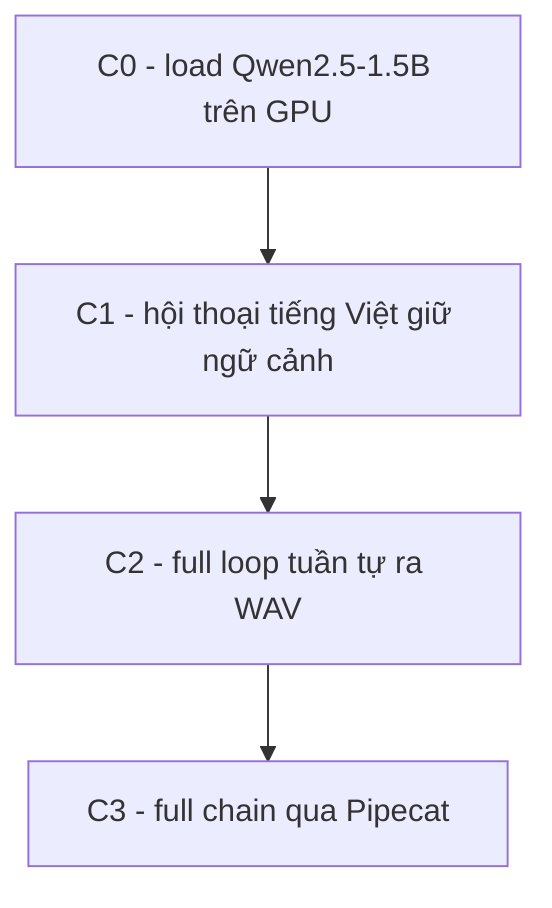

# Exp 03 — Full loop + hội thoại cơ bản (tiếng Việt) · SPEC

**Trạng thái:** đã chạy thật (2026-06-26) · **Môi trường:** DGX GB10 (LLM chạy GPU) · **Loại:** khép vòng voice-agent

---

## 1. Mục tiêu (đăng ký exp làm gì)

- Khép vòng voice-agent: cài **LLM nhỏ open-source** chạy GPU trên DGX, test **hội thoại cơ bản giữ ngữ cảnh**, rồi chạy **full loop audio → STT → LLM → TTS → audio**.
- Xác nhận đường **torch cu130 dùng được GPU GB10** (không chỉ CPU).
- ⚠️ STT vẫn English 16kHz; LLM/hội thoại đã tiếng Việt. Telephony 8kHz là bước sau.

## 2. Flow



| Mức | Kiểm |
|---|---|
| **C0** | load Qwen2.5-1.5B trên GPU (báo device/dtype) |
| **C1** | hội thoại CSKH tiếng Việt 3 lượt — kiểm tra **giữ ngữ cảnh** |
| **C2** | full loop tuần tự: audio → STT → LLM → TTS → WAV |
| **C3** | full chain qua **pipeline Pipecat**: audio → STT proc → LLM proc → TTS proc |

## 3. Model & thành phần

- **LLM = Qwen2.5-1.5B-Instruct** qua `transformers` + **torch cu130** → GPU GB10. Nhỏ, instruct tốt, biết tiếng Việt cơ bản. Adapter `src/fci_voice/agent/llm.py`.
- **STT = faster-whisper base.en** (CPU, từ exp02).
- **TTS = Piper** (CPU/ONNX), adapter `src/fci_voice/tts/piper_tts.py`; chưa nạp voice .onnx thì ra **WAV placeholder** để vòng vẫn khép.
- Deps: `uv sync --extra exp03` + index torch cu130 (`[[tool.uv.index]] pytorch-cu130`).

## 4. Input / Output

- **Input:** audio English (LibriSpeech) cho C2/C3; câu hội thoại CSKH vi cho C1.
- **Output:** `results/` — log hội thoại + WAV reply.

## 5. Tiêu chí nghiệm thu (KỲ VỌNG)

| Hạng mục | Kỳ vọng |
|---|---|
| C0 device | **cuda** (torch cu130 dùng GPU GB10) |
| C1 hội thoại | mạch lạc + lượt sau hiểu ngữ cảnh lượt trước (giữ ngữ cảnh) |
| C2/C3 vòng khép | PASS — audio thật chảy hết chuỗi (C3 qua orchestration) |
| TTS | tiếng thật nếu có voice; nếu không, placeholder (chấp nhận, ghi rõ) |
| Latency | (chưa đặt ngưỡng ở exp này — đo định lượng ở exp04) |

## 6. Cách chạy

```bash
bash experiments/01_pipecat_dgx_smoke/sync_to_dgx.sh
ssh dgx 'cd fci_voice_agent && bash experiments/03_full_loop_conversation/setup_dgx.sh'
# có voice Piper thật:
#   export FCI_PIPER_MODEL=/đường/dẫn/voice.onnx  trước khi chạy
```
