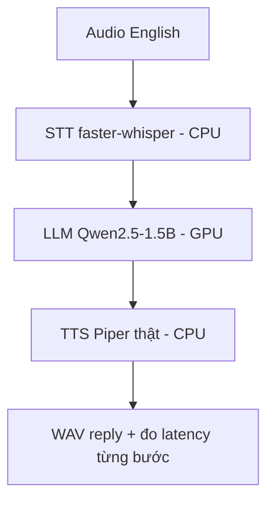

# Exp 04 — Full loop English trọn vẹn + đo latency từng step · SPEC

**Trạng thái:** đã chạy thật (2026-06-26) · **Môi trường:** DGX GB10 (STT/TTS CPU, LLM GPU) · **Loại:** thông luồng có TTS thật + đo latency

---

## 1. Mục tiêu (đăng ký exp làm gì)

- Khép vòng English TRỌN VẸN với **TTS Piper thật** (ra WAV tiếng nói thật, không placeholder).
- **Đo latency từng step** (STT / LLM / TTS) + tổng + qua Pipecat → biết bottleneck nằm đâu.
- Là bản English-hoàn-chỉnh trước khi chuyển trục sang tiếng Việt + 8kHz.

## 2. Flow



- Chạy 3 case LibriSpeech (sau khi warmup LLM), `max_new_tokens=64`.
- Mỗi case: audio → **STT** → **LLM** → **TTS thật** → WAV; ghi thời gian từng chặng.
- Đối chiếu thêm nhánh **qua Pipecat** (STT+LLM) so với tuần tự.

## 3. Model & thành phần

- **STT = faster-whisper base.en** (CPU).
- **LLM = Qwen2.5-1.5B-Instruct** (GPU GB10, torch cu130).
- **TTS = Piper THẬT**: voice `en_US-lessac-medium` tải từ `rhasspy/piper-voices` qua `hf_hub_download`; piper-tts 1.4.2 synth trên arm64 (KHÔNG cần espeak ngoài).
- Script `run_e2e_en.py`.

## 4. Input / Output

- **Input:** 3 clip audio English (LibriSpeech, dài 5–12s).
- **Output:** `results/` — `reply_*.wav` (tiếng thật) + bảng latency từng step.

## 5. Tiêu chí nghiệm thu (KỲ VỌNG)

| Hạng mục | Kỳ vọng |
|---|---|
| TTS Piper thật | ra WAV có tiếng nói thật (không placeholder) |
| Vòng audio→STT→LLM→TTS | PASS hết lượt, cả tuần tự lẫn qua Pipecat |
| Latency từng step | đo được số tách bạch STT/LLM/TTS để lộ bottleneck |
| LLM output | mạch lạc, đúng nội dung clip |
| ⚠️ Lưu ý diễn giải | số là OFFLINE tuần-tự cả-câu, KHÔNG phải latency realtime |

## 6. Cách chạy

```bash
bash experiments/01_pipecat_dgx_smoke/sync_to_dgx.sh
ssh dgx 'cd fci_voice_agent && bash experiments/04_english_e2e_latency/setup_dgx.sh'
```
